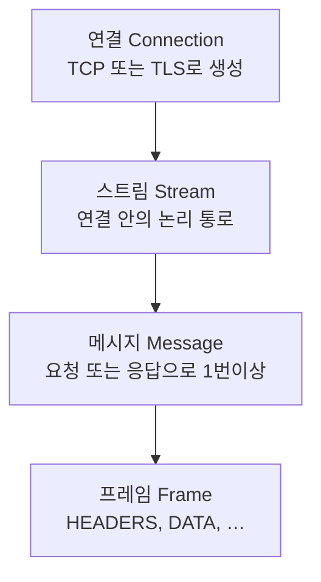
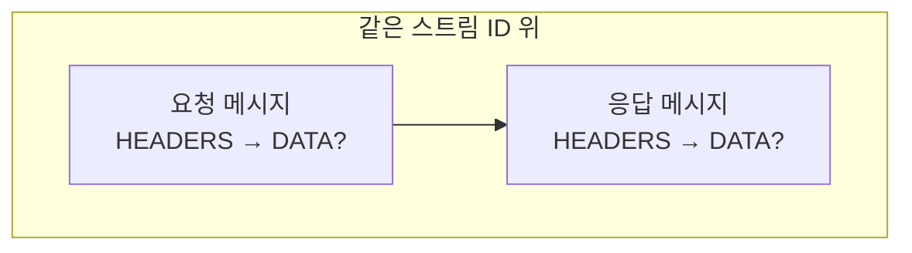

# 서론
HTTP2는 HTTP/1.1을 업데이트하면서 많이 바꾼 점을 더 다듬는 방향이었습니다. 
- HTTP 1에서 HTTP/1.1 업데이트 하면서 HTTP Pipelining을 추가했었지만 그래도 요청 동시성 문제를 남았었습니다
  - HTTP Pipelining: HTTP/1.1에서 사용했었지만 응답 순서 보장 때문에, 요청이 연달아 들어와도 서버는 요청 순서대로 응답해야하기에, 뒤 요청은 대기 상태가되는 문제를 가짐
- HOL(head of line blocking) 문제도 있었고
  - HOL: HTTP/1.1 파이프라인에서 응답 순서 보장되기 때문에 응답이 크거나 느릴 때 뒤 응답은 대기되는 문제
  - HTTP 파이프라인에서 응답은 순서대로 처리해야하기에 불필요한 블로킹이 생기는데, HTTP/2에서 우선순위와 스트림 멀티플렉싱 등이 추가해서 어느 정도 완화했지만, HTTP/2도 TCP 하나를 공유하므로 HOL은 발생하긴 합니다, 하지만 이 부분은 HTTP/3로 이어지죠 
- HTTP 헤더 필드는 중복도 있고 불필요한 데이터들도 많아서 불필요한 네트워크 트래픽이 발생했습니다
- TCP 혼잡 윈도우(Congestion Window)가 새 TCP 연결에서 상황에 맞지 않게 조절되어 지연을 발생시킬 수 있었죠.
  - TCP 혼잡 윈도우(Congestion Window)는 송신자가 네트워크 혼잡을 피하기 위해 ACK 되지 않은 채 올려둘 수 있는 바이트의 상한을 제어하는 변수

HTTP/2는 최적화 매핑을 통해 이 문제를 해결했는데, HTTP 의미론(HTTP Semantics)을 기본 연결에 적용하는 방향으로 단일 TCP 연결 안에서 여러 요청과 응답을 번갈아 가며 전송할 수 있게해서 해결했습니다.
즉 불필요한 연결을 줄이고 연결을 HTTP/1.1보다 길게 가져갑니다.
또 HPACK으로 HTTP 헤더를 압축하여 효율적으로 사용하면서, 우선순위 지정을 허용하여 중요도가 높은 요청을 우선적으로 처리할 수 있게 함으로써 요청 처리 시간이 빨라져 성능이 더욱 향상되었죠.

결과적으로 HTTP/2는 생성된 프로토콜이 더 적은 수의 요소로 네트워크 친화적이면서, TCP 연결을 1.1에 비해 더 오래 연결하고 다른 흐름과의 경쟁이 적게 가져갈 수 있게 됩니다.

## 핵심용어

- client:  HTTP/2 연결을 시작하는 엔드포인트. 클라이언트 HTTP 요청을 보내고 HTTP 응답을 받음
- connection:  두 엔드 포인트 간의 전송 계층 연결
- connection error:  HTTP/2 전체에 영향을 미치는 에러
- endpoint:  연결을 위한 서버 또는 클라이언트
- frame:  HTTP/2 내에서 가장 작은 통신 단위, 연결은 헤더와 가변 길이 시퀀스로 구성되고 frame type에 따라 구성되는 Octet(8bit)
- peer: 특정 end point를 의미할 때 사용하며 기본 주체와 원격에 있는 end point를 의미
- receiver: 프레임을 수신하는 end point
- sender: 프레임을 전송하는 end point
- server:  HTTP/2 연결을 수락하는 엔드포인트. 서버 HTTP 요청을 수신하고 HTTP 응답을 전송
- stream:  HTTP/2 연결 내에서 프레임이 양방향으로 흐르는 것을 의미
- stream error:  개별 HTTP/2 스트림에서 오류가 발생했습니다.
- gateway(reverse proxy): 요청을 처리하고 다른 서버로 수신되는 요청을 전달하는데, 레거시 시스템이나 신뢰할 수 없는 시스템을 캡슐화 하는 데 자주 사용
- intermediar: server와 clinet를 각각 다른 시간대에서 접속 되게 해줌
- tunnel: 방화벽이나 NAT 등을 제한된 네트워크 환경에서 HTTP/HTTPS 프로토콜을 사용하여 데이터를 캡슐화하고 외부 서버와 통신하는 기능
- payload body: HTTP 메시지 본문으로 전송되는 데이터가 있는 부분

## HTTP/2 연결 

HTTP/2인지를 구분하는 법은 TSL에서 h2 또는 h2c 문자열이 있는 지 보면 됨
이 식별자가 있을 시 업그레이드 요청으로  HTTP2로 업그레이드를 요청하는 HTTP/1.1 요청을 생성하는 데 이게 완료되면 이전 연결 사용이 차단 될 수도 있습니다.

만약 서버가 HTTP2를 지원못하면 서버는 업그레이드 필드의 h2 토큰을 무시해야 함
토큰에 h2가 있다는 것은 TLS를 통한 HTTP/2를 의미하기 때문이고 다음 같은 응답을 보냄

``` go
   HTTP/1.1 200 OK
     콘텐츠 길이: 243
     콘텐츠 유형: 텍스트/html
```

HTTP/2를 지원하지 않으면 다음처럼 결과를 반환합니다.

``` go
     HTTP/1.1 200 OK
     콘텐츠 길이: 243
     콘텐츠 유형: 텍스트/html
```

이제는 HTTP 에서의 HTTP/2 요청은 보안의 이유로 HTTPS 이외에서의 HTTP/2 업그레이드를 지원하지 않을 뿐더러 오늘날 대부분의 웹 사이트는 HTTPS(TSL) 위에서 HTTP/2를 제공합니다.

업그레이드를 테스트 해본다면 TLS 핸드쉐이크 과정 중 ALPN(Application-Layer Protocol Negotiation)에서 결과 차이가 나타는데, 이유는 TCP 연결이 맺어질 때는 오직 연결이 가능한지만을 파악하기에 프로토콜의 정보를 파악하지 않습니다. 그래 애플리케이션 레이어 까지 가야하죠.

그래서 처음 TSL 핸드쉐이크로 암호화 연결 과정을 거칠 때 ALPN으로 패킷 속에 HTTP/2 지원에 대한 정보를 담아서 보냅니다, 만약 이렇게 하지 않는다면 TCP 연결 후 부가적으로 한번 더 요청을 주고 받아서 체크하는 공수가 발생하죠.

아래는 구글에 http2 요청을 보낸 내용인데, 아래 내용을 보시면
- <b>ALPN: curl offers h2,http/1.1</b>: 이걸로 요청을 통해 서버한테 다음 프로토콜 지원하는 지 문의합니다.
- <b>SSL connection using TLSv1.3</b>: TSL 1.3를 사용해서 연결이 되었고
- <b>ALPN: server accepted h2</b>: 서버는 이를 h2를 수락했다고 정보를 반환해줍니다.

```
jiseunglyeol@jiseunglyeol-ui-MacBookAir ~ % curl -vI --http2 https://www.google.com
* Host www.google.com:443 was resolved.
* IPv6: (none)
* IPv4: 142.251.150.119, 142.251.152.119, 142.251.157.119, 142.251.153.119, 142.251.154.119, 142.251.151.119, 142.251.155.119, 142.251.156.119
*   Trying 142.251.150.119:443...
* Connected to www.google.com (142.251.150.119) port 443
* ALPN: curl offers h2,http/1.1
* (304) (OUT), TLS handshake, Client hello (1):
*  CAfile: /etc/ssl/cert.pem
*  CApath: none
* (304) (IN), TLS handshake, Server hello (2):
* (304) (IN), TLS handshake, Unknown (8):
* (304) (IN), TLS handshake, Certificate (11):
* (304) (IN), TLS handshake, CERT verify (15):
* (304) (IN), TLS handshake, Finished (20):
* (304) (OUT), TLS handshake, Finished (20):
* SSL connection using TLSv1.3 / AEAD-CHACHA20-POLY1305-SHA256 / [blank] / UNDEF
* ALPN: server accepted h2
```

HTTP/2를 지원하지 않는 사이트에 경우 다음처럼 <b>ALPN: server accepted http/1.1</b>로 연결이 완료되죠.
```
jiseunglyeol@jiseunglyeol-ui-MacBookAir ~ % curl -vI --http2 https://betree.co.kr/kr
* Host betree.co.kr:443 was resolved.
* IPv6: (none)
* IPv4: 27.102.82.140
*   Trying 27.102.82.140:443...
* Connected to betree.co.kr (27.102.82.140) port 443
* ALPN: curl offers h2,http/1.1
* (304) (OUT), TLS handshake, Client hello (1):
*  CAfile: /etc/ssl/cert.pem
*  CApath: none
* (304) (IN), TLS handshake, Server hello (2):
* (304) (IN), TLS handshake, Unknown (8):
* (304) (IN), TLS handshake, Certificate (11):
* (304) (IN), TLS handshake, CERT verify (15):
* (304) (IN), TLS handshake, Finished (20):
* (304) (OUT), TLS handshake, Finished (20):
* SSL connection using TLSv1.3 / AEAD-CHACHA20-POLY1305-SHA256 / [blank] / UNDEF
* ALPN: server accepted http/1.1
```

# Frame
HTTP/2 연결이 설정되면 엔드포인트는 프레임을 교환하는 작업을 할 수 있습니다.

## 프레임 (Frame)
프레임 구조 구조: [프레임 헤더 (9옥텟)] + [페이로드 (N옥텟)]
우리가 네트워크 탭에서 보는 최소 전송 단위가 바로 이 프레임입니다.

## 프레임 헤더 (Frame Header)
모든 프레임은 프레임 헤더로 시작합니다, 프레임 종류가 어떤거든 이건 바뀌지 않죠
Length(3 byte), Type(1 byte), Flags(1 byte), R(1 bit) + Stream ID(31 bit) = 총 9옥텟

```
+-----------------------------------------------+
|                 Length (24)                   |
+---------------+---------------+---------------+
|   Type (8)    |   Flags (8)   |
+-+-------------+---------------+-------------------------------+
|R|                 Stream Identifier (31)                      |
+=+=============================================================+
|                   Frame Payload (0...)                      ...
+---------------------------------------------------------------+
```
프레임 헤더의 필드는 다음과 같이 정의됩니다.
- Length: 페이로드의 길이를 부호 없는 정수로 표현한 값으로, 부호 없는 24비트 정수입니다. 송신자는 수신자가 더 큰 값을 설정하지 않은 한 더 큰 값을 전송하지 않습니다.
- Type: 프레임의 8비트 유형으로 페이로드의 해석 방식을 달리 합니다, 표준에 없는 유형은 수신 측에서 무시하고 넘겨야 합니다.
- Flags: 프레임 유형에 맞게 사용되는 부울 플래그를 담은 8비트 필드로 특정 프레임 유형에 대해 정의된 의미가 없는 플래그, 전송 시에는 이를 설정하지 않은 상태(0x0)로 둡니다.
- R: 예약된 1비트 필드입니다로 의미는 없지만 반드시 0으로 존재해야하며, 수신시는 이를 무시합니다, 확장성 및 32비트로 맞추기 위한 비트입니다.
- Stream Identifier: 스트림을 가리키는 부호 없는 31비트 정수입니다.
  - 0x0은 연결 전체에 해당하는 프레임을 개별 요청
  - 응답 스트림은 0이 아닌 스트림 ID가 붙음
- Frame Payload: 구조와 의미는 Types에 따름

## 프레임 타입 (Frame Type)
RFC 7540에 정의된 프레임 종류와 역할 (스트림 ID `0`은 **연결 전체**용)
모든 프레임은 프레임 헤더를 제외하곤 형식이 다릅니다, 타입에 딸라서 페이로드 부분이 아래처럼 달라지죠
즉 프레임 공통 헤더를 파싱한 후 타입을 보고 페이 로드를 아래처럼 사용합니다.

| Type (hex) | 이름 | 특징 / 용도 |
|------------|------|-------------|
| `0x0` | DATA | HTTP **본문** 옥텟. 같은 스트림에 여러 번 올 수 있음. |
| `0x1` | HEADERS | **요청/응답 헤더**(HPACK). 헤더가 크면 `CONTINUATION`으로 이어짐. |
| `0x2` | PRIORITY | 스트림 **우선순위**를 바꿀 때(전용 프레임). |
| `0x3` | RST_STREAM | 스트림 **강제 종료**(오류·취소). 해당 스트림만 영향. |
| `0x4` | SETTINGS | 연결 **파라미터** 협상. 스트림 ID는 **반드시 0**. |
| `0x5` | PUSH_PROMISE | **서버 푸시**용: 푸시할 스트림·헤더를 미리 알림. |
| `0x6` | PING | RTT 측정·연결 확인. 스트림 ID **0**, ACK 플래그로 응답. |
| `0x7` | GOAWAY | **연결 종료 예고**(마지막으로 처리한 스트림 ID 등). 스트림 ID **0**. |
| `0x8` | WINDOW_UPDATE | **흐름 제어** 윈도 증가(연결 또는 특정 스트림). |
| `0x9` | CONTINUATION | 직전 `HEADERS` / `PUSH_PROMISE`에 이어지는 **헤더 조각**. |

# Binary Framing Layer

HTTP/2에서 TCP(실무에서는 대개 TLS) 위로 오가는 바이트를 고정 형식의 프레임으로 나누고, 그 프레임이 어느 스트림에 속하는지를 규정하는 레이어입니다, 메서드·상태 코드·헤더 필드 이름 같은 **HTTP 의미(semantics)** 자체는 RFC 9110 등에서 정의되고, HTTP/2는 “그 메시지를 어떤 순서로, 어떤 단위로 실어 보낼지”를 정의하는 프로토콜이다 보시면 됩니다.

## Request/Response
보통 하나의 HTTP 요청과 그에 대한 HTTP 응답은 같은 스트림 ID 위에서 주고받습니다.
HTTP/1.1에서는 응답, 요청이 별개의 메시지로 분리되었지만 HTTP/2에서는 프레임을 통해 요청, 응답을 하나로 묶을 수 있죠.

아래는 연결 -> 스트림 -> 메시지 -> 프레임으로 큰 단위에서 작은 단위를 표현했습니다.



요청과 응답에서는 항상 HEADERS(HPACK)가 있고 DATA는 본문이 있을 경우 같은 스트림에서 이어집니다, 옵션인거죠 

<hr/>

네트워크 상에서의 흐름은 다음처럼 이해하시면 됩니다.
- **요청**: 클라이언트가 연 스트림에 `HEADERS`(+ 필요 시 `CONTINUATION`)로 메타데이터를 보내고, 본문이 있으면 같은 스트림에 `DATA`가 이어집니다.
- **응답**: 서버는 그 스트림과 동일한 ID로 `HEADERS`와 선택적 `DATA`를 응답을 전달해줍니다.
- **연결 전체용 제어**: `SETTINGS`, `PING`, `GOAWAY` 등은 스트림 ID 0으로 전송됩니다.

네트워크에서 보이는 최소 단위는 **프레임**이지만, 애플리케이션 관점의 Request/Response는 스트림 단위로 여러 개의 프레임이 묶여서 나타납니다.

# Streams

스트림은 하나의 HTTP/2 연결 안에서 오가는 프레임들의 독립적이고 양방향인 순서 있는 흐름입니다. 클라이언트와 서버는 같은 TCP(또는 TLS) 연결 위에 여러 스트림을 동시에 두고, 스트림마다 다른 대화를 진행할 수 있습니다.

- 멀티플렉싱 (Multiplexing): 연결 하나에 동시에 열린 스트림이 여럿일 수 있고, 여러 스트림의 프레임은 전송 순서대로 와이어에 인터리빙되는데, 이를 통해 한 스트림이 느려도 다른 스트림을 받을 수 있죠
  - 와이어(wire): 실제로 TCP/TLS 세션 위를 오가는 바이트로, 소켓으로 주고받는 전송 계층 데이터를 의미합니다.
  - 인터리빙(interleaving): 여러 스트림의 프레임을 시간 순으로 한 줄기 바이트 스트림에 끼워 넣는 것입니다.
- 스트림 개설: 일반 요청은 클라이언트가 스트림을 열고, 서버 푸시 등은 서버가 스트림을 열 수 있습니다. 양 끝점이 같은 스트림을 통해 주고받습니다.
- 스트림 우선순위: PRIORITY 프레임이나 HEADERS에 붙는 우선순위 정보로 스트림 간 의존 관계·가중치를 알릴 수 있습니다. 같은 스트림 안의 프레임 순서와는 다른 이야기이고, 상대에게 주는 힌트에 가까워 결과를 보장하지 않으며 구현에 따라 체감 효과는 달라질 수 있습니다.
- 종료: 클라이언트나 서버 어느 쪽에서든 스트림을 닫을 수 있습니다(`RST_STREAM`, `END_STREAM` 등).
- 순서: 같은 스트림 안에서는 프레임 순서가 중요합니다. 수신자는 그 스트림에 대해 받은 순서대로 해석하며, 특히 `HEADERS`와 `DATA`의 상대적 순서는 HTTP 메시지 의미에 영향을 줍니다. 서로 다른 스트림끼리의 프레임 순서는 섞여도 됩니다.
- 식별: 스트림은 31비트 부호 없는 정수 ID로 구분합니다. ID는 그 스트림을 시작한 쪽이 할당합니다. 클라이언트가 시작한 스트림은 홀수 ID, 서버가 시작한 스트림은 짝수 ID입니다.

## Stream states
스트림 상태와 전이를 그린 라이프사이클 다이어그램입니다, 각각의 스트림은 아래 사이클을 타죠.
즉 스트림이 어떤 이벤트로 idle(default) -> open -> half closed -> closed 로 바뀌는 지를 설명합니다.

상태가 바뀔 때 일어나는 이벤트들
- H: HEADERS 프레임을 보냈다/받았다는 뜻(다이어그램에 send H / recv H처럼 적혀 있음).
- ES: 어떤 프레임에 붙는 END_STREAM 플래그(스트림의 한쪽 방향 끝냄).
- R: RST_STREAM 프레임으로 스트림을 끊음.
- PP: PUSH_PROMISE 프레임(푸시로 예약된 스트림 쪽 전이).

스트림의 상태는 네모 박스로 표시됩니다.

```text
                         +--------+
                 send PP |        | recv PP
                ,--------|  idle  |--------.
               /         |        |         \
              v          +--------+          v
       +----------+          |           +----------+
       |          |          | send H /  |          |
,------| reserved |          | recv H    | reserved |------.
|      | (local)  |          v           | (remote) |      |
|      +----------+          |           +----------+      |
|          |             +--------+             |          |
|          |     recv ES |        | send ES     |          |
|   send H |     ,-------|  open  |-------.     | recv H   |
|          |    /        |        |        \    |          |
|          v   v         +--------+         v   v          |
|      +----------+          |           +----------+      |
|      |   half   |          |           |   half   |      |
|      |  closed  |          | send R /  |  closed  |      |
|      | (remote) |          | recv R    | (local)  |      |
|      +----------+          |           +----------+      |
|           |                |                 |           |
|           | send ES /      |       recv ES / |           |
|           | send R /       v        send R / |           |
|           | recv R     +--------+   recv R   |           |
| send R /  `----------->|        |<-----------'  send R / |
| recv R                 | closed |               recv R   |
 `---------------------->|        |<----------------------'
                          +--------+
```

# Multiplexing


# Server Push (서버 푸시) 