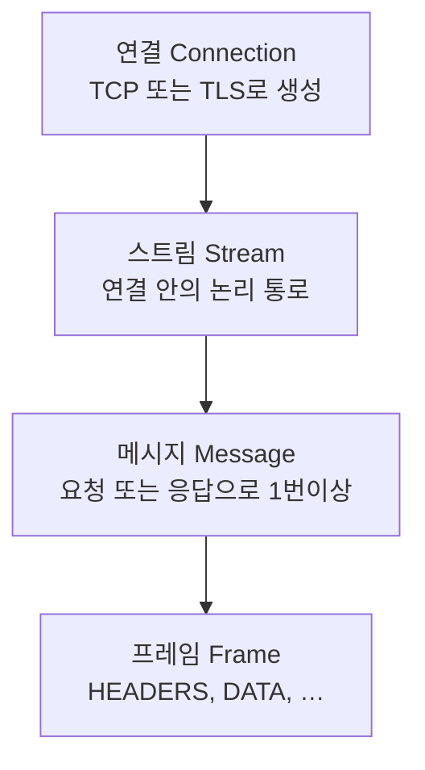
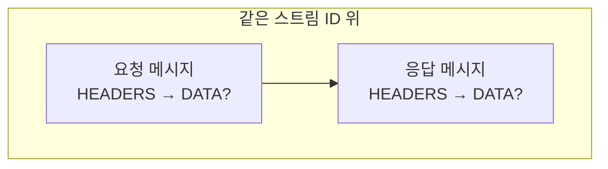

# 서론
HTTP/2는 HTTP/1.1을 업데이트하면서 많이 바꾼 점을 더 다듬는 방향이었습니다. 
- HTTP 1에서 HTTP/1.1 업데이트 하면서 HTTP Pipelining을 추가했었지만 그래도 요청 동시성 문제를 남았었습니다
  - HTTP Pipelining: HTTP/1.1에서 사용했었지만 응답 순서 보장 때문에, 요청이 연달아 들어와도 서버는 요청 순서대로 응답해야하기에, 뒤 요청은 대기 상태가되는 문제를 가짐
- HOL(head of line blocking) 문제도 있었고
  - HOL: HTTP/1.1 파이프라인에서 응답 순서 보장되기 때문에 응답이 크거나 느릴 때 뒤 응답은 대기되는 문제
  - HTTP 파이프라인에서 응답은 순서대로 처리해야하기에 불필요한 블로킹이 생기는데, HTTP/2에서 우선순위와 스트림 멀티플렉싱 등이 추가해서 어느 정도 완화했지만, HTTP/2도 TCP 하나를 공유하므로 HOL은 발생하긴 합니다, 하지만 이 부분은 HTTP/3로 이어지죠 
- HTTP 헤더 필드는 중복도 있고 불필요한 데이터들도 많아서 불필요한 네트워크 트래픽이 발생했습니다
- 새 TCP 연결은 혼잡 제어나 초기 왕복 등 비용이 있어서, 연결을 자주 새로 여는 방식은 부담이 될 수 있었죠(혼잡 윈도우 자체는 TCP 쪽 동작이고 HTTP/2가 직접 바꾸는 값은 아닙니다).
  - TCP 혼잡 윈도우(Congestion Window)는 송신자가 네트워크 혼잡을 피하기 위해 ACK 되지 않은 채 올려둘 수 있는 바이트의 상한을 제어하는 변수

HTTP/2는 최적화 매핑을 통해 이 문제를 해결했는데, HTTP 의미론(HTTP Semantics)을 기본 연결에 적용하는 방향으로 단일 TCP 연결 안에서 여러 요청과 응답을 번갈아 가며 전송할 수 있게해서 해결했습니다.
즉 불필요한 연결을 줄이고 연결을 HTTP/1.1보다 길게 가져갑니다.
또 HPACK으로 HTTP 헤더를 압축하여 효율적으로 사용하면서, 우선순위 지정을 허용하여 중요도가 높은 요청을 우선적으로 처리할 수 있게 함으로써 요청 처리 시간이 빨라져 성능이 더욱 향상되었죠.

결과적으로 HTTP/2는 생성된 프로토콜이 더 적은 수의 요소로 네트워크 친화적이면서, TCP 연결을 1.1에 비해 더 오래 연결하고 다른 흐름과의 경쟁이 적게 가져갈 수 있게 됩니다.

## 핵심용어

- client:  HTTP/2 연결을 시작하는 엔드포인트. 클라이언트 HTTP 요청을 보내고 HTTP 응답을 받음
- connection:  두 엔드 포인트 간의 전송 계층 연결
- connection error:  HTTP/2 전체에 영향을 미치는 에러
- endpoint:  연결을 위한 서버 또는 클라이언트
- frame:  HTTP/2 내에서 가장 작은 통신 단위, 연결은 헤더와 가변 길이 시퀀스로 구성되고 frame type에 따라 구성되는 Octet(8bit)
- peer: 특정 end point를 의미할 때 사용하며 기본 주체와 원격에 있는 end point를 의미
- receiver: 프레임을 수신하는 end point
- sender: 프레임을 전송하는 end point
- server:  HTTP/2 연결을 수락하는 엔드포인트. 서버 HTTP 요청을 수신하고 HTTP 응답을 전송
- stream:  HTTP/2 연결 내에서 프레임이 양방향으로 흐르는 것을 의미
- stream error:  개별 HTTP/2 스트림에서 오류가 발생했습니다.
- gateway(reverse proxy): 요청을 처리하고 다른 서버로 수신되는 요청을 전달하는데, 레거시 시스템이나 신뢰할 수 없는 시스템을 캡슐화 하는 데 자주 사용
- intermediary: client와 server 사이에서 요청·응답을 중계하는 중간 노드(프록시·게이트웨이 등)
- tunnel: 방화벽이나 NAT 등을 제한된 네트워크 환경에서 HTTP/HTTPS 프로토콜을 사용하여 데이터를 캡슐화하고 외부 서버와 통신하는 기능
- payload body: HTTP 메시지 본문으로 전송되는 데이터가 있는 부분

## HTTP/2 연결 

HTTP/2인지 구분할 때는 TLS 핸드셰이크의 ALPN에서 `h2`가 선택됐는지 보면 됩니다(평문 HTTP/2는 `h2c` 등으로 다루며, 요즘 웹은 대부분 HTTPS + ALPN `h2`입니다).
HTTP/1.1에서 `Upgrade`로 h2c로 넘어가는 흐름도 RFC에 있지만, 실무에서는 위처럼 TLS에서 바로 `h2`를 고르는 경우가 흔합니다.

만약 서버가 HTTP/2를 지원하지 못하면 서버는 업그레이드 필드의 h2 토큰을 무시해야 합니다.
토큰에 h2가 있다는 것은 TLS를 통한 HTTP/2를 의미하기 때문이고 다음 같은 응답을 보냄

``` go
   HTTP/1.1 200 OK
     콘텐츠 길이: 243
     콘텐츠 유형: 텍스트/html
```

HTTP/2를 지원하지 않으면 다음처럼 결과를 반환합니다.

``` go
     HTTP/1.1 200 OK
     콘텐츠 길이: 243
     콘텐츠 유형: 텍스트/html
```

이제는 HTTP 에서의 HTTP/2 요청은 보안의 이유로 HTTPS 이외에서의 HTTP/2 업그레이드를 지원하지 않을 뿐더러 오늘날 대부분의 웹 사이트는 HTTPS(TLS) 위에서 HTTP/2를 제공합니다.

업그레이드를 테스트 해본다면 TLS 핸드셰이크 과정 중 ALPN(Application-Layer Protocol Negotiation)에서 결과 차이가 나타는데, 이유는 TCP 연결이 맺어질 때는 오직 연결이 가능한지만을 파악하기에 프로토콜의 정보를 파악하지 않습니다. 그래 애플리케이션 레이어 까지 가야하죠.

그래서 처음 TLS 핸드셰이크로 암호화 연결 과정을 거칠 때 ALPN으로 패킷 속에 HTTP/2 지원에 대한 정보를 담아서 보냅니다, 만약 이렇게 하지 않는다면 TCP 연결 후 부가적으로 한번 더 요청을 주고 받아서 체크하는 공수가 발생하죠.

아래는 구글에 http2 요청을 보낸 내용인데, 아래 내용을 보시면
- <b>ALPN: curl offers h2,http/1.1</b>: 이걸로 요청을 통해 서버한테 다음 프로토콜 지원하는지 문의합니다.
- <b>SSL connection using TLSv1.3</b>: TLS 1.3을 사용해서 연결이 되었고
- <b>ALPN: server accepted h2</b>: 서버는 이를 h2를 수락했다고 정보를 반환해줍니다.

```
jiseunglyeol@jiseunglyeol-ui-MacBookAir ~ % curl -vI --http2 https://www.google.com
* Host www.google.com:443 was resolved.
* IPv6: (none)
* IPv4: 142.251.150.119, 142.251.152.119, 142.251.157.119, 142.251.153.119, 142.251.154.119, 142.251.151.119, 142.251.155.119, 142.251.156.119
*   Trying 142.251.150.119:443...
* Connected to www.google.com (142.251.150.119) port 443
* ALPN: curl offers h2,http/1.1
* (304) (OUT), TLS handshake, Client hello (1):
*  CAfile: /etc/ssl/cert.pem
*  CApath: none
* (304) (IN), TLS handshake, Server hello (2):
* (304) (IN), TLS handshake, Unknown (8):
* (304) (IN), TLS handshake, Certificate (11):
* (304) (IN), TLS handshake, CERT verify (15):
* (304) (IN), TLS handshake, Finished (20):
* (304) (OUT), TLS handshake, Finished (20):
* SSL connection using TLSv1.3 / AEAD-CHACHA20-POLY1305-SHA256 / [blank] / UNDEF
* ALPN: server accepted h2
```

HTTP/2를 지원하지 않는 사이트의 경우 다음처럼 <b>ALPN: server accepted http/1.1</b>로 연결이 완료되죠.
```
jiseunglyeol@jiseunglyeol-ui-MacBookAir ~ % curl -vI --http2 https://betree.co.kr/kr
* Host betree.co.kr:443 was resolved.
* IPv6: (none)
* IPv4: 27.102.82.140
*   Trying 27.102.82.140:443...
* Connected to betree.co.kr (27.102.82.140) port 443
* ALPN: curl offers h2,http/1.1
* (304) (OUT), TLS handshake, Client hello (1):
*  CAfile: /etc/ssl/cert.pem
*  CApath: none
* (304) (IN), TLS handshake, Server hello (2):
* (304) (IN), TLS handshake, Unknown (8):
* (304) (IN), TLS handshake, Certificate (11):
* (304) (IN), TLS handshake, CERT verify (15):
* (304) (IN), TLS handshake, Finished (20):
* (304) (OUT), TLS handshake, Finished (20):
* SSL connection using TLSv1.3 / AEAD-CHACHA20-POLY1305-SHA256 / [blank] / UNDEF
* ALPN: server accepted http/1.1
```

# Frame
HTTP/2 연결이 설정되면 엔드포인트는 프레임을 교환하는 작업을 할 수 있습니다.

## 프레임 (Frame)
프레임 구조: [프레임 헤더 (9옥텟)] + [페이로드 (N옥텟)]
우리가 네트워크 탭에서 보는 최소 전송 단위가 바로 이 프레임입니다.

## 프레임 헤더 (Frame Header)
모든 프레임은 프레임 헤더로 시작합니다, 프레임 종류가 어떤거든 이건 바뀌지 않죠
Length(3 byte), Type(1 byte), Flags(1 byte), R(1 bit) + Stream ID(31 bit) = 총 9옥텟

```
+-----------------------------------------------+
|                 Length (24)                   |
+---------------+---------------+---------------+
|   Type (8)    |   Flags (8)   |
+-+-------------+---------------+-------------------------------+
|R|                 Stream Identifier (31)                      |
+=+=============================================================+
|                   Frame Payload (0...)                      ...
+---------------------------------------------------------------+
```
프레임 헤더의 필드는 다음과 같이 정의됩니다.
- Length: 페이로드의 길이를 부호 없는 정수로 표현한 값으로, 부호 없는 24비트 정수입니다. 송신자는 수신자가 더 큰 값을 설정하지 않은 한 더 큰 값을 전송하지 않습니다.
- Type: 프레임의 8비트 유형으로 페이로드의 해석 방식을 달리 합니다, 표준에 없는 유형은 수신 측에서 무시하고 넘겨야 합니다.
- Flags: 프레임 유형에 맞게 사용되는 부울 플래그를 담은 8비트 필드로 특정 프레임 유형에 대해 정의된 의미가 없는 플래그, 전송 시에는 이를 설정하지 않은 상태(0x0)로 둡니다.
- R: 예약된 1비트 필드로, 의미는 없지만 반드시 0으로 보내야 하며 수신 시에는 무시합니다. 스트림 ID를 32비트 정렬에 맞추기 위한 비트입니다.
- Stream Identifier: 스트림을 가리키는 부호 없는 31비트 정수입니다.
  - `0`은 연결 전체용 제어 프레임(`SETTINGS`, `PING` 등)에 쓰이고, 실제 요청·응답 스트림은 0이 아닌 ID를 씁니다.
- Frame Payload: 구조와 의미는 Types에 따름

## 프레임 타입 (Frame Type)
RFC 7540에 정의된 프레임 종류와 역할 (스트림 ID `0`은 연결 전체에 해당하는 프레임용)
모든 프레임은 프레임 헤더를 제외하고는 형식이 다릅니다, 타입에 따라서 페이로드 부분이 아래처럼 달라지죠
즉 프레임 공통 헤더를 파싱한 후 타입을 보고 페이로드를 아래처럼 사용합니다.

| Type (hex) | 이름 | 특징 / 용도 |
|------------|------|-------------|
| `0x0` | DATA | HTTP 본문 옥텟. 같은 스트림에 여러 번 올 수 있음. |
| `0x1` | HEADERS | 요청/응답 헤더(HPACK). 헤더가 크면 `CONTINUATION`으로 이어짐. |
| `0x2` | PRIORITY | 스트림 우선순위를 바꿀 때(전용 프레임). |
| `0x3` | RST_STREAM | 스트림 강제 종료(오류·취소). 해당 스트림만 영향. |
| `0x4` | SETTINGS | 미리 정의된 파라미터로 설정. 스트림 ID는 반드시 0. |
| `0x5` | PUSH_PROMISE | 서버 푸시용: 푸시할 스트림·헤더를 미리 알림. |
| `0x6` | PING | RTT 측정·연결 확인. 스트림 ID 0, ACK 플래그로 응답. |
| `0x7` | GOAWAY | 연결 종료 예고(마지막으로 처리한 스트림 ID 등). 스트림 ID 0. |
| `0x8` | WINDOW_UPDATE | 흐름 제어(연결 또는 특정 스트림). |
| `0x9` | CONTINUATION | 직전 `HEADERS` / `PUSH_PROMISE`에 이어지는 헤더 조각. |

# Binary Framing Layer

HTTP/2에서 TCP(실무에서는 대개 TLS) 위로 오가는 바이트를 고정 형식의 프레임으로 나누고, 그 프레임이 어느 스트림에 속하는지를 규정하는 레이어입니다, 메서드·상태 코드·헤더 필드 이름 같은 HTTP 의미(semantics) 자체는 RFC 9110 등에서 정의되고, HTTP/2는 “그 메시지를 어떤 순서로, 어떤 단위로 실어 보낼지”를 정의하는 프로토콜이다 보시면 됩니다.

## Request/Response
보통 하나의 HTTP 요청과 그에 대한 HTTP 응답은 같은 스트림 ID 위에서 주고받습니다.
HTTP/1.1에서는 응답, 요청이 별개의 메시지로 분리되었지만 HTTP/2에서는 프레임을 통해 요청, 응답을 하나로 묶을 수 있죠.

아래는 연결 -> 스트림 -> 메시지 -> 프레임으로 큰 단위에서 작은 단위를 표현했습니다.



요청과 응답에서는 항상 HEADERS(HPACK)가 있고 DATA는 본문이 있을 경우 같은 스트림에서 이어집니다, 옵션인거죠 

<hr/>

네트워크 상에서의 흐름은 다음처럼 이해하시면 됩니다.
- 요청: 클라이언트가 연 스트림에 `HEADERS`(+ 필요 시 `CONTINUATION`)로 메타데이터를 보내고, 본문이 있으면 같은 스트림에 `DATA`가 이어집니다.
- 응답: 서버는 그 스트림과 동일한 ID로 `HEADERS`와 선택적 `DATA`를 응답을 전달해줍니다.
- 연결 전체용 제어: `SETTINGS`, `PING`, `GOAWAY` 등은 스트림 ID 0으로 전송됩니다.

네트워크에서 보이는 최소 단위는 프레임이지만, 애플리케이션 관점의 Request/Response는 스트림 단위로 여러 개의 프레임이 묶여서 나타납니다.

# Streams


스트림은 하나의 HTTP/2 연결 안에서 오가는 프레임들의 독립적이고 양방향인 순서 있는 흐름입니다. 클라이언트와 서버는 같은 TCP(또는 TLS) 연결 위에 여러 스트림을 동시에 두고, 스트림마다 다른 대화를 진행할 수 있습니다.

## 주요 특징
### 멀티플렉싱 (Multiplexing)
- HTTP/1.1에서는 병렬을 위해 도메인당 여러 TCP 연결을 열거나 파이프라인에 의존하는 경우가 많았는데, HTTP/2는 하나의 연결 위에 스트림만 여러 개 두고 병렬 요청·응답을 처리합니다.
- 각 프레임에는 스트림 ID가 붙어 수신 쪽이 스트림별로 다시 묶고, 여러 스트림의 프레임은 전송 순서대로 와이어에 인터리빙되므로 한 스트림이 느려도 다른 스트림이 같은 연결에서 계속 진행될 수 있습니다.
  - 와이어(wire): 실제로 TCP/TLS 세션 위를 오가는 바이트로, 소켓으로 주고받는 전송 계층 데이터를 의미합니다.
  - 인터리빙(interleaving): 여러 스트림의 프레임을 시간 순으로 한 줄기 바이트 스트림에 끼워 넣는 것입니다.
- 전송은 여전히 TCP 한 연결을 공유하므로 패킷 손실 등에 따른 TCP 수준의 지연은 스트림 멀티플렉싱만으로 완전히 사라지지는 않습니다(서론에서 말한 HOL)
  
### 나머지
- 스트림 개설: 일반 요청은 클라이언트가 스트림을 열고, 서버 푸시 등은 서버가 스트림을 열 수 있습니다. 양 끝점이 같은 스트림을 통해 주고받습니다.
- 스트림 우선순위: 트리 형태로 조정되며, PRIORITY 프레임이나 HEADERS에 붙는 우선순위 정보로 스트림 간 의존 관계나 가중치를 알릴 수 있습니다.
  - 같은 스트림 안의 프레임 순서와는 다른 이야기이고, 다른 스트림에게 주는 힌트에 가까워 절대 결과를 보장하지 않으며 구현에 따라 체감 효과는 달라질 수 있습니다.
  - 스트림은 우선순위 정보로 다른 스트림을 부모로 둬 의존 대상을 지정할 수 있습니다.
  - 우선순위나 의존 관계를 선언한 스트림에는 정수 가중치(1~256)가 부여되는데, 이는 어떤 스트림을 먼저 끝내는 게 아닌 형제 스트림들 사이에서 부모에게 할당된 대역폭을 나누는 기준점입니다.
- 종료: 클라이언트나 서버 어느 쪽에서든 스트림을 닫을 수 있습니다(`RST_STREAM`, `END_STREAM` 등).
- 순서: 같은 스트림 안에서는 프레임 순서가 중요합니다. 수신자는 그 스트림에 대해 받은 순서대로 해석하며, 특히 `HEADERS`와 `DATA`의 상대적 순서는 HTTP 메시지 의미에 영향을 줍니다. 서로 다른 스트림끼리의 프레임 순서는 섞여도 됩니다.
- 식별: 스트림은 31비트 부호 없는 정수 ID로 구분합니다. ID는 그 스트림을 시작한 쪽이 할당합니다. 클라이언트가 시작한 스트림은 홀수 ID, 서버가 시작한 스트림은 짝수 ID입니다.

## Stream states
스트림 상태와 전이를 그린 라이프사이클 다이어그램입니다, 각각의 스트림은 아래 사이클을 타죠.
즉 스트림이 어떤 이벤트로 idle(default) -> open -> half closed -> closed 로 바뀌는 지를 설명합니다.

상태가 바뀔 때 일어나는 이벤트들
- H: HEADERS 프레임을 보냈다/받았다는 뜻(다이어그램에 send H / recv H처럼 적혀 있음).
- ES: 어떤 프레임에 붙는 END_STREAM 플래그(스트림의 한쪽 방향 끝냄).
- R: RST_STREAM 프레임으로 스트림을 끊음.
- PP: PUSH_PROMISE 프레임(푸시로 예약된 스트림 쪽 전이).

스트림의 상태는 네모 박스로 표시됩니다.
- idle: 아직 이 스트림으로 송수신이 시작되지 않은 초기 상태
- reserved: PUSH_PROMISE로 스트림이 예약된 뒤, 아직 open으로 열리기 전의 대기 상태
  - reserved(local): 내가 PUSH_PROMISE를 보낸 쪽(보통 서버가 푸시할 때)으로, 아직 그 스트림으로 일반 요청/응답 헤더 흐름이 열리기 전인 상태
  - reserved(remote): 상대가 PUSH_PROMISE를 보내 내 쪽에 예약된 스트림으로, 상대가 HEADERS 등으로 본격적으로 열기를 기다리는 상태
- open: 양방향으로 프레임을 주고받을 수 있는 상태. HEADERS 등으로 스트림이 시작된 뒤, 아직 어느 쪽도 닫지 않은 상태
- half closed: 한쪽이 END_STREAM으로 송신 방향을 닫은 상태(END_STREAM이 붙은 프레임을 보낸 쪽이 그 방향을 닫음)
  - half closed (local): 내가 END_STREAM을 보냄. 더는 내가 보낼 본문/스트림 데이터는 없음(일부 제어 프레임은 규칙에 따라 가능), 상대가 보내는 건 아직 받을 수 있음.
  - half closed (remote): 상대가 END_STREAM을 보냄. 나는 아직 보낼 수 있고, 상대 쪽 송신은 끝난 상태
- closed: 스트림이 완전히 종료된 상태. 양쪽이 END_STREAM으로 정상 종료했거나 한쪽이 RST_STREAM으로 끊은 경우 등이 포함되고, 종료 뒤에도 허용되는 프레임 종류가 있지만, 일반적인 요청/응답 흐름은 여기서 끝난 상태

```text
                         +--------+
                 send PP |        | recv PP
                ,--------|  idle  |--------.
               /         |        |         \
              v          +--------+          v
       +----------+          |           +----------+
       |          |          | send H /  |          |
,------| reserved |          | recv H    | reserved |------.
|      | (local)  |          v           | (remote) |      |
|      +----------+          |           +----------+      |
|          |             +--------+             |          |
|          |     recv ES |        | send ES     |          |
|   send H |     ,-------|  open  |-------.     | recv H   |
|          |    /        |        |        \    |          |
|          v   v         +--------+         v   v          |
|      +----------+          |           +----------+      |
|      |   half   |          |           |   half   |      |
|      |  closed  |          | send R /  |  closed  |      |
|      | (remote) |          | recv R    | (local)  |      |
|      +----------+          |           +----------+      |
|           |                |                 |           |
|           | send ES /      |       recv ES / |           |
|           | send R /       v        send R / |           |
|           | recv R     +--------+   recv R   |           |
| send R /  `----------->|        |<-----------'  send R / |
| recv R                 | closed |               recv R   |
 `---------------------->|        |<----------------------'
                          +--------+
```

## Stream 뜯어보기 
여태까지 HTTP/2의 프레임과 스트림등을 어느정도 파악했으니 실제로 봐보면 다음처럼 나옵니다
| No | Time | Source | Destination | Protocol | Length | Info |
|----|------|--------|-------------|----------|--------|------|
| 19617 | 42.013206400 | 142.250.20.94 | 192.168.219.109 | HTTP2 | 85 | DATA[1] |
| 19618 | 42.013206400 | 142.250.20.94 | 192.168.219.109 | HTTP2 | 93 | PING[0] |

이를 까보면 아래처럼 메타 데이터를 먼저 알 수 있습니다.
```
Frame 19617: Packet, 85 bytes on wire (680 bits), 85 bytes captured (680 bits) on interface \Device\NPF_{E040CD12-06A6-4085-9008-C067A3120A65}, id 0
Ethernet II, Src: GongjinElect_16:c0:1d (80:ca:4b:16:c0:1d), Dst: MicroStarINT_99:b2:32 (d8:bb:c1:99:b2:32)
Internet Protocol Version 4, Src: 142.250.20.94, Dst: 192.168.219.109
Transmission Control Protocol, Src Port: 443, Dst Port: 52985, Seq: 5682, Ack: 4767, Len: 31
Transport Layer Security
HyperText Transfer Protocol 2
```
Frame/Ethernet으로 물리층에 대한 정보
IP로 출발지/목적지에 대한 정보
TCP로 포트 정보랑 데이터 Seq 그리고 TCP가 감싸고 있는 데이터가 39 Byte
TLS로 암호화 되어 있고 
HTTP/2 프로토콜로 통신되고 있다는 점까지 알 수 있죠

여기서 우리는 HTTP/2를 봐야합니다.
```
HyperText Transfer Protocol 2
    Stream: DATA, Stream ID: 1, Length 0
        Length: 0
        Type: DATA (0)
        Flags: 0x01, End Stream
            0000 .00. = Unused: 0x00
            .... 0... = Padded: False
            .... ...1 = End Stream: True
        0... .... .... .... .... .... .... .... = Reserved: 0x0
        .000 0000 0000 0000 0000 0000 0000 0001 = Stream Identifier: 1
        [Pad Length: 0]
        Data: <MISSING>
        [Connection window size (before): 15728640]
        [Connection window size (after): 15728640]
        [Stream window size (before): 6291456]
        [Stream window size (after): 6291456]
        [Full request URI: https://beacons.gcp.gvt2.com/domainreliability/upload]
```
Stream ID은 스트림을 구분하는 번호입니다, 홀수면 클라이언트이므로 이는 클라이언트가 서버로 보낸 요청이고
또 DATA 프레임의 Length 0이므로 데이터 옥텟은 0 바이트입니다, 그리고 END_STREAM이니 이 클라이언트가 마지막으로 송신하는 요청인걸 알 수 있네요
참고로 beacons.gcp.gvt2.com는 구글에서 사용하는 도메인 안정성 및 모니터링 보고 솔루션이네요

아래는 다른 HTTP/2 요청입니다.
```
HyperText Transfer Protocol 2
    Stream: DATA, Stream ID: 5, Length 601
        Length: 601
        Type: DATA (0)
        Flags: 0x01, End Stream
            0000 .00. = Unused: 0x00
            .... 0... = Padded: False
            .... ...1 = End Stream: True
        0... .... .... .... .... .... .... .... = Reserved: 0x0
        .000 0000 0000 0000 0000 0000 0000 0101 = Stream Identifier: 5
        [Pad Length: 0]
        Data […]: 7b22656e7472696573223a5b7b226661696c7572655f64617461223a7b22637573746f6d5f6572726f72223a226e65743a3a4552525f41424f52544544227d2c22687474705f726573706f6e73655f636f6465223a3330322c226e6574776f726b5f6368616e676564223a66616c73652c2
        [Connection window size (before): 1046091]
        [Connection window size (after): 1045490]
        [Stream window size (before): 1048576]
        [Stream window size (after): 1047975]
        [Full request URI: https://beacons.gcp.gvt2.com/domainreliability/upload]
    JavaScript Object Notation: application/json
```
이를 정밀하게 보면 
스트림 ID `5`도 홀수이므로 클라이언트가 연 스트림이고 앞의 스트림 `1`과 달리 DATA 프레임 Length가 601이라 실제 바디 옥텟이 601바이트입니다. `Data`에 보이는 `7b22…`는 ASCII로 디코드하면 JSON이 시작하는 `{"` 쪽이라서 Wireshark에서도 아래에 JSON(application/json)으로 풀어 보여 주네요
이 요청도 플래그는 `0x01`로 END_STREAM 입니다.
연결·스트림 윈도우의 `before`/`after` 차이를 보면 둘 다 약 601만큼 줄어든 값으로 나옵니다. DATA의 용량 만큼 흐름 제어 윈도우를 소비했기 때문입니다, 흐름 제어 윈도우는 상대가 아직 더 보내도 되는 남은 허용량을 의미합니다, 또는 수신 쪽에서 더 받을 수 있도록 허용해둔 양이죠

## Server Push (서버 푸시)
HTTP/2 서버 푸시를 사용하면 웹사이트에서 페이지에 필요한 리소스가 요청될 때까지 기다리지 않고 서버 측에서 먼저 전송할 수 있었습니다
특정 브라우저([chrome](https://developer.chrome.com/blog/removing-push?hl=ko))는 지원을 중단한 기능이기도 합니다

이 기능의 개발 배경은 HTTP/1.1에서 HTML → 파싱 → CSS/JS 추가 요청이 생기는 순서와 왕복 지연등을 해결하기 위해 
“미리 뭐를 요청할지 알고 있으면 요청하기 전에 줄 수도 있지 않을까?”라는 아이디어에서 시작되었습니다.
즉 같은 연결에서 서버가 추가 스트림으로 리소스를 먼저 보내는 것이죠, 위에 다이어그램에서 PP로 표시했듯이 아래 흐름대로 움직이며
```
PUSH_PROMISE → reserved → HEADERS/DATA(푸시 응답)
```
연결 설정에서 SETTINGS_ENABLE_PUSH 로 클라이언트가 허용한지를 체크한 후 진행이 됩니다

마지막으로 덧붙인다면 크롬의 경우 서버 푸시 기능이 명확한 실질적인 성능 향상없이 복잡성만 높여 기능을 저하시킨다고 봤고, 또 HTTP/3를 사용하는 대부분의 웹에서도 지원을 그만두는 등 여러가지 복합적인 이유로 좋은 컨셉이지만 문제점이 더 많아 22년도에 지원을 종료했네요

# 고려사항

[RFC 7540](https://www.rfc-editor.org/rfc/rfc7540) 10절(Security Considerations)에서 짚는 내용 중에서, 실무에서도 이름이 자주 붙는 것만 골라 정리했습니다.

## 서버 권한

RFC에는 HTTP/2도 “이 응답이 요청한 그 출처(origin)에 대해 서버가 말할 수 있는 내용인가?”를 HTTP/1.1과 같은 기준으로 **authority(호스트 등)** 를 보고 판단한다고 적혀 있습니다.
- `http` URL이면 DNS 등으로 이름이 어디로 가리키는지
- `https`면 TLS에서 보여 준 인증서·SNI가 그 호스트와 맞는지 

실제로는 예를 들어 사용자가 `https://shop.example/app`만 믿고 있는데, 푸시나 응답이 다른 호스트의 리소스를 마치 그 origin 것처럼 캐시에 남게 되면 이후 요청이 잘못된 본문을 받을 수 있습니다. 그래서 “서버가 그 URI에 대해 권한이 있다”는 전제가 먼저 서고, 푸시 응답 캐시(아래 절)와도 이어집니다.

## 프로토콜 간 공격
이거는 공격자가 **클라이언트가 보내는 바이트 스트림**을 이용해, **의도한 프로토콜이 아닌 다른 서버**가 그 바이트를 “우리 형식에 맞는 요청”으로 믿게 만드는 공격입니다. 

예를 들면 웹 브라우저가 아닌 다른 서비스 포트로 같은 TCP 페이로드를 보내게 하거나, 반대로 상대가 HTTP/2가 아닌 다른 프로토콜로 잘못 해석하게 하는 식이죠. 웹 맥락과 맞물리면 사설망 안의 약하게 보호되는 서버를 건드리는 데 악용 수 있습니다.

이를 해결하려면 TLS 핸드셰이크에서 **ALPN으로 `h2`를 명시**하면 “이 연결은 HTTP/2로 갈 것”이라는 합의가 먼저 서서, 상대가 HTTP/2를 처리할 준비가 된 서버인지 구분하기 쉬워집니다. 하지만 **평문 HTTP/2(h2c)** 는 TLS+ALPN을 통한 `h2`보다는 보호가 약합니다.

## 중개자 캡슐화

HTTP/2는 헤더를 HPACK 바이너리로 보냅니다. 그래서 HTTP/1.1 텍스트 규칙으로는 허용되지 않는 **필드 이름**(예: 대문자·특수한 조합)이나 **값 안의 제어 문자**도 인코딩 상 표현될 수 있습니다. 
중개자(리버스 프록시 등)가 HTTP/2를 **HTTP/1.1 메시지로 그대로 번역**하려 하면, 한쪽에서는 유효한데 다른 쪽에서는 “두 개의 요청으로 쪼개지는” 식의 **request smuggling**이나 헤더 경계가 맞지 않는 문제가 생길 수 있습니다.
- Request Smuggling: 한 요청이 종료 지점을 앞, 뒤 시스템이 다르게 해석하여 겉으로는 한 번만 보낸것처럼 보이는 트래픽 안에 다른 요청이 숨겨 공격하는 유형입니다.

그래서 RFC는 잘못된 필드명·금지된 문자가 있으면 **malformed**로 끊거나 처리하고, 캐리지 리턴·라인 피드·NUL처럼 HTTP/1.1 필드 값에 없어야 할 것이 값에 들어 있다면 이 역시 malformed로 처리합니다.
즉 HTTP/2 ↔ HTTP/1.1 게이트웨이는 단순 문자열 치환이 아니라, 규칙에 맞게 거부하거나 정규화해야 한다는 뜻에 가깝습니다.

## 푸시 응답 캐시

푸시 응답은 사용자가 주소창에 친 요청과 1:1로 대응하지 않습니다. 
서버가 `PUSH_PROMISE`로 “이 URL에 대한 요청이 있었다고 가정하자”고 알린 뒤, 그에 대한 응답을 `HEADERS`/`DATA`로 밀어 넣습니다.
캐시 가능한 푸시라면 `Cache-Control` 등에 따라 로컬 캐시에 남을 수 있습니다.

문제는 **한 IP·한 호스트에 여러 테넌트**(공유 호스팅, 멀티테넌트 API 게이트웨이)가 붙어 있을 때입니다. 
테넌트 A가 자기 권한 밖 URL(다른 사용자 공간)을 푸시해 두면, 클라이언트 캐시에는 “그 URL의 표현”으로 저장될 수 있고, 나중에 정상 요청이 와도 **덮어쓴 내용**이 나갈 수 있습니다. RFC는 그래서 테넌트가 권한 없는 리소스를 푸시하지 못하게 서버가 막아야 하고, authority가 없는 푸시 응답은 쓰거나 캐시하면 안 된다 합니다.
- Tenant: 클라우드 인프라/서비스 제공 방식에서 소프트웨어 인스턴스(Software Instance)를 공유하는 사용자

## CONNECT

`CONNECT`는 보통 HTTPS 등 **원격 TCP로의 터널**을 열어 달라는 요청인데, HTTP/2에서는 **스트림 하나**로 표현됩니다. 스트림 자체는 만들기 싸지만, 프록시 입장에서는 **밖으로 새 TCP 연결**을 열고, 끊은 뒤에도 **TIME_WAIT** 등으로 소켓·커널 쪽 자원을 한동안 들고 있을 수 있습니다.

그래서 “동시에 열 수 있는 스트림 수”만 `SETTINGS_MAX_CONCURRENT_STREAMS`로 제한해도, CONNECT마다 뒤에서 쌓이는 **실제 연결·OS 자원**까지 같은 비율로 한도가 걸리는 건 아니라는 뜻입니다. 프록시는 CONNECT 전용으로 별도 한도나 모니터링을 두어야 한다는 경고에 가깝습니다.

# 결론

HTTP/1.1과 HTTP/2를 아래 표 정도로 정리할 수 있겠습니다. 
서버 푸시는 프로토콜에는 있지만 앞 절에서 본 것처럼 브라우저, 서비스에서는 잘 쓰이지 않는 편입니다.

| 구분 | HTTP/1.1 | HTTP/2 |
|------|----------|--------|
| 최소 전송 단위 | 요청/응답 메시지(텍스트 기반) | 바이너리 프레임(공통 9옥텟 헤더 + 페이로드) |
| 동시성 | 한 연결에서 요청을 파이프라인으로 묶기 어렵고, 실무에서는 보통 연결을 여러 개 두는 식 | 한 TCP(또는 TLS) 연결 위에 스트림을 여러 개 두고 프레임을 인터리빙(멀티플렉싱) |
| 서버 푸시 | 없음 | `PUSH_PROMISE` 등으로 가능하나, 최근 클라이언트에서는 지원 축소·종료 사례가 많음 |

HTTP/3는 전송에 QUIC을 쓰는 다음 세대라, TCP 위에서 돌아가는 HTTP/2와는 연결·손실·복구 쪽부터 아예 다르게 설계되었다고 보면 됩니다.