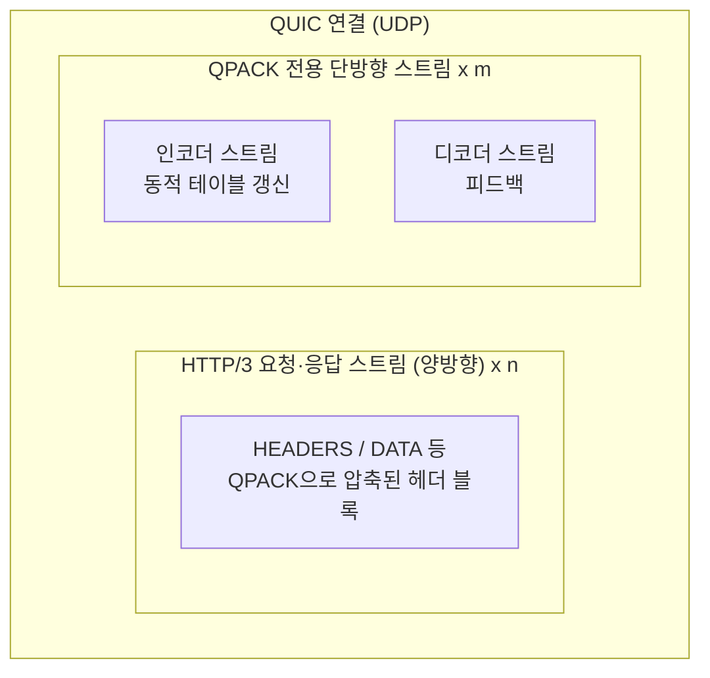
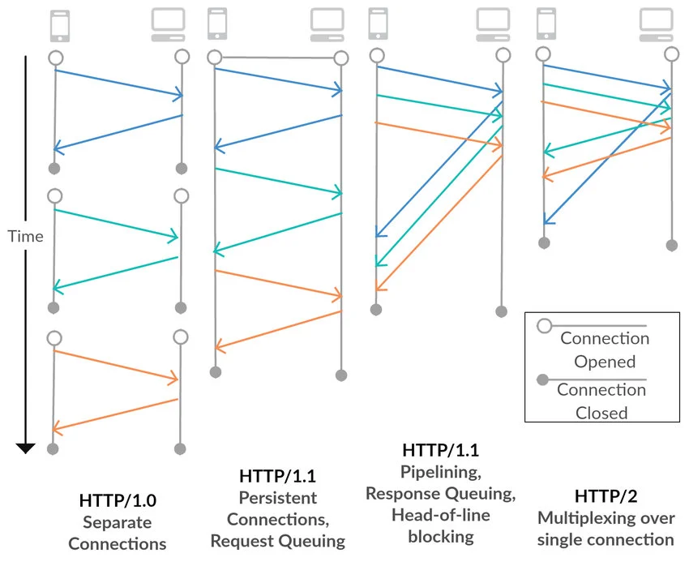
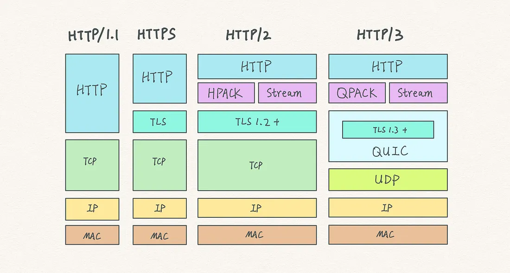

# 서론
HTTP/3는 구글에서 QUIC로 개발하였고 22년 6월에 RFC 9114로 표준화되며 HTTP/3로 변경되었습니다, 참고로  HTTP/3의 기반이 되는 QUIC는 새로운 전송 프로토콜로 RFC 9000으로 표준화되었죠. 
- **※QUIC(Quick UDP Internet Connections)**: UDP 기반의 차세대 전송 프로토콜로, TCP를 쓰지 않아 **TCP 수준의 HOL(head-of-line) 블로킹**을 줄일 수 있음

## HTTP/3의 필요성
QUIC를 사용함으로써 HTTP/2의 가장 큰 단점 몇 가지를 해결할 수 있습니다.
- **패킷 손실의 영향 감소**: TCP는 순서대로 바이트를 넘기려고 해서, 중간에 패킷이 하나만 유실돼도 그 뒤 데이터 전체가 앱에 전달되기 전까지 막힙니다. HTTP/2는 여러 스트림의 프레임이 한 TCP 연결에 실려 보내지기 때문에 이런 막힘이 **연결 위의 모든 스트림**에 동시에 걸립니다. (TCP 수준의 HOL), QUIC는 스트림마다 손실·재전송을 처리하므로, **한 스트림에서 손실이 나도 다른 스트림이 전부 멈추지는 않습니다**.

- **더 빠른 연결 설정**: TLS(암호) 핸드셰이크와 전송 계층 설정을 한 과정에 묶이므로 연결을 열 때 필요한 왕복이 줄어듭니다.

- **제로 왕복 시간(0-RTT)**: 이전에 붙었던 서버라면, 첫 데이터를 보내기 위해 **추가 왕복을 기다리지 않고** 이어서 요청을 보낼 수 있습니다.

- **보다 포괄적인 암호화**: QUIC는 설계상 **TLS 1.3**으로 전송 내용을 암호화하는 것이 기본입니다. “나중에 TLS를 적용한다”가 아니라, **암호화된 통신이 전제**인 전송입니다.
    - **흐름 제어(크레딧)**: 수신 측이 “지금까지 이 정도까지 보내도 된다”는 **허용 한도(크레딧)**를 주는 방식입니다. 
    서버는 동시에 열 수 있는 스트림 수와 받을 데이터량을 이렇게 제한할 수 있어서 HTTP/2 **Rapid Reset**처럼 요청을 열었다가 바로 끊는 방식인 **DDoS 류 공격**을 막는 데 수월해집니다.
- **연결 보장**: Wi-Fi에서 셀룰러로 바뀌는 것처럼 **네트워크 경로가 바뀌어도** 연결을 이어 가려는 방향의 기능이 있습니다.
    - 일반 웹에서는 체감이 작을 수 있지만, **영상 스트리밍**처럼 연결이 자주 바뀌는 환경에서는 HTTP/3가 붙어 있으면 끊김이 덜 발생합니다.

# HTTP/3와 QUIC
QUIC 전송 프로토콜은 HTTP/2 프레임 계층에서 제공하는 것과 유사하게 스트림 다중화 및 스트림별 흐름 제어를 통합합니다, 스트림 수준에서 신뢰성을 제공하고 전체 연결에 걸쳐 혼합 제어를 제공함으로써 QUIC는 TCP 매핑에 비해 HTTP 성능을 향상시킬 수 있죠.<br/>

QUIC는 전송 계층에서 TLS 1.3을 통합하여 TCP에서 TLS를 실행하는 것과 유사한 기밀성과 무결성을 제공하는 동시에 TCP FAST OPEN의 개선된 연결을 제공합니다.
- ※TCP Fast Open(TFO): TCP 3-way handshake 과정 중 SYN 패킷에 데이터를 포함시켜 전송함으로써, 새로운 TCP 연결 설정 시 1 RTT(왕복 시간)의 지연 시간을 줄여주는 확장 프로토콜

HTTP/3는 이런 QUIC 프로토콜에 [HTTP 의미론](https://datatracker.ietf.org/doc/html/rfc9110)을 매핑한 것으로, HTTP/2와 같이 요청·응답·바이너리 프레이밍에 가깝게 설계를 이어 가면서도 전송만 TCP가 아닌 UDP 위의 QUIC로 옮긴 프로토콜입니다. 
<br/>
<br/>
HTTP/2가 “한 TCP 연결에 여러 스트림”이었다면, <u>HTTP/3는 같은 HTTP 계층 아이디어를 QUIC(UDP 기반 전송)에 얹은 형태</u>로 이해하면 됩니다.<br/>
QUIC로 **UDP 소켓**으로 패킷을 주고받고, 그 위에서 재전송·순서·흐름 제어·암호화를 **QUIC·TLS 1.3이 담당**합니다. 그래서 아래 이점이 함께 따라옵니다.

- **데이터 기밀성과 무결성**: 전송 페이로드가 TLS 1.3에 의해 암호화되고(AEAD 등), 변조 여부를 검증할 수 있어 **도청·변조에 대비**합니다.
- **피어 인증**: TLS 핸드셰이크 과정에서 **서버(필요 시 클라이언트) 신원을 증명**하는 인증서 검증이 이뤄집니다.
- **스트림별 안정적이고 순서가 보장된 전송**: TCP처럼 **연결 전체가 하나의 순서 바이트 스트림**이 아니라, QUIC가 **스트림마다** 손실 복구와 순서 보장을 처리합니다. 그래서 한 스트림의 유실이 다른 스트림 전체를 막지 않는 쪽으로 설계됩니다.
- **스트림 수명 관리**: 요청·응답 단위로 스트림을 열고 닫거나 리셋하는 등 **수명을 QUIC·HTTP/3 규칙으로 관리**합니다.
- **스트림 단위 흐름 제어**: 수신 측이 스트림·연결별로 **보내도 되는 양(크레딧)**을 나눠 주어, 버퍼 폭주나 무한 송신을 막습니다.

즉 여전히 HTTP 메시지는 HTTP/2와 유사한 **바이너리 프레임**으로 다루고, HPACK를 **QPACK**로 대체하는 등 일부는 QUIC 환경에 맞게 바꿨습니다, **멀티플렉싱·흐름 제어**처럼 HTTP/2에서 하던 일 가운데 상당 부분은 **QUIC 전송에 통합**되었습니다.<br/>

이에 대해서는 [RFC 9000](https://datatracker.ietf.org/doc/html/rfc9000)에서 더 자세히 볼 수 있죠.

## QPACK
압축으로 인해 발생하는 헤드 오브 라인 블로킹(head-of-line blocking) 정도를 인코더가 어느 정도 제어할 수 있도록 하는 HPACK의 변형입니다. 
- HOL: 멀티스트림, 비순서 전달 환경에서 HPACK 스타일의 동적 테이블 동기화는 한 스트림의 디코딩을 다른 스트림의 전달 순서에 연관되어 막힐 수 있다는 의미

QPACK을 통해 인코더는 압축 효율성과 지연 시간 사이의 균형을 맞출 수 있습니다. 
HTTP/3는 헤더 및 트레일러 섹션, 특히 헤더 섹션에 포함된 제어 데이터를 압축하는 데 QPACK을 사용합니다.

하나의 QUIC 연결 안에 **HTTP 메시지가 오가는 스트림**과, **테이블·피드백만 담당하는 QPACK 전용 단방향 스트림**이 함께 존재한다는 점을 그림으로 보면 이해하기 쉽습니다.

- **양방향 스트림**: HTTP/3 요청·응답 스트림, 실제 HTTP로 클라이언트가 요청(HEADERS, DATA 등)을 보내고, 같은 스트림을 서버가 응답을 돌려줍니다.
- **단방향 스트림**: HTTP 본문이 아니라 헤더 압축 상태를 맞추기 위한 스트림이며, 한쪽 방향으로만 데이터가 흐릅니다. 방향에 따라 인코더/디코더 스트림으로 나뉘어 용도별로 사용합니다.

※그림은 한 QUIC 연결에 각 스트림이 하나씩만 있는 것처럼 보이지만, 실제로는 양방향/단방향 스트림이 여러 개 열릴 수 있습니다.※



HPACK은 TCP의 **한 순서 있는 바이트 스트림**에 맞춰 압축 상태를 같이 밀어 넣는 느낌에 가깝고, QPACK은 **전용 스트림**으로 갱신·피드백을 나눠 **멀티스트림 환경에서의 헤더 측 HOL**을 줄이려는 쪽입니다.

- **※트레일러 섹션**: HTTP 메시지는 보통 헤더 → 본문(body) 순으로 생각하지만, 청크 전송(Transfer-Encoding: chunked) 등을 쓰는 경우 본문 뒤에 또 헤더 형태의 필드를 붙일 수 있습니다. 그 본문 다음에 오는 필드 묶음이 **트레일러(trailer)** 이고, RFC 문구에서는 트레일러 섹션이라고 부릅니다.

## 연결·스트림·요청 매핑
HTTP/3는 QPACK 단락의 그림을 보면 알 수 있듯이 하나의 QUIC 연결 안에서 여러 스트림을 동시에 사용합니다. 요청/응답은 보통 클라이언트가 연 양방향 스트림 하나에 매핑되며, QPACK과 제어 정보는 별도 단방향 스트림으로 분리됩니다.

### 스트림 타입
| 스트림 타입 | 방향 | 용도 |
| --- | --- | --- |
| Request stream | 양방향 | 요청 HEADERS/DATA와 응답 HEADERS/DATA 전달 |
| Control stream | 단방향 | SETTINGS, GOAWAY 등 연결 제어 |
| QPACK encoder stream | 단방향 | 동적 테이블 갱신 전파 |
| QPACK decoder stream | 단방향 | 테이블 처리 상태 피드백 |
| Push stream(선택) | 단방향 | 서버 푸시 리소스 전달 |

즉 중요한 점은 HTTP/3가 HTTP/2처럼 멀티플렉싱을 하면서도, TCP 한 연결의 순서 제약을 그대로 따르지 않는 QUIC 전송 위에서 동작한다는 것입니다. 그 결과 TCP 수준 HOL은 완화되고, 연결 자원은 공유하되 스트림은 보다 독립적으로 진행될 수 있습니다.

### Pseudo-header fields
헤더 블록에 담기지만 일반 헤더와 구분되며, 메시지의 구조 자체를 정의하는 데 목적을 둡니다.

HTTP/3 요청은 RFC 9110의 HTTP 의미론을 따르며, 헤더 블록에는 `pseudo-header fields`를 올바르게 포함해야 합니다.
- **※Pseudo-header**: 서버는 이 값을 바탕으로 라우팅 대상(호스트), 프로토콜 체계(HTTP/HTTPS), 메서드 의미, 경로를 해석한 뒤 일반 헤더를 처리합니다.
- 일반 헤더보다 먼저 와야 하고 이름은 소문자를 사용합니다.
- 중복되거나 잘못된 조합(ex: 필수 의사헤더 누락)은 스트림 에러로 이어질 수 있습니다.
- `Host` 헤더를 함께 쓰는 경우에는 `:authority`와 의미가 충돌하지 않도록 일관되게 구성해야 합니다.

| 의사헤더 | 역할 | 어떻게 쓰이는지(예시) | 왜 필요한지 |
| --- | --- | --- | --- |
| `:method` | 요청 동작 정의 | `GET`, `POST` | 서버가 안전/멱등성, 본문 처리 방식 등을 해석하는 기준 |
| `:scheme` | URI 스킴 명시 | `https` | 동일한 호스트라도 `:scheme`에 따라 보안 정책/리디렉션 판단이 달라짐 |
| `:authority` | 대상 권한(호스트:포트) 지정 | `example.com`, `api.example.com:8443` | 가상 호스팅/멀티 테넌트 환경에서 라우팅 기준 제공 |
| `:path` | 리소스 경로 지정 | `/users/1?verbose=true` | 실제 애플리케이션 핸들러 매칭에 사용되는 값 |

일반적인 헤더와의 차이는 아래처럼 정리할 수 있습니다.

| 구분 | 의사헤더(pseudo-header) | 일반 헤더 |
| --- | --- | --- |
| 예시 | `:method`, `:scheme`, `:authority`, `:path` | `content-type`, `accept`, `authorization`, `cache-control` |
| 역할 | 요청/응답의 기본 구조(메시지 골격) 정의 | 부가 속성/정책/메타데이터 전달 |
| 순서 규칙 | 일반 헤더보다 먼저 와야 함 | 의사헤더 뒤에 옴 |
| 이름 형식 | `:` 접두사 사용 | `:` 접두사 없음 |

즉 둘 다 헤더 블록에 QPACK으로 인코딩되어 담기지만, 의사헤더는 메시지의 형태를 정의하고 일반 헤더는 메타데이터를 전달합니다.

## Alt-Svc
HTTP 오리진은 Alt-Svc HTTP 응답 헤더 필드 또는 "h3" ALPN 토큰을 사용하는 HTTP/2 ALTSVC 프레임([ALTSVC](https://datatracker.ietf.org/doc/html/rfc7838))을 통해 HTTP/3 엔드포인트의 가용성을 알릴 수 있습니다.

즉 처음에는 TCP + TLS + HTTP/2로 연결되었는데 응답에서 아래처럼 줄 경우
```
Alt-Svc: h3=":443"; ma=86400
```
HTTP/3(QUIC, 보통 UDP 443)를 쓸 수 있는 것이고, 브라우저는 이 정보를 캐시한 뒤 다음 연결부터 바로 HTTP/3를 시도합니다. 경우에 따라 병렬로 시도하기도 하며, 즉 연결 방법에 대한 표시입니다.

## HTTP/3
아래는 HTTP/3 샘플입니다.

| NO | Time | Source | Destination | Protocol | Length | Info |
| --- | --- | --- | --- | --- | --- | --- |
| 2570 | 87.982016100 | 142.250.199.78 | 192.168.219.111 | HTTP3 | 131 | QPACK ENC[1], STREAM(8), HEADERS: 200 OK, DATA |
| 2572 | 87.988496600 | 192.168.219.111 | 142.250.199.78 | HTTP3 | 77 | QPACK DEC[1] |
| 2823 | 90.990652700 | 192.168.219.111 | 142.250.199.78 | HTTP3 | 1288 | PRIORITY_UPDATE, STREAM(10), QPACK ENC[3], STREAM(12), HEADERS: POST https://clientservices.googleapis.com/uma/v2 |
| 2835 | 91.005240800 | 142.250.199.78 | 192.168.219.111 | HTTP3 | 898 | DATA |

이 흐름은 개념적으로는 다음처럼 볼 수 있습니다. 다만 실제로는 패킷화·재전송·멀티스트림 스케줄링 영향으로 순서가 항상 고정되지는 않습니다.
```
QPACK 압축 상태 동기화 -> HEADERS 전달 -> DATA 전달
```
- **QPACK ENC/DEC**는 요청 본문이 아니라, 헤더 압축용 동적 테이블을 맞추는 제어 정보(단방향 스트림)입니다.
- **PRIORITY_UPDATE**는 어떤 스트림에 우선순위를 둘지 힌트를 보내는 프레임이고, 같은 패킷에 HEADERS가 함께 실릴 수 있습니다.
- **HEADERS**가 먼저 오고 DATA(양방향 스트림으로 보내지는 프레임)가 뒤따르는 패턴이 일반적입니다.
- 하지만 **QUIC**는 멀티스트림이라 제어/헤더/데이터가 섞여 보일 수 있습니다.

# 프레이밍(HTTP/3 프레임)
HTTP/3도 HTTP/2처럼 프레임 단위로 메시지를 구성하지만, 다른 점은 프레임이 QUIC 스트림 위에 실립니다.

| 프레임 | 역할 | 메모 |
| --- | --- | --- |
| HEADERS | 요청/응답 메타데이터 전달 | QPACK으로 압축 |
| DATA | 본문(payload) 전달 | 요청/응답 모두 사용 |
| SETTINGS | 연결 초기 동작 파라미터 교환 | 주로 control stream에서 교환 |
| GOAWAY | 새 요청 수락 중단 알림 | 기존 진행 요청 정리 용도 |
| PRIORITY_UPDATE | 우선순위 힌트 전달 | 강제 명령이 아닌 힌트 성격 |

즉 HTTP 의미론(메서드, 상태코드, 헤더)은 유지하면서, 전송 경로와 프레임 운반 방식이 QUIC에 맞게 바뀐 구조입니다.

프레임은 다음 레이아웃을 따릅니다.
```
HTTP/3 Frame Format {
  Type (i),
  Length (i),
  Frame Payload (..),
}
```
주요 HTTP/3 프레임은 아래처럼 간단히 볼 수 있습니다.

| Frame Type | 용도 |
| --- | --- |
| DATA | 요청/응답 본문 전달 |
| HEADERS | 요청/응답 헤더 전달(QPACK 적용) |
| CANCEL_PUSH | 서버 푸시 취소 |
| SETTINGS | 연결 단위 설정 전달 |
| PUSH_PROMISE | 서버 푸시 예정 리소스 알림 |
| MAX_PUSH_ID | 허용 가능한 Push ID 상한 설정 |
- **Type**: 프레임 타입을 식별하는 가변 길이 정수입니다.
- **Length**: `Frame Payload` 길이(바이트 단위)를 나타내는 가변 길이 정수입니다.
- **Frame Payload**: 실제 데이터 영역이며, 어떤 의미를 갖는지는 `Type` 값에 따라 결정됩니다.

## SETTINGS
SETTINGS 프레임은 항상 HTTP/3 연결에 적용되며, 단일 스트림에는 적용이 되지 않습니다.
HTTP/3에서는 각 엔드포인트가 여는 control stream에서, SETTINGS가 반드시 첫 프레임이어야 합니다.
나중에 전송하는 것도 안 되고, 제어 스트림이 아닌 스트림에서 전송하는 것도 안 됩니다.

## 에러 처리
HTTP/3 에러는 크게 스트림 단위와 연결 단위로 나눠서 보는 것이 편합니다.
- **스트림 에러(stream error)**: 특정 요청/응답 스트림만 실패하고, 다른 스트림은 계속 진행될 수 있습니다.
- **연결 에러(connection error)**: 연결 전체가 종료되어 모든 스트림에 영향을 줍니다.

## GOAWAY
GOAWAY는 "연결을 갑자기 끊겠다"라기보다는 "특정 기준보다 새로운 요청은 이제 받지 않겠다"에 가깝습니다.
그래서 HTTP/3에서는 스트림 ID 기준을 처리합니다.

- **송신자 관점**에서는 GOAWAY ID 이상(`>=`)의 상대 요청 스트림을 처리하지 않습니다.
- **수신자 관점**에서는 상대가 처리하지 않은 요청을 다른 연결에서 재시도할 수 있습니다.

이유는 UDP 기반의 QUIC는 패킷 도착 순서가 뒤섞일 수 있으므로, 네트워크 관점에서 늦게 도착했다고 해서 더 나중에 생성된 요청이라고 보장할 수 없기 때문입니다. 따라서 도착 시각이 아니라 스트림 ID 기준으로 처리 범위를 판단합니다.

# 결론
HTTP/2의 기술을 TCP에서 UDP 기반의 QUIC 프로토콜로 옮기면서 보안성과 성능 측면에서 개선되었습니다.
현재는 브라우저와 주요 CDN/클라우드에서 폭넓게 지원되지만, 실제 서비스 도입 속도는 네트워크 정책(UDP 443), 인프라 구성, 운영 관측 체계 등 환경 차이에 따라 다르게 나타나고 있습니다.

HTTP/1 ~ HTTP/3 까지의 비교는 다음 이미지 한장으로 정리가 될 것 같군요.

## 버전별 통신 흐름

## 버전별 계층도


## 관련 RFC 문서
- [RFC 9114 — HTTP/3](https://datatracker.ietf.org/doc/html/rfc9114): HTTP 의미를 QUIC 전송에 매핑하는 핵심 규격입니다.
- [RFC 9110 — HTTP Semantics](https://datatracker.ietf.org/doc/html/rfc9110): 메서드, 상태코드, 헤더 의미 등 HTTP 의미론의 기준 문서입니다.
- [RFC 9000 — QUIC: A UDP-Based Multiplexed and Secure Transport](https://datatracker.ietf.org/doc/html/rfc9000): QUIC 연결/스트림/흐름 제어/에러 처리의 전송 계층 규격입니다.
- [RFC 9001 — Using TLS to Secure QUIC](https://datatracker.ietf.org/doc/html/rfc9001): QUIC에서 TLS 1.3을 어떻게 적용하는지 정의합니다.
- [RFC 9204 — QPACK: Field Compression for HTTP/3](https://datatracker.ietf.org/doc/html/rfc9204): HTTP/3 헤더 압축(QPACK) 규격입니다.
- [RFC 7838 — HTTP Alternative Services](https://datatracker.ietf.org/doc/html/rfc7838): Alt-Svc를 통한 대체 서비스(예: h3) 광고 방식의 기준입니다.