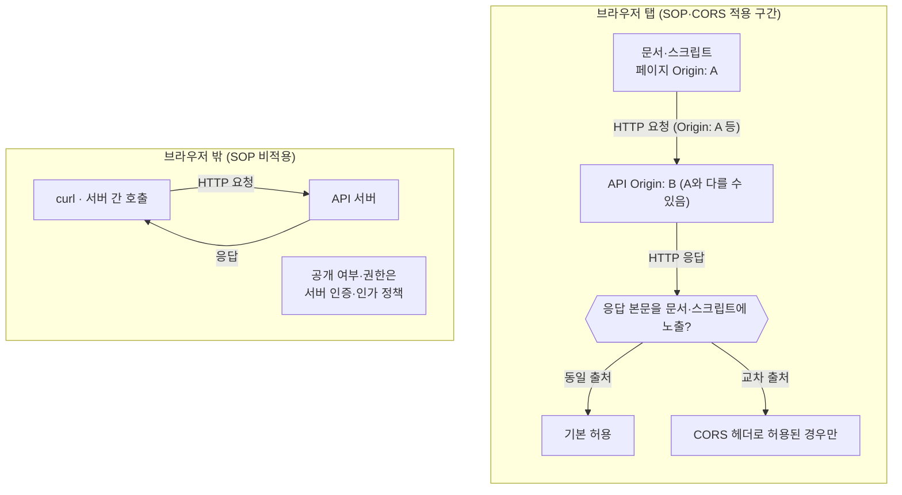
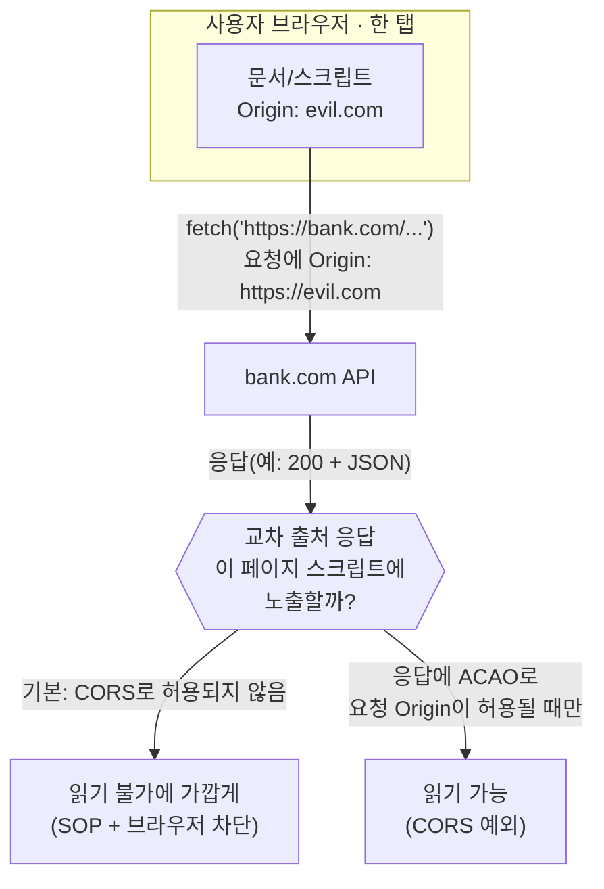
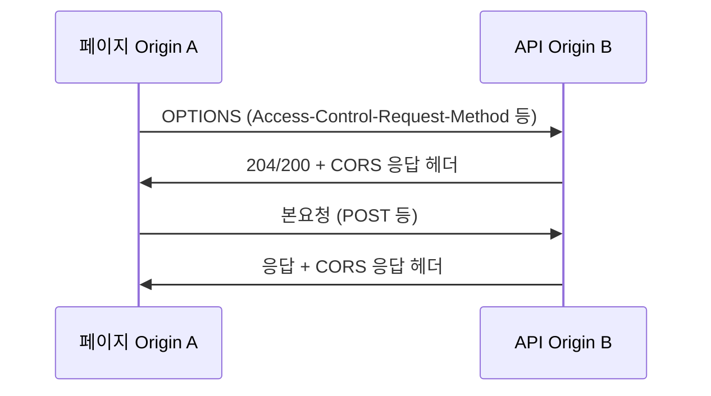

# 서론
서버가 교차 출처 요청을 아무 기준 없이 허용하면, 민감한 응답 데이터가 의도치 않게 노출될 수 있습니다.  
브라우저는 Same-Origin Policy를 기본으로 적용하고, 서버는 CORS 헤더를 통해 특정 `Origin`에 한해 접근을 허용합니다.
- **Same-Origin Policy**: 웹 브라우저가 보안을 위해 한 출처(Origin)에서 가져온 문서나 스크립트가 다른 출처의 리소스와 상호작용하는 것을 제한하는 핵심 보안 메커니즘
- **CORS**: 브라우저가 다른 도메인(출처)의 서버 자원에 접근할 때, 보안상 제한(동일 출처 정책, SOP)을 해제하고 합법적으로 데이터를 공유하도록 서버가 허가해 주는 HTTP 응답 헤더 기반 메커니즘

`Origin`의 정의와 직렬화, 그리고 HTTP `Origin` 헤더를 규정한 RFC 6454를 정리합니다.<br/>
`Origin` 개념을 이해하면 다른 출처 접근이 어떤 기준으로 허용/차단되는지, 그리고 이를 통해 서버 자원을 어떻게 보호하는지 명확하게 볼 수 있습니다.

## Origin
Origin은 "이 요청/리소스가 어느 출처에서 왔는지"를 식별하기 위한 개념입니다.
URL의 프로토콜(Scheme), 호스트(Domain), 포트(Port)를 합친 튜플입니다.
- **※튜플(Tuple)**: 수학 및 컴퓨터 과학에서 여러 요소를 순서대로 묶어 놓은 집합을 뜻합니다.

이것 자체로는 막는 동작을 하지 않으며, 실제로 막는 역할을 하는 것은 브라우저의 SOP와 서버의 CORS 응답 헤더입니다.
| 구성 요소 | 설명 | 예시 |
| --- | --- | --- |
| Scheme(프로토콜) | 통신 프로토콜, `http`와 `https`는 서로 다른 Origin으로 취급 | `https` |
| Host(호스트) | 서버 주소(도메인 또는 IP). 서브도메인이 다르면 다른 Origin | `api.example.com` |
| Port(포트) | 네트워크 포트 번호. 명시/기본 포트가 다르면 다른 Origin | `443` |

### Same-Origin
브라우저는 기본적으로 한 출처의 문서·스크립트가 다른 출처의 응답을 마음대로 읽지 못합니다.

curl·백엔드 호출은 그 격리 밖에서 동작한다는 점을 한눈에 보여 줍니다.<br/>
요청은 갈 수 있어도, 브라우저가 출처 다른 곳의 응답을 페이지의 JS에 넘겨줄지는 SOP·CORS에 달려 있습니다.



Same-Origin이란 아래 3가지(프로토콜, 호스트, 포트)가 모두 같아야 합니다.
같은 출처(Same-Origin)인지 파악하는 기준이 아래 표와 같습니다. (Same-Origin Policy는 브라우저 쪽 개념이고, RFC 6454의 Origin은 그 판단에 쓰는 식별자입니다.)

| 기준 URL | 대상 URL | Same-Origin 여부 | 이유 |
| --- | --- | --- | --- |
| `https://example.com` | `https://example.com/about` | O | 프로토콜, 호스트, 포트가 동일 |
| `https://example.com` | `http://example.com` | X | 프로토콜(`https` vs `http`)이 다름 |
| `https://example.com` | `https://api.example.com` | X | 호스트(`example.com` vs `api.example.com`)가 다름 |
| `https://example.com` | `https://example.com:8443` | X | 포트(기본 `443` vs `8443`)가 다름 |


Same-Origin/CORS는 주로 다른 사이트 간 데이터 유출을 어렵게 만들어 줍니다.
이런 정책이 없었다면 교차 출처로 데이터를 읽어가는 위험이 생기게 됩니다.

## Serialization of an Origin
Origin은 **(scheme, host, port)** 튜플로 정의됩니다. 그런데 HTTP `Origin` 헤더에 실어 보내거나, 
서버가 CORS `Access-Control-Allow-Origin`과 문자열로 매칭하거나, 두 출처가 같은지를 판단하려면, 
튜플을 규칙이 정해진 하나의 문자열로 바꾸는 절차가 필요합니다.

이를 **직렬화(serialization)** 라고 합니다.

직렬화를 이렇게 정해 두지 않으면 같은 사이트인데도 표기만 다를 때(예: IDN을 유니코드로 썼느냐 Punycode로 썼느냐) 서로 다른 문자열이 되어, 동일 출처 비교·정책 적용이 흔들릴 수 있습니다. 
그래서 RFC 6454는 용도에 따라 **Unicode**와 **ASCII** 두 직렬화를 나눕니다.
- **※Punycode**: 도메인 이름에 쓸 수 있는 문자만으로 유니코드 도메인 라벨을 나타내기 위한 인코딩이며, RFC 3492에 정리되어 있습니다.

### Unicode vs ASCII 직렬화 비교

| 구분 | Unicode Serialization | ASCII Serialization                                 |
| --- | --- |-----------------------------------------------------|
| **쓰는 이유** | 사람이 읽기 쉬운 표시, 일부 API·UI와의 호환 | 프로토콜·구현이 공통으로 쓰는 기계 친화적 표현, 동일 출처 비교의 실질 기준 |
| **호스트(IDN)** | 라벨을 **유니코드**로 유지 | **Punycode(A-label)** 로만 표현                         |
| **문자집합** | 유니코드(비 ASCII 포함 가능) | ASCII (DNS·와이어 포맷과 맞추기 쉬움)                          |
| **정규화** | “읽는 쪽”에 맞춘 표현 | 스킴·호스트 소문자, 기본 포트 생략 등 비교·전송에 맞춘 표현                 |
| **대표 맥락** | 문서/화면, 레거시 API | `Origin` 헤더, 로그·권한 비교, 캐시 키                         |

요약하면, 둘은 같은 출처에 대한 “두 가지 쓰기”이고, 같은지를 코드로 판정할 때는 **ASCII 쪽**이 RFC의 의도와 잘 맞습니다.

아래는 같은 출처를 Unicode / ASCII로 각각 직렬화했을 때의 차이입니다. 
(호스트 라벨 `bücher`는 독일어 “책들”을 뜻하는 예시로 든 도메인 라벨입니다.)

| 직렬화 종류 | 문자열 예시 |
| --- | --- |
| Unicode | `https://bücher.example` |
| ASCII | `https://xn--bcher-kva.example` |

포트가 있으면 양쪽에 포트가 붙고, **ASCII 쪽은 호스트만** Punycode로 바뀝니다.

| 직렬화 종류 | 문자열 예시 |
| --- | --- |
| Unicode | `https://bücher.example:9000` |
| ASCII | `https://xn--bcher-kva.example:9000` |

`https`의 **기본 포트 443**은 RFC 6454 **ASCII** 직렬화에서 **문자열에 안 붙는** 경우가 많아, 실제 `Origin` 헤더는 `https://xn--bcher-kva.example`처럼 **포트가 생략**된 모습을 볼 수 있습니다.


### API와 연관성
서버 간 API 호출은 브라우저 SOP와 무관합니다.
Same-Origin의 다이어그램에서 그린 `curl`처럼 서버 간 호출은 SOP 밖에서 이뤄집니다.<br/>
응답 본문은 서버가 만들지만, 그 응답을 브라우저가 교차 출처 페이지의 JS에 풀어줄지는 `Access-Control-Allow-Origin` 등 CORS 응답 헤더에 달려 있습니다. 

# Security
앞에서는 Origin이 튜플이고, 비교·전송에 쓰는 ASCII 직렬화가 있다는 점을 정리했습니다.
여기서는 그 이름이 실제 브라우저 안에서 어떻게 쓰이는지, <u>SOP(기본 격리)</u>와 <u>CORS(응답으로 그 격리를 푸는 합의)</u>를 정리합니다.

## Same-Origin Policy(SOP)
Same-Origin Policy는 한 웹사이트에 올라온 스크립트가, 사용자의 브라우저에서 다른 출처(Origin)의 응답을 권한 없이는 읽지 못하게 합니다.

- **대표적으로 제한되는 것**: `fetch` / `XMLHttpRequest`로 교차 출처 API 응답의 본문을 읽는 것입니다.
동일 출처가 아닐 때 기본은 차단되며, 이후 CORS로 완화할 수 있습니다.  
- **같은 문제가 아닌 것(요약)**: `<a href>`로 이동(탐색)하거나, ``로 이미지를 화면에 띄우는 것은 각각 다른 규칙이 적용됩니다. <u>“모든 HTTP가 SOP에만 따른다”</u>는 아닙니다.

즉, 예를 들어 `evil.com`에 심은 스크립트는, 사용자가 `bank.com`에 로그인되어 있어도 `bank.com` API의 JSON을 곧바로 읽어올 수 없다는 쪽이 SOP에 가깝고, CORS는 그때 예외를 응답으로 허용하는 셈입니다.



위 그림은 “JSON 본문을 `evil.com` 쪽 JS가 읽을 수 있는가?”를 가르는 프로세스입니다.

## CORS와 Origin 헤더
교차 출처 요청에서 브라우저는 (조건에 따라) HTTP 요청에 `Origin`을 싣습니다. 
값은 **ASCII로 직렬화된 origin**(앞 `Serialization` 절)과 같은 것 입니다.

- **요청**: 예를 들어 페이지가 `https://a.example`이면 `Origin: https://a.example`처럼, 어느 문서(출처)의 맥락에서 보낸 요청인지 서버에 넘깁니다.  
- **응답**: `https://b.example` API가 `Access-Control-Allow-Origin: https://a.example` 등을 주면, 브라우저는 “이 응답을 그 `Origin`에 해당하는 페이지의 스크립트에 노출해도 되는가”를, 응답 CORS 헤더와 요청의 `Origin`을 맞춰 판단합니다.

**응답 본문·상태 코드**는 전부 서버가 만듭니다. <br/>
CORS는 “브라우저가 교차 출처 읽기를 풀어줄지”를 응답 헤더로 말해 주는 측면이 큽니다.

아래는 개발자 도구에서 캡처한 YouTube 응답 일부입니다. <br/>
**같은 응답**에 CORS뿐 아니라 리소스 정책·타이밍·캐시 관련 헤더가 함께 붙는데, 겹쳐 보이지만 역할이 다릅니다.

| 응답 헤더 | 사용처 | 설명 |
| --- | --- | --- |
| `Access-Control-Allow-Credentials` | [Fetch] CORS | CORS(교차 출처 리소스 공유) 요청 시 브라우저가 쿠키, 인증 헤더 등 자격 증명(Credentials)을 포함하여 서버에 요청하는 것을 허용할지 결정하는 HTTP 응답 헤더 |
| `Access-Control-Allow-Origin` | [Fetch] CORS | 웹 서버가 브라우저에게 "이 리소스는 특정 도메인(Origin)에서 요청할 수 있다"고 허용하는 CORS(교차 출처 리소스 공유) 대상을 지정하는 HTTP 응답 헤더 |
| `Access-Control-Expose-Headers` | [Fetch] CORS | CORS로 허용된 응답에서, JS가 `getResponseHeader()`로 읽을 수 있게 추가로 공개할 응답 헤더 이름 나열 |
| `Cross-Origin-Resource-Policy` | [HTML] 리소스 격리 | 브라우저가 다른 출처(Origin)나 사이트에서 자사 리소스를 무단으로 로딩하는 것을 차단하는 보안 메커니즘 |
| `Timing-Allow-Origin` | [Resource Timing] |  교차 출처 리소스의 타이밍 데이터(네트워크 지연 등) 공유 허용하는 리스트|

```http
Access-Control-Allow-Credentials: true
Access-Control-Allow-Origin: https://www.youtube.com
Access-Control-Expose-Headers: Client-Protocol, Content-Length, Content-Type, X-Bandwidth-Est, X-Bandwidth-Est2, X-Bandwidth-Est3, 
Alt-Svc: h3=":443"; ma=2592000,h3-29=":443"; ma=2592000
Content-Type: application/vnd.yt-ump
Cross-Origin-Resource-Policy: cross-origin
Server: gvs 1.0
Timing-Allow-Origin: https://www.youtube.com
```

### Preflight Request
`GET`이나 “단순 요청”에 가까운 몇몇 경우는, 브라우저가 곧바로 본요청을 보내기도 합니다. (`GET`이라도 `fetch`에 커스텀 헤더 등 비단순 조건이 붙으면 preflight가 필요할 수 있습니다.)
반면 `PUT`·`DELETE`, 일부 `Content-Type`, **커스텀 헤더** 등, “단순 요청”이 아닌 조합은 먼저 `OPTIONS`로 “이 메서드·헤더로 보내도 되는지”를 묻는 **preflight**를 두는 쪽이 일반적입니다.

- **※HTTP 커스텀 헤더**: `Content-Type` 등 “단순 요청”에 묶이지 않는, 애플리케이션이 임의로 붙이는 요청 헤더를 가리킬 때 씁니다.
- **※HTTP `OPTIONS`**: 실제로 preflight는 보통 **`OPTIONS` 메서드**로, “이따가 보낼 메서드·헤더를 서버가 받아 줄지” 먼저 묻는 요청에 가깝습니다. `OPTIONS` 자체는 CORS뿐 아니라 다른 용도로도 쓰일 수 있으나, 여기서는 preflight 맥락만 잡으면 됩니다.

preflight를 두는거는, “비단순 요청”의 메서드·헤더를, 본요청 전에 `OPTIONS`로 먼저 맞출 수 있게 하려는 쪽이 중심입니다(세부·조합은 [Fetch CORS](https://fetch.spec.whatwg.org/) 참고).  

순서만 보면 대략 아래와 같습니다.



### Credentialed Request
쿠키·HTTP 인증 등 자격 증명을 `fetch`에 실어 보내는 경우, 교차 출처 응답을 페이지 쪽 `fetch`가 읽을 수 있게 하려면 보통 아래를 같이 맞춥니다.

- 응답에 **`Access-Control-Allow-Credentials: true`** 가 없으면, 브라우저는 `fetch`가 CORS에 성공한 응답으로 쓰지 못하게 막고(막히면 JS가 본문을 읽을 수 없음), 개발자 도구에는 “CORS 오류”에 가깝게 보이는 쪽이 일반적입니다.  
- 자격 증명이 붙는 요청에서는 `Access-Control-Allow-Origin: *`처럼 와일드카드만 보내는 조합은 쓰면 안 됩니다. 스펙·브라우저는 자격 증명이 있을 때 `Access-Control-Allow-Origin`에 요청 `Origin`과 같은 구체적 값 하나가 오는 것을 기대하므로, API 서버는 `https://a.example`처럼 허용할 출처를 직접 명시하는 패턴이 많습니다.  
- 교차 출처이면, 요청·응답을 주고받는 쪽(클라이언트, 서버)이 모두 CORS에 맞게 구성되어  있어야 합니다.  

쿠키의 **`SameSite`**, **세션(쿠키·서버 세션 정책)** 은 CORS 와는 다른 개념입니다. <br/> 
하지만 이 개념들이 한 요청에 동시에 적용될 수 있으니 “CORS만 맞추면 끝”이 아닐 수 있다는 점도 알고 있어야 합니다.

# 결론
- **Origin**은 (scheme, host, port)를 담은 튜플이고, 같은지 비교할 때는 **ASCII 직렬화**가 실질적인 기준에 가깝습니다. (RFC 6454)  
- **브라우저**는 기본으로 **SOP**로 교차 출처 읽기를 제한하고, **CORS 응답 헤더**로 그 제한을 완화합니다.
- **“누가 부를 수 있는 지”** 에 대한 서버 인증과 인가에 대한 작업들입니다.
- **curl·서버 간 호출**은 그 격리 **밖**입니다.  

