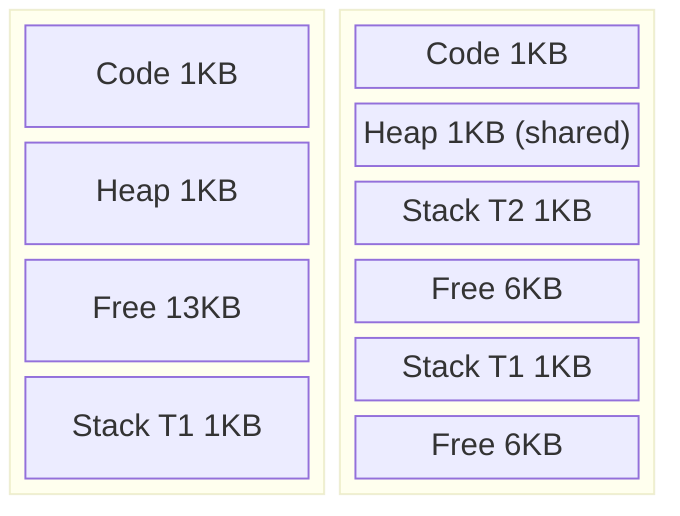
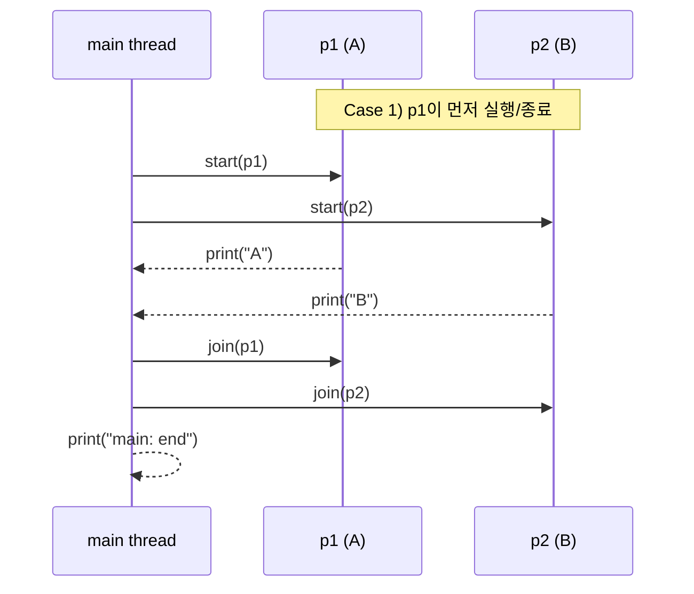
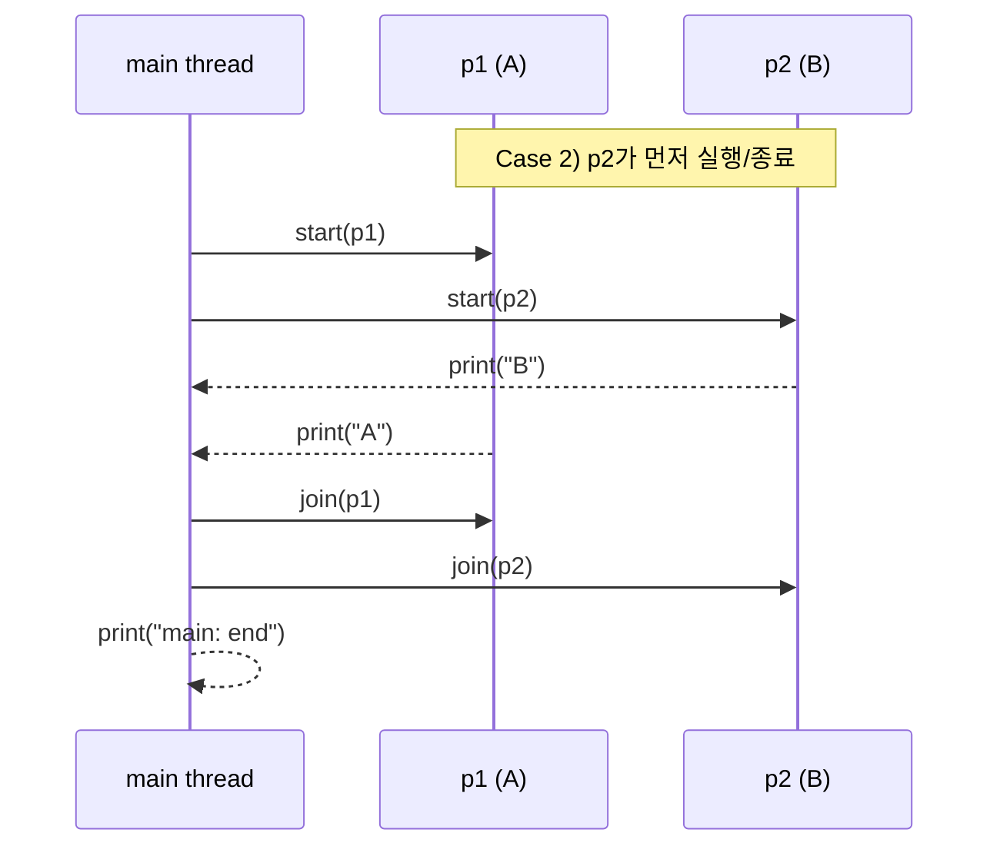

# Process vs Thread
**멀티 스레드**는 하나의 Program Counter(PC)만 갖는 단일 스레드와 달리 **각 스레드가 자신만의 Program Counter(PC)와 스택(Stack)** 을 가집니다. 이로 인해 멀티 프로세스와 달리 다음 차이점들이 발생합니다.
- **※ Program Counter(PC)**: 다음에 실행할 명령어의 주소를 저장하는 레지스터

하나의 프로세스에 두 개의 스레드(T1, T2)가 있다고 가정해보면, T1에서 T2로 넘어갈 때 스레드 간 컨텍스트 스위치가 일어납니다. 이 과정은 프로세스 간 컨텍스트 스위치와 비슷하게 현재 실행 상태를 저장하고 다음 실행 상태를 복원한다는 점에서 유사합니다.
- **※ Context Switching**: CPU/코어에서 실행 중이던 프로세스/스레드가 다른 프로세스/스레드로 교체되는 것

예를 들어, T1의 레지스터 상태를 저장한 뒤 T2를 실행하기 전에 T2의 레지스터 상태를 복원합니다. 프로세스는 이런 상태를 PCB(Process Control Block)로 관리하고, 스레드는 TCB(Thread Control Block)로 관리하는 차이도 있지만

중요한 차이는 있습니다. 프로세스끼리는 주소 공간이 분리되어 있지만, 같은 프로세스의 스레드들은 코드/데이터/힙 같은 주소 공간을 공유합니다. 즉, 공유 자체가 문제라기보다 공유 자원 접근 시 동기화를 잘못하면 경쟁 조건(race condition)이 발생할 수 있다는 점이 핵심입니다.

또 다른 차이는 스택입니다.
- 단일 스레드 프로세스: 스택 1개
- 다중 스레드 프로세스: 스레드마다 스택 1개씩

스택은 각 스레드의 로컬 실행 문맥을 저장하는 공간입니다. 함수 호출 프레임, 지역 변수, 매개변수, 반환 주소 등이 여기에 저장됩니다. 반면 힙은 프로세스 단위로 존재하며, 같은 프로세스의 스레드들이 함께 사용하는 메모리 영역입니다.

정리하면, 단일 스레드는 스택이 하나이고 다중 스레드는 스택이 여러 개입니다. 스레드 수가 많아질수록 스택 메모리 사용량도 함께 늘어나므로, 전체 주소 공간에서 가용 메모리를 더 압박할 수 있습니다.
아래 차트의 왼쪽은 단일 스레드일 때의 메모리, 오른쪽은 멀티 스레드일 때의 메모리 상태입니다.



- 단일 스레드는 스택이 1개라서 실행 문맥 저장 공간이 한 덩어리입니다.
- 멀티 스레드는 스레드마다 스택이 필요하므로, 전체 16KB 안에서 스택 영역이 여러 조각으로 나뉩니다.
- 코드와 힙은 같은 프로세스 내부에서 스레드들이 공유합니다.

| 구분 | 멀티 프로세스 | 멀티 스레드 |
| --- | --- | --- |
| 주소 공간 | 프로세스마다 분리 | 한 프로세스 내부에서 공유(코드/데이터/힙) |
| 안정성/격리 | 격리가 강하고 안정적 | 공유로 인해 상호 영향 가능 |
| 통신/협업 비용 | IPC(독립된 프로세스 간 통신)가 필요해서 비용이 상대적으로 큼 | 메모리 공유로 협업이 빠름 |
| 동기화 위험 | 상대적으로 낮음 | 동기화 실패 시 race condition 발생 가능 |
| 핵심 키워드 | 분리와 격리 | 공유와 동시성 |

# Why Use Threads?
스레드(멀티 스레드)를 쓰면 메모리(주소 공간) 공유 때문에 동기화 같은 새로운 문제가 생기기도 합니다. 
그럼에도 스레드를 쓰는 이유를 먼저 정리해보면, 최소한 두 가지를 예로 들 수 있습니다.

1. 병렬성
하나의 일을 단일 스레드로 처리하면 실행하고 끝이라 단순하지만, 멀티코어 시스템에서는 작업을 여러 스레드로 나눠 각 코어가 일부를 처리하게 함으로써 더 빠르게 끝낼 수 있습니다.
단일 스레드 프로그램을 여러 CPU(코어)에서 동시에 돌 수 있도록 바꾸는 작업을 `병렬화(parallelization)`이라고 하며, 현대 하드웨어에서 성능을 끌어올리는 대표적인 방법입니다.

2. I/O로 인한 진행 차단을 줄이기(동시성)
프로그램은 메시지 전송, 디스크 I/O, 페이지 폴트 처리 등으로 자주 기다리게 됩니다. 이때 단일 스레드라면 한 작업이 막히는 동안 프로그램 전체가 멈출 수 있습니다. 반면 멀티 스레드를 사용하면 한 스레드가 I/O를 기다리는 동안 다른 스레드가 CPU 계산을 수행하거나 다른 I/O를 발행하는 식으로 일을 겹쳐 진행할 수 있습니다. 그래서 많은 서버 애플리케이션은 구현에서 스레드를 적극적으로 활용합니다.
- **메시지 전송**: 네트워크 소켓/파이프/큐 등을 통해 데이터를 보내고(또는 받는) 작업이며, 상대 응답이나 버퍼 상태에 따라 블로킹될 수 있습니다.
- **디스크 I/O**: 파일 읽기/쓰기처럼 저장장치 접근이 필요한 작업으로, 장치 지연 때문에 CPU 관점에선 대기가 자주 발생합니다.
- **페이지 폴트(page fault)**: 스레드가 접근한 가상 메모리 페이지가 현재 RAM에 없어 OS가 페이지를 적재/매핑해야 하는 이벤트입니다(필요 시 디스크에서 읽어오며 그동안 해당 스레드는 대기).

# An Example: Thread Creation
두 개의 스레드를 실행하고 싶다고 가정해봅시다.
주 프로그램은 2개의 스레드를 생성하고, 각 스레드는 서로 다른 인수를 받아 `mythread()`를 실행합니다.
스레드는 생성/시작된 뒤에는 OS 스케줄러에 따라 실행되거나 준비 상태에 놓입니다.
물론 멀티코어 환경에서는 스레드가 동시에 실행될 수 있지만, 여기서는 <u>실행 순서가 고정되지 않는다</u>는 점에만 집중하겠습니다. (원문은 `C(pthreads)`지만 `Python`을 공부 중이므로 `Python` 예제로 대체)

```python
import threading

def mythread(arg):
    print(arg)

def main():
    print("main: begin")

    # thread 생성: target은 실행할 함수, args는 함수에 전달할 튜플 인자
    p1 = threading.Thread(target=mythread, args=("A",))
    p2 = threading.Thread(target=mythread, args=("B",))

    # thread 실행
    p1.start()
    p2.start()

    # thread 종료 시까지 대기
    p1.join()
    p2.join()
    print("main: end")

if __name__ == "__main__":
    main()
```
위 코드는 2개의 `thread`를 생성해 실행한 뒤, `mythread()`의 두 스레드 작업이 완료될 때까지(`join()`) 기다립니다.

핵심은 출력 순서가 고정되지 않는다는 점입니다. `p1.start()`를 먼저 호출하더라도, 실제로 A/B 중 무엇이 먼저 출력될지는 실행 시점의 스케줄링에 따라 달라질 수 있습니다.

이는 `OS`의 스케줄러 결정에 의해 달라집니다. 스케줄링 “정책”은 설명할 수 있지만, 특정 실행에서의 정확한 실행 순서는 보통 예측할 수 없습니다.

아래는 동일한 코드에서도 가능한 실행 시나리오를 단순화해 그린 것입니다. 핵심은 `start()` 호출 순서와 무관하게 실제 실행/종료 순서가 고정되지 않는다는 점입니다.





# Why It Gets Worse: Shared Data
앞에서는 스케줄러에 따라 실행 순서가 어떻게 달라질 수 있는지에 중점을 뒀다면, 여기서는 스레드가 공유 데이터에 어떻게 접근하고 상호작용하는지를 봅니다.
공유 변수 `counter`를 추가하고, 각 스레드가 1,000만 번씩 값을 증가시키는 예제를 만들어봅니다.

<hr/>
파이썬에서 동시성을 다룰 때 알아둬야 할 점이 있습니다.<br/>

**CPython**은 가장 널리 쓰이는 파이썬 구현체(인터프리터)로, 우리가 보통 `python`이라고 부르는 실행 파일은 대부분 CPython입니다. 
(CPython이라 불리는 이유는 최초의 표준 구현체가 C 언어로 작성되었기 때문에 이런 이름이 붙여졌죠.)


CPython에는 **GIL(Global Interpreter Lock)** 이 있어서, 한 순간에 하나의 스레드만 파이썬 바이트코드를 실행할 수 있습니다.
즉 전역 락처럼 동작해서 **CPU-bound 작업**은 `threading`으로 스레드를 늘려도 멀티코어 병렬 실행 이득이 제한적이며, 경우에 따라 락 경합/오버헤드로 성능이 나빠질 수도 있습니다. 반면 **I/O-bound 작업**에서는 한 스레드가 I/O를 기다리는 동안 다른 스레드가 실행될 수 있어 유용할 때가 많습니다.
- 락 경합(Lock Contention): 여러 스레드가 동일한 락을 얻으려고 동시에 경쟁하면서 일부가 대기하는 상황
- 오버헤드: 락 획득/해제, 스케줄링, 컨텍스트 전환 등에 드는 추가 비용으로 실제 작업 외 소모가 커지는 것
- I/O-bound 작업: CPU 계산보다 네트워크/디스크 같은 입출력 대기 시간이 지배적인 작업으로, GIL이 있어도 한 스레드가 입출력을 기다리는 동안 다른 스레드가 실행될 수 있어 체감 성능이 좋아질 때가 많습니다.

GIL은 전통적으로 CPython의 메모리 관리(특히 Reference Count)와 C 확장 생태계를 단순하고 안전하게 유지하려는 설계와 맞물려 있습니다.

하지만 GIL로 인해 성능이 느려지기 때문에 CPU 병렬성이 필요할 때 `multiprocessing`을 사용하거나, NumPy처럼 내부 연산을 C에서 수행하며(상황에 따라 GIL을 해제) 파이썬 레벨 병목을 줄이는 방법이 있습니다. 

또한 최근에는 GIL을 제거한 free-threaded CPython(PEP 703 계열)을 선택할 수 있습니다(일반 CPython에서 “설정으로 그냥 끄는” 형태와는 다릅니다).
<hr/>

다시 본론으로 돌아와, 1,000만 증가 연산을 스레드 2개로 수행하는 코드를 추가해봅시다.
```python

import threading
import sys

counter = 0

def mythread(arg):

    # 전역변수 접근
    global counter
    print(f"{arg}: begin")

    # 10의 7승만큼 반복
    for _ in range(int(1e7)):
        counter = counter + 1

    print(f"{arg}: end")

def main():
    print(f"main: begin (counter = {counter})")

    p1 = threading.Thread(target=mythread, args=("A",))
    p2 = threading.Thread(target=mythread, args=("B",))

    p1.start()
    p2.start()

    p1.join()
    p2.join()

    print(f"main: done with both (counter = {counter})")

if __name__ == "__main__":
    main()
```
위 코드를 실행하면 시작/종료 순서가 실행마다 달라질 수 있고, 최종 `counter` 값도 실행마다 달라질 수 있습니다.
예를 들어 아래처럼 `10351648` 또는 `10340509`처럼 서로 다른 값이 나올 수 있습니다. 이유는 다음 챕터에서 설명합니다.
```bash
main: begin (counter = 0)
A: begin
B: begin
A: end
B: end
main: done with both (counter = 10351648)
```
```bash
main: begin (counter = 0)
A: begin
B: begin
B: end
A: end
main: done with both (counter = 10340509)
```
해당 교재에서는 `C` 언어에서 `objdump` 도구로 어셈블리 코드를 확인해보며 자신이 쓰는 툴과 저수준 동작에 익숙해지기를 권합니다.
`Python`에서도 `dis` 모듈로 디스어셈블할 수 있습니다. 파이썬 가상 머신(PVM)이 읽는 바이트코드를 확인할 수 있습니다.

```python
import dis
...
if __name__ == "__main__":
    dis.dis(mythread)
    main()
```
`dis`는 런타임 로그가 아니라, 함수에 대해 컴파일된 바이트코드 명령 목록을 보여줍니다.
즉 `dis`를 통해 `mythread`가 PVM에서 어떤 명령어 집합으로 실행되는지 확인할 수 있습니다.
```bash
  6           RESUME                   0

 10           LOAD_GLOBAL              1 (print + NULL) # 이 부분에서 A 또는 B를 출력하겠네요
              LOAD_FAST_BORROW         0 (arg)
              FORMAT_SIMPLE
              LOAD_CONST               0 (': begin')
              BUILD_STRING             2
              CALL                     1
              POP_TOP

 13           LOAD_GLOBAL              3 (range + NULL) # 반복문 범위를 준비
              LOAD_GLOBAL              5 (int + NULL)
              LOAD_CONST               1 (10000000.0) # 10000000번 반복
              CALL                     1
              CALL                     1
              GET_ITER
      L1:     FOR_ITER                16 (to L2)
              STORE_FAST               1 (_)

 14           LOAD_GLOBAL              6 (counter) # counter 값을 읽고
              LOAD_SMALL_INT           1
              BINARY_OP                0 (+) 
              STORE_GLOBAL             3 (counter) # 더한 값을 다시 저장
              JUMP_BACKWARD           18 (to L1) # 읽기-수정-쓰기 사이가 원자적이지 않기에 다른 스레드가 참여하면, 값 누락이 발생할 수 있음

 13   L2:     END_FOR
              POP_ITER

 16           LOAD_GLOBAL              1 (print + NULL) # 종료문 출력
              LOAD_FAST_BORROW         0 (arg)
              FORMAT_SIMPLE
              LOAD_CONST               2 (': end')
              BUILD_STRING             2
              CALL                     1
              POP_TOP
              LOAD_CONST               3 (None)
              RETURN_VALUE
```
# The Heart Of The Problem: Uncontrolled Scheduling
위에서 바이트코드를 봤지만, 교재의 핵심 설명은 다음과 같습니다.
교재에서는 이 부분을 `C`의 `objdump` 결과를 보며 설명합니다.
```
mov 0x8049a1c, %eax
add $0x1, %eax
mov %eax, 0x8049a1c
```
`counter`의 주소를 `0x8049a1c`로 가정하면, 세 명령어는 다음 순서로 동작합니다. 먼저 `mov`로 해당 주소의 메모리 값을 `%eax`에 적재하고, 다음 `add`로 1을 더한 뒤, 마지막 `mov`로 `%eax` 값을 다시 `0x8049a1c` 메모리에 저장합니다.

이 과정 중 `timer interrupt`가 발생하면, OS는 현재 실행 중인 스레드의 상태(Program Counter, 레지스터 값 등)를 해당 스레드의 `TCB`에 저장합니다.
예를 들어 `Thread A`가 `mov`, `add`까지 수행한 뒤 인터럽트가 발생해 `Thread B`로 전환될 수 있습니다. 이후 `Thread B`가 기존 값(50)을 기준으로 `mov`, `add`, `mov`를 수행해 `counter`를 51로 저장하고, 다시 `Thread A`가 복귀해 자신의 계산 결과(51)를 저장하면 최종값은 52가 아니라 51이 됩니다.
- ※timer interrupt: 현재 실행 중인 스레드의 작업을 강제로 멈추고 제어권을 OS 커널로 넘기는 메커니즘

이를 `Program Counter(PC)` 관점에서 보면 다음과 같습니다.

| Step | 실행 스레드 | Thread A PC / 동작 | Thread B PC / 동작 | `%eax`(A) | `%eax`(B) | `counter`(메모리) |
| --- | --- | --- | --- | --- | --- | --- |
| 1 | A | `PC_A=100` | 대기 | 50 | - | 50 |
| 2 | A | `PC_A=105` | 대기 | 51 | - | 50 |
| 3 | (인터럽트) | A 문맥 저장(TCB) | B로 전환 | 51(저장) | - | 50 |
| 4 | B | 대기 | `PC_B=100` | 51(저장) | 50 | 50 |
| 5 | B | 대기 | `PC_B=105` | 51(저장) | 51 | 50 |
| 6 | B | 대기 | `PC_B=108` | 51(저장) | 51 | 51 |
| 7 | (인터럽트) | A로 복귀 | B 문맥 저장(TCB) | 51 | 51(저장) | 51 |
| 8 | A | `PC_A=108` | 대기 | 51 | 51(저장) | 51 |

- 100 mov 0x8049a1c, %eax
- 105 add $0x1, %eax
- 108 mov %eax, 0x8049a1c


두 스레드가 모두 `counter=50`을 읽고 각자 `+1`을 계산했지만, 마지막 저장이 이전 저장을 덮어쓰면서 증가 1회가 사라집니다. 그래서 기대값 `52` 대신 실제 결과가 `51`이 되는 **lost update(갱신 손실)** 가 발생합니다.
- ※TCB(Thread Control Block) : 운영체제가 멀티스레딩 환경에서 각 스레드의 실행 상태, CPU 레지스터, 스택 정보 등을 관리하는 자료구조(제어 블록)

이 코드를 실행하면 스레드 간 경쟁 상태(race condition)가 발생할 수 있고, 이는 `critical section` 문제로 이어집니다.
`critical section`은 공유 변수에 접근하는 코드 구간으로, 둘 이상의 스레드가 동시에 실행하면 안 됩니다. 이때 필요한 것이 **mutual exclusion(상호 배제)** 입니다.
- ※상호배제(Mutual Exclusion): 멀티스레드/프로세스 환경에서 공유 불가능한 자원(임계 구역, Critical Section)에 여러 스레드가 동시에 접근하지 못하도록 하나만 허용하는 제어 기법

이번 챕터의 끝으로, 다음 챕터에서 설명할 원자성(atomicity)을 간단히 언급합니다.
Atomic operations(원자적 연산)은 컴퓨터 시스템의 핵심 기법 중 하나로, 동시성 코드, 파일 시스템, DBMS, 분산 시스템 등 다양한 분야에서 사용됩니다.

원자성의 핵심은 `all or nothing`으로, 연산 도중의 중간 상태를 외부에 노출하지 않는 것입니다.
이는 특히 DBMS 및 트랜잭션 처리 분야에서 매우 깊이 정립된 개념입니다.
다음 장에서 더 깊게 다룹니다.

# The Wish For Atomicity
이 문제를 해결하기 위해 `mov + add + mov` 3가지를 합친 하나의 명령어가 있고, 이 명령어는 원자적 실행이 보장된다고 가정해봅시다. 그러면 명령어 실행 중간에는 인터럽트되지 않습니다. 만약 인터럽트가 발생하더라도 명령어는 `all or nothing`으로 수행됩니다.

이 맥락에서 원자적으로 수행된다는 것은 "하나의 단위"로 처리된다는 의미입니다. 즉 `all or nothing`으로 이해할 수 있으며, 우리가 원하는 것은 2개 이상의 명령어 시퀀스가 원자적으로 실행되는 것입니다.

하지만 우리가 원하는 모든 동작이 원자적 명령어 하나로 존재하지는 않습니다. 따라서 하드웨어가 제공하는 유용한 원자적 명령어를 기반으로, `synchronization primitives`라고 부르는 동기화 기본 도구를 구성해야 합니다.
이러한 하드웨어 지원과 운영체제의 도움을 결합하면, 임계 구역(critical section)에 동기화된 방식으로 접근하는 멀티스레드 코드를 만들 수 있습니다. 그 결과 동시 실행의 어려운 특성에도 불구하고 안정적으로 올바른 결과를 얻을 수 있습니다.

# One More Problem: Waiting For Another
동시성에서는 원자성(atomicity) 외에도 `sleeping/waking interaction`(수면/깨움 상호작용), 즉 `blocking` 과 `wakeup` 문제가 중요합니다. 예를 들어 I/O를 기다리며 잠든 스레드(또는 프로세스)를 I/O 완료 시점에 올바르게 깨우지 못하면 **lost wakeup** 같은 문제가 발생할 수 있으므로, 이 메커니즘도 함께 이해해야 합니다.

- **Critical section(임계 구역)**: 공유 자원(보통 변수나 자료구조)에 접근하는 코드 구간
- **Race condition(Data race)**: 여러 스레드가 거의 동시에 임계 구역에 들어와 공유 데이터를 함께 갱신하면서 예기치 않은 결과를 만드는 현상
- **Indeterminate / Non-deterministic program(비결정적 프로그램)**: 경쟁 조건 때문에 실행할 때마다 결과가 달라지는 프로그램
- **Mutual exclusion(상호 배제) primitive**: 한 번에 하나의 스레드만 임계 구역에 들어가게 보장하여 경쟁 조건을 방지하는 동기화 도구

# Summary: Why in OS Class?
저는 동시성 코드가 OS 레벨에서 어떻게 엮인지를 알기 위해 해당 교재를 접하게 되었죠.<br/>
왜 "OS 수업에 동시성을 다루는가?"에 대한 의문에는 답을 생각하지 못했죠, 이 교재에서는 "역사"라고 답합니다.

OS가 첫 번째 동시성 프로그램이었고, 많은 기술이 이 OS를 기반으로 만들어졌습니다.
나중에는 다중 스레드 프로세스의 등장과 함께, 응용 프로그램 프로그래머들도 이러한 문제를 고려해야 했습니다.

인터럽트는 거의 모든 순간에 발생할 수 있기 때문에, OS 설계자들은 초기부터 OS가 내부 구조를 어떻게 안전하게 업데이트할지 고민해왔습니다. 그래서 페이지 테이블, 프로세스 목록, 파일시스템 구조를 포함해 사실상 모든 커널 데이터 구조는 올바른 `synchronization primitives`를 사용해 정확하게 동작하도록 신중하게 다뤄야 합니다.

- **페이지 테이블(Page Table)**: 가상 주소를 물리 주소로 변환하기 위한 매핑 정보를 담는 자료구조
- **프로세스 목록(Process List)**: 현재 시스템의 프로세스 상태(실행, 준비, 대기 등)를 관리하기 위한 커널 자료구조
- **파일시스템 구조(File-system Structures)**: 디렉터리, inode, 블록 할당 정보 등 파일 저장/조회에 필요한 메타데이터 집합

# Homework

인터러빙 발생에 따른 비교를 해보면 다음 코드는 0.01초를 대기합니다, 이 시간 덕분에 다른 스레드 인터러빙이 발생하죠
```python
import threading
import time

def loop_local():
    # 이 변수는 스레드 별로 독립적인 메모리(스택)에 저장
    dx = 3
    while dx >= 0:
        print(f"[{threading.current_thread().name}] 현재 dx 값: {dx}")
        dx -= 1
        # 스레드 교차 실행(Interleaving)을 유도하기 위한 짧은 대기
        time.sleep(0.01)

t1 = threading.Thread(target=loop_local, name="Thread-1")
t2 = threading.Thread(target=loop_local, name="Thread-2")

t1.start()
t2.start()
t1.join()
t2.join()
```
그래서 다음과 같은 결과가 나옵니다.
```bash
[Thread-1] 현재 dx 값: 3
[Thread-2] 현재 dx 값: 3
[Thread-2] 현재 dx 값: 2
[Thread-1] 현재 dx 값: 2
[Thread-1] 현재 dx 값: 1
[Thread-2] 현재 dx 값: 1
[Thread-2] 현재 dx 값: 0
[Thread-1] 현재 dx 값: 0
```
만약 `time.sleep(0.01)`을 주석처리한다면, 이 코드는 높은 확률로 다음과 같은 결과를 보여주죠
```bash
[Thread-1] 현재 dx 값: 3
[Thread-1] 현재 dx 값: 2
[Thread-1] 현재 dx 값: 1
[Thread-1] 현재 dx 값: 0
[Thread-2] 현재 dx 값: 3
[Thread-2] 현재 dx 값: 2
[Thread-2] 현재 dx 값: 1
[Thread-2] 현재 dx 값: 0
```

같은 프로세스에서 모듈 전역 `flag`를 읽고 쓰면 스레드 간 데이터 통신이 가능합니다.
해당 로직에서는 `Waiter`를 구현하기 위해 스핀 대기(busy wait)를 써서 이벤트 대기에 가깝게 구현했습니다.
스핀 대기는 긴 대기가 이어지면 `CPU` 자원을 많이 소모하므로 이 경우는 `블로킹 대기`를 쓰는 편이 더 적절합니다.
- ※ 일반적으로 파이썬 객체는 CPython 등에서 인터프리터가 관리하는 객체 영역(흔히 힙이라 칭함)에 놓입니다. 이름 `flag`는 모듈 네임스페이스에 있고, 가리키는 값은 객체로 저장됩니다(소형 정수 등은 예외적인 최적화가 있을 수 있음).
- 블로킹 대기: 어떤 스레드가 작업을 수행하다가, 다른 작업(보통 I/O 작업)이 완료될 때까지 제어권을 반환하지 않고, 요청한 작업이 끝날 때까지 해당 스레드가 아무것도 하지 못한 채 멈춰 서 대기하는 상태

```python
import threading
import time

# 스레드 간 공유 신호용 전역 변수(네임스페이스 + PyObject는 인터프리터가 관리)
flag = 0

def worker(is_signaller):
    global flag
    thread_name = threading.current_thread().name

    if is_signaller == 1:
        print(f"[{thread_name}] 신호자: 5초간 작업 수행...")
        time.sleep(5)
        print(f"[{thread_name}] 신호자: 작업을 마치고 flag를 1로 변경.")
        flag = 1
    else:
        # 대기
        print(f"[{thread_name}] 대기자: flag가 1이 될 때까지 검사 루프를 돌고 있음")
        # 스핀 대기(Busy wait)
        while flag == 0:
            pass

        print(f"[{thread_name}] 대기자: flag가 1이 된 것을 확인.")

t0 = threading.Thread(target=worker, args=(0,), name="Thread-0(Waiter)")
t1 = threading.Thread(target=worker, args=(1,), name="Thread-1(Signaller)")

t0.start()
# 대기자 루프 기다림
time.sleep(0.5)
t1.start()

t0.join()
t1.join()
```

위 코드는 `스핀 대기`로 계속 연산을 하면서 대기를 하죠, 이 불필요한 방식 대신에 OS의 뮤텍스나 `Go`의 현대적인 동기화 시스템인 `channel`은 스레드를 완전히 재우고(sleep) 깨우는(wakeup) 방식을 사용하여 CPU 자원 낭비를 방지합니다.

- **OS Mutex/Condition Variable**: `linux`의 `futex` 같은 커널 수준의 동기화 구조를 사용합니다. 스레드가 신호를 기다려야할 때 OS 커널은 해당 스레드의 상태를 `Running`에서 `Sleep`으로 바꾸고 커널 내부의 `Wait Queue`에 집어넣습니다. 이때 해당 스레드는 CPU 점유율을 0%로 만들며 완전히 멈춥니다. 이후 다른 스레드가 데이터 처리를 마치고 `futex_wake` 신호를 보내면 커널이 `Wait Queue`에 있던 스레드를 깨워 다시 `Ready` 상태로 만듭니다.
- **Go Channel**: Go 런타임은 `goroutine`을 자체 스케줄러로 관리하며, goroutine이 채널에서 송수신을 기다리면 런타임이 해당 `goroutine`을 채널의 대기 큐에 넣고 `park(일시 중단)`시킵니다. 이때 비워진 OS 스레드(M)는 쉬지 않고 다른 `goroutine`을 실행하는 데 재사용됩니다. 또한 I/O/타이머처럼 OS 이벤트 대기가 필요한 경우에는 OS를 활용하고, 완료되면 런타임이 `unpark`하여 다시 실행을 이어갑니다.
- **Python Event**: `Python`은 `threading` 모듈의 `Event` 객체를 사용하여 `Sleep & Wakeup` 메커니즘을 구현할 수 있습니다. `threading.Event`는 CPython 런타임(표준 라이브러리 구현)이 OS 동기화를 감싸서 동작합니다.

```python
import threading
import time

# 스레드 간 상태 정보를 주고받을 수 있는 객체 생성
start_event = threading.Event()

def worker(worker_id):
    print(f"Worker {worker_id}: 신호 대기")
    # 이벤트 상태가 True가 될 때까지 스레드가 멈춘 채로 대기
    start_event.wait()
    print(f"Worker {worker_id}: 신호 받고 실행")

threads = []

for i in range(1, 6):
    t = threading.Thread(target=worker, args=(i,))
    threads.append(t)
    t.start()

time.sleep(3)
start_event.set()

for t in threads:
    t.join()

print("작업 종료")
```
위 코드의 결과는 다음과 같습니다.
```bash
Worker 1: 신호 대기
Worker 2: 신호 대기
Worker 3: 신호 대기
Worker 4: 신호 대기
Worker 5: 신호 대기
Worker 1: 신호 받고 실행
Worker 3: 신호 받고 실행
Worker 4: 신호 받고 실행
Worker 2: 신호 받고 실행
Worker 5: 신호 받고 실행
작업 종료
```
이런식으로 sleep & wakeup으로 구현할 수 있습니다, 공유 자원에 대해서는 아래와 같이 `threading.Lock()` 객체를 사용하면 공유 자원을 보호할 수 있습니다.
```python
import threading
import time

# 스레드간 상태 정보를 주고 받을 수 있는 객체 생성
start_event = threading.Event()
# 공유 자원 선언
shared_count = 0
mutex = threading.Lock()

def worker(worker_id):
    global shared_count
    print(f"Worker {worker_id}: 신호 대기")
    # 이벤트 상태가 True가 될 때까지 스레드 멈추가 대기
    start_event.wait()
    print(f"Worker {worker_id}: 신호 받고 실행")

    # 임계 구역 테스트를 위한 for문
    # mutex가 걸린 경우 다른 스레드는 임계 구역에 들어가지 못하고 대기 상태가 됨
    for _ in range(100000):
        with mutex:
            shared_count += 1

threads = []

for i in range(1, 6):
    t = threading.Thread(target=worker, args=(i,))
    threads.append(t)
    t.start()

time.sleep(3)
start_event.set()

for t in threads:
    t.join()

print(f"작업 종료 shared_count: {shared_count}")
```
출력 결과물
```bash
Worker 1: 신호 대기
Worker 2: 신호 대기
Worker 3: 신호 대기
Worker 4: 신호 대기
Worker 5: 신호 대기
Worker 1: 신호 받고 실행
Worker 4: 신호 받고 실행
Worker 2: 신호 받고 실행
Worker 5: 신호 받고 실행
Worker 3: 신호 받고 실행
작업 종료 shared_count: 500000
```
