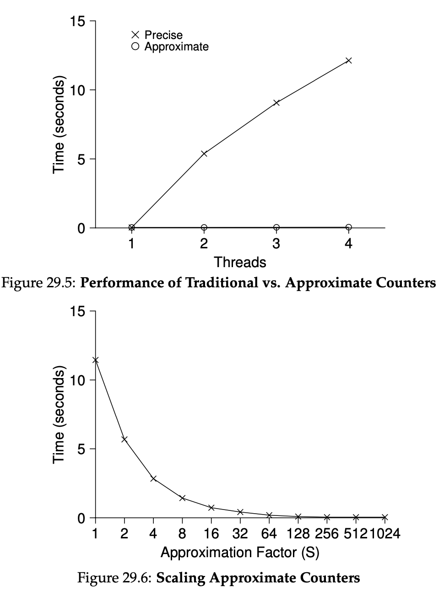

`Lock`을 다음 주제로 넘어가기 전에 일반 데이터 구조에 `Lock`을 얹어 쓰는 방법을 다룹니다.<br/>
모든 상황에 두루 통하는 방법을 찾기 어렵기 때문에 시나리오별로 나누어 살펴봅니다.

이번 챕터는 자료 구조라서 학습을 위해 파이썬(표준 라이브러리 `threading`)으로 같은 패턴을 옮겨 적습니다.

# Concurrent Counters
가장 단순한 데이터 구조 중 하나가 카운터입니다. 특정 값을 카운트하는 자료 구조로, 간단하게는 아래처럼 표현할 수 있습니다.
```python
class Counter:
    def __init__(self):
        self.value = 0

    def increment(self):
        self.value += 1

    def decrement(self):
        self.value -= 1

    def get(self):
        return self.value
```

위 코드에 `lock`과 동시성을 추가해서 멀티스레드로 돌려봅시다.

OSTEP에서는 이 벤치마크를 `Intel 2.7 GHz i5`(4코어)가 달린 `iMac`에서 돌렸고, 동기화된 카운터에 대해 스레드 수만 바꿔 스레드마다 공유 카운터를 백만 번씩 증가하는 로직을 측정하면 대략 아래처럼 나옵니다.
- 단일 스레드: 약 0.03초
- 스레드 2개로 동시에 돌림: 약 5초

아래 코드처럼 단일 `lock`을 추가하고 로직을 진행하면 스레드 수가 늘어날수록 더 나빠집니다. 카운터를 같은 락 하나로만 보호하면 갱신이 직렬화되고, 대기 비용과 캐시 라인 경합 비용이 커지기 때문입니다.

```python
import threading

class Counter:
    def __init__(self):
        self.value = 0
        self.lock = threading.Lock() 

    def increment(self):
        with self.lock:
            self.value += 1

    def decrement(self):
        with self.lock:
            self.value -= 1

    def get(self):
        with self.lock:
            return self.value
```
이상적으로는 여러 프로세서에서 코어와 스레드가 늘어도, 단일 스레드일 때처럼 전체 시간이 크게 불어나지 않는 확장성(scalability)을 기대합니다. 
그런데 위와 같은 단일 글로벌 락 카운터만으로는 그 기대를 충족하기 어렵기 때문에, 한계를 보완할 방법을 사람들이 추구했고 찾아냈죠.

`approximate counter`(근사 카운터)가 그 중 하나입니다.
근사 카운터는 각 CPU 코어당 하나의 로컬 물리적 카운터와 글로벌 카운터로 단일 논리 카운터를 나타내는 방식으로 동작합니다.
구체적으로 CPU가 네 개인 머신에서는 로컬 카운터 네 개와 글로벌 카운터 하나가 있는 셈이죠.

아래 표는 시간 스텝마다 로컬 카운터(L1~L4)와 글로벌 카운터(G)가 어떻게 바뀌는지 보여줍니다. 이를 보면 개념을 잡기 쉽습니다.

| 시간 | L1 | L2 | L3 | L4 | G |
|:----:|:--:|:--:|:--:|:--:|:--:|
| 0 | 0 | 0 | 0 | 0 | 0 | 
| 1 | 0 | 0 | 1 | 1 | 0 | 
| 2 | 1 | 0 | 2 | 1 | 0 | 
| 3 | 2 | 0 | 3 | 1 | 0 | 
| 4 | 3 | 0 | 3 | 2 | 0 | 
| 5 | 4 | 1 | 3 | 3 | 0 | 

시간 6과 7에서는 로컬 카운터가 글로벌 카운터에 병합됩니다.

| 시간 | 설명| L1 | L2 | L3 | L4 | G |
|:----:|-----------------|:--:|:--:|:--:|:--:|:--:|
| 6 | L1이 G에 병합 | 0 | 1 | 3 | 4 | 5 |
| 7 | L4가 G에 병합 | 0 | 2 | 4 | 5 | 10 |

근사 카운팅의 기본 개념은 이렇습니다. 주어진 코어에서 실행 중인 스레드가 카운팅할 때 로컬 카운터를 올리고, 그 로컬 카운터에 대한 접근은 해당 로컬 `lock`으로 동기화합니다.
각 `CPU`는 자기 로컬 카운터만 두므로 `CPU`끼리는 서로의 로컬을 두고 경쟁하지 않아, 카운팅 쪽 확장성을 얻을 수 있습니다.

스레드가 카운터 값을 읽을 때를 대비해, 로컬 값은 주기적으로 글로벌 카운터에 병합됩니다. 이때 글로벌 `lock`을 잡은 뒤 로컬에 쌓인 만큼 글로벌 카운터를 올리고 로컬은 `0`으로 리셋하는 식으로 동작합니다.

로컬에서 글로벌로 넘기는 주기는 임계값으로 정해집니다. 로컬 카운터 값이 임계값 이상이 되면(교재 코드는 `>=`) 글로벌 카운터에 병합하는 방식입니다.
- 임계값이 작으면 앞에서 본 비확장 카운터에 가깝게 동작합니다.
- 임계값이 크면 확장성은 좋아지지만 근사 카운터이기 때문에 실제 값과의 오차는 임계값이 클수록 비례해서 커집니다.

다음은 근사 카운터의 구현 코드입니다. `num_cpus`(교재의 `NUMCPUS`)는 로컬 슬롯 개수입니다(보통 물리 코어 수에 맞춥니다).

```python
import threading

class ApproximateCounter:
    def __init__(self, threshold, num_cpus=4):
        self.threshold = threshold
        self.num_cpus = num_cpus

        # global counter & lock
        self.global_counter = 0
        self.glock = threading.Lock()

        # local counter & lock list
        self.local = [0] * num_cpus
        self.llock = [threading.Lock() for _ in range(num_cpus)]

    def update(self, thread_id, amt):
        # CPU 슬롯 인덱스를 얻기 위한 모듈러; 균등 부하 분배를 보장하진 않음
        cpu = thread_id % self.num_cpus

        with self.llock[cpu]:
            self.local[cpu] += amt

            if self.local[cpu] >= self.threshold:
                with self.glock:
                    self.global_counter += self.local[cpu]
                self.local[cpu] = 0

    def get(self):
        with self.glock:
            val = self.global_counter
        return val
```
다음 29.5 그림은 전통적인 카운터와 근사치 카운터를 스레드 개수와 시간을 두고 비교한 지표입니다.<br/>
29.6 그림은 근사치 카운터에서 임계값(threshold)에 따른 비교이며, 위에서 언급했던 특징이 잘 드러납니다.



이러한 아이디어에서 중요한 건 결국 성능 테스트입니다.<br/>
내가 생각해 낸 아이디어는 빠르거나 느리거나 한 결과를 도출하기 때문이죠.

# Concurrent Linked Lists
더 복잡한 구조인 연결 리스트를 짧게 살펴봅니다. 기본 성질은 생략하고, 삽입과 조회만 다룹니다.

일반(단일 스레드) 연결 리스트와의 차이는 자료 구조의 모양이 아니라, 누가 동시에 `head`와 `next`를 바꾸느냐에 있습니다.
한 스레드만 리스트를 건드린다면 `head`를 갱신하는 삽입·순회는 추가 동기화 없이도 안전합니다. 반면 여러 스레드가 같은 리스트에 삽입·조회하면, 같은 시점에 `head`나 노드의 `next`를 읽고 쓰는 순서가 섞여 데이터 경쟁(data race)이 날 수 있습니다.
그래서 아래 코드처럼 리스트에 `threading.Lock()` 하나를 두고, 공유 필드인 `head`와 링크(`next`)를 바꾸는 구간을 임계 구역으로 묶습니다.

교재에서 `malloc`을 `lock` 밖에서 하는 이유는 대략 세 가지로 정리할 수 있습니다. 
- 노드 블록을 확보하는 일은 시간이 들 수 있다. 
- 실패할 수 있어 실패 분기에서 `unlock`을 빼먹기 쉽다. 
- 임계 구역을 짧게 유지하는 게 좋다.

파이썬에서는 `malloc()`에 해당하는 한 줄은 `new_node = Node(key)`(객체 하나를 만들고 스택/로컬이 그 참조를 잡아 두는 과정, 가비지 컬렉션이 회수를 담당)입니다. 
`MemoryError`는 드물지만, 교재와 같은 <u>실패 가능한 작업을 락 안에 두지 않는다</u>는 요지는 동일하게 읽히게 하려고 이 줄은 `with self.lock` 위에 두었습니다.

반대로 먼저 락을 잡은 뒤 노드를 만들면, 예외·조기 반환 경로에서 `finally` 또는 `unlock` 처리가 흐려져 실수하기 쉽습니다.
```python
import threading

class Node:
    def __init__(self, key):
        self.key = key
        self.next = None

class ConcurrentList:
    def __init__(self):
        self.head = None
        self.lock = threading.Lock()

    def insert(self, key):
        # C의 malloc 후 노드 필드를 채우는 부분에 해당
        # 파이썬에서는 별도의 에러 핸들링이 거의 필요 없음
        new_node = Node(key)

        with self.lock:
            new_node.next = self.head
            self.head = new_node

    def lookup(self, key):
        rv = -1
        with self.lock:
            curr = self.head
            while curr:
                if curr.key == key:
                    rv = 0 # 성공
                    break
                curr = curr.next
        return rv
```
위 연결 리스트 구현은 **확장성** 측면에서 한계가 큽니다.
- 전역 `lock`이 하나라 삽입·조회가 모두 그 락 하나로 직렬화됩니다. `CPU`를 늘려도 처리량이 거의 비례해서 늘지 않는 대표적인 이유입니다.
- 아래 코드의 `lookup`은 `while`으로 도는 동안 락을 놓지 않습니다. 리스트 길이를 `n`이라 하면 임계 구역 길이가 O(n) 이 되어, 다른 스레드가 오래 기다리게 됩니다.
- `lock`과 `head`가 들어 있는 캐시 라인을 여러 코어가 번갈아 건드리면 **캐시 무효화**와 메모리 트래픽 부담이 커질 수 있습니다.

이에 대한 대안으로 **hand-over-hand**(잠금 연쇄, lock coupling)가 있습니다.<br/>
리스트 전체 뮤텍스 대신 노드마다 뮤텍스를 두고, 탐색할 때는 (이미 잡고 있는) 현재 노드의 다음 노드 락을 잡은 뒤 현재 노드 락을 해제하는 식으로 한 칸씩 전진합니다. 사다리를 타듯 손을 옮겨 잡는 모습에 비유해 이런 이름이 붙었습니다.
`lookup`이 대표적인 사용 예입니다.

```python
import threading

class Node:
    def __init__(self, key):
        self.key = key
        self.next = None
        # 각 노드별로 `lock`을 둠
        self.lock = threading.Lock()


class HandOverHandList:
    def __init__(self):
        self.head = None
        self.head_lock = threading.Lock()

    def insert(self, key):
        # `lock` 전에 노드 준비
        new_node = Node(key)
        with self.head_lock:
            new_node.next = self.head
            self.head = new_node

    def lookup(self, key):
        """Hand-over-hand 방식 적용"""
        self.head_lock.acquire()
        curr = self.head

        # 빈 경우 -1로 에러 처리
        if curr is None:
            self.head_lock.release()
            return -1

        # 노드 락으로 변경
        curr.lock.acquire()
        self.head_lock.release()

        try:
            while curr:
                if curr.key == key:
                    return 0 # 노드 찾음

                next_node = curr.next

                if next_node is None:
                    break

                # 다음 노드 락으로 변경
                next_node.lock.acquire()
                curr.lock.release()
                curr = next_node

            return -1 # 못 찾음
        finally:
            # 루프를 어떻게 빠져나오든 해당 노드의 락은 해제해야 함
            if curr:
                curr.lock.release()

```

다만 hand-over-hand는 노드마다 `lock`/`unlock`이 들어가 **오버헤드**가 큽니다. 그래서 일정 개수의 노드마다 락을 두는 식의 하이브리드를 찾아볼 가치는 있습니다.

# Concurrent Queues
동시성 데이터 구조를 만드는 데는 표준적인 접근이 항상 있고, 가장 쉬운 방법은 큰 `lock` 하나를 두는 것입니다. 여기서 더 나아가면 확장성을 위해 `lock`을 쪼개거나 다른 방법을 찾는 등의 방향으로 나아갑니다.

먼저 단일 `lock`으로 큐를 구현하면 다음과 같습니다.
```python
import threading

class Node:
    def __init__(self, value=None):
        self.value = value
        self.next = None

class Queue:
    def __init__(self):
        tmp = Node()
        self.head = tmp
        self.tail = tmp
        self.lock = threading.Lock()

    def enqueue(self, value):
        # `lock` 밖에서 노드 확보
        new_node = Node(value)
        with self.lock:
            # tail 뒤에 노드를 추가 후 tail 이동
            self.tail.next = new_node
            self.tail = new_node

    def dequeue(self):
        with self.lock:
            old_head = self.head
            new_head = self.head.next

            # 큐가 비었는지 확인
            if new_head is None:
                return -1

            value = new_head.value
            self.head = new_head

            return value
```

단일 `lock`을 이용한 큐 역시 단일 `lock`을 지닌 연결 리스트와 동일한 확장성 문제를 가집니다.

동시성 큐의 핵심은 `head`와 `tail`에 각각 `lock`을 두는 것입니다. 두 `lock`의 목표는 `enqueue`와 `dequeue`가 가능한 한 동시에 진행되게 하는 것이죠.
일반적으로 `enqueue` 루틴은 `tail` 락만, `dequeue` 루틴은 `head` 락만 주로 접근합니다.

큐는 멀티스레드 애플리케이션에서 흔히 쓰이지만, 여기서 소개되는 락만 쓴 큐는 요구사항을 모두 채우지 못합니다. 큐가 비었거나 가득 찼을 때 스레드가 대기 상태로 막혀(블로킹) 있다가 깨워지게 하는 더 완전한 `bounded queue`는 다음 장의 `condition variables`에서 다룰 예정입니다.

교재에서는 `Enqueue` 안에서 새 노드를 `malloc`으로 만든 다음에야 `tail` 락을 잡도록 되어 있습니다.
파이썬에서는 그 `malloc`(노드 확보) 역할을 `new_node = Node(value)` 한 줄이 맡아 `with self.tail_lock`보다 위에 둡니다.

`Dequeue` 쪽 교재 코드의 `free(tmp)`는 참조를 하나 줄이는 일에 해당하므로, 여기서는 `head`를 앞당긴 뒤 더 이상 큐 객체가 이전 헤드 노드를 가리키지 않게 만들면 가비지 컬렉터가 알아서 회수합니다. 필요하면 명시적으로 `del old_head`를 둘 수도 있지만, 함수가 끝나 로컬 참조가 사라지는 것만으로도 결과는 같습니다.

이제 `head`와 `tail`에 락을 나눈 구현은 다음과 같습니다.
```python
import threading

class Node:
    def __init__(self, value=None):
        self.value = value
        self.next = None

class ConcurrentQueue:
    def __init__(self):
        tmp = Node()
        self.head = tmp
        self.tail = tmp

        # head, tail에 대한 lock 분리
        self.head_lock = threading.Lock()
        self.tail_lock = threading.Lock()

    def enqueue(self, value):
        new_node = Node(value)
        with self.tail_lock:
            self.tail.next = new_node
            self.tail = new_node

    def dequeue(self):
        with self.head_lock:
            old_head = self.head
            new_head = self.head.next

            # 큐가 비었는지 확인
            if new_head is None:
                return -1

            value = new_head.value
            self.head = new_head

            return value
```

# Concurrent Hash Table
크기를 조정하지 않는 간단한 해시 테이블은 위에서 만든 `ConcurrentList`를 이용해 만들 수 있습니다.
전체 테이블에 단일 `lock`을 거는 것보다 버킷마다 `lock`을 나누면 경합이 줄어드는 패턴입니다.

```python
# 위 절에서 정의한 ConcurrentList 클래스를 재사용한다고 가정합니다.

class ConcurrentHashTable:
    def __init__(self, buckets=101):
        self.num_buckets = buckets
        # 각 버킷마다 독립적인 ConcurrentList(자신만의 락을 가짐)를 생성
        self.lists = [ConcurrentList() for _ in range(self.num_buckets)]

    def insert(self, key):
        """Hash_Insert: 키를 해싱하여 해당 버킷에 삽입"""
        bucket_index = key % self.num_buckets
        return self.lists[bucket_index].insert(key)

    def lookup(self, key):
        """Hash_Lookup: 키를 해싱하여 해당 버킷에서 검색"""
        bucket_index = key % self.num_buckets
        return self.lists[bucket_index].lookup(key)
```

# Summary
카운터, 리스트, 큐, 해시 테이블까지 데이터 구조에 동시성을 적용하면 어떻게 달라지는지 살펴봤습니다. 
살펴본 바와 같이 제어 흐름에서 `lock`을 얻고 놓는 방식을 어떻게 설계하느냐에 따라 확장성이 크게 달라집니다.

# Homework

벤치마크로 성능을 체크할 때, PC 환경과 측정하는 함수의 오버헤드를 고민해야 합니다.
```python
import time

def bench(name, fn, n=300_000):
    # perf_counter_ns: 코드 실행 시간 측정에 최적화
    t0 = time.perf_counter_ns()
    for _ in range(n):
        fn()
    t1 = time.perf_counter_ns()
    dt = t1 - t0
    print(f"{name:20s}  n={n:>7}  total={dt:>12} ns  per_call={dt / n:>8.2f} ns")

if __name__ == "__main__":
    print(time.get_clock_info("perf_counter"))
    bench("perf_counter_ns", time.perf_counter_ns)

    print(time.get_clock_info("monotonic"))
    bench("time_ns (wall)", time.time_ns)
```

위 코드는 파이썬의 코드 정밀 측정용인 `perf_counter_ns`와 실제 시간을 참조하는 `time_ns`를 300,000번 반복해서 부르면서 시간 측정하는 함수를 측정했죠. 일반적으로는 `perf_counter_ns`가 오버헤드가 적게 발생할 가능성이 높습니다만 실제 결과로 확인해보면

```bash
namespace(implementation='mach_absolute_time()', monotonic=True, adjustable=False, resolution=4.166666666666666e-08)
perf_counter_ns       n= 300000  total=    26977458 ns  per_call=   89.92 ns
namespace(implementation='mach_absolute_time()', monotonic=True, adjustable=False, resolution=4.166666666666666e-08)
time_ns (wall)        n= 300000  total=    18927500 ns  per_call=   63.09 ns
```

이 로그처럼 `per_call`이 `perf_counter_ns` 쪽이 더 클 수도 있습니다. CPython 루프·바이트코드·OS 구현이 섞여 있어서, OS나 CPU, 파이썬 버전에 따라 두 함수의 상대 속도는 바뀔 수 있습니다. 

즉 마이크로벤치 결과도 OS·런타임에 종속된다는 것이고 우리가 짠 벤치마크조차 결국 그 위에서 돌아갑니다.

참고로 `time_ns`는 os와 동일하게 하기 위해 수치 보정이 들어가기 떄문에 알고리즘 시간 측정에서는 `perf_counter_ns`를 쓰느 겁니다.

---

다음 코드는 여러 개의 스레드를 동시에 돌릴 때 `lock`을 쓰는지 여부가 성능과 데이터 정확도(`count`)에 어떤 영향을 주는지 실험하는 멀티스레딩 벤치마크입니다.

```python
import os
import threading
import time
import statistics
from array import array

N_TOTAL = 500_000

def run_once(num_threads, use_lock):
    # // = floor div
    iters = N_TOTAL // num_threads
    # L = unsigned long
    counter = array("L", [0])
    # 파라미터에 따라 락 사용 여부
    lock = threading.Lock() if use_lock else None

    def worker():
        local_lock = lock
        for _ in range(iters):
            if local_lock is not None:
                with local_lock:
                    counter[0] += 1
            else:
                counter[0] += 1

    t0 = time.perf_counter()
    threads = [threading.Thread(target=worker) for i in range(num_threads)]
    for t in threads:
        t.start()
    for t in threads:
        t.join()
    return counter[0], time.perf_counter() - t0

def median_seconds(repeats, num_threads, use_lock):
    times = []
    last_count = 0
    for _ in range(repeats):
        last_count, dt = run_once(num_threads, use_lock)
        times.append(dt)
    return statistics.median(times), last_count

if __name__ == '__main__':
    repeats = 7
    warmup = 2
    threads_list = [1, 2, 4, 8, 16]

    # cpu 개수 체크
    print("logical cpus:", os.cpu_count())
    if hasattr(os, "process_cpu_count"):
        print("process cpus:", os.process_cpu_count())

    # 스레드 수 변경해보며 성능 테스트
    for num_threads in threads_list:
        # 워밍업: 캐시·인터프리터 상태를 안정시켜 첫 실행 `lag`를 측정값에서 빼기 위함
        for _ in range(warmup):
            run_once(num_threads, use_lock=True)

        # lock 여부를 달리해 실행
        med_lock, c_lock = median_seconds(repeats, num_threads, True)
        med_nolock, c_nolock = median_seconds(repeats, num_threads, False)
        print(
            f"threads={num_threads:2d}  "
            f"median_sec lock={med_lock:.4f} count={c_lock} | "
            f"nolock={med_nolock:.4f} count={c_nolock}"
        )

```

위 코드로 멀티스레드 환경에서 `lock`을 쓰면 `count`는 안정되지만 시간은 늘어날 수 있고, 스레드 수를 바꿀 때 둘의 차이를 같이 볼 수 있습니다.

아래 로그는 한 대의 PC에서 한 번 찍은 예시일 뿐입니다. 
이 환경에서는 스레드 1개+`lock` 없음이 가장 빠르게 나왔고, `lock` 없이 스레드를 늘리면 `count`가 `N_TOTAL`보다 작아지는(데이터 손실) 패턴이 보입니다, 환경별로 합리적인 스레드 개수는 다르므로 벤치마크
테스트가 필요합니다.

```text
logical cpus: 8
process cpus: 8
threads= 1  median_sec lock=0.0760 count=500000 | nolock=0.0320 count=500000
threads= 2  median_sec lock=0.0917 count=500000 | nolock=0.0815 count=443954
threads= 4  median_sec lock=0.1033 count=500000 | nolock=0.1393 count=300218
threads= 8  median_sec lock=0.0983 count=500000 | nolock=0.3472 count=158225
threads=16  median_sec lock=0.1346 count=500000 | nolock=0.3705 count=145595
```

참고로 위 코드에서는 멀리 스레드 환경을 위해 `gil`을 끄고 진행했습니다.