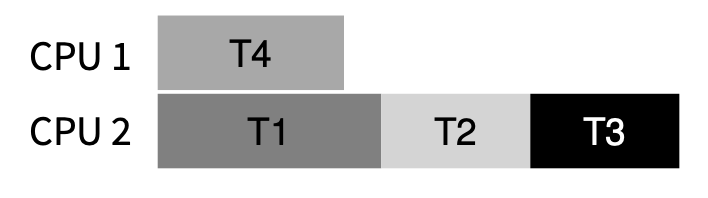
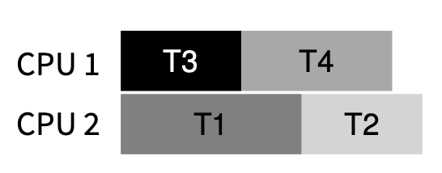

많은 사람들이 오랜 시간 동안 동시성 버그에 대해 시간과 노력을 들여 연구해 왔습니다. 대부분 교착 상태에 초점이 맞춰졌고, 이는 이전 장에서도 언급했듯 이번 장에서 더 깊이 다룰 것입니다.

이번에는 하드웨어와 밀접한 설명이 많아 `c`로 진행합니다.

# What Types Of Bugs Exist
다음 4가지 주요 오픈 소스 애플리케이션에 초점을 두고 예시를 들어 봅시다.
- MySQL (인기 있는 데이터베이스 관리 시스템)
- Apache (잘 알려진 웹 서버)
- Mozilla (유명한 웹 브라우저)
- OpenOffice (일부 사람들이 실제로 사용하는 MS Office 제품군의 무료 버전)

다음은 Lu와 그의 동료들이 연구한 버그 요약본입니다.

| Application | What it does    | Non-Deadlock | Deadlock |
|------------|-----------------|--------------|----------|
| MySQL      | Database server | 14           | 9        |
| Apache     | Web server      | 13           | 4        |
| Mozilla    | Web browser     | 41           | 16       |
| OpenOffice | Office suite    | 6            | 2        |
| Total      |                 | 74           | 31       |

위와 같이 오픈 소스 생태계에서 큰 축을 담당하는 성숙한 코드베이스에서도 교착 상태로 인해 많은 버그가 발생했음을 알 수 있습니다.
이제 비교착 상태 버그와 교착 상태 버그를 나누어 살펴봅니다.
교착 상태 버그에 대해서는 교착을 피하거나 방지·회피·처리하는 흐름을 따라가며 정리할 예정입니다.

# Non-Deadlock Bugs
비교착 상태 버그가 동시성 버그의 상당 부분을 차지한다는 것을 볼 수 있었습니다. 총 105건 중 74건이 비교착 상태였죠. 이제 이 부류의 버그를 살펴봅시다. 실제로 동시성 버그 중 비교착 상태 버그의 비중이 90% 이상이라고 보고한 사례도 있습니다.

## Atomicity-Violation Bugs (원자성 위반)
다음은 MySQL에서 발견된 간단한 예시입니다.
```c
Thread 1::
if (thd->proc_info) {
     fputs(thd->proc_info, ...);
}
Thread 2::
thd->proc_info = NULL;
```

위 코드를 보면 서로 다른 스레드가 구조체 `thd`의 필드 `proc_info`에 접근합니다. `Thread 1`은 값이 `NULL`이 아닌지 확인한 뒤 그 값을 출력하고, `Thread 2`는 그 값을 `NULL`로 바꿉니다.
바로 감이 오실 겁니다.
`Thread 1`이 조건을 통과한 뒤 `fputs`를 실행하기 전에 중단되었다가, 그 사이 `Thread 2`가 `proc_info`를 `NULL`로 바꾸고, 다시 `Thread 1`이 이어서 실행되면 `fputs`에 `NULL` 포인터가 넘어가 충돌이 발생할 수 있습니다.
- 역참조(Dereferencing): C/C++에서 포인터 변수가 가리키는 메모리 주소를 따라가 값을 읽거나 수정하는 행위

그래서 이 버그의 공식적인 정의는 "여러 메모리 접근 간의 원하는 직렬화가 위반됩니다"입니다. 

이 버그 상황을 방지하려면 `Lock`을 추가해 두 스레드가 해당 필드를 원자적으로 다루게 해야 합니다.
```c
pthread_mutex_t proc_info_lock = PTHREAD_MUTEX_INITIALIZER;

Thread 1::
pthread_mutex_lock(&proc_info_lock);
if (thd->proc_info) {
    fputs(thd->proc_info, ...);
}
pthread_mutex_unlock(&proc_info_lock);

Thread 2::
pthread_mutex_lock(&proc_info_lock);
thd->proc_info = NULL;
pthread_mutex_unlock(&proc_info_lock);
```
우리가 이전 장에서부터 말해 온 원자성을 지키는 방식이 여기에 해당합니다.

## Order-Violation Bug (순서 위반)
일반적으로 발생할 수 있는 순서 위반으로 생기는 버그입니다.
```c
Thread 1::
void init() {
    mThread = PR_CreateThread(mMain, ...);
}

Thread 2::
void mMain(...) {
    mState = mThread->State;
}
```
위 코드는 `Thread 2`가 `mThread->State`에 접근할 때 `mThread`가 이미 초기화되어 있다고 가정합니다.
하지만 `Thread 2`가 먼저 실행되면 `mThread`가 아직 `NULL`일 수 있고, 그 상태에서 `mThread->State`를 역참조하면 충돌이 발생할 수 있습니다.

그래서 이 버그의 공식적인 정의는 "두 개(그룹)의 메모리 접근 간의 원하는 순서가 뒤바뀐 것"입니다.

이 유형의 버그를 수정하는 일반적인 방법은 아래 코드처럼 순서를 강제하는 것입니다. 앞서 언급했던 조건 변수(`cv`)를 사용하는 것이 쉽고 강력한 방법이죠.

```c
pthread_mutex_t mtLock = PTHREAD_MUTEX_INITIALIZER;
pthread_cond_t mtCond = PTHREAD_COND_INITIALIZER;
int mtInit = 0;

Thread 1::
void init() {
    ...
    mThread = PR_CreateThread(mMain, ...);

    // signal that the thread has been created...
    pthread_mutex_lock(&mtLock);
    mtInit = 1;
    pthread_cond_signal(&mtCond);
    pthread_mutex_unlock(&mtLock);
    ...
}

Thread 2::
void mMain(...) {
    ...
    // wait for the thread to be initialized...
    pthread_mutex_lock(&mtLock);
    while (mtInit == 0)
        pthread_cond_wait(&mtCond, &mtLock);
    pthread_mutex_unlock(&mtLock);

    mState = mThread->State;
    ...
}
```
이렇게 하면 `init`에서 초기화 작업을 완료하고 신호를 보낸 뒤에만 `Thread 2`가 이어서 실행됩니다.
`Thread 2`가 초기화보다 먼저 실행되었다면 신호가 올 때까지 잠들게 되어 원하는 순서를 보장할 수 있습니다.

동시성 버그에서 상당 부분이 원자성 또는 순서 위반에 따른 버그이므로 이러한 유형에 대해 신주아게 고민하면 더 나은 결과를 낼 수 있을 겁니다.
또 여러 코드 검사 도구가 개발됨에에 따라 더 집중하기 좋아졌죠.

# Deadlock Bugs
위에서 언급한 동시성 버그를 넘어서, 복잡한 잠금 프로토콜을 가진 많은 동시성 프로그램에서 가지는 고전적인 문제는 `Deadlock`으로 알려져 있습니다.

예를 들어 `Thread 1`이 필요한 `Lock 1`을 다른 `Thread 2`가 보유하고 있고, `Thread 2`는 또 다른 `Lock 2`를 기다리고 있을 때 교착 상태가 발생할 수 있습니다. 여기서 `Thread 2`가 필요한 `Lock 2`를 `Thread 1`이 보유하고 있다면 데드락 상태가 되죠.

코드로 간단하게 다음처럼 나타낼 수 있는데, 항상 데드락이 발생하는 것은 아닙니다. `Thread 1`이 `L1`을 보유한 뒤 인터리빙으로 `Thread 2`가 `L2`를 보유하게 되면, 두 스레드가 서로를 기다리며 아무것도 실행할 수 없는 상태가 됩니다.
```
Thread 1:
pthread_mutex_lock(L1);
pthread_mutex_lock(L2);

Thread 2:
pthread_mutex_lock(L2);
pthread_mutex_lock(L1);
```

다음 그림처럼 서로의 자원을 끊임없이 요구하게 됩니다.


## Why Do Deadlocks Occur?
이러한 교착 상태가 발생하는 이유는 다음과 같습니다.

**대규모 코드베이스의 복잡한 의존관계**<br/>
OS를 기준으로 예를 들면, 가상 메모리 시스템은 디스크에서 블록을 가져온 뒤 페이지로 정렬하기 위해 파일 시스템에 접근해야 할 수 있습니다.
이후 파일 시스템은 블록을 읽기 위해 메모리 페이지가 필요해 가상 메모리 시스템에 의존하는 등, 대규모 시스템에서의 `lock` 전략 설계는 코드에서 자연스럽게 생기는 순환 의존성으로 인한 교착 상태를 피하기 위해 꼭 필요합니다.

**캡슐화의 특성**<br/>
우리는 구현 세부 정보를 숨기고 SW를 모듈 방식으로 쉽게 구축할 수 있도록 인터페이스를 사용하는 경우가 많습니다.
그로 인해 겉으로 볼 때는 무해한 인터페이스가 교착 상태를 초래하는 경우가 있습니다.
예를 들어 `Java Vector` 클래스와 메서드 `AddAll()`이 있습니다.
```java
Vector v1, v2;
v1.AddAll(v2);
```
이는 문제가 없어 보이지만, 이 메서드는 다중 스레드 안정성을 유지하려면 `v1`과 `v2`의 `lock`을 획득한 뒤 진행해야 합니다.
만약 다른 스레드가 동시에 이를 호출하면 교착 상태가 내부적으로 발생할 수 있죠.

## Conditions for Deadlock
이러한 교착 상태가 발생하기 위해서는 아래 4가지 조건이 충족돼야 합니다.
- 상호 배제 (Mutual exclusion): 스레드는 자신이 필요한 자원에 대해 독점적인 제어를 원합니다.
- 점유 및 대기 (Hold and wait): 스레드는 추가 자원(획득하고자 하는 `lock`)을 기다리는 동안 자신에게 할당된 자원(`lock`)을 유지합니다.
- 선점 불가 (No preemption): 자원(`lock`)은 이를 보유하고 있는 스레드로부터 강제로 제거될 수 없습니다.
- 순환 대기 (Circular wait): 각 스레드가 다른 스레드가 보유한 자원을 요청하면서 원형으로 대기하는 순환 체인이 존재합니다.

위 4가지 중 하나라도 충족되지 않는다면 교착 상태는 발생하지 않습니다.
이러한 각 요인을 분석해 어느 하나라도 발생하지 않도록 하는 것을 목표로 하며, 이것이 교착 상태를 방지하는 접근 방식입니다.

## Prevention

**Circular wait (순환 대기)**<br/>
가장 실용적인 예방 기술(그리고 가장 많이 사용되는 방법)로, `lock` 사용 규칙을 정해 순환 대기가 생기지 않게 하는 것입니다.
가장 간단한 방법은 `lock` 획득 순서를 강제하는 것입니다. 예를 들어 시스템에 `lock`이 두 개(`L1`, `L2`)만 있다면, `L1`을 항상 `L2`보다 먼저 획득하게 하여 교착 상태를 방지할 수 있습니다. (철학자 문제도 이 방식으로 접근했죠)

물론 더 복잡한 시스템에서는 전체 `lock`의 순서를 제어하는 것이 쉽지 않거나 불필요할 수 있습니다. 따라서 부분적으로 `lock` 순서를 구조화해 교착 상태를 피할 수 있습니다.

실제 예시는 `Linux`의 메모리 매핑 코드에서 볼 수 있습니다.
```c
if (m1 > m2) { // grab in high-to-low address order
       pthread_mutex_lock(m1);
       pthread_mutex_lock(m2);
     } else {
       pthread_mutex_lock(m2);
       pthread_mutex_lock(m1);
     }
     // Code assumes that m1 != m2 (not the same lock)
```

핵심은 두 락 중 어느 것을 먼저 잡을지 <u>주소가 큰 것부터</u>처럼 일관된 기준으로 정해 두는 것입니다, 하나의 일관된 규칙을 넣는 거죠.
이렇게 하면 서로 다른 스레드가 같은 두 락을 잡더라도 획득 순서가 같아져 순환 대기가 깨집니다. 마지막으로 덧붙이면 주석처럼 `m1 != m2`(동일한 락이 아님)도 전제입니다.

**Hold and wait (점유 및 대기)**
교착 상태에 대한 요구 사항은 모든 잠금을 한번에 원자적으로 획득함으로써도 피할 수 있습니다.
```c
pthread_mutex_lock(prevention); // begin acquisition
pthread_mutex_lock(L1);
pthread_mutex_lock(L2);
...
pthread_mutex_unlock(prevention); // end
```
이는 전체 작업에 대한 `lock`을 잡아 중간에 부적절한 스레드 전환이 끼어드는 것을 원천 봉쇄합니다. 다만 이 해결책은 해당 작업에 필요한 모든 `lock`을 정확히 알고 미리 획득해야 한다는 요구 사항이 생깁니다. 또한 한 번에 모든 `lock`을 획득하므로 동시성이 감소할 수 있어, 적절한 곳에만 사용해야 합니다.

**No preemption (선점 불가)**
우리는 일반적으로 `lock`을 획득하면 해제할 때까지 보유한 것으로 봅니다.
그로 인해 여러 `lock` 획득은 종종 문제를 일으키죠.
하나의 `lock`을 얻기 위해 기다리는 동안 이미 점유하고 있는 `lock`들도 같이 보유하고 있기 때문입니다.

많은 스레드 라이브러리는 이 상황을 피하고자 더 유연한 인터페이스를 제공합니다. C의 `pthread_mutex_trylock`처럼, 다른 스레드가 이미 사용 중인 `lock`이면 현재 스레드를 `block`하지 않고 즉시 실패로 반환하는 기능이 대표적입니다. 이를 이용하면, 필요한 `lock`을 모두 얻지 못했을 때 이미 잡은 `lock`을 풀고 다시 시도하는 방식으로 교착 상태를 피하는 프로토콜을 구축할 수 있습니다.
```c
top:
    pthread_mutex_lock(L1);
    if (pthread_mutex_trylock(L2) != 0) {
        pthread_mutex_unlock(L1); 
        goto top; 
    }
```
위 코드는 `L2`를 못 잡으면 `L1`을 내려놓고 재시도함으로써, “잡은 자원을 빼앗을 수 없다”는 성질을 완화하는 효과를 냅니다.
하지만 새로운 문제가 생길 수 있는데, 이 경우 `livelock`이 발생할 수 있습니다.
두 스레드가 같은 시퀀스를 반복 시도하며 계속 실패할 수 있고, 이때 두 스레드는 계속 실행 중이지만 진행이 없어 겉으로는 돌아가는 것처럼 보입니다. 이를 `livelock`이라고 부릅니다.

`livelock`의 완화책으로는 루프를 다시 시작하기 전에 무작위 지연을 넣어, 경쟁하는 스레드 간 반복적인 간섭 확률을 줄이는 방법이 있습니다.

이 접근은 엄밀한 의미의 선점(다른 스레드가 보유한 잠금을 강제로 빼앗는 것)을 추가하는 것은 아니지만, 실패 시 이미 잡은 잠금을 스스로 반납하게 만들어 `No preemption` 조건을 깨는 쪽으로 유도합니다. 실용적인 방법이지만 공정성 저하나 `livelock`을 디버깅하기 어렵다는 단점이 있습니다.

**상호 배제 (Mutual exclusion)**<br/>
최종 예방 기술은 상호 배제의 필요성을 완전히 피하는 것입니다.
일반적으로 우리가 실행하고자 하는 코드에는 실제로 임계 구역이 있기 때문에 이것이 어렵다는 것을 알고 있습니다.
그래서 `Herlihy`는 하드웨어 명령어를 사용해 명시적인 `lock` 없이도 데이터 구조를 구축할 수 있다는 아이디어를 제시했습니다.

간단한 예로 비교 및 교환(`compare-and-swap`) 명령어가 있다고 가정해 보겠습니다. 이는 HW에서 제공하는 원자적 명령어로, 다음과 같은 작업을 수행합니다.
```c
int CompareAndSwap(int *address, int expected, int new) {
    if (*address == expected) {
        *address = new;
        return 1; // success
    }
    return 0; // failure 
}
```
이를 사용해 특정 수만큼 원자적으로 증가시키고 싶을 때, 다음처럼 작성할 수 있습니다.

```c
void AtomicIncrement(int *value, int amount) {
    int old;
    do {
        old = *value;
    } while (CompareAndSwap(value, old, old + amount) == 0);
}
```

이 코드가 원자적으로 동작하는 이유는, 여러 스레드가 동시에 호출해도 `CompareAndSwap()`이 (현재 값이 `old`와 같은지) 비교하고 같으면 `old + amount`로 갱신하는 과정을 HW의 원자적 명령으로 보장하기 때문입니다. 경쟁으로 비교에 실패하면 값이 갱신되지 않고 루프를 돌며 최신 값을 다시 읽어 재시도합니다.

이 예시는 `lock`을 잡지 않으므로 락 순서로 인한 교착 상태는 발생하지 않습니다. 다만 경쟁이 심하면 실패 후 재시도로 인해 스핀을 오래 할 수 있고, 공정성(특정 스레드가 계속 실패하는 기아)이 문제가 될 수 있습니다.
조금 더 복잡한 예시로 리스트의 `head`에 데이터를 추가하는 코드를 봅시다.

```c
void insert(int value) {
    node_t *n = malloc(sizeof(node_t));
    assert(n != NULL);
    n->value = value;
    n->next = head;
    head = n;
}
```
이 간단한 삽입 코드에 경우, 여러 스레드가 동시에 호출할 경우 `head`에 데이터를 추가하는 과정에서 경쟁 상태가 발생합니다.
그래서 다음과 같이 `lock`의 추가가 필요했죠
```c
void insert(int value) {
    node_t *n = malloc(sizeof(node_t));
    assert(n != NULL);
    n->value = value;

    pthread_mutex_lock(listlock);   // begin critical section
    n->next = head;
    head = n;
    pthread_mutex_unlock(listlock); // end critical section
}
```
위 코드에서 `malloc`을 임계 구역 밖에서 하는 이유는 다음과 같습니다.
- `malloc`은 보통 내부적으로 스레드 안전하게 동작합니다(내부 락 등).
- 임계 구역 시간을 최소화하면 경쟁과 오버헤드를 줄일 수 있습니다.

위 전통적인 `lock` 사용 방식을 `CAS(CompareAndSwap)`을 이용해 `lock` 없이도 구현할 수 있습니다. `AtomicIncrement`처럼 예상 값과 실제 값을 비교해, 성공했을 때만 값을 갱신하고 실패하면 재시도합니다.

```c
void insert(int value) {
    node_t *n = malloc(sizeof(node_t));
    assert(n != NULL);
    n->value = value;

    do {
        n->next = head;
    } while (CompareAndSwap(&head, n->next, n) == 0);
}
```
이 방식은 직관적으로는 `head`를 원자적으로 바꿔 끼우는 형태라 락을 쓰지 않는 것처럼 보입니다. 다만 락 없이 안전하게 동작하게 만들려면 고려할 점이 많아 구현이 어렵습니다.
또한 경쟁이 심하면 재시도가 늘어 성능이 떨어지거나, 특정 스레드가 오래 성공하지 못할 수도 있습니다.

## Deadlock Avoidance via Scheduling
일부 시나리오에서는 교착 상태를 예방하는 것 대신 회피하는 것이 더 효율적일 수 있습니다. 여기서는 교착 상태를 회피할 수 있는 스케줄러가 있다고 가정합니다.
이 접근은 각 스레드가 실행 중에 어떤 `lock`을 획득할 수 있는지에 대한 전반적인 지식이 필요하며, 이를 바탕으로 스레드를 스케줄링해 교착 상태가 발생하지 않도록 보장합니다.

예를 들어 2개의 프로세서와 4개의 스레드가 있다고 가정해 보겠습니다.
이 스레드들은 프로세서에 스케줄링돼야 합니다. `Thread 1(T1)`은 `L1`, `L2`를 어떤 순서로든 어느 시점에서든 잡으려 하고, `Thread 2(T2)`도 `L1`, `L2`를 잡으려 합니다. `T3`는 `L2`만 잡고, `T4`는 어떤 `lock`도 잡으려 하지 않는다고 가정해 봅시다.
이 잠금 요구는 다음 표로 나타낼 수 있습니다.

| Lock | T1  | T2  | T3  | T4 |
|------|-----|-----|-----|----|
| L1   | yes | yes | no  | no |
| L2   | yes | yes | yes | no |

스케줄러는 `T1`, `T2`가 동시에 실행되지 않는 한 교착 상태가 발생할 수 없다는 것을 계산할 수 있고, 다음은 그런 스케줄 중 하나입니다.

`T3`는 `T1`, `T2`와 겹쳐 실행될 수 있기 때문에 다음과 같은 스케줄링이 가능합니다.


여기서 조금 바꿔, `T3`도 `L1`, `L2`를 원한다고 해봅시다.

| Lock | T1  | T2  | T3  | T4 |
|------|-----|-----|-----|----|
| L1   | yes | yes | yes  | no |
| L2   | yes | yes | yes | no |

교착 상태가 발생하지 않게 다음처럼 스케줄링돼야 합니다.

하지만 위 스케줄링은 `T1`, `T2`, `T3`의 동시 실행을 보수적으로 제한하기 때문에 작업이 완료될 때까지 시간이 더 오래 걸릴 수 있습니다.
그래서 이 시스템은 교착을 방지하지만, 그에 따른 비용으로 성능을 교환합니다.

이런 시스템은 임베디드 시스템처럼 제한된 환경에서만 유용한 편입니다.
따라서 이 스케줄링을 통한 교착 상태 회피는 범용적인 해결책은 아니죠.

## Detect and Recover
마지막으로 교착 상태의 발생을 허용하되, 이를 감지하면 조치를 취하는 방법입니다. 예를 들어 OS가 1년에 한 번 멈춘다면 이를 재부팅하는 작업을 하게 되겠죠. 이처럼 교착 상태가 매우 드물다면 이런 접근도 꽤 실용적입니다.

많은 DBMS에서 이런 교착 상태 감지 및 복구 기술을 사용합니다.
교착 상태 감지기는 주기적으로 실행돼 자원 그래프를 구축하고 사이클(교착 상태)을 확인합니다. 사이클이 확인되면 시스템을 재시작하고, 데이터 구조 복구나 복잡한 수리가 먼저 필요하다면 이 과정을 원활하게 하기 위해 사람이 개입할 수 있습니다.

# Summary
동시 프로그램에서 발생하는 버그 유형을 살펴봤습니다.
비교착 상태 버그는 흔하지만 비교적 수정하기 쉬웠습니다. 또 교착 상태에 대해 간략히 논의했습니다. 왜 발생하며, 이를 어떻게 다룰 수 있는지에 대한 문제는 동시성 자체만큼 오래된 주제죠.

실제로 중요한 해결책은 주의 깊게 로직을 살펴보며 잠금 획득 순서를 정의하고 교착 상태가 발생하지 않게 하는 것입니다.

아마도 가장 좋은 해결책은 새로운 동시 프로그래밍 모델을 개발하는 것입니다. 구글의 MapReduce 같은 시스템처럼, 프로그래머가 잠금 없이 특정 유형의 병렬 계산을 표현할 수 있게 하는 접근이죠. 잠금은 본질적으로 문제를 일으키기 쉬우므로, 정말로 필요하지 않다면 사용을 피하는 편이 낫습니다.
- **MapReduce**: 구글이 개발한, 페타바이트 단위의 대용량 데이터를 저사양 컴퓨터 클러스터 환경에서 병렬로 처리하는 분산 컴퓨팅 프레임워크

# Homework
`vector add()`를 여러 방식으로 구현해 보면서,
교착 상태를 만들거나 피하는 방법이 어떤 트레이드오프(성능/공정성/복잡도)를 갖는지 체감해보는 과제입니다, 이 글에서는 파이썬 스레드로 해당 과제를 진행합니다.

```python

import threading
import time
from dataclasses import dataclass

@dataclass
class Vec:
    name: str
    data: list[int]
    lock: threading.Lock = None

    # @dataclass 에서 __init__ 다음 실행
    def __post_init__(self):
        if self.lock is None:
            self.lock = threading.Lock()

def vec_add_deadlock(dst: Vec, src: Vec) -> None:
    print(f"[{threading.current_thread().name}] {dst.name}: lock 획득 시도..")
    dst.lock.acquire()
    print(f"[{threading.current_thread().name}] {dst.name}: lock 획득, {src.name} lock 획득 시도...")

    print(f"[{threading.current_thread().name}] 인터러빙 유도")
    time.sleep(0.1)
    src.lock.acquire()
    try:
        for i in range (len(src.data)):
            dst.data[i] += src.data[i]
    finally:
        src.lock.release()
        dst.lock.release()

v1 = Vec("v1", [1,2,3])
v2 = Vec("v2", [4,5,6])

t1 = threading.Thread(target=vec_add_deadlock, args=(v1, v2))
t2 = threading.Thread(target=vec_add_deadlock, args=(v2, v1))

t1.start()
t2.start()

t1.join()
t2.join()

print("데드락 발생시 문구를 출력하지 않습니다.")
```
위 코드 실행시 다음 결과를 줍니다.
```bash
[Thread-1 (vec_add_deadlock)] v1: lock 획득 시도..
[Thread-1 (vec_add_deadlock)] v1: lock 획득, v2 lock 획득 시도...
[Thread-1 (vec_add_deadlock)] 인터러빙 유도
[Thread-2 (vec_add_deadlock)] v2: lock 획득 시도..
[Thread-2 (vec_add_deadlock)] v2: lock 획득, v1 lock 획득 시도...
[Thread-2 (vec_add_deadlock)] 인터러빙 유도
```
로그를 보시면 `v1`의 `lock`을 획득 후 인터러빙이 발생하여 `v2`의 `lock`을 얻은 뒤 `Thread-2`가 `v1`의 `lock`을 획득 시도하여 서로가 서로 가진 `lock`을 요청한 데드락 현상이 일어나 프로세스가 종료되지 않게 되었습니다.

이 데드락이 발생하는 코드를 해결하는 방법은 여러 갈래가 있습니다. 이 글에서 이미 소개한 접근을 기준으로 정리하면 다음과 같습니다.
- prevention: global lock ordering(순서 강제)
- prevention: trylock + 재시도(no preemption 완화)
- prevention: hold and wait 회피
- detect and recover: 교착 상태를 감지한 뒤 복구

아래 두 접근은 개념적으로는 가능하지만, 파이썬에서 그대로 재현하기는 제약이 있습니다.
- avoidance(스케줄링을 통한 회피): 범용 OS 스케줄러 수준의 제어가 아니라서 애플리케이션 레벨에서 재현하는 데 제약이 있습니다.
- mutual exclusion 회피(CAS 등): 파이썬 표준 라이브러리에는 범용 CAS primitive가 없어 그대로 재현하는 데 제약이 있습니다.