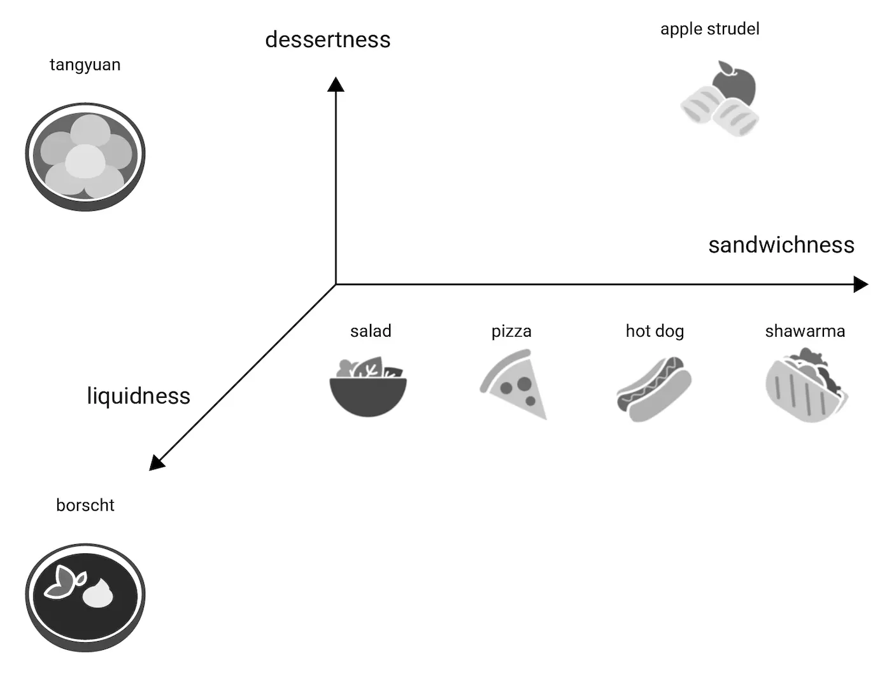
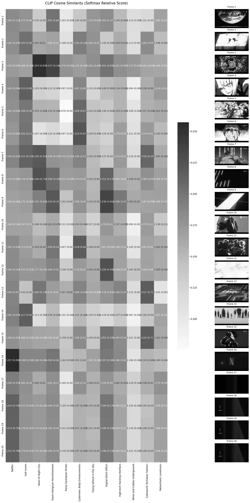
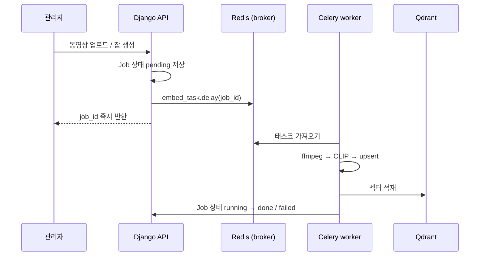
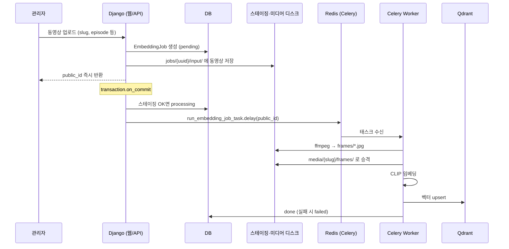

# 1. 개요

애니메이션이나 드라마를 보실 때 내가 몇 화까지 본지는 기억이 안 나지만 특정 장면만 떠오를 때가 있습니다. 이 문제를 해결하기 위해 사용자가 원하는 장면이 나온 회차를 쉽게 찾을 수 있는 검색 시스템을 만들어 보려 합니다. 

그래서 이번 글의 목적은 실제 서비스에서도 써 볼 수 있는 애니메이션 장면 검색 RAG 시스템을 구축하는 것입니다. 다음 챕터들로 만들어봅시다.

- [2. 멀티모달 임베딩](#2-멀티모달-임베딩)에서는 모델 사용법을 익히고, 모델에 데이터를 넣어 결과를 받은 뒤 대략 시각화해 봅니다.
- [3. 대용량 전처리 파이프라인](#3-대용량-전처리-파이프라인)에서는 동영상 전처리 작업을 할 때 가장 빠른 옵션 값을 찾아봅시다.
- [4. 벡터 검색 엔진 구축 (Qdrant)](#4-벡터-검색-엔진-구축)에서는 모델에서 읽은 값을 벡터 DB에 적재합니다.
- [5. 비동기 시스템 구조 (Celery, Job Worker & Redis Queue)](#5-비동기-시스템-구조-celery-job-worker--redis-queue)에서는 3·4장 파이프라인을 HTTP 밖으로 분리하고, Celery 워커·Redis 큐 기반 잡 구조를 잡습니다.
- [6. API 설계 (Django & DRF)](#6-api-설계-django--drf)에서 검색·ingest 요청 API와 Django 앱 구조를 만듭니다.
- [7. RAG 및 LLM 기반 사용자 경험 (UX/UI 연동)](#7-rag-및-llm-기반-사용자-경험-uxui-연동)은 실제 사람이 사용 가능한 수준으로 올려봅시다.
- [8. 모니터링 및 부하 테스트 (Sentry & Datadog)](#8-모니터링-및-부하-테스트-sentry--datadog)에서 부하 테스트를 진행하며 개선점을 찾습니다. (캐싱 등 읽기 경로 최적화는 부하 결과를 보고 반영합니다.)

# 2. 멀티모달 임베딩
**멀티모달 임베딩 공간(Multimodal Embedding Space)** 은 텍스트, 이미지, 동영상 프레임 등 서로 다른 형태의 데이터(모달리티)를 하나의 통일된 다차원 벡터 공간에 매핑하는 기술입니다. 

멀티모달은 다양한 리소스를 의미하고 임베딩은 그 데이터를 의미가 보존된 저차원 벡터로 변환하는 과정을 말합니다, 벡터로 바꾸는 이유는 수학적으로 계산할 때 사용하기 위함이고요.

각종 미디어를 동일한 형태의 값으로 변환하기 때문에 교차 모달리티 검색이 가능하며, 다음과 같은 동작을 수행할 수 있습니다.
- 텍스트로 이미지 검색
- 이미지로 유사 영상 찾기
- 영상 프레임으로 상황 인식

멀티모달 임베딩을 하기 위해서는 `Contrastive Learning`으로 비슷한 리소스끼리는 가깝게, 먼 것들은 멀게 배치하도록 모델을 최적화합니다. 이를 통해 모델은 데이터의 의미를 수치화된 거리로 파악하게 되며, 이렇게 거리 값을 비교하는 공간이 바로 `Shared Embedding Space`입니다.

이 공간에서는 서로 다른 모달리티의 데이터가 같은 좌표계에 위치하게 되어 수치로 비교할 수 있게 되죠.
하나의 공간에 데이터를 투영함으로써 다양한 동작을 수행할 수 있게 됩니다.

## Contrastive Learning
대조 학습은 데이터 간의 유사도와 차이를 비교하며 특징을 학습하는 방식으로, 모델이 라벨 없이도 데이터의 의미를 스스로 파악할 수 있게 해주는 `자기 지도 학습(Self-Supervised Learning)`에서 주로 활용됩니다.
이런 방식이 아니라면 사람이 일일이 라벨링하며 데이터를 나눠야 했습니다.
예시로 대표적인 데이터셋인 `ImageNet`은 약 22,000개의 객체를 구분하기 위해 1,400만 장의 이미지와 25,000명 이상의 작업자가 필요했습니다.

핵심 아이디어는 매우 단순합니다.
- **Positive Pair (긍정 쌍)**: 같은 대상이거나 의미상 유사한 데이터 쌍입니다. 모델은 이들의 거리를 가깝게 만듭니다.
- **Negative Pair (부정 쌍)**: 서로 다른 대상이거나 관련 없는 데이터 쌍입니다. 모델은 이들의 거리를 멀게 만듭니다.

예를 들어 강아지 사진을 약간 회전시키거나 색감을 바꾼 사진은 원본에 가깝게 배치하고, 고양이 사진처럼 다른 대상의 사진은 멀리 떨어뜨려 놓는 훈련 방식이죠. 이 과정을 통해 모델은 "강아지"라는 객체의 특징을 스스로 깨닫게 됩니다.

이 점을 활용해서, 강아지 사진 한 장이 있다고 가정하면 이 사진을 자르거나, 회전시키거나, 색감을 바꾸는 식으로 여러 개의 변형된 사진을 만들어도 여전히 같은 강아지라는 `Positive Pair`로 인식하여 거리를 가깝게 합니다. 이로써 모델이 표면적인 변화에 흔들리지 않고 본질을 구별할 수 있게 됩니다.

## Static Embedding Space, Shared Embedding Space
임베딩을 통해 데이터를 벡터로 표현하면, 공간 안에서의 상대적 위치를 통해 각 데이터의 의미를 파악할 수 있습니다.
거리와 각도를 통해 코사인 값으로 도출해서 벡터 값 사이의 유사도를 측정합니다.

다만 벡터의 숫자 값만으로는 의미를 직관적으로 이해하기 어렵기 때문에, 보통 좌표 공간상의 위치로 시각화하여 표현하죠.
기존 `Word2Vec, GloVe, FastText` 모델 등에서 사용된 방식은 공간에서 하나의 단어가 하나의 벡터에 1:1로 고정되는 `Static Embedding`이었습니다. 그래서 "배"라는 단어를 벡터화한 값이 먹는 배인지, 타는 배인지, 사람의 배인지를 구분할 수 없었죠.

위 이미지를 보면 3개의 축(dessertness, sandwichness, liquidness)으로 단어 사이의 관계를 표현했죠.
이를 통해 각 단어가 어떤 의미에 가까운지를 3차원 공간상에서 표현할 수 있게 됩니다. 샐러드, 피자, 핫도그, 샌드위치, 보르시(borscht) 등이 어느 쪽에 더 가까운지를 위치로 알 수 있죠.

하지만 이런 방식은 단일 종류의 모달리티(텍스트)에서만 동작할 수 있었습니다. <br/>\
`Shared Embedding Space`이 이러한 한계를 개선한 방법입니다. <br/>
주로 멀티모달(Multimodal) 모델(ex: `OpenAI의 CLIP`)에서 중요한 개념으로, 서로 다른 형태의 데이터(이미지, 텍스트 등)가 하나의 공통된 공간에 함께 배치되어 이미지로서의 사과와 텍스트로서의 "사과"가 서로 가까운 위치의 벡터로 표현되도록 합니다. 그래서 데이터의 형태가 달라도 의미를 기준으로 검색할 수 있게 되죠.

## CLIP 구조
파인튜닝 없이 바로 사용할 수 있고, 학습 시 보지 못한 키워드에 대해서도 추론이 가능한 모델입니다. 또한 이미지 인코더와 텍스트 인코더의 출력이 같은 `Shared Embedding Space` 위에 놓이기 때문에, 두 출력을 연결하기 위한 별도의 변환 레이어 없이도 곧바로 유사도를 비교할 수 있습니다.

`CLIP`은 자연어 지도 학습(Natural Language Supervision)을 통해 시각적 개념을 효율적으로 학습하는 신경망입니다.
인식하고자 하는 시각적 범주의 이름만 제공하면, `GPT-2`나 `GPT-3`의 "zero-shot" 기능처럼 다양한 시각 분류 벤치마크에 그대로 적용할 수 있습니다.
- 신경망(Neural Network): 인간의 뇌가 정보를 처리하는 방식에서 영감을 받은 인공지능(AI) 및 머신러닝 모델
- 제로샷(Zero-shot): AI 모델이 학습 과정에서 배우지 않았거나, 한 번도 본 적 없는 새로운 데이터/작업을 별도의 추가 학습(파인튜닝) 없이 바로 처리하는 능력

추후 `Anime Search` 프로젝트를 구성할 때 새로운 에피소드가 나올 때마다 모델을 재학습하는 건 비용적으로 손해이기 때문에 별도 학습 없이 곧바로 임베딩을 추출할 수 있는 `CLIP`이 적합합니다. 따라서 이를 베이스로 프로젝트를 구성하려 합니다.

## Practice
### 허깅페이스로 로컬에서 돌려보기
여기서는 Hugging Face 모델 허브에서 `CLIP` 모델을 불러옵니다.
이 모델의 기능을 “이미지·텍스트 입력을 받아 고정 차원의 Float 배열(`Vector`)로 바꿔 반환하는 블랙박스 함수”로 정의하고, 함수에 걸리는 시간과 모델별 결과를 비교하며, 텍스트와 이미지의 유사도 측정까지 확인해 봅시다.

다음 코드로 로컬에서 이미지를 모델에 넣어 가장 가까운 텍스트들을 추론할 수 있습니다.
```python
import time

import torch
from PIL import Image
from sentence_transformers import SentenceTransformer, util


def calculate_similarity(img_emb, text_embs):
    """ cosine similarity between two vectors """
    cosine_scores = util.cos_sim(img_emb, text_embs)
    return cosine_scores

class CLIPInferenceService:
    # https://huggingface.co/models 에서 모델 찾기
    def __init__(self, model_name='clip-ViT-L-14'):
        print(f"Loading model '{model_name}' into memory...")
        start_time = time.time()

        # NVIDIA GPU 가속이 가능하면 cuda, 아니면 cpu 사용
        self.device = 'cuda' if torch.cuda.is_available() else 'cpu'
        self.model = SentenceTransformer(model_name, device=self.device)

        print(f"Model loaded in {time.time() - start_time:.2f} seconds on {self.device}")

    def encode_image(self, image_path):
        """ image to vector """
        img = Image.open(image_path)
        start_time = time.time()
        embeddings = self.model.encode(img)
        print(f"Image encoding latency: {(time.time() - start_time)*1000:.2f} ms")
        return embeddings

    def encode_text(self, text_list):
        # text(or list) to vector
        start_time = time.time()
        embeddings = self.model.encode(text_list)
        print(f"Text encoding latency: {(time.time() - start_time)*1000:.2f} ms")
        return embeddings


if __name__ == "__main__":
    clip_service = CLIPInferenceService()
    sample_image_path = "./anime.jpg"

    queries = [
        "비가 내리는 우울한 장면",
        "주인공이 검을 휘두르는 화려한 액션",
        "등장인물들이 웃으며 식사하는 일상",
        "울며 점프하는 엘프를 보는 주인공 일행",
        "침대 위에서 울고 있는 장면",
        "어느 여관 안에 있는 모습"
    ]

    print("\n--- Extracting Embeddings ---")
    img_vec = clip_service.encode_image(sample_image_path)
    text_vec = clip_service.encode_text(queries)

    print(f"\nImage Vector Shape: {img_vec.shape}")
    # Float32, 차원은 모델마다 다름 (예: ViT-L-14는 768, ViT-B-32는 512)

    print("\n--- Cosine Similarity Results ---")
    scores = calculate_similarity(img_vec, text_vec)

    # sort
    results = list(zip(queries, scores[0]))
    results.sort(key=lambda x: x[1].item(), reverse=True)
    for i, (query, score) in enumerate(results):
        print(f"{i + 1}. Score: {score.item():.4f} -> Query: '{query}'")
```
아래 이미지로 임베딩해 돌려봤습니다.

결과는 다음과 같죠… 생각 이상으로 잘 못 찾는 모습을 보여줍니다. 이미지 해상도와 모델이 이미지를 나누는 패치(픽셀) 단위의 영향 때문일 가능성이 큽니다.
```bash
Loading model 'clip-ViT-L-14' into memory...
Model loaded in 7.83 seconds on cpu

--- Extracting Embeddings ---
Image encoding latency: 586.39 ms
Text encoding latency: 155.15 ms

Image Vector Shape: (768,)

--- Cosine Similarity Results ---
1. Score: 0.1655 -> Query: '어느 여관 안에 있는 모습'
2. Score: 0.1540 -> Query: '침대 위에서 울고 있는 장면'
3. Score: 0.1535 -> Query: '울며 점프하는 엘프를 보는 주인공 일행'
4. Score: 0.1477 -> Query: '주인공이 검을 휘두르는 화려한 액션'
5. Score: 0.1404 -> Query: '비가 내리는 우울한 장면'
6. Score: 0.1347 -> Query: '등장인물들이 웃으며 식사하는 일상'
```
이 표를 참고해 보면 대부분 ‘불일치’ 구간에 가깝게 나오지만, 그래도 가장 부합하는 키워드들이 차례로 1·2·3위를 차지하는 점은 나쁘지 않은 접근이라 느껴졌습니다.

아래는 참고용 표로 이 점수와 의미가 절대적이지 않습니다.
| CLIP 점수 (예시) | 유사도 수준 | 의미 |
| --- | --- | --- |
| 0.3 이상 (높음) | 매우 높은 일치 | 이미지 내 주요 객체와 속성을 텍스트가 정확히 묘사 |
| 0.2 ~ 0.3 (보통) | 일치 | 이미지의 전반적인 상황을 텍스트가 설명함 |
| 0.2 미만 (낮음) | 연관성 낮음 | 내용이 불일치하거나 관련 없는 내용 |

정확도가 더 낮은 모델인 `clip-ViT-B-32`로 바꿔 돌리면 다음과 같은 결과가 나옵니다. <br/>
점수는 전반적으로 올라갔지만, 1위 후보가 달라지는 등 전체 순위가 기대와 맞지 않는 부분이 보입니다.
```bash
Loading model 'clip-ViT-B-32' into memory...
Model loaded in 7.77 seconds on cpu

--- Extracting Embeddings ---
Image encoding latency: 96.44 ms
Text encoding latency: 76.44 ms

Image Vector Shape: (512,)

--- Cosine Similarity Results ---
1. Score: 0.2219 -> Query: '주인공이 검을 휘두르는 화려한 액션'
2. Score: 0.2109 -> Query: '침대 위에서 울고 있는 장면'
3. Score: 0.2097 -> Query: '어느 여관 안에 있는 모습'
4. Score: 0.1976 -> Query: '비가 내리는 우울한 장면'
5. Score: 0.1974 -> Query: '울며 점프하는 엘프를 보는 주인공 일행'
6. Score: 0.1949 -> Query: '등장인물들이 웃으며 식사하는 일상'

Process finished with exit code 0
```
이름에 붙은 32, 14는 ViT가 이미지를 나눌 때 쓰는 패치 한 변의 픽셀 수를 뜻합니다. `clip-ViT-B-32`는 32×32 픽셀 패치, `clip-ViT-L-14`는 14×14 픽셀 패치라서 같은 해상도에서도 후자가 격자를 더 촘촘히 봅니다.
이미지 크기가 224px(이미지 크기는 모델에서 리사이징함)이고 14px 패치라면 16 x 16 그리드 형태로 분석되는거죠.

점수가 만족스럽지 않았는데요, 이유는 모델이 한국어보다 영어 텍스트 중심으로 학습되었기 때문입니다.
`clip-ViT-L-14` 모델을 유지한 채 영어로 `queries`를 바꿔 진행해 보면 점수도 오르고 정확도도 유지되는 걸 확인할 수 있었습니다.

다음처럼 `queries`를 바꿔봅시다. 애매하고 서로 비슷한 쿼리들을 넣어봤습니다.
```python
queries = [
    "A gloomy scene with falling rain", # 비가 내리는 우울한 장면
    "Flashy action of the protagonist swinging a sword", # 주인공이 검을 휘두르는 화려한 액션
    "Characters having a meal and laughing together", # 등장인물들이 웃으며 식사하는 일상
    "The protagonist's party watching an elf jumping while crying", # 울며 점프하는 엘프를 보는 주인공 일행
    "A scene of someone crying on the bed", # 침대 위에서 울고 있는 장면
    "A scene inside an inn", # 어느 여관 안에 있는 모습
    "There are four people inside the inn", # 여관 안에 사람이 4명이 있다
    "There are three people inside the inn", # 여관 안에 사람이 3명이 있다
    "There are two people inside the inn", # 여관 안에 사람이 2명이 있다
    "There is a wardrobe and a bed in the room", # 방 안에 장롱과 침대가 있다
    "There is a bed and a wardrobe in the room" # 방 안에 침대와 장롱이 있다
]
```
결과는 다음과 같이 나옵니다. 울고 있는 모습을 정확히 캐치한 점이 흥미롭고, `There is a wardrobe and a bed in the room`와 `There is a bed and a wardrobe in the room`의 점수 차이를 보면 이미지를 파악하는 순서나 단어의 위치에 따라 벡터값이 달라지는 걸 볼 수 있습니다.

```md
Loading model 'clip-ViT-L-14' into memory...
Model loaded in 7.57 seconds on cpu

--- Extracting Embeddings ---
Image encoding latency: 552.03 ms
Text encoding latency: 441.05 ms

Image Vector Shape: (768,)

--- Cosine Similarity Results ---
1. Score: 0.2711 -> Query: 'A scene of someone crying on the bed'
2. Score: 0.2227 -> Query: 'A scene inside an inn'
3. Score: 0.2223 -> Query: 'There is a bed and a wardrobe in the room'
4. Score: 0.2205 -> Query: 'There are four people inside the inn'
5. Score: 0.2205 -> Query: 'There are three people inside the inn'
6. Score: 0.2161 -> Query: 'The protagonist's party watching an elf jumping while crying'
7. Score: 0.2159 -> Query: 'There are two people inside the inn'
8. Score: 0.2094 -> Query: 'There is a wardrobe and a bed in the room'
9. Score: 0.2020 -> Query: 'Characters having a meal and laughing together'
10. Score: 0.1944 -> Query: 'Flashy action of the protagonist swinging a sword'
11. Score: 0.1459 -> Query: 'A gloomy scene with falling rain'
```

### Colab 환경에서 OpenAI CLIP 써보기
이전에는 허깅페이스를 사용해 쉽게 모델에 접근했고 로컬에서 작업을 했습니다.
이번에는 `Colab` 환경에서 `OpenAI CLIP`을 사용해서 `sentence_transformers` 없이 `CLIP`으로 직접 특징 벡터를 추출하고, 이미지와 텍스트가 어떻게 비교되는지 시각화해봅니다.
`Colab`은 GPU 런타임을 선택하면 `CUDA` 환경에서 모델 추론과 행렬 연산을 더 효율적으로 테스트할 수 있고 편이해서 이번에는 이 환경에서 진행해보려고 합니다.
- **Colab**: Google Colab(Colaboratory)로 브라우저 기반의 무료 파이썬(Python) 개발 샌드박스 환경
- **CUDA(Compute Unified Device Architecture)**: 엔비디아(NVIDIA)가 개발한 병렬 컴퓨팅 플랫폼 및 프로그래밍 모델

`CLIP`이 이미지와 텍스트의 유사도를 계산하는 부분은 앞에서 Hugging Face를 통해 간략하게 1:N으로 진행했었는데, 이번에는 이미지와 텍스트를 N:M으로 비교해봅시다.

곧 나올 코드의 흐름은 다음과 같습니다.
```text
이미지 파일 로드 → CLIP 전처리 → 배치 Tensor 생성 → GPU 이동 → 이미지 벡터 추출
텍스트 쿼리 → CLIP 토큰화 → GPU 이동 → 텍스트 벡터 추출
이미지 벡터 N개 × 텍스트 벡터 M개 → N:M 유사도 행렬 → 히트맵 시각화
```

이번 예시로 아래 3가지를 파악합니다.
- **벡터 추출**: 이미지와 텍스트가 각각 어떤 특징 벡터로 바뀌는지 확인
- **N:M 유사도 비교**: 1:1 반복 비교가 아니라 행렬곱 한 번으로 모든 이미지-텍스트 조합을 비교
- **시각화(Heatmap)**: 코사인 유사도와 softmax 상대 점수를 함께 보며 쿼리별 반응을 해석

이를 위해서 아래 사이트들을 참고할 수 있죠.
- [OpenAI CLIP 공식 Colab](https://colab.research.google.com/github/openai/clip/blob/master/notebooks/Interacting_with_CLIP.ipynb?authuser=1)

다음 코드를 `Colab`에 넣어봅시다.
1. 필요한 라이브러리와 영상을 다운로드해봅시다.
```python
!pip install yt-dlp
!pip install git+https://github.com/openai/CLIP.git
# yt-dlp로 프레임 추출에 사용할 영상 다운로드
!yt-dlp -f "bestvideo[ext=mp4]/best[ext=mp4]/best" "https://www.youtube.com/watch?v=qDFeurdWDNE" -o sample_anime.mp4
```
2. 동영상에서 프레임 추출
```python
# ffmpeg로 1차 리사이징 및 프레임 추출 (I/O 병목 방지)
# ViT-L/14 모델의 기본 입력은 224px이므로 scale=-1:224로 맞춤
!mkdir -p frames
!ffmpeg -i sample_anime.mp4 -vf "fps=2.5,scale=-1:224" -q:v 2 frames/frame_%04d.jpg
```
3. 프레임 이미지와 텍스트를 벡터로 바꾼 뒤 N:M 유사도 비교 진행

아래 코드는 크게 네 단계로 나뉩니다.
- 전체 프레임 중 일부를 균등하게 샘플링
- 이미지와 텍스트를 각각 `CLIP` 입력 형태로 변환
- `CLIP`으로 이미지/텍스트 특징 벡터 추출
- 벡터 간 유사도를 행렬곱으로 계산하고 히트맵으로 시각화

```python
import os
import time
import torch # 딥러닝 프레임워크
import clip # 신경망
from PIL import Image # 이미지 가공
import matplotlib.pyplot as plt # 시각화
import seaborn as sns # 데이터 통계 시각화
import matplotlib.gridspec as gridspec # grid 세팅

# CLIP 모델과 이미지 전처리 함수 로드
device = "cuda" if torch.cuda.is_available() else "cpu"
print("Loading ViT-L/14 model...")
# 이 모델은 224px 이미지를 14px 패치로 나누므로 16 x 16 = 256개 패치를 사용함
# 이미지 크기를 224에서 336으로 늘리면 패치 수가 증가해 GPU 비용도 함께 증가함
# 224px이어도 CLIP은 색감, 구도, 객체, 분위기 같은 정보를 의미적 특징 벡터로 인코딩함
model, preprocess = clip.load("ViT-L/14", device=device)
model.eval() # 모델을 추론 모드로 설정

# CUDA 연산은 비동기로 실행되므로 시간 측정 전후에 사용할 동기화 함수
def sync_if_cuda():
  if device == "cuda":
    torch.cuda.synchronize()

# 전체 프레임 중 시각화할 이미지 샘플링
image_count = 20
all_frame_files = sorted([os.path.join("frames", f) for f in os.listdir("frames") if f.endswith(".jpg")])

if len(all_frame_files) > image_count and image_count > 1:
  sampled_indices = [
      round(i * (len(all_frame_files) - 1) / (image_count - 1))
      for i in range(image_count)
  ]
  frame_files = [all_frame_files[i] for i in sampled_indices]
else:
  frame_files = all_frame_files[:image_count]
print(f"Extracting features for {len(frame_files)} frames...")

# 샘플링한 이미지들을 전처리한 뒤 하나의 배치 Tensor로 묶어 GPU로 이동
image_tensors = torch.stack([preprocess(Image.open(f)) for f in frame_files]).to(device)
# 텍스트 토큰화, sentence-transformers를 쓰지 않으므로 CLIP 토크나이저를 직접 사용
queries = [
    "Netflix",
    "Sad scene",
    "Neon-lit Night City",
    "Giant Hologram Advertisement",
    "Rainy Dystopian Street",
    "Cybernetic Body Enhancements",
    "Flying Vehicle in the Sky",
    "Digital Glitch Effect",
    "High-tech Hacking Interface",
    "Wires and Cables Underground",
    "Cyberpunk Techwear Fashion",
    "Melancholic Loneliness"
]
text_tokens = clip.tokenize(queries).to(device)

# 특징 추출 (Feature Extraction & Normalization)
with torch.no_grad(): # 그래디언트 추적을 꺼서 추론 속도와 VRAM 사용량을 개선
  # 이미지 배치와 텍스트 배치를 각각 한 번에 인코딩
  sync_if_cuda()
  encode_start = time.perf_counter()
  image_features = model.encode_image(image_tensors)
  text_features = model.encode_text(text_tokens)
  sync_if_cuda()
  encode_time = time.perf_counter() - encode_start

  # L2 정규화: 벡터의 길이를 1로 맞춰 방향성(Cosine Similarity)만 비교할 수 있게 함, 비교하기 위해 정규화를 적용했다고 이해하면 될 것 같습니다.
  image_features /= image_features.norm(dim=-1, keepdim=True)
  text_features /= text_features.norm(dim=-1, keepdim=True)

  # 1:1 방식: 각 이미지-텍스트 쌍을 하나씩 비교
  sync_if_cuda()
  loop_start = time.perf_counter()
  loop_scores = []
  for image_feature in image_features:
    row = []
    for text_feature in text_features:
      row.append(image_feature @ text_feature)
    loop_scores.append(torch.stack(row))
  loop_scores = torch.stack(loop_scores)
  sync_if_cuda()
  loop_time = time.perf_counter() - loop_start

  # N:M 방식: 행렬곱 한 번으로 전체 유사도 행렬 계산
  # image_features (프레임 수, 768) @ text_features.T (768, 쿼리 수) = cos_sim (프레임 수, 쿼리 수)
  sync_if_cuda()
  matrix_start = time.perf_counter()
  cos_sim_tensor = image_features @ text_features.t()
  sync_if_cuda()
  matrix_time = time.perf_counter() - matrix_start

  # 유사도 점수를 CLIP의 logits와 softmax 상대 점수로 변환
  logit_scale = model.logit_scale.exp()
  # logits은 코사인 유사도에 CLIP이 학습한 스케일 값을 곱한 점수
  logits = logit_scale * cos_sim_tensor

  # softmax는 전체 정답 확률이 아니라 현재 쿼리 목록 안에서의 상대 점수
  probs = logits.softmax(dim=-1).cpu().numpy()
  # 순수 코사인 유사도
  # cpu().numpy(): GPU 텐서를 CPU 메모리로 옮긴 뒤 NumPy 배열로 변환
  cos_sim = cos_sim_tensor.cpu().numpy()

# 이미지/텍스트를 CLIP 벡터로 바꾸는 모델 추론 시간이 어느 정도인지 확인
print(f"CLIP feature encoding time: {encode_time:.6f}s")
# 이미지-텍스트 쌍을 하나씩 비교하면 얼마나 걸리는지 확인
print(f"1:1 loop similarity time: {loop_time:.6f}s")
# 같은 비교를 N:M 행렬곱 한 번으로 처리하면 얼마나 걸리는지 확인
print(f"N:M matrix similarity time: {matrix_time:.6f}s")
# 전체 비교 기준으로 행렬곱 방식이 1:1 반복 방식보다 몇 배 빠른지 확인
print(f"Matrix speedup: {loop_time / max(matrix_time, 1e-12):.2f}x")

# 두 방식이 같은 코사인 유사도 행렬을 만드는지 최대 오차로 체크
max_diff = (loop_scores - cos_sim_tensor).abs().max().item()
print(f"Max difference between two methods: {max_diff:.8f}")

# 시각화 설정
num_frames = len(frame_files)
fig = plt.figure(figsize=(16, num_frames * 1.5))
# grid 설정
gs = gridspec.GridSpec(1, 2, width_ratios=[3, 1])

# 코사인 유사도와 softmax 상대 점수를 함께 표시
heatmap_labels = [
    [f"{cos_sim[i, j]:.3f} ({probs[i, j]:.2f})" for j in range(len(queries))]
    for i in range(num_frames)
]
# 히트맵 색상은 cos_sim 기준, 셀 텍스트에는 cos_sim과 probs를 함께 표시
ax_cos = plt.subplot(gs[0])
sns.heatmap(cos_sim, annot=heatmap_labels, cmap='Blues', fmt="",
            xticklabels=queries,
            yticklabels=[f"Frame {i+1}" for i in range(num_frames)],
            ax=ax_cos, cbar_kws={"shrink": 0.5})
ax_cos.set_title(
    "CLIP Cosine Similarity (Softmax Relative Score)", 
    fontsize=15, 
    pad=20
)

# 오른쪽에 이미지 그리기 
gs_img = gridspec.GridSpecFromSubplotSpec(num_frames, 1, subplot_spec=gs[1])
for i, img_path in enumerate(frame_files):
  ax_img = plt.subplot(gs_img[i])
  img = Image.open(img_path)
  ax_img.imshow(img)
  ax_img.axis('off') # 축 숨기기
  ax_img.set_title(f"Frame {i+1}", fontsize=9)

plt.tight_layout()
plt.show()
```

여기서 시간 비교는 `CLIP` 모델 자체의 성능 벤치마크가 아니라, 이미 추출된 특징 벡터들을 비교하는 방식의 차이를 보기 위한 것입니다. 작은 예제에서는 차이가 크게 보이지 않을 수 있지만, 이미지 수와 쿼리 수가 늘어날수록 1:1 반복 비교보다 N:M 행렬곱의 효율성이 더 커집니다.

정리하면, 이 코드에서 봐야 하는 핵심은 다음과 같습니다.
- `image_features`: 이미지들을 의미 벡터로 바꾼 결과
- `text_features`: 텍스트 쿼리들을 같은 공간의 의미 벡터로 바꾼 결과
- `cos_sim`: 이미지 벡터와 텍스트 벡터의 방향이 얼마나 비슷한지 보는 값
- `logits`: 코사인 유사도에 `CLIP`이 학습한 스케일 값(`logit_scale`)을 곱한 점수
- `logit_scale`: softmax에 들어가기 전 점수 차이를 더 명확히 만드는 값
- `softmax`: 한 프레임 안에서 현재 쿼리 후보들끼리 상대 비교한 값
- `N:M 비교`: N개의 이미지와 M개의 텍스트를 행렬곱 한 번으로 비교하는 구조

위 코드를 실행한 결과는 다음과 같습니다.
```
Loading ViT-L/14 model...
Extracting features for 20 frames...
CLIP feature encoding time: 70.832849s
1:1 loop similarity time: 0.002893s
N:M matrix similarity time: 0.000110s
Matrix speedup: 26.31x
Max difference between two methods: 0.00000007
```

`CLIP`에서 특징을 추출하는 데 `70.832849s`로 가장 시간이 많이 걸렸습니다.
항상 이렇게 오래 걸리는 게 아닌 첫 실행일 경우 모델에서 인코딩 비용 이외에도 CUDA 초기화나 GPU 워밍업, 첫 커널 실행 같은 콜드 스타트들이 섞인 경우가 많으니 참고 부탁드립니다.
즉 첫 실행에는 오버헤드가 발생하는 거죠.

나중에 워밍업을 한 뒤 실행했을 때의 인코딩 속도를 표로 보여줄 예정이니 정확한 시간 분리는 넘어가도록 합니다.

```python
    image_features = model.encode_image(image_tensors)
    text_features = model.encode_text(text_tokens)
```
인코딩 후 나온 특징 벡터로 유사도를 계산할 때는 아직 데이터 양이 작아 `0.002893s`와 `0.000110s`로 절대적인 시간 차이가 작게 발생하지만, 데이터가 늘수록 시간 차이는 더 커집니다.

1:1 반복 방식과 N:M 행렬곱 방식의 정합성을 확인하기 위해 결과 차이를 비교했을 때 `Max difference`가 `0.00000007`로 매우 작은 걸 확인할 수 있는데, 이는 사실상 같은 코사인 유사도 행렬을 만든다고 볼 수 있습니다.
이 정도 차이가 발생하는 이유는 GPU/부동소수점 연산 순서 차이에서 생길 수 있는 미세한 오차입니다.
그리고 N:M으로 행렬곱을 했을 때 1:1 방식보다 `26.31`배 빠르게 동작하는 것도 볼 수 있었습니다.

마지막으로 이를 실행한 시각화 결과는 아래와 같습니다. 유튜브 영상을 다운받고 프레임별로 가장 부합하는 키워드들을 찾아주는 걸 확인할 수 있습니다.


# 3. 대용량 전처리 파이프라인

`RAG` 시스템으로 만들기 위해서는 우선 동영상에서 뽑은 수많은 프레임을 벡터화해서 저장하는 전처리 작업이 필요합니다.
하지만 유튜브 영상의 전체 프레임을 뽑을 때 모든 프레임이 유의미한 차이를 지니진 않습니다.
또한 애니메이션은 보통 24fps지만 실제 애니메이션 제작 과정에서 비용 절감을 위해 아래 방법을 사용합니다.
- **1-frame (Full, 24fps)**: 매 프레임 그림이 바뀜 (움직임이 매우 부드러움)
- **2-frame (On twos, 12fps)**: 1장의 그림을 2프레임 동안 유지
- **3-frame (On threes, 8fps)**: 1장의 그림을 3프레임 동안 유지.

그래서 1초당 8장의 이미지를 추출할 경우 이미지 양은 매우 늘어나지만 정작 1초 안에 프레임 간의 큰 차이가 발생하지 않을 가능성이 크기에 합리적으로 접근하기 위해 1초에 1장을 추출하는 걸로 전제로 두고 해봅시다.

2초에 한 번, 3초에 한 번 같은 방식으로 더 늘릴 수 있지만 현재는 정확한 결과를 도출하는데 목적을 두고 진행합니다.

프레임을 뽑을 동영상은 1분짜리 티저가 아닌 20분짜리 애니메이션 한 편을 통째로 써서 약 1,420 프레임을 분석하는 작업을 최대한 빠르게 끝내는 걸 목적으로 둡시다.

이번 챕터의 목적은 제 `맥북 M1 Air`에서 가장 빠른 `batch_size`, `num_workers` 조합을 파악해보는 걸로 둡시다.
- **batch_size**: 한 번에 모델(`encode_image`)에 넘기는 이미지 장 수입니다.
- **num_workers**: DataLoader가 쓰는 데이터 로딩·전처리용 서브프로세스(워커) 수로, 메인 프로세스 부담을 덜어 주기 위해 메인 프로세스에 데이터를 공급하는 역할을 합니다.
- **DataLoader**: 많은 프레임(Dataset)을 배치로 빠르게 돌리고 로딩을 병렬화하기 위해 사용합니다.

이 세팅 값을 알기 위해 로컬에 가중치가 들어간 `ViT-L-14.pt`를 받아서 테스트해봅니다.
- 가중치: 인공지능이 데이터를 처리하고 예측을 내리는 데 필요한 핵심적인 학습 값

`ViT-L-14.pt`는 이미지·텍스트를 처리하는 거대한 네트워크의 모든 학습된 숫자가 들어 있는 체크포인트(checkpoint)로 보시면 됩니다. 이를 PyTorch에서는 보통 .pt / .pth로 많이 저장해서 사용합니다. 이 모델을 기준으로 제 로컬에서 배치 설정값을 실행했을 때 다음 결과를 보여줍니다.

| 항목 | 값 |
|------|-----|
| model_name | ViT-L/14 |
| device | mps |
| num_frames | 1420 |

`batch_size`와 `num_workers`는 다음처럼 사용됩니다.
```python
dataloader = DataLoader(
    dataset,                   # 배치마다 샘플을 꺼내는 Dataset
    batch_size=batch_size,     # 한 스텝에서 묶어서 모델에 넘길 이미지 개수
    shuffle=False,             # 순서 섞기 여부
    num_workers=num_workers,   # 디스크 로딩·전처리용 서브프로세스 수 (0이면 메인만)
    pin_memory=pin,            # pinned memory 사용 (CUDA→GPU 복사 최적화 등, MPS에선 효과 제한적일 수 있음)
)
```
- **MPS(Apple Silicon용 Metal Performance Shaders)**: PyTorch 등 딥러닝 프레임워크가 애플 실리콘 Mac의 내장 GPU를 활용하여 딥러닝 모델 학습 및 추론 속도를 높이는 백엔드 기술입니다.

`batch_size`가 32,64,128 인 이유는 가장 많이 사용하는 수이기에 사용했습니다.<br/>
많은 CUDA 커널·텐서 연산이 워프(32 스레드) 단위로 돌아가고, 메모리나 캐시 사용도 2의 거듭제곱 크기에서 효율이 나오는 경우가 있어서 저 수치를 고른 것이기에 24,48,96 등 다른 수를 사용해도 되죠.

| batch_size | num_workers | 초당 처리량 | 전체 소요시간 |
|:----------:|:-------------:|---------------:|--------------:|
| 64 | 0 | 3.9502 | 359.4768 |
| 32 | 0 | 3.8425 | 369.5502 |
| 64 | 4 | 3.7334 | 380.3494 |
| 128 | 4 | 3.6364 | 390.4925 |
| 32 | 4 | 3.5383 | 401.3276 |
| 128 | 0 | 3.5074 | 404.8612 |
| 128 | 8 | 3.463 | 410.0507 |
| 64 | 8 | 3.3836 | 419.6772 |
| 32 | 8 | 3.2579 | 435.8696 |
| 128 | 16 | 3.2458 | 437.4923 |
| 32 | 16 | 2.9983 | 473.6013 |
| 64 | 16 | 2.9033 | 489.1044 |
| 256 | 0 | 2.8655 | 495.5498 |
| 256 | 4 | 2.2234 | 638.6575 |
| 256 | 8 | 0.5311 | 2673.9189 |
| 256 | 16 | 0.4823 | 2944.1662 |

제 PC 환경에서는 `batch_size=64`, `num_workers=0`일 때, 워커용 서브프로세스를 아예 안 두는 쪽이 가장 빨랐네요.
서브프로세스가 필요 없는 이유는, 워커를 만들어 스케줄링해서 배치하는 효율보다 그걸 돌리면서 생기는 오버헤드가 더 컸기 때문입니다. 그래서 메인 단일 프로세스에 CPU 자원을 몰아주는 게 더 빨랐던 거죠. 

아마 CPU나 GPU 자원이 훨씬 넉넉한 환경에서는 워커가 체감 차이를 만들 수도 있었겠지만, 제 환경에서는 그런 제약 때문에 이런 결과가 나온 걸로 보입니다.


# 4. 벡터 검색 엔진 구축

RAG 시스템 구현을 위해 텍스트 쿼리와 프레임 이미지를 같은 CLIP 임베딩 공간에 올려 두고 사용자가 입력한 쿼리 벡터와 가까운 프레임 벡터를 찾는 의미(시맨틱) 검색을 만들어야 합니다. 이때 고차원 벡터를 빠르게 근사 최근접 이웃(ANN) 탐색해 주는 저장소가 필요하게 되는데 **Qdrant**가 그중 하나입니다.

## Qdrant
Qdrant는 벡터를 컬렉션에 적재하고, 거리(코사인, 유클리드 등) 기준으로 가까운 값을 찾아주는 벡터 DB입니다.
수백만 개의 고차원 벡터 사이에서 쿼리와 가까운 것을 빠르게 찾기 위해 ANN(근사 최근접 이웃) 방식을 씁니다.
- **ANN (근사 최근접 이웃)**: 쿼리 벡터와 아주 가까운 벡터를 찾되, 매번 모든 값이랑 비교하지 않고 그래프·트리 같은 구조를 타고 가며 가까운 후보를 빠르게 탐색
- **k-NN (정확 최근접)**: 가능한 모든 벡터와 거리를 비교해 진짜로 가장 가까운 이웃을 탐색
`k-NN` 방식은 데이터가 많으면 비용이 커서 벡터 DB에서는 ANN을 많이 택합니다.

`Qdrant`는 다음 명령어로 간단하게 도커에 DB 서버를 띄울 수 있습니다. (제 로컬 기준)
```bash
docker pull qdrant/qdrant
docker run -p 6333:6333 -p 6334:6334 \
    -v "$(pwd)/qdrant_storage:/qdrant/storage:z" \
    qdrant/qdrant
```

우선 `Collection(Table과 비슷한 개념)`의 형식을 정의합니다.
`Qdrant`에서 `Collection`은 포인트(벡터+메타데이터)를 저장하고 관리하는 최상위 논리 단위입니다. RDBMS(관계형 데이터베이스)의 테이블(Table)이나 데이터베이스(Database)와 유사한 개념으로, 특정 벡터 검색 쿼리가 실행되는 대상 공간을 의미합니다.
- **`Points`**: 컬렉션 안에 저장되는 한 건(row) 단위의 레코드
```bash
curl -X PUT http://localhost:6333/collections/test_collection \
  -H 'Content-Type: application/json' \
  -d '{
    "vectors": { "size": 4, "distance": "Cosine" }
  }'
```
아래처럼 데이터를 삽입한 후
```bash
curl -X PUT http://localhost:6333/collections/test_collection/points \
  -H 'Content-Type: application/json' \
  -d '{
    "points": [
      { "id": 1, "vector": [0.05, 0.61, 0.76, 0.74], "payload": {"city": "Seoul", "age": 26} },
      { "id": 2, "vector": [0.19, 0.81, 0.75, 0.11], "payload": {"city": "Tokyo", "age": 30} }
    ]
  }'
```
쿼리 벡터와 가까운 점을 찾으면서 **페이로드(메타데이터)** 에도 조건을 걸 수 있습니다.

```bash
curl -X POST http://localhost:6333/collections/test_collection/points/search \
  -H 'Content-Type: application/json' \
  -d '{
    "vector": [0.2, 0.1, 0.9, 0.7],
    "filter": {
        "must": [ { "key": "city", "match": { "value": "Seoul" } } ]
    },
    "limit": 3
  }'
```

`Qdrant`는 고차원 벡터 검색에서 많이 쓰는 `HNSW`(Hierarchical Navigable Small World) 같은 그래프 기반 인덱스를 사용할 수 있습니다. 

이는 벡터를 노드처럼 잇고 레이어를 나눠 둡니다.
찾는 벡터 값과 멀리 있는 후보는 건너뛰고 가까운 쪽만 따라가며 탐색할 수 있어서 매번 전부와 거리 비교하지 않아도 실용적인 속도가 나오는 편이라 벡터 DB에서 흔하게 선택하는 방식입니다.

## 프로젝트 Collection 구조 정하기
이제 `RAG` 시스템에서 쓰일 `Collection` 설계를 잡아봅시다.

`Collection`에는 다음 2개의 구조가 들어갑니다.
- **벡터 쪽 설정(차원·거리 측정)**: 컬렉션을 만들 때 API에 넣는 값으로 포인트 `payload` 메타데이터와는 다른 층
  - 위 예제에서 쓰인 **`size`**, **`distance`**
- **페이로드**: 포인트마다 붙는 메타데이터 키

**벡터 설정(컬렉션 생성 시)**<br/>
`PUT /collections/{name}` JSON 안의 `vectors` 블록에 해당합니다. 
아래 표에 있는 값은 작품 제목·화수·장르 같은 메타데이터 영역이 아니라 이 컬렉션의 벡터 칸이 몇 차원이고 어떤 거리로 비교할지를 고정하는 설정입니다.

| 설정 | 추천 | 설명 |
|------|------|------|
| `vectors.size` | CLIP 등 선택한 인코더의 출력 차원 | 예: 모델마다 512·768 등으로 고정. 틀리면 upsert 단계에서 바로 깨짐 |
| `vectors.distance` | `Cosine` | CLIP 계열 벡터는 보통 길이를 맞춰 두고 각도만 비교하는 경우가 많아 코사인을 자주 사용 |
| 멀티 벡터(`named vectors`) | 필요 시 멀티 벡터로 사용 | 벡터 값을 하나가 아닌 여러 개로 두고 싶을 때 사용 |

단일 벡터만 쓸 때는 포인트가 `"vector": [0.1, 0.2, ...]`처럼 배열 하나이고, `named vectors`일 때는 `"vector": { "키이름": [...] }` 형태가 됩니다.

**페이로드**<br/>
벡터로 검색한 후 검색 결과가 “어느 작품·몇 화·몇 초 장면인지”로 확인할 때 쓰거나, `Qdrant`의 `filter`로 조건으로 쓸 메타데이터입니다. 
`RDB`를 어떻게 설계하느냐에 따라 사용법은 많이 달라질 수 있지만, 일단은 아래 형태를 기초로 둡니다.

| 필드(키) | Qdrant 타입 | 용도 | 비고 |
|----------|-------------|------|------|
| `anime_id` | `keyword` | 작품 식별(슬러그) | `filter`로 특정 작품만 검색 |
| `episode` | `integer` | 에피소드(화) 번호 | 특정 화 안에서만 검색할 때 사용 |
| `genre` | `keyword` | 장르 슬러그 | `RDB`와 조인해도 되고, Qdrant `filter`에도 사용 |
| `frame_index` | `integer` | 그 화 안에서의 프레임 순번 | 추출·upsert 시 부여한 인덱스 |
| `frame_file` | `keyword` | 추출된 프레임 파일 경로 | 디버깅·재처리·원본 장면 추적 |
| `job_public_id` | `keyword` | ingest 잡 UUID | 한 번의 적재 작업 단위 구분, 포인트 `id` 생성에도 사용 |
| `timestamp_sec` | (float) | 재생 시각(초) | upsert 시 함께 넣음. 아래 [컬렉션 정보 조회](#컬렉션-정보-조회)의 `payload_schema`에는 인덱스를 건 키만 나타남 |

포인트(`Points`)의 `id`는 컬렉션 안에서 중복 없이 유일해야 합니다. `job_public_id`와 `frame_index`를 조합해 만든 UUID를 문자열 `id`로 씁니다.

## 벡터 정보 저장하기

이제 동영상에서 프레임을 뽑고 이를 사전 학습된 모델로 데이터를 벡터화했죠.
이 벡터화한 값을 가지고 유사도 검사를 했었습니다. 저는 이를 이용해서 애니메이션 장면을 파악해서 검색하는 기능을 만들고 싶습니다. 이를 구현하기 위해서 벡터 DB에 저장해서 나중에 RAG 시스템에서 이용할 수 있도록 구성합시다.

아래는 3번까지 진행한 파이프라인입니다.


이제 아래처럼 진행하지만, 전체 코드 양은 방대하므로 컨셉이 담긴 핵심 코드로 정리합니다.


테스트는 REST API를 통한 HTTP 요청으로 돌아갑니다. 실제 서비스에서는 비동기로 워커가 돌게끔 구상됩니다.

### 프레임 추출
`subprocess`와 `ffmpeg`를 사용해 프레임을 추출하겠습니다.<br/>
`OpenCV`로도 가능하지만, `ffmpeg`로 JPG까지 넘기는 방식이 단순하고 `BGR`/`RGB` 같은 색 공간도 신경 쓰지 않아도 되며, 추출 과정을 `ffmpeg` 명령으로 외부 프로세스 하나에 맡겨 관리하기 편하다는 여러 이유 때문에 이 방법을 선택했습니다.

다음 함수로 프레임을 추출했습니다.
```python
def extract_frames_ffmpeg(
    *,  # 키워드 전용
    video_path: Path,  # 입력 동영상 경로
    output_dir: Path,  # 추출 JPG 저장 디렉터리
    ffmpeg_bin: str | None = None,  # ffmpeg 실행 경로(None이면 자동 해석)
    fps: float | None = None,  # 초당 추출 장수(-vf fps, None이면 생략)
    max_frames: int | None = None,  # 최대 장수(None이면 제한 없음)
    jpeg_quality: int = 2,  # JPEG -q:v(작을수록 보통 고화질)
) -> int:  # 성공 시 frame_*.jpg 개수
    if not video_path.is_file():
        raise FileNotFoundError(f"동영상 파일이 없습니다: {video_path}")

    output_dir.mkdir(parents=True, exist_ok=True)
    for old in output_dir.glob("frame_*.jpg"):
        old.unlink()

    exe = resolve_ffmpeg_exe(ffmpeg_bin)
    # ffmpeg 옵션
    cmd: list[str] = [
        exe,
        "-hide_banner",
        "-loglevel",
        "error",
        "-y",
        "-i",
        str(video_path),
    ]
    if fps is not None and fps > 0:
        cmd.extend(["-vf", f"fps={fps}"])
    cmd.extend(["-q:v", str(jpeg_quality)])
    if max_frames is not None and max_frames > 0:
        cmd.extend(["-frames:v", str(max_frames)])
    cmd.append(str(output_dir / "frame_%06d.jpg"))

    # 추출 수행
    proc = subprocess.run(cmd, capture_output=True, text=True, check=False)
    if proc.returncode != 0:
        err = (proc.stderr or proc.stdout or "").strip()
        raise RuntimeError(f"ffmpeg 실패 (exit {proc.returncode}): {err or 'no stderr'}")

    return len(list(output_dir.glob("frame_*.jpg")))
```

### 벡터화
벡터화하는 작업은 이전의 코드와 비슷합니다.<br/>
```python
def extract_features(
        self,  # CLIP 서비스(self.model·preprocess·device)
        frames_dir: str,  # 프레임 JPG 디렉터리
        *,  # 키워드 전용
        batch_size: int,  # 배치 크기(한 스텝에 넣을 이미지 수)
        num_workers: int,  # DataLoader 워커 수(0이면 메인만)
        verbose: bool = True,  # 로그·요약 출력 여부
        log_batches_every: int = 10,  # N 배치마다 진행 로그(0이면 생략)
    ) -> Tuple[np.ndarray, float, float]:
        # jpg 목록 가져오기
        all_frame_files = list_frame_jpgs(frames_dir)
        if not all_frame_files:
            return self._empty_features(), 0.0, 0.0

        # dataset에서 인덱스마다 파일을 읽고 그때 self.preprocess를 적용하게 생성
        dataset = AnimeFrameDataset(all_frame_files, self.preprocess)
        pin = self.device == "cuda"
        # Dataloader로 배치, 병렬처리 지정
        dataloader = DataLoader(
            dataset,
            batch_size=batch_size,
            shuffle=False,
            num_workers=num_workers,
            pin_memory=pin,
        )

        all_features: List[np.ndarray] = []
        start_time = time.perf_counter()
        # 추론할 때 그래프/그래디언트 비활성화해서 속도 향상
        # 학습을 위해 켜지는 옵션을 비활성화해서 추론 비용을 가볍게 처리
        with torch.no_grad():
            # 프레임 파일을 배치 단위로 순회
            for batch_idx, images in enumerate(dataloader):
                images = images.to(self.device)
                # 모델로 벡터(임베딩) 추출
                features = self.model.encode_image(images)
                # L2 정규화
                features /= features.norm(dim=-1, keepdim=True)
                all_features.append(features.cpu().numpy())

                if verbose and log_batches_every > 0 and (batch_idx + 1) % log_batches_every == 0:
                    print(f"Processed batch {batch_idx + 1}/{len(dataloader)}...")

        _sync_device(self.device)
        # 배치 단위로 나뉜 임베딩을 “프레임 N개 × 차원 D”처럼 하나의 레이아웃으로 합침
        final_matrix = np.vstack(all_features)
        elapsed = time.perf_counter() - start_time
        frames_per_sec = len(all_frame_files) / elapsed if elapsed > 0 else 0.0

        if verbose:
            print(f"  >> Inference Time: {elapsed:.2f}s ({frames_per_sec:.2f} frames/sec)")
        return final_matrix, elapsed, frames_per_sec
```

### 저장
`Qdrant`에서 컬렉션을 생성한 뒤 다음 코드로 벡터 결과를 `Qdrant`에 저장할 수 있습니다.

벡터만 저장하면 되니 `postgresql`처럼 벡터 확장(`pgvector` 등)이 있는 걸 택하는 선택지도 있지만, 이 글에서는 전용 벡터 DB를 쓰기로 했습니다. 대략적인 차이는 아래 표로 정리할 수 있습니다.

| 비교 항목 | 일반 DB + 벡터 확장 (예: pgvector) | 전용 벡터 DB (Qdrant) |
|-----------|--------------------------------------|------------------------|
| 적합한 상황 | 기존 DB를 쓰면서 가볍게 벡터 검색 추가 | 대규모 데이터, 초고속 검색, 복잡한 필터링 |
| 성능 | 보통 (데이터가 많아지면 느려질 수 있음) | 최상 (Rust 엔진 등으로 최적화되는 편) |
| 기능 | 기본적인 벡터 연산 위주 | 양자화, 하이브리드 검색, 멀티테넌시 등 |
| 복잡도 | 낮음 (기존 SQL 활용) | 중간 (별도 인프라 운영) |

```python
def upsert_job_frame_vectors(
    *,  # 키워드 전용
    job_public_id: uuid.UUID,  # 잡 단위 UUID — 포인트 id 생성에 사용
    anime_slug: str,  # 작품 슬러그
    episode: int | None,  # 화 번호(없으면 None)
    genre_slugs: list[str],  # 장르 슬러그 목록
    frame_indices: list[int],  # 프레임 인덱스(N개)
    vectors: Any,  # 임베딩 (N, D)
    timestamps: list[float],  # 재생 시각 초(N개)
    frame_files: list[str],  # 프레임 파일 경로(N개)
) -> None:
    # _get_client: Qdrant Client 로드
    pair = _get_client()
    if pair[0] is None:
        return
    client, collection = pair
    try:
        # PointStruct 포인트를 만들 때 쓰는 클래스
        from qdrant_client.models import PointStruct
    except ImportError:
        return

    n = len(frame_indices)
    if n == 0:
        return
    if len(timestamps) != n or len(frame_files) != n:
        raise ValueError("frame_indices, timestamps, frame_files 길이가 일치해야 합니다.")

    # 필요한 경우에만 로드, 앞에서 반환할 수 있으니
    import numpy as np

    mat = np.asarray(vectors, dtype=np.float32)
    if mat.ndim != 2 or mat.shape[0] != n:
        raise ValueError(f"vectors 는 (N, D) 형태여야 합니다. N={n}, shape={mat.shape}")

    dim = int(mat.shape[1])
    # 컬랙션 생성 및 페이로드에 대한 인덱스 생성
    ensure_collection_and_indexes(vector_dim=dim)

    points: list[Any] = []
    for i in range(n):
        fid = frame_indices[i]
        vec = mat[i]
        # 포인트 id 생성
        pid = frame_point_uuid(job_public_id, fid)
        payload = build_frame_payload(
            anime_slug=anime_slug,
            job_public_id=job_public_id,
            frame_index=fid,
            frame_file=frame_files[i],
            episode=episode,
            genre_slugs=genre_slugs,
            timestamp_sec=float(timestamps[i]),
        )
        # 포인트: Qdrant의 데이터 단위
        points.append(
            PointStruct(
                id=str(pid),
                vector=vec.tolist(),
                payload=payload,
            )
        )

    client.upsert(collection_name=collection, points=points, wait=True)
```
핵심 로직은 위와 같이 정의했습니다. <br/>
현재는 `Qdrant`에 저장하지 않아서 아무런 포인트나 컬렉션이 없는 걸 볼 수 있습니다.
```bash
curl -sS 'http://127.0.0.1:6333/collections/anime_clip'
{"status":{"error":"Not found: Collection `anime_clip` doesn't exist!"},"time":0.000179333}%
```
프로세스를 실행해서 값을 저장했을 경우 다음처럼 볼 수 있죠.

### 컬렉션 정보 조회

`Qdrant`의 `GET /collections/{collection_name}`은 컬렉션 전체 상태를 한 번에 보는 관리·점검용 API입니다. 쉽게 확인할 수 있다는 점이 편하죠. 개별 포인트의 벡터 값은 나열되지 않지만, 컬렉션 상태·설정·데이터 수 등을 요약해서 보여 줍니다.

```bash
curl -sS 'http://127.0.0.1:6333/collections/anime_clip' | jq
```

```json
{
  "result": {
    "status": "green",
    "optimizer_status": "ok",
    "indexed_vectors_count": 0,
    "points_count": 1542,
    "segments_count": 4,
    "config": {
      "params": {
        "vectors": { "size": 768, "distance": "Cosine" },
        "shard_number": 1,
        "replication_factor": 1,
        "write_consistency_factor": 1,
        "on_disk_payload": true
      },
      "hnsw_config": {
        "m": 16,
        "ef_construct": 100,
        "full_scan_threshold": 10000,
        "max_indexing_threads": 0,
        "on_disk": false
      },
      "optimizer_config": {
        "deleted_threshold": 0.2,
        "vacuum_min_vector_number": 1000,
        "default_segment_number": 0,
        "max_segment_size": null,
        "memmap_threshold": null,
        "indexing_threshold": 10000,
        "flush_interval_sec": 5,
        "max_optimization_threads": null,
        "prevent_unoptimized": null
      },
      "wal_config": {
        "wal_capacity_mb": 32,
        "wal_segments_ahead": 0,
        "wal_retain_closed": 1
      },
      "quantization_config": null
    },
    "payload_schema": {
      "frame_index": { "data_type": "integer", "points": 1542 },
      "frame_file": { "data_type": "keyword", "points": 1542 },
      "anime_id": { "data_type": "keyword", "points": 1542 },
      "genre": { "data_type": "keyword", "points": 1540 },
      "episode": { "data_type": "integer", "points": 1542 },
      "job_public_id": { "data_type": "keyword", "points": 1542 }
    },
    "update_queue": { "length": 0 }
  },
  "status": "ok",
  "time": 0.002697042
}
```

위 응답에서 봐야 할 부분은 아래 테이블처럼 정리됩니다. 앞에서 말한 `HNSW` 관련 설정(`hnsw_config`, `indexing_threshold` 등)도 이 JSON에 들어 있습니다.

| 필드 | 예시 값 | 의미 |
|------|---------|------|
| `result.status` | `green` | 컬렉션 상태로 `green`이면 읽기·쓰기·검색에 문제 없음 |
| `result.optimizer_status` | `ok` | 세그먼트 병합·인덱싱 등 백그라운드 최적화가 정상 |
| `result.points_count` | `1542` | 저장된 포인트 수(벡터 + 페이로드)로 upsert가 반영됐는지 확인할 때 본다 |
| `result.indexed_vectors_count` | `0` | HNSW 그래프에 올라간 벡터 수로 `points_count`와 다를 수 있음 |
| `result.segments_count` | `4` | 내부 저장 단위(세그먼트) 개수. 여러 번 upsert하면 늘 수 있음 |
| `result.config.params.vectors` | `size: 768`, `distance: Cosine` | 이 컬렉션의 벡터 차원·거리 함수(설계 표의 `vectors.size` / `vectors.distance`) |
| `result.config.optimizer_config.indexing_threshold` | `10000` | 이 개수 미만이면 HNSW 인덱스를 미룸 → `indexed_vectors_count`가 0일 수 있음 |
| `result.config.hnsw_config.full_scan_threshold` | `10000` | 벡터가 이보다 적으면 검색 시 전수 탐색 |
| `result.payload_schema` | 아래 표 참고 | 페이로드 인덱스가 걸린 키와 타입·포인트 수. `filter`에 쓸 필드가 맞는지 점검 |
| `result.update_queue.length` | `0` | 아직 반영 대기 중인 업데이트가 없음 |
| `status` / `time` | `ok`, `0.002…` | HTTP API 자체 성공 여부·응답 시간 |

`points_count`는 저장된 포인트 수이고 `indexed_vectors_count`가 0인 이유는 벡터 개수(1542)가 `indexing_threshold`(10000)보다 작아 `HNSW` 인덱스를 아직 만들지 않았기 때문입니다.
벡터만 있고, 인덱스가 없어 전수 탐색으로 데이터를 찾는 게 현재 상태죠.

`payload_schema`는 위 [페이로드](#프로젝트-collection-구조-정하기) 표와 대응합니다.
`points`는 그 키를 가진 포인트 수입니다.

| `payload_schema` 키 | `data_type` | `points` | 의미 |
|---------------------|-------------|----------|------|
| `anime_id` | `keyword` | 1542 | 작품 슬러그가 모든 포인트에 있음 |
| `episode` | `integer` | 1542 | 화 번호 |
| `genre` | `keyword` | 1540 | 장르. 2건은 `genre` 없음(또는 빈 값) |
| `frame_index` | `integer` | 1542 | 프레임 순번 |
| `frame_file` | `keyword` | 1542 | 프레임 파일 경로 |
| `job_public_id` | `keyword` | 1542 | ingest 잡 UUID |

위는 전체 구조이고 아래처럼 개별에 대한 [`API endpoint`](https://api.qdrant.tech/api-reference)들이 존재하죠.

`exact`를 요청 데이터 바디에 넣어 근사치가 아닌 정확한 개수를 요청할 수 있습니다.
```bash
# 저장 건수만 다시 확인
curl -sS -X POST 'http://127.0.0.1:6333/collections/anime_clip/points/count' \
  -H 'Content-Type: application/json' \
  -d '{"exact": true}' | jq
```
결과는 아래와 같죠.
```json
{
  "result": {
    "count": 1542
  },
  "status": "ok",
  "time": 0.0015215
}
```
아래 명령어로 개별 `point`를 볼 수 있습니다. `with_vector`를 `true`로 두면 768차원 `float` 배열(예: `0.02366, -0.00133, -0.08224, …`)이 함께 옵니다. 여기서는 payload 확인이 목적이므로 `with_vector: false`로 샘플 3건만 봅시다.
```bash
# payload만 샘플 3건 (id 확인용)
curl -sS -X POST 'http://127.0.0.1:6333/collections/anime_clip/points/scroll' \
  -H 'Content-Type: application/json' \
  -d '{"limit": 3, "with_payload": true, "with_vector": false}' | jq
```
```json
{
  "result": {
    "points": [
      {
        "id": "0003386b-da20-5cd3-a190-c163c1dd8af7",
        "payload": {
          "anime_id": "123",
          "job_public_id": "0e0f35d4-bdcd-4a08-8f4d-746d861487c5",
          "frame_index": 1015,
          "frame_file": "frame_001016.jpg",
          "timestamp_sec": 42.291666666666664,
          "episode": 1,
          "genre": [
            "g-612048e5"
          ]
        }
      },
      {
        "id": "0077db65-24ab-5325-b904-f49ff6937df8",
        "payload": {
          "anime_id": "123",
          "job_public_id": "0e0f35d4-bdcd-4a08-8f4d-746d861487c5",
          "frame_index": 1393,
          "frame_file": "frame_001394.jpg",
          "timestamp_sec": 58.041666666666664,
          "episode": 1,
          "genre": [
            "g-612048e5"
          ]
        }
      },
      {
        "id": "00b12149-49e8-505c-9af6-44e0dfd38f5e",
        "payload": {
          "anime_id": "123",
          "job_public_id": "0e0f35d4-bdcd-4a08-8f4d-746d861487c5",
          "frame_index": 327,
          "frame_file": "frame_000328.jpg",
          "timestamp_sec": 13.625,
          "episode": 1,
          "genre": [
            "g-612048e5"
          ]
        }
      }
    ],
    "next_page_offset": "00b80937-7c2c-5bb9-9b12-e262b2350f31"
  },
  "status": "ok",
  "time": 0.011248125
}
```

# 5. 비동기 시스템 구조 (Celery, Job Worker & Redis Queue)

4장까지로 프레임 추출·벡터화·`Qdrant` 적재 같은 핵심 파이프라인은 갖춰졌습니다. 다만 지금은 HTTP로 직접 돌리거나 로컬에서 한 번에 실행하는 수준이고, 이를 그대로 서비스에 올리기엔 아직 부족한 부분이 많죠.

실서비스에서 관리자가 동영상을 올린 뒤 임베딩이 끝날 때까지 API 요청이 붙잡혀 있으면 타임아웃이 나기 쉽고, 웹 서버와 무거운 추론 작업이 한 프로세스에 섞이면 검색 API까지 같이 느려질 수 있습니다. 

맥북 M1에서 로컬로 돌릴 때도 마찬가지입니다. OS가 CPU·GPU를 자동으로 나눠 주는 게 아니라, `ffmpeg`는 주로 CPU, CLIP은 `mps`(Metal)로 GPU를 쓰고, `Django API`와 `Celery` 워커는 프로세스를 나눠야 웹과 임베딩 작업이 서로에게 덜 영향을 줍니다.
한 대의 맥에서도 RAM·발열은 공유되므로, 임베딩이 세면 검색이 간접적으로 느려질 수는 있습니다.

서버 사양을 참고 안할 수 없으므로 개발에 쓸 제 맥북 Air M1은 대략 다음 사양입니다.
- 총 코어: 8개(성능 4 + 효율 4)
- 메모리: 16 GB
- SoC: CPU·GPU 통합(Unified Memory), `mps`로 GPU 가속
- MPS(Metal Performance Shaders): Apple Silicon GPU로 딥러닝·ML 연산을 가속하는 PyTorch 백엔드

그래서 5장에서는 임베딩 파이프라인을 HTTP 밖으로 빼고, `Celery` 워커와 `Redis` 큐로 비동기 잡 구조를 잡으려 합니다. 필요한 이유는 대략 아래와 같습니다.

- **업로드와 처리 분리**: 파일만 먼저 받고, 메타·화수·장르 확인 후 임베딩 실행·취소를 선택.
- **긴 작업 비동기화**: `ffmpeg`·CLIP은 수 분 걸릴 수 있으니 잡 ID를 바로 반환하고, `pending` / `running` / `done` / `failed`로 단계 확인.
- **실행 시점 조절**: 피크 시간엔 스케줄로 미루거나, 한가한 시간에 몰아서 실행. (임베딩 전용 서버 분리는 실서비스 예시.)
- **작업 묶음 처리**: 여러 화를 모아 큐에 넣고 워커가 순서대로 처리.
- **실패·재시도**: `ffmpeg` 오류, OOM 등 잡 단위 로그·재시도·실패 건만 재실행.
- **부하 조절**: 큐에 쌓아 두고 워커 수만큼만 동시 실행.
- **확장**: 클라우드로 확장시 검색 API와 임베딩 워커를 분리해 워커만 늘리기 쉽게 확장 가능.

4장에서 프레임 추출부터 `Qdrant` 저장까지 검증했다면, 5장에서는 배포 가능한 서비스 형태로 옮기는 단계죠.

## Celery와 Redis 큐

임베딩 파이프라인처럼 오래 걸리는 작업은 Django 요청 안에서 돌리지 않고, `Celery` 태스크로 워커에 넘깁니다. 워커가 무엇을 할지 알려 주는 **작업 메시지**는 `Redis` 큐(브로커)에 쌓이고, 떠 있는 `Celery worker` 프로세스가 하나씩 꺼내 실행합니다.



| 구성요소 | 역할 |
|----------|------|
| `Celery` | 파이썬 태스크 큐. 임베딩 파이프라인을 백그라운드에서 실행 |
| `Redis` (broker) | “어떤 잡을 실행할지” 메시지를 잠깐 보관하는 큐 |
| `Redis` (result backend, 선택) | 태스크 결과·상태를 잠깐 두는 저장소. 잡 상세는 DB가 source of truth |
| `Celery worker` | 큐에서 태스크를 꺼내 4장 파이프라인 실행 |
| `Django` | 업로드 API, 잡 생성, `delay()`로 큐에 넣기 |
| `Qdrant` | 벡터 저장 (4장과 동일) |

### RabbitMQ 대신 Redis를 쓰는 이유

`Celery` 에 이벤트 메시지를 전달하는 브로커는 `RabbitMQ`, `Redis`, `SQS` 등을 고를 수 있습니다. 
이 프로젝트는 <u>초당 수만 건의 메시지보다 한 건이 수 분~수십 분 걸리는 임베딩 잡이 중심입니다.</u> 즉 큐에 쌓이는 건 작업 지시 한 줄 수준이고, 무거운 연산은 워커가 따로 합니다.

그래서 `RabbitMQ`가 강한 대량 메시지·복잡한 라우팅·강한 메시지 보장까지 당장 필요하진 않고, 로컬 맥에서 `redis-server` 하나로 브로커를 띄우기 쉬운 `Redis`가 맞다고 봅니다. 같은 `Redis`를 아래 기능을 확장할 때도 사용할 수 있죠.
- **Cache**: 인기 검색어, 장르별 Top-K 결과처럼 자주 읽히는 응답을 `GET search:query_hash` 형태로 캐싱해두면, `Qdrant`와 CLIP 호출을 줄일 수 있습니다.
- **Rate limit**: 검색 API에 IP·계정당 분당 N회 제한을 `INCR` + TTL 키(`ratelimit:user:{id}:60s`)로 두면, 임베딩 워커 부하와 별도로 읽기 트래픽 폭주를 막을 수 있습니다.

다만 주의 점은 `Redis`가 브로커일 때는 중간에 `Redis`가 죽거나, 설정·운영 실수가 나면 큐에 넣은 작업 지시가 손실될 수 있습니다.
`RabbitMQ`는 그런 상황에서도 메시지를 디스크에 남기고, ack·재전달 기능이 있어 더 안정성이 강하죠.
그래서 더 안정성을 높이고 싶다면 `Redis` 구조를 유지하면서 실서비스로 옮길 시에는 `PostgresSQL`에 핵심 데이터를 남기고 `Redis`는 브로커의 역할에 초점을 두는 게 좋죠.
여기서는 `PostgresSQL`까지 추가는 하지 않습니다.

### 로컬에서 띄울 프로세스

뭔가 많아졌는데 결국 맥에서 개발할 때 저는 아래 네 가지를 같이 띄웁니다.<br/>
(`Qdrant`와 `Redis`는 작업 편이를 위해 Docker로)

| # | 프로세스 | 설명 |
|---|----------|------|
| 1 | `Redis` | 브로커 |
| 2 | `Django` (`runserver` 등) | API |
| 3 | `Celery worker` | 임베딩 실행 |
| 4 | `Qdrant` | 벡터 DB |

M1 16 GB 기준으로 워커는 메모리를 많이 쓰므로 `--concurrency=1`부터 두는 편이 좋습니다.

```bash
# Redis Docker
docker run -d --name redis -p 6379:6379 redis:7-alpine

# Celery worker (Django 프로젝트 루트, 가상환경 활성화 후)
celery -A anime_search worker -l info --concurrency=1
```

Django 쪽에서는 대략 `embed_job.delay(job_public_id)`처럼 태스크만 큐에 넣고, HTTP 응답은 바로 `job_id`와 `pending` 상태를 돌려주면 됩니다. 워커가 끝나면 DB의 Job 행을 `running` → `done` / `failed`로 갱신하고, 관리 화면에서는 그 상태만 폴링하면 되죠.

## 프로세스 시퀀스
위에서 보여준 구조에 이벤트를 더 상세히 보여줄 경우 다음과 같습니다. 사용되는 `API` 부분은 다음 6번장에서 다룰 예정이며 여기선 `Redis`, `Celery` 구조와 로직에 대해 더 집중해봅시다.


# 6. API 설계 (Django & DRF)

# 7. RAG 및 LLM 기반 사용자 경험 (UX/UI 연동)

# 8. 모니터링 및 부하 테스트 (Sentry & Datadog)