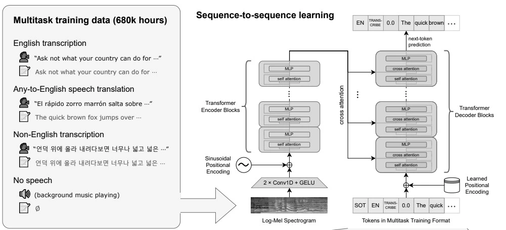

AI 모델을 활용해서 **"상황, 대사, 분위기"** 등 자연어 검색으로 애니메이션의 특정 장면을 찾아내는 멀티모달 시맨틱 검색 엔진을 만들고 싶습니다.
그에 앞서 멀티모달 임베딩의 원리와 `CLIP/Whisper` 등에 대해 알아보려 합니다.

# 1. 멀티모달 임베딩 공간의 이해
**멀티모달 임베딩 공간(Multimodal Embedding Space)** 은 텍스트, 이미지, 오디오, 동영상 등 서로 다른 형태의 데이터(모달리티)를 하나의 통일된 다차원 벡터 공간에 매핑하는 기술입니다, 멀티모달이 다양한 리소스를 의미하고 임베딩은 그 데이터를 의미가 보존된 저차원 벡터로 변환하는 과정을 말합니다.

각종 미디어를 동일한 형태의 값으로 변환하기 때문에 교차 모달리티 검색이 가능하며, 다음과 같은 동작을 수행할 수 있습니다.
- 텍스트로 이미지 검색
- 이미지로 유사 영상 찾기
- 영상의 이미지와 소리로 상황 인식

멀티모달 임베딩을 하기 위해서는 `Contrastive Learning`으로 비슷한 리소스끼리는 가깝게, 먼 것들은 멀게 배치하도록 모델을 최적화합니다. 이를 통해 모델은 데이터의 의미를 수치화된 거리로 파악하게 되며, 이렇게 거리 값을 비교하는 공간이 바로 `Shared Embedding Space`입니다.
이 공간에서는 서로 다른 모달리티의 데이터가 같은 좌표계에 위치하게 되어 수치로 비교할 수 있게 되죠.
하나의 공간에 데이터를 투영함으로써 다양한 동작을 수행할 수 있게 됩니다.

## Contrastive Learning
대조 학습은 데이터 간의 유사도와 차이를 비교하며 특징을 학습하는 방식으로, 모델이 라벨 없이도 데이터의 의미를 스스로 파악할 수 있게 해주는 `자기 지도 학습(Self-Supervised Learning)`에서 주로 활용됩니다.
이런 방식이 아니라면 사람이 일일이 라벨링하며 데이터를 나눠야 했습니다.
예시로 대표적인 데이터셋인 `ImageNet`은 약 22,000개의 객체를 구분하기 위해 1,400만 장의 이미지와 25,000명 이상의 작업자가 필요했습니다.

핵심 아이디어는 매우 단순합니다.
- **Positive Pair (긍정 쌍)**: 같은 대상이거나 의미상 유사한 데이터 쌍입니다. 모델은 이들의 거리를 가깝게 만듭니다.
- **Negative Pair (부정 쌍)**: 서로 다른 대상이거나 관련 없는 데이터 쌍입니다. 모델은 이들의 거리를 멀게 만듭니다.

예를 들어 강아지 사진을 약간 회전시키거나 색감을 바꾼 사진은 원본에 가깝게 배치하고, 고양이 사진처럼 다른 대상의 사진은 멀리 떨어뜨려 놓는 훈련 방식이죠. 이 과정을 통해 모델은 "강아지"라는 객체의 특징을 스스로 깨닫게 됩니다.

이 점을 활용해서, 아지 사진 한 장이 있다고 가정하면 이 사진을 자르거나, 회전시키거나, 색감을 바꾸는 식으로 여러 개의 변형된 사진을 만들어도 여전히 같은 강아지라는 `Positive Pair`로 인식하여 거리를 가깝게 합니다. 이로써 모델이 표면적인 변화에 흔들리지 않고 본질을 구별할 수 있게 됩니다.

## Static Embedding Space, Shared Embedding Space
임베딩을 통해 데이터를 벡터로 표현하면, 공간 안에서의 상대적 위치를 통해 각 데이터의 의미를 파악할 수 있습니다.
거리와 각도를 통해 코사인 값으로  도출해서 벡터 값 사이의 유사도를 측정합니다.

다만 벡터의 숫자 값만으로는 의미를 직관적으로 이해하기 어렵기 때문에, 보통 좌표 공간상의 위치로 시각화하여 표현하죠.
기존 `Word2Vec, GloVe, FastText` 모델 등에서 사용된 방식은 공간에서 하나의 단어가 하나의 벡터에 1:1로 고정되는 `Static Embedding`이었습니다. 그래서 "배"라는 단어를 벡터화한 값이 먹는 배인지, 타는 배인지, 사람의 배인지를 구분할 수 없었죠.

위 이미지를 보면 3개의 축(dessertness, sandwichness, liquidness)으로 단어 사이의 관계를 표현했죠.
이를 통해 각 단어가 어떤 의미에 가까운지를 3차원 공간상에서 표현할 수 있게 됩니다. 샐러드, 피자, 핫도그, 샌드위치, 보르시(borscht) 등이 어느 쪽에 더 가까운지를 위치로 알 수 있죠.

하지만 이런 방식은 단일 종류의 모달리티(텍스트)에서만 동작할 수 있었습니다. <br/>\
`Shared Embedding Space`이 이러한 한계를 개선한 방법입니다. <br/>
주로 멀티모달(Multimodal) 모델(ex: `OpenAI의 CLIP`)에서 중요한 개념으로, 서로 다른 형태의 데이터(이미지, 텍스트, 소리 등)가 하나의 공통된 공간에 함께 배치되어 이미지로서의 사과와 텍스트로서의 "사과"가 서로 가까운 위치의 벡터로 표현되도록 합니다. 그래서 데이터의 형태가 달라도 의미를 기준으로 검색할 수 있게 되죠.

## CLIP 구조
파인튜닝 없이 바로 사용할 수 있고, 학습 시 보지 못한 키워드에 대해서도 추론이 가능한 모델입니다. 또한 이미지 인코더와 텍스트 인코더의 출력이 같은 `Shared Embedding Space` 위에 놓이기 때문에, 두 출력을 연결하기 위한 별도의 변환 레이어 없이도 곧바로 유사도를 비교할 수 있습니다.

`CLIP`은 자연어 지도 학습(Natural Language Supervision)을 통해 시각적 개념을 효율적으로 학습하는 신경망입니다.
인식하고자 하는 시각적 범주의 이름만 제공하면, `GPT-2`나 `GPT-3`의 "zero-shot" 기능처럼 다양한 시각 분류 벤치마크에 그대로 적용할 수 있습니다.
- 신경망(Neural Network): 인간의 뇌가 정보를 처리하는 방식에서 영감을 받은 인공지능(AI) 및 머신러닝 모델
- 제로샷(Zero-shot): AI 모델이 학습 과정에서 배우지 않았거나, 한 번도 본 적 없는 새로운 데이터/작업을 별도의 추가 학습(파인튜닝) 없이 바로 처리하는 능력

추후 `Anime Search` 프로젝트를 구성할 때 새로운 에피소드가 나올 때마다 모델을 재학습하는 건 비용적으로 손해이기 때문에 별도 학습 없이 곧바로 임베딩을 추출할 수 있는 `CLIP`이 적합합니다. 따라서 이를 베이스로 프로젝트를 구성하려 합니다.

## Whisper와 Timestamp Transcript
`Whisper`는 인공지능 모델보다는 비정형 오디오 스트림을 구조화된 텍스트와 시간 데이터로 변환해주는 파서(Parser)입니다.
`Whisper`는 기본적으로 Transformer 기반의 Encoder-Decoder 아키텍처를 가지고 흐름은 다음과 같습니다.
- **Audio Input & Chunking**: 긴 오디오 파일을 30초 단위의 청크(Chunk)로 자릅니다. (Out Of Memory 방지)
- **Log-Mel Spectrogram 변환 (전처리)**: 오디오 파형(Waveform)을 주파수 대역의 시각적 이미지 형태(Spectrogram)로 변환합니다. 즉, 소리를 이미지로 바꾸어 처리합니다.
- **Encoder**: 스펙트로그램 데이터를 분석하여 오디오의 특징(Feature) 벡터를 추출합니다.
- **Decoder**: 추출된 특징 벡터를 바탕으로 다음 단어를 예측하며 텍스트를 생성합니다. 이때 언어 감지(Language ID), 음성 인식, 번역 등의 태스크를 동시에 수행할 수 있습니다.

이에 따른 처리 순서는 아래와 같습니다.

1. Audio Input & Chunking  
2. Log-Mel Spectrogram  
3. Encoder가 특징(Feature) 벡터를 뽑습니다.  
4. Decoder가 그걸 보고 다음 단어를 예측하며 텍스트를 만들고, 타임스탬프·언어 감지(Language ID)·번역 등도 같은 Encoder–Decoder 구조에서 함께 다룰 수 있습니다.  

`Whisper`는 아래 그림처럼 `Seq2Seq(Sequence-to-Sequence)`로 이해할 수 있습니다.  
오디오 신호를 수치 배열의 시퀀스로 받아, 전사 텍스트와 구간 정보가 담긴 `Timestamp Transcript` 쪽 시퀀스로 바꾸는 흐름입니다.


`Timestamp Transcript`는 일반적인 `STT(Speech-to-Text)`가 텍스트만 내는 경우와 달리, 특수 토큰 등을 통해 시작/종료 시간과 함께 반환합니다. 아래 예시처럼 구간별로 시작/종료 시간이 붙은 형태라고 보면 됩니다.

```json
{
  "text": "나는 해적왕이 될 거야!",
  "segments": [
    {
      "id": 0,
      "start": 12.5,
      "end": 14.8,
      "text": "나는 해적왕이",
      "tokens": [...]
    },
    {
      "id": 1,
      "start": 14.8,
      "end": 16.0,
      "text": "될 거야!",
      "tokens": [...]
    }
  ]
}
```

## 실습
### 허깅페이스로 로컬에서 간단히 돌리기
### Colab/Jupyter로 좀 더 깊게 이해하기
### Numpy로 DB 없이 검색기 만들기 (50~200장)

- 음.. 가능하면 내 로컬에서 코드로 돌려보고 싶은데 허깅스페이스로 손쉽게 가능하다고 하니 그쪽을 좀 보거나
- Colab/Jupyter로 본질을 파악하는 편도 좋음 Sentence-Transformers로
- 간단하게 내가 가진 이미지 50~200 장으로 DB 없이도 numpy로 검색기를 만들 수 있음


이론 적 배경보다는 "데이터가 어덯게 벡터로 바뀌는 가"에 집중
- CLIP (OpenAI): [Learning Transferable Visual Models from Natural Language Supervision](https://openai.com/index/clip/)
    - 핵심: 논문보다는 공식 블로그의 'Contrastive Learning' 다이어그램을 보세요. 이미지와 텍스트가 어떻게 같은 좌표계로 모이는지 이해하는 것이 1순위입니다.
- Whisper (OpenAI): [Whisper GitHub Repository](https://github.com/openai/whisper)
    - 핵심: 오디오가 멜-스펙트로그램(Mel-spectrogram)으로 변환되어 Transformer에 입력되는 과정을 가볍게 훑으세요.
- 실습 도구: [Sentence-Transformers Documentation](https://www.sbert.net/)
    - Multi-Modal Bi-Encoders 섹션을 보면 CLIP을 어떻게 Python 코드로 즉시 구현하는지 잘 나와 있습니다.


**참고**
- [구글 머신 러닝 가이드](https://developers.google.com/machine-learning)
- [Learning Transferable Visual Models from Natural Language Supervision](https://openai.com/index/clip/)


---

# 2. 모델 선정과 도메인 적합성 (애니메이션 특화)
## 일반 CLIP vs anime-friendly CLIP 비교
## Whisper 모델 크기/언어/VAD 비교
## 작은 샘플로 정성/정량 평가

일반 실사 모델은 애니메이션의 선과 색감을 제대로 이해하지 못할 수 있습니다.
- Anime-friendly CLIP: Hugging Face에서 danbooru 혹은 anime 태그가 붙은 가중치 모델을 검색하세요.
    - 추천: [kakaobrain/align-base](https://huggingface.co/kakaobrain/align-base) (멀티모달 성능 우수) 혹은 [DeepDanbooru](https://github.com/KichangKim/DeepDanbooru) 관련 아티클.
- Whisper Optimization: [faster-whisper](https://github.com/SYSTRAN/faster-whisper)
    - 핵심: 라프텔 규모의 전처리를 위해서는 성능이 중요합니다. CTranslate2를 사용하여 속도를 4배 이상 끌어올린 구현체를 탐독하세요.
---

# 3. 데이터 전처리 파이프라인 (The Bottleneck)
## 영상 → 장면 분할 (균등 샘플링 vs PySceneDetect vs Keyframe)
## 영상 → 오디오 분리 → Whisper transcript
## 프레임-자막 시간 정합 ("장면" 단위 정의)
## 임베딩 비용/스토리지 최적화 (배치, 양자화, 캐시)

백엔드 개발자로서 가장 많은 시간을 할애해야 할 구간입니다. 비용(Cost)과 성능(Latency)의 균형점이 여기 있습니다.
- 장면 분할 (Scene Detection): [PySceneDetect Documentation](https://pyscenedetect.readthedocs.io/en/latest/)
    - 핵심: 균등 샘플링은 중요한 장면을 놓칩니다. 'Content-aware detection'의 원리를 파악하세요.
- FFmpeg 최적화: [FFmpeg Filtering Guide](https://ffmpeg.org/ffmpeg-filters.html)
    - CPU/GPU를 사용하여 실시간으로 프레임을 추출하고 오디오를 분리하는 파이프라인 설계법을 찾아보세요.
- 전처리 아키텍처: [Netflix TechBlog - High-quality Video Encoding](https://netflixtechblog.com/)
    - 넷플릭스가 대규모 영상을 어떻게 분산 처리하는지(Chunk 단위 처리) 참고하면 라프텔향 아키텍처 설계에 큰 도움이 됩니다.
---

# 4. 벡터 라이브러리 vs 벡터 DB
## FAISS(Library) vs Qdrant(Managed DB) 비교
## ANN 인덱스 (HNSW / IVF-PQ) 와 CRUD/정렬에 미치는 영향
## 멀티 인덱스 전략 (이미지 임베딩 / 자막 임베딩 분리 저장)

RDBMS의 B-Tree 인덱싱과 벡터 DB의 ANN(Approximate Nearest Neighbor) 알고리즘 차이를 이해해야 합니다.
- Qdrant 공식 문서: [Qdrant Documentation - Concepts](https://qdrant.tech/documentation/concepts/)
    - 핵심: HNSW (Hierarchical Navigable Small World) 인덱싱 원리를 반드시 이해하세요. 벡터 검색 속도의 핵심입니다.
- 성능 비교: [Vector DB Benchmarks](https://ann-benchmarks.com/)
    - FAISS, Qdrant, Milvus 등의 성능 지표를 비교하며, 왜 API 기반의 Qdrant가 운영 관점에서 유리한지 파악하세요.
- Filtering: [Qdrant Filtering Guide](https://qdrant.tech/documentation/concepts/filtering/)
    - 벡터 검색과 동시에 "장르=액션" 같은 메타데이터 필터링이 어떻게 인덱스 수준에서 결합되는지 확인하세요.
---

# 5. 검색·랭킹과 평가
## 자연어 쿼리 임베딩 → 멀티 인덱스 검색 → 결과 fusion (RRF 등)
## 골드셋 구축과 Recall@K, MRR
## 모델/파이프라인 변형 별 비교

단순 검색을 넘어 "사용자가 만족할 만한 결과"인가를 측정하는 단계입니다.
- Hybrid Search & RRF: [Elasticsearch Guide - Reciprocal Rank Fusion](https://www.elastic.co/guide/en/elasticsearch/reference/current/rrf.html)
    - 텍스트 검색 결과와 이미지 검색 결과를 수학적으로 어떻게 합치는지($RRFscore = \sum \frac{1}{k + rank}$) 확인하세요.
- 평가 지표 (IR Metrics): Information Retrieval Metrics
    - (Recall@K, MRR, nDCG) 검색 엔진의 성능을 정량화하는 표준 지표들입니다.
