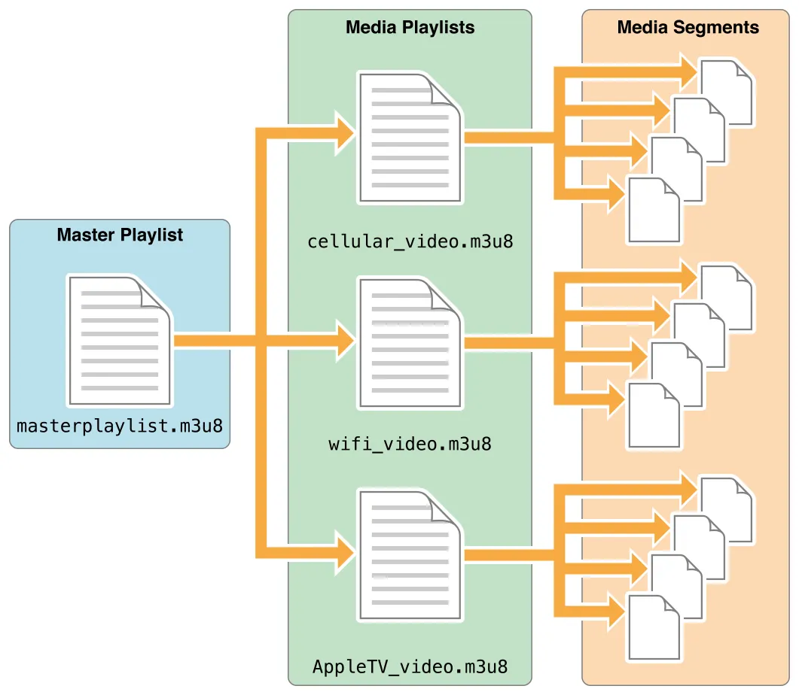

# HLS and ABR
HLS(HTTP Live Streaming)는 HTTP로 `.m3u8, .m3u` 플레이리스트와 짧은 미디어 세그먼트를 주고받으며 영상을 이어 재생하는 방식입니다. 네트워크나 기기 상황에 맞춰 ABR(Adaptive Bitrate, 적응형 비트레이트)로 화질(Variant)을 바꿔 끊김을 줄입니다.

인코딩을 구분하면 다음과 같습니다.
- **CBR(Constant Bit Rate)**: 구간마다 비트레이트가 거의 일정한 인코딩
- **VBR(Variable Bit Rate)**: 장면 복잡도에 따라 비트레이트가 달라지는 인코딩
- **ABR(Adaptive Bitrate)**: 서버가 여러 화질(Variant)을 제공하고, 클라이언트가 대역폭, 버퍼, CPU 등을 보고 그중 하나를 선택하고 전환하는 재생 방식 (HLS Master playlist와 연결)
HLS는 [ABR Streaming](https://www.cloudflare.com/ko-kr/learning/video/what-is-adaptive-bitrate-streaming/)을 제공하는 프로토콜로 동영상 스트리밍에 가장 많이 쓰이는 방식 중 하나입니다.

이 문서(RFC 8216)는 HTTP 위에서 동작하는 미디어 전송 프로토콜(HLS)을 정의해 구현 간 상호 운용성을 맞춥니다. 이 프로토콜을 사용하면 클라이언트는 서버로부터 연속적인 미디어 스트림을 수신하여 표현할 수 있습니다. 

이 문서에서는 프로토콜 버전 7을 다룹니다.

# Media playlist and segments
HLS에서 `Media playlist`(미디어 플레이리스트, 보통 `.m3u8`, `.m3u`)는 `media segment` URI와 재생 메타데이터가 담긴 인덱스 파일입니다. 플레이어가 이 파일을 읽고, 나열된 순서대로 세그먼트를 HTTP로 요청해 이어 붙여 영상을 제공하죠.
- **VOD**: 플레이리스트에 세그먼트가 모두 있고, 끝에는 대부분 `#EXT-X-ENDLIST`로 종료를 표시하는 경우가 많습니다.
- **Live**: 같은 Media playlist URL을 반복해서 갱신함 (`#EXT-X-MEDIA-SEQUENCE` 등).
    - **Sliding**: 최근 N개 세그먼트만 유지하고 예전 항목은 삭제해 윈도우가 짧아져 지연 부담이 줄어듦
    - **Event**: 세그먼트를 계속 누적해서 이벤트 시작 이후 되감기 가능, DVR처럼 사용 가능
        - DVR(Digital Video Recorder): 카메라가 촬영한 영상 신호를 디지털로 변환해 하드디스크에 저장하는 영상 녹화 장치

아래가 그 `Media playlist`의 구성입니다.

```text
#EXTM3U
#EXT-X-TARGETDURATION:10
#EXTINF:9.009,
http://media.example.com/first.ts
#EXTINF:9.009,
http://media.example.com/second.ts
#EXTINF:3.003,
http://media.example.com/third.ts
#EXT-X-ENDLIST
```
`#EXT-X-TARGETDURATION`은 세그먼트 최대 길이(초)의 상한을 나타내고, `#EXTINF`와 URI로 각 세그먼트의 재생 시간과 가져올 미디어를 적습니다. 그보다 복잡한 태그도 같은 미디어 플레이리스트에 넣을 수 있습니다.
- **Segment**: 전체 영상을 2~10초 길이의 작은 파일(.ts, .m4s)으로 쪼갠 단위, 주로 다음 형식을 지원
    - **MPEG-2 TS** (`.ts`): 영상과 오디오가 mux된 본편 스트림에 많음.
    - **Fragmented MPEG-4** (fMP4): `#EXT-X-MAP`으로 init 세그먼트를 두는 경우가 많음.
    - **Packed Audio**: 오디오만 담은 세그먼트(분리 오디오 Rendition용).
    - **WebVTT**: 자막 등 텍스트 트랙용(본편 영상 세그먼트와는 용도가 다름).

세그먼트를 암호화할 때는 `#EXT-X-KEY`로 복호화 방법(`METHOD`)과 키 URI를 선언하고, 필요하면 IV를 함께 둡니다. `Master playlist`에서는 `#EXT-X-SESSION-KEY`로 키를 미리 알려 두기도 합니다 (자세한 내용은 아래 [Encryption and keys](#encryption-and-keys) 참고)

# Segment containers: MPEG-2 TS and fragmented MP4
위에서 세그먼트(ts)는 `MPEG-2 TS (Transport Stream)` 방식을 통해 데이터가 온다고 적었지만, 해당 방식은 전통적인 포맷 방식입니다.
현재는 `MPEG-DASH`와 `HLS`에서 둘 다 지원하는 `fMP4 (Fragmented MPEG-4)`도 지원하고 있죠.

2016년부터 애플도 지원하면서 다른 진영의 스트리밍 표준인 `DASH(MPEG-DASH)`와 같이 쓸 수 있는 `fMP4`가 대세가 되었고, 2017년 CMAF(ISO 23000-19)가 HLS와 DASH가 공유하는 fMP4 세그먼트 규칙을 정리했죠.
- CMAF: HLS·DASH가 같은 fMP4 미디어 세그먼트를 쓰기 위한 공통 조각 포맷(매니페스트는 프로토콜마다 별도)

왜냐하면 이전에는 HLS용(TS)과 DASH용(fMP4)을 각각 패키징해 두는 경우가 많았는데, 이제는 CMAF에 맞춘 fMP4 조각(init·`.m4s` 등)을 하나 정해두면 양쪽에 서비스할 수 있어 스토리지 중복을 줄일 수 있습니다. 미디어 조각과 별도로 매니페스트가 필요해 HLS는 `.m3u8`과 `#EXT-X-MAP`(init URI), DASH는 `.mpd`가 각각 필요합니다.

`fMP4`(Fragmented MPEG-4)는 영상을 짧은 단위(예: 2초~6초)의 조각(Fragment)으로 쪼갠 구조이고, `.m4s`는 그 미디어 세그먼트에 흔히 쓰는 파일 확장자입니다. 패키징하면 재생에 필요한 init 세그먼트(보통 `.mp4`, HLS에서는 `#EXT-X-MAP`으로 지정)와 이어지는 `.m4s` 조각이 생깁니다.
- fMP4(Fragmented MP4): MP4 파일은 영상의 앞부분(또는 뒷부분)에 Moov atom(메타데이터 고정 영역)이 들어가기에 영상 전체를 다운로드하기 전에는 재생이 어렵다는 단점을 보완한 방식

참고로 실제 동영상 서비스 몇 개의 네트워크를 파보니 다음처럼 돌아가는 걸 알 수 있었습니다.

라프텔은 안정적인 기술 스택을 사용하고, 넷플릭스는 바이트 단위(오디오는 약 130KB, 비디오는 1MB)로 제어해서 최대한의 비용 절감과 고화질을 유지하며, 유튜브는 UMP라는 자체 스트리밍 데이터 방식을 사용하여 라이브에서도 우수한 성능을 만들어 내고 있습니다.

| 비교 항목 | 라프텔 (Laftel) | 넷플릭스 (Netflix) | 유튜브 (YouTube) |
|-----------|-----------------|--------------------|------------------|
| 스트리밍 표준 | 정석 MPEG-DASH / HLS | ISO/IEC 기반 커스텀 (CMAF) | ISO/IEC 기반 커스텀 (DASH 변형) |
| 실제 파일 확장자 | `.m4s` | 없음 (통째 파일 바이트 제어) | 없음 (파라미터 뒤에 숨김) |
| 네트워크 요청 형태 | `GET .../seg-9.m4s` | `GET .../range/3580684-...` | `POST .../videoplayback?rn=8` |
| Content-Type | `video/mp4`, `audio/mp4` | `application/octet-stream` | `application/vnd.yt-ump` |
| 미디어 서빙 방식 | 비디오 / 오디오 완전 분리 | 비디오 / 오디오 완전 분리 | 비디오 + 오디오 + 자막 멀티플렉싱 |
| 주요 인프라 | Public Cloud (AWS S3 + CDN) | 자체 CDN (Netflix OCA) | 자체 데이터센터 + 엣지 (GGC) |
| 핵심 지향점 | 구현 편의성, 인프라 유지보수 용이 | 스토리지 비용 절감, 고화질 안정성 | 초저지연 라이브, 대규모 동시 접속 처리 |

# Master playlist and variants
이전에 언급한 `Media playlist`는 실제 영상과 오디오 데이터 조각을 가리키는 인덱스였습니다.
하지만 우리가 VOD나 OTT를 보면 다양한 화질과 다양한 국가의 오디오를 제공하는 걸 볼 수 있죠. 이를 가능하게 하는 이유는 각 화질과 오디오를 또 색인해 주는 `index`가 존재하고 이게 `Master playlist`입니다.

그림으로 표현하면 아래와 같죠. (Master → Media → Segment)


사용자가 콘텐츠를 재생하면 플레이어가 `Master playlist`를 받고, 선택한 `Variant`의 `Media playlist` URI를 GET한 뒤, 그 안에 적힌 세그먼트를 순서대로 요청해 재생합니다. 화질 변경(ABR)은 다른 `Variant`의 `Media playlist`로 넘어가는 것입니다.

`Master playlist`는 대략 두 종류를 중심으로 구성합니다.
- **Variant** (`#EXT-X-STREAM-INF`): 같은 콘텐츠의 다른 화질과 비트레이트(ABR 전환 대상)를 담고, URI가 하나의 `Media playlist`를 가리킵니다.
- **Alternative Rendition** (`#EXT-X-MEDIA` + `GROUP-ID`): 같은 콘텐츠의 다른 오디오, 자막 등 (Variant에 붙는 보조 트랙)을 제공하며, 선택 시 별도 Media playlist URI를 가리킬 수 있습니다.

그 외 Master에는 `#EXT-X-SESSION-KEY`, `#EXT-X-I-FRAME-STREAM-INF`(빠른 탐색용) 등이 더 있을 수 있습니다. Rendition 규칙은 [Alternative renditions](#alternative-renditions)에서 다룹니다.

직접 동영상 플레이어를 만든다면 대략 다음 순서입니다.

1. 스트림 URL로 Master playlist GET (단순 스트림은 Media playlist만 있을 수 있음)
2. Master에서 Variant와 Rendition을 고르고, 각각이 가리키는 Media playlist URI, 대체 스트림, 키(`#EXT-X-SESSION-KEY` 등) 정보를 확인
3. 선택한 Media playlist를 GET한 뒤, 안에 적힌 세그먼트 URI를 순서대로 GET (주로 `.ts`이고, 라이브면 playlist를 주기적으로 다시 GET)
4. 분리 오디오 Rendition을 쓰면 영상 Media와 오디오 Media를 타임스탬프에 맞춰 같이 재생
5. 세그먼트를 충분히 버퍼한 뒤 (암호화면 복호화 후) 연속 재생

# Alternative renditions

앞의 `Variant`가 화질·비트레이트 줄기라면, `Alternative Rendition`은 같은 프로그램에 붙는 다른 오디오와 자막을 나타내는 다른 트랙입니다. Master playlist에서 Rendition은 `#EXT-X-MEDIA`로 선언합니다.

- `TYPE`: `AUDIO`, `VIDEO`, `SUBTITLES`, `CLOSED-CAPTIONS`
- `GROUP-ID`: 같은 종류 Rendition을 묶는 이름
- `NAME`, `LANGUAGE`, `URI`: Rendition용 Media playlist
- `DEFAULT`, `AUTOSELECT`: 기본 값과 자동 선택 여부

`#EXT-X-STREAM-INF`의 `AUDIO="그룹ID"`, `SUBTITLES="그룹ID"` 등은 Rendition 정의가 아니라, 이 Variant와 함께 쓸 `GROUP-ID`를 연결하는 속성입니다. 플레이어는 Variant 하나를 고른 뒤, 연결된 그룹에서 오디오와 자막 Rendition을 고릅니다.

아래는 `Master playlist` 예시입니다(`#EXT-X-MEDIA`와 `#EXT-X-STREAM-INF`).

```text
#EXT-X-MEDIA:TYPE=AUDIO,GROUP-ID="audio",NAME="한국어",LANGUAGE="ko",URI="audio-ko.m3u8"
#EXT-X-MEDIA:TYPE=AUDIO,GROUP-ID="audio",NAME="English",LANGUAGE="en",URI="audio-en.m3u8"
#EXT-X-MEDIA:TYPE=SUBTITLES,GROUP-ID="subs",NAME="한국어",URI="subs-ko.m3u8"

#EXT-X-STREAM-INF:BANDWIDTH=2000000,RESOLUTION=1280x720,AUDIO="audio",SUBTITLES="subs"
https://example.com/720p.m3u8
```

본편 Variant의 Media playlist에 오디오가 이미 mux되어 있으면 Rendition 없이도 재생됩니다. 
분리 오디오(Packed Audio)나 자막(WebVTT)을 쓰면, Variant의 영상 Media와 Rendition Media playlist 세그먼트를 타임스탬프에 맞춰 같이 재생합니다(위 플레이어 순서에서 단계 4번).

# Encryption and keys

HLS는 Media Segment 본문을 암호화할 수 있습니다. 복호화에 필요한 정보는 playlist 태그로 전달됩니다.
클라이언트(플레이어)는 Media playlist의 `#EXT-X-KEY`를 읽고, `URI`로 Key file을 HTTP GET한 뒤 해당 구간의 세그먼트를 복호화해 재생합니다. Master playlist의 `#EXT-X-SESSION-KEY`는 여러 Variant와 Rendition이 같은 키를 쓸 때, Variant를 고르기 전에 키 정보를 미리 알려 두는 용도이며, 실제 복호화는 Media playlist의 `#EXT-X-KEY`를 따릅니다.

`#EXT-X-KEY`는 playlist에서 다음 `#EXT-X-KEY`까지의 Media Segment와 그 사이의 `#EXT-X-MAP` init 구간에 적용됩니다. 태그가 없으면 해당 구간은 평문이고, 키를 바꿀 때는 `#EXT-X-KEY` 줄을 추가하면 됩니다.

암호화 스트림에서 클라이언트가 하는 일은 앞 절 플레이어 순서의 3, 5번과 같습니다.
1. Media playlist(또는 Master의 `#EXT-X-SESSION-KEY`)에서 `METHOD`, 키 `URI`, 필요 시 `IV` 확인
2. `URI`로 Key file GET
3. 세그먼트 URI로 미디어를 GET한 뒤 `METHOD`에 맞게 복호화하고 버퍼 후 재생

키와 세그먼트는 playlist에 적힌 HTTP URI로만 가져옵니다.
RFC는 복호화 절차만 명시했을 뿐, 키를 누구에게 줄지(DRM, 로그인)는 서비스가 정합니다.
- DRM(Digital Rights Management): 디지털 콘텐츠의 저작권을 보호하고 권한 없는 복제·무단 사용을 막기 위한 기술·관리 체계

`METHOD`는 다음 중 하나입니다.
- `NONE`: 평문. 암호화 구간 뒤에 평문이 오면 `#EXT-X-KEY:METHOD=NONE`이 필요합니다.
- `AES-128`: 세그먼트 통째 암호화. VOD·라이브에서 가장 흔합니다.
- `SAMPLE-AES`: 샘플 단위 암호화. DRM·fMP4에서 자주 씁니다.

`URI`는 Key file 주소입니다. `KEYFORMAT`을 생략하면 `identity`로 간주되며, Key file은 DRM 래퍼 없이 128비트 cipher key 바이너리입니다. `identity`가 아닌 `KEYFORMAT`은 FairPlay·Widevine 등 DRM용 키 표현이고, 플레이어는 지원하는 형식만 씁니다.

`IV`(Initialization Vector, 초기화 벡터)는 AES-128 CBC에서 세그먼트마다 쓰는 128비트 값입니다. playlist에 `IV`를 적으면 그 값을 쓰고, 생략하면 `identity`일 때 해당 세그먼트의 Media Sequence Number를 big-endian 16바이트 IV로 씁니다.

아래는 예시를 분석해 보죠.
```text
#EXTM3U
#EXT-X-VERSION:3
#EXT-X-MEDIA-SEQUENCE:7794
#EXT-X-TARGETDURATION:15

#EXT-X-KEY:METHOD=AES-128,URI="https://priv.example.com/key.php?r=52",KEYFORMAT="identity",IV=0x00000000000000000000000000001E72

#EXTINF:2.833,
http://media.example.com/fileSequence52-A.ts
#EXTINF:15.0,
http://media.example.com/fileSequence52-B.ts

#EXT-X-KEY:METHOD=AES-128,URI="https://priv.example.com/key.php?r=53",KEYFORMAT="identity"

#EXTINF:15.0,
http://media.example.com/fileSequence53-A.ts
```

위 예시를 읽으면 다음과 같습니다.
- `#EXTM3U`: Extended M3U, Media playlist임을 나타냅니다.
- `#EXT-X-VERSION:3`: 이 playlist가 따르는 HLS 프로토콜 버전입니다.
- `#EXT-X-MEDIA-SEQUENCE:7794`: 이 playlist에 나열된 첫 세그먼트의 시퀀스 번호입니다. 이어지는 세그먼트는 7795, 7796이 옵니다.
- `#EXT-X-TARGETDURATION:15`: 세그먼트 재생 길이(`#EXTINF`)의 상한이 15초임을 뜻합니다.
- `#EXTINF`와 그 아래 URI: 각 세그먼트의 재생 시간(초)과 가져올 `.ts` 주소입니다.
- 첫 `#EXT-X-KEY`: `METHOD=AES-128`, `KEYFORMAT="identity"`, Key file URI, `IV`를 명시합니다. `IV` 끝의 `1E72`는 첫 시퀀스 7794(0x1E72)에 맞춘 예시 값입니다. 이 태그 아래 `fileSequence52-A.ts`, `fileSequence52-B.ts`는 키 `r=52`와 같은 `IV` 속성 값으로 복호화합니다(`IV`를 적었을 때는 세그먼트마다 시퀀스 번호 IV를 쓰지 않음).
- 두 번째 `#EXT-X-KEY`: `METHOD`는 여전히 `AES-128`이고, 바뀐 것은 Key file URI(`r=53`)입니다. `IV`를 적지 않았으므로 `fileSequence53-A.ts`(시퀀스 7796)는 Media Sequence Number를 IV로 씁니다.

# Server and client responsibilities
이 섹션에서는 동영상을 HLS 프로토콜에 맞춰 MP4를 인코딩해 보고, 서버는 Media playlist 주소(m3u8)를 클라이언트에 제공하고 클라이언트가 이를 재생하는 흐름을 만들어 봅시다.

로컬에 `sample.mp4`가 있다는 가정 하에 `ffmpeg`로 HLS 프로토콜 형식에 맞춰 인코딩합시다.
```bash
ffmpeg -i sample.mp4 -c:v copy -c:a copy -start_number 0 -hls_time 10 -hls_list_size 0 -f hls stream.m3u8
```

위 명령어 실행 시 같은 폴더에 Media playlist `stream.m3u8`과 `stream0.ts`, `stream1.ts`… 형태의 세그먼트가 생깁니다.

| 옵션 | 설명 |
|------|------|
| `-i sample.mp4` | 입력 파일 |
| `-c:v copy` | 비디오는 다시 인코딩하지 않고 원본 스트림을 그대로 복사합니다(화질을 유지하므로). |
| `-c:a copy` | 오디오도 동일하게 복사. |
| `-start_number 0` | 세그먼트 파일 이름에 붙는 번호를 0부터 시작(`stream0.ts`, `stream1.ts`…). |
| `-hls_time 10` | 세그먼트 목표 길이를 약 10초로 둡니다. 키 프레임 위치에 따라 `#EXTINF` 값은 정확히 10초가 아닐 수 있음. |
| `-hls_list_size 0` | Media playlist에 넣을 세그먼트 개수 제한이 없습니다. VOD처럼 만든 세그먼트를 playlist에 모두 남김(Live 슬라이딩 윈도우가 아님). |
| `-f hls` | 출력 형식을 HLS로 지정합니다. `.m3u8` playlist와 `.ts` 세그먼트 생성. |
| `stream.m3u8` | 출력 Media playlist 파일 이름 지정. |

이제 서버에서 파일을 나눴으니 이를 서비싱하는 걸 `Flask`로 가볍게 띄웁시다.
```python
# Flask로 단순히 정적 파일을 클라이언트에 서빙 + HTML 페이지 띄우기
from flask import Flask, render_template, send_from_directory   
import os

app = Flask(__name__)

@app.route('/')
def index():
    return render_template('index.html')

@app.route('/video/<filename>')
def video(filename):
    video_dir = os.path.dirname(os.path.abspath(__file__))
    return send_from_directory(video_dir, filename)

if __name__ == '__main__':
    app.run(host='0.0.0.0', port=8000, debug=True)
```
이제 클라이언트 역할을 할 `index.html`을 다음처럼 만들면
```html
<!DOCTYPE html>
<html lang="ko">
<head>
    <meta charset="UTF-8">
    <meta name="viewport" content="width=device-width, initial-scale=1.0">
    <title>HLS 스트리밍 클라이언트</title>
    <script src="https://cdn.jsdelivr.net/npm/hls.js@latest"></script>
    <style>
        body { display: flex; flex-direction: column; align-items: center; justify-content: center; font-family: sans-serif; background: #222; color: #fff; }
        video { width: 80%; max-width: 800px; border: 2px solid #444; background: #000; }
    </style>
</head>
<body>

    <h1>HLS Player (Flask Server)</h1>
    
    <video id="video" controls autoplay muted></video>

    <script>
        const video = document.getElementById('video');
        // Flask 서버의 m3u8 파일 경로
        const videoSrc = '/video/stream.m3u8'; 

        // PC 브라우저용 (Chrome, Firefox, Edge 등)
        if (Hls.isSupported()) {
            console.log('HLS is supported');
            const hls = new Hls();
            hls.loadSource(videoSrc);
            
            // m3u8 로드 종료 시 이벤트 실행
            hls.attachMedia(video);
            hls.on(Hls.Events.MANIFEST_PARSED, function() {
                video.play();
            });
        } else if (video.canPlayType('application/vnd.apple.mpegurl')) {
            console.log('Native HLS is supported');
            video.src = videoSrc;
            video.addEventListener('loadedmetadata', function() {
                video.play();
            });
        } else {
            console.log('HLS is not supported');
        }
    </script>
</body>
</html>
```
서버에서는 인코딩해서 만들어진 `stream0.ts` 등 세그먼트가 `stream.m3u8` 파일에 다음처럼 잘 등록된 것을 확인할 수 있습니다.
```
#EXTM3U
#EXT-X-VERSION:3
#EXT-X-TARGETDURATION:16
#EXT-X-MEDIA-SEQUENCE:0
#EXTINF:16.282933,
stream0.ts
#EXTINF:6.573233,
stream1.ts
#EXTINF:7.907900,
stream2.ts
#EXTINF:11.511500,
stream3.ts
#EXTINF:9.976633,
stream4.ts
#EXTINF:12.479133,
stream5.ts
#EXTINF:7.007000,
stream6.ts
#EXTINF:12.145467,
stream7.ts
#EXTINF:6.840167,
stream8.ts
#EXTINF:10.243567,
stream9.ts
#EXTINF:9.442767,
stream10.ts
#EXTINF:10.910900,
stream11.ts
#EXTINF:9.576233,
stream12.ts
#EXTINF:13.246567,
stream13.ts
#EXTINF:7.907900,
stream14.ts
#EXTINF:9.009000,
stream15.ts
#EXTINF:12.412400,
stream16.ts
#EXTINF:11.611600,
stream17.ts
#EXTINF:8.575233,
stream18.ts
#EXTINF:7.007000,
stream19.ts
#EXTINF:10.010000,
stream20.ts
#EXTINF:13.847167,
stream21.ts
#EXTINF:11.277933,
stream22.ts
#EXTINF:4.604600,
stream23.ts
#EXTINF:12.579233,
stream24.ts
#EXTINF:9.009000,
stream25.ts
#EXTINF:9.676333,
stream26.ts
#EXTINF:8.808800,
stream27.ts
#EXTINF:11.411400,
stream28.ts
#EXTINF:11.745067,
stream29.ts
#EXT-X-ENDLIST
```
Client HTML에서도 `HLS is supported` 로그도 정상적으로 뜨고 영상도 플레이 되는 등, HLS가 동작한 것을 확인해 볼 수 있죠.