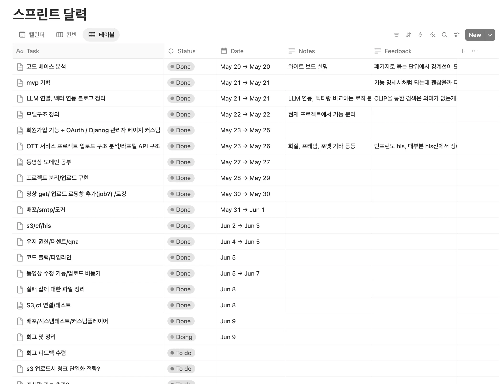
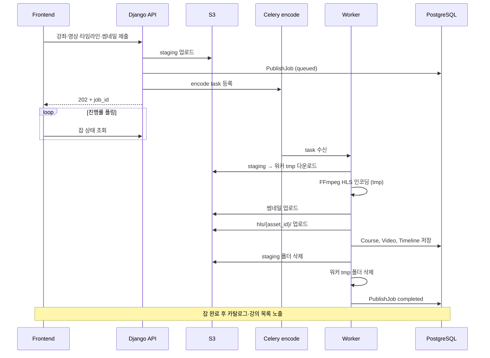
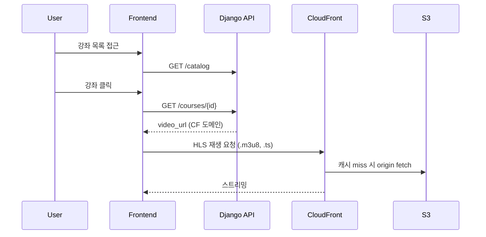
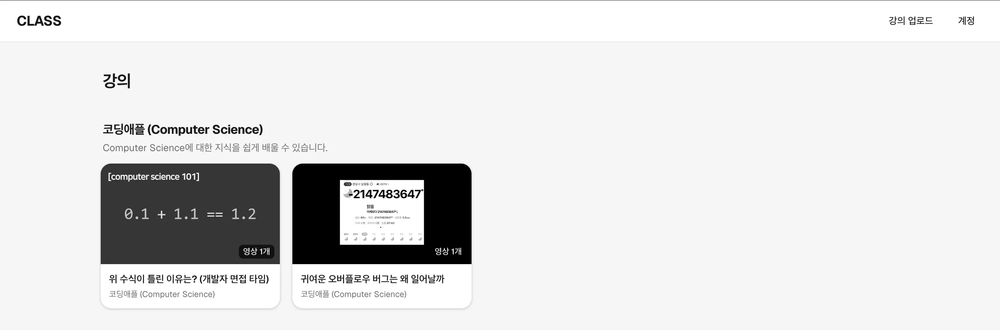
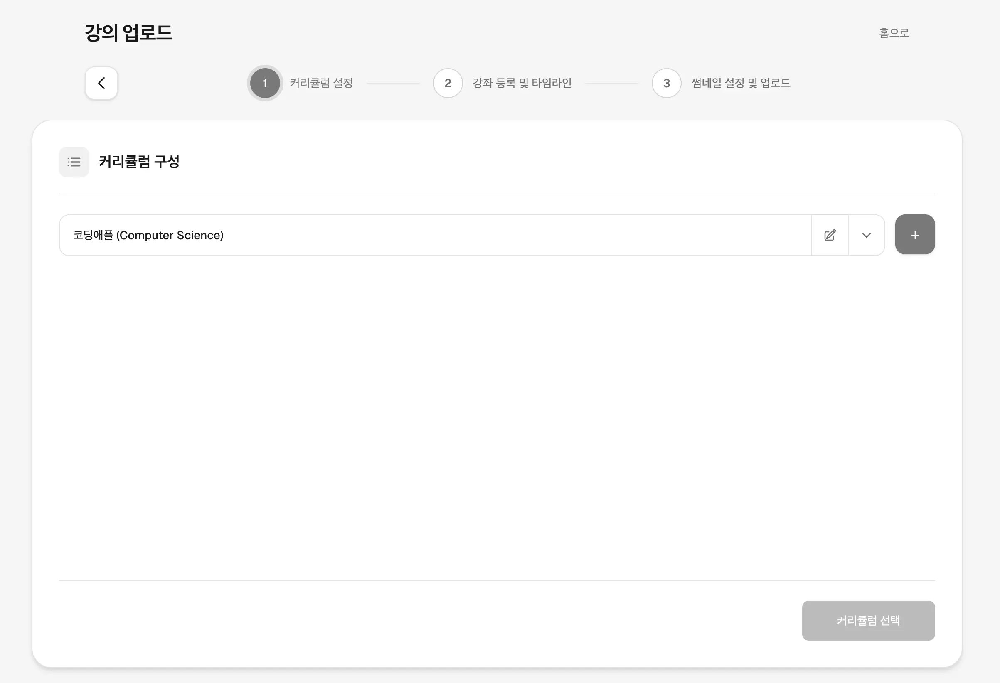
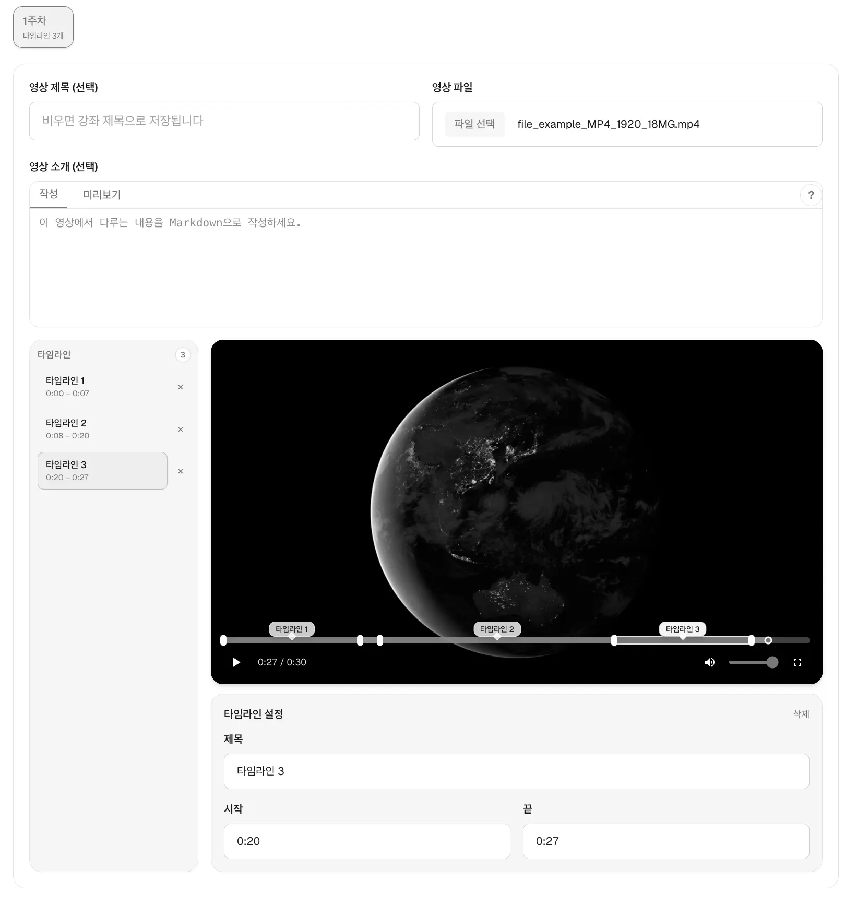
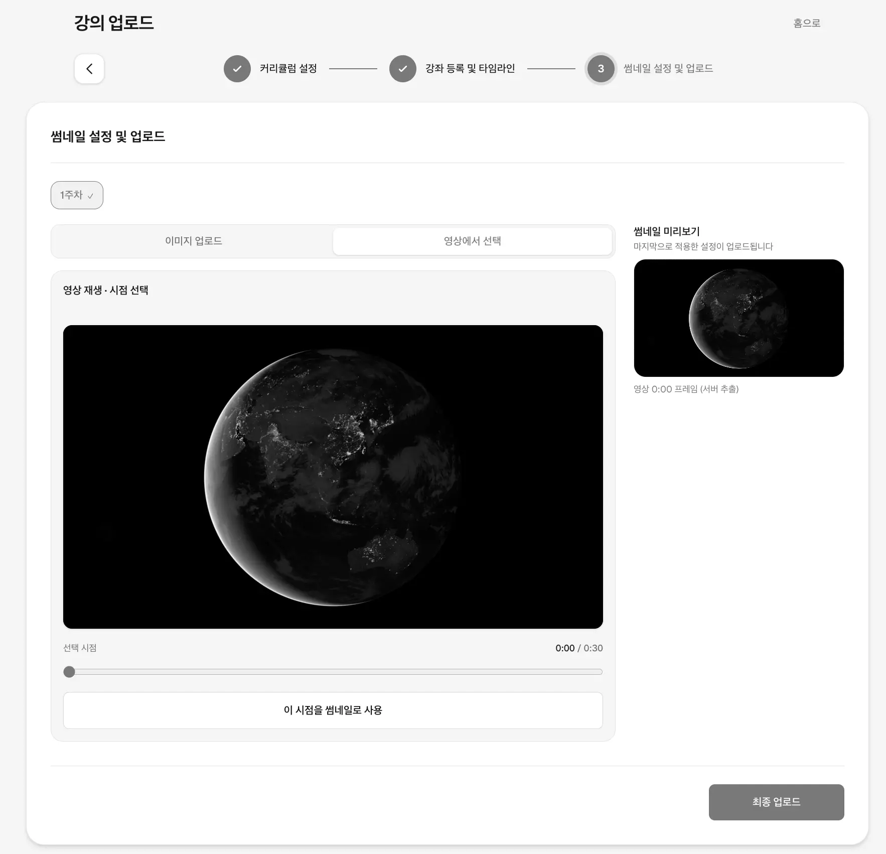
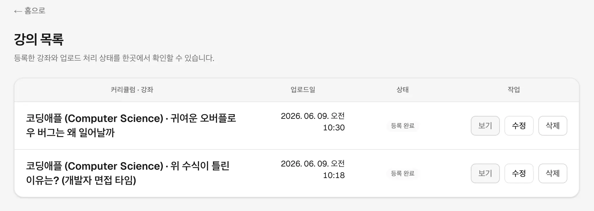

# 개요
1차 MVP는 현재 학원 내에서 배포 중이며, 도메인 연결 후 공유할 예정입니다.

슬슬 머릿속에는 있지만 말로는 정리가 안 되는 단계에 닿은 것 같아 글로 정리합니다.

## Anime Search에서의 한계 
지난번에 진행했던 [Anime Search Project](/posts/2026/05/10/anime-search-project/)에서 장면 검색 RAG까지 구현하며 결과적으로 마음에 들지 않았던 점은, 어디까지나 기술적 호기심 해결로 끝났다는 점이었습니다.

해당 글에서도 마지막에 다음과 같이 정리했죠.

> 위 파이프라인까지 구현해 6장 초반 화면처럼 자연어 검색이 동작합니다.
> 다만 아직 부족한 점도 있고, 실용성이 떨어지는 부분도 몇 군데 보였습니다.
>
> 1. 애니메이션의 경우 자막을 쓰는 편이 더 효율적으로 보임
> 2. 스포일러 방지, 사용자가 조건을 넣지 않으면 원치 않는 화나 장면이 노출될 수 있음
> 3. 프레임 샘플링 한계, 성능을 올리면 리소스 사용량이 커져 실용성이 떨어짐

## Class Project 목적성

실제로 사용자 풀을 다루는 서비스를 배포하는 게 가장 이상적이지만, 사용자들에게 직접적인 서비스를 배포하면서 동영상 관련 기술을 공부하고 싶다는 목적도 같이 이루는 프로젝트 방향이 잘 떠오르지 않았습니다.

다행히 공부 환경을 만들기 위해 온 학원에서 강사 선생님께서 강의 영상 녹화본을 올려줄 수 있다고 하셔서 프로젝트 방향을 정할 수 있었습니다. 실제 사용자 풀을 가진 서비스를 운영하면서 동영상에 관한 기술 경험도 쌓을 수 있게 된 거죠.

# 프로젝트

## 목표
위에서 언급했듯이 기본 컨셉은 강의 녹화본을 업로드할 수 있어야 합니다.
스트리밍이나 OTT 분야에 대한 지식이 전무했기 때문에 관련 지식을 공부했었죠.([RFC 8216 — HTTP Live Streaming](/posts/2026/05/26/rfc8216-http-live-streaming/))

비교적 사이즈가 작은 규모에서는 `HLS + S3 + CF` 구조면 충분해 보였지만 욕심이 생겨서 처음 배포할 때부터 멀티파트 업로드로 바이트 단위 청크를 나누는 넷플릭스 방식으로 인코딩 서버까지 만들고 백엔드 서버와 통신하는 구조를 구상했지만 이에 대해서 실제 서비스의 생명주기를 간접 체험하는 걸 위해 배포 후 고도화하는 방식으로 하는 게 어떻냐는 피드백을 받았습니다.

제가 보았을 때도 그러는 편이 Before/After를 비교하기 더 쉬울 것 같아 일단은 `HLS + S3 + CF` 구조를 채택했습니다.
현재 빠른 피드백을 받을 수 있는 환경이니 이점을 살려서 빠르게 서비스를 배포하는 걸 목표로 정했습니다.

## 진행 방법
와이어프레임 같은 프로세스 흐름을 따로 정하진 않고 프론트 부분은 제가 편한 대로 구상했습니다.
실 서비스를 배포하는 게 목표지만 결국엔 진짜 목적은 동영상을 다루는 서비스를 경험하는 부분이라서 다음처럼 스프린트 달력으로 당일 할 수 있는 영역을 정해서 진행하며 뒤처지지 않도록 했죠.

## 기능

이 프로젝트의 부모가 되는 프로젝트는 OTT 사이트 클론 코딩이었습니다.  
그때 클론 대상으로 삼았던 사이트의 기술 스택이 `Django`, `Next.js`, `React`였기에 그대로 채택하는 방식을 정하였고, 해당 서비스에서 이 스택을 채택한 이유는 이들의 장점인 빠른 생산성과 안전성일 것으로 추측됩니다. 아니면 대부분의 프로젝트가 그렇듯이 시작했던 스택이 그거였을 수도 있고요.

전체 플로우는 회원가입 → 업로드 → 시청 세 구간으로 나눕니다.

회원가입은 아래 흐름으로 진행됩니다.
1. 이메일 입력
2. OTP 발송·인증 (5분 유효)
3. 비밀번호 설정·회원가입 
4. 내 정보 수정에서 선생님(업로더) 권한 요청
5. Django Admin 승인 
6. 헤더에 「강의 업로드」 메뉴 노출

---

그 후 아래 과정을 통해 업로드가 가능하죠 
- Step 1: 커리큘럼 생성 또는 선택
- Step 2: 강좌 정보, 비디오 파일, 타임라인
- Step 3: 썸네일 (이미지 업로드 또는 영상 프레임)

처음 업로드할 때 API는 동기적으로 아래 플로우를 포함합니다.
- S3 staging 업로드
  - `staging/{job_id}/videos/...` (원본)
  - `staging/{job_id}/thumbnails/...` (선택: 썸네일을 별도로 업로드한 경우)
  - `staging/{job_id}/manifest.json` (데이터 저장용 메타데이터)
- `PublishJob` 생성 (`queued`)
- Celery `encode` 큐에 task 등록
- 프론트: `202` + `job_id` 수신 → 업로드 현황에서 진행률 폴링

---

이제 백엔드에서 비동기 워커가 task를 잡고 동작합니다. 
- 워커가 S3 staging에 있는 파일을 로컬 `tmp` 폴더로 다운로드
- 영상마다:
  - FFmpeg HLS 인코딩 (백엔드 서버의 `tmp`에 저장)
  - 썸네일 처리 (업로드 이미지 사용 또는 프레임 추출 → S3)
  - HLS 완성본 S3 업로드 (`hls/{asset_id}/index.m3u8`, `seg_*.ts`)
  - DB 생성 (`Course`, `Video`, `VideoTimeline`)
  - `video_url` / `thumbnail_url` 저장 (prod: CloudFront 도메인 URL)
- 영상 처리가 모두 끝나면 S3 staging과 워커 `tmp` 삭제
- DB의 `PublishJob` 상태를 `completed`로 변경

--- 

다이어그램으로 보면 직관적이니 아래 구조를 참고합시다.
아래는 업로드와 관련된 다이어그램입니다.

아래는 시청에 대한 다이어그램입니다. CF를 사용해 캐싱으로 트래픽 비용을 절감하도록 구상했습니다.

기능을 구현할 때는 주로 인프라와 관련된 고민이 많이 생겼습니다. 용량이 작은 파일이면 문제가 없지만 강좌 영상의 경우 수 시간이 넘어갈 수 있다 보니 서버 운영 측면에서 비용에 신경이 많이 쓰이더군요.

현재 프로젝트는 다음 특징을 지닙니다.
- 잡이 많이 쌓여 원본 영상이 많이 대기 중인 경우를 대비하기 위해 원본도 S3에 업로드해서 디스크 부족이 발생할 가능성을 줄입니다.
- 인코딩에 많은 시간이 소요되므로 비동기 잡으로 인코딩 작업을 진행해서 사용자 경험 개선을 했습니다.
- 인코딩 실패 시 잡 상태로도 남고 로그로도 남게 처리되며 비동기 작업에 대한 결과는 UI로 선생님이 바로 판단이 가능하게 메뉴화했으며 여기서 실패한 강좌를 지우면 관련 고아 파일도 삭제되게 구성했습니다.
- HLS 단일 화질로 인코딩함으로써, 사용자가 영상 시청 시 전체 영상이 아닌 세그먼트 단위로 요청을 보내 초기 재생 준비가 빨라지고, 전체를 보지 않고 일부만 봤을 때 적은 트래픽으로 서비스할 수 있게 했습니다.
- 사용자 경험을 고려해서 ABR은 고민했지만 저장 용량이 너무 늘어나기 때문에 단일 화질로 가로 1920px, CRF 22로 인코딩했습니다.
  - CRF 22는 강좌 영상에 코드가 나왔을 때 잘 보이게 하기 위한 적당한 기본값입니다.
  - 트래픽을 아끼기 위해 `-maxrate`로 5Mbps 상한을 두었습니다.

## 배포

위에서 언급한 대로 `HLS + S3 + CloudFront` 구조를 유지하고, 프록시 서버, 프론트 서버, API 서버, Celery 워커, PostgreSQL은 EC2 한 대에서 같이 띄웠고 인프라로 S3, CF 등의 서비스를 추가로 이용했죠.

콘솔에서 선택한 스펙은 아래와 같습니다. 
| 항목 | 값 |
|------|-----|
| 인스턴스 유형 | `m7i-flex.large` |
| vCPU | 2 |
| 아키텍처 | x86_64 |
| 메모리 | 8 GiB |
| 네트워크 | 최대 12.5 Gbps |
| Linux 온디맨드 요금 | $0.11771 / 시간 |
| EBS (루트 볼륨) | 8 GB (업로드·인코딩 `tmp` 여유를 고려한 용량) |

이를 토대로 (AWS는 730시간 기준) 아래 테이블처럼 나오게 되네요.

| 항목 | 계산 | 월 예상 (USD) |
|------|------|----------------|
| EC2 `m7i-flex.large` (Linux) | $0.11771 × 730시간 | 약 $85.9 |
| EBS 8 GB (`gp3`, 서울 리전 대략) | $0.096/GB × 8 | 약 $0.8 |
| S3 저장 | 30 GB 가정 × ~$0.025/GB | 약 $0.8 |
| S3 요청·EC2↔S3 전송 | 학원 규모 소량 업로드·인코딩 | 약 $2 ~ $5 |
| CloudFront 전송 | 월 30 GB 재생 egress 가정 | 약 $3 ~ $6 |
| 합계 (대략) | | 약 $93 ~ $99 / 월 |

$140를 프리 티어로 받았는데, 이거 두 달이면 다 소진하겠네요.

# 화면
사용자는 로그인 여부와 상관없이 강좌를 볼 수 있지만, 업로드는 선생님 권한을 인가받은 사람만 가능합니다.

기존 커리큘럼을 사용하거나 새로 등록할 수 있죠.

강좌에는 설명과 영상을 추가할 수 있는데, 영상은 여러 개 올릴 수 있으며 영상 안에 타임라인을 지정할 수 있습니다.  
또 영상마다 md로 설명을 추가할 수 있죠.

썸네일은 별도로 업로드하거나 영상 내에서 프레임 단위로 지정할 수 있습니다.

선생님 권한이 있을 경우 본인이 업로드한 강좌들의 업로드 상태나 업로드 진행률을 체크할 수 있습니다.

# 확장
개발 예정인 기능이 아직 많습니다.  
실질적으로 사용자에게 가장 큰 변화를 주는 기능을 먼저 구현할 예정입니다.
- 업로드가 아닌 유튜브 링크를 통한 공유
- 자유 게시판

그 후에는 테스트와 고도화를 병행할 생각이지만, 무엇보다 비용 절감에 초점을 둘 예정이죠.  
고도화에서는 아래 영역에 대해서 작업이 필요하죠.
- HLS 세그먼트 다수 업로드: `.ts`마다 S3 PutObject가 늘어 요청 비용이 오르는 문제 해결
- 인코딩 서버 구현: ffmpeg를 쓰지 않고 직접 인코딩 구현해서 최적화
- 멀티파트 업로드로 바이트 단위 청크 전송을 최적화
- 디스크 문제: 로컬에 원본 파일과 인코딩 파일이 동시에 존재할 때도 괜찮은지 체크
- 배포 비용 절감의 필요

테스트 및 분석 영역
- 과부하 테스트
- 큰 파일이 들어왔을 때(GB 단위)
- 보안 이슈 체크
