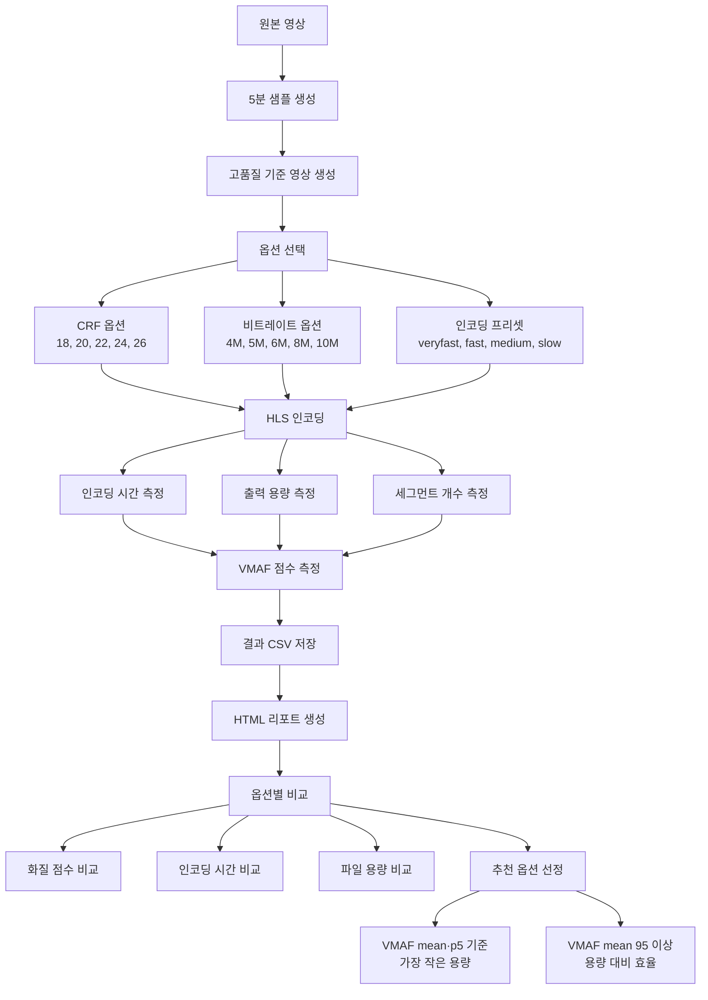
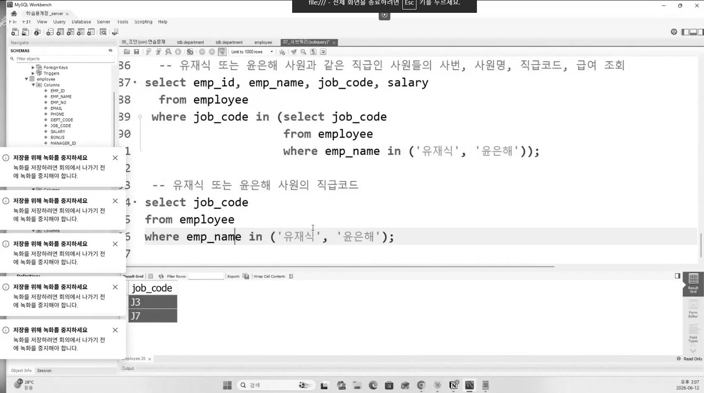

# FFmpeg 

> FFmpeg is the leading multimedia framework, able to decode, encode, transcode, mux, demux, stream, filter and play pretty much anything that humans and machines have created

> FFmpeg는 인간과 기계가 만들어낸 거의 모든 것을 디코딩/인코딩, 트랜스코딩, 먹스/디먹스, 스트림, 필터링 및 재생할 수 있는 선도적인 멀티미디어 프레임워크입니다.

[FFmpeg about](https://ffmpeg.org/about.html)

동영상 편집에서 FFmpeg는 오픈소스로 이루어진 표준 프로그램입니다. 동영상 관련 프로그램을 만들면 꼭 FFmpeg가 끼게 되더군요.
이번에 만드는 사이트 최적화를 위해 테스트와 벤치마크를 진행했으며, 그 과정을 정리합니다.

# 로컬 테스트
다음 흐름으로 벤치마크 코드를 작성해, CRF 18~26·비트레이트 4M~10M·프리셋 4종 조합(총 40케이스)으로 HLS 인코딩 옵션을 바꿔 가며 출력 용량과 VMAF 점수를 비교해 최적 값을 도출해 봤습니다. 최종 목적은 강좌 공유 사이트에서 PPT로 보여주는 글자가 뭉개지지 않으며 적당히 높은 화질로 HLS 영상을 뽑아내는 것입니다.

## 옵션 
- CRF(Constant Rate Factor): 화질 기준 인코딩 방식으로 압축 품질을 선택할 수 있습니다. 숫자가 낮을수록 화질이 좋고 용량이 커지며, 영상 내용에 따라 비트 수를 조절해 사용합니다. 비트 조절 기준은 픽셀 단위에서 이루어지는 색 변화량에 비례합니다.
    - CRF 18 → 고화질, 큰 용량
    - CRF 22 → 적당한 화질/용량 균형
    - CRF 26 → 낮은 용량, 품질 저하 가능
- 비트레이트(bitrate): 초당 사용할 비트 양을 제한합니다.
- 프리셋(preset): x264 인코더가 얼마나 오래 고민해서 압축할지를 정하는 옵션입니다.
    - veryfast → 빠르게 인코딩, 용량 효율 낮음
    - fast     → 빠른 편, 품질/용량 조금 개선
    - medium   → 기본값, 균형 좋음
    - slow     → 느림, 용량 효율 좋음
    - ※ 같은 비트레이트 기준이면 느린 프리셋이 더 좋은 화질을 나타낼 수 있습니다.
- VMAF: FFmpeg의 옵션이 아닙니다. VMAF는 Netflix가 만든 영상 품질 평가 지표로, 편의상 이를 토대로 점수를 측정했습니다.

이제 아래 흐름의 테스트 코드로 Jitsi로 녹화한 강의 영상을 기준으로 테스트를 돌려 봤습니다.

위 프로세스의 테스트 코드로 값을 도출하면 아래와 같습니다. 전체적으로 시간이 많이 소요된 원인은 VMAF 측정 때문입니다.
컬럼별 특징은 다음과 같습니다.
- mode: 인코딩 방식
- preset: 속도/압축 효율 옵션
- crf_value: crf 인코딩의 화질 기준값
- target_bitrate: bitrate 인코딩의 목표 비트레이트
- encode_seconds: 인코딩 시간(참고 지표. 테스트 PC의 병렬 실행·시스템 부하에 따라 변동될 수 있음)
- total_seconds: 전체 처리 시간(VMAF 측정 포함)
- output_size: 결과 파일 크기
- measured_bitrate: 실제 측정 비트레이트
- vmaf_mean: 평균 품질
- vmaf_p5: 하위 5% 품질
- vmaf_min: 최저 품질

인코딩 시간은 병렬 실행 환경과 시스템 부하에 따라 변동될 수 있으므로, 이번 비교에서는 참고 지표로만 사용하는 것이 좋다고 판단했습니다.
로컬 PC다 보니 변수가 많다고 판단이 들더군요.

최종 판단은 VMAF 평균, VMAF p5, 출력 용량을 중심으로 했습니다.

## 데이터

<table class="bench-table">
<thead><tr><th>mode</th><th>preset</th><th>crf_value</th><th>target_bitrate</th><th>encode_seconds</th><th>total_seconds</th><th>output_size</th><th>measured_bitrate</th><th>vmaf_mean</th><th>vmaf_p5</th><th>vmaf_min</th></tr></thead>
<tbody>
<tr class="bench-crf"><td>crf</td><td>veryfast</td><td>18</td><td></td><td>136.4</td><td>973.1</td><td>41.97 MB</td><td>1,173,066 bps</td><td>95.916</td><td>95.2646</td><td>87.1316</td></tr>
<tr class="bench-crf"><td>crf</td><td>veryfast</td><td>20</td><td></td><td>137.0</td><td>969.0</td><td>33.94 MB</td><td>949,010 bps</td><td>95.4192</td><td>94.4778</td><td>87.5633</td></tr>
<tr class="bench-crf"><td>crf</td><td>veryfast</td><td>22</td><td></td><td>136.6</td><td>977.9</td><td>27.55 MB</td><td>770,355 bps</td><td>94.804</td><td>93.5671</td><td>87.8429</td></tr>
<tr class="bench-crf"><td>crf</td><td>veryfast</td><td>24</td><td></td><td>137.2</td><td>971.2</td><td>22.72 MB</td><td>635,195 bps</td><td>94.0202</td><td>92.4681</td><td>86.7679</td></tr>
<tr class="bench-crf"><td>crf</td><td>veryfast</td><td>26</td><td></td><td>136.6</td><td>969.1</td><td>18.89 MB</td><td>528,247 bps</td><td>93.0715</td><td>91.063</td><td>85.4895</td></tr>
<tr class="bench-bitrate bench-mode-start"><td>bitrate</td><td>veryfast</td><td></td><td>4M</td><td>145.0</td><td>1,002.5</td><td>120.30 MB</td><td>3,363,767 bps</td><td>97.1068</td><td>96.6758</td><td>87.4941</td></tr>
<tr class="bench-bitrate"><td>bitrate</td><td>veryfast</td><td></td><td>5M</td><td>130.5</td><td>950.8</td><td>143.54 MB</td><td>4,013,489 bps</td><td>97.2182</td><td>96.8788</td><td>86.6481</td></tr>
<tr class="bench-bitrate"><td>bitrate</td><td>veryfast</td><td></td><td>6M</td><td>129.8</td><td>950.5</td><td>161.76 MB</td><td>4,522,577 bps</td><td>97.278</td><td>96.993</td><td>86.8844</td></tr>
<tr class="bench-bitrate"><td>bitrate</td><td>veryfast</td><td></td><td>8M</td><td>131.4</td><td>948.9</td><td>188.04 MB</td><td>5,257,395 bps</td><td>97.3376</td><td>97.1369</td><td>86.261</td></tr>
<tr class="bench-bitrate"><td>bitrate</td><td>veryfast</td><td></td><td>10M</td><td>133.3</td><td>956.3</td><td>196.97 MB</td><td>5,507,232 bps</td><td>97.3626</td><td>97.2196</td><td>85.9719</td></tr>
<tr class="bench-crf bench-mode-start"><td>crf</td><td>fast</td><td>18</td><td></td><td>139.4</td><td>943.0</td><td>53.46 MB</td><td>1,494,516 bps</td><td>96.7741</td><td>96.5057</td><td>85.9342</td></tr>
<tr class="bench-crf"><td>crf</td><td>fast</td><td>20</td><td></td><td>123.7</td><td>948.6</td><td>42.91 MB</td><td>1,199,624 bps</td><td>96.4961</td><td>96.0678</td><td>86.0927</td></tr>
<tr class="bench-crf"><td>crf</td><td>fast</td><td>22</td><td></td><td>146.5</td><td>957.7</td><td>34.93 MB</td><td>976,696 bps</td><td>96.0943</td><td>95.4819</td><td>86.2577</td></tr>
<tr class="bench-crf"><td>crf</td><td>fast</td><td>24</td><td></td><td>144.2</td><td>961.0</td><td>28.65 MB</td><td>801,058 bps</td><td>95.66</td><td>94.7476</td><td>86.9226</td></tr>
<tr class="bench-crf"><td>crf</td><td>fast</td><td>26</td><td></td><td>143.9</td><td>952.8</td><td>23.81 MB</td><td>665,763 bps</td><td>95.0709</td><td>93.7191</td><td>87.6512</td></tr>
<tr class="bench-bitrate bench-mode-start"><td>bitrate</td><td>fast</td><td></td><td>4M</td><td>168.5</td><td>990.2</td><td>119.44 MB</td><td>3,339,445 bps</td><td>97.2453</td><td>96.9265</td><td>87.082</td></tr>
<tr class="bench-bitrate"><td>bitrate</td><td>fast</td><td></td><td>5M</td><td>166.3</td><td>986.9</td><td>134.95 MB</td><td>3,772,725 bps</td><td>97.3048</td><td>97.0381</td><td>86.2122</td></tr>
<tr class="bench-bitrate"><td>bitrate</td><td>fast</td><td></td><td>6M</td><td>153.8</td><td>992.5</td><td>145.98 MB</td><td>4,081,517 bps</td><td>97.343</td><td>97.1178</td><td>85.7265</td></tr>
<tr class="bench-bitrate"><td>bitrate</td><td>fast</td><td></td><td>8M</td><td>159.6</td><td>1,004.6</td><td>161.52 MB</td><td>4,515,925 bps</td><td>97.3817</td><td>97.2271</td><td>85.6859</td></tr>
<tr class="bench-bitrate"><td>bitrate</td><td>fast</td><td></td><td>10M</td><td>169.5</td><td>1,013.7</td><td>170.84 MB</td><td>4,776,514 bps</td><td>97.4009</td><td>97.2985</td><td>85.6429</td></tr>
<tr class="bench-crf bench-mode-start"><td>crf</td><td>medium</td><td>18</td><td></td><td>161.7</td><td>988.8</td><td>56.88 MB</td><td>1,590,215 bps</td><td>96.8498</td><td>96.6205</td><td>85.8193</td></tr>
<tr class="bench-crf"><td>crf</td><td>medium</td><td>20</td><td></td><td>161.7</td><td>971.4</td><td>45.58 MB</td><td>1,274,350 bps</td><td>96.5871</td><td>96.2419</td><td>85.9814</td></tr>
<tr class="bench-crf"><td>crf</td><td>medium</td><td>22</td><td></td><td>158.4</td><td>975.5</td><td>36.85 MB</td><td>1,030,287 bps</td><td>96.264</td><td>95.7546</td><td>86.143</td></tr>
<tr class="bench-crf"><td>crf</td><td>medium</td><td>24</td><td></td><td>140.9</td><td>971.9</td><td>30.18 MB</td><td>843,782 bps</td><td>95.8536</td><td>95.0984</td><td>86.6804</td></tr>
<tr class="bench-crf"><td>crf</td><td>medium</td><td>26</td><td></td><td>138.1</td><td>991.5</td><td>25.02 MB</td><td>699,329 bps</td><td>95.3291</td><td>94.2866</td><td>87.4335</td></tr>
<tr class="bench-bitrate bench-mode-start"><td>bitrate</td><td>medium</td><td></td><td>4M</td><td>205.3</td><td>1,031.3</td><td>120.51 MB</td><td>3,369,406 bps</td><td>97.2842</td><td>97.0156</td><td>87.1076</td></tr>
<tr class="bench-bitrate"><td>bitrate</td><td>medium</td><td></td><td>5M</td><td>214.1</td><td>1,033.8</td><td>135.75 MB</td><td>3,795,327 bps</td><td>97.3345</td><td>97.1194</td><td>86.1957</td></tr>
<tr class="bench-bitrate"><td>bitrate</td><td>medium</td><td></td><td>6M</td><td>219.6</td><td>1,043.1</td><td>146.32 MB</td><td>4,090,826 bps</td><td>97.3669</td><td>97.2008</td><td>85.7986</td></tr>
<tr class="bench-bitrate"><td>bitrate</td><td>medium</td><td></td><td>8M</td><td>217.8</td><td>1,043.4</td><td>161.49 MB</td><td>4,515,022 bps</td><td>97.3978</td><td>97.2969</td><td>85.6782</td></tr>
<tr class="bench-bitrate"><td>bitrate</td><td>medium</td><td></td><td>10M</td><td>204.5</td><td>1,031.7</td><td>170.32 MB</td><td>4,761,776 bps</td><td>97.4128</td><td>97.3563</td><td>85.6202</td></tr>
<tr class="bench-crf bench-mode-start"><td>crf</td><td>slow</td><td>18</td><td></td><td>123.2</td><td>1,002.2</td><td>58.77 MB</td><td>1,643,090 bps</td><td>96.9052</td><td>96.6692</td><td>85.7663</td></tr>
<tr class="bench-crf"><td>crf</td><td>slow</td><td>20</td><td></td><td>199.4</td><td>1,018.4</td><td>47.47 MB</td><td>1,327,204 bps</td><td>96.6719</td><td>96.331</td><td>86.0551</td></tr>
<tr class="bench-crf"><td>crf</td><td>slow</td><td>22</td><td></td><td>194.3</td><td>1,008.4</td><td>38.35 MB</td><td>1,072,355 bps</td><td>96.363</td><td>95.9045</td><td>86.1877</td></tr>
<tr class="bench-crf"><td>crf</td><td>slow</td><td>24</td><td></td><td>185.1</td><td>1,003.1</td><td>31.35 MB</td><td>876,415 bps</td><td>95.9779</td><td>95.2382</td><td>86.6933</td></tr>
<tr class="bench-crf"><td>crf</td><td>slow</td><td>26</td><td></td><td>181.5</td><td>991.2</td><td>25.91 MB</td><td>724,473 bps</td><td>95.4791</td><td>94.5503</td><td>87.7418</td></tr>
<tr class="bench-bitrate bench-mode-start"><td>bitrate</td><td>slow</td><td></td><td>4M</td><td>204.8</td><td>1,051.4</td><td>119.93 MB</td><td>3,353,010 bps</td><td>97.2915</td><td>97.0247</td><td>87.1576</td></tr>
<tr class="bench-bitrate"><td>bitrate</td><td>slow</td><td></td><td>5M</td><td>130.7</td><td>902.4</td><td>135.27 MB</td><td>3,781,923 bps</td><td>97.3449</td><td>97.1384</td><td>86.1405</td></tr>
<tr class="bench-bitrate"><td>bitrate</td><td>slow</td><td></td><td>6M</td><td>177.5</td><td>891.0</td><td>145.62 MB</td><td>4,071,401 bps</td><td>97.3767</td><td>97.2007</td><td>85.7874</td></tr>
<tr class="bench-bitrate"><td>bitrate</td><td>slow</td><td></td><td>8M</td><td>180.5</td><td>892.9</td><td>161.70 MB</td><td>4,520,882 bps</td><td>97.406</td><td>97.3117</td><td>85.7257</td></tr>
<tr class="bench-bitrate"><td>bitrate</td><td>slow</td><td></td><td>10M</td><td>181.3</td><td>895.9</td><td>170.99 MB</td><td>4,780,564 bps</td><td>97.4193</td><td>97.3684</td><td>85.6088</td></tr>
</tbody></table>

표는 5행마다 mode가 바뀌도록 묶었습니다. 파란 배경은 `crf`, 주황 배경은 `bitrate`이며, 각 묶음 시작 행에는 구분선을 넣었습니다.

VMAF 평균, VMAF p5, 출력 용량을 기준으로 보면 다음과 같습니다.
- CRF가 bitrate보다 효율적으로 보입니다. bitrate에 용량을 더 줘도 점수가 크게 오르지 않는 모습이지만, 용량은 비례하여 올라가는 것을 확인할 수 있습니다.
- CRF 영상의 용량이 품질 점수 대비 매우 효율적이고, mean·p5 차이도 크게 발생하지 않고 있습니다. Bitrate는 이번 비교 범위에서 배제해도 되겠습니다.
| 설정              | 파일 크기 | measured bitrate | VMAF mean | VMAF p5 |
| --------------- | --------: | ---------------: | --------: | ------: |
| CRF fast 22     | 34.93 MB | 976,696 bps (0.98 Mbps) | 96.0943 | 95.4819 |
| CRF medium 22   | 36.85 MB | 1,030,287 bps (1.03 Mbps) | 96.2640 | 95.7546 |
| CRF slow 22     | 38.35 MB | 1,072,355 bps (1.07 Mbps) | 96.3630 | 95.9045 |
| Bitrate fast 4M | 119.44 MB | 3,339,445 bps (3.34 Mbps) | 97.2453 | 96.9265 |
- veryfast 프리셋은 CRF에서 품질 손실이 크게 발생하는 것을 볼 수 있습니다. (CRF 22 기준)
| preset   |  파일 크기 | VMAF mean | VMAF p5 |
| -------- | -----: | --------: | ------: |
| veryfast | 27.6 MB |   94.8040 | 93.5671 |
| fast     | 34.9 MB |   96.0943 | 95.4819 |
| medium   | 36.8 MB |   96.2640 | 95.7546 |
| slow     | 38.4 MB |   96.3630 | 95.9045 |
- fast → medium → slow로 갈수록 mean·p5는 소폭 상승하지만, 용량 증가 대비 이득이 크지 않아 보입니다. (CRF 22 기준)
| preset | VMAF mean | VMAF p5 | 파일 크기 |
| ------ | --------: | ------: | -----: |
| fast   |   96.0943 | 95.4819 | 34.9 MB |
| medium |   96.2640 | 95.7546 | 36.8 MB |
| slow   |   96.3630 | 95.9045 | 38.4 MB |

## 로컬 테스트 결론

VMAF mean, VMAF p5, 출력 용량을 중심으로 정리하면 아래 옵션이 타당해 보입니다. 
30분, 1시간 예상 용량은 5분 샘플 결과를 선형 확대한 값입니다.
| 목적 | 추천 설정 | 30분 예상 용량 | 1시간 예상 용량 | VMAF mean | VMAF p5 |
| ----- | ------------------- | --------: | --------: | --------: | ------: |
| 균형 추천 | `crf medium 22` | 약 221 MB | 약 442 MB | 96.2640 | 95.7546 |
| fast 프리셋 대안 | `crf fast 22` | 약 210 MB | 약 419 MB | 96.0943 | 95.4819 |
| 용량 우선 | `crf medium 26` | 약 150 MB | 약 300 MB | 95.3291 | 94.2866 |
| 고품질 | `crf medium 20` | 약 273 MB | 약 547 MB | 96.5871 | 96.2419 |

# 집중 테스트

위 테스트에서 CRF와 고정 비트레이트를 비교했고, 그 결과 비트레이트의 효율이 낮다고 정의를 내렸습니다.
이제 덜어낼 건 덜어내고 아래 옵션들을 적용해 봅시다.

아래 옵션을 실사용 후보군으로 보고 집중 테스트해 봅시다.
- preset = fast, medium
- crf = 20, 22, 24, 26

이들에 대해 벤치마크를 세 번 더 돌려 평균 값을 도출하면 다음과 같습니다.
| preset | crf | avg_output_mib | avg_measured_mbps | avg_vmaf_mean | avg_vmaf_p5 |
| --- | --- | --- | --- | --- | --- | --- |
| fast | 20 | 42.91 | 1.2 | 96.4961 | 96.0678 | 
| fast | 22 | 34.93 | 0.977 | 96.0943 | 95.4819 |
| fast | 24 | 28.65 | 0.801 | 95.66 | 94.7476 |
| fast | 26 | 23.81 | 0.666 | 95.0709 | 93.7191 |
| medium | 20 | 45.58 | 1.274 | 96.5871 | 96.2419 |
| medium | 22 | 36.85 | 1.03 | 96.264 | 95.7546 |
| medium | 24 | 30.18 | 0.844 | 95.8536 | 95.0984 |
| medium | 26 | 25.01 | 0.699 | 95.3291 | 94.2866 |

crf 값에 따라 vmaf 점수도 마찬가지로 내려갔지만, 평균값이 전부 93점 이상을 기록하는 것을 보면 품질이 괜찮게 나오는 것을 알 수 있습니다.
수치만 보면 fast보다 미세하게 medium이 나은 점도 확인할 수 있습니다. 용량을 아끼기 위해 crf는 22~26으로 가정하고,
품질 안정성도 고려해 medium이 좋을 것 같습니다.

실제 영상의 캡처본을 보면 품질이 가장 안 좋은 fast crf 26이 아래 사진입니다. 
이를 보아도 글자가 제대로 표시되죠.

다른 영상들도 눈으로는 차이를 체감하기 어려웠습니다. vmaf 1~2점 차이는 눈에 띄는 화질 차이로 이어지지 않는 것으로 느껴졌습니다.

# EC2 테스트 
최종적으로는 medium 24로 택하였고, 배포 환경에서 옵션을 다음과 같이 바꿨습니다.

| 항목 | 수정 전 | 수정 후 | 변경 이유 |
| --- | --- | --- | --- |
| 비디오 코덱 | `libx264` | `libx264` | H.264 기반 HLS 호환성을 유지 |
| 해상도 제한 | `scale='min(1920,iw)':-2` | `scale='min(1920,iw)':-2` | 원본이 1920보다 크면 1080p급 너비로 제한하고, 비율 유지 |
| 프리셋 | `medium` | `medium` | 벤치마크에서 품질 안정성과 압축 효율의 균형이 좋았음 |
| CRF | `22` | `24` | VMAF 평균 95 이상을 유지하면서 용량을 줄이기 위해 조정 |
| Maxrate | `5M` | `3M` | CRF 24 구간 실측 비트레이트에 맞춰 비트레이트 상한을 조정 |
| Bufsize | `10M` | `6M` | maxrate의 2배 버퍼를 유지해 순간 비트레이트 변동을 완충 |
| 오디오 코덱 | `aac` | `aac` | HLS 호환성을 위해 유지 |
| 오디오 비트레이트 | `128k` | `128k` | 일반적인 스트리밍 음질 기준 유지 |
| 세그먼트 길이 | `10초` | `10초` | 기존 서비스 재생 구조와 캐싱 정책 유지 |
| HLS 타입 | `vod` | `vod` | VOD용 정적 플레이리스트 생성 |

이를 토대로 같은 영상을 배포 환경에서 S3를 이용해 배포해 보니,  
기존 세팅은 636s가 소요되었고 새로 바뀐 세팅은 622s로 미세하게 줄었습니다.  
이는 CPU 상황에 따라 달라질 수 있는 수준이라, 사실상 큰 의미는 없었습니다.

저장 공간도 74.8MB에서 73.8MB로 미세하게 줄었습니다.  
아마 기존 세팅과 거의 유사했기에 이런 결과가 나왔습니다. 
다만 리소스로 사용된 영상의 길이가 20분이어서 차이가 작게 보였을 뿐이며 분명한 개선이 발생했다는 점이 중요하죠.
