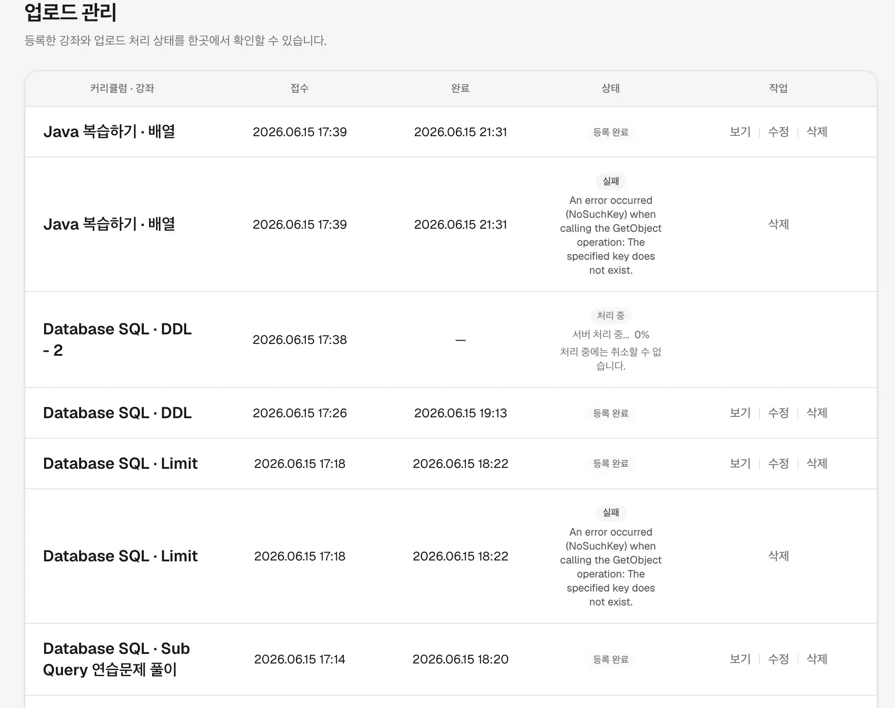

IP로 학원에 배포하며 테스트를 진행하던 중, 업로드 과정에서 다음과 같은 버그가 발생한 것을 확인했습니다.


Job 테이블 데이터를 확인해 보니, 다음처럼 `status`는 `failed`이지만 `completed_at` 값이 존재하는 서비스 프로세스 상에서 예상했던 데이터 상태가 아니었습니다.
`completed_at` 값이 있다면 `status`는 `completed`여야 했습니다.
```sql
                  id                  |   status   |       course_name       |                                             error_message                                   |          created_at           |          updated_at           |         completed_at          
--------------------------------------+------------+-------------------------+-------------------------------------------------------------------------------------------------------+-------------------------------+-------------------------------+-------------------------------
 29fc0ec8-8f54-43fc-8dc9-2c92d0e877e0 | failed     | 배열                    | An error occurred (NoSuchKey) when calling the GetObject operation: The specified key does not exist. | 2026-06-15 08:39:37.532818+00 | 2026-06-15 14:32:11.78985+00  | 2026-06-15 12:31:10.671766+00
 0e460663-1de7-4813-a128-5895d3265d70 | processing | DDL - 2                 |                                   | 2026-06-15 08:38:17.577126+00 | 2026-06-15 12:31:10.869183+00 | 
 76dcdfc5-54a6-46da-88c8-093ec68b34f6 | completed  | DDL                     |                                   | 2026-06-15 08:26:43.584661+00 | 2026-06-15 10:13:57.687732+00 | 2026-06-15 10:13:57.687653+00
 3eff8d62-19cb-4de4-a282-127bc4b3130f | failed     | Limit                   | An error occurred (NoSuchKey) when calling the GetObject operation: The specified key does not exist. | 2026-06-15 08:18:12.511962+00 | 2026-06-15 14:32:11.914926+00 | 2026-06-15 09:22:42.636486+00
 da51db02-dec2-4c48-98eb-3f1ce814360a | completed  | Sub Query 연습문제 풀이 |                                   | 2026-06-15 08:14:15.792211+00 | 2026-06-15 09:20:24.200712+00 | 2026-06-15 09:20:24.200621+00
 7274d1d0-cb3b-4968-b2be-b1a3fecadc81 | completed  | test                    |                                   | 2026-06-13 13:14:25.077061+00 | 2026-06-13 13:24:46.968948+00 | 2026-06-13 13:24:46.968876+00
 174733b5-1daf-45a1-8917-418512249c99 | completed  | 업로드 테스트           |                                   | 2026-06-13 12:54:14.423268+00 | 2026-06-13 13:04:50.440667+00 | 2026-06-13 13:04:50.440582+00
 42c62df1-1a68-4df5-8596-a2ef0cc83987 | completed  | Sub Query               |                                   | 2026-06-12 07:21:23.330349+00 | 2026-06-12 08:02:24.979543+00 | 2026-06-12 08:02:24.979464+00
 c63f7271-8b41-4524-a91b-f8838b25aec5 | completed  | Join                    |                                   | 2026-06-12 03:16:45.313736+00 | 2026-06-12 04:16:24.737723+00 | 2026-06-12 04:16:24.737644+00
 75341055-d81f-418b-98ef-8d8dd33ddc19 | completed  | 반복문                  |                                   | 2026-06-11 06:58:51.113466+00 | 2026-06-11 07:25:07.850604+00 | 2026-06-11 07:25:07.850508+00
```

# 문제 1: status와 completed_at 조합

Celery가 실패 시 `run_publish_job`을 재시도하도록 다음처럼 코드가 되어 있으므로, 이와 관련된 버그로 방향을 잡았습니다.
```python
@shared_task(bind=True, max_retries=2, default_retry_delay=30, queue="encode")
def publish_course_task(self, job_id: str) -> None:
    from media.services.publish_worker import run_publish_job

    try:
        run_publish_job(UUID(job_id))
    except PublishJob.DoesNotExist as exc:
        ...
```    
확실한 에러 분석을 위해 로그 파일을 확인했습니다.
```bash
celery-1  | [2026-06-15 17:18:12,517: INFO/MainProcess] Task media.tasks.publish_course_task[3eff8d62-19cb-4de4-a282-127bc4b3130f] received
celery-1  | [2026-06-15 18:20:24,317: INFO/MainProcess] Task media.tasks.publish_course_task[3eff8d62-19cb-4de4-a282-127bc4b3130f] received
celery-1  | {"timestamp": "2026-06-15T18:20:24.326794+09:00", "level": "INFO", "logger": "media.publish", "message": "Publish job started", "event": "publish_job_started", "job_id": "3eff8d62-19cb-4de4-a282-127bc4b3130f", "user_id": 2, "email": "seungryeol156@gmail.com", "staging_dir": "staging/3eff8d62-19cb-4de4-a282-127bc4b3130f"}
celery-1  | {"timestamp": "2026-06-15T18:20:24.508392+09:00", "level": "INFO", "logger": "media.publish", "message": "Staged inputs prepared", "event": "staging_prepare_completed", "job_id": "3eff8d62-19cb-4de4-a282-127bc4b3130f", "video_count": 1, "thumbnail_count": 0, "staging_dir": "staging/3eff8d62-19cb-4de4-a282-127bc4b3130f"}
celery-1  | {"timestamp": "2026-06-15T18:22:39.790782+09:00", "level": "INFO", "logger": "media.publish", "message": "Thumbnail saved", "event": "thumbnail_saved", "job_id": "3eff8d62-19cb-4de4-a282-127bc4b3130f", "user_id": 2, "video_index": 0, "thumbnail_source": "frame", "thumbnail_url": "https://dlh1oeztsgsz1.cloudfront.net/thumbnails/2026/06/15/ee3054e6c9d740e8b5150af8854b7e15.webp"}
celery-1  | {"timestamp": "2026-06-15T18:22:39.792062+09:00", "level": "INFO", "logger": "media.storage", "message": "HLS upload started", "event": "hls_upload_started", "job_id": "3eff8d62-19cb-4de4-a282-127bc4b3130f", "s3_prefix": "hls/2026/06/15/e4e7fa07c90e402fbb5aacd929aee16d", "use_s3": true, "file_count": 36, "total_bytes": 12472171}
celery-1  | {"timestamp": "2026-06-15T18:22:42.630271+09:00", "level": "INFO", "logger": "media.storage", "message": "HLS upload completed", "event": "hls_upload_completed", "job_id": "3eff8d62-19cb-4de4-a282-127bc4b3130f", "s3_prefix": "hls/2026/06/15/e4e7fa07c90e402fbb5aacd929aee16d", "use_s3": true, "file_count": 36, "total_bytes": 12472171, "duration_ms": 2838}
celery-1  | {"timestamp": "2026-06-15T18:22:42.639548+09:00", "level": "INFO", "logger": "media.publish", "message": "Publish job completed", "event": "publish_job_completed", "job_id": "3eff8d62-19cb-4de4-a282-127bc4b3130f", "user_id": 2, "email": "seungryeol156@gmail.com", "course_id": 24, "duration_ms": 138321}
celery-1  | [2026-06-15 18:22:42,732: INFO/ForkPoolWorker-1] Task media.tasks.publish_course_task[3eff8d62-19cb-4de4-a282-127bc4b3130f] succeeded in 138.41680589399766s: None
celery-1  | [2026-06-15 19:20:34,143: INFO/MainProcess] Task media.tasks.publish_course_task[3eff8d62-19cb-4de4-a282-127bc4b3130f] received
celery-1  | [2026-06-15 20:20:34,729: INFO/MainProcess] Task media.tasks.publish_course_task[3eff8d62-19cb-4de4-a282-127bc4b3130f] received
celery-1  | [2026-06-15 21:20:35,357: INFO/MainProcess] Task media.tasks.publish_course_task[3eff8d62-19cb-4de4-a282-127bc4b3130f] received
celery-1  | {"timestamp": "2026-06-15T21:31:10.801677+09:00", "level": "INFO", "logger": "media.publish", "message": "Publish job started", "event": "publish_job_started", "job_id": "3eff8d62-19cb-4de4-a282-127bc4b3130f", "user_id": 2, "email": "seungryeol156@gmail.com", "staging_dir": "staging/3eff8d62-19cb-4de4-a282-127bc4b3130f"}
celery-1  | {"timestamp": "2026-06-15T21:31:10.838364+09:00", "level": "ERROR", "logger": "media.storage", "message": "Failed to read json key", "event": "storage_read_failed", "job_id": "3eff8d62-19cb-4de4-a282-127bc4b3130f", "key": "staging/3eff8d62-19cb-4de4-a282-127bc4b3130f/manifest.json", "bucket": "class-s3-bucket-devseung7", "use_s3": true, "error_type": "NoSuchKey", "exception": "Traceback (most recent call last):\n  File \"/app/media/services/storage.py\", line 244, in read_json_key\n    resp = _s3_client().get_object(Bucket=_bucket(), Key=key)\n  File \"/usr/local/lib/python3.13/site-packages/botocore/client.py\", line 606, in _api_call\n    return self._make_api_call(operation_name, kwargs)\n           ~~~~~~~~~~~~~~~~~~~^^^^^^^^^^^^^^^^^^^^^^^^\n  File \"/usr/local/lib/python3.13/site-packages/botocore/context.py\", line 123, in wrapper\n    return func(*args, **kwargs)\n  File \"/usr/local/lib/python3.13/site-packages/botocore/client.py\", line 1094, in _make_api_call\n    raise error_class(parsed_response, operation_name)\nbotocore.errorfactory.NoSuchKey: An error occurred (NoSuchKey) when calling the GetObject operation: The specified key does not exist."}
celery-1  | {"timestamp": "2026-06-15T21:31:10.844181+09:00", "level": "ERROR", "logger": "media.publish", "message": "Publish job failed", "event": "publish_job_failed", "job_id": "3eff8d62-19cb-4de4-a282-127bc4b3130f", "user_id": 2, "email": "seungryeol156@gmail.com", "error_type": "NoSuchKey", "exception": "Traceback (most recent call last):\n  File \"/app/media/services/publish_worker.py\", line 171, in run_publish_job\n    manifest = load_manifest(prefix)\n  File \"/app/media/services/staging.py\", line 105, in load_manifest\n    manifest = read_json_key(key=_manifest_key(staging_prefix))\n  File \"/app/media/services/storage.py\", line 244, in read_json_key\n    resp = _s3_client().get_object(Bucket=_bucket(), Key=key)\n  File \"/usr/local/lib/python3.13/site-packages/botocore/client.py\", line 606, in _api_call\n    return self._make_api_call(operation_name, kwargs)\n           ~~~~~~~~~~~~~~~~~~~^^^^^^^^^^^^^^^^^^^^^^^^\n  File \"/usr/local/lib/python3.13/site-packages/botocore/context.py\", line 123, in wrapper\n    return func(*args, **kwargs)\n  File \"/usr/local/lib/python3.13/site-packages/botocore/client.py\", line 1094, in _make_api_call\n    raise error_class(parsed_response, operation_name)\nbotocore.errorfactory.NoSuchKey: An error occurred (NoSuchKey) when calling the GetObject operation: The specified key does not exist."}
celery-1  | {"timestamp": "2026-06-15T21:31:10.847119+09:00", "level": "WARNING", "logger": "media.publish", "message": "Celery will retry publish task", "event": "publish_task_retry", "job_id": "3eff8d62-19cb-4de4-a282-127bc4b3130f", "error_type": "NoSuchKey", "task_name": "media.tasks.publish_course_task", "attempt": 1, "max_retries": 2}
celery-1  | [2026-06-15 21:31:10,854: INFO/MainProcess] Task media.tasks.publish_course_task[3eff8d62-19cb-4de4-a282-127bc4b3130f] received
celery-1  | [2026-06-15 21:31:10,856: INFO/ForkPoolWorker-2] Task media.tasks.publish_course_task[3eff8d62-19cb-4de4-a282-127bc4b3130f] retry: Retry in 30s: NoSuchKey('An error occurred (NoSuchKey) when calling the GetObject operation: The specified key does not exist.')
celery-1  | [2026-06-15 22:32:16,202: INFO/MainProcess] Task media.tasks.publish_course_task[3eff8d62-19cb-4de4-a282-127bc4b3130f] received
celery-1  | {"timestamp": "2026-06-15T23:31:11.232661+09:00", "level": "INFO", "logger": "media.publish", "message": "Publish job started", "event": "publish_job_started", "job_id": "3eff8d62-19cb-4de4-a282-127bc4b3130f", "user_id": 2, "email": "seungryeol156@gmail.com", "staging_dir": "staging/3eff8d62-19cb-4de4-a282-127bc4b3130f"}
celery-1  | {"timestamp": "2026-06-15T23:31:11.283739+09:00", "level": "ERROR", "logger": "media.storage", "message": "Failed to read json key", "event": "storage_read_failed", "job_id": "3eff8d62-19cb-4de4-a282-127bc4b3130f", "key": "staging/3eff8d62-19cb-4de4-a282-127bc4b3130f/manifest.json", "bucket": "class-s3-bucket-devseung7", "use_s3": true, "error_type": "NoSuchKey", "exception": "Traceback (most recent call last):\n  File \"/app/media/services/storage.py\", line 244, in read_json_key\n    resp = _s3_client().get_object(Bucket=_bucket(), Key=key)\n  File \"/usr/local/lib/python3.13/site-packages/botocore/client.py\", line 606, in _api_call\n    return self._make_api_call(operation_name, kwargs)\n           ~~~~~~~~~~~~~~~~~~~^^^^^^^^^^^^^^^^^^^^^^^^\n  File \"/usr/local/lib/python3.13/site-packages/botocore/context.py\", line 123, in wrapper\n    return func(*args, **kwargs)\n  File \"/usr/local/lib/python3.13/site-packages/botocore/client.py\", line 1094, in _make_api_call\n    raise error_class(parsed_response, operation_name)\nbotocore.errorfactory.NoSuchKey: An error occurred (NoSuchKey) when calling the GetObject operation: The specified key does not exist."}
celery-1  | {"timestamp": "2026-06-15T23:31:11.288211+09:00", "level": "ERROR", "logger": "media.publish", "message": "Publish job failed", "event": "publish_job_failed", "job_id": "3eff8d62-19cb-4de4-a282-127bc4b3130f", "user_id": 2, "email": "seungryeol156@gmail.com", "error_type": "NoSuchKey", "exception": "Traceback (most recent call last):\n  File \"/app/media/services/publish_worker.py\", line 171, in run_publish_job\n    manifest = load_manifest(prefix)\n  File \"/app/media/services/staging.py\", line 105, in load_manifest\n    manifest = read_json_key(key=_manifest_key(staging_prefix))\n  File \"/app/media/services/storage.py\", line 244, in read_json_key\n    resp = _s3_client().get_object(Bucket=_bucket(), Key=key)\n  File \"/usr/local/lib/python3.13/site-packages/botocore/client.py\", line 606, in _api_call\n    return self._make_api_call(operation_name, kwargs)\n           ~~~~~~~~~~~~~~~~~~~^^^^^^^^^^^^^^^^^^^^^^^^\n  File \"/usr/local/lib/python3.13/site-packages/botocore/context.py\", line 123, in wrapper\n    return func(*args, **kwargs)\n  File \"/usr/local/lib/python3.13/site-packages/botocore/client.py\", line 1094, in _make_api_call\n    raise error_class(parsed_response, operation_name)\nbotocore.errorfactory.NoSuchKey: An error occurred (NoSuchKey) when calling the GetObject operation: The specified key does not exist."}
celery-1  | {"timestamp": "2026-06-15T23:31:11.290839+09:00", "level": "WARNING", "logger": "media.publish", "message": "Celery will retry publish task", "event": "publish_task_retry", "job_id": "3eff8d62-19cb-4de4-a282-127bc4b3130f", "error_type": "NoSuchKey", "task_name": "media.tasks.publish_course_task", "attempt": 1, "max_retries": 2}
celery-1  | [2026-06-15 23:31:11,292: INFO/MainProcess] Task media.tasks.publish_course_task[3eff8d62-19cb-4de4-a282-127bc4b3130f] received
celery-1  | [2026-06-15 23:31:11,294: INFO/ForkPoolWorker-3] Task media.tasks.publish_course_task[3eff8d62-19cb-4de4-a282-127bc4b3130f] retry: Retry in 30s: NoSuchKey('An error occurred (NoSuchKey) when calling the GetObject operation: The specified key does not exist.')
celery-1  | {"timestamp": "2026-06-15T23:31:11.388251+09:00", "level": "INFO", "logger": "media.publish", "message": "Publish job started", "event": "publish_job_started", "job_id": "3eff8d62-19cb-4de4-a282-127bc4b3130f", "user_id": 2, "email": "seungryeol156@gmail.com", "staging_dir": "staging/3eff8d62-19cb-4de4-a282-127bc4b3130f"}
celery-1  | {"timestamp": "2026-06-15T23:31:11.440223+09:00", "level": "ERROR", "logger": "media.storage", "message": "Failed to read json key", "event": "storage_read_failed", "job_id": "3eff8d62-19cb-4de4-a282-127bc4b3130f", "key": "staging/3eff8d62-19cb-4de4-a282-127bc4b3130f/manifest.json", "bucket": "class-s3-bucket-devseung7", "use_s3": true, "error_type": "NoSuchKey", "exception": "Traceback (most recent call last):\n  File \"/app/media/services/storage.py\", line 244, in read_json_key\n    resp = _s3_client().get_object(Bucket=_bucket(), Key=key)\n  File \"/usr/local/lib/python3.13/site-packages/botocore/client.py\", line 606, in _api_call\n    return self._make_api_call(operation_name, kwargs)\n           ~~~~~~~~~~~~~~~~~~~^^^^^^^^^^^^^^^^^^^^^^^^\n  File \"/usr/local/lib/python3.13/site-packages/botocore/context.py\", line 123, in wrapper\n    return func(*args, **kwargs)\n  File \"/usr/local/lib/python3.13/site-packages/botocore/client.py\", line 1094, in _make_api_call\n    raise error_class(parsed_response, operation_name)\nbotocore.errorfactory.NoSuchKey: An error occurred (NoSuchKey) when calling the GetObject operation: The specified key does not exist."}
...
```
위 로그는 일부만 발췌한 것이며, 로그를 보면 같은 `task_id`로 여러 번 요청이 메시지 브로커에 들어왔고, 워커가 동일한 요청을 여러 번 실행하면서 문제가 발생했습니다.
문제는 프로세스가 정상적으로 끝나면 S3 스테이징의 해당 영상이 이미 삭제된 이후이기 때문에, 이전과 같이 접근하면 `GetObject` 에러가 발생했던 것입니다.
워커가 메시지를 받은 시각을 정리하면 아래와 같습니다.

한 시간 정도의 간격이 발생하는 것을 볼 수 있었습니다. 여기까지 보면 확실한 것은 같은 메시지가 여러 번 적재된다는 점입니다.
| **#** | **시각** | **이전 received와 간격** |
| --- | --- | --- |
| 1 | **17:18:12.517** | — |
| 2 | **18:20:24.317** | +62분 12초 |
| 3 | **19:20:34.143** | +60분 10초 |
| 4 | **20:20:34.729** | +60분 0초 |
| 5 | **21:20:35.357** | +60분 1초 |
| 6 | **21:31:10.854** | +10분 35초 |
| 7 | **22:32:16.202** | +61분 5초 |
| 8 | **23:31:11.292** | +58분 55초 |
| 9 | **23:31:11.449** | +0.16초 |
| 10 | **23:31:11.594** | +0.15초 |
| 11 | **23:31:11.665** | +0.07초 |
| 12 | **23:31:11.741** | +0.08초 |
| 13 | **23:31:41.358** | +30초 |
| 14 | **23:31:41.526** | +0.17초 |
| 15 | **23:31:41.678** | +0.15초 |

백엔드에서 메시지를 적재하는 코드는 강좌 등록 시 한 곳뿐이었습니다. 즉 인프라 설정 문제로 의심이 갔습니다.
```python
        job = PublishJob.objects.create(
            id=job_id,
            user=request.user,
            status=PublishJobStatus.QUEUED,
            staging_dir=prefix,
            course_name=data["name"],
            curriculum_id=data["curriculum"].id,
            curriculum_name=data["curriculum"].name,
        )
        publish_course_task.apply_async(
            args=[str(job.id)],
            task_id=str(job.id),
            queue="encode",
        )

        log_event(
            logger,
            logging.INFO,
            LogEvent.PUBLISH_JOB_QUEUED,
            "Publish job queued",
            **publish_fields(
                job_id=str(job.id),
                user_id=request.user.id,
                email=request.user.email,
                video_count=len(data["videos"]),
                curriculum_id=data["curriculum"].id,
            ),
        )
```

기존 Celery 브로커 설정은 다음과 같았습니다.
```python
CELERY_BROKER_TRANSPORT_OPTIONS = {
    "global_keyprefix": os.environ.get(
        "CELERY_BROKER_KEY_PREFIX",
        "class_s:celery:",
    ),
}
```
여기서 문제는 `visibility_timeout`이 없다는 점이었습니다.
`visibility_timeout`은 워커가 작업을 가져간 뒤 ack하기 전까지 브로커가 그 메시지를 unacked로 유지하는 시간입니다.
이 시간 안에 ack가 오지 않으면 브로커는 메시지가 유실되었다고 판단하고 다시 요청을 보냅니다. 이 설정의 기본값이 1시간이었습니다.
[docs.celery#visibility_timeout](https://docs.celeryq.dev/en/stable/getting-started/backends-and-brokers/redis.html#visibility-timeout)

이 1시간이라는 수치가 위에서 `received`가 여러 번 발생한 시간 차이와 같다는 점을 보면, 원인인 점을 알 수 있었습니다.
하지만 워커가 한 번에 하나만 점유하는데 비슷한 시간대로 여러 번 찍힌 것은 설명이 되지 않았습니다.<br/>

이 지점은 `worker_prefetch_multiplier`가 기본값 4인 점으로 설명이 가능했습니다.
`worker_prefetch_multiplier`는 브로커가 미리 워커에 작업을 적재한 순간부터 `visibility_timeout` 시간이 흐르기 때문에, 위 현상을 설명할 수 있었습니다.
[docs.celery#worker_prefetch_multiplier](https://docs.celeryq.dev/en/stable/userguide/configuration.html#worker-prefetch-multiplier)

## 해결

다음과 같이 설정을 수정했습니다.
- `visibility_timeout`: 4시간
- prefetch: 1개
- task time limit: 4시간 (`visibility_timeout`과 논리적으로 동일하게)

그리고 서비스 로직 측면에서는 다음을 추가해 안정성을 강화했습니다.
- `COMPLETED` 상태를 `FAILED`로 덮어쓰지 않도록 방지
- 추가로 재시도되는 것을 막기 위해, 이미 완료된 작업은 시도하지 않도록 함 (`run_publish_job` 시작 시 `status == COMPLETED`이면 즉시 return)
- `NoSuchKey` 등은 retry 대상에서 제외하고 예외 처리 메시지를 추가함


# 문제 2: 영원히 상태가 처리 중

업로드가 다음 날이 되어도 "처리 중"으로 고정되어 있었습니다.<br/>
하지만 서버 상황을 보면 Celery가 CPU를 거의 점유하지 않아, 인코딩 작업이 진행되지 않는 것을 확인할 수 있었습니다.
```bash
CONTAINER ID   NAME                 CPU %     MEM USAGE / LIMIT     MEM %     NET I/O           BLOCK I/O       PIDS
73640d6083e6   class_s-nginx-1      0.00%     3.156MiB / 7.601GiB   0.04%     1.62GB / 1.6GB    4.1kB / 775MB   3
23677574c8d7   class_s-celery-1     0.06%     145.8MiB / 7.601GiB   1.87%     1.31GB / 677MB    0B / 846MB      2
03d4f9c444c6   class_s-backend-1    0.04%     526.8MiB / 7.601GiB   6.77%     1.59GB / 1.58GB   0B / 7.44MB     5
a4d13fa09ce8   class_s-frontend-1   0.00%     58.67MiB / 7.601GiB   0.75%     3.02MB / 8.95MB   0B / 0B         11
f626fa3a9812   class_s-postgres-1   0.00%     28.59MiB / 7.601GiB   0.37%     11.5MB / 16.4MB   0B / 2.34MB     9
2b252bc54deb   class_s-redis-1      0.41%     3.477MiB / 7.601GiB   0.04%     62.9MB / 47.6MB   4.1kB / 889kB   6
```

즉 `processing` 상태에서 멈췄지만 에러 로그가 발생하지 않는, 의도 밖의 상황이 발생했습니다.<br/>
현재 정황상으로는 다음 로직까지는 실행된 것을 알 수 있었습니다.
```python

# 워커 실행
def run_publish_job(job_id: UUID) -> None:


# 인코딩 작업 전 처리 시작을 알림
job.status = PublishJobStatus.PROCESSINGjob.save(update_fields=["status", "updated_at"])set_publish_progress(    job_id,    progress_percent=0,    current_step="",    step_label="처리 시작...",)
```

로그를 보면 스테이징에 올라가고 인코딩 직전까지만 실행된 것을 확인할 수 있습니다. (여러 번 찍힌 것은 문제 1과 동일한 이슈입니다.)
```
/app/logs/app.log:{"timestamp": "2026-06-15T17:38:17.576518+09:00", "level": "INFO", "logger": "media.publish", "message": "Staging payload saved", "event": "staging_save_completed", "request_id": "47144c7f58c04d8f", "curriculum_id": 7, "video_count": 1, "thumbnail_count": 0, "staging_dir": "staging/0e460663-1de7-4813-a128-5895d3265d70"}
/app/logs/app.log:{"timestamp": "2026-06-15T17:38:17.580829+09:00", "level": "INFO", "logger": "media.publish", "message": "Publish job queued", "event": "publish_job_queued", "request_id": "47144c7f58c04d8f", "job_id": "0e460663-1de7-4813-a128-5895d3265d70", "user_id": 2, "email": "seungryeol156@gmail.com", "curriculum_id": 7, "video_count": 1}
/app/logs/app.log:{"timestamp": "2026-06-15T19:13:57.826072+09:00", "level": "INFO", "logger": "media.publish", "message": "Publish job started", "event": "publish_job_started", "job_id": "0e460663-1de7-4813-a128-5895d3265d70", "user_id": 2, "email": "seungryeol156@gmail.com", "staging_dir": "staging/0e460663-1de7-4813-a128-5895d3265d70"}
/app/logs/app.log:{"timestamp": "2026-06-15T19:13:57.987056+09:00", "level": "INFO", "logger": "media.publish", "message": "Staged inputs prepared", "event": "staging_prepare_completed", "job_id": "0e460663-1de7-4813-a128-5895d3265d70", "video_count": 1, "thumbnail_count": 0, "staging_dir": "staging/0e460663-1de7-4813-a128-5895d3265d70"}
/app/logs/app.log:{"timestamp": "2026-06-15T21:31:10.868951+09:00", "level": "INFO", "logger": "media.publish", "message": "Publish job started", "event": "publish_job_started", "job_id": "0e460663-1de7-4813-a128-5895d3265d70", "user_id": 2, "email": "seungryeol156@gmail.com", "staging_dir": "staging/0e460663-1de7-4813-a128-5895d3265d70"}
/app/logs/app.log:{"timestamp": "2026-06-15T21:31:11.060713+09:00", "level": "INFO", "logger": "media.publish", "message": "Staged inputs prepared", "event": "staging_prepare_completed", "job_id": "0e460663-1de7-4813-a128-5895d3265d70", "video_count": 1, "thumbnail_count": 0, "staging_dir": "staging/0e460663-1de7-4813-a128-5895d3265d70"}
/app/logs/celery.log:{"timestamp": "2026-06-15T17:38:17.576617+09:00", "level": "INFO", "logger": "media.publish", "message": "Staging payload saved", "event": "staging_save_completed", "request_id": "47144c7f58c04d8f", "curriculum_id": 7, "video_count": 1, "thumbnail_count": 0, "staging_dir": "staging/0e460663-1de7-4813-a128-5895d3265d70"}
/app/logs/celery.log:{"timestamp": "2026-06-15T17:38:17.580914+09:00", "level": "INFO", "logger": "media.publish", "message": "Publish job queued", "event": "publish_job_queued", "request_id": "47144c7f58c04d8f", "job_id": "0e460663-1de7-4813-a128-5895d3265d70", "user_id": 2, "email": "seungryeol156@gmail.com", "curriculum_id": 7, "video_count": 1}
/app/logs/celery.log:{"timestamp": "2026-06-15T19:13:57.826186+09:00", "level": "INFO", "logger": "media.publish", "message": "Publish job started", "event": "publish_job_started", "job_id": "0e460663-1de7-4813-a128-5895d3265d70", "user_id": 2, "email": "seungryeol156@gmail.com", "staging_dir": "staging/0e460663-1de7-4813-a128-5895d3265d70"}
/app/logs/celery.log:{"timestamp": "2026-06-15T19:13:57.987138+09:00", "level": "INFO", "logger": "media.publish", "message": "Staged inputs prepared", "event": "staging_prepare_completed", "job_id": "0e460663-1de7-4813-a128-5895d3265d70", "video_count": 1, "thumbnail_count": 0, "staging_dir": "staging/0e460663-1de7-4813-a128-5895d3265d70"}
/app/logs/celery.log:{"timestamp": "2026-06-15T21:31:10.869064+09:00", "level": "INFO", "logger": "media.publish", "message": "Publish job started", "event": "publish_job_started", "job_id": "0e460663-1de7-4813-a128-5895d3265d70", "user_id": 2, "email": "seungryeol156@gmail.com", "staging_dir": "staging/0e460663-1de7-4813-a128-5895d3265d70"}
/app/logs/celery.log:{"timestamp": "2026-06-15T21:31:11.060837+09:00", "level": "INFO", "logger": "media.publish", "message": "Staged inputs prepared", "event": "staging_prepare_completed", "job_id": "0e460663-1de7-4813-a128-5895d3265d70", "video_count": 1, "thumbnail_count": 0, "staging_dir": "staging/0e460663-1de7-4813-a128-5895d3265d70"}
```

여기서 의심할 수 있는 점은 인코딩 자체의 타임아웃 때문에 서비스 로직이 실행되지 않았을 가능성입니다.
로그를 보면 알 수 있듯이, 1차 시도 후 2시간이 지나 타임아웃이 발생하여 인코딩이 중지된 것입니다.

- 19:13:57:	1차 publish_job_started	0
- 21:13:57:	time_limit 2h 도달	+2시간
- 21:31:10:	2차 publish_job_started	+2h 17m

## 해결

타임리미트를 4시간으로 변경했습니다.
```bash
CELERY_TASK_TIME_LIMIT = 60 * 60 * 2  # 2시간 (인코딩 대비)
=> 
CELERY_PUBLISH_MAX_SECONDS = 60 * 60 * 4  # encode 상한 4h
CELERY_TASK_TIME_LIMIT = CELERY_PUBLISH_MAX_SECONDS
```