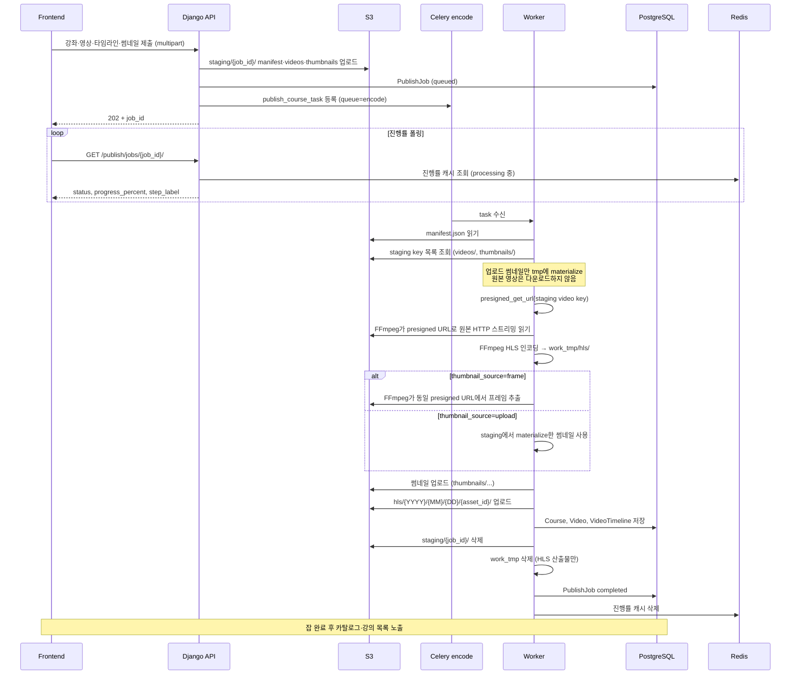

# 개요 

[지난 글](../../09/class-project-retrospective-1)이 6월 9일에 적었으니 8일만에 진행 사항을 정리하게 되네요
확장할 기능에 대해서 다음처럼 정리를 했죠.
```bash
개발 예정인 기능이 아직 많습니다. <br/>
실질적으로 사용자에게 가장 큰 변화를 주는 기능을 먼저 구현할 예정입니다.
- 업로드가 아닌 유튜브 링크를 통한 공유
- 자유 게시판

그 후에는 테스트와 고도화를 병행할 생각이지만, 무엇보다 비용 절감에 초점을 둘 예정이죠. 
고도화에서는 아래 영역에 대해서 작업이 필요하죠.
- HLS 세그먼트 다수 업로드: `.ts`마다 S3 PutObject가 늘어 요청 비용이 오르는 문제 해결
- 인코딩 서버 구현: ffmpeg를 쓰지 않고 직접 인코딩 구현해서 최적화
- 멀티파트 업로드로 바이트 단위 청크 전송을 최적화
- 디스크 문제: 로컬에 원본 파일과 인코딩 파일이 동시에 존재할 때도 괜찮은지 체크
- 배포 비용 절감의 필요

테스트 및 분석 영역
- 과부하 테스트
- 큰 파일이 들어왔을 때(GB 단위)
- 보안 이슈 체크
```

결과적으로는 다음과 같이 정리되었습니다.
- HLS 세그먼트 다수 업로드: PutObject 건수를 대략 집계해 봤을 때 비용 부담은 거의 없는 수준이어서 후순위로 미뤄도 된다고 판단했습니다.
- 배포 비용 절감: Spot 인스턴스를 통해 서버 비용을 낮추는 방안을 탐색할 예정입니다.
- 멀티파트 업로드: 학원 규모 업로드량에서는 단일 PUT으로 충분해 보여 보류했습니다.
- 인코딩 서버 직접 구현: Spot 인스턴스와 같이 묶이는 기능으로 보이며 후에 copy stream 분기와 같이 검토할 예정입니다. FFmpeg 옵션 튜닝은 진행했으며 아래 내용에서 다룹니다.
- 디스크 문제: 배포 시 Docker 빌드와 인코딩 워커 런타임 양쪽에서 대응했습니다.
- 큰 파일(GB 단위): Request size를 1GB로 제한하는 방식으로 1차 대응했습니다.

이번 기간에서 봤던 문제들의 공통점은 1차 회고에서 선택한 8GB EBS 단일 EC2 환경이 생각보다 빠듯했다는 점입니다. 사용자 기능은 빠르게 붙였고, 나머지 작업은 디스크와 비용 압박을 줄이는 쪽에 관심을 뒀습니다.

## 추가 기능
이 기간 동안 추가한 기능은 다음과 같습니다만, 이 기능들은 CRUD의 연장선으로 느껴져서 해당 글에서는 큰 비중을 두지 않습니다.
- 유튜브 영상 업로드 추가: 학원 강의를 제외하고도 유튜브 영상을 공유 가능하게 수정
- 자유 QnA: 학원 사람들이 자유롭게 의견 주고 받는 공간
- md 입력 방법 사용성 개선/질문 페이지 디자인 개선: QnA나 댓글에서 MD 지원
- 단일 영상이면 영상 선택이 안 뜨게
- 요청 사이즈 backend env화
- 서버 로그 시간 통일
- 조회수 기능
- 커리큘럼 업로드 권한 공유 기능: 기존에는 한 사람에게 업로드 권한이 고유했다면 이 권한을 다른 사람이 요청했을 경우 공유 가능하게 프로세스 수정 
- 큰 파일이 들어왔을 때(GB 단위): Request size를 1기가로 제한

## 디스크 공간

1차 회고에서 EBS 8GB를 선택했는데, 배포 중인 사이트를 업데이트할 때 디스크를 다 쓰게 되는 경우가 발생했습니다.
프론트 빌드 과정 중에 발생했는데, `docker compose build`하는 도중에 이미지 복사본이 공존하면서 해당 이슈가 발생하게 되었습니다. 디스크가 8GB면 충분할 줄 알았지만
실제 환경에서는 다음처럼 4.5GB를 차지한 상태에서 `docker compose build`로 빌드하는 과정에서 저장 공간을 벗어나서 에러가 발생했습니다.
```bash
$ df -h /
Filesystem      Size  Used Avail Use% Mounted on
/dev/nvme0n1p1  8.0G  4.5G  3.5G  57% /
$ sudo docker system df
TYPE            TOTAL     ACTIVE    SIZE      RECLAIMABLE
Images          6         6         1.89GB    691.1MB (36%)
Containers      6         6         2.191kB   0B (0%)
Local Volumes   5         5         53.11MB   0B (0%)
Build Cache     0         0         0B        0B
```

좀 더 자세히 보면 다음 흐름이 발생한 거죠.
1. 빌드 캐시 및 임시 레이어가 생성되는 과정에서 Next.js를 사용하고 있으므로 node_modules를 설치하고 소스 코드를 컴파일하면서 대량의 임시 파일이 디스크에 생성되는데, 이게 거의 1~2GB로 추측됩니다.
2. 빌드된 새 이미지를 만들면서 이것도 1~2GB를 차지하게 되겠죠.
3. 신규 이미지 + 기존 이미지 + 캐시된 임시 파일들까지 합쳐지면서 남은 여유 공간인 3.5GB를 초과해서 터집니다.

간단하고 확실한 해결책은 하드웨어적으로 디스크 용량을 늘리는 거죠.
하지만 그 전에 Docker 관련해서 다음 최적화를 적용했습니다.
- Docker 전역 로그 제한 추가 (컨테이너 로그가 디스크를 잠식하지 않도록 장기 운영 대비, 당장은 영향 없음)
- 백엔드/Celery 중복 빌드를 동일 이미지 사용으로 제거
- Next.js Standalone 최적화로 패키징 압축

```bash
$ df -h /
Filesystem      Size  Used Avail Use% Mounted on
/dev/nvme0n1p1  8.0G  3.9G  4.1G  49% /
$ sudo docker system df
TYPE            TOTAL     ACTIVE    SIZE      RECLAIMABLE
Images          5         5         1.231GB   8.45MB (0%)
Containers      6         6         1.653kB   0B (0%)
Local Volumes   5         5         53.13MB   0B (0%)
Build Cache     0         0         0B        0B
```

결과적으로 600MB 정도의 파일 용량을 줄였는데, 빌드 중에는 기존 이미지와 신규 이미지와 임시 레이어가 잠깐 공존하므로 절감분이 체감상 2배 가까이 여유 공간으로 작용합니다. 배포 과정에서의 안정성을 많이 올려 봤습니다. 조금 더 프로젝트를 다듬은 후에는 볼륨을 추가하거나 디스크를 늘리는 등의 방법을 고려해야겠습니다. 
아니면 인프라를 분리하는 것도 방법일 수 있고요.

## ffmpeg에서 바로 s3 연결

1차 파이프라인에서는 워커가 staging 영상 전체를 서버의 `tmp` 폴더에 다운로드한 뒤 인코딩했습니다. <br/>
디버깅이 용이해 보여 해당 방식을 택했지만, 프리티어 환경에서 원본과 HLS 산출물이 동시에 로컬에 쌓이면 8GB EBS가 빠르게 줄어든다는 점과 인코딩 시간이 생각보다 오래 걸린다는 점을 확인했습니다.

그래서 원본은 S3에 두고 FFmpeg 입력만 HTTP로 스트리밍 받는 흐름으로 수정하였습니다. <br/>
presigned URL을 FFmpeg가 받아 직접 HTTP 요청을 주고받으며 처리하게끔 했죠. HLS 산출물만 남게됩니다.


로컬 테스트 시 20분짜리 영상 인코딩에서 20~30초 차이가 발생한 걸로 보아 근소하게 속도도 빨라진 걸 확인할 수 있었습니다. 워커 디스크 피크도 GB 단위 원본 파일을 더 이상 보관하지 않아 줄어든 셈이죠.

## ffmpeg 옵션 테스트
[ffmpeg에 대한 옵션](../../13/ffmpeg-options-test)은 테스트해 보며 현재 상황에 맞는 값을 찾아 적용했습니다. 코덱과 프리셋 등 대부분은 유지하고 CRF와 비트레이트 상한만 조정하는 편으로 결정했습니다.

최종적으로 다음 옵션을 택하였습니다.

| 항목 | 수정 전 | 수정 후 | 변경 이유 |
| --- | --- | --- | --- |
| 비디오 코덱 | `libx264` | `libx264` | H.264 기반 HLS 호환성을 유지 |
| 해상도 제한 | `scale='min(1920,iw)':-2` | `scale='min(1920,iw)':-2` | 원본이 1920보다 크면 1080p급 너비로 제한하고, 비율 유지 |
| 프리셋 | `medium` | `medium` | 벤치마크에서 품질 안정성과 압축 효율의 균형이 좋았음 |
| CRF | `22` | `24` | VMAF 평균 95 이상을 유지하면서 용량을 줄이기 위해 조정 |
| Maxrate | `5M` | `3M` | CRF 24 구간 실측 비트레이트에 맞춰 비트레이트 상한을 조정 |
| Bufsize | `10M` | `6M` | maxrate의 2배 버퍼를 유지해 순간 비트레이트 변동을 완충 |
| 오디오 코덱 | `aac` | `aac` | HLS 호환성을 위해 유지 |
| 오디오 비트레이트 | `128k` | `128k` | 일반적인 스트리밍 음질 기준 유지 |
| 세그먼트 길이 | `10초` | `10초` | 기존 서비스 재생 구조와 캐싱 정책 유지 |
| HLS 타입 | `vod` | `vod` | VOD용 정적 플레이리스트 생성 |

시간은 기존 대비 미세하게 줄어 큰 변화는 없었던 테스트입니다. 20분 영상 인코딩 기준 636s에서 622s로, 저장 공간도 74.8MB에서 73.8MB로 바뀌었죠. 아무래도 수정 옵션이 큰 차이를 만들지 못했기 때문으로 보입니다. 

더 효과적인 개선은 코덱 관련으로 보입니다. 이미 H.264/AAC인 원본도 매번 transcode하고 있기 때문에 copy stream 분기를 적용하면 더 빠른 인코딩이 가능해보입니다.

## 업로드 대기열에서 발생한 버그

S3 스트리밍 파이프라인 변경과는 별개로, 서비스 운영 중 실제 업로드를 돌리며 드러난 이슈였습니다.
여러 개 영상을 업로드하는 과정에서 영상 업로드가 누락되며 고아 파일이 생성되는 버그가 있었습니다.
워커가 동작을 중단하고 넘어가거나 1시간짜리 업로드에 인코딩 시간이 4시간이 넘어가는 등의 증상이 겹쳐 나타났죠.

원인은 크게 세 가지였습니다.

1. Redis 브로커의 `visibility_timeout` 기본값(1시간)과 `worker_prefetch_multiplier` 기본값(4) 조합으로, 워커가 작업을 끝낸 뒤에도 같은 메시지가 재배달되었습니다. 이미 완료되어 S3 스테이징이 삭제된 작업을 다시 실행하면서 `NoSuchKey`가 발생했고, `status`는 `failed`인데 `completed_at`이 남는 데이터 불일치도 생겼습니다.
2. Celery `task_time_limit`이 2시간이었는데, 긴 영상 인코딩이 그 안에 끝나지 않아 워커가 중간에 끊기면서 Job이 `processing`에 고정되었습니다.
3. 타임 리미트를 4시간으로 늘린 뒤에도 특정 WebM/VFR 영상에서 인코딩이 비정상적으로 오래 걸렸습니다. ffprobe가 읽은 왜곡된 FPS 메타데이터(1000 fps)를 그대로 쓰면서, 실제 프레임 간격과 맞지 않는 인코딩이 진행된 것이었습니다.

해결법은 브로커 설정(`visibility_timeout` 4시간, prefetch 1, task time limit 4시간)으로 변경하고 완료된 Job 재실행 방지 및 `NoSuchKey` 재시도 제외 같은 서비스 로직 보강, 출력 FPS를 CFR 30으로 고정하는 FFmpeg 옵션 변경으로 마무리했습니다.

버그에 대한 자세한 내용은 [이 글](../../16/class-project-bug-celery-redis-time-limit)에서 확인해 볼 수 있습니다.

# Todo
지금 당장은 배포 비용 절감이 중요합니다. 현재 EC2 온디맨드 인스턴스만으로 하루 약 $3(월 $90 전후)이 나가고 있습니다. 현재 구조에서 벗어나 Spot 인스턴스로 인코딩을 분리하고 DB를 RDS로 옮긴다고 가정하면 웹/API용 EC2 스펙을 줄일 수 있습니다. 하지만 Spot 중단 시에는 인코딩 잡 재시도가 필요하다는 점 때문에 프로세스가 복잡해지게 되고 자연스럽게 버그가 발생할 가능성이 높아질테니 연구가 필요합니다.

또한 현재는 원본 코덱과 관계없이 항상 transcode하도록 되어 있습니다.
이미 H.264/AAC인 영상은 `-c copy`로 패키징만 하도록 분기하면 인코딩 시간을 더 줄일 수 있으니 이 부분도 연구가 필요하죠.