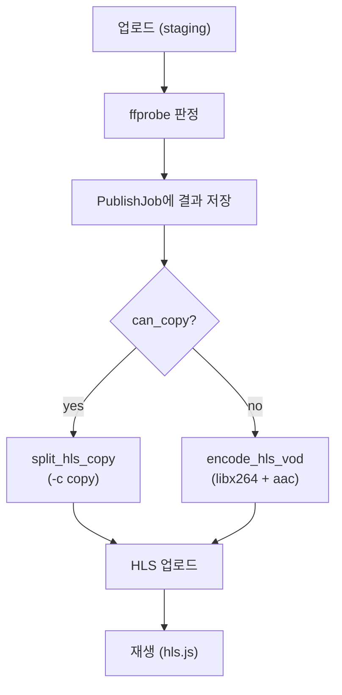

# 개요

[저번 회고](../../17/class-project-retrospective-2)에서 마지막에 언급했던 부분을 진행하려 합니다.

```html
또한 현재는 원본 코덱과 관계없이 항상 transcode하도록 되어 있습니다.
이미 H.264/AAC인 영상은 -c copy로 패키징만 하도록 분기하면 인코딩 시간을 더 줄일 수 있으니 이 부분도 연구가 필요하죠
```

코덱을 기준으로 재인코딩 대신 기존 스트림을 그대로 쓰고 패키징만 하면 속도가 빨라지는 점은 쉽게 납득이 갔습니다.
다만 내부적으로 어떻게 다른지, 재인코딩 없이 패키징만 하면 되는 경우는 무엇이 다른지가 궁금했습니다.

# HLS 궁금증

## HLS에서 H.264는 인코딩을 안 해도 되는 이유?

H.264인지 아닌지는 크게 중요하지 않더군요.<br/>
실제 기준은 타깃 플레이어 지원 범위와 HLS authoring 조건을 원본이 이미 만족하는지가 인코딩 여부를 정합니다.
관련 사양은 Apple 문서와 RFC에서 정리해 두고 있습니다.

- [Apple HLS Authoring Specification](https://developer.apple.com/documentation/http-live-streaming/hls-authoring-specification-for-apple-devices#Video)
  - Apple이 권장하는 비디오 인코딩 요구사항을 확인할 수 있습니다. (IDR, 자막, 호환성 등)
  - H.264, H.265(HEVC), AV1만 지원합니다.
- [RFC 8216](https://datatracker.ietf.org/doc/html/rfc8216#section-4.3.4.2.1)
  - 지원 코덱을 표로 나열하지는 않고, 만족해야 할 조건과 사용 시 확인할 식별자를 안내합니다.

위 조건을 충족하는 코덱으로 세그먼트를 나누고, 이를 플레이리스트로 패키징한 뒤 세그먼트 단위로 전달하면 플레이어가 재생할 수 있습니다. 이 방식이 HLS입니다.
정리하면 스트리밍 프로토콜이 HLS이고, 플레이어가 재생하려면 매니페스트(플레이리스트) 처리, 세그먼트 로딩, 해당 리소스를 디코딩할 코덱 지원이 모두 맞아야 합니다.
그래서 타깃 플레이어가 지원하지 않는 코덱은 새로 인코딩해 줘야 합니다.

반대로 아래 조건을 모두 만족하면 별도 인코딩 없이 패키징/Remux만으로 처리할 수 있습니다.
코덱 이름이 H.264, HEVC, AV1처럼 HLS 후보에 들어간다고 해서 `-c copy`가 항상 가능한 것은 아닙니다.

- 패키징: 세그먼트로 분할
- Remux: 영상을 재인코딩(압축 및 변환)하지 않고, 파일 형식(컨테이너)만 변경

코덱이 맞아도 `-c copy`가 어려운 대표적인 경우는 다음과 같습니다.

- segment 경계에 IDR/keyframe이 없거나, non-IDR I-frame만 있어 open GOP 상태인 경우
- profile, level, pix_fmt, bitrate, resolution이 타깃 플레이어나 하드웨어 디코더 범위를 벗어난 경우
- segment container(MPEG-TS, fMP4)나 오디오 layout이 HLS authoring 조건과 맞지 않는 경우
- B-frame reordering, closed caption, timecode 등 bitstream/메타데이터를 copy만으로 맞출 수 없는 경우

HLS를 적용할 때는 아래 조건을 순서대로 확인해야 합니다.

1. HLS 조건에 부합하는가?
2. segment container가 타깃 플레이어에서 지원되는가?
3. video codec이 타깃 플레이어에서 지원되는가?
4. audio codec이 타깃 플레이어에서 지원되는가?
5. profile / level / pix_fmt / bitrate / resolution이 하드웨어 디코더 범위 안인가?

   아래 옵션들은 최종 비디오에서 확인하는 속성이며, FFmpeg로 조회할 수 있습니다.

   - profile: 코덱 안에서 어떤 기능 세트를 쓰는지
   - level: 같은 코덱/profile 안에서 허용되는 처리량 한계
   - pix_fmt(pixel format): 비디오 프레임의 픽셀 저장 방식
   - bitrate: 초당 영상 데이터량
   - resolution: 해상도

## 비디오 코덱

자료를 조사하다 코덱 이야기를 알게 되었는데, 흥미로웠습니다.

H.264는 2003년에 나온 디지털 비디오 압축 표준(AVC)입니다.
출시 시점만큼 널리 보급된 보편적인 형식이라 호환성도 대부분 지원합니다.
최근에는 4K/8K 고해상도 처리를 위해 H.265(HEVC)나 AV1도 확대되고 있습니다.

재미있는 점은 H.265 때 로열티 지급 문제로 불만을 품은 IT 기업들이 AV1을 새로 만들었다는 것입니다. AV1은 H.266을 밀어내며 빠른 속도로 보급되고 있습니다.
압축 성능은 H.266이 우수하지만, 특허 문제로 도입 장벽이 높아 AV1이 더 대중화되고 있습니다.
2026년 5월 28일 AV2가 오픈 소스로 배포되었고, 높은 품질을 보여 H.266의 입지는 더 좁아질 것 같습니다.

## keyframe과 HLS 세그먼트가 딱 맞지 않을 때 내부적으로 어떻게 작업하는지

GOP(Group of Pictures)은 keyframe부터 다음 keyframe 직전까지의 프레임 묶음입니다.
첫 번째 I-frame부터 다음 I-frame 직전까지가 하나의 GOP입니다.
GOP length는 keyframe 사이 간격, 즉 GOP에 포함된 프레임 수나 시간 간격을 뜻합니다.

```html
I B B P B B P B B P I B B P B B P ...
^                   ^
keyframe            next keyframe
```

일반 P/B 프레임은 이전 프레임을 참조해 압축합니다.
I-frame은 자기 자신만 참조하는 intra 프레임이고, IDR frame은 I-frame 중에서도 디코더 참조 버퍼를 비우는 특수한 I-frame입니다.

즉 모든 IDR frame은 I-frame이지만, 모든 I-frame이 IDR frame은 아닙니다.
non-IDR I-frame만 있으면 open GOP가 될 수 있어, HLS segment 시작점으로는 IDR frame이 더 안전합니다.

> 영상 압축에서 IDR(Instantaneous Decoder Refresh) 프레임은 다른 프레임을 전혀 참조하지 않고, 독립적으로 완전한 하나의 화면을 구성하는 핵심 프레임이다.

IDR 프레임을 두면 얻는 이점은 다음과 같습니다.

- 독립적인 디코딩(랜덤 액세스): 이전 프레임 데이터를 참조하지 않으므로, 사용자가 구간을 탐색할 때 즉시 화면을 띄울 수 있습니다. (HLS와 비슷합니다)
- 오류 확산 방지: 영상 데이터가 손실되더라도 다음 IDR 프레임에서 영향이 사라집니다.
- 장면 전환 처리: 화면이 급격히 바뀌는 씬에서는 기존 화면을 참조하는 대신 IDR 프레임을 만들어 압축 효율과 화질을 함께 지킬 수 있습니다.

HLS segment는 가능하면 keyframe, 더 정확히는 IDR frame에서 시작합니다.
이 동작을 옵션으로 끌 수도 있지만, P/B 프레임에서 segment를 시작하면 화면이 깨질 수 있어 권장하지 않습니다.

그래서 HLS에서 세그먼트 시간을 6초로 주더라도 GOP length가 8초라면 8초 단위로 세그먼트가 밀려 분리됩니다.

```
원하는 segment:
0~6초
6~12초
12~18초

실제 keyframe:
0초
8초
16초

분리된 segment:
0~8초
8~16초
16초~18초
```

프레임레이트가 고정되어 있다면 GOP length를 segment duration에 맞추는 방식으로도 정렬할 수 있습니다.
원하는 segment 경계에 IDR/keyframe이 없으면 `-c copy`만으로는 새 keyframe을 만들 수 없으니 이 경우에는 transcoding으로 `-g`, `-force_key_frames` 같은 옵션을 써서 IDR을 생성해야 합니다.

# 코덱 분기 처리

위 본문 내용을 토대로 `-c copy`만으로 처리 가능한 조건은 아래와 같습니다.

segment container는 HLS에서 플레이어가 요청하는 각 조각 파일(`.ts`, `.m4s`)을 감싸는 포맷입니다.
원본 파일의 MP4/MKV 컨테이너와는 별개이며, FFmpeg HLS muxer가 출력할 segment format을 의미합니다.

| 확인 항목 | `-c copy` 가능 조건 |
|-----------|---------------------|
| HLS authoring | Apple/RFC authoring 요구사항을 원본이 이미 충족 |
| video codec | Apple 기준 H.264/AVC, H.265/HEVC, AV1 중 타깃 플레이어가 지원하는 코덱 |
| audio codec | Apple 기준 AAC-LC(`mp4a.40.2`), HE-AAC(`mp4a.40.5`) 중 타깃이 지원하는 코덱. 5.1ch 서라운드(전후좌우+서브우퍼)는 AC-3/E-AC-3 별도 확인 |
| segment container | MPEG-2 TS(`.ts`) 또는 Fragmented MP4(fMP4, init + `.m4s`) 중 타깃 플레이어가 지원하는 포맷 |
| profile / level | 타깃 플레이어 및 하드웨어 디코더 허용 범위 이내 |
| pix_fmt | 디코더가 지원하는 픽셀 포맷 (예: yuv420p) |
| bitrate / resolution | 타깃 플레이어 및 하드웨어 디코더 처리 범위 이내 |
| keyframe / GOP | segment 경계에 IDR/keyframe이 있고, open GOP가 아님 |

아닌 경우는 부합하지 않는 속성에 따라 다르게 처리해야 합니다.

| 미충족 항목 | 처리 방식 | FFmpeg 방향 |
|-------------|-----------|-------------|
| video codec | video transcoding | `-c:v libx264`(H.264), `-c:v libx265`(HEVC), `-c:v libsvtav1`(AV1) |
| audio codec | audio transcoding | `-c:a aac`(AAC-LC), HE-AAC 필요 시 `-profile:a aac_he` |
| profile / level | video transcoding | `-profile:v`, `-level` 지정 |
| pix_fmt | video transcoding | `-pix_fmt yuv420p` 등 |
| bitrate / resolution | video transcoding | `-b:v`, `-s` 또는 `-vf scale` |
| IDR/keyframe / GOP | IDR 생성 transcoding | `-g`, `-force_key_frames` |
| segment container | Remux (bitstream copy) | `-c copy` + `-hls_segment_type mpegts` 또는 `fmp4` |
| bitstream / 메타데이터 | bitstream filter 또는 transcoding | `-bsf:v`, closed caption/timecode 재구성 또는 재인코딩 |

## 타깃 영상 체크

현재 강좌 업로드 사이트에서 사용해 보면 다음과 같이 확인할 수 있습니다.
```
파일: ./sample.webm
포맷: matroska,webm, 길이: 1488.621000s, 비트레이트: 659729
비디오: vp8, profile=0, level=-99, 1920x944, pix_fmt=yuv420p, bitrate=
오디오: opus, profile=, channels=2, bitrate=

| 확인 항목 | 결과 | 근거 |
|-----------|------|------|
| HLS authoring | O | ffprobe로 읽을 수 있고, 영상 스트림이 있음 |
| video codec | X | 원본 VP8, 서비스 copy 허용은 H.264만 |
| audio codec | X | 원본 Opus, 서비스 copy 허용은 AAC만 |
| segment container | O | HLS 출력을 `.ts`(MPEG-TS)로 설정했고 지원 포맷 |
| profile / level | O | profile=0, level=-99로 허용 범위 이내 |
| pix_fmt | O | yuv420p, 일반 디코더에서 흔히 지원 |
| bitrate / resolution | O | 1920x944, 해상도·비트레이트 제한 통과 |
| keyframe / GOP | O | keyframe 약 4.5초마다, 10초 세그먼트보다 촘촘함 (open GOP 미검증) |

최종 copy 가능 여부: X
```
일단은 video와 audio 코덱이 맞지 않습니다.
지금 녹화 환경은 강의 선생님께서 `jitsi`라는 오픈소스로 서버를 열어 녹화를 진행 중이고, 결과물 컨테이너가 WebM이라 copy를 기대하긴 어렵습니다. 그래도 혹시 비디오 코덱이 AV1일까 했는데, 아니었습니다.

## 현재 설정
현재 서버에서는 아래와 같이 항상 재인코딩하도록 설정되어 있었습니다.
```python
def encode_hls_vod(
        *,
        input_path: Path | str,
        output_dir: Path,
        profile: HlsVodProfile | None = None,
) -> Path:
    if not shutil.which("ffmpeg"):
        raise EncodeError("ffmpeg가 설치되어 있지 않습니다.")

    profile = profile or get_hls_vod_profile()
    output_dir.mkdir(parents=True, exist_ok=True)
    playlist = output_dir / "index.m3u8"

    segment_pattern = str(output_dir / "seg_%03d.ts")
    output_fps = float(profile.output_fps)
    gop = _gop_for_segment(fps=output_fps, segment_seconds=profile.segment_seconds)

    cmd = [
        "ffmpeg", "-y",
        "-i", str(input_path),
        "-vf", f"scale='min({profile.max_width},iw)':-2,fps={profile.output_fps}",
        "-c:v", "libx264",
        "-preset", profile.preset,
        "-crf", str(profile.crf),
        "-maxrate", _bitrate_arg(profile.maxrate_bps),
        "-bufsize", _bitrate_arg(profile.bufsize_bps),
        "-g", str(gop),
        "-keyint_min", str(gop),
        "-sc_threshold", "0",
        "-force_key_frames", f"expr:gte(t,n_forced*{profile.segment_seconds})",
        "-c:a", "aac",
        "-b:a", profile.audio_bitrate,
        "-f", "hls",
        "-hls_time", str(profile.segment_seconds),
        "-hls_playlist_type", "vod",
        "-hls_flags", "independent_segments",
        "-hls_segment_filename", segment_pattern,
        str(playlist),
    ]

    proc = subprocess.run(cmd, capture_output=True, text=False)
    if proc.returncode != 0:
        stderr = proc.stderr.decode("utf-8", errors="ignore")
        log_event(
            logger,
            logging.ERROR,
            LogEvent.FFMPEG_FAILED,
            "HLS encode failed",
            **ffmpeg_fields(video_path=redact_ffmpeg_input_for_log(input_path), stderr=stderr[:500]),
        )
        raise EncodeError(stderr or "HLS 인코딩 실패")
    if not playlist.is_file():
        raise EncodeError("index.m3u8가 생성되지 않았습니다.")
    return playlist
```

현재 파악된 녹화 영상, WebM(VP8 + Opus) 기준으로는 copy 분기로 빠지는 개선은 이 케이스에 해당하지 않습니다.

- 코덱 copy 분기는 다른 컨테이너를 위해 추가해야 할 부분은 맞지만, 지금 당장 필요하지 않다는 결론을 내릴 수 있었습니다.
- keyframe / GOP 항목이 O로 나와 이 부분을 생략할 수 있지 않을까 하는 궁금증이 생길 수 있지만, `copy`가 아닌 `transcode`로 코덱을 바꾸는 과정에서 keyframe을 새로 만들므로 이 부분도 개선 포인트는 아닙니다.
- `scale / fps`는 Jitsi WebM의 VFR·메타데이터 왜곡 이슈 때문에 출력을 30 fps CFR로 고정한 설정입니다 ([참고](../../16/class-project-bug-celery-redis-time-limit/)). 이 부분도 개선할 포인트는 보이지 않았습니다.

## 분기 처리
현재 주로 업로드하는 영상은 `copy`로 인한 속도 향상을 기대하기 어렵습니다.
다만 프로젝트에 `copy` 분기 처리를 두지 않을 이유는 없습니다.



`copy`를 허용하는 코덱 목록은 다음과 같이 보수적으로 정의했습니다.
```python

# HLS TS copy 가능 코덱
_COPY_OK_VIDEO_CODECS: frozenset[str] = frozenset({"h264", "hevc"})
_COPY_OK_AUDIO_CODECS: frozenset[str] = frozenset({"aac", "mp3", "mp2", "ac3", "eac3"})
```

위 목록을 보면 AV1(`av1`)이 없는 것을 알 수 있습니다. 사양에서는 지원 코덱으로 언급하긴 하지만, copy 분기에서는 사양의 지원 목록과 타깃 플레이어의 재생 가능 범위를 같게 보지 않습니다. AV1 비트스트림을 `-c copy`로 실어 보내는 경로는 생태계에서 널리 쓰이지 않는 것으로 알고 있습니다(주로 최신 브라우저만 지원).
그래서 hls.js와 브라우저 디코더가 모두 맞아야 재생되기 때문에, 웹 호환성을 보장하기 어렵다고 판단해 재인코딩합니다.

업로드 후 워커가 실행될 때 다음 로직으로 잡에 포함된 모든 영상의 HLS copy 가능 여부를 검사합니다. `_probe_upload_keys` 내부에서 `ffprobe`로 컨테이너와 스트림 메타데이터를 조회한 뒤, 각 영상을 순회하며 검사합니다.
```python
        # ffprobe로 업로드 영상별 HLS copy 가능 여부를 사전 판정하고 DB에 저장
        probe_results = _probe_upload_keys(video_keys, manifest["videos"])
        upload_slot = 0
        raw_probe_records = []
        for index, item in enumerate(manifest["videos"]):
            if item.get("source_type", "upload") == "youtube":
                continue
            key = video_keys[upload_slot] if upload_slot < len(video_keys) else None
            if key is not None and upload_slot < len(probe_results):
                raw_probe_records.append(
                    probe_results[upload_slot].as_dict(video_index=index, video_key=key)
                )
            upload_slot += 1
        PublishJob.objects.filter(pk=job_id).update(hls_probe_results=raw_probe_records)
```

코덱 판정에 쓰는 `ffprobe` 호출은 다음과 같습니다. `ffprobe`로 파일을 디코딩하지 않고 컨테이너와 스트림 메타데이터만 JSON으로 조회합니다.

- `-v quiet`: stderr 로그를 줄이고 stdout만 JSON으로 받기 위한 설정
- `-print_format json`: Python에서 `json.loads`로 파싱하기 쉬운 출력 형식
- `-show_format`: 컨테이너 정보(`format_name`)를 포함
- `-show_streams`: 각 트랙의 `codec_type`, `codec_name`을 포함

```python
    cmd = [
        "ffprobe", "-v", "quiet",
        "-print_format", "json",
        "-show_format",
        "-show_streams",
        str(input_path),
    ]

    ...
    try:
        proc = subprocess.run(cmd, capture_output=True, text=False, timeout=60)

    ...
    try:
        info = json.loads(proc.stdout.decode("utf-8", errors="ignore"))
    ...
    streams = info.get("streams") or []
    container = (info.get("format") or {}).get("format_name") or ""

    video_codec = ""
    audio_codec = ""
    for stream in streams:
        codec_type = stream.get("codec_type", "")
        codec_name = stream.get("codec_name", "")
        if codec_type == "video" and not video_codec:
            video_codec = codec_name
        elif codec_type == "audio" and not audio_codec:
            audio_codec = codec_name
```

내부 테스트에서 5분 분량 WebM과 copy 가능한 MP4를 각각 처리한 소요 시간은 다음과 같습니다.

| 구분 | 시작 | 종료 | 소요 시간 |
|------|------|------|-----------|
| WebM (transcode) | 2026-06-22 07:37:04.145217 | 2026-06-22 07:38:22.115242 | 77.97초 (약 1분 18초) |
| MP4 (copy) | 2026-06-22 07:38:55.480835 | 2026-06-22 07:38:55.957125 | 0.48초 |

동일한 5분 영상 기준으로 copy 경로는 transcode보다 약 164배 빠릅니다(77.97초 대 0.48초).
다만 이번 테스트는 단일 케이스에 한정되므로 일반화하기에는 부족합니다. 그래도 copy가 가능한 입력이라면 처리 시간을 크게 줄일 수 있음은 확인할 수 있었습니다.