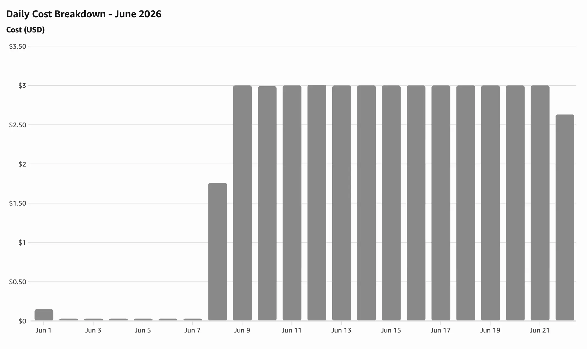

# 개요
현재까지 다음과 같이 비용이 지출되고 있습니다.
> 월간 총 지출: $43.69 (6월 22일까지), 일일 3달러가 소비되고 있죠.

현재 서버의 인스턴스 유형이 `m7i-flex.large`인 점이 가장 큰 이유이죠. 하지만 인코딩 작업을 돌리려면 서버 PC의 사양이 어느 정도 따라줘야 했고, AWS에서 크레딧으로 접근할 수 있는 가장 좋은 서버 사양이 해당하는 것이었기에 이를 선택한 이유가 되었죠.

하지만 이대로 가면 한 달에 90달러, 대략 14만 원이 소비되게 됩니다. 이대로는 서버를 유지하는데 부담이 발생합니다.

# 이론
비용 절감을 위해서는 서버 비용을 줄이는 게 시급합니다, 제 돈이 녹고 있거든요.  
이번에 적용할 방법은 인코딩 서버의 분리입니다.

인코딩 작업을 위해 서버의 사양을 높게 가져갔습니다. 이로 인해 인코딩 작업이 돌지 않는 시점에는 사실상 오버스펙의 서버가 생으로 놀게 되죠. 하지만 다음처럼 프로세스를 바꾼다면 서버와 인코딩 서버의 분리가 가능해집니다.
1. 사용자가 영상 업로드
2. 원본 영상을 S3 같은 Object Storage에 저장
3. DB에 `PublishJob` 레코드 생성
4. Queue에 인코딩 작업 등록
5. 스팟 인스턴스 워커가 작업을 가져감
6. ffmpeg로 인코딩 수행
7. 결과물을 다시 S3에 저장
8. DB 상태를 completed로 변경

서버는 저사양으로, 인코딩 서버는 스팟 인스턴스로 저비용 운영이 가능해져 서버 비용 부담을 어느 정도 줄일 수 있게 될 겁니다.

## Spot Instance

Spot Instance는 AWS 데이터센터에 남아 있는 spare EC2 capacity(유휴 EC2 용량)를 온디맨드보다 낮은 Spot price로 쓰는 인스턴스입니다. AWS가 Spot capacity pool 단위로 남는 용량을 할당하는 방식입니다.

다음 자료를 참고할 수 있습니다.
- [Spot Instance interruption notices](https://docs.aws.amazon.com/AWSEC2/latest/UserGuide/spot-instance-termination-notices.html)
- [Amazon EC2 스팟 인스턴스](https://aws.amazon.com/ko/ec2/spot/)
- [EC2 instance rebalance recommendations](https://docs.aws.amazon.com/AWSEC2/latest/UserGuide/rebalance-recommendations.html)

### 관련 개념

- Spot price: 인스턴스 타입과 가용 영역(AZ)별 시간당 가격이며, 수요와 공급에 따라 변동합니다.
- Spot capacity pool: 같은 인스턴스 타입과 AZ 조합의 유휴 용량 집합입니다.
- Spot Instance request: 원하는 타입과 최대 가격(max price)을 지정해 Spot Instance를 요청하는 방식입니다. 용량이 있으면 AWS가 인스턴스를 할당합니다.

### 인코딩 워크로드 적용

Spot Instance는 중단을 감수할 수 있는 작업에 적합합니다. AWS도 배치 처리, 백그라운드 작업, 선택적 태스크를 대표 사례로 들고 있죠. ffmpeg 인코딩은 큐에 쌓아 두고 워커가 순서대로 처리하는 구조이므로 온디맨드 웹/API 서버와 분리해 Spot 워커로 돌리기 좋은 케이스입니다.

온디맨드 대비 최대 90%까지 저렴해질 수 있지만, 실제 할인율은 인스턴스 타입, 리전, 시점마다 달라진다고 합니다.

### 중단 알림

Spot Instance는 AWS가 용량을 회수해야 하거나 Spot price가 내가 설정한 max price를 넘을 때 중단될 수 있습니다. 온디맨드처럼 내가 원할 때만 끄는 서버가 아니라, AWS가 필요 시 회수하는 전제가 있습니다.

중단이 확정되면 약 2분 전에 `Spot Instance interruption notice`가 옵니다. 인스턴스 메타데이터와 EventBridge 등으로 워커가 이 신호를 받아, 진행 중인 ffmpeg를 정리하고 큐에 작업을 반영한 뒤 이어서 처리할 수 있게 만드는 로직과 시간이 필요합니다.

이 알림보다 앞서 `EC2 instance rebalance recommendation`이 올 수도 있습니다.
중단이 임박했다는 뜻은 아니고, 해당 Spot Instance가 중단될 위험이 높아졌다는 조기 신호입니다. 2분 알림을 기다리지 않고 워크로드를 다른 Spot Instance로 옮기거나 새 워커를 띄우는 데 활용할 수 있죠.

### Spot Instance 관리

Spot Instance는 EC2처럼 한 대를 띄워 두고 끝나는 구조가 아닙니다.
중단 알림에 대응하고, 필요한 만큼만 유지하고, 줄어든 용량을 다른 타입으로 메우는 관리가 함께 따라옵니다.

AWS에서 Spot Instance를 관리하는 방법은 다음과 같습니다.
- Spot Instance request: 단건으로 Spot을 요청합니다. persistent request로 두면 중단 후에도 AWS가 다시 할당을 시도합니다.
- Spot Fleet / EC2 Fleet: 목표 용량, 인스턴스 타입 목록, 할당 전략을 한 설정으로 묶어 여러 Spot Instance를 유지합니다. 한 풀의 용량이 줄면 다른 타입으로 대체하기도 쉽습니다.
- Auto Scaling Group: desired capacity에 맞춰 인스턴스를 추가하거나 제거합니다. Spot만 쓰는 ASG도 만들 수 있고, 혼합 인스턴스 정책으로 Spot과 온디맨드를 한 그룹에 섞을 수도 있습니다. Capacity Rebalancing을 켜면 rebalance recommendation 신호에 맞춰 위험한 Spot을 새 인스턴스로 교체할 수도 있죠.

### 이 프로젝트 적용 방향

이 프로젝트에서는 Auto Scaling Group으로 정리하기로 했습니다. 
웹/API는 저사양 온디맨드 EC2 한 대를 항상 띄워 두고, Celery 인코딩 워커만 Spot 전용 ASG로 분리합니다.

워커 ASG의 desired capacity는 Redis 큐 길이 같은 지표에 맞춰 0에서 N까지 오가게 합니다. 큐가 비면 Spot 워커를 모두 내려 유휴 인코딩 비용을 없앱니다. 업로드가 몰리면 그때만 Spot 워커를 늘리고, 인코딩이 필요한 시간에만 비용이 발생하게 하여 총 비용을 줄입니다.

### 이 프로젝트에서 추가로 필요한 전제

Spot을 쓰려면 [이전에 다룬 Celery·Redis 설정](../../16/class-project-bug-celery-redis-time-limit)처럼, 인코딩 작업 중에 중단되었다고 해도 이어서 처리할 수 있게 구성을 바꿔야 합니다.

바꿔야 하는 구성
- 큐 기반 설계: 업로드, DB 기록, 인코딩 요청, 결과 저장을 분리해 두었으므로, 워커만 교체하거나 재시작해도 흐름을 유지할 수 있어야 합니다.
- 멱등성: 같은 `PublishJob` 레코드를 워커가 두 번 집어도 결과가 깨지지 않게 처리해야 합니다. 이미 완료된 Job은 재실행하지 않는 로직이 필요합니다.
- 중단 대응: `interruption notice` 또는 `rebalance recommendation` 수신 시 진행 중 작업을 중단하고, 복구가 가능한 상태로 만들어야 합니다.
- 스케일링: 큐에 메시지가 쌓일 때 ASG가 Spot worker를 늘리고, 비면 줄일 수 있어야 합니다.

이 전제가 갖춰지면 다음을 기대할 수 있습니다.
- 인코딩 작업이 몰릴 때만 Spot 워커를 늘려 대규모 워크로드를 처리할 수 있다.
- 평소에는 저사양 온디맨드(또는 더 작은 인스턴스)로 웹/API만 유지하고, 인코딩 비용은 Spot에 맡길 수 있다.
- Spot price가 낮은 시간대와 타입을 활용해 비용 최적화를 더 진행할 수 있다.

## 구조 변경

Spot Instance를 쓰려면 인프라 분리뿐 아니라 큐와 복구 방식도 함께 봐야 합니다. 즉 현재 Celery 구조를 그대로 둘지 바꿀지도 정해야 합니다.

아래 세 가지 후보를 검토했습니다. 공통 전제는 위 절의 적용 방향과 같습니다. API는 온디맨드 EC2에 두고, 인코딩 worker만 Spot ASG로 분리합니다.  
지금은 API, Redis, Celery worker가 같은 서버(Docker Compose) 안에 있고, Celery가 Redis를 broker로 써서 task를 주고받지만, broker(또는 Stream)을 API 쪽에 두고, Spot worker가 네트워크로 접속하는 구조는 세 후보 모두 동일합니다.
여기서 결정할 사항은 무엇을 broker로 쓸지, Celery를 유지할지뿐입니다.

### 1. Celery 유지 + Spot Worker 분리 + ack 설정 강화

> 서버 EC2(Redis broker) ← `CELERY_BROKER_URL` ← Spot Celery Worker(ffmpeg)

기존 Celery task 구조는 유지하고, 인코딩 worker만 Spot ASG로 옮기는 방식입니다.

worker 분리만으로는 Spot 중단 시 진행 중인 ffmpeg가 끊기고, 브로커 재배달로 DB `processing`이 어긋날 수 있습니다.
completed 멱등 가드를 추가해도 `visibility_timeout` 4시간 기준이면 재배달 자체는 늦을 수 있으므로, 아래 Celery 설정을 다시 검토해야 하죠.

- `task_acks_late=True`: task 본문이 끝난 뒤 ack
- `task_reject_on_worker_lost=True`: worker가 비정상 종료되면 메시지를 다시 큐로 (Spot은 2분 notice 후 강제 종료되므로, shutdown hook이 제대로 동작할 때 효과가 큼)
- `visibility_timeout`: 최대 인코딩 시간보다 길게 유지 (너무 짧으면 정상 작업도 재배달됨)

장점은 `publish_course_task`, `run_publish_job`을 재사용하면서 변경 범위를 작게 유지할 수 있다는 점입니다.
단점은 Redis broker의 `visibility_timeout` 값에 의존하는 부분이 남아 다양한 케이스에 대한 대응이 부족해지고, worker가 갑자기 죽으면 여전히 timeout까지 기다려야 하는 점입니다.

### 2. Celery 유지 + Broker를 RabbitMQ 또는 SQS로 변경

> 서버 EC2 ← broker(RabbitMQ/SQS) ← Spot Celery Worker(ffmpeg)

인프라 분리는 1번과 같고, Celery task 코드도 유지하면서 메시지 브로커만 Redis에서 RabbitMQ/SQS로 바꾸는 형태입니다.
진행률 캐시 등 다른 용도로 Redis는 API 서버에 계속 남아 있죠.

- RabbitMQ: 오픈소스 메시지 브로커로, AMQP 기반 큐에 메시지를 넣고 consumer ack로 처리 완료를 확인합니다. Redis broker의 unacked·`visibility_timeout` 조합과는 다르게 동작합니다.
- SQS(Simple Queue Service): AWS가 운영하는 관리형 메시지 큐로, 브로커 서버를 직접 띄우지 않아도 됩니다. Spot worker와 같은 AWS 환경과 맞추기 쉽지만, SQS도 visibility timeout이 있어 긴 인코딩에서는 연장(ChangeMessageVisibility) 정책을 봐야 합니다. Celery transport 제약도 확인이 필요합니다.

장점은 Celery 생태계를 유지하면서 브로커 안정성을 높일 수 있다는 점입니다. 단점은 RabbitMQ는 운영 부담이 늘고, SQS는 AWS 종속과 설정 조사가 필요하다는 점입니다. Redis broker에서 메시지 유실·중복·timeout 문제가 반복될 때 검토할 후순위 옵션입니다.

참고) 현재 프로젝트에서 Redis에 비해 위 기술 스택이 안정적인 이유는 설계 목적이 다르기 때문입니다.
- Redis는 인메모리 캐시 DB로 설계되었지만, 활용에 따라 메시지 브로커 역할을 일부 담당할 수 있음
- RabbitMQ는 메시지 브로커로 설계되었기에 작업의 heartbeat 처리나 복구 처리 접근성이 좋음
- SQS는 AWS 환경에서 백만 건까지 무료로 사용 가능하며, Spot 인스턴스 워커와 함께 메시지 브로커로 자주 쓰임

### 3. Celery 제거 + Redis Stream 기반 Custom Worker

> 서버 EC2(Redis Stream) ← consumer group ← Spot Worker(ffmpeg)

인프라 분리는 동일하되 Celery를 제거하고 Redis Stream을 추가하여 전체적인 구조를 바꿉니다.
Redis Stream은 Redis에 추가된 메시징 구조로, Kafka와 비슷하게 동작하며 메시지를 읽는 Consumer와 이를 묶는 Consumer Group을 지원합니다.

장점은 Redis Stream의 pending/ACK/claim 구조를 직접 제어할 수 있어, Spot worker 중단 시 작업 재처리 흐름을 더 명확하게 설계할 수 있다는 점입니다.
단점은 Celery가 제공하던 retry, failed 처리, dead letter, heartbeat, 모니터링, 큐 정리 로직을 직접 구현해야 해서 개발과 운영 난이도가 높아진다는 점입니다.

### 요약

| 방식 | 변경 범위 | Spot 중단 대응 | 특징 | 이 프로젝트 적합도 |
|------|-----------|----------------|------|-------------------|
| 1. Celery + Spot Worker 분리 + ack 강화 | 작음~중간 | 중간 | 서버 EC2 + Spot worker. Redis broker + late ack·worker lost reject. 강제 종료 시 `visibility_timeout` 한계 잔존 | 1차 적용·PoC |
| 2. Celery + RabbitMQ/SQS | 중간 | 중간~높음 | 서버 EC2 + Spot worker. broker만 RabbitMQ/SQS로 교체 | Redis broker 한계가 반복될 때 |
| 3. Redis Stream Custom Worker | 큼 | 높음(구현 품질 의존) | 서버 EC2 + Spot worker. Celery 제거, `XPENDING`·`XCLAIM`으로 복구 직접 제어 | Spot 본격 운영·복구 속도 중시 |

구조 변경은 결과적으로 2번을 택했습니다.. 
이유는 기존 Redis Queue 방식으로는 인코딩 중 종료 시 복구에 제한이 많을 걸로 예측이 됩니다.  
SQS는 무료 사용량 안에서 쓸 수 있어 서버 부담을 줄이면서 broker 기능도 챙길 수 있을 것으로 보여서 이를 선택했죠.

# 적용 
(작성 중)

# 비용 비교
(작성 중)

