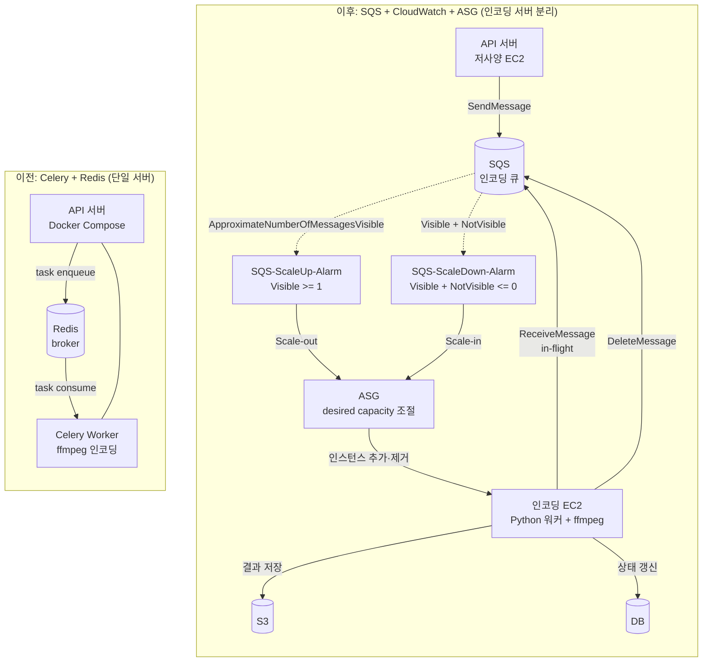
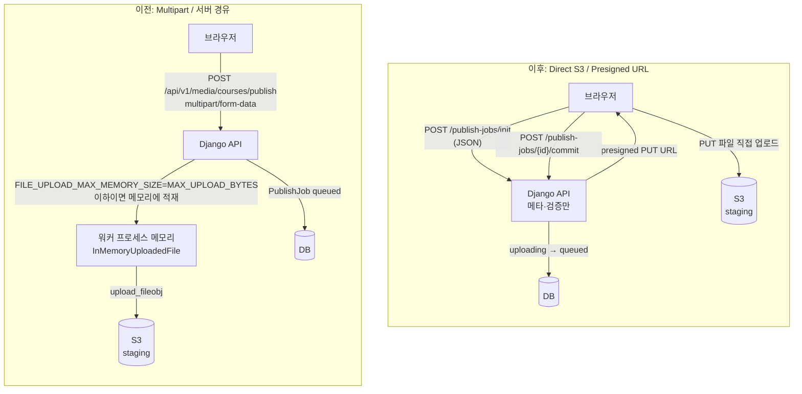

# 개요
현재까지 다음과 같이 비용이 지출되고 있습니다.
> 월간 총 지출: $43.69 (6월 22일까지), 일일 3달러가 소비되고 있죠.


현재 서버의 인스턴스 유형이 `m7i-flex.large`인 점이 가장 큰 이유죠. 하지만 인코딩 작업을 돌리려면 서버 PC의 사양이 어느 정도 따라줘야 했고, AWS 크레딧으로 선택할 수 있는 범위에서 가장 높은 사양이 그것이었기에 이를 택했죠.

하지만 이대로 가면 한 달에 90달러, 대략 14만 원이 소비되게 됩니다. 이대로는 서버를 유지하는 데 부담이 발생합니다.

# 흐름도
비용 절감을 위해서는 서버 비용을 줄이는 게 시급합니다. 제 돈이 녹고 있거든요. <br/>
이번에 적용할 방법은 인코딩 서버의 분리입니다.

인코딩 작업을 위해 서버의 사양을 높게 설정했기에, 인코딩 작업이 돌지 않는 시점에서는 오버스펙 상태입니다.
1. 사용자가 영상 업로드
2. 원본 영상을 S3 같은 Object Storage에 저장
3. DB에 `PublishJob` 레코드 생성
4. SQS에 인코딩 작업 등록
5. SQS에 메시지가 축적되면 CloudWatch에서 scale-up 알람 발생
6. 알람을 받고 ASG에서 인코딩 서버를 추가
7. 인코딩 서버가 동영상 인코딩 작업을 진행하며 SQS 메시지를 in-flight로 변경
8. 결과물을 다시 S3에 저장
9. DB 상태를 `completed`로 변경
10. visible과 in-flight 메시지가 모두 0이 되면 scale-down 알람 발생
11. ASG에서 인코딩 서버 제거

위와 같이 인프라 흐름을 구성한다면 많은 컴퓨팅 리소스를 차지하는 인코딩 작업을 별도로 분리해 낼 수 있죠.
그러면 서버 PC의 사양을 줄일 수 있다는 장점이 있습니다.

# Celery에서 Infra로
현재는 메시지 생산과 브로커 연결, 비동기로 인코딩 작업을 수행하는 데 Redis와 Celery를 사용하고 있었습니다. <br/>
이제는 이 구조가 필요 없습니다. 우리는 SQS에 메시지를 등록하면 CloudWatch가 이를 탐지하고 ASG로 워커를 생성해 이 워커가 인코딩 작업을 수행하는 구조로 바꿨습니다.
- Amazon SQS(Simple Queue Service): 마이크로서비스와 분산 시스템을 위해 AWS에서 제공하는 완전 관리형 메시지 대기열(Message Queue) 서비스
- Amazon CloudWatch 경보(Alarms): SQS 큐 깊이 같은 지표(Metric)를 감시하다가, 임계값에 도달하면 ASG 스케일링 정책을 실행하는 기능, 트리거 역할
- AWS ASG(Auto Scaling Group): 트래픽 변동에 맞춰 EC2 인스턴스 수를 자동으로 늘리거나(Scale-out) 줄이는(Scale-in) 서비스


CloudWatch 알람 조건
- SQS-ScaleUp-Alarm: `ApproximateNumberOfMessagesVisible` >= 1
- SQS-ScaleDown-Alarm: `TotalMessages`(m1 + m2) <= 0
  - m1: `ApproximateNumberOfMessagesVisible` (큐 `class-s-publish-prod`, 통계: 평균, 기간: 1분)
  - m2: `ApproximateNumberOfMessagesNotVisible` (큐 `class-s-publish-prod`, 통계: 평균, 기간: 1분)
  - 경보를 알릴 데이터 포인트: 2/2
  - 누락된 데이터 처리: 양호(notBreaching)
- `ApproximateNumberOfMessagesVisible`: 아직 `ReceiveMessage`로 가져가지 않은 수신 대기 중(visible)인 메시지 수를 보는 SQS CloudWatch 지표
- `ApproximateNumberOfMessagesNotVisible`: 워커가 `ReceiveMessage`로 가져간 뒤 아직 `DeleteMessage`하지 않은 in-flight 메시지 수를 보는 SQS CloudWatch 지표

Celery와 SQS 구현을 비교하면 다음과 같습니다.

| 구분 | Celery (이전) | SQS (현재) |
| --- | --- | --- |
| 큐 | Redis broker (`encode` 큐) | AWS SQS |
| 등록 | `publish_course_task.apply_async()`로 Redis에 저장 | `enqueue_publish_job()`로 SQS에 등록 |
| 소비자 | 서버에서 Celery로 실행 | ASG 온디맨드 EC2에서 `python -m media.workers`로 실행 |
| 재시도 | `max_retries=2`, `self.retry()`로 Celery 설정 | SQS에서 처리 실패 시 메시지를 삭제하지 않고 visibility timeout이 만료되면 큐에 다시 노출되며, `ApproximateReceiveCount`로 수신 횟수를 추적해 상한에 도달하면 DLQ로 이동 |
| 취소 | `revoke(task_id)`로 큐에서 작업 철회 | 워커가 메시지를 받은 이후 `status`를 확인해 이미 취소된 작업이면 처리를 건너뛰고 `DeleteMessage`로 메시지만 제거 |
| 실제 로직 | `run_publish_job()` | 동일 (`run_publish_job()`) |

다음 로직으로 현재 잡 상태에 따라 재시도 여부를 판단하고 재큐합니다.
```python
    outcome = run_publish_job_with_outcome(job_id)
    log_publish_job_outcome(outcome, layer="sqs", receive_count=receive_count)

    if outcome.status is PublishJobRunStatus.FAILED:
        if receive_count >= settings.PUBLISH_SQS_MAX_RECEIVE_COUNT:
            _cleanup_after_exhausted_retries(job_id)
            _ack_message(...)
        else:
            release_message(...)  # visibility=0 → 즉시 재큐
        return

    _ack_message(...)
```

# 프론트에서 바로 S3로 저장
기존에는 프론트에서 백엔드 서버로 데이터를 저장한 뒤 S3로 업로드하는 방식을 사용했습니다. <br/>
당시에는 대용량 Request를 허용하기 위해 `DATA_UPLOAD_MAX_MEMORY_SIZE`와 `FILE_UPLOAD_MAX_MEMORY_SIZE`를 `MAX_UPLOAD_BYTES`(1GB)까지 올려두었습니다.
```python

# DATA_UPLOAD_MAX_MEMORY_SIZE: multipart 요청 본문 상한
# FILE_UPLOAD_MAX_MEMORY_SIZE: 이 크기 이하 파일은 RAM, 초과는 디스크 임시
DATA_UPLOAD_MAX_MEMORY_SIZE = MAX_UPLOAD_BYTES
FILE_UPLOAD_MAX_MEMORY_SIZE = MAX_UPLOAD_BYTES
```

위 설정은 다시 보니 실수였습니다.<br/>
저는 두 설정 모두 Request 용량 상한만 바꾸는 줄 알았습니다. 요청 본문 크기 상한은 `DATA_UPLOAD_MAX_MEMORY_SIZE`가 담당하고, `FILE_UPLOAD_MAX_MEMORY_SIZE`는 업로드 파일을 어디에 둘지 정합니다. 이 값 이하면 `InMemoryUploadedFile`(RAM), 초과하면 `TemporaryUploadedFile`(디스크 임시)입니다.

Django 기본은 2.5MB라 대용량은 디스크로 스풀되지만, 둘 다 `MAX_UPLOAD_BYTES`(1GB)로 맞춰두면서 1GB 미만 영상은 전부 RAM에 적재되는 경로가 됐습니다. 이 부분이 실수인 이유는 불필요한 RAM 부담이 발생했기 때문입니다.

원래라면 대용량 파일을 임시 파일로 저장하는 것이 안전하지만 이 로직의 설정값을 바꿨던 것이죠.
이제는 서버의 사양을 줄이는 게 목적이므로 임시 파일을 백엔드로 업로드하지 않고 프론트에서 바로 S3로 올리는 방식으로 전환했습니다.

Multipart 업로드와 Direct S3 업로드의 차이는 다음과 같습니다.



| 구분 | 이전 (Multipart / 서버 경유) | 이후 (Direct S3 / Presigned URL) |
| --- | --- | --- |
| API 엔드포인트 | `POST /api/v1/media/courses/publish` (1회) | `POST /publish-jobs/init` → S3 PUT → `POST /publish-jobs/{id}/commit` (3단계) |
| 요청 형식 | `multipart/form-data` (파일 + JSON 메타) | init/commit은 JSON만, 파일은 S3로 직접 PUT |
| 파일 전송 경로 | 브라우저 → Django → S3 | 브라우저 → S3 (Django는 메타·검증만) |
| 서버 부하 | 대용량 파일이 앱 서버를 통과 | 앱 서버는 메타데이터·presigned URL 발급만 |
| Job 초기 상태 | `queued` (업로드 완료 후 바로 큐잉) | `uploading` → commit 후 `queued` |
| 스테이징 저장 | 서버가 `upload_fileobj`로 S3에 저장 | 클라이언트가 presigned PUT으로 S3에 저장 |
| 진행률 표시 | `authFetchFormWithProgress`로 서버에 multipart 전송 시 `xhr.upload.onprogress`에서 `loaded / total` 비율 계산 | `putFileToPresignedUrl`에서 동일하게 XMLHttpRequest PUT으로 presigned URL에 파일을 보내고, `xhr.upload.onprogress`로 S3 업로드 진행률을 측정 (`fetch`는 업로드 진행률 이벤트를 지원하지 않아 XHR 사용) |
| 실패 시 정리 | 서버에서 `cleanup_staging` | 프론트가 `discardPublishJob` 호출 + 서버 cleanup |


업로드 작업을 init/commit으로 분리했습니다. init에서 1회성 presigned URL을 발급받고, 브라우저가 S3에 PUT한 뒤 commit으로 검증과 잡의 상태를 바꿉니다.
또 ContentType, ContentLength가 서명에 포함되어 발급된 URL에는 다른 타입이나 크기로 업로드할 수 없습니다.

# 고생했던 부분
S3와 SQS 연결 부분은 AI 도구로 쉽게 작성할 수 있어서 문제가 없었지만, CloudWatch의 "누락된 데이터 처리" 설정에서 시간이 걸렸습니다.
scale-down 알람은 `ApproximateNumberOfMessages` 단일 지표 대신, visible과 in-flight를 각각 보는 수학 표현식 `TotalMessages = m1 + m2`로 메시지가 완전히 종료됐는지 판단합니다.
기본 세팅인 무시 설정에서는 아래처럼 진행되어 의도한 대로 프로세스가 동작하지 않았습니다.
- 메시지 수신: TotalMessages = 1 → OK 상태
- 워커가 처리 시작: in-flight로 이동 → 여전히 1 → OK 상태
- 처리 완료 & 삭제: 메시지 완전히 사라짐 → 데이터 없음
- "무시" 처리: 데이터가 없어도 상태 변화 없음 → OK 상태 유지
- 결과: scale-down이 되지 않는 현상 발생

현재는 누락된 데이터를 "양호"(notBreaching)로 처리하고, 1분 기간의 데이터 포인트 2/2가 연속으로 `TotalMessages <= 0`을 만족할 때 ALARM이 발생합니다.
- 메시지 수신: TotalMessages = 1 → OK 상태
- 처리 중: TotalMessages = 1 → OK 상태 (안전)
- 처리 완료: 데이터 없음 → "양호" = 0으로 처리
- 0 ≤ 0 조건 만족 → ALARM → scale-down 실행

이 결과를 얻기 위해 CloudWatch 로그 시스템을 추가했습니다. 기존에는 로그가 서버 EC2에 쌓였지만, ASG로 인스턴스가 on/off되니 추적이 어렵더군요.
그래서 로그 시스템을 적용해 보니 인스턴스 ID별로 로그 스트림이 생성되어 추적이 상당히 쉬워졌고, 해당 문제를 파악할 수 있었습니다.

# 비용
API 서버는 `t3.small`, 인코딩 ASG는 `m7i-flex.large`로 적용했습니다. 적용 전 일일 약 $3이던 비용이 일 $1.4 정도로 내려갔습니다. 세팅을 바꾸며 테스트하는 동안 일부 비용이 섞였으므로, 안정화되면 $1.3까지도 내려갈 여지가 있습니다.