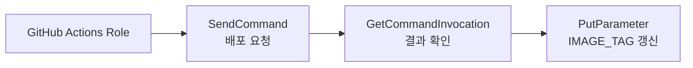
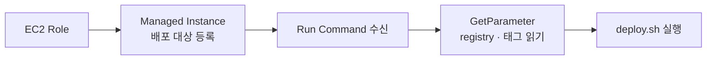

# 개요
[저번 글](../../23/class-s-encoding-server-split-cost-saving/)을 작성하던 중 배포 방식을 검토하다가 개선점이 보이더군요.

현재는 수동 배포로 버전 업데이트마다 SSH(Secure Shell)로 EC2(Elastic Compute Cloud)에 접근하여 이미지를 빌드하고 실행하는 방식을 하고 있었습니다.
저번 글에서는 스팟 인스턴스를 추가함으로써 API 서버의 사양을 줄이는 것을 목표로 하고 있었는데, 이런 식으로 서버에서 이미지를 빌드한다면 필연적으로 빌드 과정을 감당할 정도의 메모리 공간이 추가로 필요하다는 점입니다.

관련해서 찾아보니 AWS 서비스 중에 이미지를 저장하는 ECR(Elastic Container Registry) 기능이 있는 것을 확인했습니다.
이걸로 이미지를 ECR에 올리고 서버는 이 이미지를 pull하기만 하면 기존에 빌드로 발생하던 1GB~2GB의 저장 공간을 줄일 수 있을 겁니다.

# 해결
그래서 아래처럼 바꿉니다.

| 구분 | Before (수동 배포) | After (자동 배포) |
|------|-------------------|-------------------|
| **트리거** | EC2 SSH 접속 후 수동 실행 | `release` 브랜치 push → GitHub Actions 자동 실행 |
| **이미지 빌드** | EC2에서 `docker compose build` | CI(Continuous Integration, GitHub Actions)에서 빌드 |
| **이미지 저장** | 로컬 태그 (`class_s-backend-base:latest`) | ECR 3개 repo, **git SHA**(커밋 해시) 불변 태그 |
| **EC2 역할** | 빌드 + 실행 + migrate | **pull + migrate + restart** 만 |
| **원격 실행** | SSH 필수 | SSM(Systems Manager) `send-command` (SSH 불필요) |

즉 이제 다음 프로세스와 같아지는 거죠. 이 흐름의 장점은 빌드 작업을 GitHub에서 부담하기에 디스크뿐만 아니라 CPU도 아낄 수 있고, 빌드 과정 중 부하로 생길 수 있는 서버 장애 발생 가능성도 줄일 수 있다는 점입니다.


이 자동 배포 시스템에서 다음 부분이 생소했죠.
- ECR(Elastic Container Registry): AWS Private Docker 이미지 저장소. Docker Hub와 비슷하지만 계정 내부 전용이고 IAM(Identity and Access Management)으로 접근 제어
- IAM(Identity and Access Management): AWS 리소스에 대한 안전한 액세스를 제어하는 핵심 보안 서비스
- SSM(Systems Manager): EC2를 원격 관리하는 서비스 모음
  - Parameter Store: 애플리케이션 설정, 데이터베이스 연결 정보, 비밀번호 등의 민감한 데이터를 안전하게 저장 (Key-Value)
  - Run Command: SSH 접속 없이도 EC2 인스턴스, 온프레미스 서버 등 관리형 노드에서 원격으로 명령어나 스크립트를 안전하게 대량 실행할 수 있는 서비스
- GitHub OIDC(OpenID Connect): GitHub Actions가 장기 AWS Access Key 없이 IAM Role을 임시로 맡는 인증 방식

## 세팅
변경을 위해 다음 순서로 세팅했습니다.

### ECR(Elastic Container Registry) 생성
AWS Private Docker 이미지 저장소에 이미지를 등록했습니다. <br/>
아래 3개의 repository를 만들고 git commit SHA(커밋 해시)로 태깅하여 중복되지 않게 했습니다. lifecycle 정책은 최근 5개만 유지하도록 설정했는데, private 저장소 사용 시 비용이 발생하지만 월 $1 미만 정도로 부담되지 않아 선택했습니다.

- `class-s-backend`
- `class-s-frontend`
- `class-s-nginx`

### IAM(Identity and Access Management) Role 생성
AWS API(Application Programming Interface) 권한에 대한 Role은 2개로 나눴습니다.
- `GitHubActions-ClassS-ECR-SSM-Role`: GitHub Actions(OIDC, OpenID Connect)에 붙습니다. ECR push, EC2 태그 탐색, SSM(Systems Manager) send-command, `IMAGE_TAG` 갱신을 담당합니다. GitHub에서 이미지를 ECR에 올리고, 태그가 지정된 EC2가 배포를 진행할 수 있게 합니다. 장기 Access Key는 GitHub Secrets에 두지 않고, OIDC로 이 Role을 배포 시점에만 임시 assume하도록 했습니다.
- `EC2-ECR-SSM-InstanceProfile-Role`: EC2 instance profile에 붙습니다. instance profile은 EC2에 IAM Role을 연결하는 래퍼로서, 콘솔에서 IAM Role 연결과 같은 의미입니다. SSM Agent 등록, ECR pull, Parameter Store 읽기를 담당하며, 이미지를 pull할 때 `IMAGE_TAG` Parameter 값을 참고합니다. EC2 인스턴스에도 GitHub Actions Role과 별도로 접근 권한을 부여하는 구조입니다.

### EC2(Elastic Compute Cloud) 태그 추가
deploy job이 `describe-instances`로 배포 대상 EC2 1대를 찾을 수 있도록 `Environment=production`, `Application=class-s` 태그를 부여했습니다.

### SSM(Systems Manager) 설정
EC2를 SSH 없이 원격 제어하는 핵심입니다.

- Parameter Store: `/class-s/prod/ECR_REGISTRY`에 ECR 서버 주소를 주고 `/class-s/prod/IMAGE_TAG`에 마지막 성공 배포 SHA(커밋 해시)를 둡니다. EC2의 `deploy.sh`가 pull 대상을 여기서 읽고, Actions가 배포 성공 후 `IMAGE_TAG`를 갱신합니다.
- Run Command: Actions가 `send-command`로 EC2에서 `deploy.sh`를 실행합니다. SSH 대신 자동 배포의 트리거 역할을 합니다.
- Managed Instance: EC2에 SSM Agent가 등록되어 `PingStatus`가 Online이면 Run Command 대상이 됩니다.

IAM Role에서 SSM(Systems Manager)을 다음처럼 사용합니다.

**GitHub Actions Role**



**EC2 Role**



### GitHub Actions 워크플로우 추가
`release` push를 트리거로 test → build → deploy 3개 job을 실행합니다.
- test: 단위 테스트를 실행합니다.
- build: backend / frontend / nginx 3개 이미지를 빌드하고 ECR에 push합니다.
- deploy: 태그로 EC2를 찾아 SSM(Systems Manager) send-command로 배포 스크립트를 실행하고, 성공 시 `IMAGE_TAG`를 갱신합니다.

### 배포 스크립트 추가
EC2에서 실행될 배포 스크립트를 추가했습니다.
Parameter에서 registry와 태그를 읽고, ECR login 후 compose pull, migrate, restart 순서를 고정합니다.
GitHub Actions가 `DEPLOY_IMAGE_TAG` 환경 변수로 이번 commit SHA(커밋 해시)를 넘기면 Parameter Store의 `IMAGE_TAG`보다 우선합니다.

```bash
#!/usr/bin/env bash
set -euo pipefail

REPO_DIR="${REPO_DIR:-/home/ec2-user/class_s}"  # EC2 경로가 다르면 env로 지정
cd "$REPO_DIR"

# Sync compose and this script (CI only invokes deploy.sh on EC2).
git fetch origin release
git checkout release
git reset --hard origin/release

COMPOSE="docker compose -f docker-compose.yml"
REGISTRY=$(aws ssm get-parameter --name /class-s/prod/ECR_REGISTRY --query Parameter.Value --output text)
TAG="${DEPLOY_IMAGE_TAG:-$(aws ssm get-parameter --name /class-s/prod/IMAGE_TAG --query Parameter.Value --output text)}"

# docker compose 에서 이미지 사용
export BACKEND_IMAGE="${REGISTRY}/class-s-backend:${TAG}"
export FRONTEND_IMAGE="${REGISTRY}/class-s-frontend:${TAG}"
export NGINX_IMAGE="${REGISTRY}/class-s-nginx:${TAG}"

aws ecr get-login-password --region ap-northeast-2 | docker login --username AWS --password-stdin "$REGISTRY"

$COMPOSE pull backend frontend nginx celery

# 1) DB and Redis first (migrate dependency)
$COMPOSE up -d postgres redis

# 2) One-off migrate with new image before app containers start
$COMPOSE run --rm backend python manage.py migrate

# 3) Full stack (migrate already applied)
$COMPOSE up -d

$COMPOSE restart celery
docker image prune -f
```

# 마무리
세팅 직후 test와 build는 통과했지만 deploy에서 SSM(Systems Manager) `send-command`가 `InvalidInstanceId`로 실패한 적이 있습니다. EC2는 running 상태였지만 instance profile 미연결과 `AmazonSSMManagedInstanceCore` 정책 누락으로 SSM Managed Instance로 등록되지 않은 것이 원인이었죠.

IAM(Identity and Access Management) Role 세팅이 가장 까다로웠지만 AWS Q가 생각보다 잘 도와줘서 진행하기 편했습니다. 무엇보다 AWS에서 제공하는 방식이니 문서의 버전이슈나 보안 문제를 신경 덜 써도 되어 좋았죠.

이제 깃허브에 업로드 시 자동으로 트리거되어 5분만에 배포됩니다.