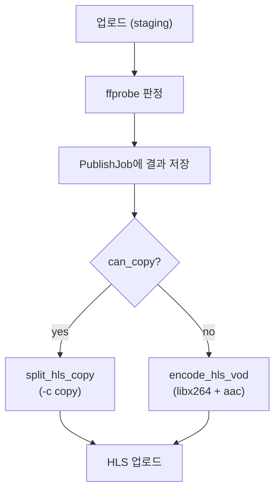

# 개요

[지난 글](../../17/class-project-retrospective-2)을 적은 지 12일 만에 진행 사항을 정리합니다.
2차 회고 마지막 Todo는 다음과 같았습니다.

```bash
지금 당장은 배포 비용 절감이 중요합니다. 현재 EC2 온디맨드 인스턴스만으로 하루 약 $3(월 $90 전후)이 나가고 있습니다.
현재 구조에서 벗어나 Spot 인스턴스로 인코딩을 분리하고 DB를 RDS로 옮긴다고 가정하면 웹/API용 EC2 스펙을 줄일 수 있습니다.
하지만 Spot 중단 시에는 인코딩 잡 재시도가 필요하다는 점 때문에 프로세스가 복잡해지게 되고, 자연스럽게 버그가 발생할 가능성이 높아질 테니 연구가 필요합니다.

또한 현재는 원본 코덱과 관계없이 항상 transcode하도록 되어 있습니다.
이미 H.264/AAC인 영상은 -c copy로 패키징만 하도록 분기하면 인코딩 시간을 더 줄일 수 있으니 이 부분도 연구가 필요하죠.

마지막으로 도메인 붙여봐야겠군요
```

이번 기간에 수정의 중심은 인코딩 파이프라인 고도화와 인프라 분리였습니다. <br/>
2차까지는 단일 EC2 위에서 기능 추가와 ffmpeg 튜닝을 진행했다면, 이번에는 월 비용을 줄이는 데 집중했습니다.

결과적으로 주된 변경 내용은 다음과 같습니다.
- 인코딩 분기: ffprobe 기반 copy/transcode 분기 적용 ([상세 글](../../19/ffmpeg-codec-processing-strategy))
- 인코딩 서버 분리: Celery + Redis에서 SQS + CloudWatch + ASG로 전환 ([상세 글](../../23/class-s-encoding-server-split-cost-saving))
- 자동 배포: GitHub Actions + ECR + SSM 파이프라인 적용 ([상세 글](../../26/class-project-github-actions-auto-deploy))

## 인코딩 분기

2차 회고에서 남겨 둔 copy stream 분기를 먼저 다뤘습니다. <br/>
원본이 HLS authoring 조건을 이미 만족하는 경우에 재인코딩을 생략해도 되므로 `-c copy`로 패키징만 하도록 바꿨습니다.

추가 로직은 코덱 이름만 보는 게 아니라 `ffprobe`로 컨테이너와 스트림 메타데이터를 읽고 Apple HLS Authoring Specification과 RFC 8216 기준에 맞는지 판단하는 것입니다. 조건을 만족하지 않으면 기존처럼 `libx264` + `aac`로 transcode합니다. 영상 정보도 함께 저장되므로, 나중에 인코딩이 실패했을 때 메타데이터를 확인할 수 있는 구조가 되었습니다.



현재 학원 녹화본은 WebM(VP8 + Opus)이 대부분이라 copy 분기로 빠지는 경우는 없었습니다.<br/>
그래도 H.264/AAC MP4가 들어오면 처리 시간을 크게 줄일 수 있게 되었습니다. 내부 테스트에서 5분 영상 기준 copy 경로는 transcode 대비 약 164배 빠른 것을 확인할 수 있었습니다.

## 인코딩 서버 분리

비용 절감이 가장 시급했습니다.<br/>
6월 22일 기준 월간 누적 지출이 $43.69, 일일 약 $3 수준이었고 그대로 두면 월 $90 전후가 예상됐습니다.<br/>
그래서 원래는 Spot 인스턴스로 비용도 줄이면서 인코딩 서버를 분리하려 했지만, Spot 인스턴스의 종료 주기가 3~5분으로 짧은데 여기에 세팅 시간도 포함된다는 점과 인코딩할 때만 서버를 키는 것만으로도 비용을 많이 줄일 수 있다는 점을 들어 Spot 인스턴스 사용은 보류했습니다.

인코딩 작업을 분리한다면 API 서버를 `m7i-flex.large`로 유지할 필요가 없을 것이고, 그에 따라 비용이 줄 것으로 예상했습니다.
이를 위해 인코딩만 별도 ASG의 온디맨드 EC2로 빼고, 큐 깊이에 따라 ASG가 scale-out/scale-in 하도록 구성했습니다.

| 구분 | 이전 (Celery + Redis) | 이후 (SQS + ASG) |
| --- | --- | --- |
| 큐 | Redis broker | SQS |
| 소비자 | 단일 EC2 Celery worker | ASG 온디맨드 EC2 `python -m media.workers` |
| 스케일링 | 없음 (상시 대기) | CloudWatch 알람 → ASG desired capacity |
| 실제 인코딩 로직 | `run_publish_job()` | 동일 |

프론트 업로드도 같이 바꿨습니다. init → S3 presigned PUT → commit 3단계로 나누어 대용량 파일이 앱 서버를 통과하지 않게 했고, Job 상태도 `uploading` → `queued`로 구분했습니다.

CloudWatch scale-down이 동작하지 않는 문제가 있었는데, 알람의 "누락된 데이터 처리" 기본값이 무시(ignore)라 큐가 비어도 ALARM 상태가 유지됐습니다. "양호"(notBreaching)로 바꾸면 데이터 없음을 0으로 간주해 scale-down이 실행됩니다. ASG로 인스턴스가 on/off되면서 로그 추적이 어려워져 CloudWatch Logs도 추가했습니다.

비용 수치는 아직 수집 중입니다.

## 자동 배포

인코딩 서버 분리를 진행하던 중 API 서버 스펙을 줄이려면 EC2에서 `docker compose build`를 없애야 한다는 생각이 들었습니다.
배포 방식을 아래처럼 바꿨습니다.

| 구분 | Before | After |
| --- | --- | --- |
| 트리거 | SSH 접속 후 수동 실행 | `release` 브랜치 push |
| 이미지 빌드 | EC2 | GitHub Actions |
| 이미지 저장 | 로컬 Docker 태그 | ECR (git SHA 태그) |
| EC2 역할 | 빌드 + 실행 + migrate | pull + migrate + restart |
| 원격 실행 | SSH | SSM Run Command |

GitHub OIDC로 장기 Access Key 없이 IAM Role을 assume하고, EC2는 instance profile로 ECR pull과 Parameter Store 읽기만 합니다. `release` push 후 약 5분 안에 배포가 완료됩니다.

즉 GitHub에서 이미지를 빌드하고 ECR에 올리면, SSM Run Command로 EC2에서 `deploy.sh`를 실행해 pull, migrate, restart 순으로 적용합니다.

## 그 외

이번 기간에 메인 작업과 함께 손댄 항목들입니다. 각각 별도 글로 쓸 만큼 크지 않아 한곳에 모았습니다.

### 수정 사항
- 조회수: 2차 회고에서 추가한 기능이었는데, 집계가 커리큘럼 단위로 쌓이고 있어 강좌 단위로 수정했습니다.
- 로그인 세션 슬라이딩: 세션 만료 방식을 슬라이딩 윈도우로 바꿔 활동 중에는 로그아웃되지 않도록 조정했습니다.

### 계획 폐기
- 도메인 연결: 학원에서 내부적으로 사용하는 서비스라 도메인 연결의 필요성을 느끼지 못했습니다.
- RDS 전환: 데이터 양이 많지 않아 현재 사양을 유지하기로 했습니다.

# Todo
- Spot Instance 적용 검토 (중단 시 재시도·멱등 처리 부하 테스트 포함)