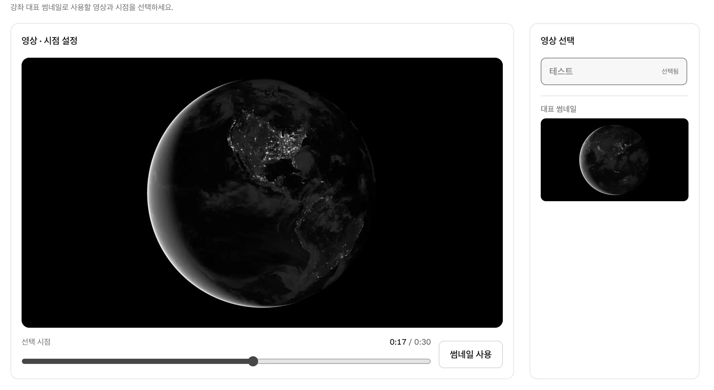
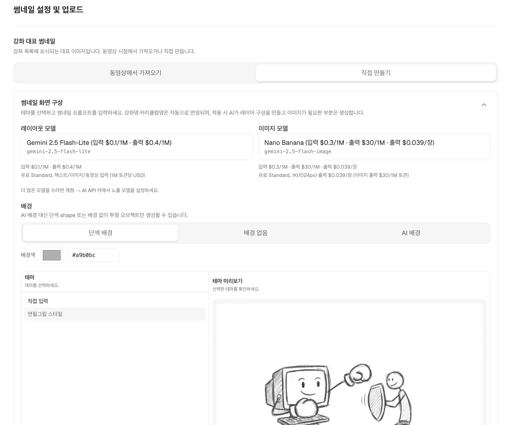
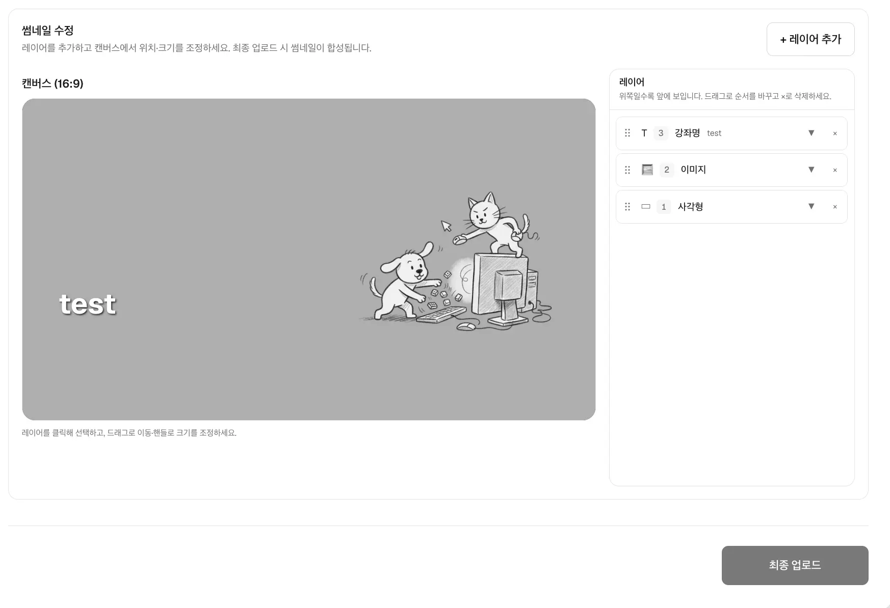
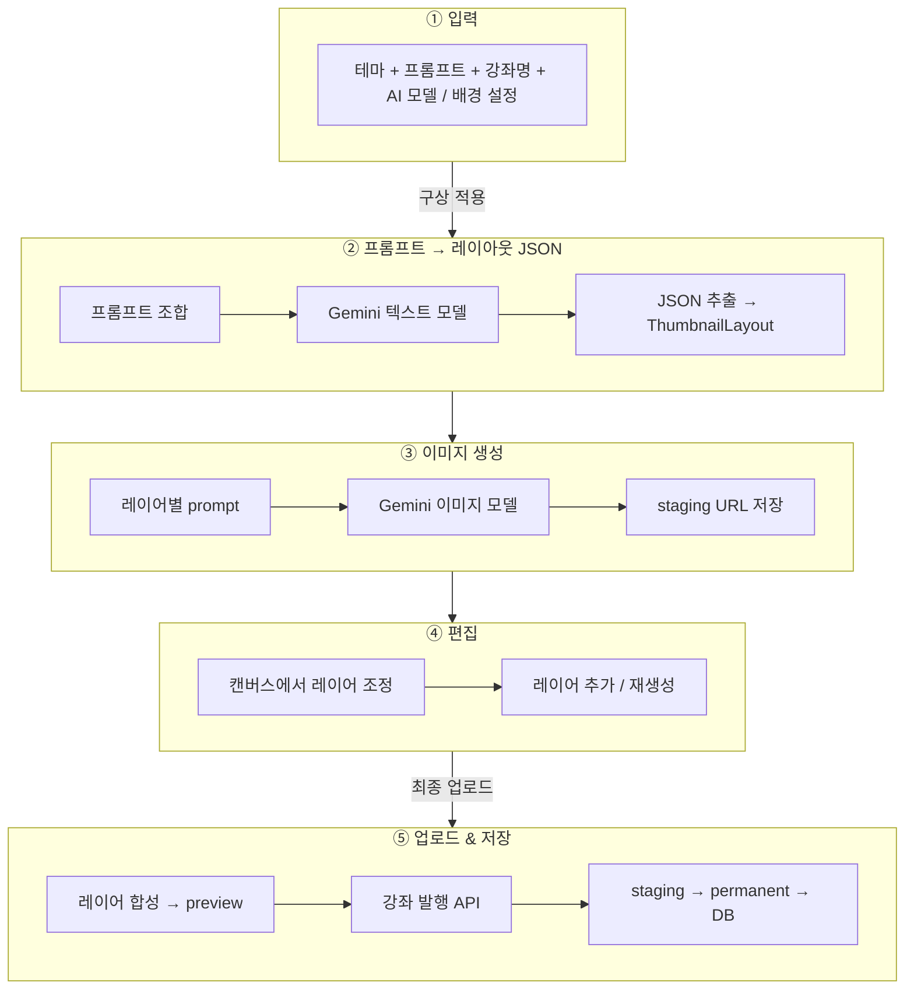
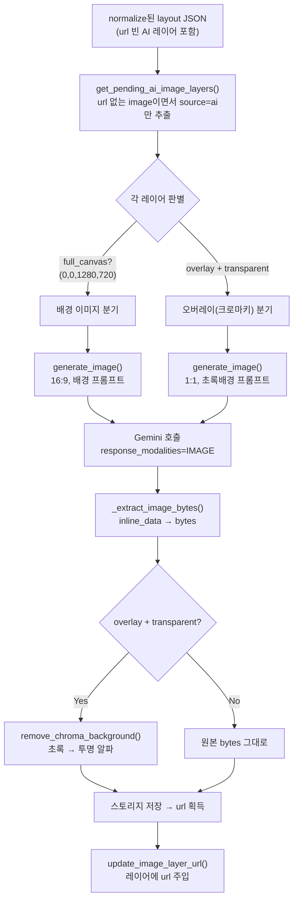
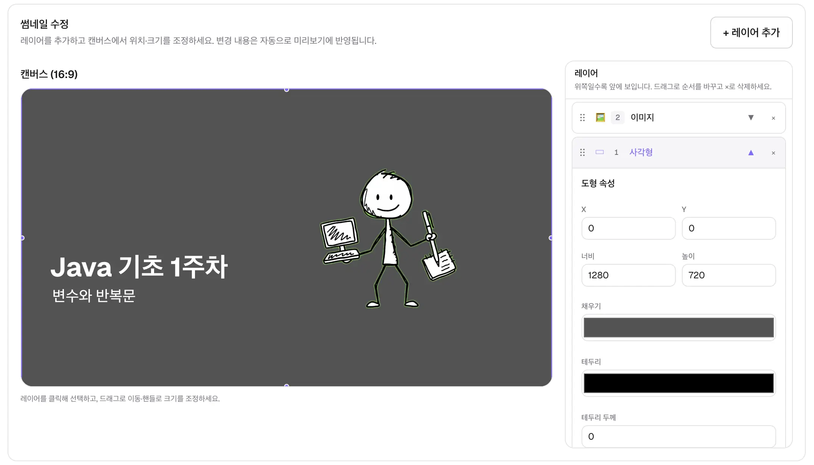

# 개요
최근 기업들의 공고를 보면 재밌는 공고가 AI 애니메이션 플랫폼 개발건이었습니다.<br/>
해당 공고와 더불어서 AI로 생성하는 것과 관련된 공고들이 많이 올라오더군요. 그래서 호기심에 현재 프로젝트에 AI를 녹일 부분이 없을까 고민하던 중 썸네일 기능에 이를 적용하기로 했습니다.

기존 [class 사이트](http://class.devseung.com/)에서는 영상의 프레임 단위로 썸네일을 골라 추출하는 기능을 제공했습니다.



여기에 추가 기능으로 썸네일을 직접 만들 수 있게 했습니다. <br/>
이미지 생성은 AI로 처리하고, 수정이 용이하도록 일러스트레이션처럼 레이어 단위로 동작하게 만들었습니다.
현재는 다음 이미지처럼 이미지, 도형, 텍스트 레이어를 지원하도록 개발해 두었습니다.

강의 업로드에서 직접 만들기로 탭을 선택하고 사용할 모델과 테마를 고르고 프롬프트를 입력하면, 썸네일을 수정할 수 있는 레이어들을 한 번에 생성해 주도록 구성했습니다.

<div style="display: flex; gap: 8px;">
  
  
</div>


# 데이터 흐름
썸네일을 만들 때 큰 흐름은 다음과 같습니다.

프론트 요소인 값의 1번과 4번은 생략하고 5번은 기존의 썸네일 저장 로직처럼 S3에 저장하므로 패스하고 로직으로는 2번과 3번을 중심으로 봅니다.

## 프롬프트에서 JSON 추출

프론트는 "테마 선택(style_id)"과 "직접 쓴 프롬프트(style_note)"를 분리해서 보내면 이를 받은 뒤에 합치고 
```python
def resolve_design_style_prompt(*, style_id: str, style_note: str = "") -> str:
    style = get_design_style(style_id)
    note = style_note.strip()
    if not note:
        raise DesignStyleError("style_note is required")
    if style_id == "custom":
        return note
    base = style.prompt.strip()
    return f"Thumbnail prompt:\n{note}\n\nVisual theme:\n{base}"
```
내부에서 한 번 더 프롬프트로 가공 처리합니다.<br/> 
이는 이미지가 일관되게 나오게 하기 위함이고, 이미지나 도형 같은 부분은 사용자가 레이어로 추가할 수 있게 했습니다.
```python
def assemble_layout_prompt(*, design_style, background_mode="solid") -> str:
    header = (
        "Design a v2 layout JSON for an online IT course thumbnail ...\n"
        "Text titles are added separately by the app — do NOT include text or shape layers.\n\n"
        f"Design style:\n{design_style.strip()}\n\n"
        "Layout rules:\n"
    )
    ...
```
그런 다음 Gemini에서 원하는 JSON 스키마 형태로 받기 위해 GenerateContentConfig를 설정해서 사용합니다.
```python
client = genai.Client(api_key=api_key)
response = client.models.generate_content(
    model=model,
    contents=assembled,
    config=types.GenerateContentConfig(
        response_mime_type="application/json",
        response_schema=LAYOUT_RESPONSE_SCHEMA,
        temperature=0.4,
    ),
)
...
text = (response.text or "").strip()
raw = json.loads(text)          # JSON 텍스트 → dict
if not isinstance(raw, dict):
    raise LayoutGenerateError("layout은 객체여야 합니다.")
return normalize_layout(raw, ...)   # 5단계로
```
위 프로세스를 거치면 사용자가 입력한 프롬프트를 기반으로 원하는 형태의 레이어 구조를 지니는 JSON을 받게 됩니다.

아래와 같은 JSON이 normalize_layout으로 유효성 검사를 거치고 나오게 됩니다. 
여기서 layer 별로 이미지를 탐지하면서 프롬프트 실행이 필요한 이미지들을 추출한 뒤 이미지 생성을 진행합니다.
```json
{
  "version": 2,
  "canvas": { "width": 1280, "height": 720 },
  "layers": [
    {
      "type": "shape", "shape": "rect",
      "x": 0, "y": 0, "width": 1280, "height": 720,
      "fill": "#4389f9", "opacity": 1.0
    },
    {
      "type": "image", "source": "ai",
      "url": "https://cdn.example.com/media/staging/thumbnail-ai/.../9466...webp",
      "prompt": "A Korean stick-figure cartoon (졸라맨) walking, pencil-sketch ...",
      "x": 700, "y": 300, "width": 300, "height": 300,
      "opacity": 1.0, "transparent_background": true
    },
    {
      "type": "image", "source": "ai",
      "url": "https://cdn.example.com/media/staging/thumbnail-ai/.../ce0e...webp",
      "prompt": "Another Korean stick-figure cartoon (졸라맨) walking ...",
      "x": 950, "y": 400, "width": 250, "height": 250,
      "opacity": 0.8, "transparent_background": true
    },
    {
      "type": "text", "role": "course_title",
      "text": "HLS 스트리밍 입문",
      "x": 80, "y": 420, "width": 760,
      "fontSize": 64, "fontWeight": 700, "color": "#ffffff", "shadow": true
    }
  ]
}
```
처음에 Gemini로 JSON을 받았을 때는 url 값이 비어 있지만, normalize를 거치고 이미지를 저장한 뒤에는 해당 값이 주입됩니다.

## 이미지 생성
현재 이미지 생성 로직은 다음 프로세스를 가집니다.

이미지 배경이 존재하는 경우와 존재하지 않는 경우를 둘 다 지원하기 위해 고민해 봤지만, 결과적으로 동영상 크로마키를 참고한 로직을 적용했습니다. 투명 배경이 필요한 오버레이 레이어는 일부러 초록 배경으로 생성한 뒤 그 색을 지워 투명하게 만드는데, 왜 초록색을 쓰는지와 후처리 방식은 아래 이슈에서 다룹니다.


전체 코드보다는 핵심 코드 위주로 보겠습니다.

생성된 JSON에서 이미지를 만들어야 할 부분들을 가져와서 이미지를 만듭니다.
내부에서 분기로 사용자가 입력한 값을 기준으로 배경에 사용되는 이미지인지, 배경이 투명해야 할 이미지인지를 체크하죠.
```python 
pending_layers = get_pending_ai_image_layers(layout)
for layer in pending_layers:
    prompt = str(layer.get("prompt") or "").strip()
    if not prompt:
        raise LayoutGenerateError("이미지 레이어에 생성 프롬프트가 없습니다.")
    full_canvas = is_full_canvas_bounds(layer)                    # 배경인가?
    image_bytes = generate_thumbnail_image(
        api_key=image_api_key,
        prompt=prompt,
        model=image_model,
        full_canvas=full_canvas,
        transparent_background=overlay_transparent_background(layer),  # 투명 오버레이인가?
        ...
    )
```

그다음 현재 선택된 프로바이더가 가진 Image 모델을 통해 이미지를 만들죠.
```python
def generate_thumbnail_image(*, api_key, prompt, model, full_canvas,
                             transparent_background=False, ...) -> bytes:
    provider = get_provider(provider_id)
    raw = provider.generate_image(               # ← 실제 Gemini 호출
        api_key=api_key, prompt=prompt, model=model,
        full_canvas=full_canvas,
        transparent_background=transparent_background, ...
    )
    if transparent_background and not full_canvas:
        from thumbnail_ai.services.background_removal import remove_chroma_background
        return remove_chroma_background(raw)     # ← 초록 배경 제거 후처리
    return raw
```

## 프로바이더
이미지 생성에 사용되는 모델은 앞으로 확장될 수 있어 프로바이더 패턴을 사용했습니다. 모델마다 API 키를 다루는 방식과 호출 방식이 제각각이기 때문입니다.
> Provider 패턴 = Strategy(전략) + Registry(레지스트리)/Factory

이 패턴으로 모델을 관리하면 AI 기능을 호출하는 쪽에서는 지금 대상이 gemini인지 seedream인지 openai인지 신경 쓰지 않아도 됩니다.

### Contract 
Protocol을 상속하면 덕 타이핑으로 들어온 구현체를 상속 관계가 아닌 메서드 구조로 판정하는 구조적 서브타이핑이 적용되어, 정적 타입 체크로 규약 준수를 검증할 수 있습니다. runtime_checkable을 붙이면 런타임에서 isinstance로도 확인할 수 있는데, 이때는 메서드 존재 여부만 보고 시그니처까지는 검사하지 않습니다.

즉 타입 검사는 안정성을 위한 장치일 뿐이고, 실제 목적은 구현체를 갈아 끼워도 호출부가 바뀌지 않게 하는 것입니다.
결과적으로 다형성과 느슨한 결합을 얻는 거죠.
```python
@runtime_checkable
class AiProviderClient(Protocol):
    provider_id: ClassVar[str]
    def validate_api_key(self, api_key: str) -> None: ...
    def generate_layout(self, *, api_key, design_style, ...) -> dict: ...
    def generate_image(self, *, api_key, prompt, ...) -> bytes: ...
```

### Registry
id로 구현체를 찾는 저장소입니다. 데코레이터로 클래스를 정의 시점에 자동 등록하고, id로 인스턴스를 꺼냅니다. 새 프로바이더가 늘어도 이 파일은 바뀌지 않습니다.
```python
_REGISTRY = {}
def register_provider(cls):
    _REGISTRY[cls.provider_id] = cls   # 정의 시점에 자동 등록
    return cls
def get_provider(provider_id):
    return _REGISTRY[provider_id]()    # id → 인스턴스 (Factory)
```
구현체는 데코레이터만 붙이면 등록됩니다.
```python
@register_provider
class GeminiProvider:
    ...
```

### Use
```python
provider = get_provider(provider_id)   # "gemini" → GeminiProvider
layout = provider.generate_layout(api_key=..., design_style=..., ...)
```
provider_id는 등록된 프로바이더를 구별하는 값으로, "gemini"나 "openai" 같은 문자열을 의미합니다.

# 이슈 
## 이미지 투명 처리
이미지 생성 시 프롬프트를 주더라도 실제로 바탕이 투명한 이미지를 생성하지 못하는 문제가 발생했습니다. 
Pro 버전을 사용하거나 seedream 같은 다른 모델을 사용하더라도 해당 문제가 발생하는 걸 확인했죠.

그래서 프롬프트 수정이 아니라 별도의 후처리 작업을 추가하기로 했습니다.<br/>
이미지를 생성하는 프롬프트에서 배경을 초록색으로 지정한 뒤 그 색을 지우는 방식을 택했습니다. 프롬프트에서 RGB 값을 정확히 명시해 줘도 초록색이 그대로 지켜지지 않는 경우가 있어 다음 로직을 적용했습니다.

0,0 픽셀에서 RGB를 가져다가 그 픽셀을 기준으로 제거하는 방식을 적용했습니다.
그랬더니 다음 이미지처럼 초록색 경계선이 남게 되더군요.



이 다음 해결책으로 초록색과 비슷한 값들도 지우기로 했습니다. <br/>
하지만 그러면 색 자체가 사라지므로 알파 값을 가지고 처리하기로 했죠. 우선 타깃 값인 초록색 픽셀은 알파 0(투명)으로 하고, 나머지 피사체 픽셀은 알파 255(불투명)로 알파 값을 계산하는 것입니다.

이러면 좋은 점이 원색이 가진 RGB를 거의 건드리지 않고 수정 가능하게 되죠. 아래가 해당 로직입니다.

```python
def _alpha_from_chroma_distance(
    dist: int,
    *,
    tolerance: int,
    softness: int,
) -> int:
    if dist <= tolerance:
        return 0
    if softness <= 0 or dist >= tolerance + softness:
        return 255
    return int(255 * (dist - tolerance) / softness)

def remove_chroma_background(data, *, tolerance=15, softness=25, feather=1, ...) -> bytes:
    image = Image.open(io.BytesIO(data)).convert("RGBA")
    chroma_key = sample_chroma_key_from_image(image)   # (0,0) 픽셀 = 초록
    ...

    # 픽셀마다 체크
    for y in range(height):
        for x in range(width):
            dist = _chroma_distance((r, g, b), chroma_key)
            alpha = _alpha_from_chroma_distance(dist, tolerance=..., softness=...)
            # 초록색과의 유사도를 dist로 표현하고 
            # 경계선을 부드럽게 처리하기 위해 _alpha_from_chroma_distance로 알파를 서서히 주는 방식
            ...
    if feather > 0:                                    
        # 위에서 색을 기준으로 알파를 수정했다면
        # 여기서 가우시안 블러로 알파 채널만 블러 효과를 줘 경계를 완만하게 합니다 
        alpha = image.getchannel("A").filter(ImageFilter.GaussianBlur(radius=feather))
        image.putalpha(alpha)
    image.save(buffer, format="WEBP", lossless=True)
    return buffer.getvalue()
```
위 로직은 카툰과 대부분의 사진에서 정상적으로 동작합니다.
하지만 가끔씩 배경에 초록색 그라데이션을 사용하는 경우 약간의 그라데이션이 남는 문제가 발생합니다.
이 부분의 해결책은 생각 중입니다. tolerance 값과 softness를 높이면 어느 정도 사라지겠지만, 이게 근본적인 해결책으로는 보이지 않기 때문에 고민이 됩니다.


## 썸네일 파일 문제

현재 AI로 썸네일을 생성할 때 다음 프로세스대로 이미지를 만들고 있습니다.
1. LLM으로 만든 JSON에서 이미지 레이어 추출
    - 이미지 태그로 분리되는 항목들에 대한 이미지 생성
    - 이미지들을 스테이징에 저장
2. PIL을 통해 썸네일 레이어들 합성
    - 단일 이미지로 스테이징에 저장
3. 동영상 업로드 작업 완료 시
    - Job ID로 저장된 경로의 썸네일을 S3로 업로드

위 과정을 거치면서 스테이징 폴더에는 LLM으로 만든 파일들과 이미지를 합친 썸네일 이미지도 존재하며, 사용자가 발행하지 않고 나가거나 프롬프트를 재요청하면서 누적되는 파일들이 존재하게 됩니다.

이는 나중에 크론이나 데몬을 돌려서 주기적으로 지울 예정입니다. DB에 해당 AI로 생성한 작업들이 저장되는데, 이걸 기준으로 하루가 지난 값들이나 DB와 데이터가 일치하지 않는 경우 해당 파일들을 지우면 되죠.

# 후기
만들면서 느낀 가장 큰 부분은, 주된 업로더가 저인 만큼 결국 제가 직접 사용해 보면서 얻는 자체 피드백이 주요 피드백 요소라는 점입니다.
그렇기에 썸네일 기능 또한 제가 익숙해져야 제대로 된 수정 방향이 정해지므로, 원하는 테마나 기능을 아직 자유롭게 수정하지 못하는 부분이 아쉬웠습니다.
그렇기에 현재는 프로토타입을 먼저 만들고 계속 업로드하면서 수정하는 쪽으로 가닥을 잡았습니다.

미리캔버스처럼 자체 이미지 제공에 AI를 부가적으로 넣는 방향이 비용 측면에서도 사용자 만족도 면에서 확실히 좋은 방향인 것이 느껴졌습니다. 사용자들도 실제로 본인이 어떤 썸네일을 만들지를 정확히 알지 못하기에, 샘플을 여러 개 볼 수 있는 상태에서 진행 방향을 잡는 것이 사용자 입장에서 좋더군요.

인프런의 [좋은 썸네일](https://inflab-1.gitbook.io/inflearn/course-promote/tips/undefined-1) 가이드도 참고했습니다. 원래는 AI로 썸네일 만들기였지만, 해당 글을 보니 AI로 썸네일을 완전히 대체하기보다는 직접 만들기가 성격에 맞을 걸로 판단했습니다.

그리고 다음 고려 사항을 추가해야 완성도가 높아질 듯합니다. 현재로서는 이미지의 퀄리티가 유지되지 않고 있네요.
최대한 비용이 적게 들면서 괜찮은 썸네일을 만들 수 있을 때까지 연구해 봐야겠습니다.
- LLM 자체 피드백 기능
- 사용자에게 여러 선택지를 주면서 원하는 이미지를 고르게 하는 부분
- LLM에 샘플 이미지도 컨텍스트로 넣어서 디자인 일관성 유지