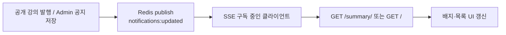

# 개요
Class S에 공지·알림 기능을 붙이면서, 클라이언트가 새 공지를 바로 인지하도록 SSE(Server-Sent Events)를 사용했습니다. SSE는 서버가 클라이언트로 이벤트를 밀어 보내는 HTTP 기반의 단방향 스트림입니다.

핵심은 스트림에 알림 본문을 실지 않는 설계입니다. SSE로는 `{"type":"updated"}` 갱신 신호만 보내고, 배지 숫자와 목록은 클라이언트가 REST로 다시 조회합니다.



# SSE인가
## 공지, 알림 기능
실시간 갱신
## 폴링, WebSocket 대신 SSE를 고른 이유
단방향, 양방향, 리소스 자원
## SSE로 갱신 신호 보내기
레디스로 신호 보내기

알림의 본문·미읽음 수는 DB에서 계산하고, SSE는 “다시 읽어라”는 신호만 담당합니다.

API는 네 갈래입니다.

| 경로 | 역할 |
| --- | --- |
| `GET /api/v1/notifications/summary/` | 미읽음 개수 |
| `GET /api/v1/notifications/` | 목록 (공개 강의 + 기능 공지 병합) |
| `POST /api/v1/notifications/read/` | 읽음 커서(`last_seen_at`) 갱신 |
| `GET /api/v1/notifications/stream/` | SSE 갱신 신호 |

미읽음은 `UserNotificationState.last_seen_at`과 가입 시각 중 더 늦은 값을 cutoff로 두고, 그 이후 공개 강의와 활성 기능 공지 개수를 더합니다.

```python
def unread_count(user) -> int:
    cutoff = get_cutoff(user)
    course_n = Course.objects.filter(
        is_private=False,
        created_at__gt=cutoff,
    ).count()
    feature_n = FeatureAnnouncement.objects.filter(
        is_active=True,
        created_at__gt=cutoff,
    ).count()
    return course_n + feature_n
```

목록은 가입 이후 공개 강의와 활성 `FeatureAnnouncement`를 최신순으로 병합합니다. 강의 발행이 끝나면 비공개가 아닐 때만 Redis로 신호를 내고, Admin에서 기능 공지를 저장할 때도 `is_active`이면 같은 publish를 호출합니다.

```python
def publish_notifications_updated() -> None:
    """모든 SSE 구독자에게 '갱신됨'만 알린다. unread_count는 넣지 않는다."""
    payload = json.dumps({"type": "updated"})
    _client().publish(NOTIFICATIONS_REDIS_CHANNEL, payload)
```

스트림 뷰는 Redis를 subscribe한 제너레이터를 돌리며, 메시지가 오면 SSE 프레임으로 내보내고 없으면 heartbeat를 보냅니다.

```python
class NotificationStreamView(APIView):
    def get(self, request):
        def event_stream():
            for payload in iter_notification_events():
                if payload is None:
                    yield ": heartbeat\n\n"
                    continue
                data = json.dumps(payload)
                yield f"event: notifications\ndata: {data}\n\n"

        response = StreamingHttpResponse(
            event_stream(),
            content_type="text/event-stream",
        )
        response["Cache-Control"] = "no-cache"
        response["X-Accel-Buffering"] = "no"
        return response
```

프론트 `useNotifications`는 로그인 상태에서 스트림을 구독하고, `updated`를 받으면 패널이 닫혀 있을 때만 `summary`를 다시 요청해 배지를 갱신합니다. 패널을 열면 목록을 가져온 뒤 `read`를 호출해 미읽음을 0으로 맞춥니다.

## EventSource 대신 fetch 스트림을 쓴 이유
`EventSource`는 브라우저가 SSE를 받을 때 쓰는 기본 API입니다. 연결만 열면 서버 이벤트를 자동으로 파싱해 줍니다.

다만 `EventSource`는 `Authorization` 같은 커스텀 헤더를 넣을 수 없습니다. 알림 API는 로그인 사용자만 보도록 JWT를 헤더로 검사하기 때문에, 프론트는 `fetch`로 스트림을 열고 응답 body를 직접 읽어 SSE 텍스트를 파싱합니다.

```typescript
const response = await fetch(notificationsStreamUrl(), {
  method: "GET",
  headers: {
    Authorization: token,
    Accept: "text/event-stream",
  },
  signal: options.signal,
});
```

서버가 `event: notifications` / `data: {"type":"updated"}` 형태로 보내면 `onUpdated`를 호출합니다. 끊기면 지수 백오프로 재연결합니다.

# gevent
## sync gunicorn에서 SSE가 막히는 지점
직접적인 원인
## gevent로 실행 방식을 바꾼 이유
## gevent 전환으로 바뀐 점
## Nginx에서 알림 스트림 location을 분리한 이유
요청이 Django에 가기 전에 Nginx가 프록시합니다. 일반 `/api/`는 짧은 요청·응답에 맞춰져 있고, 버퍼링과 타임아웃이 SSE에 맞지 않을 수 있습니다.

SSE는 연결을 오래 열어 두고 조금씩 데이터를 흘려보냅니다. 그래서 `/api/v1/notifications/stream/`만 따로 빼서 버퍼링·캐시를 끄고, 읽기 타임아웃을 길게 잡았습니다. 일반 API 설정에 이를 섞지 않으려고 location을 분리한 겁니다.

```nginx
location /api/v1/notifications/stream/ {
    proxy_pass http://backend:8000;
    proxy_http_version 1.1;
    proxy_set_header Connection "";
    proxy_buffering off;
    proxy_cache off;
    proxy_read_timeout 3600s;
    chunked_transfer_encoding off;
}
```
