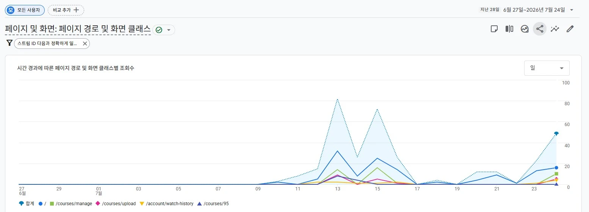

## 서비스 방문자 수
부트캠프 수업을 매일 녹화하고 쉬는 시간을 기준으로 영상을 나눠 업로드한 결과, 다음과 같은 트래픽이 발생했습니다.
외부 커뮤니티에 노출한 곳은 제 개인 블로그뿐이므로 블로그나 링크드인을 통해 들어온 소수의 인원과 실제로 복습을 위해 영상을 보는 몇 사람 정도가 전부일 것으로 추측했습니다.

실제 트래픽이 궁금해서 GA를 달아 둔 결과 다음처럼 확인이 가능했습니다.



7월 9일부터 오늘인 7월 25일까지의 결과는 다음과 같습니다.

| 지표 | 값 |
| --- | --- |
| 조회수 | 333 |
| 활성 사용자 | 35 |
| 활성 사용자당 조회수 | 9.51 |
| 평균 참여 시간 | 2분 47초 |
| 이벤트 수 | 676 |
| 주요 이벤트 | 0 |
| 총수익 | $0.00 |

생각보다 어느 정도 조회수가 쌓였습니다.

앞으로의 방향은 다음 두 가지가 가능해 보였습니다.
1. 초보 강사들의 지식 공유처
2. 사이드 프로젝트로 고착화

일단은 2번 방향으로 가기로 마음먹었습니다. 나만의 작은 놀이터로 가지고 노는 게 더 재미있을 것 같습니다.


## SSE로 알림 만들기

현재는 매 영상마다 업로드 후 수강생 카톡방에 링크를 공유하고 있는데,
오랜만에 사이트에 들어온 사람들의 편의성을 위해 올라온 영상을 표시하는 알림 기능을 만들었습니다.

기본적인 구조는 공개 강의를 발행하거나 Admin에서 공지를 달면 Redis에 "갱신됨" 신호만 publish하고, SSE로 연결 중인 사용자들이 그 신호를 받아 다시 조회하는 방식을 채택했습니다.


```mermaid
flowchart LR
    A["공개 강의 발행 / Admin 공지 저장"] --> B["Redis publish<br/>notifications:updated"]
    B --> C["Redis 구독 중인 SSE 스트림 서버"]
    C --> D["클라이언트<br/>GET /summary/ 또는 GET /"]
    D --> E["배지 및 목록 UI 갱신"]
```

## 로직

공개 강의 발행이나 Admin 공지 저장 시 Redis 채널로 업데이트 신호를 publish합니다. 
이 방식은 큐처럼 쌓아 두는 게 아니라 바로 이 채널을 구독한 사람들에게 전달되죠.
※ Redis 채널: Pub/Sub에서 메시지를 주고받는 이름의 통로입니다. 같은 채널을 구독한 연결만 그 publish를 받습니다.
```python
def publish_notifications_updated() -> None:
    payload = json.dumps({"type": "updated"})
    try:
        _client().publish(NOTIFICATIONS_REDIS_CHANNEL, payload)
    except Exception:
        logger.exception("failed to publish notifications:updated")
```

이때 로그인된 사용자들은 SSE(Server-Sent Events)로 서버랑 HTTP 연결을 유지하고 서버에서 단방향으로 이벤트를 보낼 수 있게 합니다.

순서상 이 연결은 발행보다 먼저 열려 있어야 하며, 프론트는 로그인 시점에 `/api/v1/notifications/stream/`로 SSE 연결을 엽니다.
로그인된 사용자마다 이 요청을 하나 날리는데, 이는 서버에서 Redis 채널로 구독하는 로직으로 통하죠.

```python
class NotificationStreamView(APIView):
    permission_classes = [IsAuthenticated]

    # 프론트 GET /stream/이 여기로 들어오고
    def get(self, request):
        def event_stream():
            # iter_notification_events()는 list를 한 번에 주는 함수가 아니며
            # yield를 쓰는 제너레이터라서 계속 값이 생성됨
            for payload in iter_notification_events():
                if payload is None:
                    # 5초 동안 Redis 메시지가 없으면 None이 오며 이는 heartbeat로 연결 유지
                    yield ": heartbeat\n\n"
                    continue
                # 메시지가 있으면 SSE 포맷으로 한 줄씩 흘려보냄
                data = json.dumps(payload)
                yield f"event: notifications\ndata: {data}\n\n"

        # content_type="text/event-stream"으로 SSE임을 명시
        # StreamingHttpResponse가 event_stream()을 계속 소비하면서 응답을 끊지 않음 (프론트랑 서버가 연결됨)
        response = StreamingHttpResponse(
            event_stream(),
            content_type="text/event-stream",
        )
        response["Cache-Control"] = "no-cache"
        response["X-Accel-Buffering"] = "no"
        return response
```

`iter_notification_events`가 중요한데
반환값이 일반 리스트가 아니라 제너레이터라서, `return`으로 한 번에 끝나는 게 아니라 `yield`로 값을 하나씩 내보내며 메모리도 절약하죠.
그래서 겉보기엔 `for` 한 바퀴지만 계속 실행될 수 있죠.

```python
def iter_notification_events(*, stop_check=None):
    """
    Redis subscribe 제너레이터.
    사용자마다 stream/ 연결이 열릴 때 이 함수가 돌고,
    그 시점에 Redis notifications:updated 채널을 구독
    """
    client = _client()
    pubsub = client.pubsub(ignore_subscribe_messages=True)
    pubsub.subscribe(NOTIFICATIONS_REDIS_CHANNEL)
    try:
        # 연결 직후 한 번 갱신 신호를 줘서 프론트가 summary를 다시 보게 한다
        yield {"type": "updated"}

        # 무한 루프로 yield 생성
        while True:
            if stop_check and stop_check():
                break

            # 5초 대기 후
            # 메시지가 있으면 받고, 없으면 None을 반환
            message = pubsub.get_message(timeout=5.0)
            if message and message.get("type") == "message":
                # 레디스에서 메시지를 가져오면
                data = message.get("data")
                try:
                    yield json.loads(data) if isinstance(data, str) else {"type": "updated"}
                except json.JSONDecodeError:
                    yield {"type": "updated"}
            else:
                yield None
    finally:
        # 클라이언트가 끊기면 레디스 구독 종료
        pubsub.unsubscribe(NOTIFICATIONS_REDIS_CHANNEL)
        pubsub.close()
```

정리하면 다음과 같죠.
1. 사용자 A가 로그인하면 `stream/` 연결이 열리고, 그 요청은 Redis를 구독합니다.
2. 사용자 B가 로그인하면 또 다른 `stream/` 연결이 열리고, 마찬가지로 Redis를 구독하죠.
3. 강의가 발행되면 Redis에 `{"type":"updated"}`만 publish됩니다.
4. 구독 중인 각 연결이 그 신호를 받고 갱신을 준비합니다.
5. 프론트는 `/summary/`나 목록 API를 다시 호출해 UI를 갱신합니다.

여기서 5초는 서버가 Redis를 최대 5초까지 기다리는 시간입니다. 
그 사이 publish가 들어오면 바로 이벤트가 나가고, 아무것도 없으면 heartbeat만 나가죠. GET 요청을 매번 반복하는 폴링과의 차이점은 클라이언트가 요청을 새로 보내지 않고 이미 열린 TCP 위에서 서버가 보낸 이벤트를 받는다는 점입니다.

## gevent로 변경

SSE는 프론트와 서버가 연결되고 이 연결이 오래 지속되죠.
기존의 `sync gunicorn`이면 그 연결이 워커 하나를 계속 붙잡게 돼서 문제가 발생합니다. 제 배포 서버는 매우 매우... 작고 소중하거든요.
그래서 동접이 조금만 늘어나도 다른 API 요청을 받을 워커가 부족해질 수 있죠.

이번에 찾은 `gevent`는 하나의 워커 프로세스 안에서 여러 연결을 번갈아 처리하는 방식입니다.
> gevent: 비동기 프로그래밍을 위한 경량화된 코루틴 라이브러리이므로 코루틴을 통해 요청에 대해서 이벤트 루프적 처리가 가능하게 합니다. 마치 `FastAPI`처럼요

I/O를 기다리는 동안(`Redis` `get_message`, `소켓 write`) 다른 `greenlet`으로 넘어가서, 긴 연결이 많이 발생해도 워커를 덜 잡아먹습니다.
> Greenlet: 파이썬에서 경량 코루틴(Lightweight Coroutine)을 구현하기 위해 사용하는 독립적인 유사 스레드(pseudo-thread) 라이브러리

다음처럼 변경해서 쉽게 적용도 가능하죠.

```bash
gunicorn config.wsgi:application \
  --bind 0.0.0.0:8000 \
  --worker-class gevent \
  --workers 2 \
  --timeout 120
```

SSE에서 gevent가 좋은 이유는 단순합니다.
`stream/`처럼 대부분 시간이 Redis 대기인 작업 때문에 워커에 묶어두지 않고, 대기 중에도 같은 워커가 다른 요청을 받을 수 있게 해 주기 때문입니다.
폴링보다 연결은 길지만, gevent와 같이 쓰면 그 긴 대기를 비교적 싸게 유지할 수 있습니다.