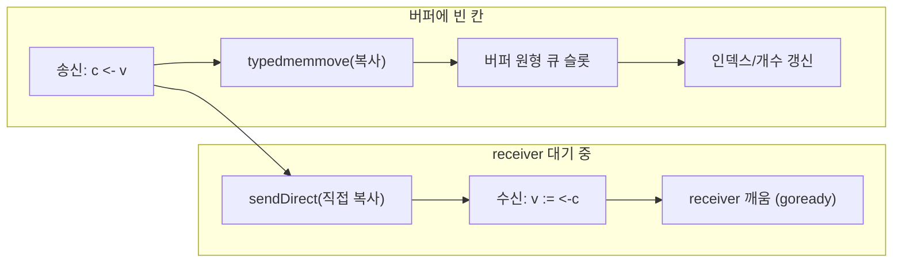
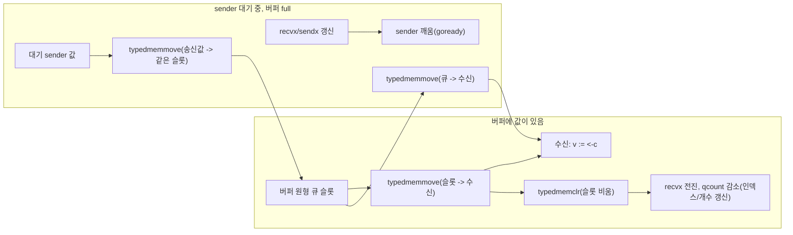

# 개요
이 글의 목표는 GoLang의 채널을 단순히 사용하는 게 아닌, 채널의 내부 구현을 파보면서 왜 동작할 수 있게 된지 이해 해본 뒤 이를 구현해봅시다.

# Go Chan

> Go에서 채널은 고루틴(Goroutine) 간에 데이터를 주고받고 실행을 동기화하기 위한 파이프로, 통신/차단/동기화 등을 할 수 있습니다. 채널의 철학은 "통신을 통한 메모리 공유(Do not communicate by sharing memory; instead, share memory by communicating)"로 정리되죠.

이는 전통적인 `Lock` 기반 메모리 공유 방식이 아닌, `goroutine`과 `channel`을 이용한 CSP 메시지 전달 모델을 의미합니다.
- `Lock`: 2개의 고루틴이 하나의 메모리에 접근할 때 `mu.Lock()`을 통해 메모리를 보호합니다.
- `CSP`: 2개의 고루틴은 메시지만 보내고 실제 메모리는 별도의 고루틴이 담당할 수 있게 하는 방식으로 메모리를 보호합니다.

Go는 2가지 모델을 지원해서 보다 편리한 메모리 관리가 가능합니다.
| 항목          | Lock 모델                | CSP 모델                     |
| ----------- | ---------------------- | -------------------------- |
| 기본 개념       | 공유 메모리를 동기화            | 메시지 전달                     |
| 상태 소유자      | 여러 goroutine           | 특정 goroutine               |
| 주요 도구       | Mutex, RWMutex, atomic | goroutine, channel, select |
| 코드 구조       | 공유 객체 중심               | 이벤트와 파이프라인 중심             |
| 데이터 접근      | 직접 접근                  | 메시지로 요청                    |
| Race 위험     | Lock 누락 시 높음           | 소유권이 명확하면 낮음               |
| Deadlock 위험 | Lock 순서 문제             | channel 송수신 구조 문제          |
| 성능          | 짧은 상태 보호에 유리           | 워크플로우 조정에 유리               |
| 복잡한 흐름      | Lock 관리가 어려워질 수 있음     | 흐름을 명시적으로 표현 가능            |
| 단순 카운터      | 적합                     | 과도할 수 있음                   |
| 작업 파이프라인    | 다소 부자연스러움              | 매우 적합                      |


# buffered/unbuffered 채널

`map`과 마찬가지로 `make`로 만들며 반환값은 원시 자료구조를 가리키는 참조처럼 동작합니다. <br/>
이때 버퍼 크기를 주는 걸로 `unbuffered`와 `buffered`을 구분해서 채널을 생성할 수 있습니다.

```go
ci := make(chan int)            // unbuffered channel of integers
cj := make(chan int, 0)         // unbuffered channel of integers
cs := make(chan *os.File, 100)  // buffered channel of pointers to Files
```

## unbuffered
unbuffered 채널은 값 교환(communication)과 동기화(synchronization)를 한 번에 묶어 주는 역할로 쓰이며, 주로 어느 정도 시간이 소요되는 백그라운드 작업이 끝났을 때 신호로 사용될 수 있습니다.
- 채널이 비어 있으면 receiver는 받을 데이터가 생길 때까지 block합니다. (buffered도 동일)
- unbuffered이면 sender는 receiver가 값을 받을 때까지 block합니다.

그래서 예시처럼 버퍼 없이 사용해 백그라운드 작업의 처리 완료를 표현 할 수 있습니다.
```go
c := make(chan int)  // Allocate a channel.
// Start the sort in a goroutine; when it completes, signal on the channel.
go func() {
    list.Sort()
    c <- 1  // Send a signal; value does not matter.
}()
doSomethingForAWhile()
<-c   // Wait for sort to finish; discard sent value.
```

## buffered
버퍼가 생기면 sender는 receiver를 직접 기다리지 않아도 됩니다.
빈 칸이 있으면 값을 버퍼에 복사하는 시점에 send가 끝나고, 버퍼가 가득 차면 receiver가 값을 꺼낼 때까지 기다립니다.
이런 점을 이용해 buffered channel을 세마포어처럼 쓸 수 있다고 설명합니다.
> 세마포어: 여러 프로세스나 스레드가 공유 자원에 동시에 접근하는 것을 조절하는 정수 변수 기반의 동기화 신호 장치

아래처럼 채널을 만들어 한 번에 처리할 수 있는 개수를 제한하는 로직으로 세마포어 개념을 보여줄 수 있죠.
- `MaxOutstanding`는 동시 `process` 수 상한.
- `Serve`가 만드는 고루틴 수 자체는 막지 않음.

**예제 설명**
1. Serve: 요청이 오면 `go handle(req)`로 고루틴을 바로 띄웁니다. 여기에는 세마포어가 없습니다.
2. handle: `sem <- 1`에서 버퍼 칸 하나를 채웁니다.
    - 아직 채워진 칸이 `MaxOutstanding` 미만이면 바로 `process`로 들어갑니다.
    - 이미 `MaxOutstanding`개가 차 있으면, 누군가 `<-sem`으로 칸을 비울 때까지 block합니다.
    - `process`가 끝나면 `<-sem`으로 칸을 비워, 막혀 있던 다른 handle이 진행할 수 있습니다.

```go
var sem = make(chan int, MaxOutstanding)

func handle(r *Request) {
    sem <- 1    // Wait for active queue to drain.
    process(r)  // May take a long time.
    <-sem       // Done; enable next request to run.
}

func Serve(queue chan *Request) {
    for {
        req := <-queue
        go handle(req)  // Don't wait for handle to finish.
    }
}
```

# Channel 내부구조

채널의 코드를 다음 구조체로 큰 골조를 파악해 볼 수 있습니다.
※ `hchan`인 이유는 Go 런타임 관례로 `h`가 `header`를 의미하기 때문이며, 이를 통해 채널 구조의 전체적인 흐름을 파악할 수 있습니다.
```go
// 채널 생성 시 실질적으로 참고하는 구조체
// 실제 채널 구현 구조체
type hchan struct {
	qcount   uint           // 버퍼에 들어 있는 원소 수
	dataqsiz uint           // 버퍼 용량 (0이면 unbuffered)
	buf      unsafe.Pointer // 원형 큐
	elemsize uint16         // 원소의 바이트 크기
	closed   uint32         // 닫힘 여부
	elemtype *_type         // 원소 타입 정보
	sendx    uint           // 다음에 쓸 칸의 인덱스
	recvx    uint           // 다음에 읽을 칸의 인덱스
	recvq    waitq          // 수신 대기 고루틴 큐
	sendq    waitq          // 송신 대기 고루틴 큐
	lock     mutex
}
// 고루틴 대기 큐
type waitq struct {
	first, last *sudog
}
// 채널 연산으로 park된 고루틴 한 명
type sudog struct {
	// g: 고루틴 런타임 객체로, 스케줄러가 실행/대기/재개를 다루는 단위
	// 대기 중인 고루틴
	g *g

	// linked list로 연결
	next *sudog
	prev *sudog

	elem unsafe.Pointer // 송수신 데이터의 메모리 위치
	c    *hchan         // 현재 sudog가 대기 중인 채널
}
```

## 채널 생성 (`makechan`)

`make(chan T, n)`은 런타임에서 `makechan`으로 실행됩니다.<br/>
여기서 `hchan`을 할당하고, buffered면 원형 버퍼(`buf`)까지 붙인 뒤 `elemsize`/`elemtype`/`dataqsiz` 등을 채워주죠.

```go
func makechan(t *chantype, size int) *hchan {
	elem := t.Elem
    // 버퍼에 필요한 바이트 수 계산
	mem, overflow := math.MulUintptr(elem.Size_, uintptr(size))
	// ... size / alignment 검사 생략 ...

	var c *hchan
	switch {
	case mem == 0:
		// unbuffered이거나 원소 크기가 0
		c = (*hchan)(mallocgc(hchanSize, nil, true))
		c.buf = c.raceaddr()
	case !elem.Pointers():
		// 포인터 없는 원소: hchan + buf를 한 번에 할당
		c = (*hchan)(mallocgc(hchanSize+mem, nil, true))
		c.buf = add(unsafe.Pointer(c), hchanSize)
	default:
		// 포인터 있는 원소: hchan과 buf를 따로 할당
		c = new(hchan)
		c.buf = mallocgc(mem, elem, true)
	}

	c.elemsize = uint16(elem.Size_)
	c.elemtype = elem
	c.dataqsiz = uint(size)
	lockInit(&c.lock, lockRankHchan)
	return c
}
```

할당 직후 `qcount`/`sendx`/`recvx`/`closed`는 0이되고 `dataqsiz`만 `n`으로 고정됩니다.<br/>
이후 `send`/`recv`는 이 헤더의 인덱스와 버퍼 칸만 바꿉니다.

## 채널 메모리

`hchan` 앞부분만 같은 레이아웃으로 읽어 보면, send/recv 전후에 필드가 어떻게 바뀌는지 직접 확인할 수 있습니다.

```bash
--- make(chan int, 4) ---
  qcount=0 dataqsiz=4 elemsize=8
  sendx=0 recvx=0 buf=0x140000be070 closed=0
--- send 10, 20 ---
  qcount=2 dataqsiz=4 elemsize=8
  sendx=2 recvx=0 buf=0x140000be070 closed=0
--- recv one ---
  qcount=1 dataqsiz=4 elemsize=8
  sendx=2 recvx=1 buf=0x140000be070 closed=0
--- fill near wrap ---
  qcount=4 dataqsiz=4 elemsize=8
  sendx=1 recvx=1 buf=0x140000be070 closed=0

--- make(chan int) unbuffered ---
  qcount=0 dataqsiz=0 elemsize=8
  sendx=0 recvx=0 buf=0x1400009a080 closed=0
recv: 99
--- after unbuffered rendezvous ---
  qcount=0 dataqsiz=0 elemsize=8
  sendx=0 recvx=0 buf=0x1400009a080 closed=0
```

- `dataqsiz`는 버퍼 용량이고 `make` 때 고정됩니다. 들어 있는 개수는 `qcount`입니다.
- `sendx`/`recvx`는 `buf`에서 다음에 쓸/읽을 칸이며, send와 recv마다 각각만 전진합니다.
- 인덱스가 같아도 빈 상태와 가득 찬 상태는 `qcount`로 구분합니다.
- 같은 채널에서 `buf` 주소는 바뀌지 않고, 칸의 값과 인덱스만 바뀝니다.
- unbuffered(`dataqsiz=0`)는 맞교환 후에도 `qcount`가 0입니다.

## 메시지 송신 (`chansend`)

`c <- v`는 런타임에서 `chansend`로 들어가며, `lock`을 잡은 뒤 3가지 동작 중에 하나를 진행합니다.

1. `recvq`에 대기 receiver가 있으면 버퍼를 거치지 않고 바로 복사(`send` → `sendDirect`)한 뒤 `goready`로 깨웁니다.
2. 버퍼에 빈 칸이 있으면 `buf[sendx]`에 넣고 `sendx`/`qcount`를 갱신합니다.
3. 둘 다 아니면 버퍼가 가득찼거나 버퍼가 없는 경우로 `sudog`를 `sendq`에 넣고 `gopark`로 잠듭니다.



- `typedmemmove`: 런타임이 타입 크기만큼 메모리를 복사하는 연산.
- `sendDirect`: 수신 대기 고루틴의 목적지로 직접 복사하는 경로.
- `goready`: 대기 중인 고루틴을 깨워 실행 가능 상태로 만드는 호출.

```go
func chansend(c *hchan, ep unsafe.Pointer, block bool, callerpc uintptr) bool {
	lock(&c.lock)
	if c.closed != 0 {
		unlock(&c.lock)
		panic(plainError("send on closed channel"))
	}

	// 1) 대기 중인 receiver가 있으면 직접 전달
	if sg := c.recvq.dequeue(); sg != nil {
		send(c, sg, ep, func() { unlock(&c.lock) }, 3)
		return true
	}

	// 2) 버퍼에 빈 칸이 있으면 원형 큐에 enqueue
	if c.qcount < c.dataqsiz {
		qp := chanbuf(c, c.sendx)
		typedmemmove(c.elemtype, qp, ep)
		c.sendx++
		if c.sendx == c.dataqsiz {
			c.sendx = 0
		}
		c.qcount++
		unlock(&c.lock)
		return true
	}

	// 3) 막힘: sudog를 sendq에 걸고 park
	gp := getg()
	mysg := acquireSudog()
	mysg.elem = ep
	mysg.g = gp
	mysg.c = c
	c.sendq.enqueue(mysg)
	gopark(chanparkcommit, unsafe.Pointer(&c.lock), waitReasonChanSend, traceBlockChanSend, 2)
	// ... 깨어난 뒤 sudog 정리 ...
	return true
}
```

## 메시지 수신 (`chanrecv`)

`<-c`는 `chanrecv`로 들어갑니다. 송신과 마찬가지로 3가지 동작으로 나뉩니다.

1. `sendq`에 대기 sender가 있으면 `recv`로 값을 받아 오고 sender를 `goready`합니다.
2. 버퍼에 값이 있으면 `buf[recvx]`에서 읽고 슬롯을 비운 뒤 `recvx`/`qcount`를 갱신합니다.
3. 둘 다 아니면 `sudog`를 `recvq`에 넣고 `gopark`로 잠듭니다.



- `typedmemmove`: 런타임이 타입 크기만큼 메모리를 복사하는 연산.
- `typedmemclr`: 런타임이 타입 단위로 메모리를 지워 버퍼 슬롯을 비우는 연산.
- `goready`: 대기 중인 고루틴을 깨워 실행 가능 상태로 만드는 호출.

```go
func chanrecv(c *hchan, ep unsafe.Pointer, block bool) (selected, received bool) {
	lock(&c.lock)

	// 1) 대기 중인 sender가 있으면 직접/버퍼 경유로 수신
	if c.closed == 0 {
		if sg := c.sendq.dequeue(); sg != nil {
			recv(c, sg, ep, func() { unlock(&c.lock) }, 3)
			return true, true
		}
	}

	// 2) 버퍼에 값이 있으면 dequeue
	if c.qcount > 0 {
		qp := chanbuf(c, c.recvx)
		if ep != nil {
			typedmemmove(c.elemtype, ep, qp)
		}
		typedmemclr(c.elemtype, qp)
		c.recvx++
		if c.recvx == c.dataqsiz {
			c.recvx = 0
		}
		c.qcount--
		unlock(&c.lock)
		return true, true
	}

	// 3) 막힘: sudog를 recvq에 걸고 park
	gp := getg()
	mysg := acquireSudog()
	mysg.elem = ep
	mysg.g = gp
	mysg.c = c
	c.recvq.enqueue(mysg)
	gopark(chanparkcommit, unsafe.Pointer(&c.lock), waitReasonChanReceive, traceBlockChanRecv, 2)
	// ... 깨어난 뒤 sudog 정리 ...
	return true, mysg.success
}
```

# GMP

GMP는 Go 런타임 스케줄러가 고루틴을 "논리적으로 준비(대기)" 상태에서 "실행 가능" 상태로 바꾸고, 결국 OS 스레드에서 실제 코드 실행까지 연결하기 위한 핵심 모델입니다.

- `G`: 고루틴 런타임 객체로, 스택과 실행 상태를 담습니다.
- `P`: `Go` 코드를 실행하기 위한 논리적 실행 자원으로, 로컬 `run queue`를 가집니다.
- `M`: OS 스레드를 대표하며, `P`를 가진 상태에서 실제로 명령을 실행합니다.

# 직접 만들기
## 목표 범위
## 구현과 검증