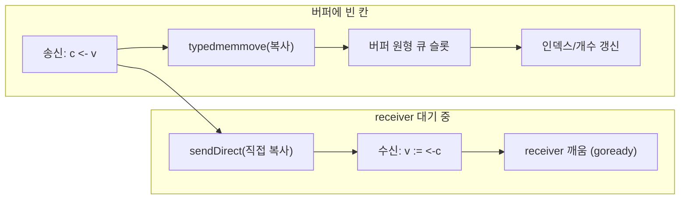
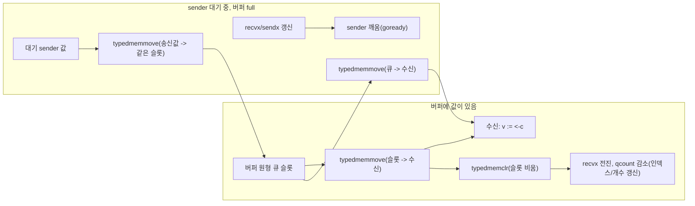
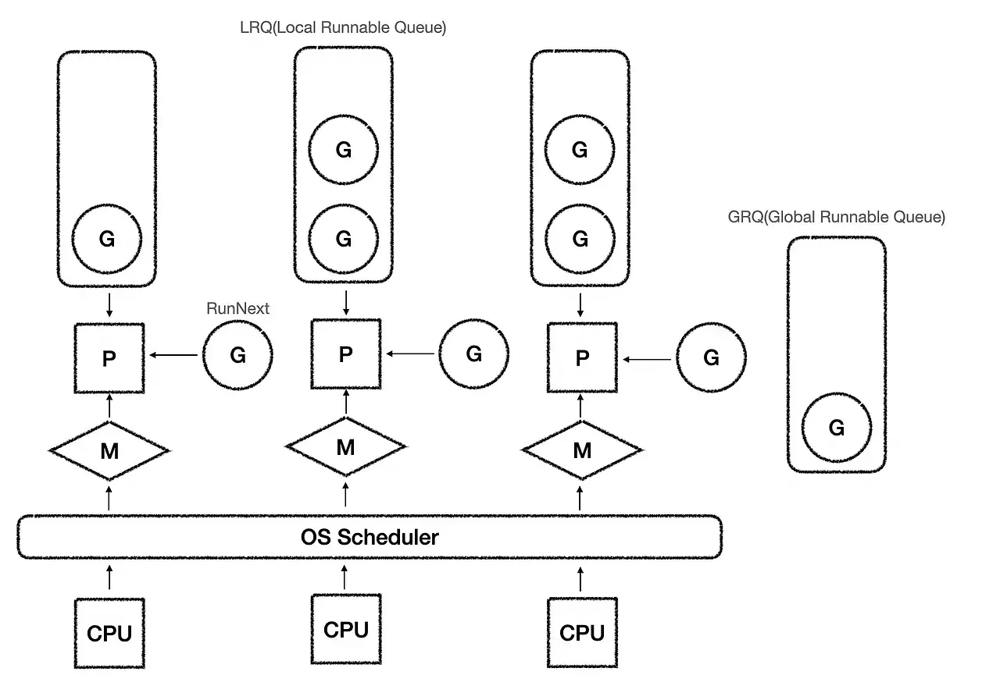
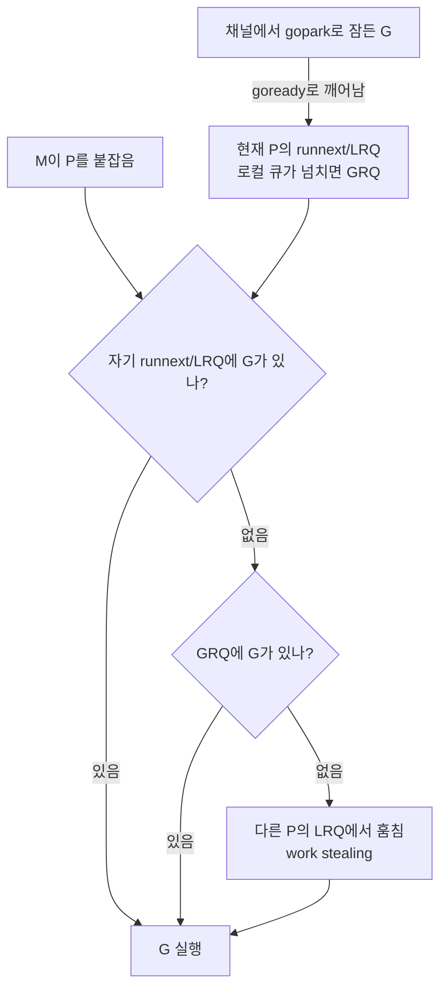
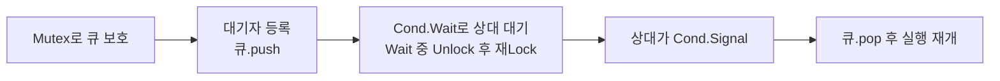
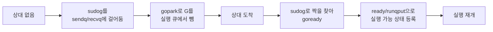

## 개요
이 글의 목표는 Go 채널을 사용법만 나열하는 것이 아니라, 런타임 내부 구조를 따라가며 왜 그렇게 동작하는지 이해하는 것입니다. 앞부분에서는 `chan.go`의 생성, 송수신, 버퍼 구조를 읽고, 뒷부분에서는 내부 스케줄 정책을 바꾸지 않은 채 관측 훅을 붙여 채널이 GMP 대기 경로와 실제 로직이 어떻게 맞닿는지 실험으로 확인합니다.

런타임 코드 인용 기준은 `go1.26.5`의 `src/runtime/chan.go`입니다. <br/>
`send`/`recv`의 큰 흐름은 이전 버전과 같되, `hchan`에 `timer` 채널과 `synctest`용 필드가 추가된 점만 구분해서 보면 됩니다.

## Go Chan

> Go에서 채널은 고루틴(Goroutine) 간에 데이터를 주고받고 실행을 동기화하기 위한 파이프로, 통신/차단/동기화 등을 할 수 있습니다. 채널의 철학은 "통신을 통한 메모리 공유(Do not communicate by sharing memory; instead, share memory by communicating)"로 정리되죠.

이는 전통적인 `Lock` 기반 메모리 공유 방식이 아닌, `goroutine`과 `channel`을 이용한 CSP 메시지 전달 모델을 의미합니다.
- `Lock`: 2개의 고루틴이 하나의 메모리에 접근할 때 `mu.Lock()`을 통해 메모리를 보호합니다.
- `CSP`: 2개의 고루틴은 메시지만 보내고 실제 메모리는 별도의 고루틴이 담당할 수 있게 하는 방식으로 메모리를 보호합니다.

Go는 두 가지 모델을 지원해 보다 편리한 메모리 관리가 가능합니다.
| 항목          | Lock 모델                | CSP 모델                     |
| ----------- | ---------------------- | -------------------------- |
| 기본 개념       | 공유 메모리를 동기화            | 메시지 전달                     |
| 상태 소유자      | 여러 goroutine           | 특정 goroutine               |
| 주요 도구       | Mutex, RWMutex, atomic | goroutine, channel, select |
| 코드 구조       | 공유 객체 중심               | 이벤트와 파이프라인 중심             |
| 데이터 접근      | 직접 접근                  | 메시지로 요청                    |
| Race 위험     | Lock 누락 시 높음           | 소유권이 명확하면 낮음               |
| Deadlock 위험 | Lock 순서 문제             | channel 송수신 구조 문제          |
| 성능          | 짧은 상태 보호에 유리           | 워크플로우 조정에 유리               |
| 복잡한 흐름      | Lock 관리가 어려워질 수 있음     | 흐름을 명시적으로 표현 가능            |
| 단순 카운터      | 적합                     | 과도할 수 있음                   |
| 작업 파이프라인    | 다소 부자연스러움              | 매우 적합                      |


## buffered/unbuffered 채널

`map`과 마찬가지로 `make`로 만들며 반환값은 원시 자료구조를 가리키는 참조처럼 동작합니다. <br/>
이때 버퍼 크기를 주는 걸로 `unbuffered`와 `buffered`를 구분해서 채널을 생성할 수 있습니다.

```go
ci := make(chan int)            // unbuffered channel of integers
cj := make(chan int, 0)         // unbuffered channel of integers
cs := make(chan *os.File, 100)  // buffered channel of pointers to Files
```

### unbuffered
unbuffered 채널은 값 교환(communication)과 동기화(synchronization)를 한 번에 묶어 주는 역할로 쓰이며, 주로 어느 정도 시간이 소요되는 백그라운드 작업이 끝났을 때 신호로 사용될 수 있습니다.
- 채널이 비어 있으면 receiver는 받을 데이터가 생길 때까지 block합니다. (buffered도 동일)
- unbuffered이면 sender는 receiver가 값을 받을 때까지 block합니다.

그래서 예시처럼 버퍼 없이 사용해 백그라운드 작업의 처리 완료를 표현할 수 있습니다.
```go
c := make(chan int)  // Allocate a channel.
// Start the sort in a goroutine; when it completes, signal on the channel.
go func() {
    list.Sort()
    c <- 1  // Send a signal; value does not matter.
}()
doSomethingForAWhile()
<-c   // Wait for sort to finish; discard sent value.
```

### buffered
버퍼가 생기면 sender는 receiver를 직접 기다리지 않아도 됩니다.
빈 칸이 있으면 값을 버퍼에 복사하는 시점에 send가 끝나고, 버퍼가 가득 차면 receiver가 값을 꺼낼 때까지 기다립니다.
이런 점을 이용해 buffered channel을 세마포어처럼 쓸 수 있다고 설명합니다.
> 세마포어: 여러 프로세스나 스레드가 공유 자원에 동시에 접근하는 것을 조절하는 정수 변수 기반의 동기화 신호 장치

아래처럼 채널을 만들어 한 번에 처리할 수 있는 개수를 제한하는 로직으로 세마포어 개념을 보여줄 수 있죠.
- `MaxOutstanding`는 동시 `process` 수 상한.
- `Serve`가 만드는 고루틴 수 자체는 막지 않음.

**예제 설명**
1. Serve: 요청이 오면 `go handle(req)`로 고루틴을 바로 띄웁니다. 여기에는 세마포어가 없습니다.
2. handle: `sem <- 1`에서 버퍼 칸 하나를 채웁니다.
    - 아직 채워진 칸이 `MaxOutstanding` 미만이면 바로 `process`로 들어갑니다.
    - 이미 `MaxOutstanding`개가 차 있으면, 누군가 `<-sem`으로 칸을 비울 때까지 block합니다.
    - `process`가 끝나면 `<-sem`으로 칸을 비워, 막혀 있던 다른 handle이 진행할 수 있습니다.

```go
var sem = make(chan int, MaxOutstanding)

func handle(r *Request) {
    sem <- 1    // Wait for active queue to drain.
    process(r)  // May take a long time.
    <-sem       // Done; enable next request to run.
}

func Serve(queue chan *Request) {
    for {
        req := <-queue
        go handle(req)  // Don't wait for handle to finish.
    }
}
```

## Channel 내부 구조

채널의 코드를 다음 구조체로 큰 골조를 파악할 수 있습니다.
Go 런타임은 채널의 구체적인 상태를 `hchan` 구조체에 저장합니다.
- `hchan`인 이유는 Go 런타임 관례로 `h`가 `header`를 의미합니다, 이를 통해 채널 
구조의 전체적인 흐름을 파악할 수 있습니다.
```go
// 채널 생성 시 실질적으로 참고하는 구조체
// 실제 채널 구현 구조체 (go1.26.5)
type hchan struct {
	qcount   uint           // 버퍼에 들어 있는 원소 수
	dataqsiz uint           // 버퍼 용량 (0이면 unbuffered)
	buf      unsafe.Pointer // 원형 큐
	elemsize uint16         // 원소의 바이트 크기
	closed   uint32         // 닫힘 여부
	timer    *timer         // time.Ticker/After 등이 이 채널에 연결될 때
	elemtype *_type         // 원소 타입 정보
	sendx    uint           // 다음에 쓸 칸의 인덱스
	recvx    uint           // 다음에 읽을 칸의 인덱스
	recvq    waitq          // 수신 대기 고루틴 큐
	sendq    waitq          // 송신 대기 고루틴 큐
	bubble   *synctestBubble // testing/synctest 버블(격리된 공간)일 때
	lock     mutex
}
// 고루틴 대기 큐
type waitq struct {
	first, last *sudog
}
// park된 고루틴을 가리키는 대기 큐 노드 하나
// 런타임 주석에서는 sudog를 pseudo-g라고 설명
// 큐에 고루틴 본체가 아닌 포인터, 데이터 위치, 채널을 담은 sudog로 대기시켜 관계를 유지함
type sudog struct {
	// g: 고루틴 런타임 객체로, 스케줄러가 실행/대기/재개를 다루는 단위
	// 대기 중인 고루틴
	g *g

	// linked list로 연결
	next *sudog
	prev *sudog

	elem unsafe.Pointer // 송수신 데이터의 메모리 위치 (실제 타입은 maybeTraceablePtr)
	c    *hchan         // 현재 sudog가 대기 중인 채널 (실제 타입은 maybeTraceableChan)
}
```

### 채널 생성 (`makechan`)

`make(chan T, n)`은 런타임에서 `makechan`으로 실행됩니다.<br/>
여기서 `hchan`을 할당하고, buffered면 원형 버퍼(`buf`)까지 붙인 뒤 `elemsize`/`elemtype`/`dataqsiz` 등을 채워주죠.

```go
func makechan(t *chantype, size int) *hchan {
	elem := t.Elem
    // 버퍼에 필요한 바이트 수 계산
	mem, overflow := math.MulUintptr(elem.Size_, uintptr(size))
	// ... size / alignment 검사 생략 ...

	var c *hchan
	switch {
	case mem == 0:
		// unbuffered이거나 원소 크기가 0
		c = (*hchan)(mallocgc(hchanSize, nil, true))
		c.buf = c.raceaddr()
	case !elem.Pointers():
		// 포인터 없는 원소: hchan + buf를 한 번에 할당
		c = (*hchan)(mallocgc(hchanSize+mem, nil, true))
		c.buf = add(unsafe.Pointer(c), hchanSize)
	default:
		// 포인터 있는 원소: hchan과 buf를 따로 할당
		c = new(hchan)
		c.buf = mallocgc(mem, elem, true)
	}

	c.elemsize = uint16(elem.Size_)
	c.elemtype = elem
	c.dataqsiz = uint(size)
	if b := getg().bubble; b != nil {
		c.bubble = b
	}
	lockInit(&c.lock, lockRankHchan)
	return c
}
```

할당 직후 `qcount`/`sendx`/`recvx`/`closed`는 0이 되고 `dataqsiz`만 `n`으로 고정됩니다.<br/>
`go1.26`부터는 생성 고루틴이 `synctest` 버블 안에 있으면 `bubble`도 같이 기록됩니다. 일반 채널에서 해당 필드는 nil입니다.<br/>
이후 `send`/`recv`는 이 헤더의 인덱스와 버퍼 칸만 바꿉니다.

### 채널 메모리

`hchan` 앞부분만 같은 레이아웃으로 읽어 보면, send/recv 전후에 필드가 어떻게 바뀌는지 직접 확인할 수 있습니다.

```bash
--- make(chan int, 4) ---
  qcount=0 dataqsiz=4 elemsize=8
  sendx=0 recvx=0 buf=0x140000be070 closed=0
--- send 10, 20 ---
  qcount=2 dataqsiz=4 elemsize=8
  sendx=2 recvx=0 buf=0x140000be070 closed=0
--- recv one ---
  qcount=1 dataqsiz=4 elemsize=8
  sendx=2 recvx=1 buf=0x140000be070 closed=0
--- fill near wrap ---
  qcount=4 dataqsiz=4 elemsize=8
  sendx=1 recvx=1 buf=0x140000be070 closed=0

--- make(chan int) unbuffered ---
  qcount=0 dataqsiz=0 elemsize=8
  sendx=0 recvx=0 buf=0x1400009a080 closed=0
recv: 99
--- after unbuffered rendezvous ---
  qcount=0 dataqsiz=0 elemsize=8
  sendx=0 recvx=0 buf=0x1400009a080 closed=0
```

- `dataqsiz`는 버퍼 용량이고 `make` 때 고정됩니다. 들어 있는 개수는 `qcount`입니다.
- `sendx`/`recvx`는 `buf`에서 다음에 쓸/읽을 칸이며, send와 recv마다 각각만 전진합니다.
- 인덱스가 같아도 빈 상태와 가득 찬 상태는 `qcount`로 구분합니다.
- 같은 채널에서 `buf` 주소는 바뀌지 않고, 칸의 값과 인덱스만 바뀝니다.
- unbuffered(`dataqsiz=0`)는 맞교환 후에도 `qcount`가 0입니다.

### 메시지 송신 (`chansend`)

`c <- v`는 런타임에서 `chansend`로 들어가며, `lock`을 잡은 뒤 3가지 동작 중 하나를 진행합니다.

1. `recvq`에 대기 receiver가 있으면 버퍼를 거치지 않고 바로 복사(`send` → `sendDirect`)한 뒤 `goready`로 깨웁니다.
2. 버퍼에 빈 칸이 있으면 `buf[sendx]`에 넣고 `sendx`/`qcount`를 갱신합니다.
3. 둘 다 아니면 버퍼가 가득 찼거나 버퍼가 없는 경우로 `sudog`를 `sendq`에 넣고 `gopark`로 잠듭니다.



- `typedmemmove`: 런타임이 타입 크기만큼 메모리를 복사하는 연산.
- `sendDirect`: 수신 대기 고루틴의 목적지로 직접 복사하는 경로.
- `goready`: 대기 중인 고루틴을 깨워 실행 가능 상태로 만드는 호출.

```go
func chansend(c *hchan, ep unsafe.Pointer, block bool, callerpc uintptr) bool {
	lock(&c.lock)
	if c.closed != 0 {
		unlock(&c.lock)
		panic(plainError("send on closed channel"))
	}

	// 1) 대기 중인 receiver가 있으면 직접 전달
	if sg := c.recvq.dequeue(); sg != nil {
		send(c, sg, ep, func() { unlock(&c.lock) }, 3)
		return true
	}

	// 2) 버퍼에 빈 칸이 있으면 원형 큐에 enqueue
	if c.qcount < c.dataqsiz {
		qp := chanbuf(c, c.sendx)
		typedmemmove(c.elemtype, qp, ep)
		c.sendx++
		if c.sendx == c.dataqsiz {
			c.sendx = 0
		}
		c.qcount++
		unlock(&c.lock)
		return true
	}

	// 3) 막힘: sudog를 sendq에 걸고 park
	gp := getg()
	mysg := acquireSudog()
	mysg.elem = ep
	mysg.g = gp
	mysg.c = c
	c.sendq.enqueue(mysg)
	gopark(chanparkcommit, unsafe.Pointer(&c.lock), waitReasonChanSend, traceBlockChanSend, 2)
	// ... 깨어난 뒤 sudog 정리 ...
	return true
}
```

### 메시지 수신 (`chanrecv`)

`<-c`는 `chanrecv`로 들어갑니다. 송신과 마찬가지로 3가지 동작으로 나뉩니다.

1. `sendq`에 대기 sender가 있으면 `recv`로 값을 받아 오고 sender를 `goready`합니다.
2. 버퍼에 값이 있으면 `buf[recvx]`에서 읽고 슬롯을 비운 뒤 `recvx`/`qcount`를 갱신합니다.
3. 둘 다 아니면 `sudog`를 `recvq`에 넣고 `gopark`로 잠듭니다.



- `typedmemmove`: 런타임이 타입 크기만큼 메모리를 복사하는 연산.
- `typedmemclr`: 런타임이 타입 단위로 메모리를 지워 버퍼 슬롯을 비우는 연산.
- `goready`: 대기 중인 고루틴을 깨워 실행 가능 상태로 만드는 호출.

```go
func chanrecv(c *hchan, ep unsafe.Pointer, block bool) (selected, received bool) {
	lock(&c.lock)

	// 1) 대기 중인 sender가 있으면 직접/버퍼 경유로 수신
	if c.closed == 0 {
		if sg := c.sendq.dequeue(); sg != nil {
			recv(c, sg, ep, func() { unlock(&c.lock) }, 3)
			return true, true
		}
	}

	// 2) 버퍼에 값이 있으면 dequeue
	if c.qcount > 0 {
		qp := chanbuf(c, c.recvx)
		if ep != nil {
			typedmemmove(c.elemtype, ep, qp)
		}
		typedmemclr(c.elemtype, qp)
		c.recvx++
		if c.recvx == c.dataqsiz {
			c.recvx = 0
		}
		c.qcount--
		unlock(&c.lock)
		return true, true
	}

	// 3) 막힘: sudog를 recvq에 걸고 park
	gp := getg()
	mysg := acquireSudog()
	mysg.elem = ep
	mysg.g = gp
	mysg.c = c
	c.recvq.enqueue(mysg)
	gopark(chanparkcommit, unsafe.Pointer(&c.lock), waitReasonChanReceive, traceBlockChanRecv, 2)
	// ... 깨어난 뒤 sudog 정리 ...
	return true, mysg.success
}
```

## GMP

`GMP`는 Go 런타임이 고루틴(`G`)을 논리 프로세서(`P`)의 실행 큐에 두고, OS 스레드(`M`)가 `P`를 통해 실행하는 스케줄링 메커니즘입니다. 채널은 `sudog`로 대기 중인 `G`를 연결하고 `goready`로 깨우므로 이 스케줄러와 맞닿아 있습니다.



- `G` (Goroutine): 고루틴 런타임 객체로, 스택과 실행 상태를 담습니다.
- `P` (Processor): Go 코드를 실행하기 위한 논리적 실행 자원으로, 각각의 P마다 로컬 run queue를 가집니다.
- `M` (Machine): OS 스레드를 대표하며, `P`를 가진 상태에서 실제로 명령을 실행합니다.

<b> 주의 </b>

※ `P`는 OS 프로세스가 아니며 Processor, 즉 Go 런타임 안의 논리 프로세서입니다.<br/>
※ `M`은 물리 머신이 아니고 Machine이라는 이름일 뿐, 실제로는 OS 스레드를 가리킵니다.

### LRQ와 GRQ

고루틴은 바로 CPU에서 실행되지 않고, 내부 큐에 의해 실행 순서가 배정됩니다.

- `LRQ` (Local Run Queue): 각 `P`가 가진 로컬 실행 큐입니다. 그 `P`에서 만든 고루틴이나 최근에 돌던 고루틴이 주로 여기 들어갑니다.
- `GRQ` (Global Run Queue): 모든 `P`가 공유하는 전역 실행 큐입니다. 로컬 큐가 가득 차 일부 작업을 넘기거나 전역 실행 대기 작업을 둘 때 사용합니다.

실행 흐름은 대략 이렇습니다.



위 그림은 실행 큐 탐색을 단순화한 흐름입니다. 실제 스케줄러는 공정성을 위해 `GRQ`를 주기적으로 확인하고, 로컬 작업이 없으면 `GRQ`와 다른 `P`의 `LRQ`에서 실행할 `G`를 찾습니다.

채널에서 block되면 해당 `G`는 `gopark`로 실행 큐에서 빠집니다. 상대방이 오면 `sudog`를 통해 `goready`되고, `ready`와 `runqput`을 거쳐 일반적으로 현재 `P`의 `runnext`나 `LRQ`에 등록됩니다. 로컬 큐가 넘치면 일부 작업이 `GRQ`로 이동할 수 있습니다.

다음 절의 관측 훅은 채널 ID, 완료 이벤트와 park 시간을 기록합니다. 실행 큐 배치 자체는 기록하지 않으며, `gopark`와 `goready` 이후의 연결은 기존 런타임 코드 경로를 근거로 해석합니다.

## Go 런타임 관측해보기

애플리케이션에서 큐를 만들어 GMP식 대기와 실행을 흉내 낼 수도 있습니다.

<b>애플리케이션 채널 구현하기</b>


`Mutex`는 큐를 동시에 만지지 않게 막는 잠금이고, 상대를 기다리는 대기는 `Cond.Wait`가 담당합니다.<br/>
하지만 Go 런타임이라는 좋은 자료가 있으니, 그 로직을 따라가며 이해해 봅시다.

<b>런타임 채널 흐름</b>


### 의도

스케줄 정책과 채널 의미론은 기존 로직을 유지하며 채널의 생성과 완료된 send/recv, park 시간, deadlock 순간의 대기 관계를 관측하는 것이 목표입니다. 이를 기존 `sudog`, `gopark`, `goready` 코드 경로와 연결해 채널이 GMP와 맞닿는 지점을 해석합니다.

### 로직

환경 변수 `GOCHANTRACE`(`off` / `on` / `sample`)로 채널의 핵심 경로에 기록을 붙였습니다. 새 파일은 `runtime/chantrace.go`이고, 호출은 기존 `chan.go`와 `proc.go`에 최소로 넣었습니다.

기록하는 지점은 다음과 같습니다.
- `makechan`: `hchan.id` 할당 후 create 이벤트
- `chansend` / `chanrecv`: 완료 시점에 send/recv, park했다면 `blocked_ns`, handoff면 peer goid
- `closechan`: close 이벤트

※ `fmt`/JSON/파일 I/O 없이 고정 크기 ring과 atomic만 사용합니다.

핵심 수정은 아래와 같습니다.<br/>
`hchan`에 ID를 추가하고 `makechan`에서 할당해 추적이 가능하게 합니다.

```go
// runtime/chan.go — hchan
bubble   *synctestBubble
id       uint64 // chantrace channel ID

// makechan 끝부분
c.id = chantraceNextID.Add(1)
if chantraceEnabled() {
    chantraceRecord(chanEvent{
        kind:     chanEvCreate,
        chanID:   c.id,
        goid:     gp.goid,
        dataqsiz: uint32(c.dataqsiz),
        qcount:   0,
    })
}
```

이벤트는 고정 크기 레코드로 ring에만 쌓습니다.

```go
// runtime/chantrace.go
type chanEvent struct {
    kind      chanEventKind
    chanID    uint64
    goid      uint64
    peerGoid  uint64
    ts        int64
    qcount    uint32
    dataqsiz  uint32
    blockedNS int64
}
```

이번에 관측을 위해 `chantraceRing`을 추가합니다. `buf`와 `sendq`/`recvq`는 기존 런타임 구조로 참고합니다.

| 구조 | 위치 | 하는 일 |
| --- | --- | --- |
| `hchan.buf` 원형 큐 | 채널 데이터 버퍼 | 값 저장. `q`/`util`이 여기 점유율을 봄 |
| `sendq` / `recvq` (`sudog`) | 채널 대기자 리스트 | 상대가 없어 `gopark`한 G를 매달아 둠 |
| `chantraceRing` | `chantrace.go` 고정 배열 | create/send/recv/close 이벤트를 관측용으로 쌓기 위해 추가 |

```go
// 데이터 버퍼 (점유율 = util)
buf      unsafe.Pointer
qcount   uint
dataqsiz uint

// 대기자 큐 (GMP park 대상)
recvq waitq // *sudog 리스트
sendq waitq

// 관측 ring (채널 대기열이 아님)
chantraceRing [65536]chanEvent
```

상대가 없으면 `sudog`가 `sendq`/`recvq`에 걸리고 `gopark`로 실행 큐에서 빠집니다. 그 대기는 완료 이벤트가 생기기 전까지 `chantraceRing`에 send/recv로 안 남습니다.
park 구간만 `blocked_ns`로 잽니다. send/recv 모두 같은 패턴입니다.

```go
// runtime/chan.go — chansend / chanrecv block 경로
var blockStart int64
if chantraceEnabled() {
    blockStart = nanotime()
}
gopark(chanparkcommit, unsafe.Pointer(&c.lock), reason, ...)

var blockedNS int64
if blockStart != 0 {
    blockedNS = nanotime() - blockStart
}
chantraceRecordOp(chanEvSend /* 또는 chanEvRecv */, c, blockedNS)
```

`proc.go`는 스케줄러와 프로세스 수명 주기를 담당하는 파일입니다. <br/>
채널 연산 자체는 `chan.go`에서 담당하지만, 종료와 `deadlock`처럼 덤프 타이밍은 `proc.go`에 걸었습니다.
`schedinit`에서 `chantraceInit`으로 모드를 읽고, 정상 종료 경로에서 ring을 출력하며, `checkdead`가 전역 deadlock을 확정한 뒤 fatal 직전에 wait graph를 남깁니다.

```go
// runtime/proc.go

// schedinit: GOCHANTRACE 모드 초기화
chantraceInit()

// 정상 종료: ring → 이벤트/util/digraph 덤프
chantraceMaybeDumpOnExit() // GOCHANTRACE_DUMP=0 이면 no-op

// checkdead, fatal 직전: 아직 park 중인 G의 대기 채널
chantraceDumpWaitGraph() // waitreason + sudog.c
if chantraceEnabled() {
    chantraceDump() // 이벤트, util, digraph
}
fatal("all goroutines are asleep - deadlock!")
```

send/recv 의미와 work stealing 같은 큐 정책은 바꾸지 않았습니다.

#### 추적

실측 환경은 darwin/arm64, 툴체인 기준 `go1.26.5`입니다. <br/>
dump에는 런타임 내부 채널도 섞이므로, 아래는 사용자 시나리오의 `id=3` 전후만 골랐습니다.
이 실행에서는 `id=1`이 GC 기동용, `id=2`가 `main_init_done`, 첫 사용자 채널이 `id=3`으로 생성됐습니다. ID는 실행 중 채널 생성 순서에 따라 달라지는 값이며 고정값이 아닙니다. 

같은 실행에서 동일한 ID로 send/recv/close가 이어지면 한 채널의 타임라인으로 읽을 수 있습니다.
아래 unbuffered와 buffered 묶음은 각각 별도 실행에서 얻은 결과이므로 두 실행의 첫 사용자 채널이 모두 `id=3`입니다.

```bash
# unbuffered, park 대기 (cap=0)
chan create id=3 cap=0 goid=1
chan send id=3 goid=19 q=0/0 blocked_ns=0
chan recv id=3 goid=1 q=0/0 blocked_ns=51049333

# buffered 즉시 완료 (cap=1)
chan send id=3 goid=1 q=1/1 blocked_ns=0
chan recv id=3 goid=1 q=0/1 blocked_ns=0
```

한 줄 포맷은 `chan <종류> id=... goid=... q=... blocked_ns=...`입니다. 위 buffered 두 줄은 이렇게 읽습니다.

| 키워드 | 의미 | 예시 (`q=1/1` 줄) |
| --- | --- | --- |
| `chan` | 채널 관측 이벤트 접두사 | `chan` |
| `send` / `recv` / `create` / `close` | 이벤트 종류 | `send` (송신 완료) |
| `id` | 채널 전역 ID (`hchan.id`) | `id=3` |
| `goid` | 이 연산을 수행한 고루틴 ID | `goid=1` |
| `cap` | create 때만. `dataqsiz`(`make` 때 정한 버퍼 용량) | create의 `cap=0` |
| `q` | 완료 직후 `qcount`/`dataqsiz`. `qcount`는 버퍼에 들어 있는 원소 수 | `q=1/1` → 1칸 중 1칸 사용 |
| `blocked_ns` | `gopark`로 대기한 나노초. 즉시 완료면 `0` | `blocked_ns=0` |

| `q` 예시 | 의미 |
| --- | --- |
| `q=1/1` | send 직후 버퍼가 가득 참 |
| `q=0/1` | recv 직후 버퍼가 비어 있음 |
| `q=0/0` | unbuffered. 용량 0 |

`receive`가 약 50ms sleep을 기다리는 block 실험에서 `blocked_ns=51049333`(약 `51.05ms`)가 나왔습니다.<br/>
이미 대기 중인 receiver에게 바로 전달한 send와, 버퍼만 쓰는 즉시 완료 경로는 `blocked_ns=0`이었습니다.
채널 연산이 얼마나 기다렸는지에 대한 park 구간을 수치로 파악할 수 있게 되었죠.

#### 버퍼 사용률

버퍼 사용률(`util`)은 앞의 `hchan.buf` 원형 큐가 얼마나 찼는지를 dump 때 요약한 값입니다.<br/>
이벤트마다 `q`만 보면 타임라인은 보이지만 채널별 점유 상태는 한눈에 파악하기 어렵습니다. 그래서 ring에 기록된 이벤트 시점의 `q`를 `cur`/`avg`/`max`로 요약합니다. `avg`는 시간 가중 평균이 아니라 관측된 이벤트 표본의 평균입니다.

```bash
chan create id=3 cap=2 goid=1
chan send id=3 goid=1 q=1/2 blocked_ns=0
chan send id=3 goid=1 q=2/2 blocked_ns=0
chan recv id=3 goid=1 q=1/2 blocked_ns=0
chan create id=4 cap=0 goid=1
chantrace util summary
chan id=3 util cur=0.50 avg=0.50 max=1.00 q=1/2
chan id=4 util n/a (unbuffered)
```

| util 항목 | 의미 |
| --- | --- |
| `cur` | 마지막 샘플의 `qcount / dataqsiz` |
| `avg` | 이벤트 표본의 `qcount` 합 / (표본 수 × 용량). create의 `q=0`도 포함 |
| `max` | 관측 구간에서 본 최대 `qcount / dataqsiz` (한 번이라도 가득 찼으면 `1.00`) |
| `n/a` | `dataqsiz==0` (unbuffered) |

위 `id=3`은 create(`0`) + send(`1`) + send(`2`) + recv(`1`) 표본입니다. 마지막은 `q=1/2`라 `cur=0.50`이고, 중간에 `q=2/2`가 있어 관측 중 가장 큰 값은 `max=1.00`입니다. 이벤트 표본 기준 `avg`는 `(0+1+2+1)/(4×2)=0.50`입니다.

#### 미완료 대기와 deadlock (wait graph)

wait graph는 deadlock 순간에 goroutine과 대기 중인 채널의 관계를 나타낸 그래프입니다.<br/>
아직 park 중인 send/recv는 완료되지 않았으므로 앞에서 본 이벤트 ring에 남지 않습니다. 그래서 `checkdead`가 전역 deadlock을 확정하면 `waitreason`과 `sudog.c`를 읽어 미완료 대기를 별도로 출력하도록 했습니다.

일반적인 goroutine 스택의 `[chan send]`나 `[chan receive]`만으로는 어느 `hchan`을 기다리는지 알 수 없습니다. wait graph는 여기에 `hchan.id`와 `qcount/dataqsiz`를 더해 같은 채널에서 막혔는지 구분합니다.

첫 번째 검증인 `deadlock-send`는 unbuffered 채널 하나에 sender만 두고 receiver는 만들지 않았습니다.

```go
ch := make(chan int)
go func() {
    ch <- 1
}()
ch <- 2
```

시스템 Go의 출력에서는 두 goroutine이 send 중 멈췄다는 사실만 확인할 수 있습니다. 같은 채널을 기다리는지와 해당 채널의 용량은 스택에 나오지 않으므로 코드 위치를 따라가며 추론해야 합니다.

```bash
fatal error: all goroutines are asleep - deadlock!

goroutine 1 [chan send]:
main.runDeadlockSend()
	.../main.go:172 +0x...

goroutine 7 [chan send]:
main.runDeadlockSend.func1()
	.../main.go:170 +0x...
```

커스텀 런타임은 fatal 메시지 직전에 다음 wait graph를 출력했습니다.

```bash
chantrace wait graph begin
  G1 waits send on chan=3 q=0/0
  G6 waits send on chan=3 q=0/0
digraph chanwait {
  G1 -> C3 [label="wait send"];
  G6 -> C3 [label="wait send"];
}
chantrace wait graph end
fatal error: all goroutines are asleep - deadlock!
```

두 goroutine은 모두 `chan=3`에 send 대기 중이므로 서로 다른 채널이 아니라 같은 채널에서 막혔습니다. `q=0/0`은 현재 원소 수와 용량이 모두 0인 unbuffered 채널이라는 뜻입니다. receiver가 없어서 직접 전달할 수 없고 버퍼에도 저장할 수 없으므로 두 sender는 `sendq`에서 대기합니다. 수정한 런타임에서는 이 대기 관계를 채널 단위로 확인할 수 있습니다.

두 번째 검증인 `deadlock-cycle`은 unbuffered 채널 두 개로 상호 대기를 만듭니다. <br/>
worker는 `a`를 받아야 `b`로 보낼 수 있고, main은 `b`를 받아야 `a`로 보낼 수 있습니다. 두 goroutine 모두 첫 receive를 끝내지 못하므로 뒤의 send까지 진행할 수 없습니다.

```go
a := make(chan int)
b := make(chan int)
go func() {
    <-a
    b <- 1
}()
<-b
a <- 1
```
시스템 Go로 실행하면 두 goroutine이 `[chan receive]` 상태라는 것과 멈춘 코드 위치만 출력됩니다.

```bash
fatal error: all goroutines are asleep - deadlock!

goroutine 1 [chan receive]:
main.runDeadlockCycle()
	.../main.go:185 +0x...

goroutine 3 [chan receive]:
main.runDeadlockCycle.func1()
	.../main.go:182 +0x...
```

같은 코드를 커스텀 Go로 실행하면 fatal과 goroutine 스택 앞에 wait graph가 추가됩니다.

```bash
chantrace wait graph begin
  G1 waits recv on chan=4 q=0/0
  G19 waits recv on chan=3 q=0/0
digraph chanwait {
  C4 -> G1 [label="wait recv"];
  C3 -> G19 [label="wait recv"];
}
chantrace wait graph end
fatal error: all goroutines are asleep - deadlock!
```

시스템 Go의 스택에서는 둘 다 `[chan receive]`로 표시되지만, 커스텀 Go에서는 main이 `chan=4`, worker가 `chan=3`을 기다린다는 차이까지 드러납니다. `C → G` 방향은 해당 goroutine이 채널에서 receive할 수 있을 때까지 기다린다는 뜻입니다.

이 실행에서 `chan=3`과 `chan=4`는 각각 `a`와 `b`가 생성된 순서와 일치합니다.
다만 채널 ID는 실행 중 생성 순서에 따라 정해지므로, wait graph만으로 임의의 프로그램에 있는 소스 변수명까지 확정할 수는 없습니다. 두 goroutine이 같은 채널이 아니라 서로 다른 채널에서 상호 대기한다는 사실을 식별하는 용도로 쓸 수 있겠네요.

| 구분 | 관계 그래프 | wait graph |
| --- | --- | --- |
| 시점 | send/recv 완료 후 | 아직 `gopark`로 대기 중 |
| 근거 | `chantraceRing` 이벤트 | `waitreason` + `sudog` |
| 화살표 | 완료 이벤트를 채널별로 집계한 `G → C`, `C → G` | 대기 중인 `G → C` 또는 `C → G` |
| goroutine 상태 | send/recv가 완료된 상태 | 실행 큐에서 빠져 채널을 기다리는 상태 |
| 채널 식별 | 완료된 `id=` 타임라인 | deadlock 순간의 `chan=` / `q=` |

### 지표

`GOCHANTRACE_DUMP=0`, `GOMAXPROCS=1`, `-benchtime=500ms`, `-count=5` 조건에서 측정한 중앙값입니다. 단위는 `ns/op`이며 모든 구성에서 메모리 할당은 없었습니다.
- 괄호는 시스템 Go 대비 증가율입니다.

| 벤치마크 | 특징 | 시스템 Go | 커스텀 Go 추적 끔 | 샘플링 | 전체 추적 |
| --- | --- | ---: | ---: | ---: | ---: |
| UnbufferedPingPong | 두 goroutine이 unbuffered 채널로 값을 왕복 | 342.4 | 352.1 (+2.8%) | 419.0 (+22.4%) | 506.6 (+48.0%) |
| BufferedSendRecv | 한 goroutine이 buffered 채널에 즉시 send/recv | 32.60 | 33.52 (+2.8%) | 42.53 (+30.5%) | 95.85 (+194.0%) |
| FanOutFanIn | worker 고루틴을 거쳐 입력과 결과 채널을 왕복 | 338.0 | 357.0 (+5.6%) | 423.5 (+25.3%) | 511.6 (+51.4%) |

추적을 끈 커스텀 Go는 채널 ID 할당과 모드 확인 분기 때문에 시스템 Go보다 2.8%에서 5.6% 느렸습니다. 샘플링은 22.4%에서 30.5%, 전체 추적은 48.0%에서 194.0%의 비용이 발생했습니다.

샘플링도 매 이벤트마다 atomic 카운터로 기록 여부를 판단하므로 비용이 남습니다. 전체 추적은 `nanotime()`, ring 위치 증가, 이벤트 쓰기를 모두 수행해 더 느립니다. 특히 `BufferedSendRecv`는 기본 연산이 `32.60ns/op`으로 짧아 고정 추적 비용의 비율이 크게 나타났습니다.

### 가능성

Go의 `runtime/trace`는 goroutine 스케줄링과 채널 차단을 추적하고, `pprof`는 메모리 할당과 동기화 차단을 프로파일링합니다. 
하지만 어떤 채널에서 대기하는지, 버퍼가 얼마나 찼는지, 여러 goroutine이 같은 채널을 기다리는지는 직접 보여주지 않죠.

이번에는 이를 시각화하기 위해 채널 ID, 이벤트 표본 기준 버퍼 점유율, 대기 시간과 wait graph를 함께 기록했습니다. 
시작은 단순한 호기심이었지만, 이를 이용하면 채널별 병목과 과도한 버퍼 사용 가능성을 좁히고, deadlock에서 goroutine과 채널의 대기 관계를 확인할 수 있을 것 같습니다.

채널 추적 로그를 토대로 Go의 철학인 메시지 전달을 통한 데이터 공유를 시각화했습니다. 아래 배치는 3개 레인과 8개 스테이지의 파이프라인이며, 격자 칸과 collect/out 노드가 각각 채널이고 끝에서 Fan-in으로 합쳐집니다.

