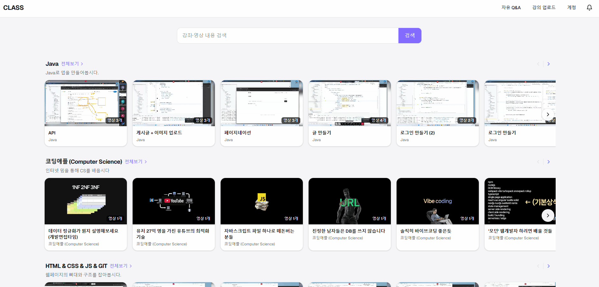
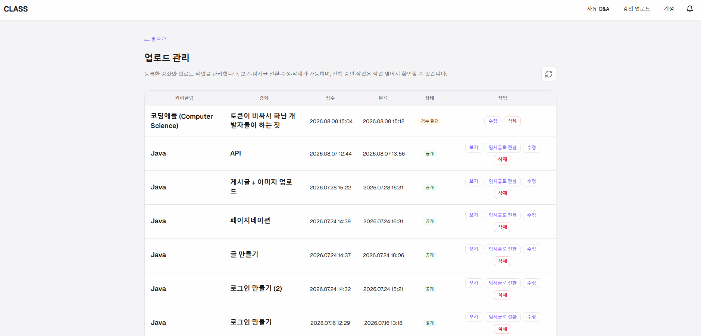
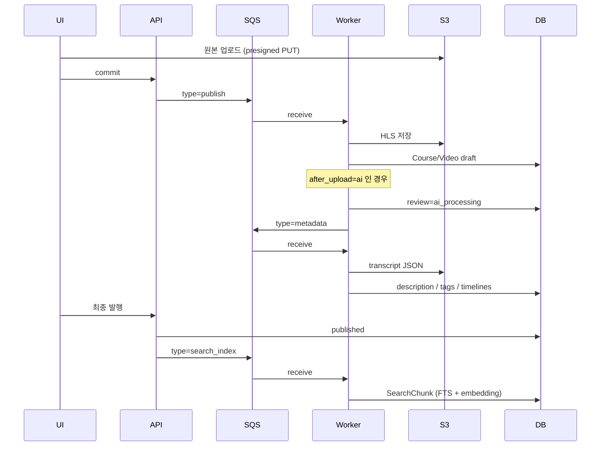
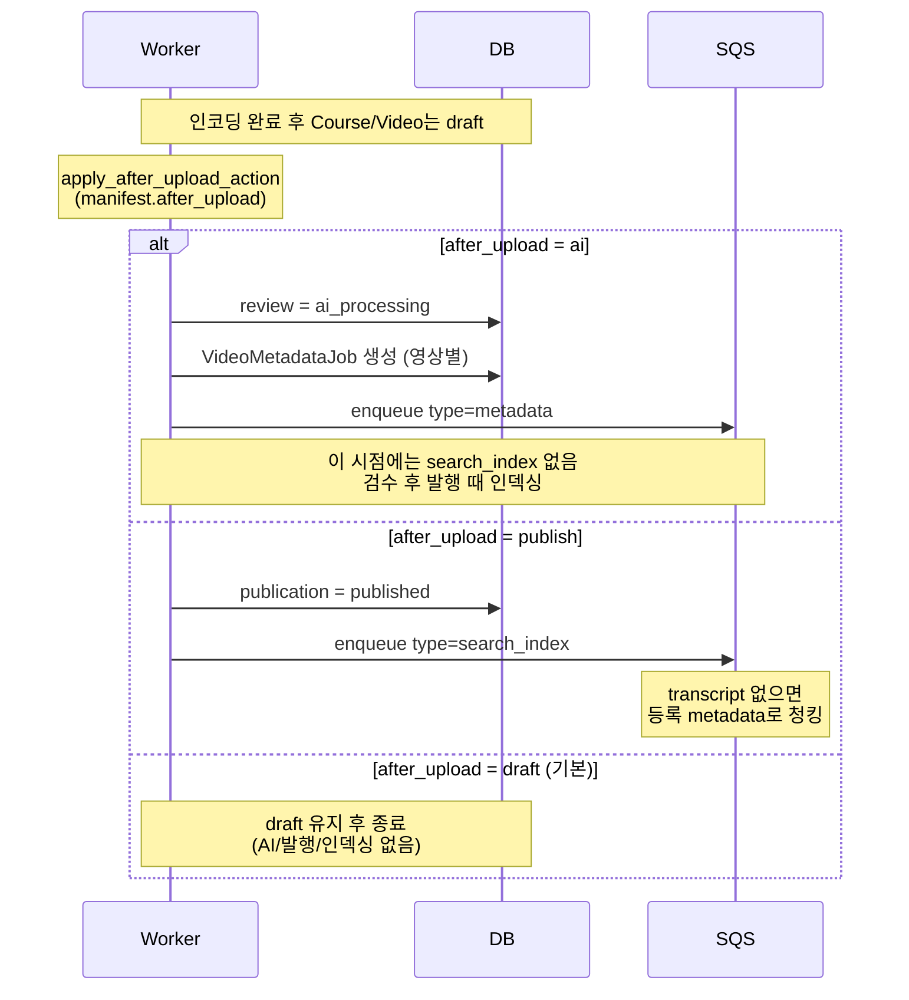
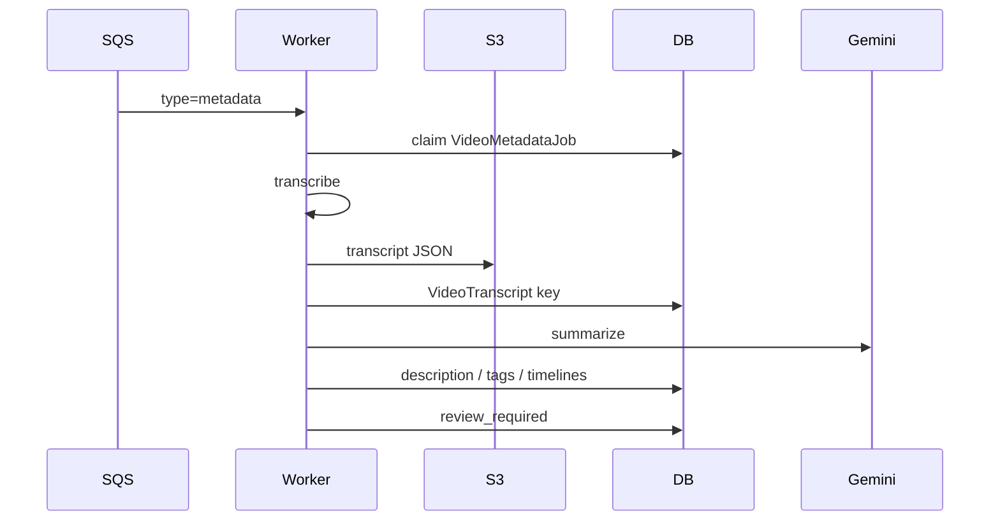
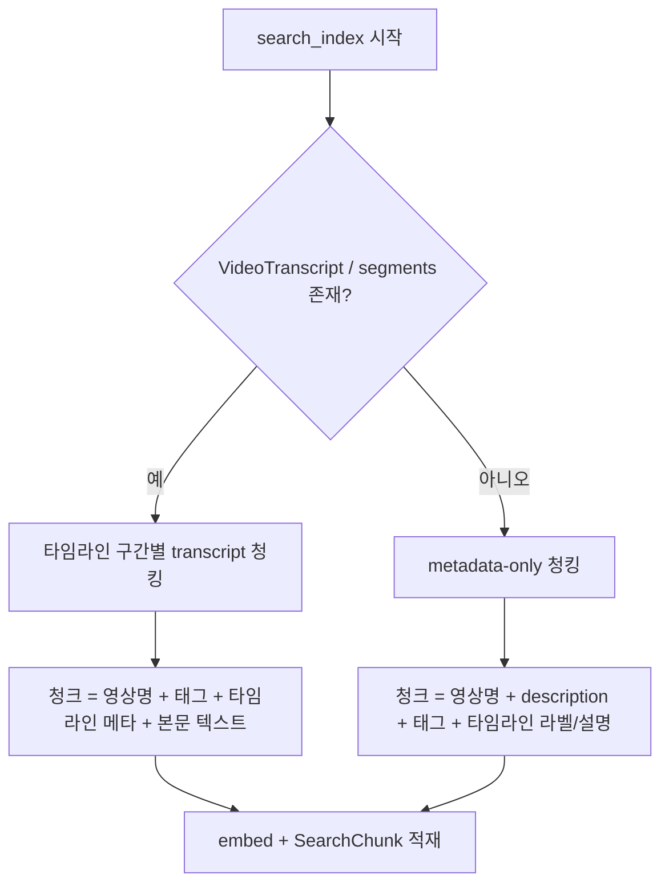
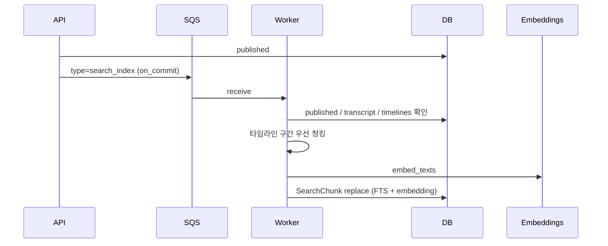
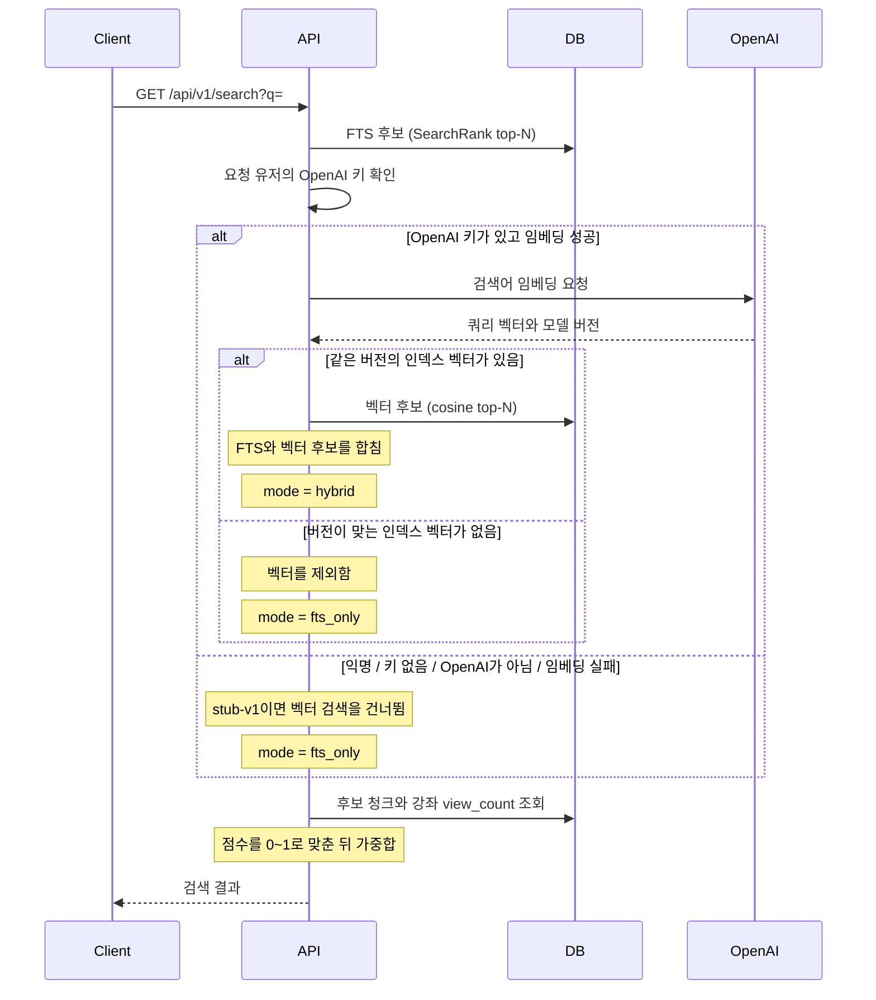

> 해당 글은 초안으로 언제든지 내용이 바뀔 수 있습니다.

# 개요
기존 Class S 프로젝트에 영상 내용을 분석해 강좌 요약, 타임라인, 태깅을 자동으로 해주는 기능과, 영상 내용 기반 검색을 위한 하이브리드 인덱싱 파이프라인을 붙였습니다.

이번 글에서는 코드 단위보다는 데이터가 어디서 어디로 가는지, 왜 비동기 잡의 구성, 청킹,임베딩,랭킹 같은 핵심 비즈니스 로직이 어떻게 동작하는지를 따라갑니다.<br/>

읽는 순서는 개념 소개 → 데이터 흐름 → 비동기 작업 구조 → 상세 비즈니스 로직 → 검색 랭킹과 현재 로직 분석순으로 이어집니다.

## 하이브리드 인덱싱

키워드 검색용 FTS 벡터와 의미 검색용 임베딩 벡터를 같은 청크 단위로 함께 적재하는 구조를 사용할 겁니다.
보통 게시판에서는 규모가 작으면 `LIKE` 검색만 제공하고, 규모가 커지면 Full-Text Search(FTS)에 `Elasticsearch`/`OpenSearch` 같은 검색 엔진을 더해 검색하곤 합니다.

이 FTS 토큰 매칭에 의미 기반으로 가중치를 주는 검색을 혼합할 예정이며, 다음 시나리오에서 이점을 기대할 수 있습니다.
- 검색자가 특정 단어가 기억나지 않아도 결과에 근접할 수 있음
- 자연어로 검색할 수 있음
- 비슷한 뜻의 단어로도 원하는 결과를 찾을 수 있음

> FTS 벡터(`tsvector`): PostgreSQL 등에서 텍스트를 단어 단위로 나누고 정규화해, 검색에 쓰기 좋은 형태로 만든 자료 구조이자 데이터 타입입니다. 사용자가 "게시판 등록"을 검색하면 "등록", "게시판" 같은 토큰 기준으로 더 정교하게 찾을 수 있습니다.

> 의미 검색용(Semantic Search) 벡터: 텍스트가 가진 의미와 문맥을 수백~수천 개 숫자로 이뤄진 고차원 좌표로 표현한 데이터입니다. 흔히 임베딩이라고 부르며, 임베딩 모델로 자연어를 수치화합니다.


# 데이터 흐름
사용자가 영상을 업로드하고, 이를 워커가 HLS로 인코딩을 한 뒤, AI로 관련 테이블 데이터 채우고, 영상의 사운드의 내용을 정리한 뒤 텍스트로 만들면 이를 FTS 벡터화도 하고 임베딩도 진행합니다.

사용자는 다음처럼 강의 업로드로 영상을 올리고 AI로 요약하고 발행할 수 있습니다.<br/>
- 주소: [https://class.devseung.com/courses/108?return_to=main](https://class.devseung.com/courses/108?return_to=main)


※ 이미지의 마우스를 올려서 확대해서 보시는걸 권장드립니다.

**강의 업로드**

**업로드 확인**


또 발행된 강좌는 메인에서 영상 내용 기반으로 검색할 수 있습니다.
아직은 검증 단계로 개발자 친화적입니다.


아래는전체 시퀀스 다이어그램입니다.



사용자 화면 기준으로 보면 기능이 돌아가는 구간은 크게 세 곳이고, 뒤에서 도는 잡도 세 개입니다.

1. 강의 업로드 화면에서는 영상을 올리고 인코딩이 끝날 때까지 기다립니다.
   `publish` 잡이 HLS 인코딩을 하고 Course/Video를 draft로 만듭니다.
2. AI 분석·검수 화면에서는 자동 채우기(AI)를 돌리거나, 설명·태그·타임라인을 직접 고친 뒤 발행을 준비합니다.
   `metadata` 잡이 STT(또는 자막)로 본문 텍스트를 뽑고, 요약·타임라인·태그를 만들어 media DB에 넣습니다.
3. 최종 발행 뒤에는 화면상으로는 발행 완료로 보이지만, 검색에 쓰일 준비가 이어서 진행됩니다.
   `search_index` 잡이 확정된 텍스트를 청킹한 뒤 FTS와 임베딩을 만들어 `SearchChunk`에 저장합니다.

`metadata`는 draft(검수) 단계에서 돌고, `search_index`는 `published` 이후에만 돕니다. 둘 다 영상의 텍스트 정보를 다루지만 시점과 목적이 다릅니다.

이어서 이 세 잡이 왜 갈라져 있는지, 큐에서는 어떻게 분기되는지 봅니다.

# 비동기 작업 구조

## 잡을 나눈 이유
세 작업 모두 외부 API 호출과 CPU 작업이 섞여 있습니다. ffmpeg 인코딩, Whisper·Gemini 호출, 청킹과 임베딩처럼 시간이 길고 실패 지점도 달라서, 처음부터 동기 API 한 번에 넣기는 어렵습니다.

그렇다면 하나의 긴 잡으로 묶을 수도 있었지만, 그렇게 하지 않은 이유는 사용자에게 선택지를 남기기 위해서입니다.<br/>
API 키를 등록해 AI로 내용을 채울 수도 있고, 키 없이(또는 AI 없이) 설명·태그·타임라인을 직접 적을 수도 있어야 합니다. 업로드에서 인코딩, 선택적 AI 채우기, 사람 검수, 발행, 검색 인덱싱까지 단계를 건너뛰거나 다시 돌리려면 잡 경계를 화면 흐름에 맞춰 나누는 편이 맞았습니다.

즉 제품 흐름의 유연성을 생각해서 분리해뒀습니다.<br/>
한 시점에 묶으면 실패 재시도와 선택적 AI 경로를 같이 다루기 어려워지기 때문이죠.

## SQS 공용 큐와 메시지 타입
운영에서는 publish, metadata, search_index는 브로커 `PUBLISH_SQS_QUEUE_URL`을 공유합니다.<br/>

```python
# SQS 공용 큐 분기용 message type
PUBLISH_MESSAGE_TYPE = "publish"
METADATA_MESSAGE_TYPE = "metadata"
SEARCH_INDEX_MESSAGE_TYPE = "search_index"
```

브로커를 통한 워커 진입점은 `python -m media.workers.sqs_worker`이고, 실제 분기는 내부에서 `process_sqs_message`로 이뤄집니다.

```python
# payload.type → publish | metadata | search_index
def process_sqs_message(...):
    payload = _parse_message_payload(message.get("Body") or "")
    msg_type = str(payload["type"]) if payload and payload.get("type") is not None else None

    if payload is not None and msg_type == PUBLISH_MESSAGE_TYPE:
        process_publish_message(...)
        return
    if payload is not None and msg_type == METADATA_MESSAGE_TYPE:
        process_metadata_message(...)
        return
    if payload is not None and msg_type == SEARCH_INDEX_MESSAGE_TYPE:
        process_search_index_message(...)
        return
    # unknown / unsupported type
```

메시지 형태는 대략 다음과 같습니다.

- publish: `{ "type": "publish", "job_id": "...", "enqueued_at": "..." }`
- metadata: `{ "type": "metadata", "job_id": "...", "course_id": ..., "video_id": ..., "pipeline_version": "v1", ... }`
- search_index: metadata와 같은 골격에 `type=search_index`

장시간 ffmpeg나 Whisper가 돌아가도 큐의 작업 시간 제한인 `visibility timeout`에 걸리지 않도록, 워커는 `heartbeat`로 `visibility`를 연장합니다.
성공하거나 스킵하면 `DeleteMessage`로 ack하고, 실패했는데 재시도 여유가 있으면 `visibility`를 0으로 돌려 재배달합니다.

## 상태 머신
파이프라인과 잡 별로 글의 상태를 정리하면 더 분명해집니다.

| 기능 / 잡 | 상태 전이 | 비고 |
|-----------|-----------|------|
| `PublishJob` | `uploading` → `queued` → `processing` → `completed` \| `failed` | 업로드 후 인코딩·썸네일·DB 반영 |
| `Course.publication` | `draft` ⇄ `published` | 카탈로그 공개 여부 |
| `Course.review` | `none` → `ai_processing` → `review_required` \| `failed` | AI 검수 파이프라인 (`publication`과 독립) |
| `VideoMetadataJob` | `queued` → `running` → `completed` \| `failed` | 스텝: `transcribe` → `summarize` |
| `SearchIndexJob` | `queued` → `running` → `completed` \| `failed` | `publication=published`일 때만 실행 |

아래부터는 잡별 핵심 비즈니스 로직을 따라갑니다.

# 핵심 비즈니스 로직

## publish
업로드 동작은 기존과 동일하지만, 변경점으로 인코딩이 끝나면 Course/Video는 항상 draft로 생성됩니다.<br/>
그 다음 사용자가 정한 `after_upload` 값에 따라 후속 동작이 갈립니다.

아래 분기는 사용자의 행동에 따라 여러 상태를 오갈 수 있기에 순서가 바뀌어도 돌아갈 수 있게 구상했습니다.

```python
# after_upload: draft | publish | ai
def apply_after_upload_action(*, course, user, after_upload):
    action = (after_upload or AfterUploadAction.DRAFT).strip().lower()
    if action in ("", AfterUploadAction.DRAFT):
        return course
    if action == AfterUploadAction.PUBLISH:
        return publish_course_final(course=course)
    if action == AfterUploadAction.AI:
        return start_ai_analysis(course=course, user=user)
    return course
```

발행에서 방법에 따라 후술할 인덱싱 방법이 달라지니다.<br/>
최종 검수 후 강좌를 발행할 때 `publication=published`가 될 때 적재되기에 발행 전인 `ai`/`draft` 상태에서는 인덱싱하지 않습니다.<br/>

정확히는 AI로 값을 채우는 잡은 설명·태그·타임라인을 채우는 옵션이기에 이후 검수 후 사람이 발행할 때 비로소 인덱싱이 붙죠.
바로 발행(`publish`)하면 AI 없이 공개 상태가 되며, `transcript`를 따로 만들지 않기에 인덱싱할 데이터를 입력한 `description/tags/timeline` 같은 media 필드로 청크를 만들게 됩니다. (AI 키는 강의를 올리는 사람껄 쓰기에 선택할 수 있는 플로우로 구상)

이를 아래 다이어그램으로 표현이 가능하죠.



즉 AI로 값을 채우는 단계는 옵션이고, 검색 인덱싱은 발행 완료 시점의 후속 작업입니다.

## metadata
AI로 내용 분석을 해서 채우기를 할 경우 강좌에 붙는 비디오마다 `VideoMetadataJob`을 만들고 SQS에 `type=metadata`를 넣습니다.
워커 `run_metadata_job`은 이를 받고 크게 두 작업을 합니다. `transcribe 추출` → `summarize 요약`

### 텍스트 추출
추출 시 직접 업로드하는 방식과 유튜브 링크를 사용하는 지에 따라 분기가 나뉘죠.

| 소스 | 방식 |
| --- | --- |
| upload | HLS/원본 URL에서 ffmpeg로 모노 MP3 추출 → OpenAI Whisper |
| youtube | `youtube_transcript_api`로 한국어 자막(수동 우선, 없으면 자동 생성) |

```python
# YouTube → caption API / upload → ffmpeg + Whisper
def run_transcribe(job: VideoMetadataJob) -> VideoTranscript:
    video = job.video
    if video.source_type == VideoSourceType.YOUTUBE:
        merged = fetch_youtube_korean_captions(video.youtube_id or "")
        return _persist_transcript(...)

    # upload: extract mono mp3, chunk if over Whisper limit
    with extract_and_chunk_audio(video) as extracted:
        ...
```

업로드 후 영상에서 텍스트를 추출하는 STT(Speech To Text)는 Whisper를 채용했고 Whisper 업로드 바이트 한도(`WHISPER_MAX_UPLOAD_BYTES`, 기본 25MB)를 전제로 설계했습니다.<br/>

영상 하나가 40~50분정도인 영상에서 나오는 오디오가 25MB 초과하면 데이터 손실이 발생할 수 있어서
한도를 넘을 때 청크 단위로 분리하여 진행해서 텍스트를 추출한 뒤 시간대를 기준으로 이어붙입니다.

세부 절차는 다음과 같습니다.

1. CDN HLS면 URL을 그대로 쓰고, 아니면 S3 key를 presign
2. 16kHz mono MP3로 오디오 추출
3. `WHISPER_MAX_UPLOAD_BYTES` 초과 시에만 분할 대상으로 보고 청크로 분할
4. 목표 청크 크기(`WHISPER_TARGET_CHUNK_BYTES`, 기본 22MB) 근처 무음 중점에서 자르고, 없으면 hard-cut
5. 청크마다 Whisper `verbose_json` 호출 후 `merge_chunk_results`로 병합
6. transcript JSON은 S3 `transcripts/.../raw.json`에 두고, DB `VideoTranscript`에는 object key만 남긴다

`hard-cut`으로 나눌 때 데이터 손실이 발생할 수 있습니다. <BR/>
그래서 다음 청크 시작을 `TRANSCRIPT_HARD_CUT_OVERLAP_SEC`(기본 0.8s)만큼 앞으로 당겨 경계 말을 한 번 더 듣게 하고, 병합 때는 이미 커버된 구간의 중복 세그먼트를 버립니다.

```python
# hard-cut: start를 overlap만큼 앞당겨 경계 설정
audio_start = start
if i > 0 and hard_flags.get(start, False):
    audio_start = max(0.0, start - overlap_sec)
    used_overlap = audio_start < start
```

```python
# overlap 구간: covered_until_ms와 겹는 부분 통합
if chunk.used_overlap and end_ms <= covered_until_ms:
    continue
if chunk.used_overlap and start_ms < covered_until_ms:
    start_ms = covered_until_ms
```

AI 사용에 대한 키가 없으면 stub provider로 이어지는데 이후 단계에서는 "키 등록이 필요하다"는 안내 description이 들어가게 됩니다.

### 요약과 media DB 적재
`transcript`가 준비되면 LLM으로 DB에 적재할 데이터를 생성합니다.<br/>
프롬프트용으로 `transcript`를 나누는 청킹과 검색용 청킹은 한도랑 용도, 파이프라인 시점이 달라지기에 서로 별개로 동작합니다.

LLM로 다음 형태로 나오게 됩니다.
- `description`: 영상 요약(Markdown)
- `tags[]`
- `timelines[{ start_seconds, label, description }]` → `VideoTimeline`에 저장

검증과 repair를 거친 뒤 media 테이블에 직접 덮어씁니다.

```python
# LLM timelines → Video.description / tags / VideoTimeline
def apply_ai_fields_to_video(video, fields):
    video.description = str(fields.get("description") or "")
    video.save(update_fields=["description"])
    set_video_tags(video, list(fields.get("tags") or []))
    timelines = normalize_timelines_for_video(
        list(fields.get("timelines") or []),
        duration_seconds=video.duration_seconds,
    )
    sync_timelines_from_dicts(video, timelines)
```

코스 단위로는 비디오 메타 잡이 모두 끝나면 `review_status=review_required`로 넘어가, 사람이 확인한 뒤 발행하는 흐름입니다. 이 단계에서는 검색 인덱싱을 하지 않습니다.



## search_index
검색 인덱스는 최종 발행 시점에 후에 오며 `publication_status=published`로 바꾼 뒤, 트랜잭션 commit 이후에 `search index job`을 적재합니다.

```python
# mark published
course.publication_status = CoursePublicationStatus.PUBLISHED
...
enqueue_search_index_after_publish(course_id=course.id)

# 발행 DB 커밋 성공 후에만 검색 인덱싱 enqueue (발행 실패면 넣지 않음)
def enqueue_search_index_after_publish(*, course_id: int) -> None:
    transaction.on_commit(
        lambda: schedule_search_index_for_published_course(course_id)
    )
```

`on_commit`을 쓰는 이유는 발행이 완료되면 인덱싱을 돌게하고, 인덱싱이 실패해도 발행에는 영향을 주지 않기 위함입니다.

### 청킹
청크를 만드느건 `VideoTimeline` 구간을 우선합니다.<br/>
하지만 청크에 넣는 본문 텍스트는 `transcript` 유무에 따라 갈리는데, transcript는 AI 메타 잡(`type=metadata`)의 STT/자막 단계에서만 생기고, 인코딩만으로는 만들어지지 않기 때문에 사용자에 행동에 따라 없을 수도 있습니다.
그래서 아래와 같이 동작합니다.



| 분기 | 조건 | 인덱싱에 쓰는 텍스트 |
| --- | --- | --- |
| transcript 기반 | S3 transcript JSON에 segment가 있음 | 영상 본문(STT/자막) + 영상명, 태그, 타임라인 정보 |
| metadata-only | transcript가 없거나 segment가 비어 있음 | `Video.name`, `description`, 태그, `VideoTimeline` 라벨/설명 |

metadata-only에 쓰이는 필드는 “사용자가 직접 쓴 값”일 수도 있고, 이전에 AI 요약이 채워 둔 값일 수도 있습니다.<br/>
AI 없이 바로 발행(`after_upload=publish`)하면 보통의 경우 transcript가 없어, 사람이 입력했거나 비어 있는 메타만으로 인덱싱됩니다. 

필드가 `SEARCH_CHUNK_MIN_CHARS`(기본 40)보다 짧으면 그 구간 청크는 만들지 않습니다.

transcript가 있을 때는 `VideoTimeline` 구간별로 segment를 모으고, `SEARCH_CHUNK_MAX_CHARS`(기본 1200)를 넘기면 저장(flush)하며 진행합니다. 이때도 영상명, 타임라인 라벨, 태그, 타임라인 설명은 헤더/보조 정보로 본문 앞에 붙습니다.

### 임베딩과 SearchChunk 적재
준비된 텍스트 목록을 `embed_texts`에 넘겨서 임베딩 작업을 합니다. <br/>
**※ 임베딩(Embedding)**: 사람이 쓰는 단어, 문장, 이미지 같은 복잡한 데이터를 컴퓨터가 이해할 수 있도록 숫자들의 배열(벡터)로 바꾸는 과정과 그 결과물

- 영상 소유자(`video.user`)의 OpenAI(transcript) 키가 있으면 `text-embedding-3-small`로 임베딩합니다.
- 키가 없으면 stub 해시 벡터로 파이프라인을 계속 진행합니다.

```python
# chunk → embed → replace SearchChunk
prepared = build_chunks_for_video(...)
texts = [c.text for c in prepared]

# embed_texts 내부: 키 유무 분기
# 내부에서 embedding_model_version를 토대로 사용
api_key, version = resolve_embedding_api_key(user=video.user)
if not api_key:
    embeddings = stub_embed_texts(texts)             # stub, 더미 벡터값 부여해서 의미 검색에서는 안쓰임
else:
    embeddings = openai_embed_texts(texts, api_key)  # text-embedding-3-small

chunk_count = _replace_chunks(
    video=video,
    prepared=prepared,
    embeddings=embeddings if texts else [],
    metadata_version=metadata_version,
    embedding_model_version=version,
)
```

임베딩이 끝나면 `_replace_chunks`가 해당 영상의 기존 `SearchChunk`를 지우고 새 행으로 업데이트합니다.<br/>
한 행에는 검색에 쓸 본문, FTS용 `search_vector`, 1536차원 `embedding`, 구간 시각, `metadata_version`이 같이 들어갑니다.

이미 같은 `metadata_version`으로 `COMPLETED`인 인덱싱 잡이 있으면 다시 인덱싱하지 않게 하고
강좌를 다시 draft로 내려도(`unpublish`) 청크 행은 지우지 않게합니다. 대신 검색 API가 published 코스만 읽도록 막아 두었기 때문이죠.



## 검색 랭킹
발행된 강좌의 `SearchChunk`만 `GET /api/v1/search?q=`로 검색합니다.<br/>
점수는 RRF가 아니라, FTS와 벡터, 조회수 점수를 후보 집합 안에서 각각 0~1로 맞춘 뒤 가중합하는 방식입니다.

- RRF(Reciprocal Rank Fusion): 여러 검색 채널의 결과를 순위(rank)만 보고 합치는 방법입니다. 1등, 2등처럼 등수만 쓰고 원점수 크기는 보지 않습니다.
- 이 서비스는 RRF 대신, 이번 검색에 올라온 후보들끼리 FTS 점수와 벡터 유사도, 강좌 조회수(`view_count`)를 각각 최솟값부터 최댓값을 기준으로 0부터 1까지 맞춘 뒤(min-max), 비중을 곱해 더합니다(가중합).
- 채널마다 점수 단위가 달라도 같은 스케일에서 섞을 수 있습니다.



흐름을 풀면 다음과 같습니다.

1. 먼저 FTS로 `search_vector`에 걸린 청크를 상위 N개 뽑습니다. N은 `SEARCH_QUERY_CANDIDATE_LIMIT`이며 기본값은 50입니다.
2. API는 검색 요청 유저에게 등록된 콘텐츠 AI의 transcript용 credential을 확인합니다. 익명 요청이거나 키가 없거나 provider가 OpenAI가 아니면 `stub-v1`로 판단합니다.
3. OpenAI 키가 있으면 그 키로 검색어의 임베딩을 요청합니다. 성공하면 쿼리 벡터와 `openai:<모델명>` 형식의 버전을 얻습니다.
4. 쿼리 버전과 `SearchChunk.embedding_model_version`이 같은 행만 대상으로 cosine 상위 N개를 찾습니다. 버전까지 맞는 벡터 후보가 있으면 FTS 후보와 합쳐 `hybrid`로 검색합니다.<br/>
   인덱스 벡터는 영상을 인덱싱한 교사의 키를 기준으로 만들어집니다. 따라서 검색 유저에게 OpenAI 키가 있어도 인덱스 버전이 다르면 의미 검색은 적용되지 않습니다.
5. 키가 없어 `stub-v1`이 되었거나 OpenAI 호출이 실패했거나 버전이 맞는 벡터 후보가 없으면 `fts_only`로 전환합니다. stub 해시 벡터는 의미 유사도를 나타내지 않으므로 벡터 후보 조회부터 건너뜁니다.
6. 선택된 후보에 강좌 `view_count`(조회수)를 붙입니다.
7. FTS와 벡터, 조회수 점수를 각각 min-max로 0~1에 맞춘 뒤 기본 가중치로 합칩니다. `hybrid`는 FTS 0.45 + Vector 0.45 + 조회수 0.10입니다. `fts_only`는 벡터 항을 빼고 FTS와 조회수의 비중을 다시 나눕니다.

```python
# hybrid: FTS+벡터+조회수 / fts_only: 벡터 제외
def combine_hybrid_scores(...):
    if mode == "fts_only":
        total_w = w["fts"] + w["popularity"]
        return (w["fts"] * fts_norm + w["popularity"] * popularity_norm) / total_w
    return (
        w["fts"] * fts_norm
        + w["vector"] * vector_norm
        + w["popularity"] * popularity_norm
    )
```

유사도 하한(threshold)은 없습니다. 결과는 청크 단위라, 같은 강좌의 여러 구간이 상위권에 같이 올라올 수 있습니다.


<!-- 아래는 체크 후 수정 필요  -->
<!-- # 현재 로직에서 보이는 문제와 개선 여지
이 글의 목적은 지금 돌아가는 파이프라인을 기준으로, 전체 흐름과 알고리즘 수준의 문제나 개선점을 짚는 것입니다.<br/>
자잘한 함수 정리보다 “검색이 기대한 대로 동작하지 않을 수 있는 지점”을 찾는 쪽에 가깝습니다.

1. 인덱스 임베딩과 쿼리 임베딩의 키가 다를 수 있습니다.<br/>
   인덱싱은 영상 소유자(교사) credential 기준이고, 검색은 요청 유저 기준입니다. 실키끼리 `embedding_model_version`이 맞을 때만 hybrid이고, stub이거나 버전이 어긋나면 `fts_only`입니다. 의미 검색이 “누가 인덱싱·검색하느냐”에 따라 꺼질 수 있습니다.

2. 점수 융합이 후보 집합에 상대적입니다.<br/>
   min-max 가중합이라 후보가 적거나 한쪽 채널만 강하면 정규화가 왜곡됩니다. FTS에만 걸린 청크는 vector_norm이 0에 가까워져 hybrid에서 불리해질 수 있습니다. RRF 같은 순위 기반 융합이 더 안정적일 여지가 있습니다.

3. 벡터 유사도 하한이 없습니다.<br/>
   의미가 멀어도 top-N에 들어오면 FTS 합집합에 섞입니다. 노이즈 hit가 올라올 수 있습니다.

4. 결과가 청크 단위이고 강좌/영상 단위 중복 제거가 없습니다.<br/>
   인기 강좌의 여러 청크가 상위권을 잠식할 수 있습니다. course/video 집계나 diversity가 없습니다.

5. 한국어 FTS는 `simple` config입니다.<br/>
   형태소 분석 없이 단순 토큰 기준이라, 키워드 매칭 품질이 표현 변화에 약할 수 있습니다.

6. 발행과 인덱싱이 비동기로 분리되어 있습니다.<br/>
   발행 직후 검색은 빈 결과일 수 있고, search enqueue 실패해도 발행은 유지됩니다. 파이프라인 관점에서 “검색 가능 시점”이 발행 시점과 어긋납니다.

7. 최적화를 위한 통계 로직이 필요 

8. 무음 시간대 날리는 코드  -->
<!-- 
위 항목은 당장 버그로 단정할 수는 없고, 제품 기대치와 측정 없이는 우선순위도 갈립니다.<br/>
다만 전체 흐름과 랭킹 알고리즘 기준으로는 검증·개선 후보가 분명합니다. -->

# 정리
인덱싱부터 검색까지를 한 장으로 보면 다음과 같습니다.


다음 글에서는 최적화와 테스트, 코드 리뷰를 더 정밀히 진행할 예정입니다.<br/>
가중치·융합 방식·임베딩 버전 일치·결과 집계처럼 파이프라인과 알고리즘 단위로 좀 더 나은 방안과 흐름을 이해하는게 목적입니다.