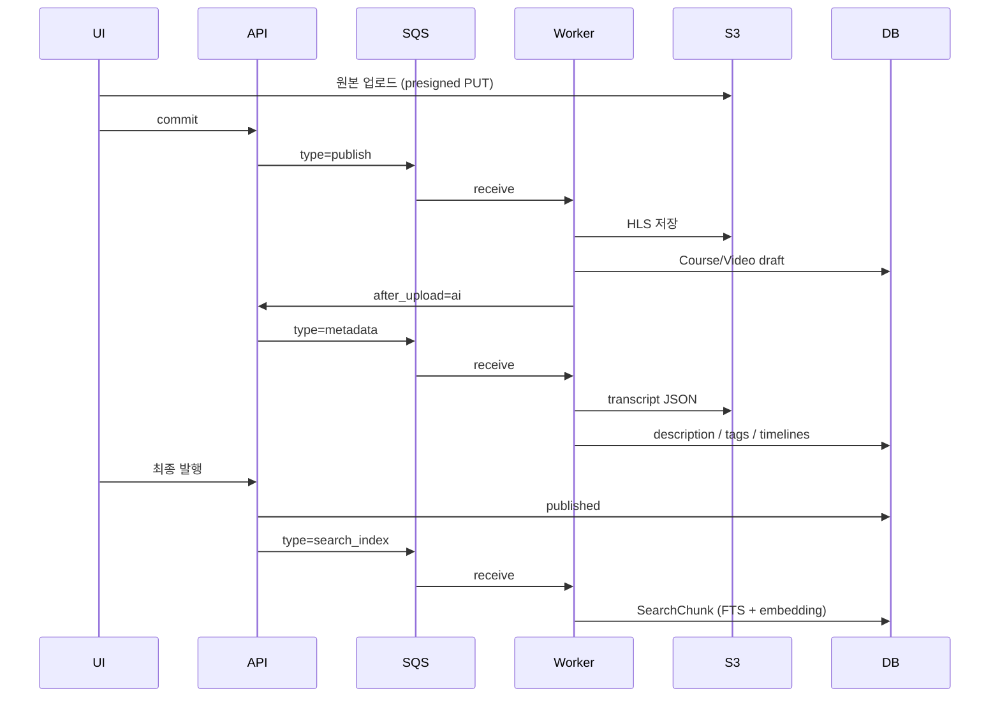
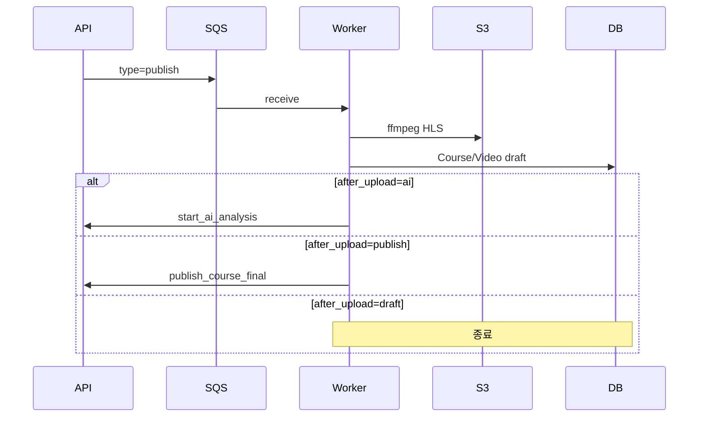
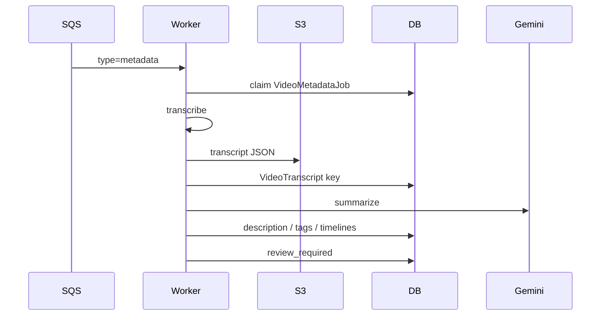
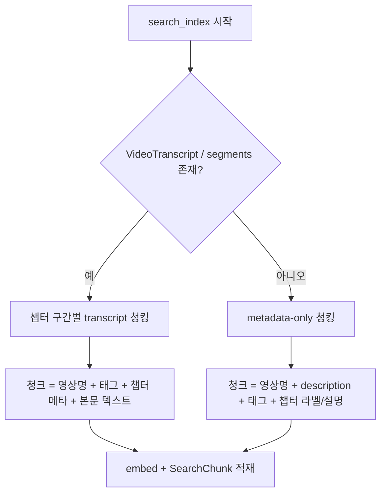
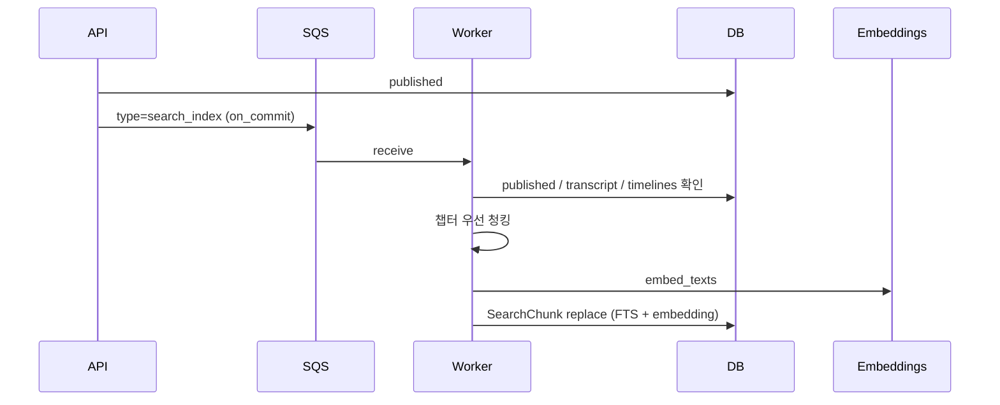
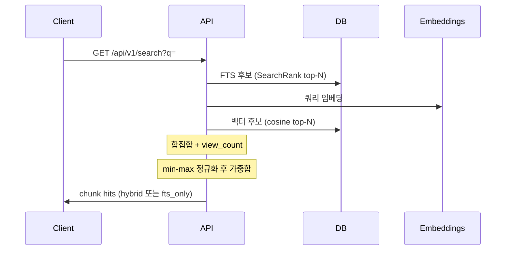

# 개요
기존 Class S 프로젝트에 영상 내용을 분석해 강좌 요약, 타임라인, 태깅을 자동으로 해주는 기능과, 영상 내용 기반 검색을 위한 하이브리드 인덱싱 파이프라인을 붙였습니다.

이번 글에서는 코드 단위보다는 데이터가 어디서 어디로 가는지, 왜 비동기 잡의 구성, 청킹,임베딩,랭킹 같은 핵심 비즈니스 로직이 어떻게 동작하는지를 따라갑니다.<br/>

읽는 순서는 개념 소개 → 데이터 흐름 → 비동기 작업 구조 → 상세 비즈니스 로직 → 검색 랭킹과 현재 로직 분석순으로 이어집니다.

## 하이브리드 인덱싱

키워드 검색용 FTS 벡터와 의미 검색용 임베딩 벡터를 같은 청크 단위로 함께 적재하는 구조를 사용할 겁니다.
보통 게시판에서는 규모가 작으면 `LIKE` 검색만 제공하고, 규모가 커지면 Full-Text Search(FTS)에 `Elasticsearch`/`OpenSearch` 같은 검색 엔진을 더해 검색하곤 합니다.

이 FTS 토큰 매칭에 의미 기반으로 가중치를 주는 검색을 혼합할 예정이며, 다음 시나리오에서 이점을 기대할 수 있습니다.
- 검색자가 특정 단어가 기억나지 않아도 결과에 근접할 수 있음
- 자연어로 검색할 수 있음
- 비슷한 뜻의 단어로도 원하는 결과를 찾을 수 있음

> FTS 벡터(`tsvector`): PostgreSQL 등에서 텍스트를 단어 단위로 나누고 정규화해, 검색에 쓰기 좋은 형태로 만든 자료 구조이자 데이터 타입입니다. 사용자가 "게시판 등록"을 검색하면 "등록", "게시판" 같은 토큰 기준으로 더 정교하게 찾을 수 있습니다.

> 의미 검색용(Semantic Search) 벡터: 텍스트가 가진 의미와 문맥을 수백~수천 개 숫자로 이뤄진 고차원 좌표로 표현한 데이터입니다. 흔히 임베딩이라고 부르며, 임베딩 모델로 자연어를 수치화합니다.


# 데이터 흐름
사용자가 영상을 업로드하고, 이를 워커가 HLS로 인코딩을 한 뒤, AI로 관련 테이블 데이터 채우고, 영상의 사운드의 내용을 정리한 뒤 텍스트로 만들면 이를 FTS 벡터화도 하고 임베딩도 진행합니다.

사용자는 다음처럼 강의 업로드로 영상을 올리고 AI로 요약하고 발행할 수 있습니다.<br/>
- 주소: [https://class.devseung.com/courses/108?return_to=main](https://class.devseung.com/courses/108?return_to=main)


※ 이미지의 마우스를 올려서 확대해서 보시는걸 권장드립니다.

**강의 업로드**

**업로드 확인**


또 발행된 강좌는 메인에서 영상 내용 기반으로 검색할 수 있습니다.
아직은 검증 단계로 개발자 친화적입니다.


아래는 시나리오에 따른 시퀀스 다이어그램입니다.



사용자 화면 기준으로 보면 기능이 돌아가는 구간은 크게 세 곳이고, 뒤에서 도는 잡도 세 개입니다.

1. 강의 업로드 화면에서는 영상을 올리고 인코딩이 끝날 때까지 기다립니다.
   `publish` 잡이 HLS 인코딩을 하고 Course/Video를 draft로 만듭니다.
2. AI 분석·검수 화면에서는 자동 채우기(AI)를 돌리거나, 설명·태그·타임라인을 직접 고친 뒤 발행을 준비합니다.
   `metadata` 잡이 STT(또는 자막)로 본문 텍스트를 뽑고, 요약·챕터·태그를 만들어 media DB에 넣습니다.
3. 최종 발행 뒤에는 화면상으로는 발행 완료로 보이지만, 검색에 쓰일 준비가 이어서 진행됩니다.
   `search_index` 잡이 확정된 텍스트를 청킹한 뒤 FTS와 임베딩을 만들어 `SearchChunk`에 저장합니다.

`metadata`는 draft(검수) 단계에서 돌고, `search_index`는 `published` 이후에만 돕니다. 둘 다 영상의 텍스트 정보를 다루지만 시점과 목적이 다릅니다.

이어서 이 세 잡이 왜 갈라져 있는지, 큐에서는 어떻게 분기되는지 봅니다.

# 비동기 작업 구조

## 잡을 나눈 이유
세 작업 모두 외부 API 호출과 CPU 작업이 섞여 있습니다. ffmpeg 인코딩, Whisper·Gemini 호출, 청킹과 임베딩처럼 시간이 길고 실패 지점도 달라서, 처음부터 동기 API 한 번에 넣기는 어렵습니다.

그렇다면 하나의 긴 잡으로 묶을 수도 있었지만, 그렇게 하지 않은 이유는 사용자에게 선택지를 남기기 위해서입니다.<br/>
API 키를 등록해 AI로 내용을 채울 수도 있고, 키 없이(또는 AI 없이) 설명·태그·타임라인을 직접 적을 수도 있어야 합니다. 업로드에서 인코딩, 선택적 AI 채우기, 사람 검수, 발행, 검색 인덱싱까지 단계를 건너뛰거나 다시 돌리려면 잡 경계를 화면 흐름에 맞춰 나누는 편이 맞았습니다.

즉 제품 흐름의 유연성을 생각해서 분리해뒀습니다.<br/>
한 시점에 묶으면 실패 재시도와 선택적 AI 경로를 같이 다루기 어려워지기 때문이죠.

## SQS 공용 큐와 메시지 타입
운영에서는 publish, metadata, search_index는 브로커 `PUBLISH_SQS_QUEUE_URL`을 공유합니다.<br/>

```python
# media/constants.py
PUBLISH_MESSAGE_TYPE = "publish"
METADATA_MESSAGE_TYPE = "metadata"
SEARCH_INDEX_MESSAGE_TYPE = "search_index"
```

브로커를 통한 워커 진입점은 `python -m media.workers.sqs_worker`이고, 실제 분기는 내부에서 `process_sqs_message`로 이뤄집니다.

```python
# media/workers/sqs_message_handler.py
def process_sqs_message(...):
    payload = _parse_message_payload(message.get("Body") or "")
    msg_type = str(payload["type"]) if payload and payload.get("type") is not None else None

    if payload is not None and msg_type == PUBLISH_MESSAGE_TYPE:
        process_publish_message(...)
        return
    if payload is not None and msg_type == METADATA_MESSAGE_TYPE:
        process_metadata_message(...)
        return
    if payload is not None and msg_type == SEARCH_INDEX_MESSAGE_TYPE:
        process_search_index_message(...)
        return
    # 나머지 메세지 처리 
```

메시지 형태는 대략 다음과 같습니다.

- publish: `{ "type": "publish", "job_id": "...", "enqueued_at": "..." }`
- metadata: `{ "type": "metadata", "job_id": "...", "course_id": ..., "video_id": ..., "pipeline_version": "v1", ... }`
- search_index: metadata와 같은 골격에 `type=search_index`

장시간 ffmpeg나 Whisper가 돌아가도 큐의 작업 시간 제한인 `visibility timeout`에 걸리지 않도록, 워커는 `heartbeat`로 `visibility`를 연장합니다.
성공하거나 스킵하면 `DeleteMessage`로 ack하고, 실패했는데 재시도 여유가 있으면 `visibility`를 0으로 돌려 재배달합니다.

## 상태 머신
파이프라인과 잡 별로 글의 상태를 정리하면 더 분명해집니다.

| 기능 / 잡 | 상태 전이 | 비고 |
|-----------|-----------|------|
| `PublishJob` | `uploading` → `queued` → `processing` → `completed` \| `failed` | 업로드 후 인코딩·썸네일·DB 반영 |
| `Course.publication` | `draft` ⇄ `published` | 카탈로그 공개 여부 |
| `Course.review` | `none` → `ai_processing` → `review_required` \| `failed` | AI 검수 파이프라인 (`publication`과 독립) |
| `VideoMetadataJob` | `queued` → `running` → `completed` \| `failed` | 스텝: `transcribe` → `summarize` |
| `SearchIndexJob` | `queued` → `running` → `completed` \| `failed` | `publication=published`일 때만 실행 |

아래부터는 잡별 핵심 비즈니스 로직을 따라갑니다.

# 핵심 비즈니스 로직

## publish
업로드는 API로 원본 바이트를 받지 않고, 클라이언트가 S3 staging에 presigned PUT으로 올립니다.

1. `POST publish-jobs/init`에서 staging manifest와 `PublishJob(UPLOADING)` 생성
2. 클라이언트가 S3에 원본 PUT
3. `POST publish-jobs/{id}/commit`에서 검증 후 `QUEUED`, SQS에 `type=publish` enqueue
4. 워커가 `run_publish_job` 실행

인코딩 단계는 probe 결과에 따라 copy 또는 re-encode로 갈립니다.

```python
# media/services/publish.py
report(PublishJobStep.ENCODING)
if probe is not None and probe.can_copy:
    split_hls_copy(input_path=video_input, output_dir=hls_dir, probe=probe)
else:
    encode_hls_vod(input_path=video_input, output_dir=hls_dir)
```

- copy 가능: video가 h264/hevc이고 audio가 aac/mp3 계열일 때, 컨테이너만 쪼개 HLS로 만듦
- 그 외: libx264 + AAC로 VOD HLS 인코딩
- YouTube 소스: HLS 인코딩을 건너뛰고 watch URL만 DB에 둠

인코딩이 끝나면 Course/Video는 항상 draft로 생성됩니다.<br/>
그다음 `after_upload` 값에 따라 후속 동작이 갈립니다.

```python
# media/services/course_publication.py
def apply_after_upload_action(*, course, user, after_upload):
    action = (after_upload or AfterUploadAction.DRAFT).strip().lower()
    if action in ("", AfterUploadAction.DRAFT):
        return course
    if action == AfterUploadAction.PUBLISH:
        return publish_course_final(course=course)
    if action == AfterUploadAction.AI:
        return start_ai_analysis(course=course, user=user)
    return course
```

하이브리드 검색까지 이어지는 기본 경로는 `after_upload=ai`입니다.<br/>
바로 발행(`publish`)하면 AI 없이 published가 되고, transcript가 없어도 metadata-only 청크로 검색 인덱싱이 돌아갑니다.



## metadata
`start_ai_analysis`는 비디오마다 `VideoMetadataJob`을 만들고 SQS에 `type=metadata`를 넣습니다.<br/>
워커의 `run_metadata_job`은 크게 `transcribe` → `summarize` 두 단계입니다.

### 텍스트 추출
업로드 영상과 YouTube는 추출 경로가 다릅니다.

| 소스 | 방식 |
| --- | --- |
| upload | HLS/원본 URL에서 ffmpeg로 모노 MP3 추출 → OpenAI Whisper |
| youtube | `youtube_transcript_api`로 한국어 자막(수동 우선, 없으면 자동 생성) |

```python
# content_ai/services/transcribe.py
def run_transcribe(job: VideoMetadataJob) -> VideoTranscript:
    video = job.video
    if video.source_type == VideoSourceType.YOUTUBE:
        merged = fetch_youtube_korean_captions(video.youtube_id or "")
        return _persist_transcript(...)

    # upload: ffmpeg 오디오 추출 후 Whisper
    with extract_and_chunk_audio(video) as extracted:
        ...
```

업로드 STT의 세부 흐름은 다음과 같습니다.

1. CDN HLS면 URL을 그대로 쓰고, 아니면 S3 key를 presign
2. 16kHz mono MP3로 오디오 추출
3. 파일이 크면 silence 기준으로 잘라 Whisper 요청 크기 제한에 맞춤
4. Whisper `verbose_json` 결과를 병합
5. transcript JSON은 S3 `transcripts/.../raw.json`에 저장
6. DB의 `VideoTranscript`에는 object key만 남김

credential이 없으면 stub provider로 이어지고, 이후 단계에서는 "키 등록이 필요하다"는 안내 description이 들어갈 수 있습니다.

### 요약과 media DB 적재
transcript가 준비되면 `generate_and_apply_metadata`가 Gemini로 메타데이터를 생성합니다.<br/>
프롬프트용으로 transcript를 나누는 청킹(`METADATA_TRANSCRIPT_CHUNK_CHARS`, 기본 12000)은 검색용 청킹과 별개입니다.

LLM 출력은 대략 다음 형태입니다.

- `description`: 영상 요약(Markdown)
- `tags[]`
- `chapters[{ start_seconds, title, summary }]`

검증과 repair를 거친 뒤 media 테이블에 직접 덮어씁니다.

```python
# content_ai/services/ai_stub.py
def apply_ai_fields_to_video(video, fields):
    video.description = str(fields.get("description") or "")
    video.save(update_fields=["description"])
    set_video_tags(video, list(fields.get("tags") or []))
    timelines = chapters_to_timelines(
        list(fields.get("chapters") or []),
        duration_seconds=video.duration_seconds,
    )
    sync_timelines_from_dicts(video, timelines)
```

별도 `VideoMetadata` 결과 테이블은 없습니다.<br/>
요약 결과는 `Video.description`, 태그, `VideoTimeline`에 바로 들어가고, 산출물 JSON은 S3 `metadata/.../{job_id}.json`에도 남습니다.

코스 단위로는 비디오 메타 잡이 모두 끝나면 `review_status=review_required`로 넘어가, 사람이 확인한 뒤 발행하는 흐름입니다.<br/>
이 단계에서는 검색 인덱싱을 하지 않습니다.



## search_index
검색 인덱스는 최종 발행 시점에 붙습니다.<br/>
`publish_course_final`이 `publication_status=published`로 바꾼 뒤, 트랜잭션 commit 이후에 search index job을 enqueue합니다.

```python
# media/services/course_publication.py
course.publication_status = CoursePublicationStatus.PUBLISHED
...
enqueue_search_index_after_publish(course_id=course.id)

# content_ai/services/search_index_enqueue.py
def enqueue_search_index_after_publish(*, course_id: int) -> None:
    transaction.on_commit(
        lambda: schedule_search_index_for_published_course(course_id)
    )
```

`on_commit`을 쓰는 이유는 발행 API 응답이 인덱싱을 기다리지 않게 하고, 발행 트랜잭션이 롤백되면 enqueue도 같이 취소되게 하려는 것입니다.<br/>
반대로 search enqueue가 실패해도 발행 상태는 유지됩니다. 인덱스 잡만 FAILED로 남고 로그로 추적합니다.

### 청킹
`build_chunks_for_video`는 챕터 윈도우를 우선합니다.<br/>
다만 청크에 넣는 본문 텍스트는 transcript 유무에 따라 갈립니다. transcript는 AI 메타 잡(`type=metadata`)의 STT/자막 단계에서만 생기고, 인코딩만으로는 만들어지지 않습니다.



| 분기 | 조건 | 인덱싱에 쓰는 텍스트 |
| --- | --- | --- |
| transcript 기반 | S3 transcript JSON에 segment가 있음 | 영상 본문(STT/자막) + 영상명, 태그, 챕터 정보 |
| metadata-only | transcript가 없거나 segment가 비어 있음 | `Video.name`, `description`, 태그, `VideoTimeline` 라벨/설명 |

metadata-only에 쓰이는 필드는 “사용자가 직접 쓴 값”일 수도 있고, 이전에 AI 요약이 채워 둔 값일 수도 있습니다.<br/>
AI 없이 바로 발행(`after_upload=publish`)하면 보통 후자 transcript가 없어, 사람이 입력했거나 비어 있는 메타만으로 인덱싱됩니다. 필드가 `SEARCH_CHUNK_MIN_CHARS`(기본 40)보다 짧으면 그 구간 청크는 만들지 않습니다.

transcript가 있을 때는 `VideoTimeline` 챕터 구간별로 segment를 모으고, `SEARCH_CHUNK_MAX_CHARS`(기본 1200)를 넘기면 flush합니다.<br/>
이때도 영상명, 챕터 라벨, 태그, 챕터 요약은 헤더/보조 정보로 본문 앞에 붙습니다.

### 임베딩과 SearchChunk 적재
준비된 텍스트 목록을 `embed_texts`에 넘깁니다.

- credential이 있으면 OpenAI `text-embedding-3-small`
- 없으면 stub 해시 벡터로 파이프라인을 계속 진행

```python
# content_ai/services/search_index_job_runner.py
prepared = build_chunks_for_video(
    video=video,
    transcript_payload=transcript_payload,
)
texts = [c.text for c in prepared]
embeddings, embedding_model_version = embed_texts(
    texts=texts,
    user=video.user,
)
chunk_count = _replace_chunks(
    video=video,
    prepared=prepared,
    embeddings=embeddings if texts else [],
    metadata_version=metadata_version,
    embedding_model_version=embedding_model_version,
)
```

`_replace_chunks`는 기존 `SearchChunk`를 지우고 새로 bulk_create합니다.<br/>
각 행에는 본문 텍스트, FTS용 `search_vector`, pgvector `embedding`(1536차원), 시간 구간, metadata_version이 함께 들어갑니다.

같은 metadata_version으로 이미 COMPLETED인 잡이 있으면 멱등하게 skip합니다.<br/>
unpublish 시에는 `SearchChunk`를 지우지 않고, 검색 쿼리가 published 코스만 보도록 필터합니다.



## 검색 랭킹
인덱싱으로 쌓인 `SearchChunk`는 `GET /api/v1/search?q=`에서 읽힙니다.<br/>
코어는 `content_ai/services/search_query.py`의 `hybrid_search`입니다. published 코스의 청크만 대상입니다.

흐름은 RRF가 아니라, 채널별 후보를 모은 뒤 후보 집합 안에서 min-max 정규화하고 가중합하는 방식입니다.



1. FTS: `search_vector @@ SearchQuery` + `SearchRank` 상위 `SEARCH_QUERY_CANDIDATE_LIMIT`(기본 50)
2. Vector: 쿼리 임베딩과 `CosineDistance` 상위 동일 개수. `embedding_model_version`이 쿼리 버전과 같은 행만 대상
3. 합집합에 `Course.view_count`를 인기도로 붙임
4. FTS / vector / popularity를 각각 min-max 정규화
5. 기본 가중치로 최종 점수 계산: FTS 0.45 + Vector 0.45 + Popularity 0.10

```python
# content_ai/services/search_query.py
def combine_hybrid_scores(...):
    if mode == "fts_only":
        total_w = w["fts"] + w["popularity"]
        return (w["fts"] * fts_norm + w["popularity"] * popularity_norm) / total_w
    return (
        w["fts"] * fts_norm
        + w["vector"] * vector_norm
        + w["popularity"] * popularity_norm
    )
```

임베딩이 실패하거나 버전 일치 후보가 없으면 `mode=fts_only`로 내려갑니다.<br/>
유사도 하한(threshold)은 없고, 결과는 청크 단위입니다. 같은 강좌의 여러 청크가 상위를 나눠 가질 수 있습니다.

# 현재 로직에서 보이는 문제와 개선 여지
이 글의 목적은 지금 돌아가는 파이프라인을 기준으로, 전체 흐름과 알고리즘 수준의 문제나 개선점을 짚는 것입니다.<br/>
자잘한 함수 정리보다 “검색이 기대한 대로 동작하지 않을 수 있는 지점”을 찾는 쪽에 가깝습니다.

1. 인덱스 임베딩과 쿼리 임베딩의 키가 다를 수 있습니다.<br/>
   인덱싱은 영상 소유자(교사) credential 기준이고, 검색은 요청 유저(또는 익명 stub) 기준입니다. `embedding_model_version`이 어긋나면 벡터 후보가 비어 `fts_only`로 떨어집니다. 의미 검색이 “누가 검색하느냐”에 따라 꺼질 수 있습니다.

2. 점수 융합이 후보 집합에 상대적입니다.<br/>
   min-max 가중합이라 후보가 적거나 한쪽 채널만 강하면 정규화가 왜곡됩니다. FTS에만 걸린 청크는 vector_norm이 0에 가까워져 hybrid에서 불리해질 수 있습니다. RRF 같은 순위 기반 융합이 더 안정적일 여지가 있습니다.

3. 벡터 유사도 하한이 없습니다.<br/>
   의미가 멀어도 top-N에 들어오면 FTS 합집합에 섞입니다. 노이즈 hit가 올라올 수 있습니다.

4. 결과가 청크 단위이고 강좌/영상 단위 중복 제거가 없습니다.<br/>
   인기 강좌의 여러 청크가 상위권을 잠식할 수 있습니다. course/video 집계나 diversity가 없습니다.

5. 한국어 FTS는 `simple` config입니다.<br/>
   형태소 분석 없이 단순 토큰 기준이라, 키워드 매칭 품질이 표현 변화에 약할 수 있습니다.

6. 발행과 인덱싱이 비동기로 분리되어 있습니다.<br/>
   발행 직후 검색은 빈 결과일 수 있고, search enqueue 실패해도 발행은 유지됩니다. 파이프라인 관점에서 “검색 가능 시점”이 발행 시점과 어긋납니다.

위 항목은 당장 버그로 단정할 수는 없고, 제품 기대치와 측정 없이는 우선순위도 갈립니다.<br/>
다만 전체 흐름과 랭킹 알고리즘 기준으로는 검증·개선 후보가 분명합니다.

# 정리
인덱싱부터 검색까지를 한 장으로 보면 다음과 같습니다.


다음 글에서는 여기서 짚은 문제와 개선 여지를 기준으로 최적화와 테스트를 진행할 예정입니다.<br/>
가중치·융합 방식·임베딩 버전 일치·결과 집계처럼 파이프라인과 알고리즘 단위로 재현하고 비교하는 쪽이 목표입니다.
