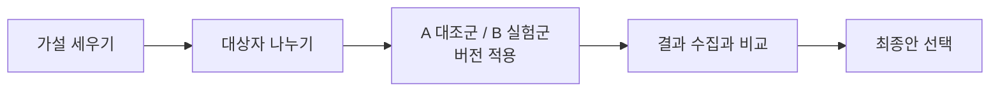
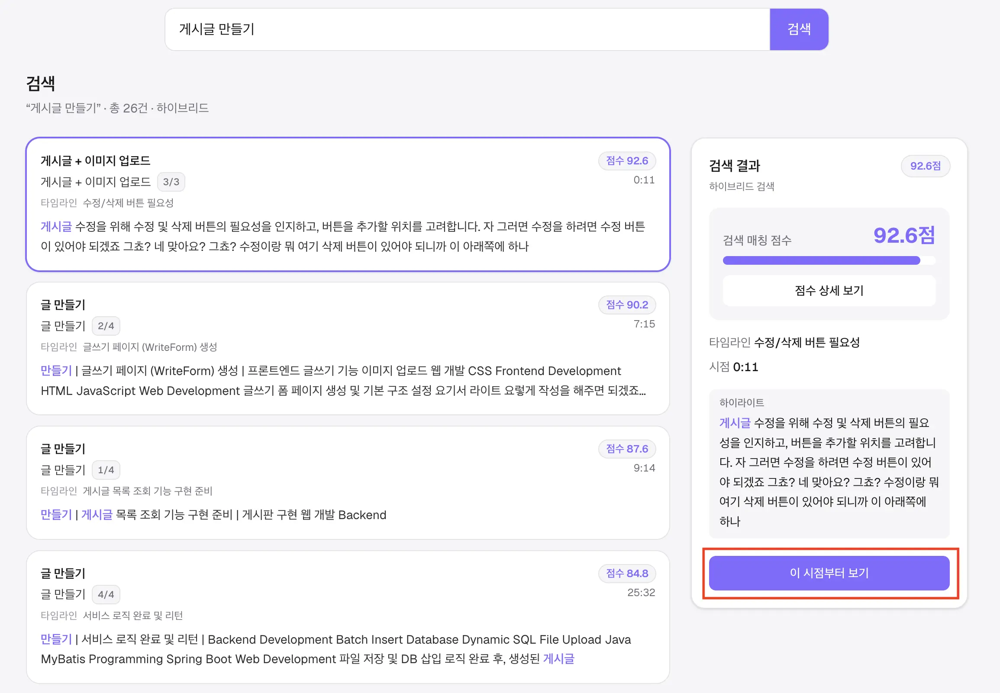
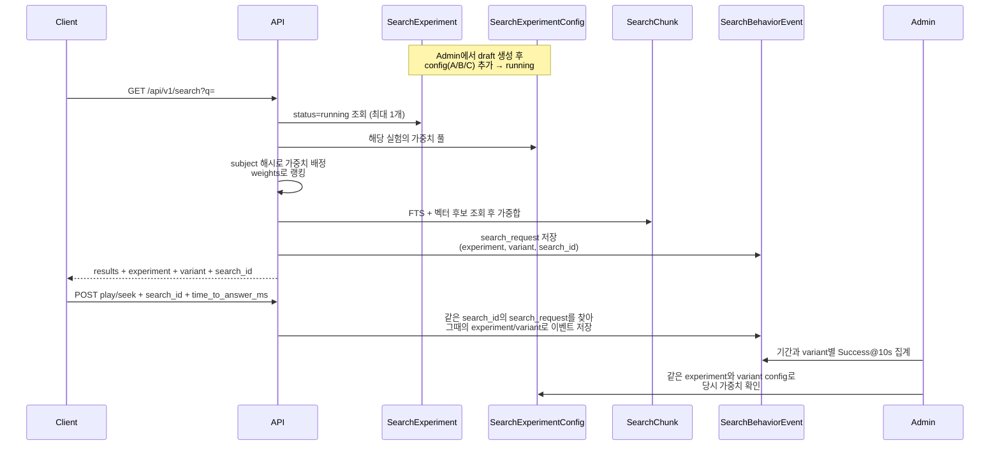
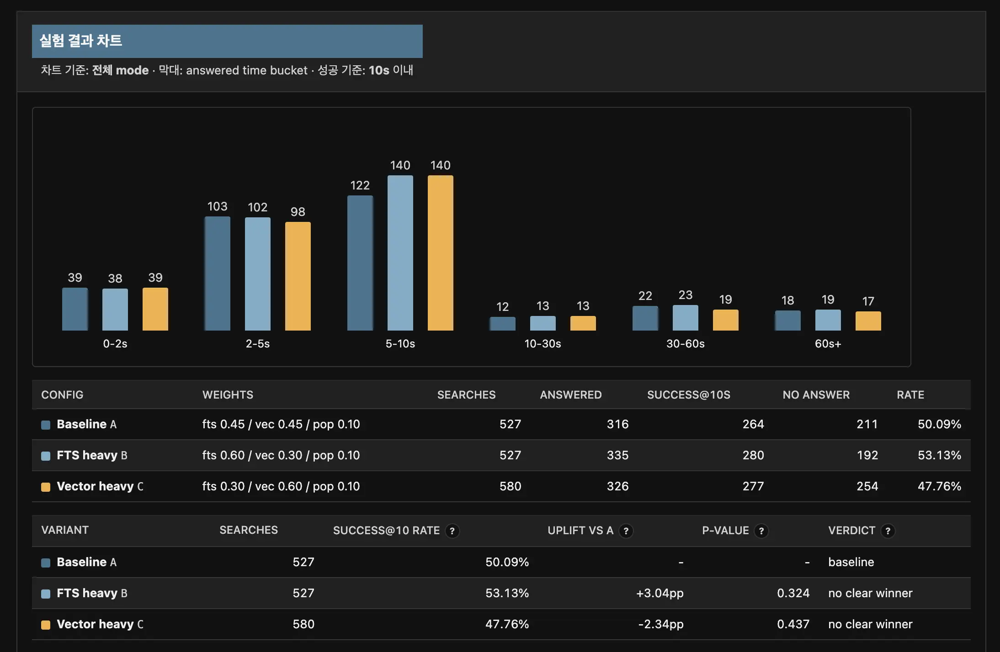
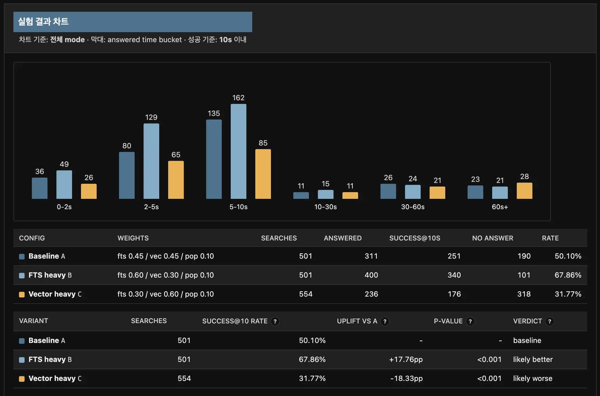

# 개요
이전 [하이브리드 검색](../../07/class-s-hybrid-search/)에서는 FTS, 벡터, 조회수를 `0.45 / 0.45 / 0.10`으로 섞어 순위를 매겼습니다. 그 비중은 일단 동작하게 둔 값이었고, 어떤 조합이 사용자가 원하는지 알 수 없었죠.

실제 서비스에서는 A/B 테스트나 카나리 테스트로 이를 시험해 보기에, 이게 가능한 구조를 적용해 봤습니다.

## A/B 테스트와 카나리 테스트
A/B 테스트는 사용자에게 두 가지 이상 버전을 나누어 보여 준 뒤, 클릭률이나 구매율처럼 정한 목표 지표에서 어느 쪽이 더 나은지 비교하는 실험입니다.

버튼 색이나 문구뿐 아니라, 추천 노출 방식이나 검색 결과 정렬 같은 알고리즘도 대상이 됩니다. 
이번 프로젝트에서 나누는 것도 UI가 아니라 하이브리드 검색의 가중합 비중입니다.

카나리 테스트는 이와 목적이 다릅니다. 신버전을 전체 사용자에게 한 번에 올리지 않고, 트래픽의 일부(예: 1%~5%)에만 먼저 올려 에러율이나 성능 이상을 보는 배포 기법입니다. 광부들이 유독가스를 감지하려고 카나리아를 데려간 데서 이름이 왔고, 신규 버전을 소수로 올린 뒤 모니터링하고, 문제가 없으면 비중을 키워 전체로 넓힙니다.

둘의 차이는 다음과 같습니다.

| 구분 | A/B 테스트 | 카나리 테스트 |
|------|------------|---------------|
| 목적 | 어느 버전이 목표 지표에서 더 좋은지 비교 | 신버전이 안전한지 확인 |
| 성격 | 실험 | 단계적 배포 |

참고로 인프라에서 카나리를 나누는 방법은
- Kubernetes 서비스 메시로 트래픽을 쪼갬
- ALB에서 대상 그룹을 구버전(TG-A)과 신버전(TG-B)으로 두고 가중치(예: 90:10)를 주는 방식

다시 돌아와 이번 글은 어느 지표가 더 나은지 파악한다는 시나리오이므로 A/B 테스트를 적용합니다.

## 현재 프로젝트 적용 방향
성공 기준은 [Dejan Marketing의 SERP 체류 시간 조사](https://dejanmarketing.com/time-on-serps/)를 참고했습니다. 
호주 Google 사용자 1,500명을 대상으로 한 설문에서, 응답자의 약 78%(5초 이내 53% + 6~10초 25%)가 10초 안에 검색 결과 중 어떤 사이트를 열지 고른다고 답했습니다.

웹 검색의 클릭과 강의 검색의 재생은 행동이 다르지만, “결과를 본 뒤 얼마나 빨리 원하는 항목으로 이어지는가”를 성공에 가깝게 보는 점은 참고할 수 있다고 판단했습니다. 그래서 성공 기준은 10초로 두고, 그 안에 답에 도달하면 성공으로 칩니다.

측정 구간은 검색어를 넣어 목록이 렌더된 뒤부터, 사용자가 결과 항목을 고르고 강의 화면에서 재생(`play`)하거나 구간으로 이동(`seek`)하기까지입니다. 목록만 훑고 떠난 경우와 실제로 영상을 연 경우를 같은 클릭으로 묶지 않기 위해서입니다.

아래 사진에서 빨간 영역을 클릭했을 때를 기준으로 합니다.

현재는 검색 결과로 보여주는 기준이 키워드 점수(FTS), 벡터 의미 유사도, 후보 목록 안에서의 상대 조회수까지 세 가지를 합친 매칭 점수를 보여 줍니다. 이 세 가지 점수의 가중치 방식을 이번에 A/B 테스트한다는 시나리오를 세워 접근해 봅니다.

# 데이터 수집
데이터 수집은 앞에서 적은 대로, 검색 결과가 렌더된 뒤 10초 안에 `play` 또는 `seek`가 오면 성공으로 둡니다. 검색 요청과 이어진 행동 이벤트를 모아 Admin 차트로 보고, 어떤 가중치 조합이 더 나은지 비교합니다.

이 운영을 위해 `content_ai`에 세 테이블을 두었습니다. `SearchExperiment`는 실험 하나, `SearchExperimentConfig`는 variant(가중치 조합), `SearchBehaviorEvent`는 사용자 행동 기록입니다.

실험 생명주기는 `draft` → `running` → `ended`이고, 한 번에 `running`은 하나만 둡니다. 가중치는 인덱싱으로 이미 쌓인 `SearchChunk`(FTS, 임베딩)를 다시 만드는 값이 아니라, 검색과 랭킹 순간에 FTS / 벡터 / 조회수를 얼마나 섞을지만 바꿉니다.

| 테이블 | 역할 |
|--------|------|
| `SearchExperiment` | 실험 단위. `key`, `status`, 기간을 갖고 config와 이벤트가 이 행을 참조한다 |
| `SearchExperimentConfig` | 실험 안의 가중치 한 줄. `A`/`B`/`C` 같은 `key`와 `weight_fts` / `weight_vector` / `weight_popularity`를 저장한다. running, ended에서는 수정하지 않아, 과거 이벤트와 비중이 어긋나지 않게 한다 |
| `SearchBehaviorEvent` | 행동 로그. `search_request`는 검색 API가 남기고, `play`/`seek`는 클라이언트가 같은 `search_id`로 이어서 보낸다. 어느 실험과 variant에 노출됐는지와 성공 시각을 남긴다 |

검색했을 때 다음 흐름을 거치며 기록합니다.

# 데이터 통계
관리자가 데이터를 집계해서 볼 수 있도록, Admin 비교 표에는 `success@10s rate`, `uplift vs A`, `p-value`, `verdict`를 표시합니다.

성공률만 보면 표본이 적을 때 우연으로 좋게 나온 쪽을 좋게 볼 수 있고, 이 차이를 믿을 수 있는지 판단하기도 어렵습니다.
그래서 다음 지표들로 “얼마나 자주 성공했는지”, “A(비교 값)보다 얼마나 다른지”, “그 차이가 우연으로 설명되기 어려운지”, “그래서 지금은 어떻게 읽으면 되는지”를 같이 볼 수 있도록 했습니다.

| 지표 | 의미 | 해석 |
|---|---|---|
| `success@10s rate` | 검색 수 대비 10초 이내 첫 `play`/`seek`가 발생한 비율 | A/B 테스트의 핵심 성공 지표 |
| `uplift vs A` | A 대비 성공률 차이, percentage point 단위 | `+`면 A보다 높고, `-`면 A보다 낮음 |
| `p-value` | A와 실제 차이가 없다고 가정했을 때, 현재 수준 이상의 차이가 우연히 나올 확률 | 작을수록 우연으로 보기 어려움 |
| `verdict` | 표본 수, p-value, uplift 방향을 조합한 요약 판정 | 표를 빠르게 볼 때의 보조 해석 |

위 이미지처럼 나오게 됩니다!

## p-value
지금 `p-value`는 [two-proportion z-test](https://en.wikipedia.org/wiki/Two-proportion_Z-test)(두 비율 비교 z검정)로 계산합니다.  
수식 설명까지는 깊게 들어가지는 않았습니다. 운영에서는 “A와 B의 성공률이 사실 같다”고 가정했을 때, 현재 차이가 발생하는 확률을 수치화한거로 이해하시면 됩니다.

예를 들어 A가 검색 200건 중 성공 80건(40%), B가 200건 중 100건(50%)이면 uplift는 `+10pp`입니다. 표본이 작으면 동전을 여러 번 던져도 한쪽이 잠깐 앞설 수 있듯이, 이 10pp도 우연일 수 있습니다. p-value가 그 “우연일 수 있음”을 0~1 사이 숫자로 보여 줍니다.

읽는 법은 다음이면 충분합니다.

| p-value | 읽는 법 |
|---------|---------|
| 큼 (예: 0.3) | 성공률이 같아도 이런 표는 자주 나올 수 있다 → 차이만으로 승자를 정하지 않음 |
| 작음 (예: 0.01) | 같아도 이런 차이가 나기는 드물다 → uplift 방향을 더 믿어 볼 만함 |
| 우리 기준 | `p < 0.05`일 때만 `likely better` / `likely worse`, 아니면 `no clear winner` |

입력은 로그 데이터 전체가 아닌 이미 집계된 네 숫자입니다. `searches`(검색 수)와 `success@10s`(성공 수)를 A/B 각각 넣어서 p-value로 계산합니다. 수식 내부에서는 표준오차, z, erfc 같은 중간식은 그 검정 구현 안에 있는데 우리는 결과만 보면 됩니다.

이 데이터는 사용자 행동을 기준으로 하기 때문에, 장난치거나 비정상인 검색이 섞이면 오염될 수 있습니다. 지금은 Admin에서 A와 다른 variant의 성공 비율을 빠르게 비교하기 위한 운영용 지표로 씁니다.

## verdict
`verdict`는 p-value와 표본 수, uplift 방향을 문구로 요약한 값입니다.

| verdict | 조건 | 의미 |
|---|---|---|
| `baseline` | A variant | 비교 기준 |
| `insufficient` | A 또는 비교 variant의 `searches < 100` | 표본이 적어서 판단 보류 (각 100건 이상) |
| `no clear winner` | `p-value >= 0.05` | 차이가 있어 보여도 통계적으로 뚜렷하지 않음 |
| `likely better` | `p-value < 0.05` 그리고 `uplift vs A > 0` | A보다 성공률이 높을 가능성이 큼 |
| `likely worse` | `p-value < 0.05` 그리고 `uplift vs A < 0` | A보다 성공률이 낮을 가능성이 큼 |

앞의 `result.webp`는 더미 원본이라 p가 커 우연에 가깝게 보입니다.  
아래는 확실히 차이가 발생한다는 가정하에 p 값이 작게 나온 시나리오로 데이터를 넣었을 때 화면입니다.

# 고도화
현재 구조도 가중치에 한해서는 여러 번 실험을 할 수 있지만, 좀 더 넓은 단위나 기능별로도 한 번의 실험으로 끝내지 않고, 실험을 반복해서 돌릴 수 있는 구조를 만드는 일이 앞으로 더 중요해 보였습니다.

이에 대해서는 다음 글을 참고하면 좋습니다.

- [우아한형제들: 실험과 기능 플래그를 위한 실험 플랫폼 구축하기](https://techblog.woowahan.com/9935/): 실험이 자주 생기는 화면을 슬롯으로 나눠, 실험 영역을 따로 관리하는 방식
- [Netflix TechBlog - A/B testing](https://netflixtechblog.com/all?topic=ab-testing): 추천과 개인화처럼 효과가 큰 영역에서 실험을 운영하는 사례
- [Spotify: Experimentation Platform](https://engineering.atspotify.com/2020/10/spotifys-new-experimentation-platform-part-1): 실험 자체를 플랫폼으로 두어 팀 단위로 쉽게 만들고 분석하는 방향

지금은 하이브리드 검색의 FTS와 의미 검색 비중을 나누기 위해 A/B를 붙였습니다. 이후에는 메인 UI처럼 실험이 자주 생기는 지점을 슬롯화해, 같은 방식으로 여러 가설을 돌려 보는 편이 맞다고 보입니다. 유튜브와 같이 자동 추천 알고리즘을 메인에 붙인다면 그 부분을 슬롯으로 관리하면 좋겠습니다.
