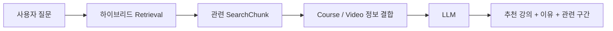
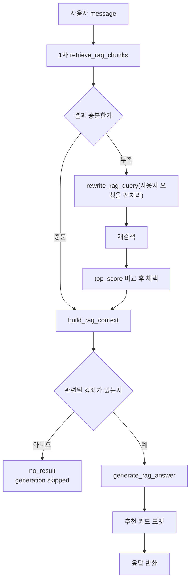
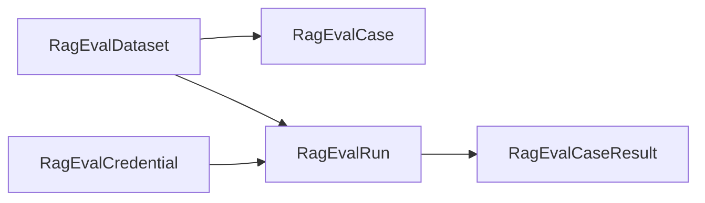

# 개요
이전 [하이브리드 검색](../../07/class-s-hybrid-search/)에서 강의 내용을 청크로 나누고 FTS와 임베딩을 쌓아 두었습니다. 이번에는 그 인덱스를 써서, 질문에 관련 구간을 찾은 뒤 LLM이 답하게 하는 RAG를 붙이려 합니다.
> 이유는 AWS에 Class S를 배포할 때 아마존 큐라는 서비스를 이용해서 모르는 부분과 배포 구조에 대해 조언을 받았는데, 굉장히 편하다는 인상을 받았고, 이 구조를 만드는 데 비용이 얼마나 발생할까? 그리고 그 비용을 최적화하는 데 어떻게 했을까?라는 의문에서 시작했습니다.

RAG는 사용자의 질문과 관련된 정보를 외부 데이터 소스에서 검색(Retrieval)하고, 검색된 정보를 LLM의 컨텍스트로 제공해 답변을 생성(Generation)하는 방식으로 설명됩니다.

이번 글의 목표는 이 방식으로 1차 개발에서 사용자의 상황과 의도를 파악해 강좌를 매칭하는 걸 우선적으로 만들어 보고
고도화로 아마존 큐처럼 내부 문서 기반으로 사이트가 이동되거나 질문에 답변해 주기도 하는 시스템을 만들 겁니다.

벡터 검색은 이전 [Anime Search Project](/posts/2026/05/10/anime-search-project/) 글로 어느 정도 익숙해서 접근이 가벼웠지만, RAG는 구조와 이론 공부가 더 필요해 다음 글을 참고했습니다.
많은 서비스에 예시가 있어서 접근하기 편해져서 좋더군요.

## 어떤 걸 참고할까
위 개요처럼 RAG 시스템을 구현하기로 마음먹은 다음 생각한 점은 두 가지를 기본 틀로 잡았습니다.
> 무조건 서비스를 하는 만큼 실무적으로 접근해야 한다.
> 비용 대비 성능 최적화를 하는 걸 목적으로 하자

고등학교 해커톤 심사로도 나가고 제가 직접 AI 해커톤에 나가보며 느낀 거는 대부분 LLM API와 AI 툴 덕분에 곧잘 개발합니다.
하지만 이를 실무에서 적용하기에는 믿을 수 없는 서비스가 대부분이죠.

그걸 판가름하는 게 실무와의 차이점이라고 생각하고 이 글에서는 이를 중점으로 볼 겁니다.
구현은 가볍게 하고 다른 서비스에서 어떻게 구현했는지를 참고해 보죠.

[인프런: 학습에이전트 - Building the Brain](https://tech.inflab.com/20260621-study-agent/%ED%95%99%EC%8A%B5%EC%97%90%EC%9D%B4%EC%A0%84%ED%8A%B8%20-%20Building%20the%20Brain/)
> 목표로 하는 시스템과 가장 비슷한 RAG 시스템임

* **ADR**: 빠르게 바뀌는 LLM 스택의 선택 이유를 문서로 남기고, AI 컨텍스트에도 넣어 개발 의도를 유지함
* **LLM-as-a-Judge**: Golden Dataset을 기준으로 답변 품질을 자동 평가하고, 반복되는 실패 패턴으로 프롬프트를 고침
* **과적합 방지**: 실패 한 건마다 프롬프트를 고치지 않고, 같은 문제가 반복될 때만 고쳐 평가 데이터에 맞추는 일을 막음
* **프롬프트 캐싱**: 반복되는 System Prompt와 Tool Definition은 캐시해 입력 토큰과 비용을 줄이고, 질문이나 검색 결과 같은 동적 데이터는 따로 보냄
    - System Prompt: LLM의 역할과 답변 규칙을 정하는 지침
    - Tool Definition: LLM이 호출할 도구의 이름, 용도, 입력 형식

---

[우아한형제들: RAG, 들어는 봤는데… 내 서비스엔 어떻게 쓰지?](https://techblog.woowahan.com/25900/)
> RAG 시스템 평가 기준과 전체 파이프라인을 참고함

* **RAG 파이프라인**: Loading → Chunking → Embedding → Storage로 색인하고, Retrieval → Augmentation → Generation으로 질문에 답함
* **검색 품질**: 청크 크기, 메타데이터, 검색 개수, 유사도 기준이 Retrieval 품질을 좌우하므로 검색 결과 자체를 계속 튜닝해야 함
* **Query Optimization**: 사용자 질문을 그대로 쓰지 않고, LLM으로 핵심을 뽑아 검색용 Query로 바꿈
* **RAG 평가**: Contextual Relevance, Answer Faithfulness, Answer Relevance로 검색의 적절성과 답변의 근거 충실도를 봄
    - Contextual Relevance: 검색된 Context가 질문과 얼마나 관련 있는지 봄. 낮으면 Retrieval, Chunking, Query를 고쳐야 함
    - Answer Faithfulness: 답변이 검색된 Context를 얼마나 근거로 삼았는지 봄. 낮으면 사실이 아닌 내용을 생성하는 Hallucination 가능성임
    - Answer Relevance: 최종 답변이 질문에 얼마나 직접적으로 답했는지 봄. 관련 없는 설명이 많거나 의도를 놓치면 낮아짐

---

[Netflix: Foundation Model for Personalized Recommendation](https://netflixtechblog.com/foundation-model-for-personalized-recommendation-1a0bd8e02d39)
> RAG 자체보다는 이후 개인화된 강의 추천으로 확장할 때 참고함

* **사용자 행동 기반 추천**: 시청 기록과 같은 사용자의 행동 이력을 시퀀스로 학습해 최근 행동뿐 아니라 장기적인 취향까지 추천에 반영함
* **Embedding을 추천에 활용**: 사용자와 콘텐츠의 Embedding을 만들어 추천 모델의 Feature나 사용자에게 보여줄 콘텐츠 후보를 검색하는 데 활용함
* **신규 콘텐츠 문제 해결**: 사용자 행동 데이터가 부족한 신규 콘텐츠는 장르, 스토리, 분위기 같은 Metadata Embedding을 함께 사용해 보완함

---

## 적용점
RAG를 붙이려 하지만 대규모 수정보다는 이전 [하이브리드 검색](../../07/class-s-hybrid-search/)에서 자막과 확정 메타데이터를 청크로 나누고 FTS와 임베딩을 쌓아 두었으니, 이를 Retrieval의 출발점인 `SearchChunk`로 삼으려 합니다.

현재 청크 하나에는 영상명, 타임라인 라벨, 태그, 타임라인 설명, 해당 구간 자막이 같이 들어갑니다. 자막이 없으면 `Video.description`으로 청크를 만들게 구성되어 있죠.
현재 상태를 다음 테이블로 표시할 수 있는데, RAG를 하면 아래 모든 데이터를 참고하는 편이 좋겠습니다.

| 이미 쓰는 것 | 아직 안 쓰는 것 |
|---|---|
| `SearchChunk` (자막, 영상명, 태그, 타임라인, 구간 시각, FTS, 임베딩) | 강좌명/설명, 커리큘럼 |
| 조회수 (하이브리드 검색 popularity) | 시청 기록, 완강 기록 |
| | 검색/play/seek 로그, QnA |

## 방향성
1차는 기존 `SearchChunk`로 관련 구간을 찾고, 강좌/영상 정보를 붙여 LLM이 강의와 이유, 관련 구간을 답하게 합니다.
아래와 같은 방향으로 진행되겠군요.



# RAG 시스템 구현
1차 버전은 이전 [하이브리드 검색](../../07/class-s-hybrid-search/)에서 쌓아 둔 `SearchChunk`를 그대로 씁니다.
한 행이 청크 하나를 담당하며, 같은 행에 FTS용 `search_vector`와 1536차원 `embedding`이 함께 들어 있습니다.

데이터는 저장될 때 `text`를 `simple` 기준으로 토큰화해 `search_vector`에 넣고, GIN 역인덱스(`토큰 → 청크 행`)로 찾아갑니다.
검색할 때도 질문을 같은 규칙으로 토큰화한 뒤 매칭됩니다.

임베딩은 문장을 숫자 벡터로 바꾼 뒤 코사인 유사도로 의미가 가까운 청크를 고릅니다.
RAG Retrieval은 이 두 길을 `hybrid_search`로 섞어 후보 청크를 고른 다음, 그 결과를 LLM Context로 넘깁니다.

| 컬럼 | 역할 |
| --- | --- |
| `text` | 청크 본문으로 타임라인과 같이 1200자 기준으로 자름 |
| `start_seconds` / `end_seconds` | 영상 구간 |
| `search_vector` | `tsvector` (GIN 역인덱스) |
| `embedding` | `vector(1536)` (HNSW, cosine) |
| `metadata` | timeline_label, tags 등 |

예시 행은 대략 아래처럼 보면 됩니다.

| id | video_id | start | end | text | search_vector | embedding |
| --- | --- | --- | --- | --- | --- | --- |
| 101 | 10 | 325 | 400 | postgres 인덱스로 검색 속도를... | `'postgres':1 '인덱스':2 ...` | `[0.01, -0.02, ...]` (1536) |
| 102 | 10 | 410 | 480 | 벡터 검색으로 비슷한 문장을... | `'벡터':1 '검색':2 ...` | `[0.03, 0.01, ...]` (1536) |

API 엔드포인트로 `POST /api/v1/rag/chat`를 추가하고, 오케스트레이션은 `ask_rag()`에서 진행합니다.
사용자가 질문을 하면 Retrieval → Augmentation → Generation을 순서대로 호출하는 진입점입니다.
```python
def ask_rag(message: str, *, user, ...) -> RagPipelineAnswer:
    query = (message or "").strip()

    # 1) Retrieval: 필요하면 query rewrite 후 hybrid 재검색
    retrieval, query_rewrite = _retrieve_with_conditional_rewrite(
        query=query,
        user=user,
        ...
    )
    context = replace(build_rag_context(retrieval), query=query)

    # 2) 후보가 없으면 Generation을 건너뛰고 no_result
    if not retrieval.chunks or not context.items:
        return RagPipelineAnswer(
            answer_type="no_result",
            message=_NO_RESULT_MESSAGE,
            recommendations=[],
            generation=_skipped_generation(),
            ...
        )

    # 3) Generation: Context 기반 Gemini JSON 추천
    generated = generate_rag_answer(context, user=user)

    # 4) 추천 카드용 제목·썸네일·score 보강
    recommendations = _enrich_recommendations(
        generated.recommendations,
        context=context,
    )
    if generated.answer_type == "recommendation" and not recommendations:
        return RagPipelineAnswer(answer_type="no_result", ...)

    return RagPipelineAnswer(
        answer_type=generated.answer_type,
        message=generated.message,
        recommendations=recommendations,
        ...
    )
```

전체 오케스트레이션 흐름은 아래와 같습니다.



## Retrieval
사용자 요청에 맞춰 관련 강의 구간을 찾는 단계입니다.

사용자가 "Django로 검색 기능을 만들고 싶어요"처럼 입력하면, 바로 답변을 만들지 않고 먼저 공개 강좌 청크 안에서 후보를 고릅니다.
이때는 이전 [하이브리드 검색](../../07/class-s-hybrid-search/)과 같이 키워드(FTS)와 의미(임베딩)를 같이 보고, 맞은 청크에는 본문·타임라인·태그까지 붙여서 응답을 줍니다.

만약 한 번에 원하는 응답이 생성되지 않는 질문인 경우, 예를 들어 청크가 거의 없거나 점수가 낮으면(기본값 기준 `top_score` 0.3 미만), 채팅 문장을 검색용 짧은 문장으로 다시 써서 한 번 더 찾습니다.<br/>
재작성 프롬프트는 답변을 만들지 않고, 인사말이나 감탄사를 필터링하고 없는 기술명을 지어내지 않게 합니다.
재검색 점수가 원래보다 높을 때만 그 결과를 쓰고, 아니면 1차 결과를 유지합니다.

```text
원문: 혹시 Django로 검색 기능 만들고 싶은데 뭐부터 보면 좋을까요?
재작성 예: Django 검색 기능
```

```python
# Django 검색 기능이 쿼리로 들어가서 검색을 진행
hits, mode, count = hybrid_search(
    query=query,
    user=user,
    page=1,
    page_size=resolved_top_k,
    min_score=resolved_min_score,
    max_hits_per_video=resolved_max_chunks_per_video,
)
```

## Augmentation
검색된 청크를 LLM이 읽을 Context 문자열로 조립하는 단계입니다.

흐름은 단순합니다. Retrieval이 고른 청크 id를 기준으로 Course / Curriculum / Video와 청크 본문을 DB에서 읽고, `[Course]` / `[Video]` / `[Evidence]` 형태로 정리한 뒤 Generation으로 넘깁니다.
같은 강좌에 속한 영상은 하나만 노출되며 Evidence는 데이터마다 표시됩니다.

조립 결과 예시는 아래와 같죠.

```bash
# 검색된 강좌
[Course]
id: 1
name: Django 검색 기능 만들기
description: ...
curriculum_id: 3
curriculum: 백엔드
curriculum_description: ...

# 검색된 영상들
[Video]
id: 10
name: 검색 인덱싱과 점수 결합
description: ...

# 검색에 근거가 된 본문
[Evidence]
chunk_id: 101
00:05:25 ~ 00:06:40
timeline: 하이브리드 점수
tags: FTS, pgvector
score: 0.82
mode: hybrid
(...청크 본문...)
```

## Generation
Augmentation으로 받은 Context를 채팅에 쓸 수 있는 JSON으로 만드는 단계입니다.

Gemini는 응답 형식을 JSON schema로 고정할 수 있어서, `generate_rag_answer`에서 `response_mime_type=application/json`과 아래 schema를 같이 넘깁니다.

```json
{
  "type": "object",
  "properties": {
    "answer_type": {
      "type": "string",
      "enum": ["recommendation", "no_result"]
    },
    "message": { "type": "string" },
    "recommendations": {
      "type": "array",
      "maxItems": 3,
      "items": {
        "type": "object",
        "properties": {
          "course_id": { "type": "integer" },
          "video_id": { "type": "integer" },
          "timestamp_seconds": { "type": "integer" },
          "reason": { "type": "string" },
          "evidence_chunk_ids": {
            "type": "array",
            "items": { "type": "integer" }
          }
        },
        "required": [
          "course_id",
          "video_id",
          "timestamp_seconds",
          "reason",
          "evidence_chunk_ids"
        ]
      }
    }
  },
  "required": ["answer_type", "message", "recommendations"]
}
```

스키마로 형태는 잡아 두고, 내용은 프롬프트 규칙으로 한 번 더 묶습니다.
Context에 없는 `course_id` / `video_id` / `chunk_id`를 만들지 말 것, 근거가 부족하면 `no_result`로 둘 것, 숫자 맞추기용 약한 추천을 넣지 말 것입니다.

```bash
당신은 Class S 강좌 추천 챗봇입니다.
...
- Context에 없는 course_id, video_id, chunk_id를 절대 만들지 마세요.
- 검색된 Context만 근거로 사용하세요.
- 근거가 부족하면 answer_type을 no_result로 두세요.
- 추천은 최대 3개입니다.
...
[User Message]
...
[Context]
...
```

LLM 응답 뒤에는 course/video/chunk_id를 Context와 교차 검증합니다. 맞지 않는 id는 버리고 통과한 추천에 강좌·영상 제목, 썸네일, score를 붙여 프론트 추천 카드용 응답으로 만듭니다.

Retrieval에서 청크가 비면 Generation 호출 자체를 건너뛰고(`skipped`) `no_result` 안내 문구만 반환합니다.

## 실서버

`https://class.devseung.com/`에서 사용할 수 있지만, LLM 키 관리를 사용자가 직접 하는 방식을 택했기에 LLM을 사용한 의미 유사도 검색을 하려면 직접 등록한 뒤에 LLM 서비스가 동작합니다. 그래서 키가 없는 비로그인 상태에서는 FTS를 기반으로 동작하게 구성되었습니다.

- 로그인 (LLM 키 등록)


- 비로그인


직접 테스트해 보면 LLM 키를 등록한 쪽 결과가 더 나은 건 보이지만, 실제 서비스에서 이런 식으로 일일이 비교하는 방식은 좋지 않습니다.
그래서 이런 작업은 테스트·검증·비교·수치화를 코드로 자동화해 두는 작업이 필요하고, 특히 LLM 결과는 주관적인 면이 커서 이 부분이 더 중요합니다.

# 테스트는 어떻게?
LLM API로 외부 모델을 가져와 결과를 도출하는 것 자체가 내부 로직을 알기 어려운 블랙박스고, 여기에 프롬프트를 통한 전처리까지 추가된다면, 각 단계에서 발생하는 작은 오차가 다음 단계로 전달되며 점점 커지는 오차 누적과 오류가 다른 데이터로 전파되는 문제가 발생합니다.
이는 모델 성능이 좋아지더라도 발생할 수밖에 없는 현재 시스템의 고질적인 문제죠.

이를 줄이기 위해서는 최종 결과만 확인하는 것이 아니라 각 단계의 출력을 독립적으로 측정하고, 변경으로 인한 성능 저하를 지속적으로 감지하는 과정이 필요합니다. 우선적으로는 인프런에서 사용했던 `Golden Dataset` 기반의 회귀 테스트 방식을 적용하려 합니다.<br/>
※ 회귀 테스트: 변경 사항이 기존에 잘 작동하던 기능에 나쁜 영향을 주지 않았는지 또는 이전에 고친 버그가 다시 나타나지 않았는지 확인하기 위해 기존 테스트를 다시 실행하는 검증 과정

## 검증 구조

LLM을 주로 측정하는 방식은 두 가지입니다.
- 사용자에게 직접적인 선호도 피드백 받기
- 어떤 입력이 들어오면 어떤 답이 나오게 할지 미리 정해 둬서 테스트 (`Golden Dataset`)

사용자의 직접적인 피드백은 서비스가 트래픽을 받을 때 유리하며, 개발 단계에서는 `Golden Dataset`이 유리합니다.
그래서 이 글에서는 `Golden Dataset`으로 테스트할 수 있게 해봅니다.

LLM-as-a-Judge가 그 기준을 보고 답변 품질을 자동 평가하고, 같은 실패가 반복될 때만 프롬프트를 고치는 식으로 프롬프트가 한쪽으로 쏠리는 과적합을 방지하는 걸 고려할 거지만, 현재는 테스트 결과를 판독하는 Judge LLM까지는 아직 두지 않고, `Golden Dataset`은 관리자단에서 쉽게 수정하고 추가할 수 있게 DB에 데이터로 관리하고 이걸 기반으로 course/video hit와 응답 결과의 답을 회귀로 잡습니다.

실제 적용 구조는 아래처럼 나뉩니다.

| 모델 | 역할 |
| --- | --- |
| `RagEvalDataset` | golden/canary 같은 case 묶음 (`slug`, `name`) |
| `RagEvalCase` | 질문 한 건에 따르는 기댓값 |
| `RagEvalRun` | 특정 dataset/split/mode로 돌린 실행 기록과 snapshot |
| `RagEvalCaseResult` | case별 실제 결과와 pass/fail |
| `RagEvalCredential` | Eval에서 사용할 LLM API 키 (채팅용 사용자 키와 분리) |

`RagEvalDataset`을 Golden과 canary로 역할을 나눠서 관리하는데
- golden은 “이 질문이면 이 강좌/영상이 나와야 한다”를 모아 둔 본 테스트
- canary는 작은 case만 넣어 전체 golden을 돌리기 전에 체크해 보는 용도이다

운영 Golden 전체를 바로 돌리면 비용과 실패 이력이 많이 쌓일 수 있으므로 canary로 미리 확인한 뒤 golden을 실행하는 방식입니다.
성능 측정은 `RagEvalCase`에 데이터 로우로 쌓이게 되고, 여기에 들어가는 필드는 다음과 같습니다.

- `question`: 사용자 질문
- `should_answer`: 이 질문에 추천을 내야 하는지 여부. `true`면 `recommendation`과 기대 course/video hit를 보고, `false`면 억지로 추천하지 않고 `no_result`로 끝낸다. 예외 처리를 위한 플래그
- `expected_course_ids` / `expected_video_ids`: 나와야 할 강좌와 영상
- `expected_keywords`: 답변에 기대하는 키워드
- `split`: dataset 안에서 언제 쓸지 나눈다. `train`은 반복해서 개선하는 부분이고, `holdout`은 최종 비교용이다. 후에 자동 프롬프트 개선 기능을 고려해 분리했다

**Table 관계**


결과 데이터에 대한 정보를 남기고 싶었고, 모델이나 관련 사항이 언제든지 바뀔 수 있기에 따로 저장하는 방법을 고려했고 결과적으로
`RagEvalRun`을 실행할 때 실행 시점의 case 사양을 후에 참고할 수 있도록 `dataset_snapshot` JSON 필드로 남기게 했습니다.

테스트 실행할 때 모드를 정할 수 있습니다. 아래로 내려갈수록 실행 로직과 비용이 커집니다.
- `readiness`(DB/index만, API 없음)
- `retrieval`(검색 hit)
- `full`(rewrite/generation 포함)

# 검증 결과

### 목적

분석중

### 조건

분석중

### 결과

분석중

### 분석

분석중
