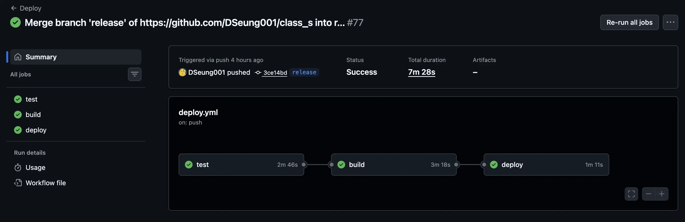
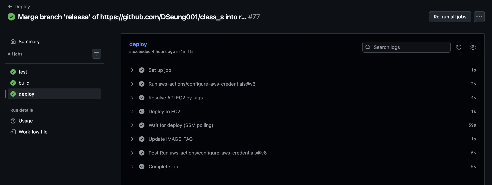
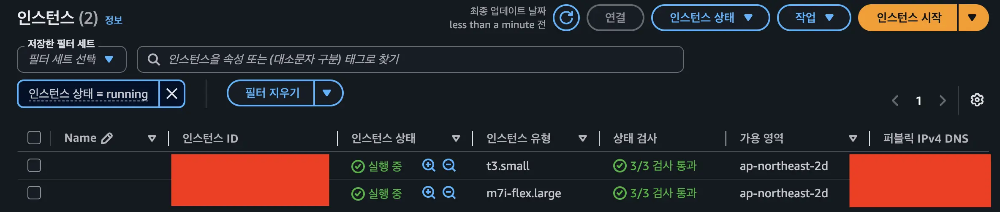

# 사이드 프로젝트 
[사이트 주소](http://class.devseung.com/)  
> OTT 서비스 구조를 직접 만들어보고 싶어서 진행한 사이드 프로젝트

관련해서 전체 히스토리를 보고 싶으시다면, [Class Project 카테고리](/categories/class-project/)로 가시면 됩니다.

# 개요
사이드 프로젝트를 보여줄 때 직접 시연하는 걸 보여줄 수 있지만 다음과 같은 문제가 발생할 수 있죠.
- 예외 상황 발생
- 준비해둔 걸 전부 보여주기 어려움
- 시간의 제약

Class 프로젝트의 경우는 서비스 기획 때문에 문제가 추가로 있습니다.
- 비용 측면 때문에 RAG를 사용할 때 사용자가 직접 API를 등록함
- 강의 업로드는 특정 사용자에게만 권한이 부여되므로 업로드를 직접할 수 없음
- 업로드 후 결과물이 나오는 데 시간이 소요됨 
이를 해결할 방법을 고민하던 중, 현재까지 개발된 부분들 전체 정리하는 포스트를 정리하기로 했죠.

이 포스트를 적음으로써 
1. 페이지 이동 없이 전체 기능을 보여줄 수 있다
2. RAG 비용이 발생하지 않는다
3. 현재 버전을 코드가 아닌 시각자료로 저장해 둘 수 있다.
4. 영상을 통해 다른 시각으로 사이트를 다시 볼 수 있다.

현재 서비스를 하나의 흐름으로 아주 간단히 요약하면 다음과 같습니다.

이제 이 서비스의 흐름을 업로드, 시청, 검색, 챗봇으로 시연하고, 마지막에 배포를 봅시다.

## 업로드 과정
코스를 등록한 뒤 강의 내용 분석을 AI에게 맡기고, 사람이 한 번 검수한 다음 발행하는 시연입니다.
원본은 Presigned URL로 S3에 올라가고, 큐가 쌓이면 워커가 HLS로 인코딩합니다.
[영상]
다음과 같이 메타데이터가 자동으로 생성되는 걸 확인해 볼 수 있고, 이를 수정할 수 있죠.
[영상]
썸네일은 영상 프레임을 고르는 것 외에도 업로드에서 직접 만들기로 모델과 테마를 고르고 프롬프트를 넣으면 AI가 이미지, 도형, 텍스트 레이어로 만들어 주고 수정할 수 있습니다. 현재는 이상적인 썸네일 디자인에 대해서 정의를 하는 중이라 테마는 단일로 추가해뒀습니다. 아직 MVP 적인 요소가 많은 기능입니다.
[영상]

관련글
- <a href="../../07/class-s-hybrid-search/#데이터-흐름" target="_blank" rel="noopener">Class Project 하이브리드 검색 구현하기 - 데이터 흐름</a>
- <a href="../../../06/23/class-s-encoding-server-split-cost-saving/#흐름도" target="_blank" rel="noopener">Class Project 인코딩 서버 분리로 비용 절감하기 - 흐름도</a>
- <a href="../../../07/06/class-s-ai-thumbnail/#개요" target="_blank" rel="noopener">Class Project 썸네일 직접 만들기 + AI 이미지 생성 기능 추가 - 개요</a>

## 시청
사용자는 강좌를 클릭하면 해당 강좌에서 마지막으로 시청한 위치로 이동하고 처음 볼 시 0초부터 시작하죠.
[영상]
프로젝트 구상 시 모든 영상을 보는 걸로 정했기 때문에, 시청 기록은 해당 강좌의 영상 개수 기준으로 표시하고 모든 영상의 끝 부분을 본 걸 완료로 취급합니다.
[사진]
다시 보기 시 이전에 봤던 위치로 이동합니다.
[영상]

관련글
- <a href="../../../06/09/class-project-retrospective-1/#기능" target="_blank" rel="noopener">Class Project 1차 회고 - 기능</a>

## 검색
위에서 언급했듯이 LLM 키는 사용자 계정에 귀속되게 구상했습니다.
그래서 검색은 로그인과 비로그인, LLM 키 등록 여부에 따라 달라집니다, 키가 없으면 FTS만 쓰고, 키가 있으면 의미 검색이 붙습니다.
[영상]
검색 시 키워드를 임베딩할 때 캐싱을 하는데, 그래서 비로그인 사용자라도 캐싱된 데이터라만 의미기반 검색을 사용하기도 합니다.
[영상]

FTS와 의미 기반으로 검색 결과가 다른 걸 확인할 수 있죠.
[사진]

검색에서 가중치 비중은 A/B 테스트를 적용할 수 있게 구상했습니다.
[사진]

관련글
- <a href="../../07/class-s-hybrid-search/#하이브리드-인덱싱" target="_blank" rel="noopener">Class Project 하이브리드 검색 구현하기 - 하이브리드 인덱싱</a>
- <a href="../../12/postgres-fts-vector/#fts" target="_blank" rel="noopener">FTS와 벡터 검색 - FTS</a>
- <a href="../../11/class-s-search-ab-test/#개요" target="_blank" rel="noopener">Class Project 검색 랭킹 A/B 테스트 - 개요</a>
- <a href="../../13/class-s-qa-rag/#실서버" target="_blank" rel="noopener">Class Project 질의응답 RAG - 실서버</a>

## 챗봇
검색을 감싸 챗봇처럼 강좌를 추천하게 했습니다.
사용자 질문을 검색어로 다시 쓸 수는 있지만, 원문 질문이 충분하면 그대로 써서 비용을 줄이도록 구상했습니다.
[영상]

챗봇은 현재 두 가지로 검증할 수 있습니다. 사용자 평가는 위 영상에서 볼 수 있었고 데이터 셋은 관련글에서 볼 수 있습니다.
- 사용자 평가
- Golden Dataset으로 추천 계약 확인

관련글
- <a href="../../13/class-s-qa-rag/#retrieval" target="_blank" rel="noopener">Class Project 질의응답 RAG - Retrieval</a>

## 배포 
배포는 `release` 브랜치 push 뒤 GitHub Actions이 backend, frontend, nginx 이미지를 빌드해 ECR에 올립니다. 
태그가 붙은 API EC2는 SSM으로 그 이미지를 내려받아 재시작합니다. 

인코딩 워커는 SQS 개수를 옵저빙하는 CloudWatch에서 알림을 발생시키면 실행되는 ASG가 이 이미지를 사용합니다.

관련글
- <a href="../../../06/26/class-project-github-actions-auto-deploy/#개요" target="_blank" rel="noopener">Class Project GitHub Actions 자동 배포 - 개요</a>
- <a href="../../../06/23/class-s-encoding-server-split-cost-saving/#흐름도" target="_blank" rel="noopener">Class Project 인코딩 서버 분리로 비용 절감하기 - 흐름도</a>
