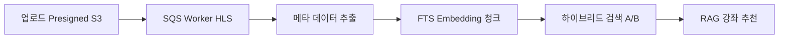

# 개요
다른 사람들한테 보여줄 때 사이트로 보여주는 방법을 지금 사용하고 있지만, RAG 시스템에 경우 API 키 등록이 필요하고 요청마다 비용이 발생하고 있습니다.
이를 해결할 방법을 고민하던 중, 영상으로 담아 정리하면 좋을것 같다는 생각이 들었죠

영상의 좋은 점은
1. 페이지 이동 없이 전체 기능을 보여줄 수 있다
2. RAG 비용이 발생하지 않는다
3. 현재 버전을 코드가 아닌 시각자료로 저장해둘 수 있다.
4. 영상을 통해 다른 시각으로 사이트를 다시 볼 수 있다.

단일 흐름으로 보면 아래와 같이 말할 수 있으며

다음 부분에서 크게 4개의 세션으로 나눠 시연합니다.

## 업로드 과정 
동영상 업로드 보여주고, SQS 구조랑, AWS 알람이 울려서 ASG로 워커 서버가 열려서 이를 작업이 되는 것까지
이때 AI 검수로 데이터가 쌓이는거 보여주고, 실제로 화면에 뿌려지는것까지

## 시청
사용자가 시청한 위치가 보여지고, 타임라인으로 이동이 되는거 

## 검색 & 챗봇
검색 기능으로 텍스트 되는거하고 DB 청킹된것도 참고가 되야할듯
챗봇으로 자연어 기반 검색이 되는 작업이 필요한데

## 운영
운영에서.. 에러 발생시? 운영으로 녹일 수 있는게 있나 
이건 보류 4개가 아닌 3개 세션이 좋을 수 있겠다.