## 사이드 프로젝트
[Class S 사이트 주소](http://class.devseung.com/)  
> OTT 서비스 구조를 직접 만들어보고 싶어서 진행한 사이드 프로젝트

관련해서 전체 히스토리를 보고 싶으시다면, [Class Project 카테고리](/categories/class-project/)로 가시면 됩니다.

## 개요
사이드 프로젝트를 보여줄 때 직접 시연하는 걸 보여줄 수 있지만 다음과 같은 제약이 발생할 수 있죠.
- 준비해둔 걸 전부 보여주기 어려움
- 인코딩 작업에서는 시간이 소요됨

Class 프로젝트의 경우는 비용으로 인해 서비스 제약이 있습니다.
- 비용 측면 때문에 RAG를 사용할 때 사용자가 직접 API를 등록함
- 강의 업로드는 특정 사용자에게만 권한이 부여되므로 업로드를 직접 할 수 없음

이를 해결할 방법으로 `GIF`로 보여주기로 결정했습니다.  
**해당 블로그에서 `GIF`는 클릭해서 확대해서 볼 수 있고 정지/실행이 가능합니다.**

현재 서비스를 하나의 흐름으로 아주 간단히 요약하면 다음과 같습니다.

이제 이 서비스의 흐름인 업로드, 시청, 검색, 챗봇으로 시연하고, 마지막에 배포를 봅시다.

### 업로드 과정
코스를 등록한 뒤 강의 내용 분석을 AI에게 맡기고, 사람이 한 번 검수한 다음 발행하는 시연입니다. 
원본은 Presigned URL로 S3에 올라가고, 큐가 쌓이면 워커가 HLS로 인코딩합니다.  
※ 유튜브 업로드와 영상 업로드 두 개를 지원합니다.
#### 코스 등록
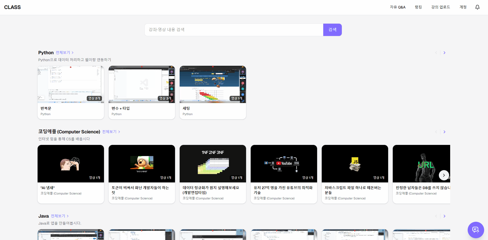
#### 메타데이터 수정
다음과 같이 메타데이터가 자동으로 생성되는 걸 확인해 볼 수 있고, 이를 수정할 수 있죠.
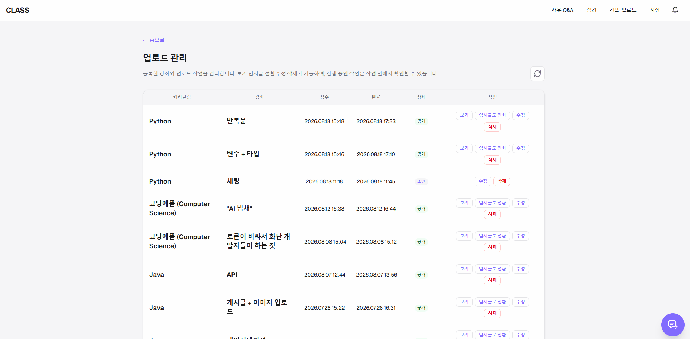
#### AI 썸네일
썸네일은 영상 프레임을 고르는 것 외에도 업로드의 직접 만들기에서 모델과 테마를 고르고 프롬프트를 넣으면 AI가 이미지, 도형, 텍스트 레이어로 만들어 주고 수정할 수 있습니다.
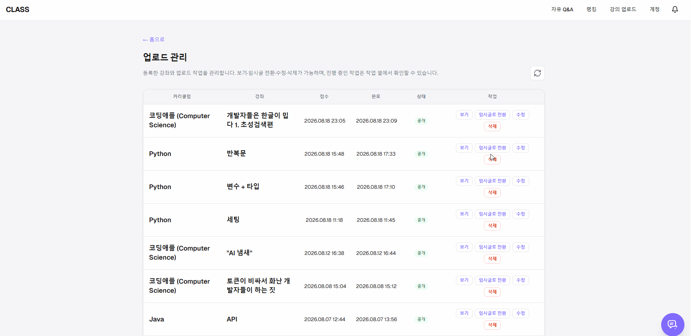

관련글
- <a href="../../07/class-s-hybrid-search/#데이터-흐름" target="_blank" rel="noopener">Class Project 하이브리드 검색 구현하기 - 데이터 흐름</a>
- <a href="../../../06/23/class-s-encoding-server-split-cost-saving/#흐름도" target="_blank" rel="noopener">Class Project 인코딩 서버 분리로 비용 절감하기 - 흐름도</a>
- <a href="../../../07/06/class-s-ai-thumbnail/#개요" target="_blank" rel="noopener">Class Project 썸네일 직접 만들기 + AI 이미지 생성 기능 추가 - 개요</a>

### 시청
#### 이어보기
사용자는 강좌를 시청할 때 영상별로 마지막 시청 구간부터 볼 수 있습니다.
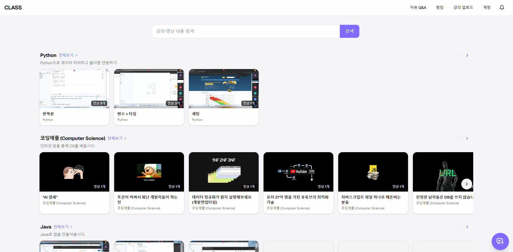
#### 시청 기록
기획에서 시청 완료를 영상 개수 기준으로 정했습니다. 그렇기 때문에 시청 기록은 해당 강좌의 영상 개수 기준으로 표시하며 시청 완료 기준은 영상의 끝 부분을 본 걸로 합니다.
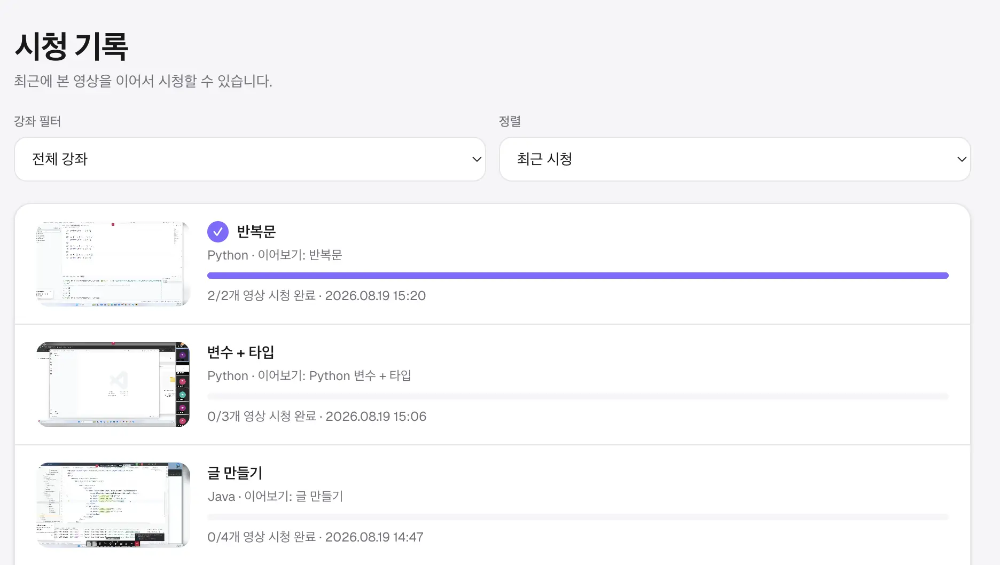
#### 프린트
데이터 정보를 토대로 편의를 위해 프린팅 기능도 추가했죠.
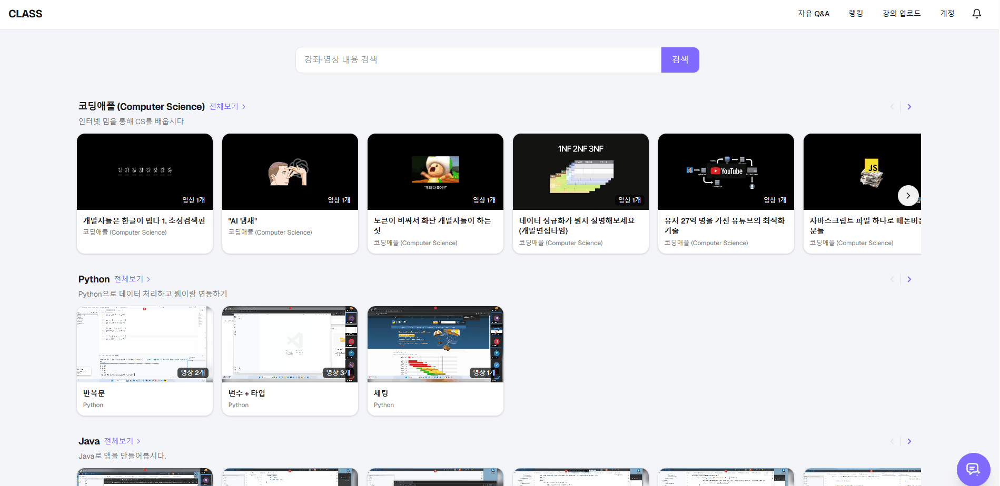

### 검색
위에서 언급했듯이 LLM 키는 사용자 계정에 귀속되게 구상했습니다.
#### 로그인 검색
그래서 검색은 로그인과 비로그인, LLM 키 등록 여부에 따라 달라집니다. 키가 없으면 FTS만 쓰고, 키가 있으면 의미 검색이 붙습니다.

#### 비로그인 캐시 검색
검색 시 키워드를 임베딩할 때 캐싱을 하는데, 그래서 비로그인 사용자라도 캐싱된 데이터를 검색하면 하이브리드로 검색이 됩니다.
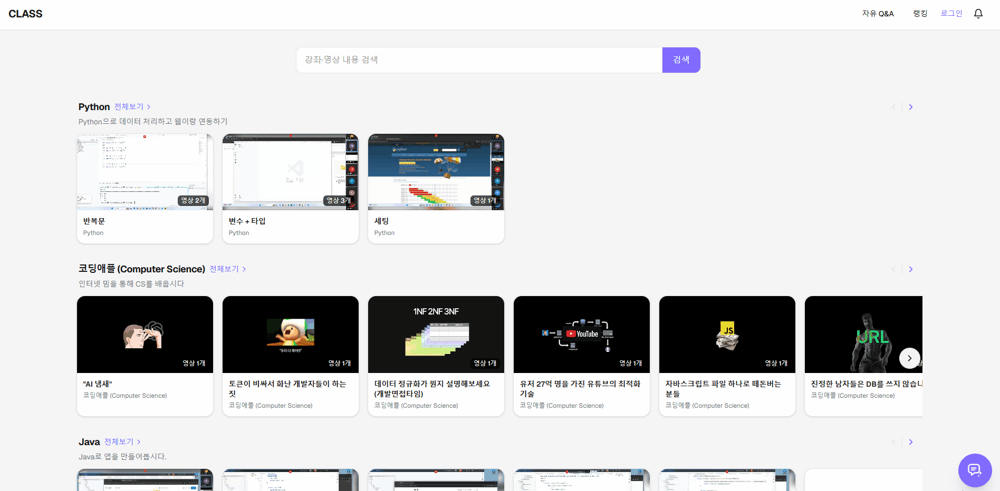
#### 비로그인 FTS 검색
비로그인 상태에서 임베딩되지 않은 걸 검색하면 FTS로 검색이 됩니다.
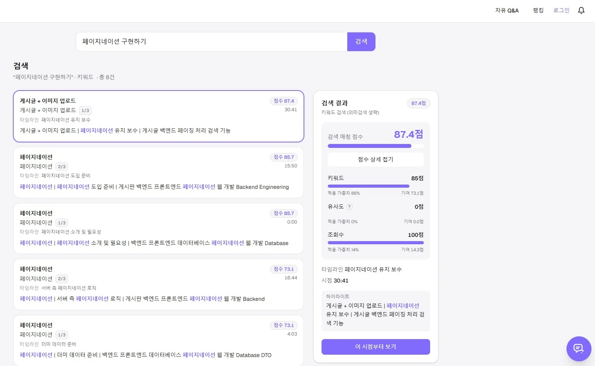
#### 검색 랭킹 A/B 테스트
검색에서 가중치 비중은 A/B 테스트를 적용할 수 있게 구상했습니다.
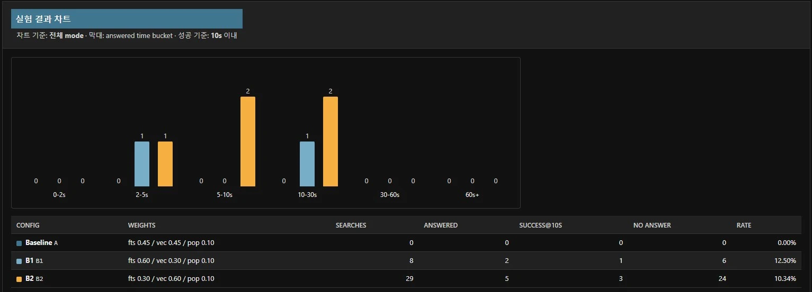

관련글
- <a href="../../07/class-s-hybrid-search/#검색-랭킹" target="_blank" rel="noopener">Class Project 하이브리드 검색 구현하기 - 검색 랭킹</a>
- <a href="../../12/postgres-fts-vector/#fts" target="_blank" rel="noopener">FTS와 벡터 검색 - FTS</a>
- <a href="../../11/class-s-search-ab-test/#개요" target="_blank" rel="noopener">Class Project 검색 랭킹 A/B 테스트 - 개요</a>

### 챗봇
#### 강좌 추천
검색을 감싸 챗봇처럼 강좌를 추천하게 했습니다.
사용자 질문의 결과에 따라 바로 하이브리드 검색을 통해 데이터를 생성하거나, 검색 결과의 점수가 부족할 경우 프롬프트로 요청을 재가공해 다시 요청합니다.
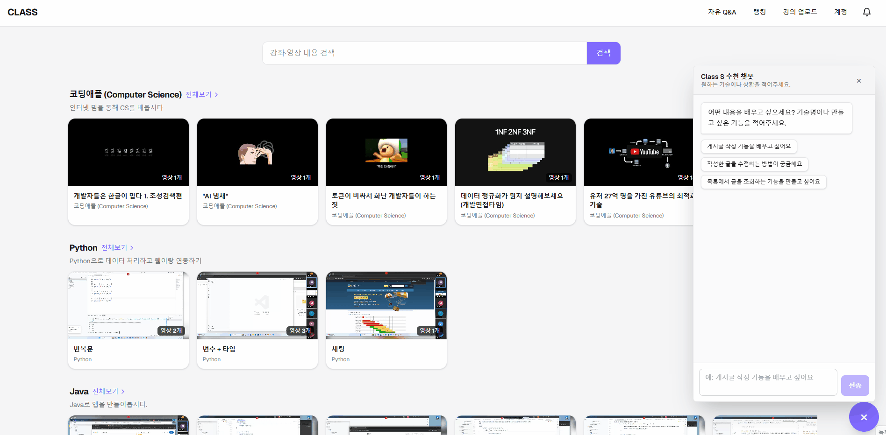
#### 비로그인 챗봇
비로그인 시 아래처럼 표시됩니다.

관련글
- <a href="../../13/class-s-qa-rag/#retrieval" target="_blank" rel="noopener">Class Project 질의응답 RAG - Retrieval</a>
- <a href="../../13/class-s-qa-rag/#실서버" target="_blank" rel="noopener">Class Project 질의응답 RAG - 실서버</a>

### 배포
#### GitHub Actions 배포
배포는 `release` 브랜치 push 뒤 GitHub Actions가 backend, frontend, nginx 이미지를 빌드해 ECR에 올립니다.
태그가 붙은 API EC2는 SSM으로 그 이미지를 내려받아 재시작합니다.

#### CloudWatch 워커 스케일
CloudWatch는 SQS를 옵저빙하며 메시지가 쌓이면 알림으로 워커 ASG를 동작시키는데, 이때 이 이미지를 사용합니다.
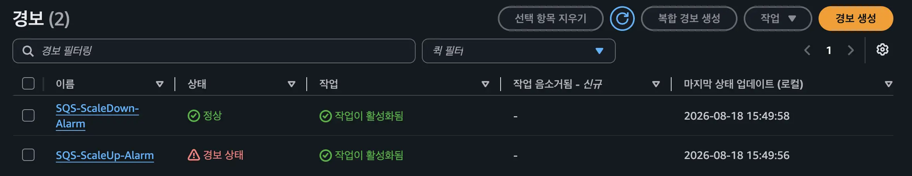

관련글
- <a href="../../../06/26/class-project-github-actions-auto-deploy/#개요" target="_blank" rel="noopener">Class Project GitHub Actions 자동 배포 - 개요</a>
- <a href="../../../06/23/class-s-encoding-server-split-cost-saving/#흐름도" target="_blank" rel="noopener">Class Project 인코딩 서버 분리로 비용 절감하기 - 흐름도</a>
