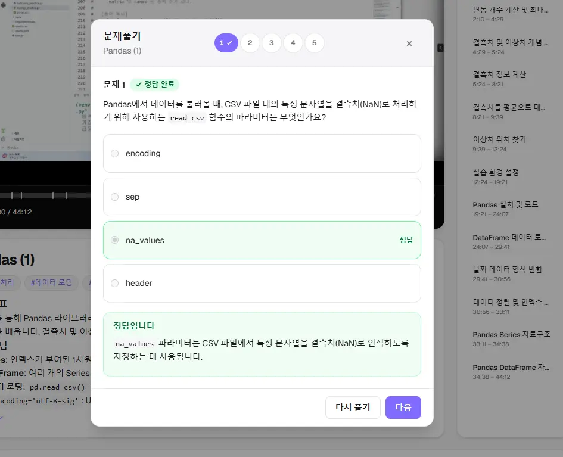
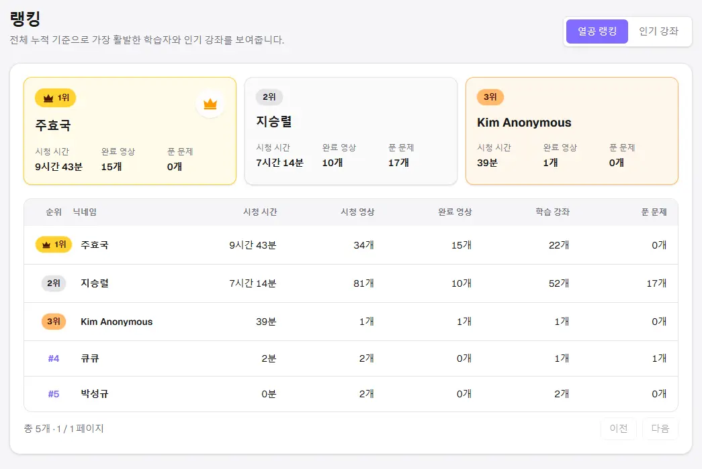
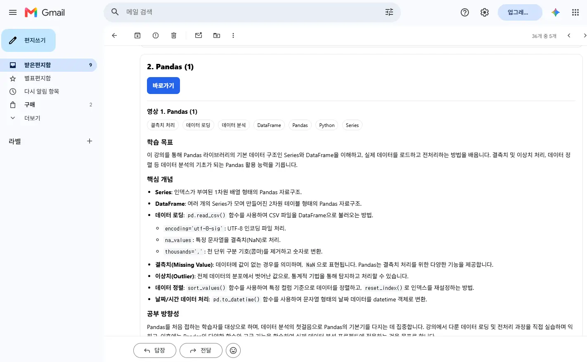
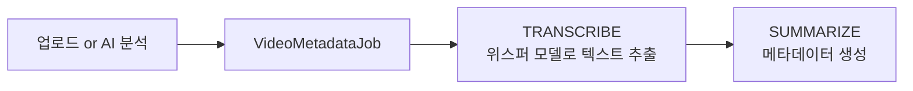
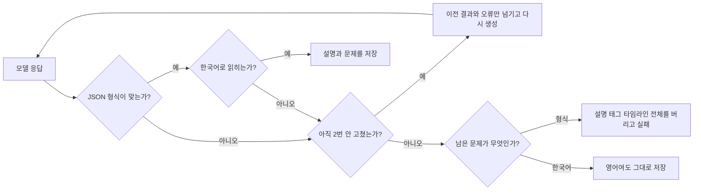
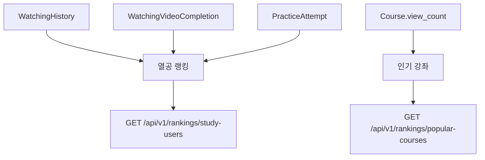
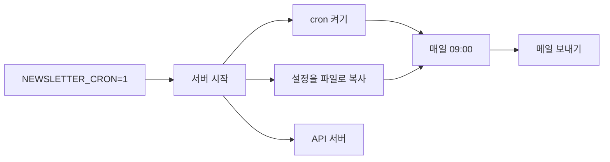
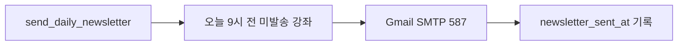
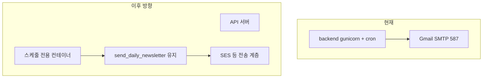

## 개요
처음 이 프로젝트를 만들 땐 단 한 명의 수강생이 있었으면 좋겠다는 생각이 들었지만, 프로젝트에 투입하는 리소스가 늘수록 좀 더 사용자의 체류 시간을 높이고 싶어졌습니다.
영상 콘텐츠를 다루면 참 좋은 게, 확장할 수 있는 기능이 참 많더군요.
이번에는 사용자에게 직접적으로 닿는 3가지 기능을 추가해봤습니다.
- 강의 문제: 강의 영상마다 이 영상의 내용이 담긴 문제를 풀 수 있게 했습니다.

- 랭킹: 누가 누가 더 이 사이트를 잘 사용하고 있는지 알 수 있죠.

- 뉴스레터: 매일 아침 9시에 메일로 전날에 올라온 강의들에 대한 내용과 관련 문제를 받아볼 수 있습니다.


## 흐름
서비스란 데이터의 흐름이 8할 이상이죠, 간략히 보자면 톺아보죠.
### 문제 발행
문제가 생성되는 되는 타이밍은 강의가 발행되는 부분에 맞물려있습니다. <br/>
자막을 뽑는 `TRANSCRIBE` 다음 단계인 `SUMMARIZE`에서 설명, 태그, 타임라인과 같은 JSON에 붙어 나옵니다. 
`SUMMARIZE`에서 만들어진 텍스트 데이터를 기반으로 메타데이터와 객관식 문제를 한 번에 만드는 단계입니다.
정규화를 통과한 문항은 그 자리에서 `PUBLISHED`로 저장됩니다.



잡 워커는 `TRANSCRIBE`가 끝나면 단계를 `SUMMARIZE`로 바꾸고, 메타데이터 생성과 문제 저장을 한 함수에 맡깁니다.

```python
job.current_step = VideoMetadataJobStep.SUMMARIZE
job.save(update_fields=["current_step", "updated_at"])
generate_and_apply_metadata(job)
```
`generate_and_apply_metadata`에서 현재 LLM API에 대한 요청과 AI 사용량 저장, 내부 작업의 오케스트레이션을 담당합니다.
프로바이더 패턴으로 LLM API를 확장할 수 있도록 했고 현재는 Gemini 기준으로 작성되었죠.

핵심 프롬프트는 메타데이터인 태그/본문/타임라인/문제 등을 조립해주는 문자열 조각으로 이뤄졌으며,
조립 순서는 `_assemble_prompt`가 그대로 보여 줍니다. 여기에 `guidance`로 영상 길이별 타임라인 규칙과 문제 개수 규칙이 들어갑니다.

```python
def _assemble_prompt(ctx: MetadataGenerateContext) -> str:
    guidance = _duration_guidance(ctx.duration_seconds)
    return "".join(
        [
            prompt_parts.metadata_persona_generate(),
            prompt_parts.video_header(ctx.video_name, ctx.duration_seconds),
            prompt_parts.korean_output_rule_metadata_generate(),
            prompt_parts.metadata_field_spec_sentence(prompt_parts.ALL_METADATA_AREAS),
            prompt_parts.description_output_surface_rule(),
            prompt_parts.no_timeline_heading_rule_generate(),
            prompt_parts.video_name_immutable_rule(),
            f"{guidance}\n",
            f"{prompt_parts.prompt_version_line(ctx.prompt_version)}\n",
            prompt_parts.transcript_block(ctx.transcript_chunks),
        ]
    )
```

위 프롬프트에서 `_duration_guidance`가 `_problems_field_guidance`를 이어 붙여 문제 규칙을 넣습니다. 

```python
def _problems_field_guidance(p_lo: int, p_hi: int) -> str:
    return (
        f"- problems: {p_lo}~{p_hi}개. 생략하지 마세요. "
        "단일 정답 객관식, 보기 정확히 4개, is_correct는 문항당 정확히 1개.\n"
        "  - 이론(개념, 정의, 원리)과 코드(출력, 버그, API/문법 선택)를 섞으세요.\n"
        "  - 자막에 코드, API, 문법이 없으면 이론만. "
        "강의에 없는 샘플 코드를 창작하지 마세요.\n"
        "  - 강의에서 다룬 일반적인 개념은 공식 문서 등 외부 자료로 "
        "정의, 반례, 함정을 보강하세요.\n"
        "  - is_correct는 실제로 옳은 보기에만 true. "
        "explanation은 그 정답 보기를 가리키며 왜 맞는지 정확히 쓰세요.\n"
        "  - 오답별 해설은 넣지 마세요. 보기는 서로 구별되게."
    )
```

문제 개수는 타임라인처럼 영상 길이를 고려해서 2~5개로 조정되도록 했습니다.

```python
def _problem_range_for_duration(duration_seconds: int) -> tuple[int, int]:
    duration = max(0, int(duration_seconds or 0))
    band = _duration_band(duration)
    if band == "short":
        lo, hi = 2, 3
    elif band == "medium":
        lo = max(2, duration // 500)
        hi = max(lo, min(4, max(3, duration // 350)))
    elif band == "standard":
        lo = max(3, duration // 700)
        hi = max(lo, min(5, max(4, duration // 500)))
    else:
        lo = max(4, duration // 1200)
        hi = max(lo, duration // 900)

lo = max(_PROBLEM_COUNT_MIN, min(_PROBLEM_COUNT_MAX, lo))
hi = max(_PROBLEM_COUNT_MIN, min(_PROBLEM_COUNT_MAX, hi))
return lo, hi
```

LLM 처리하다 보니 가끔씩 전체가 영어로 답변이 나오거나 포맷을 API에 요청으로 넣어도 이를 준수하지 않는 경우가 아주 간혹 발생하더군요.
그래서 스키마가 깨지거나 한국어로 읽히지 않는 필드만 모아서 조립하고 재요청합니다. 이때 통과하면 저장하고, 아니면 이전 JSON만 넘겨 최대 2회 고칩니다.



검증을 통과한 문제 메타데이터는 다음처럼 나오게 되고 이를 통해 화면에서 뿌려지게 구상했습니다.

```json
{
  "stem": "다음 중 장고 미들웨어의 역할로 옳은 것은?",
  "explanation": "요청과 응답 처리를 감싸는 역할을 합니다.",
  "choices": [
    {"body": "요청을 처리한다.", "is_correct": true},
    {"body": "파이썬 코드를 컴파일한다.", "is_correct": false},
    {"body": "인덱스를 생성한다.", "is_correct": false},
    {"body": "CSS를 수정한다.", "is_correct": false}
  ]
}
```

### 랭킹
첫 기획은 퀘스트 시스템으로 일일 미션도 넣고 미션을 클리어한 사람에게는 RPG의 업적처럼 이름 앞에 칭호를 붙여주는 시스템을 넣어볼까 했습니다.
하지만 사용자들이 로그인을 하지 않는 경우도 많고 로그인을 한다 하여도 영상 시청에 중심이 맞춰져 있으니 다른 부분에 리소스를 넣어 보자 했습니다.

신규 기능을 고민하던 중 랭킹 시스템을 넣어달라는 사용자 요청이 들어와 고민해보니 기존 리소스에 아주 쉽게 넣을 수 있고 직관적인 것 같아 채택한 기능입니다.
집계 기준은 시청 기록 시간, 시청 완료 영상, 문제 풀이 순으로 두었죠.
또 제 니즈로 사용자들이 많이 본 영상도 올려두었습니다. 현재 비로그인 사용자도 쿠키로 기록해서 일일 1번 조회 수 카운트를 하므로 이 부분은 나중에 실시간 인기 영상 등으로도 확장이 가능하겠네요.



### 뉴스레터
강의를 통한 메타데이터에 더해 문제 데이터까지 확보가 되었는데, 이를 토대로 적극적으로 활용할 방안이 없을까 고민해봤을 때
제 스팸함에 쌓여 있는 경제 관련 뉴스레터들이 보이더군요. 한때 재밌게 봤었던 기억이 나 이걸 도입하면 구독한 사람들이 좀 더 관련 개념에 많이 노출되게 되고 이를 통한 학습의 진입 장벽을 줄일 수 있지 않을까?라는 생각을 하게 되었고

뉴스레터 형식으로 만들게 되었습니다.
배포 환경의 일일 발송은 EC2 호스트 `crontab`이 아니고 도커 이미지를 말아서 ECR에 올리고 현재 백엔드 서버가 굉장히 가냘픈 걸 고려해서 backend 컨테이너 안의 cron으로 돌도록 했습니다. <br/> 
※ cron: 유닉스 계열 운영체제에서 정해진 시각에 명령을 실행하는 스케줄러 <br/> 

배포에서는 메일 보내는 알람을 API 서버 안에 같이 켭니다. `NEWSLETTER_CRON=1`이면 켜고, 로컬은 `0`이라 꺼 둡니다. 시각은 한국 시간 매일 아침 9시로 하고 스크립트로 cron에서 환경 변수를 읽을 수 있도록 서버가 뜰 때 비밀번호 같은 설정을 파일로 복사해 두고, 9시에 그 파일을 읽은 다음 메일 명령을 실행합니다. API 서버(gunicorn)는 같은 컨테이너에서 그대로 떠 있습니다.


스케줄링 다음 한 줄입니다. `. /app/.cronenv`가 위에서 복사한 설정을 읽는 부분입니다.

```
0 9 * * * root . /app/.cronenv && cd /app && python manage.py send_daily_newsletter >> /proc/1/fd/1 2>&1
```

전송은 SMTP입니다. SMTP는 메일 서버로 메일을 보내는 전송 프로토콜이고, 설정 기본값은 Gmail `smtp.gmail.com` 587번 포트에 TLS입니다.



뉴스레터 대상은 09:00 KST 이전에 발행됐고, 아직 `newsletter_sent_at`이 비어 있는 공개 강좌 전부입니다. 
문제는 그 강좌들에서 영상 순서상 첫 `PUBLISHED` 문항 1개만 붙입니다. (너무 많아질 수 있으니)

```python
def pending_newsletter_courses(*, now=None):
    cutoff = nine_am_today_seoul(now=now)
    return Course.objects.filter(
        publication_status=CoursePublicationStatus.PUBLISHED,
        newsletter_sent_at__isnull=True,
        published_at__lt=cutoff,
    ).order_by("published_at", "id")
```

메일 발송이 끝난 뒤에 강좌들에 `newsletter_sent_at`을 추가합니다.

```python
course_ids = [item.course.id for item in items]
with transaction.atomic():
    Course.objects.filter(pk__in=course_ids).update(newsletter_sent_at=timezone.now())
```

## 개선 방향
### 뉴스레터
현재는 소량이라 Gmail SMTP로 충분하고 비용 최적화를 위해 API 서버와 동일한 컨테이너로 뒀지만 후에는 분리해서 안정성과 확장성을 챙기는 편이 좋겠습니다.




현재 기능에서 실패 처리, 분산 처리 등을 넣어 고도화를 하거나 외부 Amazon SES 등도 고려해 볼 수 있겠네요.