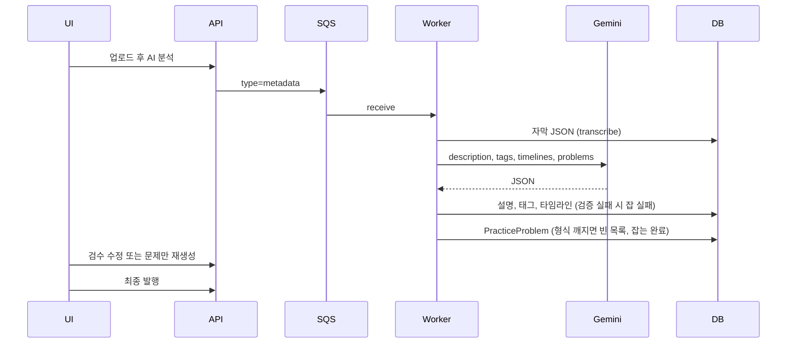
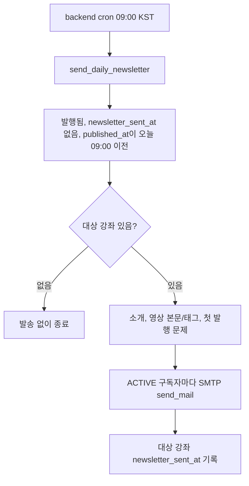

# 개요
학습은 시간에 비례한다고 생각합니다.
자주 노출되는 부분을 더 잘 알게되고 관심있어지고 좋아하게 되는 건 자연스럽죠.

처음에 이 프로젝트를 만들 땐 단 한명의 실사용자라도 수강생이 있었으면 좋겠다는 생각이 들었습니다.
그래서 처음 기획인 VOD 서비스로 진행되었고 이 부분은 상당 부분이 완료되었죠.
기본 틀은 빠르게 구현되었고 비용과 안정성 측면으로의 고도화가 이뤄졌습니다.
그렇게, 이제는 좀 더 사용자가 학습에 많이 노춢되고 흥미를 느끼게 만들고 싶어진 단계가 되었고

다음 기능들을 추가 구현했습니다.
- 강의 문제: 강의 영상마다 이 영상에 내용이 담긴 문제를 풀 수 있습니다.

- 랭킹: 누가 누가 더 이 사이트를 잘 사용하고 있는 지 알 수 있죠.

- 뉴스레터: 매일 아침 9시에 메일로 전날에 올라온 강의들에 대한 내용과 관련 문제를 받아볼 수 있어 리마인드의 도움이 됩니다.


아래 흐름 컨펌
# 흐름
세 기능은 하나 소스로 묶입니다.
강의 업로드 시 위스퍼 모델로 추출한 Text를 가지고 문제를 만들고, 그 문제를 풀거나 영상을 본 기록을 바탕으로 랭킹으로 보여 주며, 다음날 아침 메일로 강의에 대한 메타데이터랑 문제를 보내줍니다.

이전 [하이브리드 검색](../../07/class-s-hybrid-search/)에서 나눈 `publish` / `metadata` / `search_index` 잡 중, 문제는 강의 업로드시 생성되므로 `metadata` 잡에 이어 붙였습니다. 

영상에서 텍스트 데이터를 추출하고 이를 기반으로 설명, 태그, 타임라인을 채우는 그 호출에 같이 객관식 JSON을 같이 받는 구조입니다, 그래서 현재 시스템으로는 텍스트 데이터가 있을 경우는 바로 문제 발행이 가능하도록 서비스 로직을 분리했습니다.

## 문제 발행
이를 더 자세히 보면 `metadata` 잡은 `transcribe` 다음에 `summarize`로 넘어가고, 여기서 Gemini가 `description`, `tags`, `timelines`와 함께 `problems`를 한 JSON으로 돌려줍니다.
사실상 프롬프트 측면에서는 확장과 다름없죠.

-- 아래 좀 이상한데?
차이점으로는 설명, 태그, 타임라인은 검증에 실패하면 잡 자체가 실패합니다. 
문제는 `normalize_practice_problems`로 포멧을 통과하지 못해도 중요도가 비교적 낮고 재추출 비용이 높으므로 바로 저장됩니다.

선생님은 검수 단계에서 문항을 고치거나, 자막이 있는 영상에 한해 문제만 다시 생성할 수 있습니다. 재생성 API는 DB에 바로 쓰지 않고 초안만 돌려 주고, 확정은 PUT으로 영상 단위 교체합니다.



문항 계약은 짧습니다. 지문(`stem`), 해설(`explanation`), 보기 4개, 정답은 문항당 정확히 1개입니다. 하나라도 어긋나면 그 응답의 문제 목록 전체를 버립니다.

개수는 영상 길이에 맞춥니다. 10분 미만은 2~3개, 25분 미만은 3~4개, 50분 이하는 4~6개, 그보다 길면 5~8개입니다. 프롬프트는 자막에 나온 개념을 바탕으로 하되, 정의와 시그니처 같은 일반 지식은 공식 문서로 보강하라고 적습니다. 강의에 없는 샘플 코드를 창작하는 일은 막습니다.

대표 로직은 저장 직전 정규화입니다. 메타데이터 검증과 문제를 한 스키마로 묶지 않은 이유가 여기 있습니다.

```python
# 메타데이터는 검증 실패 시 잡 실패, 문제는 깨져도 빈 목록
raw_problems = last_raw.get("problems") if isinstance(last_raw, dict) else None
replace_llm_problems_for_video(
    video,
    normalize_practice_problems(raw_problems),
)
```

`normalize_practice_problems`는 보기 개수나 정답 개수가 아니면 `[]`를 돌려줍니다. 그 상태에서 `replace_llm_problems_for_video`를 호출하면 해당 영상의 기존 문항을 지우고 새로 넣습니다. 재생성은 이 경로를 타지 않고, 자막 키(`edited_object_key` 또는 `raw_object_key`)가 있을 때만 Gemini를 다시 부릅니다.

## 랭킹
별도 집계 테이블은 없습니다. 화면에 보이는 숫자는 이미 쌓인 시청, 완료, 풀이 row를 요청 시점에 annotate한 값입니다. 스태프와 비활성 계정은 빼고, 시청 시간이 1초라도 있는 사용자만 학습자 랭킹에 넣습니다.

정렬은 시청 시간, 그다음 완료 영상 수, 그다음 시청 영상 수입니다. 학습 강좌 수와 푼 문제 수는 보여 주지만 순위 키는 아닙니다.

| 화면 | 원본 | 집계 |
|---|---|---|
| 시청 시간 | `WatchingHistory.watched_seconds` | 사용자별 합 |
| 시청 영상 | `WatchingHistory.video_id` | 중복 없는 개수 |
| 완료 영상 | `WatchingVideoCompletion.video_id` | 중복 없는 개수 |
| 학습 강좌 | `WatchingHistory.course_id` | 중복 없는 개수 |
| 푼 문제 | `PracticeAttempt.problem_id` | 중복 없는 개수 |
| 인기 강좌 | `Course.view_count` | 발행된 강좌를 조회수 내림차순 |

시청 기록은 사용자와 영상당 1행입니다. 합은 세션 로그가 아니라, 그 영상에 누적된 초입니다. 완료는 시청 완료 row가 생긴 영상만 셉니다.

푼 문제는 시도 전부가 아닙니다. `PracticeAttempt`는 정답을 고른 뒤에만 생기고, 사용자와 문제당 1행입니다. 오답은 저장하지 않으므로 랭킹의 푼 문제는 맞힌 문항 수에 가깝습니다.

인기 강좌 탭은 학습 행동이 아니라 `Course.view_count`입니다. 상세를 연 횟수이고, 시청 초나 문제 풀이와는 다른 축입니다.

## 뉴스레터
배포에서는 호스트 crontab을 쓰지 않습니다. `backend` 컨테이너가 gunicorn과 함께 cron을 띄우고(`NEWSLETTER_CRON=1`), 매일 09:00 KST에 `python manage.py send_daily_newsletter`를 실행합니다. 로컬 `dev.sh`는 이 플래그가 꺼져 있어 아침 메일이 나가지 않습니다.

대상 강좌는 전날이 아니라, 오늘 아침 9시 이전에 발행됐고 아직 `newsletter_sent_at`이 비어 있는 발행 강좌입니다. 구독자는 `ACTIVE`만 넣습니다. 인증 대기와 해지는 빠집니다.

메일 한 통에는 그날 대상 강좌의 소개, 영상 본문과 태그, 강좌당 첫 번째 발행 문제 1개가 들어갑니다. 본문은 텍스트와 HTML을 같이 보냅니다.



지금 전송은 Django `send_mail`이고, 백엔드는 SMTP입니다. SMTP는 Simple Mail Transfer Protocol이고, 앱이 메일 서버에 직접 접속해 한 통씩 보내는 방식입니다. 구독자가 적으면 이 루프로 충분하고, Gmail SMTP 한도로도 버팁니다. `--dry-run`은 메일을 보내지 않고 대상만 세므로, 배포 전에 건수를 볼 때 씁니다.

한 명 실패해도 다음 구독자는 이어 보내고, 루프가 끝난 뒤에야 강좌에 발송 시각을 찍습니다. 실패 건이 있어도 강좌는 다시 대상에 안 올라옵니다. 지금 규모에서는 재발송보다 중복 메일을 막는 쪽이 맞다고 봤습니다.

구독자가 늘면 SMTP를 그대로 두기는 어렵습니다. 소비자 Gmail은 하루 발송 한도가 낮고, 반송(bounce)과 수신 거부(complaint)를 앱이 모으지 않습니다. 이미 S3, SQS, EC2를 쓰고 있으니 다음 단계는 Amazon SES가 자연스럽습니다. SES는 Simple Email Service이고, AWS에서 발송 한도와 반송을 맡아 주는 메일 전송 서비스입니다.

바꿀 때도 다이제스트를 모으는 로직은 두고, `send_mail`만 SES로 갈아끼우면 됩니다. 수신자가 더 많아지면 구독자 루프를 SQS 메시지 한 건으로 나누는 쪽이, 지금 cron 한 번에 끝내는 방식보다 안전합니다. 그때도 호스트 crontab과 컨테이너 cron을 동시에 켜면 이중 발송이 되므로, 스케줄 진입점은 하나만 두는 현재 제약은 유지하는 편이 맞습니다.

# 사용
사용자 반응 나쁘지 않음

# 후기 
설명의 디테일, 본질을 해치지 않는 선에서의 가이드라인이 맞을까
AI의 블랙박스 및 오디오로 생기는 이상한 느낌
=> 특힘 문제의 맥락이 자막 기반이니 문제만 봤을 때 이상한 느낌이 생길 수 있으
