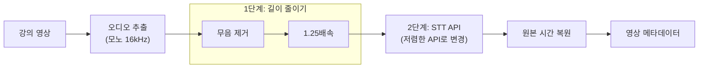
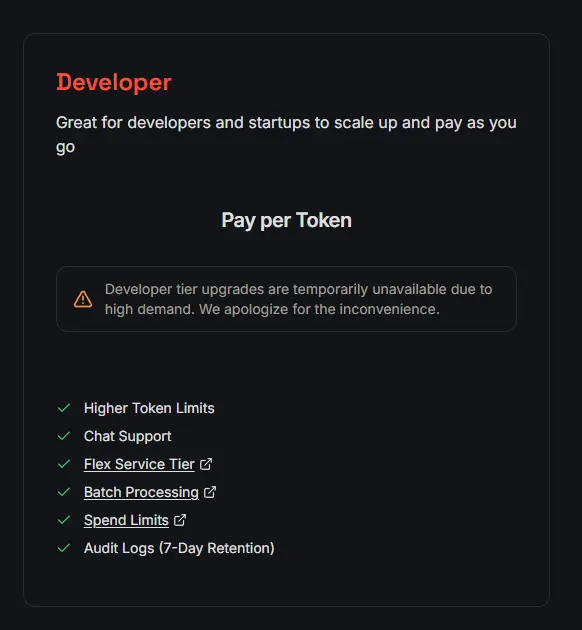
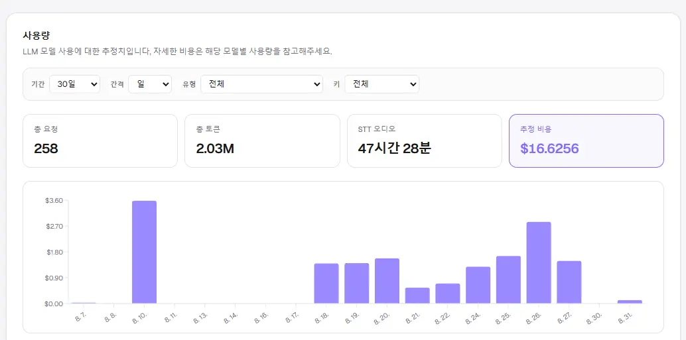

## 개요
이전까지는 하루 강의치를 전부 올리면 대략 $1.2~$1.5 선으로 나왔습니다.  
이 비용은 서버 비용까지 합친 게 아니라 오직 AI 비용이며, 하루에 4~5시간짜리 영상을 올리면 여기서 텍스트를 추출하고 임베딩하는 비용 전체를 나타내죠. 이 비용의 대부분은 오디오에서 텍스트를 추출하는 비용이었습니다. 매우 비싸게 지출되고 있었죠.

처음에는 MVP였기에 가장 사용이 많은 OpenAI의 `Whisper`가 자료가 많으니 이를 택했습니다.
이 API의 비용 산정은 제출한 오디오 길이에 비례하는데 분당 $0.006가 과금되는 방식입니다.
`whisper-1` 모델 말고도 더 절반 정도 가격의 더 저렴한 모델이 존재하지만, 현재 방식은 타임라인이라는 영상별로 세션을 나눠 해당 세션의 책갈피 역할을 하는 기능이 있었기에 텍스트에 타임라인을 녹여주는 해당 API가 적합했죠.
이제는 해당 기능이 어느 정도 안정화되었으니, 비용 최적화를 진행해봅시다.

## 해결 과정

STT를 하기 위해 사용되는 비용을 줄이는 방법을 고민해봤을 때 크게 2가지였습니다.
- Whisper에 넣는 오디오 길이를 줄이기
- 저렴한 API로 변경

Class S는 두 가지를 같이 적용해봤습니다.
다음 그래프에서 보이는 것처럼 2가지 포인트에서의 변경을 만듭니다.

### 무음 처리

Whisper는 말이 없는 침묵 구간도 오디오 길이에 포함해 과금합니다. 
그래서 먼저 영상에서 무음을 빼고, 말 있는 부분만 Whisper에 넣는 방법부터 시도했습니다.

5분짜리 강의 샘플로 실험해 보니, 무음을 잘라 말 구간만 이어 붙이면 길이가 약 300초에서 272초로, 대략 10% 줄었습니다.
처음에는 오디오를 편집함으로써 안정성이 떨어질까 걱정하였지만 샘플링 테스트 결과는 오히려 더 안정적으로 느껴졌습니다.

안정성이 좋아진 쪽을 추측했을 때 말 구간 비중입니다. 
Whisper는 말이 없는 구간에서도 자막을 지어내는 환각이 있습니다. 환각은 입력에 말이 없는데도 텍스트를 만들어 내는 오류입니다. 
저와 비슷한 사례는 아래처럼 몇 군데 있었더군요. Whisper도 소리를 들은 뒤 텍스트를 추론해 내기 때문에, 말이 거의 없어도 자막을 만들라고 하면 더미 문장이 붙습니다.
- [Barański 등의 ICASSP 2025 실험](https://arxiv.org/abs/2501.11378)에서는 비음성 오디오 약 30만 건 중 40.3%에서 환각이 났고, 침묵을 붙인 음성에서도 17.1%가 환각이었습니다. 같은 실험에서 말 구간만 이어 붙여 넣으면 환각이 21.3%에서 0.2%로, WER(단어 오류율)은 104.8%에서 8.0%로 줄었습니다.
- [WhisperX](https://arxiv.org/abs/2303.00747)도 VAD(음성 활동 검출, 말 있는 구간을 찾는 기법)로 비활성 구간을 자른 뒤 환각과 반복 출력이 줄었다고 보고합니다.

Class S에도 같은 방식을 적용했습니다. 흐름은 아래와 같습니다.
이 부분은 원본 리소스의 내용을 해치지 않도록 최대한 보수적으로 무음 처리를 했습니다.

1. 영상에서 오디오를 모노 16kHz로 뽑은 뒤, ffmpeg `volumedetect`로 `mean_volume`과 `max_volume`을 측정합니다. 
- 디지털 오디오의 최대 표현 가능 크기인 0 dBFS로 표현
- mean_volume: 오디오 전체 구간의 평균적인 음량 (ex: -24.0 dB)
- max_volume: 오디오에서 가장 큰 순간의 피크 음량 (ex: -3 dB)
2. 강의마다 녹음 레벨이 달라 고정 dB 하나로 자르지 않습니다. 
- 기준치는 `mean_volume`에서 10 dB를 뺀 값이고, 한 번의 큰 소리에 기준이 끌려가지 않도록 `max_volume`에서 35 dB를 뺀 값과 비교해 더 낮은 쪽을 사용합니다. 
- 기준치가 -55 dB와 -25 dB 사이에 속하게 하고 만약 측정에 실패하면 -30 dB를 기본값으로 사용합니다. 
3. 2번 기준에서 0.4초 이상 지속되는 부분을 무음으로 처리해 편집합니다.
4. 편집된 결과물을 Whisper에 보냅니다.
5. Whisper가 돌려준 자막 시간은 원본 영상 시간으로 조정합니다. (타임라인 기능을 위해)

### 배속 적용

Whisper는 결국 제출 오디오 길이에 비례해서 금액을 책정하더군요. 그러면 어느 정도 배속을 해도 괜찮지 않을까 하는 접근이 있었습니다.
같은 5분 샘플로 배속까지 올려 비교했습니다.

| 케이스 | 길이 | 원본 대비 감소 | 판단 |
|---|---:|---:|---|
| 원본 | 299.94초 | 기준 | 품질 기준선 |
| 압축 | 272.01초 | 약 9.3% | 절감 폭이 작지만 소량의 품질 상승 |
| 압축 + 1.25배속 | 217.62초 | 약 27.4% | 비용/품질 균형 |
| 압축 + 1.5배속 | 181.34초 | 약 39.5% | 품질 저하로 비추천 |

품질 판단은 당시 로컬 테스트 모델 기준이었으므로 절대적인 전사 정확도보다, 배속을 올렸을 때 얼마나 더 망가지는지를 비교하는 데 초점을 뒀습니다. 테스트 모델 성능이 좋지 않아 전반적으로 이상한 표현이 많이 나왔지만 1.25배속과 1.5배속 사이 차이는 충분히 구분되었기에 1.25배가 좋아 보였습니다.

| 관점 | 1.25배속 | 1.5배속 |
|---|---|---|
| 강의 흐름 | 문장 단위로 따라갈 수 있음 | 큰 흐름은 비슷 |
| 핵심 단어 | 일부만 틀림 | 핵심 단어가 자주 깨짐 |
| 반복 출력 | 거의 없음 | 같은 말이 연속 반복 |
| 길이 절감 | 약 27% | 약 40% |

1.25배속은 가끔 단어 하나가 틀렸지만 이는 배속보다는 모델 성능 문제에 가까웠습니다.
1.5배속은 비용은 더 줄지만 핵심 단어가 더 자주 깨지고, 끝부분에 같은 말이 반복되는 환각이 붙었습니다. 

현재 파이프라인에서 기본값은 1.25배속으로 두었습니다.

### Groq 적용

Groq는 Whisper 계열 모델을 자체 하드웨어로 제공하는 STT API입니다. 
비용이 OpenAI보다 매우 싼데 이유는, 검증 디코딩 단계를 줄이고 해당 작업에 특화된 하드웨어로 돌리더군요.  
※ 일론 머스크의 Grok하고 이름이 가깝지만 별개의 회사더군요?

현재 구상에서는 Class S에서 업로더는 BYOK(Bring Your Own Key)로 OpenAI 또는 Groq를 고를 수 있게 합니다.
Groq의 기본 모델은 `whisper-large-v3-turbo`로 씁니다.

단가를 비교하면 Groq turbo가 OpenAI `whisper-1`보다 훨씬 쌌습니다. 같은 길이라면 단가가 약 9분의 1입니다. 

| Provider | 모델 | 단가 | 분당 환산 |
|---|---|---:|---:|
| OpenAI | `whisper-1` | $0.006 / 분 | $0.006 |
| Groq | `whisper-large-v3-turbo` | $0.04 / 시간 | 약 $0.000667 |

금액을 알아보고 바로 사용하려 했지만 개발자 플랜이 현재 막혀 있다는 소식을 보게 되었습니다.   
이런 식으로 사이트에서 업그레이드를 막아 둔 경우는 처음 봤습니다.

  

하지만 무료 플랜은 이용해 볼 수 있었고 다행히도 현재 제 업로드 양으로는 Groq에서 제공하는 무료 사용량 안으로 해결이 가능하였습니다. 결과적으로 STT 비용이 1.4달러에서 0달러가 되는 마법을 부릴 수 있었습니다.

`whisper-large-v3-turbo` 무료 플랜 한도는 [Groq Rate Limits](https://console.groq.com/docs/rate-limits) 기준입니다. ASH는 시간당 제출 오디오 초, ASD는 하루 제출 오디오 초입니다. 한도는 원본 영상 길이가 아니라 Whisper에 실제로 넣은 길이로 셉니다. 4시간짜리는 한 편으로 넣지 않고 4~6개로 나눠 올립니다.

| 한도 | 값 | 의미 |
|---|---:|---|
| RPM | 20/분 | 분당 요청 횟수 |
| RPD | 2,000/일 | 하루 요청 횟수 |
| ASH | 7,200초/시간 | 시간당 제출 오디오 2시간 (4시간짜리를 한 편으로 넣으면 넘을 수 있어 2~3개로 나눠 올림) |
| ASD | 28,800초/일 | 하루 제출 오디오 8시간 (하루 강의가 3~5시간으로 감당 가능) |
| 파일 | 요청당 25MB | 무료 플랜 업로드 상한 |

## 적용

현재는 무음 처리 + 1.25배속 + Groq를 적용한 상태입니다.  
아래는 대시보드에 찍힌 실제 사용량 스냅샷입니다. STT 제출 길이는 2시간 34분이 기준입니다.
아래 246분 하루 추정과 같은 날이 아닌 점은 참고해주세요. 유료 추정은 각 모델 단가로 환산한 값이며 Groq 무료 플랜은 추정치에 반영이 안 되어 있으므로 실제 비용은 더 적게 되서 좋습니다.

| 용도 | 모델 | 요청 | 사용량 | 유료 추정 | 무료 플랜 |
|---|---|---:|---|---:|---:|
| 메타데이터 | `gemini-2.5-flash-lite` | 9 | 84.3K 토큰 | $0.0147 | $0.0147 |
| 검색 임베딩 | `text-embedding-3-small` | 5 | 59.3K 토큰 | $0.0012 | $0.0012 |
| STT | `whisper-large-v3-turbo` | 5 | 2시간 34분 | $0.1027 | $0 |
| 합계 | | 19 | | $0.1186 | $0.0159 |

STT만 보면 유료 Groq는 약 $0.10, 무료면 $0입니다. 무료 플랜에서 남는 비용은 Gemini와 임베딩 약 $0.016입니다.
그리고 사실 제미나이도 어느 정도 요청까지는 무료로 처리해주므로 업로드 자체에 비용을 많이 줄일 수 있게 되었습니다.

절감의 대부분은 모델 단가 인하이지만 여기에 무음 처리, 배속을 통해 품질과 처리 속도, 약간의 비용 감소(OpenAI 기준 약 0.1달러)도 같이 잡아줬습니다.

| 항목 | 최적화 전 | Groq 개발자 플랜 | Groq 무료 플랜 |
|---|---:|---:|---:|
| 원본 오디오 | 246분 | 246분 | 246분 |
| Whisper 제출 길이 | 246분 | 약 179분 | 약 179분 |
| STT Provider | OpenAI `whisper-1` | Groq turbo | Groq turbo |
| 추정 STT 비용 | 약 $1.48 | 약 $0.12 | $0 |

현재 Class S 기본 파이프라인은 VAD + 1.25배속 + Groq `whisper-large-v3-turbo`입니다. 
하루 4~5시간은 2~3편으로 나눠 올려 무료 ASH/ASD 안에 맞춥니다. STT 비용 부담을 서비스 수준까지 많이 낮춘 상태로 만족스럽게 끝났습니다.
