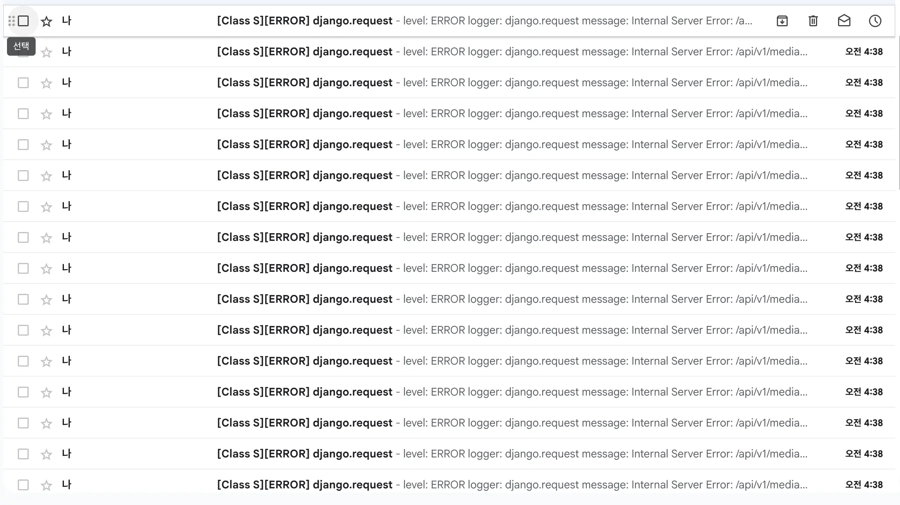

## 문제

갑자기 운영 중이던 서버에서 여러 개의 메일이 발송되어서 놀랐던 적이 있습니다.<br/>
잘 운영되다가 갑자기 새벽 시간에 이렇게 서버에서 에러가 발생한다는 게 신기했기에, 최근에 SEO를 손봐서 봇이 접근한 걸까라는 의문이 들기도 했죠.


아래는 내용의 일부입니다. `too many clients already`로 PG에서 허용된 connection보다 더 많은 개수가 부여된 걸 알 수 있는데 여기서 의문이 들었죠, 내 서비스는 지금 일일 사용자가 10명도 안 되는데?
```text
timestamp: 2026-09-04T04:39:00.499+09:00
logger: django.request
level: ERROR
message: Internal Server Error: /api/v1/media/courses/121
FATAL: sorry, too many clients already
```

## 분석

다시 위 문구를 보면 `too many clients already`는 Postgres가 `max_connections` 한도로 새 커넥션을 거부한 거죠.
같은 시각 `logs/access.log`에는 0.3초 안에 GET이 26개 들어왔고, 그중 `courses/121`이 `56362ms`(약 56.36초) 기다리다 500을 낸 걸 확인해 볼 수 있었습니다. 성공과 실패 모두 IP가 `172.18.0.4`이고 `user_id`는 없었죠.

로컬 `runserver`에서는 같은 Django 코드가 멀쩡했습니다. 깨진 쪽은 배포 서버이므로 메모리 누수나 커넥션 풀, 동시성 모델 이슈로 추측이 되었죠.

### 서버 변경

배포 API는 gunicorn이고, WSGI 서버입니다.
WSGI는 Python 웹 앱과 웹 서버가 요청을 주고받는 표준 인터페이스이고,
Class S에서는 `config.wsgi:application`을 워커 프로세스로 띄웁니다.

이전에는 `--worker-class`를 생략해서 gunicorn 기본값인 `sync`로 워커 하나가 요청 하나가 끝날 때까지 붙잡고, 워커 3개면 동시 요청도 3개인 방식으로 진행되었습니다.

```bash
gunicorn config.wsgi:application --bind 0.0.0.0:8000 --workers 3 --timeout 120
```

하지만 이후에 [SSE 알림](/posts/2026/07/24/class-s-sse-notification/)이 생기면서 긴 Redis 대기 연결과 기존 API가 한 서버에 같이 들어왔습니다. 즉 네트워크 비용이 증가해서 `gevent`로 바꿨을 때 이득이 커졌다고 판단되었죠.
`gunicorn`에서는 `gevent`를 쓸 수 있는 옵션을 제공해서 이를 적용했습니다.

```bash
gunicorn config.wsgi:application --bind 0.0.0.0:8000 \
  --worker-class gevent \
  --workers 2 \
  --timeout 120
```

이 명령에는 `--worker-connections`가 없습니다. gunicorn 26 기본이 워커당 1000이라, 워커 2개면 이론상 2000개 요청을 동시에 붙잡을 수 있고 Django가 연 Postgres 소켓도 그만큼 늘어날 수 있습니다.
하지만 에러가 발생했을 당시 Postgres `max_connections`는 100개로 설정되어 있습니다.

아래처럼 서버가 변경되면서 해당 문제가 발생하게 될 원인을 제공하게 되었죠.

| 구분 | 기동 | 동시 요청 | Postgres 슬롯 |
|---|---|---|---|
| 이전 | gunicorn `sync`, 워커 3 | 3 | 이미지 기본 약 100 |
| 이후, 핫픽스 전 | gunicorn `gevent`, 워커 2, connections 미지정 | gunicorn 기본 워커당 1000, 이론상 2000 | 이미지 기본 약 100 |

### gunicorn, gevent, greenlet

다음 3개는 묶어서 보는 게 편합니다. 에러 원인을 이해하려면 이 계층만 알면 됩니다.

- gunicorn은 Django 앱을 워커 프로세스로 띄우는 WSGI 서버입니다. `--workers 2`면 OS 프로세스가 2개입니다.
- gevent는 greenlet 위에 네트워크 I/O, 이벤트 루프 등을 구현해 놓은 더 높은 수준의 라이브러리로 동시성 처리가 아닌 네트워크 스위칭을 빠르게 지원해 줍니다.
- greenlet은 그때 요청 하나가 쓰는 실행 흐름입니다. 스레드가 아니라, Python이 같은 OS 스레드를 나눠 쓰는 경량 단위입니다.

```
Gunicorn Master
│
├─ Worker Process
│   └─ Thread
│       ├─ Greenlet
│       ├─ Greenlet
│       └─ Greenlet
│
└─ Worker Process
    └─ Thread
        ├─ Greenlet
        ├─ Greenlet
        └─ Greenlet
```

### 문제 원인 분석

강좌 데이터를 부를 때 해당 API의 비즈니스 로직에서 실패한 게 아니고 Postgres가 `max_connections` 한도로 새 연결을 거부하게 되었고 같은 시각 카탈로그와 다른 강좌 상세도 같이 500이 났습니다. 당시 Postgres 기본 `max_connections`는 100이었습니다.

실제로 일일 사용자가 10명도 안 되는데 슬롯이 찬 걸 볼 수 있었습니다.
DB 슬롯이 사람 수가 아니라 열려 있는 TCP 커넥션 수이기 때문에 발생한 것이고, 이때 스택에서는 한 커넥션이 오래 유지되었기에 이 이슈가 발생한 걸로 보였습니다.

1. gunicorn gevent와 커넥션 재사용입니다. <br/>
API는 `--worker-class gevent --workers 2`이고, `--worker-connections`를 안 두면 워커당 동시 상한이 1000입니다. Django `CONN_MAX_AGE`는 기본 60이라 요청이 끝난 뒤에도 소켓을 최대 60초 붙잡습니다. `sync` 워커 몇 개일 때와는 규모가 달라지게 되는 요소가 있었습니다.

2. [알림 SSE](/posts/2026/07/24/class-s-sse-notification/)입니다. <br>
로그인한 탭의 스트림은 `StreamingHttpResponse`로 Redis를 구독하고, `IsAuthenticated`가 유저를 DB에서 읽은 뒤 스트림이 끝날 때까지 요청이 살아 있습니다. Django는 요청이 끝나야 커넥션을 정리하므로, 탭 하나가 계속 커넥션이 유지되는 건 그대로 뒀습니다. (지난번에 SSE 타임도 늘렸기에 실제로 이걸로 문제가 발생하려면 누군가 악의적인 목적으로 접근하는 방법밖에 없어 보입니다.)

3. 같은 Postgres를 여러 프로세스가 사용<br/>
`max_connections`는 Postgres 프로세스 하나의 한도인데, 현재 구조는 하나의 서버에서 gunicorn API, 뉴스레터 cron(매일 09:00), SSE가 붙습니다.

4. Next의 sitemap 생성 방식<br/>
새벽 4시에 터진 직접 경로는 사람이 강좌 24개를 연 게 아닙니다. 
`dynamic = "force-dynamic"`일 때 Next는 `/sitemap.xml`을 만들기 위해 백엔드에 요청을 합니다. 이 부분에서 부담이 발생할 수 있습니다.

현재 로그를 보면 4번이 원인으로 가장 크게 추측됩니다. 4번과 같은 sitemap 요청이 다른 요청들과 겹쳤을 때 터진 걸로 추측이 됩니다. Next에서는 sitemap.xml을 만들기 위해서 사용 중이지만 실제 서비스 로직 API를 부르므로 백엔드에 큰 부담을 주게 되었습니다. 특히 영상에 관련된 태그도 사이트맵에 넣다 보니 태그를 얻기 위해 상세 페이지에 대한 API를 요청해서 발생했습니다.

즉 4번에서 사이트맵을 생성하다가 태그를 찾기 위해 상세 페이지 API를 접속했고 이로 인해 커넥션 수가 초과하게 되었습니다.

```text
2026-09-04T04:38:06.773  GET /api/v1/media/courses/118
2026-09-04T04:38:06.800  GET /api/v1/media/courses/120
...
2026-09-04T04:38:06.881  GET /api/v1/media/catalog
...
2026-09-04T04:38:07.074  GET /api/v1/media/courses/121
2026-09-04T04:38:07.235  GET /api/v1/media/courses/93   200  556ms  ip=172.18.0.4
2026-09-04T04:39:03.053  GET /api/v1/media/courses/121  500  56362ms  ip=172.18.0.4

logger: django.request
message: Internal Server Error: /api/v1/media/courses/121
FATAL: sorry, too many clients already
```

## 해결

동시에 붙잡을 수 있는 greenlet 수를 Postgres 슬롯 아래로 안전 마진을 넣어서 더 줄이고
사이트맵이 태그 URL을 모으려고 강좌 상세를 한꺼번에 치던 경로를 없앴습니다.

### gevent greenlet 상한

`--worker-connections`를 명령에 세팅 값을 넣을 수 있으며 값이 없으면 25입니다.

```bash
gunicorn config.wsgi:application --bind 0.0.0.0:8000 \
  --worker-class gevent \
  --workers 2 \
  --worker-connections "${GUNICORN_WORKER_CONNECTIONS:-25}" \
  --timeout 120
```

동시 요청 상한은 `workers × worker-connections`입니다. 워커 2개면 50개입니다.
수정 전 버전에서는 gunicorn gevent 기본은 워커당 1000이라, 이론상 2000개 greenlet이 `max_connections` 100을 넘을 수 있었습니다.

같이 `CONN_MAX_AGE`를 60에서 0으로 내렸습니다. Django `CONN_MAX_AGE`는 요청이 끝난 뒤 Postgres 소켓을 프로세스에 얼마나 남겨 둘지입니다. gevent에서는 남겨 둔 소켓이 다른 greenlet로 넘어가기 쉬워서 요청이 끝나면 소켓을 닫게 했습니다.

| 항목 | 수정 전 | 수정 후 |
|---|---|---|
| `--worker-connections` | 미지정, 워커당 1000 | 25 |
| 동시 greenlet | 이론상 2000 | 50 |
| `CONN_MAX_AGE` | 60초 재사용 | 0, 요청 종료 시 닫음 |

지금 세팅 값은 t3.small 사양 기준으로 안전값이며 앞으로 운영 중에 또 `too many connections` 발생하면 조절해야겠습니다.

### 사이트맵 전용 태그 API

수정 전 `sitemap.ts`는 카탈로그에서 모은 강좌 최대 24개에 대해 `Promise.all`로 `GET /api/v1/media/courses/{id}`를 치고, 응답의 `videos[].tags`에서 값을 긁었습니다. 새벽 로그의 `courses/118`, `courses/120`, `courses/121`이 이 경로입니다. 사람이 상세를 연 게 아니라, 태그 URL을 만들기 위한 부가 요청이었습니다.

공개된 강좌 영상에 붙은 태그만 `name`과 `slug`로 돌려주는 `GET /api/v1/media/tags`를 추가해서 Next 사이트맵을 생성할 때 API 부담을 줄였습니다.

| 사이트맵 생성 | 수정 전 | 수정 후 |
|---|---|---|
| 카탈로그 | `GET /catalog`, 최대 3페이지 | 동일 |
| 태그 | 강좌 상세 최대 24개 병렬 | `GET /tags` 1회 |
