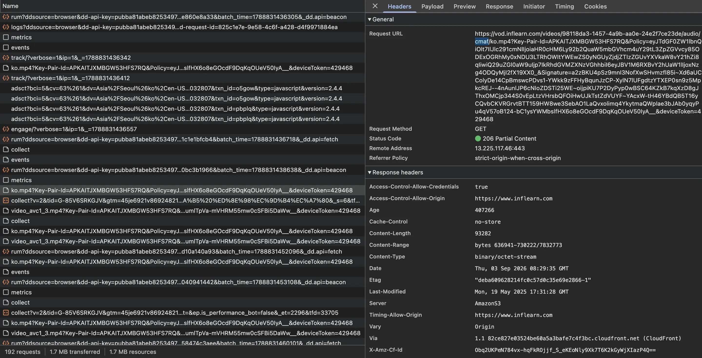
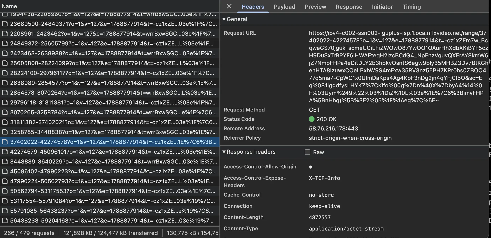
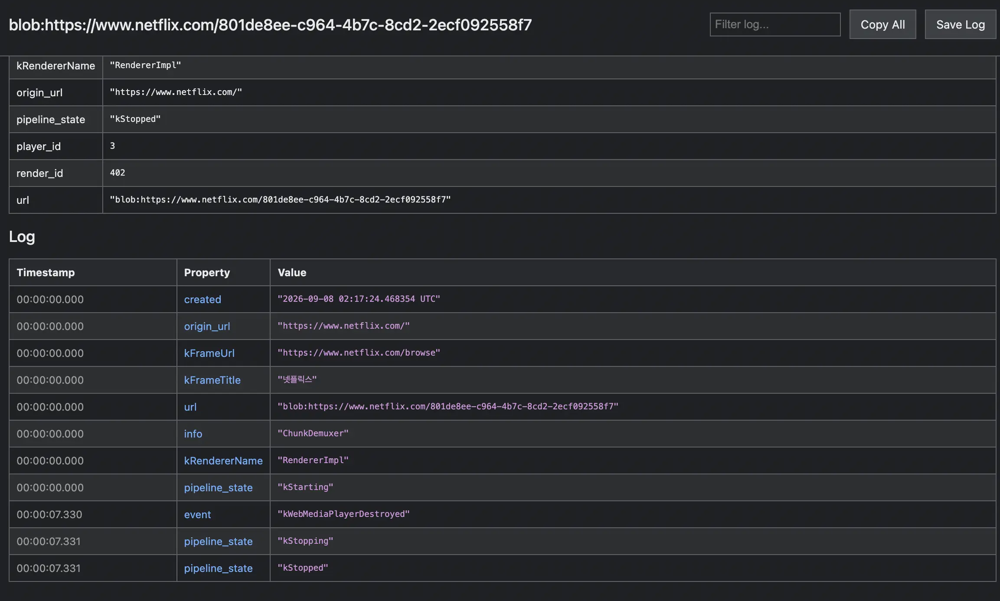
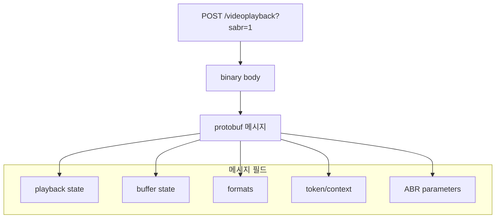
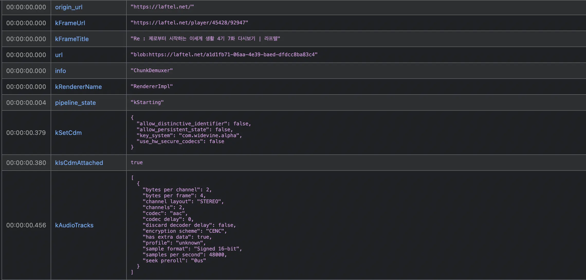
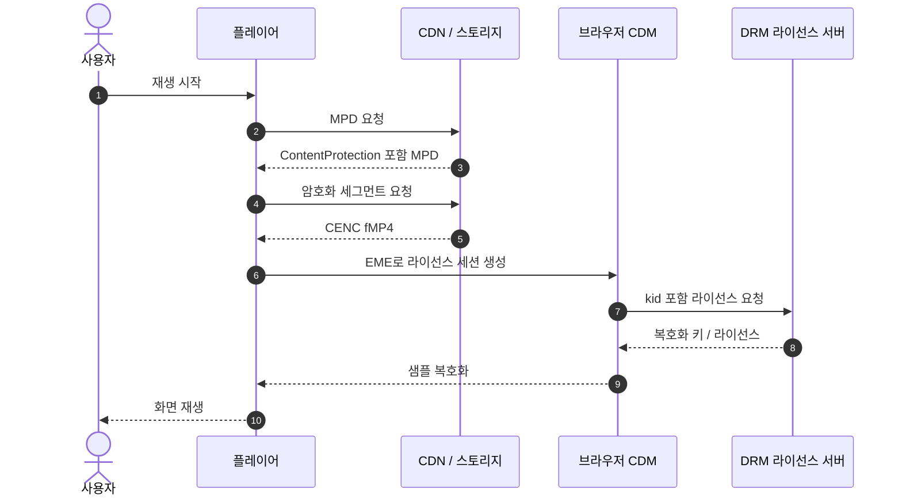
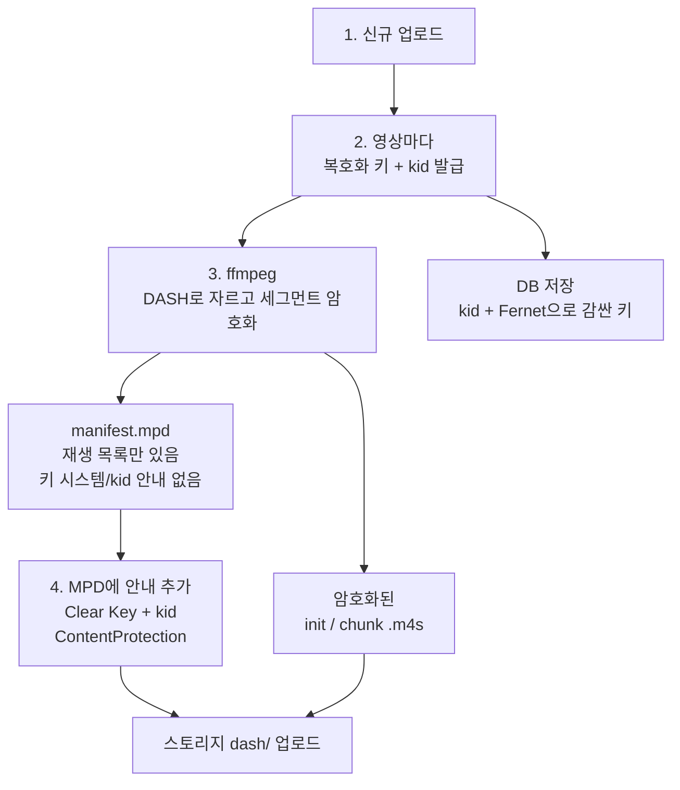
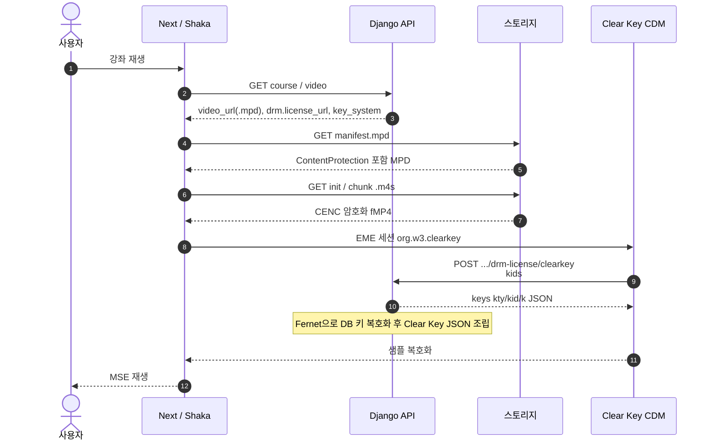

## 개요
지금 Class 프로젝트에 회원 유료 구독제와 PG를 붙이면 이게 클래스101이고 인프런이라고 개인적으로 생각합니다. 제가 좋아하는 코딩애플 유튜버님이 자체 운영하는 유료 강좌 사이트도 마찬가지 결이죠.

## DRM
위에서 언급한 사이트들은 결국 돈을 받고 콘텐츠 접근을 허용하죠. 그 영상을 파일로 빼가지 못하게 막는 체계를 DRM이라고 합니다. DRM은 `Digital Rights Management`라 하며 사이트에서 허가된 재생만 열어 주는 콘텐츠 보호입니다. 

그런데 지금 제 사이트는 이런 시스템이 사실상 필요 없는 유튜브와 같은 공개 사이트죠. 그래서 네트워크로 다운로드되는 HLS 세그먼트만 모아다가 합치면 원본으로 다운로드가 가능합니다. 제 목적은 시스템의 경험을 해보는 것이므로 이걸 막아 보는 유사 DRM을 적용해 봅시다.
유사라고 한 이유는 DRM을 안전하게 하려면 상용 서비스를 이용하는 게 일반적인 OTT 사이트들의 선택이기 때문이고, 이를 직접 구현하려면 결국에는 키 관리 시스템 서버를 별도로 둬야 합니다.

하지만 저는 서버 비용이 아깝기 때문에 Class 프로젝트에는 상용 DRM 서비스를 사지 않았습니다.

대신 신규 업로드는 MPEG-DASH로 바꾸고 세그먼트는 CENC로 암호화한 뒤, 같은 서버 API에서 Clear Key 라이선스를 주는 방식을 채택했습니다. 이 부분은 다음 절에서 자세히 다룹니다.

하지만 결국 개발자 도구 Network에서 라이선스 JSON에 보이기 때문에 사실상 조금 귀찮게 하는 수준입니다.
DRM 서비스들은 이 암호화 키를 더 안전하게 보관해서 영상이 사이트에서 실행 중일 때만 잘 복호화해 주는 겁니다. 브라우저에서 그 키를 CDM에 넘기는 API가 EME라고 하는 것이죠. <br/>
- CDM(Content Decryption Module): 브라우저 안의 복호화 모듈
- EME(Encrypted Media Extensions): 웹에서 CDM에 라이선스를 요청하는 API 규격

## 타 사이트 방식
크게 몇 가지 사이트들에 대해서만 참고해봅시다.

### 인프런
인프런은 비로그인 사용자의 경우 아예 강의 사이트 접근을 막고 영상 내부에서는 다음처럼 막고 있죠.

> https://vod.inflearn.com/videos/98118da3-1457-4a9b-aa0e-24e2f7ce23de/audio/cmaf/ko.mp4

위와 같이 오디오를 CMAF로 가져오는 걸로 보고 인프런은 다음 과정으로 스트리밍이 진행되고 있네요
> 브라우저 → 인프런 인증/재생 권한 → 서명된 CDN URL → CMAF 미디어 → DRM 복호화 → 재생
- CMAF(Common Media Application Format): 하나의 미디어 파일을 인코딩하여 HLS와 MPEG-DASH 두 가지 스트리밍 프로토콜에 모두 사용할 수 있게 해주는 통합 미디어 컨테이너 표준

그리고 영상 정보를 체크해 보면 DRM 키 시스템으로 Widevine을 사용 중인 걸 볼 수 있네요.
```json
kSetCdm	
{
  "allow_distinctive_identifier": false,
  "allow_persistent_state": false,
  "key_system": "com.widevine.alpha",
  "use_hw_secure_codecs": false
}
```
- Widevine: 구글이 제작한 디지털 저작권 관리(DRM) 솔루션으로, 동영상 불법 복제와 무단 공유를 막는 기술

### 넷플릭스
넷플릭스는 특이한 점이 `chrome://media-internals`에서 DRM 정보가 노출되지 않습니다. 하지만 네트워크나 자체 도움말을 통해 크롬에서도 Widevine을 쓴다는 걸 알 수 있죠.
> ...pathEvaluator?...&drmSystem=widevine&...

Network를 보면 딱 봐도 일반적인 DASH 매니페스트처럼 찍히지 않는 걸 알 수 있죠.<br/>
원인은 넷플릭스의 복잡한 추상화와 캐싱이 겹친 결과로 추측됩니다.



그렇게 생각한 근거는 메시지 단계에서 DRM이 감싸지는 구조가 Kodi 애드온 `plugin.video.netflix`의 MSL 구현에 있는 걸 보고 유추할 수 있었습니다.
이 오픈소스는 EME challenge가 그대로 Network에 나가지 않고, `build_request_data`로 MSL 메시지가 된 뒤 `chunked_request`로 나갑니다.
- MSL(Message Security Layer): 넷플릭스가 HTTP 위에 올린 메시지 보안 프로토콜. 기기와 사용자 인증, 매니페스트와 DRM 라이선스 같은 민감 메시지를 암호화해 전송한다.

[CastagnaIT/plugin.video.netflix](https://github.com/CastagnaIT/plugin.video.netflix/blob/master/resources/lib/services/nfsession/msl/msl_handler.py?utm_source=chatgpt.com)
```python
# 해당 플러그인은 Kodi용으로 넷플릭스 영상을 바꾸던 코드였고, 지금은 개발이 중지됨
# plugin.video.netflix MSLHandler.get_license 발췌 후 요약한 로직
# 간단히 말하면 EME challenge를 MSL 메시지에 넣고, 응답 licenseResponseBase64를 풀어 CDM에 넘기는 형태로 흘러감

def get_license(self, license_data):
    challenge, sid = license_data.decode("utf-8").split("!")
    params = [{"drmSessionId": sid, "challengeBase64": challenge, ...}]
    endpoint_url = ENDPOINTS["license"] + create_req_params("license")
    response = self.msl_requests.chunked_request(
        endpoint_url,
        self.msl_requests.build_request_data(
            self.last_license_url, params, "drmSessionId"
        ),
        get_esn(),
    )
    return base64.standard_b64decode(response[0]["licenseResponseBase64"])
```

그래서 Network에는 일반 Widevine 라이선스 POST처럼 안 보이고, MSL 메시지에서 처리됩니다. `chrome://media-internals`에 키가 안 보이는 원인으로 생각됩니다.

### 유튜브
유튜브도 유료 콘텐츠에 한해서는 DRM 체크를 진행합니다.
구글 계열답게 여기도 [Widevine](https://developers.google.com/widevine/drm/overview)을 사용하고 있다고 하며 넷플릭스처럼 자체 최적화를 매우 진행했죠.
여기에 Protobuf도 적용되었고요. <br/>
- Protobuf: 구글이 개발한 언어 중립적, 플랫폼 중립적 구조화 바이트 데이터 직렬화 메커니즘

스트리밍 방식은 일반적인 DASH 방식이 아니라
```
manifest.mpd
video_1080_init.mp4
video_1080_001.m4s
video_1080_002.m4s

audio_init.mp4
audio_001.m4s
```

자체 방식으로 아래처럼 전달하고 있어서 무료 영상이더라도 이 체계를 리버스 엔지니어링을 거쳐야 하기에, 어찌 보면 제가 만든 얕은 방식의 DRM보다 더 수고가 많이 들 수도 있어 보이군요.
> 영상 주소: googlevideo.com/videoplayback ... sabr=1

SABR은 `Server Adaptive Bitrate`인 세그먼트 전송 방식입니다.
DASH처럼 `manifest.mpd`와 `.m4s` URL이 나열되지 않고, 요청 바디가 protobuf 바이트입니다. 이 protobuf 필드에는 필드 번호, 와이어 타입, 값이 순으로 붙습니다.
공식 스키마는 아니지만 쓰임새에 따라 나누면 아래와 같습니다.


- SABR(Server Adaptive Bitrate): 클라이언트가 재생 상태를 보내고 서버가 다음 화질과 세그먼트를 고르는 전송 방식
- ABR(Adaptive Bit Rate): 클라이언트가 대역폭과 버퍼를 보고 화질을 고르는 재생 방식

### 라프텔
라프텔은 `PallyCon`이라는 종합 DRM 서비스를 사용해서 Mac/Chrome 기준으로 Widevine을 동일하게 사용 중인 걸 알 수 있었습니다.
access-control-allow-header로 서비스를 볼 수 있는데, 여기에 표시되고 있었네요.
```text
access-control-allow-headers: 
origin, x-requested-with, content-type, pallycon-inka-customdata, pallycon-customdata, pallycon-customdata-v2, drm-type, custom-header, soapaction, authorization, accept, Pragma, Cache-Control
```


찾아보니 팰리컨(PallyCon)은 국내외 동영상 스트리밍(OTT), 온라인 교육, 인강, 미디어 분야에서 표준으로 쓰이는 국내 회사 서비스더군요. DRM 표준이 국내에 있다는 점이 신기했습니다.

환경이 Mac/Chrome이었다는 점으로 Widevine으로 통일되게 결과가 나왔길래 부가 설명을 하면 Widevine은 3개의 레이어에서 보안 처리를 합니다.
- L1 (Level 1): 하드웨어 수준에서 암호화를 안전하게 처리하며, 풀 HD 및 4K 울트라 HD 같은 최고 화질 재생에 필수적입니다.
- L2 (Level 2): 하드웨어 내에서 일부 암호화를 처리하지만 드물게 사용됩니다.
- L3 (Level 3): 소프트웨어 방식으로 복호화를 처리하며, 화질이 표준 화질(SD, 보통 480p)로 제한됩니다.

## DRM 
DRM은 영상 플레이어에서 영상을 복호화하는 과정에서 사용되는 라이선스 키를 안전하게 관리해 주는 시스템입니다. 대부분의 사이트들은 여러 디바이스에서 서비스를 제공해야 하니 이 부분에 대해서 별도의 DRM 서버를 구축하기보다는 팰리컨 같은 서비스를 이용하죠. 대규모에서는 넷플/유튜브와 같이 자체적으로 서버를 구성해서 제공하기도 합니다.

DRM 서버와 프론트에 흐름을 그래프로 표시하면 아래와 같습니다.



핵심은 콘텐츠 재생 전에 키를 브라우저에 두지 않고, 암호화된 미디어를 받은 뒤 CDM이 라이선스 서버에서 키를 받아 복호화하는 방식으로 키를 안전하게 보관합니다.

### 핵심 키워드
위 그래프를 이해하는 데 필요한 키워드들입니다. 약어 위주다 보니 자꾸 헷갈리므로 전체적인 흐름에 초점을 두길 권장합니다.

- DRM(Digital Rights Management): 허가된 재생만 열어 주는 콘텐츠 보호 체계
- MPEG-DASH: HTTP로 매니페스트와 세그먼트를 나눠 받는 적응형 스트리밍 규격
    - MPD(Media Presentation Description): DASH에서 화질, 세그먼트 URL, 보호 정보를 담은 XML 매니페스트
    - fMP4(fragmented MP4): 영상을 한 파일에 몰아넣지 않고 init와 짧은 media 조각으로 나눈 MP4. DASH/CMAF가 HTTP로 세그먼트를 순서대로 받을 때 쓰는 컨테이너
- CENC(Common Encryption): 암호화 규격으로 DASH와 HLS(CMAF)가 같은 암호문 형식을 공유할 수 있음
- ContentProtection: MPD 안에 넣는 DRM 식별 정보로 어떤 키 시스템을 쓰는지와 kid 단서를 플레이어에 알려줍니다. AES 키 값 자체가 아니라 암호화 방법이나 번호 같은 부가 정보를 알려주죠.
- kid(Key ID): 이 영상에 쓰인 키를 가리키는 식별자로 라이선스 요청에 실려 서버가 맞는 키를 고름
- EME(Encrypted Media Extensions): 웹 페이지가 CDM에 라이선스를 요청하고 키를 설치하게 하는 브라우저 API
- CDM(Content Decryption Module): 브라우저 안의 복호화 모듈. 키가 여기로 들어가면 페이지 JS가 원문 키를 직접 읽기 어려움
- Widevine: 구글 CDM 기반 상용 DRM. 라이선스가 래핑되어 Network에 원문 키가 노출되지 않음. 적용하려면 파트너십이 필요하거나 비용이 발생해서 프로젝트에는 적용하지 않음
- Shaka Player: 구글 오픈소스 플레이어. DASH MPD 파싱, EME 라이선스 요청, MSE 재생을 한 흐름으로 처리함

## 적용
Widevine과 같은 제대로 된 DRM 시스템을 적용하는 게 좋겠지만, 이 프로젝트는 DRM이 사실상 필요 없지만 제 목적은 오직 공부용이므로 일종의 얕은 DRM을 구현해 보려 합니다.

그래서 얕은 DRM이란 MPEG-DASH와 CENC 패키징 적용과 재생 시 Clear Key 라이선스 API의 추가입니다.
원래는 라이선스 키를 DRM 시스템에서 관리하여 브라우저 암호화 모듈로 kid 통신을 통해 안전하게 관리되어야 하지만 이 과정을 스킵해서 API로 바로 떨구는 방식입니다. 그렇기 때문에 처음 의도대로 사용자가 영상 HLS의 세그먼트 조각들을 조립해서 원본 영상으로 ffmpeg 돌리는 일을 막을 수 있죠.

최종적으로 변경된 업로드와 재생을 나누면 아래와 같습니다.

### 업로드 패키징

기존 강의 업로드 패키징 방식은 HLS(`.m3u8` + `.ts`)였습니다. <br/>
기존 패키징 방식에 CENC로 업로드할 수도 있지만 기존 HLS와 분리되는 DRM 로직의 추가 영향을 최소화하면서 공부라는 목적을 달성하기 위해 MPEG-DASH 패키징을 추가하고, 이 패키징 방식에만 CENC로 처리되도록 해 구분을 명확히 하여 작업 영역을 줄이는 방식을 택했습니다.
이러면 좋은 점이 단순하게 비디오 모델에 컬럼 추가로 영상을 구분할 수 있고 기존 HLS 로직에 영향을 최소로 줘 서비스 안정성을 높일 수 있어 해당 방식을 택했죠.



정리하면 이번에 추가된 패키징 단계의 산출물은 다음과 같습니다.

- 암호화된 세그먼트 파일들
- 이 조각이 Clear Key로 열린다는 매니페스트 표기
- 나중에 라이선스 API가 풀어 줄 키 목록

### 재생 흐름
다음은 브라우저의 재생 흐름입니다.



현재 적용된 DRM은 공개(`PUBLISHED`) 강좌는 라이선스 API도 비로그인으로 받을 수 있습니다.
그래서 Network에 Clear Key JSON이 보이면 키를 알 수 있고, 상용 Widevine 수준의 보호에는 못 미치지만, 이전처럼 영상을 HLS 자료들을 다운로드한 뒤 합치면 되던 방식에서 복호화 키를 가지고 복호화해야 하는 방식으로 진입 장벽을 추가했습니다.
이런 식으로 어느 정도의 DRM과 유사한 흐름을 만들어 봤네요.
