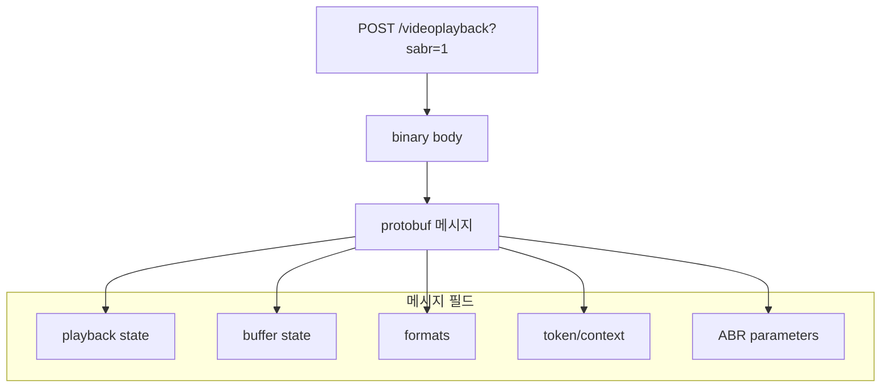

## 개요
지금 Class 프로젝트에 회원 유료 구독제와 PG를 붙이면 이게 클래스101이고 인프런이라고 개인적으로 생각합니다. 제가 좋아하는 코딩애플 유튜버님이 자체 운영하는 유료 강좌 사이트도 마찬가지 결이죠.

## DRM
위에서 언급한 사이트들은 결국 돈을 받고 콘텐츠 접근을 허용하죠. 그 영상을 파일로 빼가지 못하게 막는 체계를 DRM이라고 합니다. DRM은 `Digital Rights Management`이라고 하며 사이트에서 허가된 재생만 열어 주는 콘텐츠 보호입니다. 

그런데 지금 제 사이트는 이런 시스템이 사실상 필요 없는 유튜브와 같은 공개 사이트죠. 그래서 네트워크로 다운로드되는 HLS 세그먼트만 모아다가 합치면 원본으로 다운로드가 가능합니다. 제 목적은 시스템의 경험을 해보는 것이므로 이걸 막아 보는 유사 DRM을 적용해 봅시다.
유사라고 한 이유는 DRM을 안전하게 하려면 상용 서비스를 이용하는 게 일반적인 OTT 사이트들의 선택이기 때문이고, 이를 직접 구현하려면 결국에는 키 관리 시스템 서버를 별도로 둬야 합니다.

하지만 저는 서버 비용이 아깝기 때문에 Class 프로젝트에는 상용 DRM 서비스를 사지 않았습니다.

대신 신규 업로드는 MPEG-DASH로 바꾸고 세그먼트는 CENC로 암호화한 뒤, 같은 서버 API에서 Clear Key 라이선스를 주는 방식을 채택했습니다. 이 부분은 다음 절에서 자세히 다룹니다.

하지만 결국 개발자 도구 Network에서 라이선스 JSON에 보이기 때문에 사실상 조금 귀찮게 하는 수준입니다.
DRM 서비스들은 이 암호화 키를 더 안전하게 보관해서 영상이 사이트에서 실행 중일 때만 잘 복호화해 주는 겁니다. 브라우저에서 그 키를 CDM에 넘기는 API가 EME라고 하는 것이죠. <br/>
- CDM(Content Decryption Module): 브라우저 안의 복호화 모듈
- EME(Encrypted Media Extensions): 웹에서 CDM에 라이선스를 요청하는 API 규격

## 타 사이트 방식
크게 몇 가지 사이트들에 대해서만 참고해봅시다.

### 인프런
인프런은 비로그인 사용자의 경우 아예 강의 사이트 접근을 막고 영상 내부에서는 다음처럼 막고 있죠.

> https://vod.inflearn.com/videos/98118da3-1457-4a9b-aa0e-24e2f7ce23de/audio/cmaf/ko.mp4

위와 같이 오디오를 CMAF로 가져오는 걸로 보고 인프런은 다음 과정으로 스트리밍이 진행되고 있네요
> 브라우저 → 인프런 인증/재생 권한 → 서명된 CDN URL → CMAF 미디어 → DRM 복호화 → 재생
- CMAF(Common Media Application Format): 하나의 미디어 파일을 인코딩하여 HLS와 MPEG-DASH 두 가지 스트리밍 프로토콜에 모두 사용할 수 있게 해주는 통합 미디어 컨테이너 표준

그리고 영상 정보를 체크해 보면 DRM 키 시스템으로 Widevine을 사용 중인 걸 볼 수 있네요.
```json
kSetCdm	
{
  "allow_distinctive_identifier": false,
  "allow_persistent_state": false,
  "key_system": "com.widevine.alpha",
  "use_hw_secure_codecs": false
}
```
- Widevine: 구글이 제작한 디지털 저작권 관리(DRM) 솔루션으로, 동영상 불법 복제와 무단 공유를 막는 기술

### 넷플릭스
넷플릭스는 특이한 점이 `chrome://media-internals`에서 DRM 정보가 노출되지 않습니다. 하지만 네트워크나 자체 도움말을 통해 크롬에서도 Widevine을 쓴다는 걸 알 수 있죠.
> ...pathEvaluator?...&drmSystem=widevine&...

Network를 보면 딱 봐도 일반적인 DASH 매니페스트처럼 찍히지 않는 걸 알 수 있죠.<br/>
원인은 넷플릭스의 복잡한 추상화와 캐싱이 겹친 결과로 추측됩니다.


그렇게 생각한 근거는 메시지 단계에서 DRM이 감싸지는 구조가 Kodi 애드온 `plugin.video.netflix`의 MSL 구현에 있는 걸 보고 유추할 수 있었습니다.
이 오픈소스는 EME challenge가 그대로 Network에 나가지 않고, `build_request_data`로 MSL 메시지가 된 뒤 `chunked_request`로 나갑니다.
- MSL(Message Security Layer): 넷플릭스가 HTTP 위에 올린 메시지 보안 프로토콜. 기기와 사용자 인증, 매니페스트와 DRM 라이선스 같은 민감 메시지를 암호화해 전송한다.

[CastagnaIT/plugin.video.netflix](https://github.com/CastagnaIT/plugin.video.netflix/blob/master/resources/lib/services/nfsession/msl/msl_handler.py?utm_source=chatgpt.com)
```python
# 해당 플러그인은 Kodi용으로 넷플릭스 영상을 바꾸던 코드였고, 지금은 개발이 중지됨
# plugin.video.netflix MSLHandler.get_license 발췌 후 요약한 로직
# 간단히 말하면 EME challenge를 MSL 메시지에 넣고, 응답 licenseResponseBase64를 풀어 CDM에 넘기는 형태로 흘러감

def get_license(self, license_data):
    challenge, sid = license_data.decode("utf-8").split("!")
    params = [{"drmSessionId": sid, "challengeBase64": challenge, ...}]
    endpoint_url = ENDPOINTS["license"] + create_req_params("license")
    response = self.msl_requests.chunked_request(
        endpoint_url,
        self.msl_requests.build_request_data(
            self.last_license_url, params, "drmSessionId"
        ),
        get_esn(),
    )
    return base64.standard_b64decode(response[0]["licenseResponseBase64"])
```

그래서 Network에는 일반 Widevine 라이선스 POST처럼 안 보이고, MSL 메시지에서 처리됩니다. `chrome://media-internals`에 키가 안 보이는 원인으로 생각됩니다.

### 유튜브
유튜브도 유료 콘텐츠에 한해서는 DRM 체크를 진행합니다.
구글 계열답게 여기도 [Widevine](https://developers.google.com/widevine/drm/overview)을 사용하고 있다고 하며 넷플릭스처럼 자체 최적화를 매우 진행했죠.
여기에 Protobuf도 적용되었고요. <br/>
- Protobuf: 구글이 개발한 언어 중립적, 플랫폼 중립적 구조화 바이트 데이터 직렬화 메커니즘

스트리밍 방식은 일반적인 DASH 방식이 아니라
```
manifest.mpd
video_1080_init.mp4
video_1080_001.m4s
video_1080_002.m4s

audio_init.mp4
audio_001.m4s
```

자체 방식으로 아래처럼 전달하고 있어서 무료 영상이더라도 이 체계를 리버스 엔지니어링을 거쳐야 하기에, 어찌 보면 제가 만든 얕은 방식의 DRM보다 더 수고가 많이 들 수도 있어 보이군요.
> 영상 주소: googlevideo.com/videoplayback ... sabr=1

SABR은 `Server Adaptive Bitrate`인 세그먼트 전송 방식입니다.
DASH처럼 `manifest.mpd`와 `.m4s` URL이 나열되지 않고, 요청 바디가 protobuf 바이트입니다. 이 protobuf 필드에는 필드 번호, 와이어 타입, 값이 순으로 붙습니다.
공식 스키마는 아니지만 쓰임새에 따라 나누면 아래와 같습니다.


- SABR(Server Adaptive Bitrate): 클라이언트가 재생 상태를 보내고 서버가 다음 화질과 세그먼트를 고르는 전송 방식
- ABR(Adaptive Bit Rate): 클라이언트가 대역폭과 버퍼를 보고 화질을 고르는 재생 방식

### 라프텔
라프텔은 `PallyCon`이라는 종합 DRM 서비스를 사용해서 Mac/Chrome 기준으로 Widevine을 동일하게 사용 중인 걸 알 수 있었죠.


찾아보니 팰리컨(PallyCon)은 국내외 동영상 스트리밍(OTT), 온라인 교육, 인강, 미디어 분야에서 표준으로 쓰이는 국내 회사 서비스더군요. DRM 표준이 국내에 있다는 점이 신기했습니다.

환경이 Mac/Chrome이었다는 점으로 Widevine으로 통일되게 결과가 나왔길래 부가 설명을 하면 Widevine은 3개의 레이어에서 보안 처리를 합니다.
- L1 (Level 1): 하드웨어 수준에서 암호화를 안전하게 처리하며, 풀 HD 및 4K 울트라 HD 같은 최고 화질 재생에 필수적입니다.
- L2 (Level 2): 하드웨어 내에서 일부 암호화를 처리하지만 드물게 사용됩니다.
- L3 (Level 3): 소프트웨어 방식으로 복호화를 처리하며, 화질이 표준 화질(SD, 보통 480p)로 제한됩니다.

## 프로젝트에 적용하기

### 적용 범위

### 데이터 흐름

### Bug, Bug, Bug


