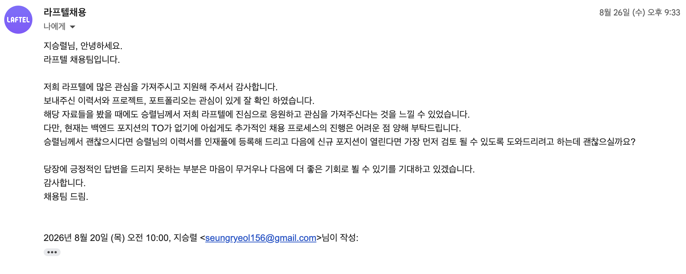

## 개요

9월 17일까지 신청받았던 모두의 창업에 제가 기획한 `FiguRoom` 서비스를 제출했습니다. 
예전부터 나만의 서비스나 창업에 관심이 있었는데, 이번에 이를 실행하기로 마음먹었습니다.

> [FiguRoom] 컬렉션(장식장과 피규어)을 폰으로 옮겨 배치를 기획하고, 현재 컬렉션에 맞는 상품을 추천받으며, 안 쓰는 피규어는 중고로 거래하는 서브컬처 컬렉션 플랫폼입니다.

이렇게 기획을 잡게 된 배경은 3가지가 있습니다.
1. 형의 피규어 컬렉션을 보면서, "내년에 결혼하면 이거 다 정리해야 할 텐데"라는 생각이 들었던 것
2. OTT를 좋아하고 유튜브를 좋아하고 서브컬처를 좋아해서 라프텔에 취업하고 싶었지만 맞닥뜨린 현실의 장벽

3. 서비스를 만들고 싶은 니즈

위 3가지 이유가 겹쳐져서 나온 게 위에 "FiguRoom" 서비스입니다. 
유튜브 영상으로 기획발표하는 영상도 올렸으니 참고해도 좋을 것 같습니다.

<iframe width="560" height="315" src="https://www.youtube.com/embed/vpiekDnX6VA?start=6" title="FiguRoom 기획 발표 영상" frameborder="0" allow="accelerometer; autoplay; clipboard-write; encrypted-media; gyroscope; picture-in-picture; web-share" allowfullscreen></iframe>

## 랜딩 페이지

일단은 수요를 알고 싶었고, 처음에는 "아 피규어 관련 서비스 만들어야지"라는 가벼운 아이디어였기에, 랜딩 페이지를 만들며 구체화했죠. [FiguRoom 랜딩](https://figuroom.devseung.com/)이 그렇게 만들어졌습니다.

이 과정에서 처음에 피규어 + 디지털 트윈이라는 점을 앞세워서 생각했을 때는 "아 아이디어 괜찮은데"라는 생각이 우선적으로 들었습니다. 하지만 랜딩 페이지를 만들며 아이디어를 점검하니 수익 구조에서 확실하지 않고 무엇보다 유저의 점유 시간을 계속 가져갈 명분이 부족해 보였죠.

## 설문조사

그래서 실제 사용자 설문조사를 진행했습니다.
- [피규어 수집, 장식장 배치 경험 조사](https://forms.gle/UKAYs8DvEWFqVWW97)

이렇게 만들어서 지인들과 커뮤니티에 홍보를 하려 했는데, 지인분들이 좋게 봐주셔서 설문조사로 21건 정도 쌓여서 좋았지만
문제점은 국내 피규어 커뮤니티에서는 홍보를 금지하는 분위기 때문에 이를 홍보할 수 없었습니다.

설문 조사 기간은 2026년 9월 15일부터 9월 30일까지로, 응답자 중 5명을 추첨해 편의점 기프티콘 5,000원권을 드린다고 홍보를 했지만 이 글은 금방 삭제당했죠. 그래도 글 작성 기준으로 26명 정도가 참여해서 어느 정도의 샘플링은 되었습니다.

## 커뮤니티

후에 서비스 런칭할 때도 동일한 문제를 겪을 겁니다.
광고로 노출할 수 있겠지만 이를 메인으로 트래픽 유입을 받는 걸 기대하긴 힘들 것 같고, 그렇다면 대안으로 생각난 건 SNS 채널 생성입니다.

그래서 다음과 같은 기획을 구상했습니다.

1. 피규어 수집만으로 유저를 모으긴 어려우니 애니메이션 -> 캐릭터 -> 굿즈, 피규어로 이어지는 흐름을 만들자
2. 피규룸 서비스로의 자연스러운 유입을 위한 콘텐츠 포맷 정의

| Pillar     | 목적             | FiguRoom 거리 |
| ---------- | -------------- | ----------: |
| A. 애니 트렌드  | 최대 Reach       |           멂 |
| B. 캐릭터/IP  | 관심사를 피규어로 연결   |          중간 |
| C. 피규어/굿즈  | 핵심 타깃 확보       |         가까움 |
| D. 컬렉션/장식장 | FiguRoom 니즈 검증 |      매우 가까움 |
| E. 참여/논쟁   | 커뮤니티 형성        |       전체 연결 |

3. X라는 SNS 성격이 서브컬처에 적합하니 이를 메인으로 진행, 피규어 중고 거래만을 내세운 사이트가 X에서 홍보해서 유저를 쌓은 기록이 있음

## 문제 해결 포인트
다음과 같은 빅테크 괴물들과 경쟁하지 않고 최대한 다르게 접근을 해야 할 것 같음
1. 네이버 카페
2. 당근마켓
3. 중고나라
4. 번개장터

다음 글에서는 커뮤니티 생성에 따른 후기로 적어 오겠습니다.
