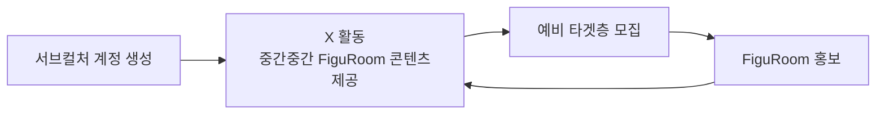
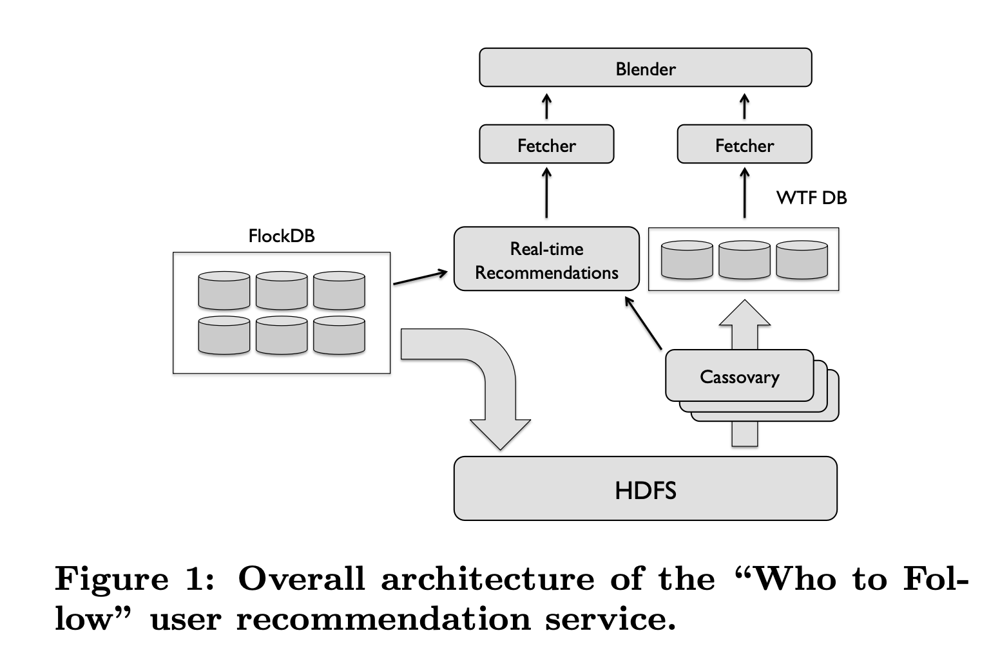
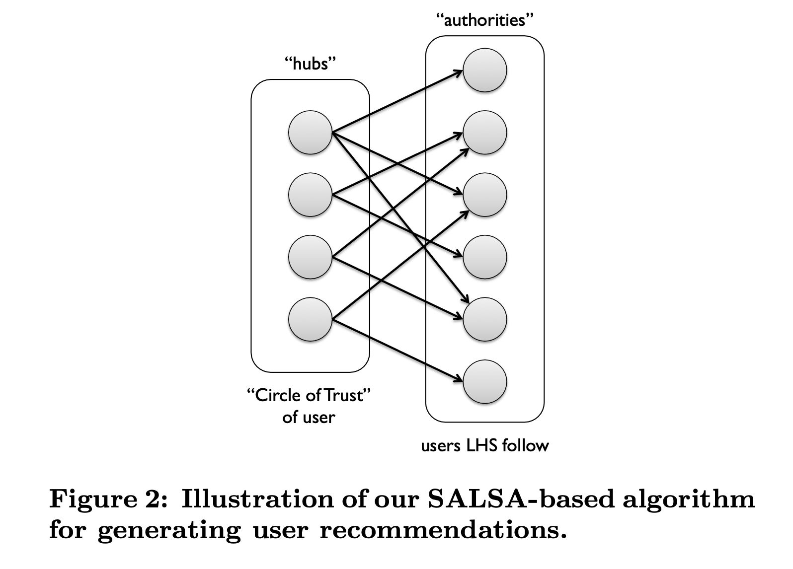
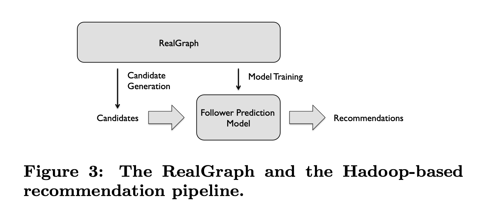
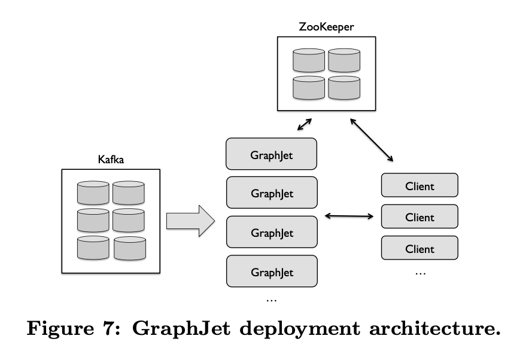
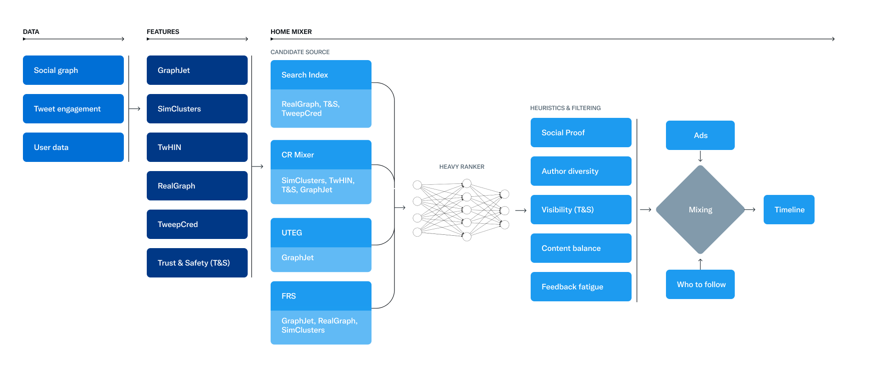

## 목표

현재 모두의 창업을 통해 피규룸 서비스를 기획 중이고 어떻게 하면 사용자 트래픽을 모을 수 있을까 항상 고민 중입니다.

처음 나온 생각은 [저번 글](../../18/figuroom-landing-survey/)에서처럼 X 계정을 만들자고 생각했고, 서브컬처 문화에서 가장 홍보가 효과적인 곳은 X라는 생각이 들어 홍보 계정을 만들고 하루에 2개에서 4개의 포스트를 작성하고 있습니다. 

하지만 이 방법으로는 트래픽과 실질 목적인 사용자 층을 불러온다고 확정 짓기에는 뭔가 부족하다는 느낌이 들었습니다.

이를 해결할 방법을 고민하다 보니 X 알고리즘에 대해서도 궁금증이 들었습니다. 현재 1차 MVP로 생각하는 것도 결국 X와 유사한 시스템이니 미리 공부해 두면 좋을 것 같다는 생각이었고 홍보라는 게 바로 되는 게 아닌 시간이 드는 작업이었기에 X 계정 성장과 추천/검색 알고리즘을 분석하면 재밌지 않을까 생각이 들었습니다.

어찌 되었든 나중에는 다음과 같은 흐름으로 사용자 유입이 되게끔 유도해야 한다는 전제는 가지고 있습니다.


## 조사 방향

전체 다 일일이 로직을 까보는 것도 좋지만, 전체적인 데이터 흐름과 시스템 구조를 파악하는 데 우선순위를 둡니다.
Class 프로젝트에서 검색(Search), 추천(Recommendation), 랭킹(Ranking), 임베딩(Embedding)을 다뤄봤기에, 우선 대형 시스템의 Retrieval → Ranking → Re-ranking이라는 큰 구조를 중심으로 검색과 추천을 이해해 보려 합니다.

검색 자체는 사용자의 사용 이력과 경험을 바탕으로 가중치를 높여 주는 걸로 나뉩니다.
> 후보를 먼저 좁히고(Retrieval), 후보마다 여러 신호를 계산한 다음, 그 신호들을 조합해서 최종 점수를 만드는 경쟁이다.

이에 대해서 23년도에 일론 머스크가 트위터 추천 알고리즘을 공개했기에 그걸 참고하는 걸 가장 큰 축으로 둡니다.
또한 현재 코드 또한 상용 버전이 아닌 실험 버전이지만 공개하고 있기에, 이를 토대로 X 계정 운영 방향에 도움도 받을 수 있을 것 같습니다.

## 참고 자료

### xAI x-algorithm: 현재 X For You 파이프라인의 공개 실험 코드

> https://github.com/xai-org/x-algorithm/blob/main/README.md

xAI가 공개한 최근 X 추천 코드입니다.
상용 로직과는 다를 수 있지만, 지금 계정 운영에 맞대어 볼 후보 생성, 랭킹, 필터 흐름을 코드 기준으로 따라가기 위해 인용합니다.

### twitter/the-algorithm: 2023년 공개된 Home Timeline 추천 오픈소스

> https://github.com/twitter/the-algorithm/blob/main/README.md

일론 머스크 인수 직후 Twitter가 공개한 추천 시스템입니다.
현재 x-algorithm과 비교해 무엇이 남고 바뀌었는지 보는 기준선으로 씁니다.

### GraphJet (VLDB 2016): Twitter의 실시간 그래프 기반 콘텐츠 추천

> https://www.vldb.org/pvldb/vol9/p1281-sharma.pdf

유저-트윗 상호작용을 메모리 위 이분 그래프로 유지하고, random walk 계열로 실시간 후보를 뽑는 구조를 설명한 Twitter 논문입니다. Retrieval 단계가 왜 그래프와 상호작용 신호에 기대는지 이해하려고 인용합니다.

### Deep Neural Networks for YouTube Recommendations (RecSys 2016): Candidate Generation + Ranking 구조

> https://dl.acm.org/doi/epdf/10.1145/2959100.2959190

수백만 후보를 가벼운 모델로 수백 개로 줄인 뒤(Candidate Generation), 무거운 모델로 정밀 점수화(Ranking)하는 산업 표준 구조를 YouTube 사례로 정리한 논문입니다. 글에서 잡은 Retrieval → Ranking → Re-ranking 큰 틀을 다른 대형 서비스와 맞춰 보는 데 씁니다.

## 추천 시스템 

YouTube 논문과 GraphJet 논문을 베이스로 가져가려 합니다. 이들은 다음 질문에 대한 답을 기대해 볼 수 있죠.
- 수백만 개 데이터에서 어떻게 최종 몇 개를 고르는가?
- 사용자 행동 관계를 그래프로 만들어 후보를 어떻게 실시간으로 찾아오는가?

더 자세히는 YouTube 논문은 명시적으로 2-stage 구조를 사용하고
`Candidate Generation → Ranking`의 구조를 사용합니다.
GraphJet은 사용자와 트윗 사이의 실시간 `bipartite interaction graph`와 `random walk`를 추천에 사용해서 이들을 알 수 있죠.

### YouTube

2016년 RecSys 논문 [Deep Neural Networks for YouTube Recommendations](https://dl.acm.org/doi/epdf/10.1145/2959100.2959190)은 딥러닝을 대규모 추천 파이프라인에 넣은 대표적인 사례입니다.
> 딥러닝 장점: 인간의 신경망을 구성해 인간이 찾아내기 힘든 복잡한 패턴을 발견할 수 있고, 이를 통해 규칙을 세워 결과를 도출할 수 있다

주된 내용은 수백만 영상을 한 번에 정밀 점수화하지 않고, 단계를 둘로 나눠 추천 데이터를 걸러내는 내용입니다.


이 구조는 처음 `Candidate Generation`으로 후보를 먼저 줄인 뒤, Ranking으로 남은 후보만 정밀하게 점수를 매기는 방식입니다. 그래서 이중 구조 (`Two-stage architecture`)로 불리죠.
전체 데이터셋에서 바로 최종 결과물을 뽑는 게 아닌 가벼운 필터링을 앞에 둬서 미리 전처리 작업을 합니다. 그 후 필터링된 결과를 정밀하게 가중치를 매겨 추천하는 게 핵심이죠.

다음 이미지가 처음에 `Candidate Generation`으로 1단계 작업입니다.

이를 통해 수백만 데이터를 수백 개 후보로 추려 줍니다. 이때 딥러닝 모델 활성화 함수인 ReLU(Rectified Linear Unit, 정류된 선형 유닛)에 시청 기록과 검색 벡터 정보를 넘겨서 처리합니다.
> ReLU: 입력이 0보다 크면 그대로 출력하고, 0 이하면 0을 반환하는 딥러닝 활성화 함수로 사용자의 복잡한 취향을 빠르게 학습하고, 연관 없는 정보를 걸러내는 핵심 엔진을 담당

다음 이미지는 1단계에서 걸러진 데이터를 다루는 2단계 작업인 `Ranking`입니다.

그 수백 개에 video features와 더 풍부한 신호를 붙여 수십 개로 줄이고 순서를 정합니다.<br/> 글에서 잡은 Retrieval → Ranking 큰 틀을 YouTube 용어로 대입해보면 `Retrieval`에 가까운 쪽이 `Candidate Generation`이 되고 `Ranking`이 됩니다.

2016년 기준으로 유튜브는 1차로 시청 기록과 검색어, 사용자 정보를 토대로 1차 필터링을 거친 후 2차로 후보군 비디오 특징과 언어 체크, 영상 시청 시각 같은 메타데이터로 정밀히 추천 영상을 골랐다는 걸 알 수 있습니다.

### GraphJet
Twitter 추천 시스템이 팔로우 그래프 기반 사용자 추천에서 실시간 행동 그래프 기반 콘텐츠 추천으로 진화하면서, 이를 처리하는 시스템 아키텍처도 Batch → Real-time으로 변화한 과정을 담고 있습니다.

초기 2010년의 트위터는 유저 추천을 메인으로 삼았고, 아래 아키텍처처럼 WTF(Who to Follow) DB에 미리 적재된 데이터를 기반으로 특징을 가져와 사용자 추천군을 정했습니다.


여기서 WTF에 들어가는 후보군은 SALSA를 여러 번 돌려 만듭니다.
> SALSA(Stochastic Approach for Link-Structure Analysis)는 팔로우 관계를 이분 그래프(bipartite graph, 두 종류 정점만 잇는 그래프)로 두고 링크를 따라가며 점수를 매기는 알고리즘

그래프의 각 점인 vertex(정점)는 사용자 같은 노드를 가리키고, SALSA를 반복하면 양쪽 vertex마다 score(그 정점이 추천 후보로 얼마나 강한지를 나타내는 순위 점수)가 쌓입니다. 그 score가 높은 쪽이 추천 후보로 올라가는 식이죠. 이를 통해 다음과 같이 추천군을 정합니다.

Twitter는 신뢰할 만한 사용자들을 Hub로 샘플링하고, 그들이 팔로우하는 추천 후보를 Authority로 해석해서 `SALSA`를 진행했습니다.


하지만 데이터가 커질수록 팔로우 관계가 아닌 다른 수많은 데이터들도 참고하고 싶어집니다.
- Reply: 트윗에 답글을 남긴 행동
- Retweet: 트윗을 리트윗해 다시 퍼뜨린 행동
- Mention: 트윗이나 답글에서 다른 사용자를 @멘션한 행동
- Click: 타임라인에서 트윗이나 링크를 클릭한 행동
- Profile View: 특정 사용자 프로필을 조회한 행동
- Interaction: 좋아요 등 위 항목 외의 기타 상호작용을 묶는 신호

즉 단순한 팔로우 관계를 그래프로 삼는 게 아닌 여러 데이터를 사용하고 싶어져서 `RealGraph`를 채용합니다.

RealGraph에서 Candidate Generation으로 후보를 뽑고, Model Training으로 Follower Prediction Model을 만든 뒤 둘을 합쳐 Recommendations를 내는 파이프라인이 잡혀 이를 통해 Graph Algorithm에서 Data + ML Pipeline으로 발전합니다.
- RealGraph: 팔로우 그래프에 Reply, Retweet, Mention 같은 행동 로그를 합쳐 HDFS 위에 쌓아 둔 복합 그래프. 정점은 사용자, 간선은 관계와 상호작용을 담는다
- Candidate Generation: RealGraph 위에서 SALSA나 Personalized PageRank 같은 그래프 알고리즘으로 추천 후보를 먼저 줄이는 단계. YouTube의 Candidate Generation과 같은 역할이다
- Follower Prediction Model: RealGraph와 로그로 학습한 분류기. Candidate Generation이 넘긴 후보마다 앞으로 팔로우하거나 상호작용할 확률을 다시 매겨 최종 Recommendations를 만든다

이제 ML과 여러 데이터를 토대로 추천하지만 데이터들의 가공 처리를 특정 시간에 배치 처리하기 때문에 이슈로 뜬 항목이 다음날이 돼서야 사용자에게 보여주는 문제가 발생합니다.
이는 Hadoop batch 처리로 발생했고, 여기서 즉각적으로 적용하자는 니즈가 생깁니다.

그래서 다음과 같이 GraphJet을 적용합니다.


> GraphJet: 사용자와 트윗의 상호작용을 메모리 위 이분 그래프로 유지하고 Random Walk 계열로 실시간 후보를 뽑는 Twitter의 실시간 추천 엔진

> Random Walk(Family / Variants)은 무작위로 이동한다는 기본 원칙에서 출발하여, 현실의 다양한 제약 조건이나 데이터 구조를 반영하기 위해 변형된 확률 모델 갈래

Kafka로 행동 이벤트를 받아 그래프를 갱신하고, Client가 추천을 요청하면 GraphJet 클러스터가 바로 응답하며, ZooKeeper가 클러스터와 Client의 조율을 맡는 구조죠. 배치로 하루를 기다리던 RealGraph 파이프라인과 달리, 방금 일어난 상호작용을 곧바로 추천에 반영할 수 있게 됩니다.

여기까지 흐름이 2016년까지의 흐름입니다.
요즘 기업 공고에 자주 보이던 친구들이 이때부터 상용 서비스에 깊숙이 파고들어 있었네요.

## X의 추천 시스템
23년에 X로 바뀌면서 코드 변경이 있었고 코드의 오픈까지 있었죠.
2023년 공개 코드에서는 이러한 후보 생성 계층과 실제 순서를 결정하는 Ranking 계층은 분리돼 있었고 주된 오픈소스로 2개가 들어가죠
- GraphJet: "관심 가질 만한 트윗을 권하는" 추천 엔진, 그래프로 실시간 분석
- Earlybird: "원하는 트윗을 찾는" 검색 엔진, 실제 텍스트 기반 색인

### 23년 트위터

2016년까지는 "실시간으로 추천 목록을 준다"가 중심으로 보였습니다.<br/>
그래서 GraphJet으로 배치 지연을 줄이고, RealGraph로 상호작용 신호를 늘리는 쪽이 핵심이었죠.

현재 공개된 다이어그램을 보면 그 위에 Home Mixer라는 오케스트레이션 계층으로 더 세분화되었습니다.


왼쪽부터 보면 파이프라인이 다음과 같이 이어집니다.

| 단계 | 역할 |
|------|------|
| Data | Social graph, Tweet engagement, User data |
| Features | GraphJet, SimClusters, TwHIN, RealGraph, TweepCred, T&S 등으로 신호화 |
| Candidate Source | Search Index, CR Mixer, UTEG, FRS가 각자 다른 신호 조합으로 후보 수집 |
| Heavy Ranker | 모인 후보에 정밀 점수 부여 |
| Heuristics & Filtering | Social Proof, Author diversity, Visibility(T&S), Content balance, Feedback fatigue |
| Mixing → Timeline | Ads, Who to follow와 함께 최종 타임라인 조립 |

2016년과 비교하면 후보 생성과 랭킹이라는 큰 틀은 비슷하지만 중점으로 보는 문제가 바뀌어 있습니다.
1. **Trust & Safety(T&S, 신뢰와 안전 신호)**: Features 단계에도 들어가고, Candidate Source에도 붙고, Heuristics의 Visibility에도 나오며 추천 맨 끝에서 처리가 아닌 후보를 고르는 과정 전체에 안전 제약을 박아 둔 형태입니다.
2. **타임라인 품질**: Heavy Ranker 뒤에 Author diversity, Content balance, Feedback fatigue 같은 휴리스틱이 붙어 있습니다. 같은 작성자가 피드를 독점하지 않게 하고, 콘텐츠 구성이 치우치지 않게 하며, 이미 관심 없다고 본 유형을 반복해서 보여 주지 않으려는 장치로 비슷한 콘텐츠로의 피로를 줄이려는 의도가 보이네요.
3. **Mixing**: 추천 트윗만 줄 세우는 게 아니라 Ads와 Who to follow를 같은 Timeline 조립 단계에서 섞습니다. 피드가 단일 추천 게시물이 아니라 BM도 내재됩니다. 당근의 AD 인벤토리도 이런 식으로 동작하는지는 확인이 필요하지만, 저도 이런 방향으로 개발해야겠네요.

### 26년 X

최근 X에서는 점수 산출 방식을 [Scoring and Ranking](https://github.com/xai-org/x-algorithm/blob/main/README.md#scoring-and-ranking)에 꽤 솔직하게 풀어 두고 있더군요. 물론 상용과 다른 실험 공개본이지만, 트위터의 소스에서는 "무엇을 걸러낼까"에 가까웠다면 이쪽은 "최종 추천 점수를 어떤 행동 예측의 가중합으로 만들까"가 전면에 나옵니다.

Phoenix가 게시물마다 행동별 확률 `P(action)`을 예측하고, `RankingScorer`가 가중치를 곱해 합칩니다. 그러니 점수가 많을 것 같은 게시물을 작성한다면 초기 계정도 노출될 가능성이 높아지게 되는 거죠.
> Phoenix: xAI가 공개한 X For You 피드의 추천 모델로 시청자의 최근 행동 이력을 보고, 게시물마다 좋아요, 답글, 체류 같은 행동을 할 확률을 예측

```
Final Score = Σ (weight_i × P(action_i))
```

점수에 긍정적인 행동은 양수 가중치, 부정적인 행동은 음수 가중치입니다. README에 적힌 행동 양식입니다.

| 행동 | 예시 |
|----|------|
| Engagement(참여) | favorite(좋아요), reply(답글), repost(리포스트), quote(인용), share(공유) |
| Clicks(클릭) | post(게시물), profile(프로필), link(링크), photo/video 열기 |
| Attention(주목) | dwell(체류), dwell time(체류 시간), video quality view(영상 품질 시청) |
| Author(작성자) | follow author(작성자 팔로우) |
| Negative(부정) | not interested(관심 없음), mute(뮤트), block(차단), report(신고) |

가중치를 볼 때 생길 수 있는 오해로 weight는 실제 좋아요 개수나 신고 건수에 단순히 곱하는 게 아니라 "이 시청자가 그 행동을 할 예측 확률"에 곱하는 값입니다.
그래서 report 가중치가 like보다 수백 배 크다고 해서 "신고 1건이 좋아요 수백 개를 상쇄한다"로 읽으면 안 됩니다.
Phoenix가 중요하게 들어가는 걸로 보입니다.

점수를 만든 뒤에는 세 가지 조정이 추가로 녹아집니다.
1. **Author Diversity**: 같은 작성자의 글이 피드에 여러 개 올라갈 때, 두 번째부터 점수에 1 미만 배수를 곱해 연달아 위에 쌓이지 않게 함 (시간대 기준이 아닌 사용자에게 노출되는 피드 리스트에서 같은 작성자를 노출하지 않기 위한 로직)
2. **Out-of-Network Discount**: 팔로우하지 않은 계정의 게시물(그리고 일부 reply/repost)에 1 미만 배수
3. **New-Author Boost**: 노출이 적은 작성자를 목표 위치로 끌어 올림

23년 다이어그램의 Author diversity, Feedback fatigue가 휴리스틱으로 보이던 건 유지하고 지금은 그 위에 "행동 확률 × 가중치"라는 점수 식이 공개되었습니다. 

그래서 계정 운영 관점에서는 좋아요만 노리기보다 reply, dwell, follow까지 넓게 만드는 쪽이 점수식과 잘 맞고, report/mute 같은 콘텐츠는 조심해야겠네요.


## 후기

전체 흐름을 따라가 보니 Retrieval → Ranking → Re-ranking이라는 큰 그림은 YouTube나 GraphJet 시절과 크게 다르지 않았지만 지금은 그 위에 Phoenix의 "행동 확률 × 가중치" 점수식과 Author Diversity, New-Author Boost 같은 조정이 얹혀 있다는 점이 메인이었습니다.

계정 운영으로 옮기면 결론은 단순합니다. <br/>
좋아요만 노리기보다 reply, dwell, follow까지 넓히는 글이 점수식과 잘 맞습니다. 지금 계정 기준으로는 피규어 정보 비교형 일반 게시글이 대략 10부터 40 내외, 서브컬처 콘텐츠에 대한 리트윗은 대략 60 내외 수준이라 후자 쪽에 더 무게를 두고, 댓글과 멘션 같은 상호작용을 붙이려 합니다. 

다만 이 수치는 노출과 참여의 정확한 단위를 아직 나눠 보지 않은 관측이라 직관적인 방향은 아직 내기 어렵군요.

시간대는 오후 7시에서 밤 11시까지로 올려 첫 30분~1시간 안에 반응을 모으는 쪽으로 진행하고 아직 New-Author Boost가 있는 만큼 초기 계정은 노출 기회 자체는 열려 있으니 mute/block/report 같은 부정 신호만 피하면서 상호작용이 붙는 콘텐츠를 위주로 운영해보려합니다.