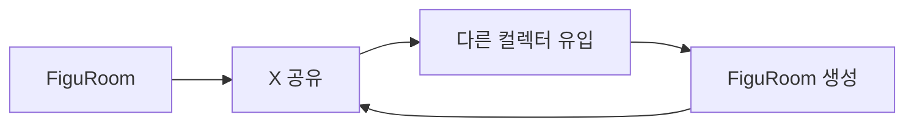
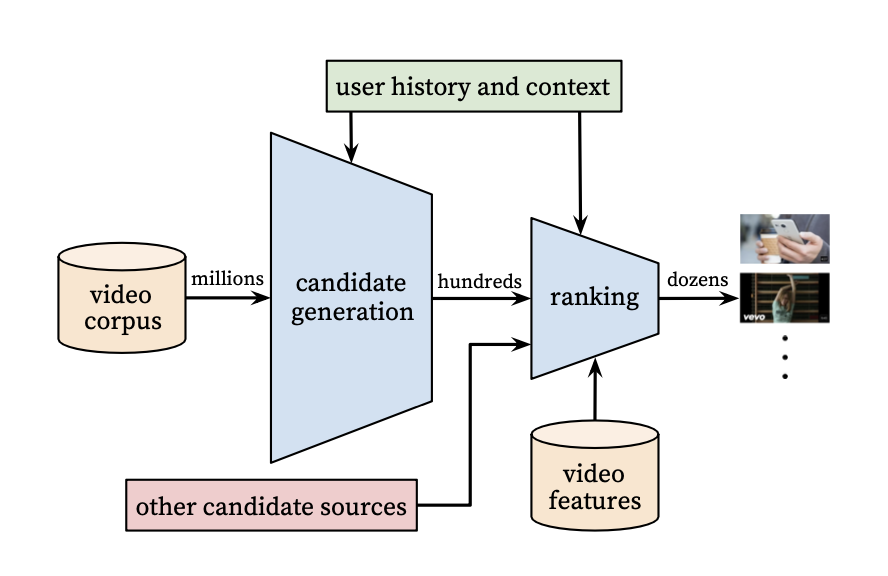
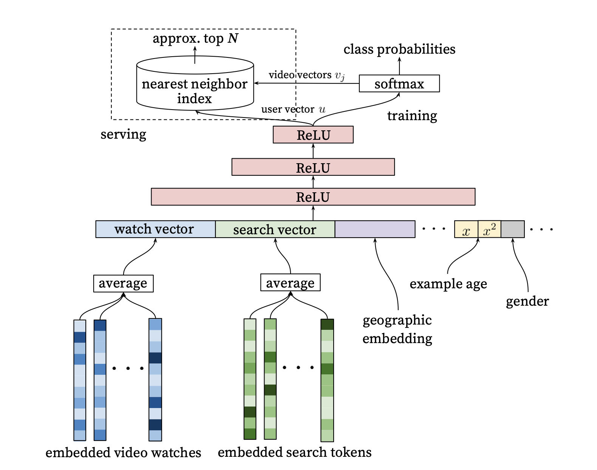
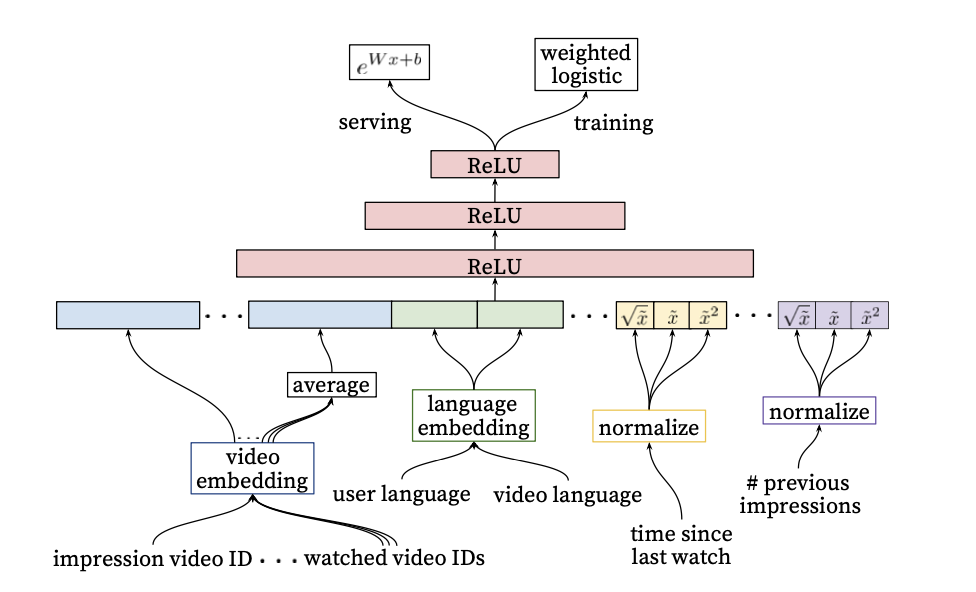

## 목표

모두의 창업을 통해 피규룸 서비스를 기획 중이고 준비 중에 가장 먼저 만난 장애물은 홍보와 초기 사용자 층 확보로 생각됩니다.

그래서 [저번 글](../../18/figuroom-landing-survey/)에서처럼 커뮤니티를 만들자고 생각했고, 서브컬처 문화에서 가장 홍보가 효과적인 곳은 X라는 생각이 들어 홍보 계정을 만들고 일일 2개에서 4개의 포스트를 작성하고 있습니다. 하지만 이 방법으로는 트래픽과 실질 목적인 사용자 층을 불러올 수 없었습니다.
그래서 이 부분은 포스트보다 활동 자체에 시간을 투입할 예정입니다.

그래도 조회수 20~40에서 머무르고 있다는 게 마음에 들지 않았습니다.
이를 해결할 방법을 고민하다보니 개발자여서 그런지 결과 X 알고리즘에 대해서도 궁금증이 들었습니다, 현재 1차 MVP로 생각하는 것도 결국 X와 유사한 시스템이니 미리 공부해 두면 좋을 것 같다는 생각이었고 홍보라는게 바로 되는게 아닌 시간이 드는 작업이였기에 X 계정 성장과 분석을 동시에 해보려합니다.

어찌되었든 나중에는 다음과 같은 흐름으로 사용자 유입이 되게끔 유도해야한다는 전제는 가지고 있습니다.

## 조사 방향

전체 다 일일이 로직을 까보는 것도 좋지만, 전체적인 데이터 흐름과 시스템 구조를 파악하는 데 우선을 둡니다.
Class 프로젝트에서 검색(Search), 추천(Recommendation), 랭킹(Ranking), 임베딩(Embedding)을 다뤄봤기에, 우선 대형 시스템의 Retrieval → Ranking → Re-ranking이라는 큰 구조를 중심으로 검색과 추천을 이해해 보려 합니다.

검색 자체는 사용자의 사용 이력과 경험을 바탕으로 가중치를 높여 주는 걸로 나뉩니다.
> 후보를 먼저 좁히고(Retrieval), 후보마다 여러 신호를 계산한 다음, 그 신호들을 조합해서 최종 점수를 만드는 경쟁이다.

이에 대해서 23년도에 일론 머스크가 트위터 추천 알고리즘을 공개했기에 그걸 참고하는 걸 가장 큰 축으로 둡니다.
또한 현재 코드 또한 상용 버전이 아닌 실험 버전이지만 공개하고 있기에, 이를 토대로 X 계정 운영 방향에 도움도 받을 수 있을 것 같습니다.

## 참고 자료

### xAI x-algorithm — 현재 X For You 파이프라인의 공개 실험 코드

> https://github.com/xai-org/x-algorithm/blob/main/README.md

xAI가 공개한 최근 X 추천 코드입니다. 
상용 로직과는 다를 수 있지만, 지금 계정 운영에 맞대볼 후보 생성, 랭킹, 필터 흐름을 코드 기준으로 따라가기 위해 인용합니다.

### twitter/the-algorithm — 2023년 공개된 Home Timeline 추천 오픈소스

> https://github.com/twitter/the-algorithm/blob/main/README.md

일론 머스크 인수 직후 Twitter가 공개한 추천 시스템입니다. 
현재 x-algorithm과 비교해 무엇이 남고 바뀌었는지 보는 기준선으로 씁니다.

### GraphJet (VLDB 2016) — Twitter의 실시간 그래프 기반 콘텐츠 추천

> https://www.vldb.org/pvldb/vol9/p1281-sharma.pdf

유저-트윗 상호작용을 메모리 위 이분 그래프로 유지하고, random walk 계열로 실시간 후보를 뽑는 구조를 설명한 Twitter 논문입니다. Retrieval 단계가 왜 그래프와 상호작용 신호에 기대는지 이해하려고 인용합니다.

### Deep Neural Networks for YouTube Recommendations (RecSys 2016) — Candidate Generation + Ranking 이단 구조

> https://dl.acm.org/doi/epdf/10.1145/2959100.2959190

수백만 후보를 가벼운 모델로 수백 개로 줄인 뒤(Candidate Generation), 무거운 모델로 정밀 점수화(Ranking)하는 산업 표준 이단 구조를 YouTube 사례로 정리한 논문입니다. 글에서 잡은 Retrieval → Ranking → Re-ranking 큰 틀을 다른 대형 서비스와 맞춰 보는 데 씁니다.

## 추천 시스템 

YouTube 논문과 GraphJet 논문을 베이스로 가져가려합니다. 이들은 다음 질문에 대해서 답을 기대해볼 수 있죠.
- 수백만 개 데이터에서 어떻게 최종 몇 개를 고르는가?
- 사용자 행동 관계를 그래프로 만들어 후보를 어떻게 실시간으로 찾아오는가

더 자세히는 YouTube 논문은 명시적으로 2-stage 구조를 사용하고 
`Candidate Generation → Ranking`의 구조를 사용합니다, 
GraphJet은 사용자와 트윗 사이의 실시간 `bipartite interaction graph`와 `random walk`를 추천을 사용해서 이들을 알 수 있죠.

### YouTube

2016년 RecSys 논문 [Deep Neural Networks for YouTube Recommendations](https://dl.acm.org/doi/epdf/10.1145/2959100.2959190)은 딥러닝을 대규모 추천 파이프라인에 넣은 대표적인 사례입니다.
주된 내용은 수백만 영상을 한 번에 정밀 점수화하지 않고, 단계를 둘로 나눠 추천 데이터를 걸러내는 내용입니다.

이 구조는 처음 `Candidate Generation`으로 후보를 먼저 줄인 뒤, Ranking으로 남은 후보만 정밀하게 점수를 매기는 방식입니다. 그래서 이단 구조 (`Two-stage architecture`)로 불리죠.
전체 데이터셋에서 바로 최종 결과물을 뽑는 게 아닌 가벼운 필터링을 앞에 둬서 미리 전처리 작업을 합니다. 그 후 필터링된 결과를 정밀하게 가중치를 매겨 추천하는 게 핵심이죠. 

다음 이미지가 처음에 `Candidate Generation`로 1단계 작업입니다.

이를 통해 수백만 데이터를 수백 개 후보로 추려줍니다. 이때 딥러닝 모델 활성화 함수인 ReLU(Rectified Linear Unit, 정류된 선형 유닛)에 시청 기록과 검색 벡터 정보를 넘겨서 처리합니다.
> ReLU: 입력이 0보다 크면 그대로 출력하고, 0 이하면 0을 반환하는 딥러닝 활성화 함수로 사용자의 복잡한 취향을 빠르게 학습하고, 연관 없는 정보를 걸러내는 핵심 엔진을 담당

다음 이미지가 1단계에서 걸려진 데이터를 2단계 작업인 `Ranking`입니다.

그 수백 개에 video features와 더 풍부한 신호를 붙여 수십 개로 줄이고 순서를 정합니다.  글에서 잡은 Retrieval → Ranking 큰 틀을 YouTube 용어로 대입해보면 `Retrieval`에 가까운 쪽이 `Candidate Generation`이 되고 `Ranking`이 됩니다.

즉 2016년 기준으로 유튜븐 1차로 시청 기록과, 검색어, 사용자 정보를 토대로 1차 필터링을 거친 후 2차로 후보군 영상들의 특징과 언어 체크, 영상 시청 시각같은 메타 데이터로 정밀히 추천 영상을 골랐다는 걸 알 수 있습니다.

### GraphJet

## X의 추천 시스템