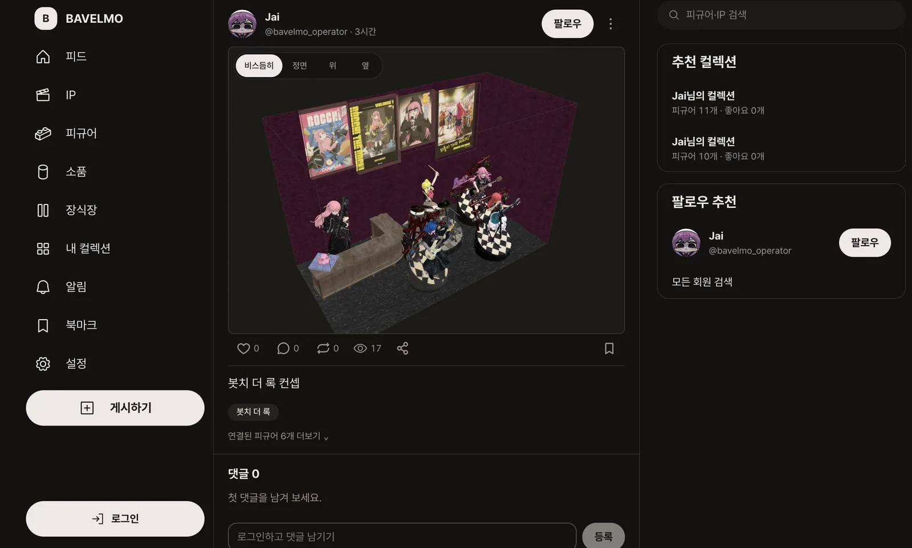
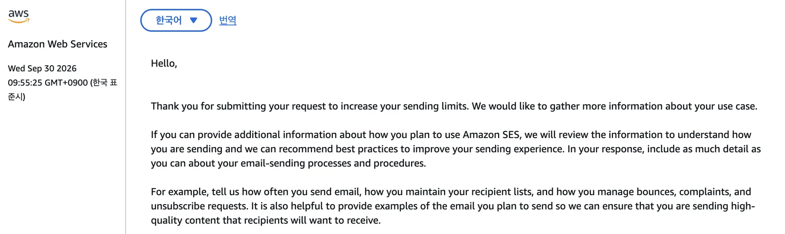
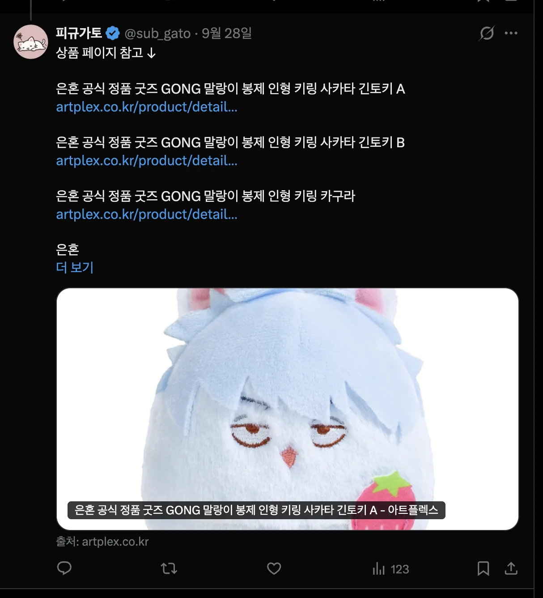
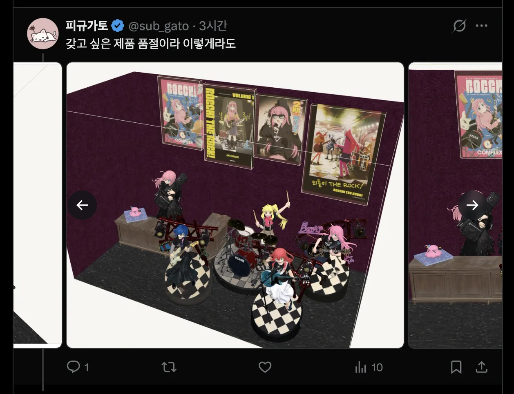

## 서비스 런칭

이 시리즈에서 [기획하던 서비스](../../../09/18/figuroom-landing-survey/)를 배포했습니다. 
컨샙은 피규어 전용 컬렉터 SNS로 IP, 피규어, 전시가 메인입니다.

처음의 프로젝트 기획하고 모두의 창업을 신청하고 [X 채널 개설](../../../09/22/figuroom-x-recommendation/)을 먼저하고 했기에 [블로그 글은 18일](../../../09/18/figuroom-landing-survey/)이여도 실제 개발기간으 21일부터해서 대략 10일만 정도 걸린거 같네요.

MVP를 목적으로 개발하다보니 자세한 기능들의 최적화보다는 빠른 서비스 기준으로 개발되었고 후에 리팩토링을 무조건 한다는 가정으로 진행했습니다
사용자 모집과 개선 + 고도화를 같이 해야겠습니다.

우선 서비스 이름을 Figuroom에서 bavelmo로 변경했습니다.
최근에 브랜드 공부하고자 책을 읽고 난 뒤 이름을 보니 내 마음에 들지 않는 합성어라는 점을 깨닭았죠.
그떄 책을 읽으며 적은 블로그 ["독서 블로그의 브랜드로 남는다는 것"](https://seung.tistory.com/entry/%EB%B8%8C%EB%9E%9C%EB%93%9C%EB%A1%9C-%EB%82%A8%EB%8A%94%EB%8B%A4%EB%8A%94-%EA%B2%83)입니다.

지인이 브랜딩의 교과서 같은 책이라고 해서 재밌게 쭉 읽어봤네요.
원래는 바벨로로 하려했지만 누가 Domain을 선점했고 .com이 가지는 사용자 신뢰성을 버리기 싫어서 바벨모로 바꿨습니다.
뜻은 오타쿠 전용 SNS라는 혼돈의 장을 만들고 싶었고 피규어 전시가 마치 탑과 같은 느낌을 주기도하고 "모"라는 단어가 모으다라는 늬양스를 줄거라고 생각했기 때문이죠.
거기에 일본어에서도 쉽게 말할 수 있으며 3글자라는게 외우기 쉬울거라 생각했습니다.
도메인 사는 과정에서 웬만한건 다 있어서 골치아팠는데 그래서 많은 회사들이 이상한 이름으로 도메인을 판다는 걸 알 수 있게되었죠. 

### 이슈
#### 1. 구글 SES 발급기간 소요 
이전 사이드 프로젝트는 OTT 서비스 공부가 목적이었지만 이번에는 정말 서비스가 목적이었기에 비싸더라도 구글 SMTP가 아닌 Amazon SES를 택했습니다. 생태계가 합쳐져 있으니 쉽게 가능할거라는 판단이었지만 제품 인증단계가 별도로 있는 줄 알았더라면 미리 해둘걸 그랬네요.
그래서 지금은 이메일 회원가입은 임시로 풀어두고, 구글 로그인을 권장하는 상태입니다.

#### 2. 모바일 렌더링
주된 파일들이 3D다보니 모바일쪽에서 랜더링의 시간이 생각이상으로 걸리는 문제가 발생하고 있습니다, PC 기준으로는 신경쓰일 정도가 아니었기에 후에 고도화 범위로 넣으려했짐나 현재 SNS 앱 특성상 모바일 편의성이 중요하니 빠르게 고쳐야겠습니다.

지금 컬렉션 부분에서 랜더링 전에는 피규어들이 이미지로 보이기 때문에 사용자들이 이 3D 컬렉션이 아닌 2D 컬렉션으로 오해하는 상황이 벌어지고 있어서 급히 해야겠습니다.

일단 토스트메시지로 랜더링 중임을 알리는 걸로 대처를 해 적용해뒀습니다.

#### 3. 디자인 외주
라프텔 서비스의 푸밍이이나 당근 모임 서비스의 고양이 캐릭터처럼 사이트 자체의 캐릭터를 만들고 그걸 통해 기본 프로필 사진과 이모티콘 기능을 넣고 싶었습니다.

그래서 디자이너 오픈 채팅이나 서브 컬쳐 모임, 아는 지인들에게 외주 의뢰를 넣어봤습니다.
금방 구해질 줄 알았는데 생각보다 구하는게 어렵더군요 아직 구한지 일주일 정도밖에 지나지 않았으니 좀 더 기다려야봐겠습니다.

## 배포 
Class 프로젝트는 단일 ec2로 부담했기에 편하게 했지만 이번에는 확장성을 고려해야했습니다.
그러다보니 굉장히 복잡해기도했습니다.
또 서버를 Fargate로 선택하여 비용은 더 낼 수 있어도 수평적 확장이 언제든지 가능하게 했습니다.
 사용자 트래픽이 몰리면 자동으로 서버를 늘려주는 점을 높게 봤습니다.

### Stack Yaml

설정한 요소들의 관계를 하나하나 짚으면 너무 많고 추상적이죠.
그리고 추적하기도 어렵습니다 그래서 GPT에게 기술 스택을 정리시키고, 그 정리를 Amazon Q에 넘겨 스택 파일을 만들게 한 다음, 검증하고 실행했습니다. 비밀 키는 파라미토로 두고 프로젝트에는 AWS 스택 YAML로 남기는 방식으로 코드 에이전트가 서버의 구성에 접근할 수 있는 형태로 이번에 가닥을 잡았습니다.

반나절이면 끝날 줄 알았는데, 버그도 고치고 기능도 추가하고 배포 설정도 하느라 새벽까지 달렸었네요.

GPT에 정리시킨 범위는 이 정도였습니다. 가상 네트워크와 보안 그룹, 운영 DB와 이미지 파일 저장, 가입 메일서버와 구글 로그인, Fargate로 띄운 API와 웹, 그리고 도메인과 배포 권한, 장애 알람입니다. Amazon Q는 이 목록을 보고 스택 파일을 생성하게 했죠. 

가장 좋은 점은 서버 환경이 텍스트로 보여진다느게 Stack Yaml 기능의 가장 장점이네요.

## 홍보 
### 근황
처음 x에 글을 올리고 그래도 팔로워가 4명생겼습니다. 
9월 19일에 글을 올리고 여태까지 총 104개의 게시물을 적었습니다.
걱정하던 조회수 문제도 100이상 쌓이는 등 천천히 성장하고 있는거 같군요. 

그리고 3일전에 올린글이 조회수 100을 넘는 것처럼 점차 속도가 붙는거 같아서 한편으로 안심이 되네요.

### 진행방향
앞으로는 바벨모 서비스를 통해 피규어를 3D로 보여주게해서 꾸준한 트래픽 유도를 조성하려합니다.
그래서 사람들이 관심있어하는 애니, 피규어 쪽으로 제품을 게시해야죠.
하지만 너무 이것만하면 사이트 홍보성이 짙어지니 정보성도 꾸준히 유지해야겠습니다.
복잡해지지만 재밌네요.

