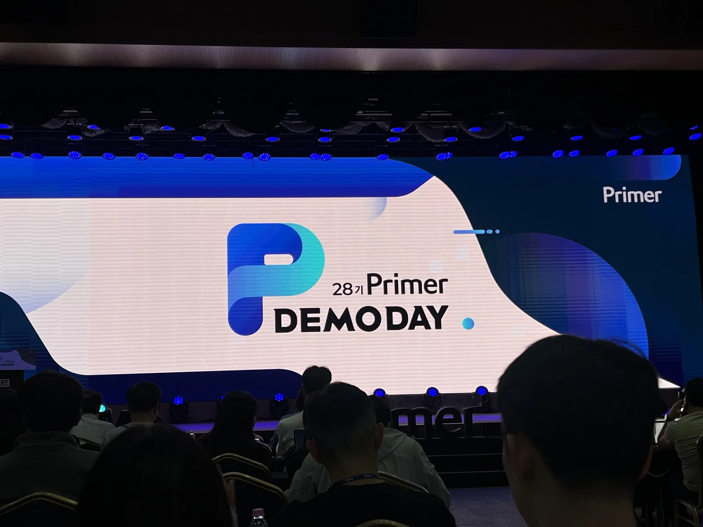
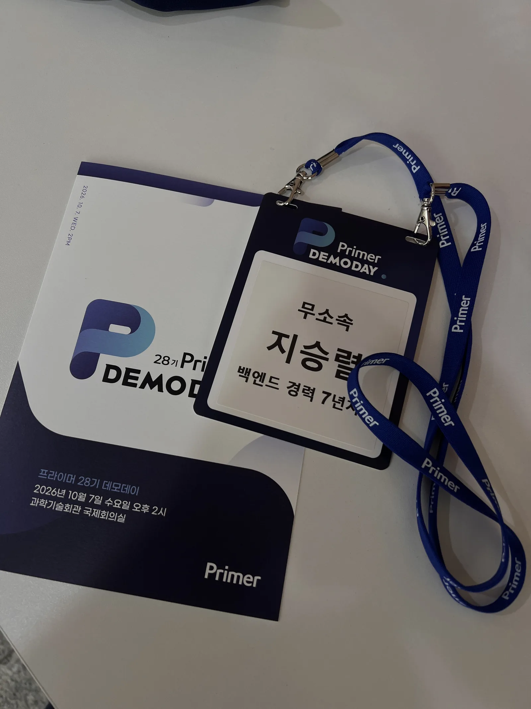

## 프라이머 데모데이
처음 모두의 창업으로 프라이머라는 곳을 알게 되고 그 후에는 모두의창업에서 프라이머만 독보적인 경쟁률을 보여준 점으로 인해 관심이 갔습니다.. 
최종적으로 내 포지션에서는 대학교가 멘토로 좋을 듯해 동국대로 신청했었지만 프라이머에 관심이 가게 되었고 데모데이가 있다는 점을 알게 되어 바로 신청했죠.

처음에는 액셀레이터나 투자자들만 오는 곳으로 기대를 별로 안했지만 오늘 가서 보니 굉장히 규모가 컸습니다. 
사전 신청자만 1100명이고 현장에서 신청자를 받으니 엄청난 규모임에는 틀림이 없었다.

아래처럼 기타 내용이 나오는 줄 알았다면 경력을 안 적었을 겁니다. 
굉장히 창피하네요.

### 목표
> 무엇을 배워 올 건가

프라이머라는 액셀레이터는 국내에서 꽤나 긴 기간 살아 오면서 축적되어 온 노하우가 분명히 있고 나와 같은 창업을 꿈꾸는 사람을 매우 많이 만나봤음이 분명하죠. 
이곳에 내가 당장 가져갈 수 있는 게 무엇일까 생각했을 때 아래와 같다고 생각했습니다.

1. 발표자들은 문제 정의를 어떻게 하는가?
2. 그 문제를 어떻게 차별화되게 풀었는가?
3. 비즈니스 모델을 어떻게 단단히 구체화시켰을까?
4. PR하는 자세나 방법

그래서 위 네 부분을 집중적으로 진행을 들었죠.

### 데모데이 구성
꽤나 많은 9개의 회사가 진행을 했습니다. 
이를 하나씩 설명하는 건 위의 목표에 퇴색된다고 느껴졌기 때문에 결정적으로 느낀 4개의 장점을 중심으로 엮어서 정리하겠습니다.

1. 시장이 좁은 건 문제가 되지 않는다 
바운드원은 테니스+영상 편집이라는 좁은 시장이지만 전 세계를 타게팅해서 놓칠 수 있는 베트남 시장까지 선점하고 버디파이는 일본 여성 관광객의 고객의 니즈를 정확히 타게팅했습니다. 
이들이 타겟으로 잡은 요소들은 그것만으로 보면 정말 좁은 영역이라는 생각이 들지만 이들은 이를 완벽히 타겟팅해서 돈을 낼 수 있는 사람으로 발전시켰습니다.

> 제가 개발 중인 Bavelmo 또한 핵심 고객층을 잡아야 합니다.

2. 숫자가 뻔한 아이디어를 증명한다. 
후커블은 AI로 상품 페이지를 만드는 뻔한 아이디어입니다. 
하지만 그 뻔하지만 확실한 니즈가 존재하는 시장에서 성능과 입소문으로 1등을 차지했습니다. 
프라이머의 파트너들 또한 메모로 "뻔한 서비스"라고 메모했을 정도였지만, 후커블은 숫자로 증명했죠.

> 제 서비스가 뻔하다면 성능으로 이해시켜야 합니다.

3. 좋은 사업에는 남는 것이 있다. 
바운드원에는 자체 AI 모델과 특허가 있었고, 
월티에는 430개 단지를 연결하며 쌓은 데이터가 있었고, 
뷔욘드에는 인터뷰 데이터가 지식 자산으로 쌓이고 있습니다.

사업 자체를 몇십 년 생각할 필요 없이 몇 년 하고 끝낸 뒤 남는 것을 통해 다음 사업을 이어간다. 
이미 이 사업에 데모로 나온 사람들은 수차례 사업을 재시도한 사람들이 나오기도 합니다. 
그리고 그들이 다시 시도해서 데모데이에 나올 수 있던 이유는 각 사업들이 진행되고 남는 게 있었기 때문이죠.

> 제 경우, AI 사스 서비스들이 가지고 있는 자체 모델을 보며 이점을 크게 느꼈습니다.

4. 창업자의 경험이 곧 서비스가 된다. 
데모데이에 나온 사업들을 보면 그 서비스를 만든 근거가 이력에 일부 녹아 있다는 공통점을 느꼈습니다. 
누구는 테니스를 좋아해서, 누구는 브랜딩에 관심 있어서 등등 대표가 아닌 팀원이라도 관련된 사람들이 녹아 있는 게 당연히 보였죠.

> 저도 제가 잘 아는 부분을 찾아야 합니다.

### QnA

이런 질문 시간을 안 할 이유가 없었죠. 빠르게 나간 덕분에 앞에서 3번째 자리로 질문을 해보는 시간을 가져볼 수 있었습니다. 
안 떨렸다고 할 순 없지만 돌아봤을 때는 겉으로 보기에 굉장히 여유롭게 톤도 괜찮았고 질문의 기승전결로 90퍼센트는 만족할 수 있었습니다.

10퍼센트 아쉬운 점은 제 Bavelmo 서비스를 간단히 컬렉터 전용 SNS라고만 해서 파트너들이 보기에는 사실 부질없어 보일 수밖에 없도록 말을 전했다는 점입니다. 
첫인상이 중요하다는 점을 제가 잊었습니다. 다음에도 이런 기회가 있다면 더 제 서비스를 어필하도록 노력해야겠더군요.

QnA에서 흥미로운 부분은 다음과 같습니다.

1. 작은 집단을 미치게 만들어야 한다. 
특히 제 서비스는 일종의 크리에이터로 할 만한 핵심 코어층이 중요합니다. 이들을 설득할 수 있는 기능이 필요합니다. 
사람들에게 보여주면 좋은 말만 해준다, 그들의 반응이 좋다는 건 별로 좋지 않은 신호다, 열광돼야 할 만하다.
2. 린 스타트업 
사용자들이 열광하는 그 무언가를 계속 찾아야 한다. 내 사업이 여기서 끝나는 게 아닌 계속 개발하며 다른 아이디어를 만들 수도 있는데, 이점을 기억해 두자

> 제가 가진 무기인 개발과 서브컬처와 컬렉팅 지식을 살려서 사람들이 열광할 수 있는 무기를 만들어야겠습니다.